# GPT Image 2 Hub · AI Image Inspiration Atlas

A curated atlas of GPT Image 2 generations. Every work ships with its full prompt — copy and remix.

**156 topics · 205 packages · 1236 works** · [简体中文](./README.zh-CN.md)

## 🔤 Typography & Text

### [Fictional Symbol System](https://gpt-image-2-hub-seven.vercel.app/#t-fictional-symbol-system) · 8

> A Prompt Atlas theme for invented writing systems, pseudo-archaeological artifacts, and decoder-like layouts that test controlled glyph design.

<table>
<tr>
<td width="33%" valign="top" align="center">

<b><a href="https://gpt-image-2-hub-seven.vercel.app/#m-fictional-symbol-system%2Fseries-inscription-grammar%2F01-core-tablet">Core Tablet</a></b>

</td>
<td width="33%" valign="top" align="center">

<b><a href="https://gpt-image-2-hub-seven.vercel.app/#m-fictional-symbol-system%2Fsingle-decoder-artifacts%2Foracle-bone-panel">Oracle Bone Panel</a></b>

</td>
<td width="33%" valign="top" align="center">

<b><a href="https://gpt-image-2-hub-seven.vercel.app/#m-fictional-symbol-system%2Fseries-inscription-grammar%2F02-ritual-map">Ritual Map</a></b>

</td>
</tr>
<tr>
<td width="33%" valign="top" align="center">

<b><a href="https://gpt-image-2-hub-seven.vercel.app/#m-fictional-symbol-system%2Fsingle-decoder-artifacts%2Fmayan-star-disk">Mayan Star Disk</a></b>

</td>
<td width="33%" valign="top" align="center">

<b><a href="https://gpt-image-2-hub-seven.vercel.app/#m-fictional-symbol-system%2Fseries-inscription-grammar%2F03-jade-seal">Jade Seal</a></b>

</td>
<td width="33%" valign="top" align="center">

<b><a href="https://gpt-image-2-hub-seven.vercel.app/#m-fictional-symbol-system%2Fsingle-decoder-artifacts%2Frune-field-guide">Rune Field Guide</a></b>

</td>
</tr>
</table>

### [Multi-Script Poster](https://gpt-image-2-hub-seven.vercel.app/#t-multi-script-poster) · 8

> A Prompt Atlas theme for posters and public-information layouts that place many writing systems in one controlled composition.

<table>
<tr>
<td width="33%" valign="top" align="center">

<b><a href="https://gpt-image-2-hub-seven.vercel.app/#m-multi-script-poster%2Fsingle-global-script-posters%2F01-market-menu-wall">Market Menu Wall</a></b>

</td>
<td width="33%" valign="top" align="center">

<b><a href="https://gpt-image-2-hub-seven.vercel.app/#m-multi-script-poster%2Fsingle-global-script-posters%2F02-un-assembly-agenda">Assembly Agenda</a></b>

</td>
<td width="33%" valign="top" align="center">

<b><a href="https://gpt-image-2-hub-seven.vercel.app/#m-multi-script-poster%2Fsingle-global-script-posters%2F03-airport-wayfinding-grid">Airport Wayfinding Grid</a></b>

</td>
</tr>
<tr>
<td width="33%" valign="top" align="center">

<b><a href="https://gpt-image-2-hub-seven.vercel.app/#m-multi-script-poster%2Fsingle-global-script-posters%2F04-museum-exhibition-poster">Museum Exhibition Poster</a></b>

</td>
<td width="33%" valign="top" align="center">

<b><a href="https://gpt-image-2-hub-seven.vercel.app/#m-multi-script-poster%2Fsingle-global-script-posters%2F05-night-market-festival">Night Market Festival</a></b>

</td>
<td width="33%" valign="top" align="center">

<b><a href="https://gpt-image-2-hub-seven.vercel.app/#m-multi-script-poster%2Fsingle-global-script-posters%2F06-clinic-service-board">Clinic Service Board</a></b>

</td>
</tr>
</table>

### [Micro-Engraved Jewelry](https://gpt-image-2-hub-seven.vercel.app/#t-micro-engraved-jewelry) · 8

> A Prompt Atlas theme for pixel-level inscription placement on jewelry and tiny luxury objects, testing readable micro text, macro material realism, and commercial emotional value.

<table>
<tr>
<td width="33%" valign="top" align="center">

<b><a href="https://gpt-image-2-hub-seven.vercel.app/#m-micro-engraved-jewelry%2Fseries-inner-ring-inscription%2F01-reference-ring">Reference Ring</a></b>

</td>
<td width="33%" valign="top" align="center">

<b><a href="https://gpt-image-2-hub-seven.vercel.app/#m-micro-engraved-jewelry%2Fsingle-micro-inscription-studies%2Fnamed-rice-grain">Named Rice Grain</a></b>

</td>
<td width="33%" valign="top" align="center">

<b><a href="https://gpt-image-2-hub-seven.vercel.app/#m-micro-engraved-jewelry%2Fseries-inner-ring-inscription%2F02-wedding-band-gold">Wedding Band Gold</a></b>

</td>
</tr>
<tr>
<td width="33%" valign="top" align="center">

<b><a href="https://gpt-image-2-hub-seven.vercel.app/#m-micro-engraved-jewelry%2Fsingle-micro-inscription-studies%2Flocket-edge-script">Locket Edge Script</a></b>

</td>
<td width="33%" valign="top" align="center">

<b><a href="https://gpt-image-2-hub-seven.vercel.app/#m-micro-engraved-jewelry%2Fseries-inner-ring-inscription%2F03-sapphire-shadow">Sapphire Shadow</a></b>

</td>
<td width="33%" valign="top" align="center">

<b><a href="https://gpt-image-2-hub-seven.vercel.app/#m-micro-engraved-jewelry%2Fsingle-micro-inscription-studies%2Fwatch-gear-initials">Watch Gear Initials</a></b>

</td>
</tr>
</table>

### [JSON Business Card](https://gpt-image-2-hub-seven.vercel.app/#t-json-business-card) · 8

> A Prompt Atlas theme for business cards where the contact identity is rendered as a precise JSON code block on a physical printed object.

<table>
<tr>
<td width="33%" valign="top" align="center">

<b><a href="https://gpt-image-2-hub-seven.vercel.app/#m-json-business-card%2Fsingle-code-object-cards%2Ffoil-founder-card">Foil Founder Card</a></b>

</td>
<td width="33%" valign="top" align="center">

<b><a href="https://gpt-image-2-hub-seven.vercel.app/#m-json-business-card%2Fsingle-code-object-cards%2Fdark-mode-card">Dark Mode Card</a></b>

</td>
<td width="33%" valign="top" align="center">

<b><a href="https://gpt-image-2-hub-seven.vercel.app/#m-json-business-card%2Fsingle-code-object-cards%2Ftranslucent-acrylic-card">Translucent Acrylic Card</a></b>

</td>
</tr>
<tr>
<td width="33%" valign="top" align="center">

<b><a href="https://gpt-image-2-hub-seven.vercel.app/#m-json-business-card%2Fsingle-code-object-cards%2Fletterpress-code-card">Letterpress Code Card</a></b>

</td>
<td width="33%" valign="top" align="center">

<b><a href="https://gpt-image-2-hub-seven.vercel.app/#m-json-business-card%2Fsingle-code-object-cards%2Fembossed-api-card">Embossed API Card</a></b>

</td>
<td width="33%" valign="top" align="center">

<b><a href="https://gpt-image-2-hub-seven.vercel.app/#m-json-business-card%2Fsingle-code-object-cards%2Fminimal-white-card">Minimal White Card</a></b>

</td>
</tr>
</table>

### [Archive Aesthetic File](https://gpt-image-2-hub-seven.vercel.app/#t-archive-aesthetic-file) · 8

> A Prompt Atlas theme for Archive Aesthetic File, testing text-rendering, structured-layout with GPT Image 2.

<table>
<tr>
<td width="33%" valign="top" align="center">

<b><a href="https://gpt-image-2-hub-seven.vercel.app/#m-archive-aesthetic-file%2Fsingle-archive-aesthetic-file-studies%2Fhero-spread">Hero Spread</a></b>

</td>
<td width="33%" valign="top" align="center">

<b><a href="https://gpt-image-2-hub-seven.vercel.app/#m-archive-aesthetic-file%2Fsingle-archive-aesthetic-file-studies%2Fvariant-grid">Variant Grid</a></b>

</td>
<td width="33%" valign="top" align="center">

<b><a href="https://gpt-image-2-hub-seven.vercel.app/#m-archive-aesthetic-file%2Fsingle-archive-aesthetic-file-studies%2Fdesk-review">Desk Review</a></b>

</td>
</tr>
<tr>
<td width="33%" valign="top" align="center">

<b><a href="https://gpt-image-2-hub-seven.vercel.app/#m-archive-aesthetic-file%2Fsingle-archive-aesthetic-file-studies%2Fmaterial-closeup">Material Closeup</a></b>

</td>
<td width="33%" valign="top" align="center">

<b><a href="https://gpt-image-2-hub-seven.vercel.app/#m-archive-aesthetic-file%2Fsingle-archive-aesthetic-file-studies%2Farchive-sheet">Archive Sheet</a></b>

</td>
<td width="33%" valign="top" align="center">

<b><a href="https://gpt-image-2-hub-seven.vercel.app/#m-archive-aesthetic-file%2Fsingle-archive-aesthetic-file-studies%2Fretail-presentation">陈列展示</a></b>

</td>
</tr>
</table>

### [Old Newspaper Front Page](https://gpt-image-2-hub-seven.vercel.app/#t-old-newspaper-front-page) · 8

> A Prompt Atlas theme for Old Newspaper Front Page, testing text-rendering, structured-layout, commercial-mockup with GPT Image 2.

<table>
<tr>
<td width="33%" valign="top" align="center">

<b><a href="https://gpt-image-2-hub-seven.vercel.app/#m-old-newspaper-front-page%2Fsingle-old-newspaper-front-page-studies%2Fhero-spread">Hero Spread</a></b>

</td>
<td width="33%" valign="top" align="center">

<b><a href="https://gpt-image-2-hub-seven.vercel.app/#m-old-newspaper-front-page%2Fsingle-old-newspaper-front-page-studies%2Fvariant-grid">Variant Grid</a></b>

</td>
<td width="33%" valign="top" align="center">

<b><a href="https://gpt-image-2-hub-seven.vercel.app/#m-old-newspaper-front-page%2Fsingle-old-newspaper-front-page-studies%2Fdesk-review">Desk Review</a></b>

</td>
</tr>
<tr>
<td width="33%" valign="top" align="center">

<b><a href="https://gpt-image-2-hub-seven.vercel.app/#m-old-newspaper-front-page%2Fsingle-old-newspaper-front-page-studies%2Fmaterial-closeup">Material Closeup</a></b>

</td>
<td width="33%" valign="top" align="center">

<b><a href="https://gpt-image-2-hub-seven.vercel.app/#m-old-newspaper-front-page%2Fsingle-old-newspaper-front-page-studies%2Farchive-sheet">Archive Sheet</a></b>

</td>
<td width="33%" valign="top" align="center">

<b><a href="https://gpt-image-2-hub-seven.vercel.app/#m-old-newspaper-front-page%2Fsingle-old-newspaper-front-page-studies%2Fretail-presentation">陈列展示</a></b>

</td>
</tr>
</table>

### [Type Specimen Book](https://gpt-image-2-hub-seven.vercel.app/#t-type-specimen-book) · 8

> A Prompt Atlas theme for Type Specimen Book, testing text-rendering with GPT Image 2.

<table>
<tr>
<td width="33%" valign="top" align="center">

<b><a href="https://gpt-image-2-hub-seven.vercel.app/#m-type-specimen-book%2Fsingle-type-specimen-book-studies%2Fhero-spread">Hero Spread</a></b>

</td>
<td width="33%" valign="top" align="center">

<b><a href="https://gpt-image-2-hub-seven.vercel.app/#m-type-specimen-book%2Fsingle-type-specimen-book-studies%2Fvariant-grid">Variant Grid</a></b>

</td>
<td width="33%" valign="top" align="center">

<b><a href="https://gpt-image-2-hub-seven.vercel.app/#m-type-specimen-book%2Fsingle-type-specimen-book-studies%2Fdesk-review">Desk Review</a></b>

</td>
</tr>
<tr>
<td width="33%" valign="top" align="center">

<b><a href="https://gpt-image-2-hub-seven.vercel.app/#m-type-specimen-book%2Fsingle-type-specimen-book-studies%2Fmaterial-closeup">Material Closeup</a></b>

</td>
<td width="33%" valign="top" align="center">

<b><a href="https://gpt-image-2-hub-seven.vercel.app/#m-type-specimen-book%2Fsingle-type-specimen-book-studies%2Farchive-sheet">Archive Sheet</a></b>

</td>
<td width="33%" valign="top" align="center">

<b><a href="https://gpt-image-2-hub-seven.vercel.app/#m-type-specimen-book%2Fsingle-type-specimen-book-studies%2Fretail-presentation">陈列展示</a></b>

</td>
</tr>
</table>

### [Ambigram Readability](https://gpt-image-2-hub-seven.vercel.app/#t-ambigram-readability) · 8

> A Prompt Atlas theme for testing whether generated lettering can remain readable as a deliberate ambigram under rotation, mirror logic, and material constraints.

<table>
<tr>
<td width="33%" valign="top" align="center">

<b><a href="https://gpt-image-2-hub-seven.vercel.app/#m-ambigram-readability%2Fsingle-ambigram-studies%2Fgpt-image-gothic-plaque">GPT Image Gothic Plaque</a></b>

</td>
<td width="33%" valign="top" align="center">

<b><a href="https://gpt-image-2-hub-seven.vercel.app/#m-ambigram-readability%2Fsingle-ambigram-studies%2Fatlas-tattoo-stencil">Atlas Tattoo Stencil</a></b>

</td>
<td width="33%" valign="top" align="center">

<b><a href="https://gpt-image-2-hub-seven.vercel.app/#m-ambigram-readability%2Fsingle-ambigram-studies%2Frise-fall-poster">Rise Fall Poster</a></b>

</td>
</tr>
<tr>
<td width="33%" valign="top" align="center">

<b><a href="https://gpt-image-2-hub-seven.vercel.app/#m-ambigram-readability%2Fsingle-ambigram-studies%2Fflow-wave-ring">Flow Wave Ring</a></b>

</td>
<td width="33%" valign="top" align="center">

<b><a href="https://gpt-image-2-hub-seven.vercel.app/#m-ambigram-readability%2Fsingle-ambigram-studies%2Fcode-arts-logo">Code Arts Logo</a></b>

</td>
<td width="33%" valign="top" align="center">

<b><a href="https://gpt-image-2-hub-seven.vercel.app/#m-ambigram-readability%2Fsingle-ambigram-studies%2Fdream-awake-neon">Dream Awake Neon</a></b>

</td>
</tr>
</table>

### [Pseudo-Real Documents](https://gpt-image-2-hub-seven.vercel.app/#t-pseudo-real-documents) · 8

> A Prompt Atlas theme for fictional specimen documents that test readable typography, paper physics, print texture, stamps, handwriting, and commercial mockup realism.

<table>
<tr>
<td width="33%" valign="top" align="center">

<b><a href="https://gpt-image-2-hub-seven.vercel.app/#m-pseudo-real-documents%2Fsingle-document-specimens%2Fspecimen-boarding-pass">Specimen Boarding Pass</a></b>

</td>
<td width="33%" valign="top" align="center">

<b><a href="https://gpt-image-2-hub-seven.vercel.app/#m-pseudo-real-documents%2Fsingle-document-specimens%2Fpassport-stamp-spread">Passport Stamp Spread</a></b>

</td>
<td width="33%" valign="top" align="center">

<b><a href="https://gpt-image-2-hub-seven.vercel.app/#m-pseudo-real-documents%2Fsingle-document-specimens%2Ftcm-herbal-note">Herbal Study Note</a></b>

</td>
</tr>
<tr>
<td width="33%" valign="top" align="center">

<b><a href="https://gpt-image-2-hub-seven.vercel.app/#m-pseudo-real-documents%2Fsingle-document-specimens%2Fcalligraphy-copybook">Calligraphy Copybook</a></b>

</td>
<td width="33%" valign="top" align="center">

<b><a href="https://gpt-image-2-hub-seven.vercel.app/#m-pseudo-real-documents%2Fsingle-document-specimens%2Fpalm-reading-report">Palm Reading Report</a></b>

</td>
<td width="33%" valign="top" align="center">

<b><a href="https://gpt-image-2-hub-seven.vercel.app/#m-pseudo-real-documents%2Fsingle-document-specimens%2Fmuseum-ticket-receipt">Museum Ticket Receipt</a></b>

</td>
</tr>
</table>

## 📖 Narrative & Sequence

### [Crystal Ball Narrative](https://gpt-image-2-hub-seven.vercel.app/#t-crystal-ball-narrative) · 4

> A Prompt Atlas theme for compressing changing miniature worlds into one consistent crystal ball object.

<table>
<tr>
<td width="33%" valign="top" align="center">

<b><a href="https://gpt-image-2-hub-seven.vercel.app/#m-crystal-ball-narrative%2Fseries-oracle-seasons%2F01-reference-oracle">Reference Oracle</a></b>

</td>
<td width="33%" valign="top" align="center">

<b><a href="https://gpt-image-2-hub-seven.vercel.app/#m-crystal-ball-narrative%2Fseries-oracle-seasons%2F02-spring-oracle">Spring Oracle</a></b>

</td>
<td width="33%" valign="top" align="center">

<b><a href="https://gpt-image-2-hub-seven.vercel.app/#m-crystal-ball-narrative%2Fseries-oracle-seasons%2F03-autumn-oracle">Autumn Oracle</a></b>

</td>
</tr>
</table>

### [Silhouette Universe](https://gpt-image-2-hub-seven.vercel.app/#t-silhouette-universe) · 3

> A Prompt Atlas theme for symbolic compositions where a crisp black silhouette becomes a container for an entire narrative world.

<table>
<tr>
<td width="33%" valign="top" align="center">

<b><a href="https://gpt-image-2-hub-seven.vercel.app/#m-silhouette-universe%2Fsingle-silhouette-studies%2Ftower-at-dusk">Tower at Dusk</a></b>

</td>
<td width="33%" valign="top" align="center">

<b><a href="https://gpt-image-2-hub-seven.vercel.app/#m-silhouette-universe%2Fsingle-silhouette-studies%2Fdoorway-threshold">Doorway Threshold</a></b>

</td>
<td width="33%" valign="top" align="center">

<b><a href="https://gpt-image-2-hub-seven.vercel.app/#m-silhouette-universe%2Fsingle-silhouette-studies%2Fskull-memento">Skull Memento</a></b>

</td>
</tr>
</table>

### [Eight-Panel Consistency Comic](https://gpt-image-2-hub-seven.vercel.app/#t-eight-panel-consistency-comic) · 7

> A Prompt Atlas theme for multi-panel comics that keep character identity, product props, layout rhythm, and visual style consistent.

<table>
<tr>
<td width="33%" valign="top" align="center">

<b><a href="https://gpt-image-2-hub-seven.vercel.app/#m-eight-panel-consistency-comic%2Fseries-launch-comic%2F01-reference-hero-orb-page">Reference Hero Orb Page</a></b>

</td>
<td width="33%" valign="top" align="center">

<b><a href="https://gpt-image-2-hub-seven.vercel.app/#m-eight-panel-consistency-comic%2Fsingle-comic-studies%2Fproduct-demo-board">Product Demo Board</a></b>

</td>
<td width="33%" valign="top" align="center">

<b><a href="https://gpt-image-2-hub-seven.vercel.app/#m-eight-panel-consistency-comic%2Fseries-launch-comic%2F02-rooftop-launch-page">Rooftop Launch Page</a></b>

</td>
</tr>
<tr>
<td width="33%" valign="top" align="center">

<b><a href="https://gpt-image-2-hub-seven.vercel.app/#m-eight-panel-consistency-comic%2Fsingle-comic-studies%2Fcharacter-turnaround-comic">Character Turnaround Comic</a></b>

</td>
<td width="33%" valign="top" align="center">

<b><a href="https://gpt-image-2-hub-seven.vercel.app/#m-eight-panel-consistency-comic%2Fseries-launch-comic%2F03-studio-demo-page">Studio Demo Page</a></b>

</td>
<td width="33%" valign="top" align="center">

<b><a href="https://gpt-image-2-hub-seven.vercel.app/#m-eight-panel-consistency-comic%2Fsingle-comic-studies%2Flaunch-storefront-comic">Launch Storefront Comic</a></b>

</td>
</tr>
</table>

### [Time-Space Contrast](https://gpt-image-2-hub-seven.vercel.app/#t-time-space-contrast) · 8

> A Prompt Atlas theme for photoreal historical scenes where carefully researched period dress collides with modern technology in wide cinematic compositions.

<table>
<tr>
<td width="33%" valign="top" align="center">

<b><a href="https://gpt-image-2-hub-seven.vercel.app/#m-time-space-contrast%2Fseries-scholar-tech-desk%2F01-reference-scholar-desk">Reference Scholar Desk</a></b>

</td>
<td width="33%" valign="top" align="center">

<b><a href="https://gpt-image-2-hub-seven.vercel.app/#m-time-space-contrast%2Fsingle-historical-tech-collisions%2F01-qing-vr-parlor">Qing VR Parlor</a></b>

</td>
<td width="33%" valign="top" align="center">

<b><a href="https://gpt-image-2-hub-seven.vercel.app/#m-time-space-contrast%2Fseries-scholar-tech-desk%2F02-pocket-glass-message">Pocket Glass Message</a></b>

</td>
</tr>
<tr>
<td width="33%" valign="top" align="center">

<b><a href="https://gpt-image-2-hub-seven.vercel.app/#m-time-space-contrast%2Fsingle-historical-tech-collisions%2F02-tang-poet-mobile-game">Tang Poet Mobile Game</a></b>

</td>
<td width="33%" valign="top" align="center">

<b><a href="https://gpt-image-2-hub-seven.vercel.app/#m-time-space-contrast%2Fseries-scholar-tech-desk%2F03-vr-astronomy-lesson">VR Astronomy Lesson</a></b>

</td>
<td width="33%" valign="top" align="center">

<b><a href="https://gpt-image-2-hub-seven.vercel.app/#m-time-space-contrast%2Fsingle-historical-tech-collisions%2F03-han-courier-drone">Han Courier Drone</a></b>

</td>
</tr>
</table>

### [Film Storyboard Sequence](https://gpt-image-2-hub-seven.vercel.app/#t-film-storyboard-sequence) · 8

> A Prompt Atlas theme for cinematic storyboard sheets with multi-panel shot planning, camera-movement arrows, physical action continuity, and production-board hierarchy.

<table>
<tr>
<td width="33%" valign="top" align="center">

<b><a href="https://gpt-image-2-hub-seven.vercel.app/#m-film-storyboard-sequence%2Fseries-rain-alley-storyboards%2F01-reference-alley-board">Reference Alley Board</a></b>

</td>
<td width="33%" valign="top" align="center">

<b><a href="https://gpt-image-2-hub-seven.vercel.app/#m-film-storyboard-sequence%2Fsingle-production-storyboards%2F01-glass-spill-commercial">Glass Spill Commercial</a></b>

</td>
<td width="33%" valign="top" align="center">

<b><a href="https://gpt-image-2-hub-seven.vercel.app/#m-film-storyboard-sequence%2Fseries-rain-alley-storyboards%2F02-market-pursuit-board">Market Pursuit Board</a></b>

</td>
</tr>
<tr>
<td width="33%" valign="top" align="center">

<b><a href="https://gpt-image-2-hub-seven.vercel.app/#m-film-storyboard-sequence%2Fsingle-production-storyboards%2F02-perfume-caustic-mockup">Perfume Caustic Mockup</a></b>

</td>
<td width="33%" valign="top" align="center">

<b><a href="https://gpt-image-2-hub-seven.vercel.app/#m-film-storyboard-sequence%2Fseries-rain-alley-storyboards%2F03-rooftop-reveal-board">Rooftop Reveal Board</a></b>

</td>
<td width="33%" valign="top" align="center">

<b><a href="https://gpt-image-2-hub-seven.vercel.app/#m-film-storyboard-sequence%2Fsingle-production-storyboards%2F03-rescue-drone-warehouse">Rescue Drone Warehouse</a></b>

</td>
</tr>
</table>

### [Cinematic Story Portrait Sequence](https://gpt-image-2-hub-seven.vercel.app/#t-cinematic-story-portrait-sequence) · 9

> Build portrait sequences that feel like stills from a character-driven film, with emotional continuity, scene logic, and camera-language variation.

<table>
<tr>
<td width="33%" valign="top" align="center">

<b><a href="https://gpt-image-2-hub-seven.vercel.app/#m-cinematic-story-portrait-sequence%2Fseries-cinematic-portrait-lock%2F01-reference-character-anchor">Reference Character Anchor</a></b>

</td>
<td width="33%" valign="top" align="center">

<b><a href="https://gpt-image-2-hub-seven.vercel.app/#m-cinematic-story-portrait-sequence%2Fseries-cinematic-portrait-lock%2F02-interior-scene">Interior Scene</a></b>

</td>
<td width="33%" valign="top" align="center">

<b><a href="https://gpt-image-2-hub-seven.vercel.app/#m-cinematic-story-portrait-sequence%2Fseries-cinematic-portrait-lock%2F03-transition-pause">Transition Pause</a></b>

</td>
</tr>
<tr>
<td width="33%" valign="top" align="center">

<b><a href="https://gpt-image-2-hub-seven.vercel.app/#m-cinematic-story-portrait-sequence%2Fseries-cinematic-portrait-lock%2F04-closeup-emotion">Close-up Emotion</a></b>

</td>
<td width="33%" valign="top" align="center">

<b><a href="https://gpt-image-2-hub-seven.vercel.app/#m-cinematic-story-portrait-sequence%2Fseries-cinematic-portrait-lock%2F05-exterior-walk">Exterior Walk</a></b>

</td>
<td width="33%" valign="top" align="center">

<b><a href="https://gpt-image-2-hub-seven.vercel.app/#m-cinematic-story-portrait-sequence%2Fseries-cinematic-portrait-lock%2F06-profile-shadow">Profile Shadow</a></b>

</td>
</tr>
<tr>
<td width="33%" valign="top" align="center">

<b><a href="https://gpt-image-2-hub-seven.vercel.app/#m-cinematic-story-portrait-sequence%2Fseries-cinematic-portrait-lock%2F07-detail-prop-frame">Detail Prop Frame</a></b>

</td>
<td width="33%" valign="top" align="center">

<b><a href="https://gpt-image-2-hub-seven.vercel.app/#m-cinematic-story-portrait-sequence%2Fseries-cinematic-portrait-lock%2F08-poster-crop">Poster Crop</a></b>

</td>
<td width="33%" valign="top" align="center">

<b><a href="https://gpt-image-2-hub-seven.vercel.app/#m-cinematic-story-portrait-sequence%2Fseries-cinematic-portrait-lock%2F09-finale-aftermath">Finale Aftermath</a></b>

</td>
</tr>
</table>

### [Boss Arena Phase Keyframes](https://gpt-image-2-hub-seven.vercel.app/#t-boss-arena-phase-keyframes) · 9

> Capture a boss encounter through phase-based arena keyframes so the space, mechanics, and escalation are readable before the player ever fights it.

<table>
<tr>
<td width="33%" valign="top" align="center">

<b><a href="https://gpt-image-2-hub-seven.vercel.app/#m-boss-arena-phase-keyframes%2Fseries-boss-phase-core%2F01-reference-intro-phase">Reference Intro Phase</a></b>

</td>
<td width="33%" valign="top" align="center">

<b><a href="https://gpt-image-2-hub-seven.vercel.app/#m-boss-arena-phase-keyframes%2Fsingle-boss-support-studies%2Fmechanic-floor-board">Mechanic Floor Board</a></b>

</td>
<td width="33%" valign="top" align="center">

<b><a href="https://gpt-image-2-hub-seven.vercel.app/#m-boss-arena-phase-keyframes%2Fseries-boss-phase-core%2F02-mechanic-reveal">Mechanic Reveal</a></b>

</td>
</tr>
<tr>
<td width="33%" valign="top" align="center">

<b><a href="https://gpt-image-2-hub-seven.vercel.app/#m-boss-arena-phase-keyframes%2Fsingle-boss-support-studies%2Fboss-intro-wide">Boss Intro Wide</a></b>

</td>
<td width="33%" valign="top" align="center">

<b><a href="https://gpt-image-2-hub-seven.vercel.app/#m-boss-arena-phase-keyframes%2Fseries-boss-phase-core%2F03-phase-two-collapse">Phase Two Collapse</a></b>

</td>
<td width="33%" valign="top" align="center">

<b><a href="https://gpt-image-2-hub-seven.vercel.app/#m-boss-arena-phase-keyframes%2Fsingle-boss-support-studies%2Fcollapse-overhead">Collapse Overhead</a></b>

</td>
</tr>
<tr>
<td width="33%" valign="top" align="center">

<b><a href="https://gpt-image-2-hub-seven.vercel.app/#m-boss-arena-phase-keyframes%2Fseries-boss-phase-core%2F04-final-burn-frame">Final Burn Frame</a></b>

</td>
<td width="33%" valign="top" align="center">

<b><a href="https://gpt-image-2-hub-seven.vercel.app/#m-boss-arena-phase-keyframes%2Fsingle-boss-support-studies%2Fsurvivor-cover-shot">Survivor Cover Shot</a></b>

</td>
<td width="33%" valign="top" align="center">

<b><a href="https://gpt-image-2-hub-seven.vercel.app/#m-boss-arena-phase-keyframes%2Fsingle-boss-support-studies%2Fencounter-promo-poster">Encounter Promo Poster</a></b>

</td>
</tr>
</table>

## 🎨 Illustration & Style

### [Art Nouveau Poster](https://gpt-image-2-hub-seven.vercel.app/#t-art-nouveau-poster) · 8

> A Prompt Atlas theme for Art Nouveau Poster, testing text-rendering, structured-layout, style-transfer, commercial-mockup with GPT Image 2.

<table>
<tr>
<td width="33%" valign="top" align="center">

<b><a href="https://gpt-image-2-hub-seven.vercel.app/#m-art-nouveau-poster%2Fsingle-application-studies%2F01-editorial-study">Editorial Study</a></b>

</td>
<td width="33%" valign="top" align="center">

<b><a href="https://gpt-image-2-hub-seven.vercel.app/#m-art-nouveau-poster%2Fsingle-application-studies%2F02-commercial-study">Commercial Study</a></b>

</td>
<td width="33%" valign="top" align="center">

<b><a href="https://gpt-image-2-hub-seven.vercel.app/#m-art-nouveau-poster%2Fsingle-application-studies%2F03-technical-study">Technical Study</a></b>

</td>
</tr>
<tr>
<td width="33%" valign="top" align="center">

<b><a href="https://gpt-image-2-hub-seven.vercel.app/#m-art-nouveau-poster%2Fsingle-application-studies%2F04-experimental-study">Experimental Study</a></b>

</td>
<td width="33%" valign="top" align="center">

<b><a href="https://gpt-image-2-hub-seven.vercel.app/#m-art-nouveau-poster%2Fsingle-application-studies%2F05-material-study">Material Study</a></b>

</td>
<td width="33%" valign="top" align="center">

<b><a href="https://gpt-image-2-hub-seven.vercel.app/#m-art-nouveau-poster%2Fsingle-application-studies%2F06-context-study">Context Study</a></b>

</td>
</tr>
</table>

### [2D and 3D Medium Collision](https://gpt-image-2-hub-seven.vercel.app/#t-2d-3d-medium-collision) · 8

> A Prompt Atlas theme for images where flat handmade drawing and photoreal 3D objects share one physical scene with credible shadows, occlusion, and material boundaries.

<table>
<tr>
<td width="33%" valign="top" align="center">

<b><a href="https://gpt-image-2-hub-seven.vercel.app/#m-2d-3d-medium-collision%2Fseries-crayon-apple-carrier%2F01-paper-figure-reference">Paper Figure Reference</a></b>

</td>
<td width="33%" valign="top" align="center">

<b><a href="https://gpt-image-2-hub-seven.vercel.app/#m-2d-3d-medium-collision%2Fsingle-medium-collision-studies%2Fchalk-dinosaur-egg">Chalk Dinosaur Egg</a></b>

</td>
<td width="33%" valign="top" align="center">

<b><a href="https://gpt-image-2-hub-seven.vercel.app/#m-2d-3d-medium-collision%2Fseries-crayon-apple-carrier%2F02-glass-marble-lift">Glass Marble Lift</a></b>

</td>
</tr>
<tr>
<td width="33%" valign="top" align="center">

<b><a href="https://gpt-image-2-hub-seven.vercel.app/#m-2d-3d-medium-collision%2Fsingle-medium-collision-studies%2Fink-cat-fishbowl">Ink Cat Fishbowl</a></b>

</td>
<td width="33%" valign="top" align="center">

<b><a href="https://gpt-image-2-hub-seven.vercel.app/#m-2d-3d-medium-collision%2Fseries-crayon-apple-carrier%2F03-metal-cube-balance">Metal Cube Balance</a></b>

</td>
<td width="33%" valign="top" align="center">

<b><a href="https://gpt-image-2-hub-seven.vercel.app/#m-2d-3d-medium-collision%2Fsingle-medium-collision-studies%2Fcollage-astronaut-orange">Collage Astronaut Orange</a></b>

</td>
</tr>
</table>

### [Tessellation Pattern](https://gpt-image-2-hub-seven.vercel.app/#t-tessellation-pattern) · 4

> A Prompt Atlas theme for seamless geometric tiling, optical illusion structure, and Escher-like interlocking silhouettes.

<table>
<tr>
<td width="33%" valign="top" align="center">

<b><a href="https://gpt-image-2-hub-seven.vercel.app/#m-tessellation-pattern%2Fseries-living-tiles%2F01-reference-tile">Reference Tile</a></b>

</td>
<td width="33%" valign="top" align="center">

<b><a href="https://gpt-image-2-hub-seven.vercel.app/#m-tessellation-pattern%2Fseries-living-tiles%2F02-coral-lattice">Coral Lattice</a></b>

</td>
<td width="33%" valign="top" align="center">

<b><a href="https://gpt-image-2-hub-seven.vercel.app/#m-tessellation-pattern%2Fseries-living-tiles%2F03-moth-lattice">Moth Lattice</a></b>

</td>
</tr>
</table>

### [New Yorker Editorial](https://gpt-image-2-hub-seven.vercel.app/#t-new-yorker-editorial) · 8

> A Prompt Atlas theme for magazine-style editorial illustration, hand-drawn metaphors, structured layout, and watercolor narrative restraint.

<table>
<tr>
<td width="33%" valign="top" align="center">

<b><a href="https://gpt-image-2-hub-seven.vercel.app/#m-new-yorker-editorial%2Fseries-cover-metaphors%2F01-reference-cover">Reference Cover</a></b>

</td>
<td width="33%" valign="top" align="center">

<b><a href="https://gpt-image-2-hub-seven.vercel.app/#m-new-yorker-editorial%2Fsingle-editorial-studies%2F01-subway-notification-garden">Subway Notification Garden</a></b>

</td>
<td width="33%" valign="top" align="center">

<b><a href="https://gpt-image-2-hub-seven.vercel.app/#m-new-yorker-editorial%2Fseries-cover-metaphors%2F02-ai-labor-desk">AI Labor Desk</a></b>

</td>
</tr>
<tr>
<td width="33%" valign="top" align="center">

<b><a href="https://gpt-image-2-hub-seven.vercel.app/#m-new-yorker-editorial%2Fsingle-editorial-studies%2F02-robot-copy-desk">Robot Copy Desk</a></b>

</td>
<td width="33%" valign="top" align="center">

<b><a href="https://gpt-image-2-hub-seven.vercel.app/#m-new-yorker-editorial%2Fseries-cover-metaphors%2F03-social-window-grid">Social Window Grid</a></b>

</td>
<td width="33%" valign="top" align="center">

<b><a href="https://gpt-image-2-hub-seven.vercel.app/#m-new-yorker-editorial%2Fsingle-editorial-studies%2F03-flooded-boardroom">Flooded Boardroom</a></b>

</td>
</tr>
</table>

### [Painting Character OOTD](https://gpt-image-2-hub-seven.vercel.app/#t-painting-character-ootd) · 8

> A Prompt Atlas theme for preserving painted-character identity while translating historic portrait subjects into modern outfit-of-the-day grid layouts.

<table>
<tr>
<td width="33%" valign="top" align="center">

<b><a href="https://gpt-image-2-hub-seven.vercel.app/#m-painting-character-ootd%2Fseries-renaissance-ootd-grid%2F01-reference-portrait-grid">Reference Portrait Grid</a></b>

</td>
<td width="33%" valign="top" align="center">

<b><a href="https://gpt-image-2-hub-seven.vercel.app/#m-painting-character-ootd%2Fsingle-art-history-ootd-studies%2F01-pearl-earring-fit-check">Pearl Earring Fit Check</a></b>

</td>
<td width="33%" valign="top" align="center">

<b><a href="https://gpt-image-2-hub-seven.vercel.app/#m-painting-character-ootd%2Fseries-renaissance-ootd-grid%2F02-streetwear-layering">Streetwear Layering</a></b>

</td>
</tr>
<tr>
<td width="33%" valign="top" align="center">

<b><a href="https://gpt-image-2-hub-seven.vercel.app/#m-painting-character-ootd%2Fsingle-art-history-ootd-studies%2F02-baroque-tailor-carousel">Baroque Tailor Carousel</a></b>

</td>
<td width="33%" valign="top" align="center">

<b><a href="https://gpt-image-2-hub-seven.vercel.app/#m-painting-character-ootd%2Fseries-renaissance-ootd-grid%2F03-gallery-tailoring">Gallery Tailoring</a></b>

</td>
<td width="33%" valign="top" align="center">

<b><a href="https://gpt-image-2-hub-seven.vercel.app/#m-painting-character-ootd%2Fsingle-art-history-ootd-studies%2F03-ukiyo-e-street-style">Ukiyo-e Street Style</a></b>

</td>
</tr>
</table>

### [Y2K Vaporwave CRT](https://gpt-image-2-hub-seven.vercel.app/#t-y2k-vaporwave-crt) · 8

> A Prompt Atlas theme for Y2K iridescent materials, vaporwave digital nostalgia, and CRT-era optical artifacts.

<table>
<tr>
<td width="33%" valign="top" align="center">

<b><a href="https://gpt-image-2-hub-seven.vercel.app/#m-y2k-vaporwave-crt%2Fsingle-crt-era-studies%2Fchrome-bubble-desktop">Chrome Bubble Desktop</a></b>

</td>
<td width="33%" valign="top" align="center">

<b><a href="https://gpt-image-2-hub-seven.vercel.app/#m-y2k-vaporwave-crt%2Fsingle-crt-era-studies%2Fmarble-bust-scanlines">Marble Bust Scanlines</a></b>

</td>
<td width="33%" valign="top" align="center">

<b><a href="https://gpt-image-2-hub-seven.vercel.app/#m-y2k-vaporwave-crt%2Fsingle-crt-era-studies%2Firidescent-disc-tower">Iridescent Disc Tower</a></b>

</td>
</tr>
<tr>
<td width="33%" valign="top" align="center">

<b><a href="https://gpt-image-2-hub-seven.vercel.app/#m-y2k-vaporwave-crt%2Fsingle-crt-era-studies%2Fpalm-grid-arcade">Palm Grid Arcade</a></b>

</td>
<td width="33%" valign="top" align="center">

<b><a href="https://gpt-image-2-hub-seven.vercel.app/#m-y2k-vaporwave-crt%2Fsingle-crt-era-studies%2Ftransparent-phone-shell">Transparent Phone Shell</a></b>

</td>
<td width="33%" valign="top" align="center">

<b><a href="https://gpt-image-2-hub-seven.vercel.app/#m-y2k-vaporwave-crt%2Fsingle-crt-era-studies%2Fliquid-metal-interface">Liquid Metal Interface</a></b>

</td>
</tr>
</table>

### [Ghibli Countergenre](https://gpt-image-2-hub-seven.vercel.app/#t-ghibli-countergenre) · 8

> A Prompt Atlas theme for countergenre style transfer: hard sci-fi, apocalypse, finance, and cyberpunk scenes recast through a gentle hand-painted animated-film language.

<table>
<tr>
<td width="33%" valign="top" align="center">

<b><a href="https://gpt-image-2-hub-seven.vercel.app/#m-ghibli-countergenre%2Fseries-launch-lullaby%2F01-reference-rocket-garden">Reference Rocket Garden</a></b>

</td>
<td width="33%" valign="top" align="center">

<b><a href="https://gpt-image-2-hub-seven.vercel.app/#m-ghibli-countergenre%2Fsingle-countergenre-studies%2F01-ruin-bathhouse-district">Ruin Bathhouse District</a></b>

</td>
<td width="33%" valign="top" align="center">

<b><a href="https://gpt-image-2-hub-seven.vercel.app/#m-ghibli-countergenre%2Fseries-launch-lullaby%2F02-fueling-lantern-hour">Fueling Lantern Hour</a></b>

</td>
</tr>
<tr>
<td width="33%" valign="top" align="center">

<b><a href="https://gpt-image-2-hub-seven.vercel.app/#m-ghibli-countergenre%2Fsingle-countergenre-studies%2F02-cyberpunk-crosswalk-messenger">Cyberpunk Crosswalk Messenger</a></b>

</td>
<td width="33%" valign="top" align="center">

<b><a href="https://gpt-image-2-hub-seven.vercel.app/#m-ghibli-countergenre%2Fseries-launch-lullaby%2F03-ignition-under-paper-sky">Ignition Under Paper Sky</a></b>

</td>
<td width="33%" valign="top" align="center">

<b><a href="https://gpt-image-2-hub-seven.vercel.app/#m-ghibli-countergenre%2Fsingle-countergenre-studies%2F03-wall-street-tea-break">Wall Street Tea Break</a></b>

</td>
</tr>
</table>

### [Sixteen Reference Fusion](https://gpt-image-2-hub-seven.vercel.app/#t-sixteen-reference-fusion) · 7

> A Prompt Atlas theme for fusing many visual inputs into one coherent image while preserving identity, place, materials, and style cues.

<table>
<tr>
<td width="33%" valign="top" align="center">

<b><a href="https://gpt-image-2-hub-seven.vercel.app/#m-sixteen-reference-fusion%2Fseries-reference-fusion-atlas%2F01-sixteen-source-board">Sixteen Source Board</a></b>

</td>
<td width="33%" valign="top" align="center">

<b><a href="https://gpt-image-2-hub-seven.vercel.app/#m-sixteen-reference-fusion%2Fsingle-fusion-studies%2Fsixteen-swatch-portrait">Sixteen Swatch Portrait</a></b>

</td>
<td width="33%" valign="top" align="center">

<b><a href="https://gpt-image-2-hub-seven.vercel.app/#m-sixteen-reference-fusion%2Fseries-reference-fusion-atlas%2F02-canal-wanderer-fusion">Canal Wanderer Fusion</a></b>

</td>
</tr>
<tr>
<td width="33%" valign="top" align="center">

<b><a href="https://gpt-image-2-hub-seven.vercel.app/#m-sixteen-reference-fusion%2Fsingle-fusion-studies%2Farchive-object-hybrid">Archive Object Hybrid</a></b>

</td>
<td width="33%" valign="top" align="center">

<b><a href="https://gpt-image-2-hub-seven.vercel.app/#m-sixteen-reference-fusion%2Fseries-reference-fusion-atlas%2F03-studio-creature-fusion">Studio Creature Fusion</a></b>

</td>
<td width="33%" valign="top" align="center">

<b><a href="https://gpt-image-2-hub-seven.vercel.app/#m-sixteen-reference-fusion%2Fsingle-fusion-studies%2Ftravel-poster-fusion">Travel Poster Fusion</a></b>

</td>
</tr>
</table>

### [Tattoo Flash Sheet](https://gpt-image-2-hub-seven.vercel.app/#t-tattoo-flash-sheet) · 8

> A Prompt Atlas theme for modern tattoo flash presentation: white-sheet layouts, isolated motifs, commercial parlor clarity, and style-specific body-art language.

<table>
<tr>
<td width="33%" valign="top" align="center">

<b><a href="https://gpt-image-2-hub-seven.vercel.app/#m-tattoo-flash-sheet%2Fsingle-parlor-flash-studies%2F01-classic-parlor-wall">Classic Parlor Wall</a></b>

</td>
<td width="33%" valign="top" align="center">

<b><a href="https://gpt-image-2-hub-seven.vercel.app/#m-tattoo-flash-sheet%2Fsingle-parlor-flash-studies%2F02-blackwork-night-creatures">Blackwork Night Creatures</a></b>

</td>
<td width="33%" valign="top" align="center">

<b><a href="https://gpt-image-2-hub-seven.vercel.app/#m-tattoo-flash-sheet%2Fsingle-parlor-flash-studies%2F03-western-roadside-charms">Western Roadside Charms</a></b>

</td>
</tr>
<tr>
<td width="33%" valign="top" align="center">

<b><a href="https://gpt-image-2-hub-seven.vercel.app/#m-tattoo-flash-sheet%2Fsingle-parlor-flash-studies%2F04-lucky-love-icons">Lucky Love Icons</a></b>

</td>
<td width="33%" valign="top" align="center">

<b><a href="https://gpt-image-2-hub-seven.vercel.app/#m-tattoo-flash-sheet%2Fsingle-parlor-flash-studies%2F05-maritime-memory-sheet">Maritime Memory Sheet</a></b>

</td>
<td width="33%" valign="top" align="center">

<b><a href="https://gpt-image-2-hub-seven.vercel.app/#m-tattoo-flash-sheet%2Fsingle-parlor-flash-studies%2F06-floral-dagger-study">Floral Dagger Study</a></b>

</td>
</tr>
</table>

### [Anamorphic Perspective Art](https://gpt-image-2-hub-seven.vercel.app/#t-anamorphic-perspective-art) · 3

> A Prompt Atlas theme for perspective illusions that only resolve from one controlled viewing angle.

<table>
<tr>
<td width="33%" valign="top" align="center">

<b><a href="https://gpt-image-2-hub-seven.vercel.app/#m-anamorphic-perspective-art%2Fsingle-anamorphic-studies%2Frooftop-atlas-mark">Rooftop Atlas Mark</a></b>

</td>
<td width="33%" valign="top" align="center">

<b><a href="https://gpt-image-2-hub-seven.vercel.app/#m-anamorphic-perspective-art%2Fsingle-anamorphic-studies%2Fgallery-cylinder-shadow">Gallery Cylinder Shadow</a></b>

</td>
<td width="33%" valign="top" align="center">

<b><a href="https://gpt-image-2-hub-seven.vercel.app/#m-anamorphic-perspective-art%2Fsingle-anamorphic-studies%2Fstation-floor-arrow">Station Floor Arrow</a></b>

</td>
</tr>
</table>

### [Risograph Misprint](https://gpt-image-2-hub-seven.vercel.app/#t-risograph-misprint) · 7

> A Prompt Atlas theme for Risograph misprint aesthetics, testing structured layout, paper-and-ink physics, photoreal print mockups, and two-to-three-color style transfer.

<table>
<tr>
<td width="33%" valign="top" align="center">

<b><a href="https://gpt-image-2-hub-seven.vercel.app/#m-risograph-misprint%2Fseries-three-plate-zine%2F01-reference-zine-poster">Reference Zine Poster</a></b>

</td>
<td width="33%" valign="top" align="center">

<b><a href="https://gpt-image-2-hub-seven.vercel.app/#m-risograph-misprint%2Fsingle-riso-print-studies%2Fbotanical-zine-spread">Botanical Zine Spread</a></b>

</td>
<td width="33%" valign="top" align="center">

<b><a href="https://gpt-image-2-hub-seven.vercel.app/#m-risograph-misprint%2Fseries-three-plate-zine%2F02-pink-plate-shift">Pink Plate Shift</a></b>

</td>
</tr>
<tr>
<td width="33%" valign="top" align="center">

<b><a href="https://gpt-image-2-hub-seven.vercel.app/#m-risograph-misprint%2Fsingle-riso-print-studies%2Fcosmic-bike-poster">Cosmic Bike Poster</a></b>

</td>
<td width="33%" valign="top" align="center">

<b><a href="https://gpt-image-2-hub-seven.vercel.app/#m-risograph-misprint%2Fseries-three-plate-zine%2F03-blue-ghost-feed">Blue Ghost Feed</a></b>

</td>
<td width="33%" valign="top" align="center">

<b><a href="https://gpt-image-2-hub-seven.vercel.app/#m-risograph-misprint%2Fsingle-riso-print-studies%2Faquarium-flyer-misprint">Aquarium Flyer Misprint</a></b>

</td>
</tr>
</table>

### [Abstract Expressionism Study](https://gpt-image-2-hub-seven.vercel.app/#t-abstract-expressionism-study) · 8

> A Prompt Atlas theme for Abstract Expressionism Study, testing style-transfer with GPT Image 2.

<table>
<tr>
<td width="33%" valign="top" align="center">

<b><a href="https://gpt-image-2-hub-seven.vercel.app/#m-abstract-expressionism-study%2Fsingle-abstract-expressionism-studies%2Fdrip-constellation">Drip Constellation</a></b>

</td>
<td width="33%" valign="top" align="center">

<b><a href="https://gpt-image-2-hub-seven.vercel.app/#m-abstract-expressionism-study%2Fsingle-abstract-expressionism-studies%2Fcolor-field-threshold">Color Field Threshold</a></b>

</td>
<td width="33%" valign="top" align="center">

<b><a href="https://gpt-image-2-hub-seven.vercel.app/#m-abstract-expressionism-study%2Fsingle-abstract-expressionism-studies%2Ffractured-figure-surge">Fractured Figure Surge</a></b>

</td>
</tr>
<tr>
<td width="33%" valign="top" align="center">

<b><a href="https://gpt-image-2-hub-seven.vercel.app/#m-abstract-expressionism-study%2Fsingle-abstract-expressionism-studies%2Fblack-brush-choir">Black Brush Choir</a></b>

</td>
<td width="33%" valign="top" align="center">

<b><a href="https://gpt-image-2-hub-seven.vercel.app/#m-abstract-expressionism-study%2Fsingle-abstract-expressionism-studies%2Fstudio-floor-afterimage">Studio Floor Afterimage</a></b>

</td>
<td width="33%" valign="top" align="center">

<b><a href="https://gpt-image-2-hub-seven.vercel.app/#m-abstract-expressionism-study%2Fsingle-abstract-expressionism-studies%2Fimpasto-weather">厚涂天气</a></b>

</td>
</tr>
</table>

### [Claymation Style](https://gpt-image-2-hub-seven.vercel.app/#t-claymation-style) · 8

> A Prompt Atlas theme for Claymation Style, testing multi-image-reference, physics-materials, style-transfer with GPT Image 2.

<table>
<tr>
<td width="33%" valign="top" align="center">

<b><a href="https://gpt-image-2-hub-seven.vercel.app/#m-claymation-style%2Fsingle-claymation-style-studies%2Fhero-model">Hero Model</a></b>

</td>
<td width="33%" valign="top" align="center">

<b><a href="https://gpt-image-2-hub-seven.vercel.app/#m-claymation-style%2Fsingle-claymation-style-studies%2Fexploded-arrangement">Exploded Arrangement</a></b>

</td>
<td width="33%" valign="top" align="center">

<b><a href="https://gpt-image-2-hub-seven.vercel.app/#m-claymation-style%2Fsingle-claymation-style-studies%2Fmaterial-pass">Material Pass</a></b>

</td>
</tr>
<tr>
<td width="33%" valign="top" align="center">

<b><a href="https://gpt-image-2-hub-seven.vercel.app/#m-claymation-style%2Fsingle-claymation-style-studies%2Fstudio-turn">Studio Turn</a></b>

</td>
<td width="33%" valign="top" align="center">

<b><a href="https://gpt-image-2-hub-seven.vercel.app/#m-claymation-style%2Fsingle-claymation-style-studies%2Fscale-comparison">Scale Comparison</a></b>

</td>
<td width="33%" valign="top" align="center">

<b><a href="https://gpt-image-2-hub-seven.vercel.app/#m-claymation-style%2Fsingle-claymation-style-studies%2Fdetail-closeup">Detail Closeup</a></b>

</td>
</tr>
</table>

### [Cute Blind Box Figurine](https://gpt-image-2-hub-seven.vercel.app/#t-cute-blind-box-figurine) · 8

> A Prompt Atlas theme for Cute Blind Box Figurine, testing physics-materials, style-transfer with GPT Image 2.

<table>
<tr>
<td width="33%" valign="top" align="center">

<b><a href="https://gpt-image-2-hub-seven.vercel.app/#m-cute-blind-box-figurine%2Fsingle-cute-blind-box-figurine-studies%2Fhero-model">Hero Model</a></b>

</td>
<td width="33%" valign="top" align="center">

<b><a href="https://gpt-image-2-hub-seven.vercel.app/#m-cute-blind-box-figurine%2Fsingle-cute-blind-box-figurine-studies%2Fexploded-arrangement">Exploded Arrangement</a></b>

</td>
<td width="33%" valign="top" align="center">

<b><a href="https://gpt-image-2-hub-seven.vercel.app/#m-cute-blind-box-figurine%2Fsingle-cute-blind-box-figurine-studies%2Fmaterial-pass">Material Pass</a></b>

</td>
</tr>
<tr>
<td width="33%" valign="top" align="center">

<b><a href="https://gpt-image-2-hub-seven.vercel.app/#m-cute-blind-box-figurine%2Fsingle-cute-blind-box-figurine-studies%2Fstudio-turn">Studio Turn</a></b>

</td>
<td width="33%" valign="top" align="center">

<b><a href="https://gpt-image-2-hub-seven.vercel.app/#m-cute-blind-box-figurine%2Fsingle-cute-blind-box-figurine-studies%2Fscale-comparison">Scale Comparison</a></b>

</td>
<td width="33%" valign="top" align="center">

<b><a href="https://gpt-image-2-hub-seven.vercel.app/#m-cute-blind-box-figurine%2Fsingle-cute-blind-box-figurine-studies%2Fdetail-closeup">Detail Closeup</a></b>

</td>
</tr>
</table>

### [Emote Expression Victory Pose Pack](https://gpt-image-2-hub-seven.vercel.app/#t-emote-expression-victory-pose-pack) · 8

> Expand one character into expression, emote, and victory-pose assets that can feed social, profile, lobby, and unlock surfaces.

<table>
<tr>
<td width="33%" valign="top" align="center">

<b><a href="https://gpt-image-2-hub-seven.vercel.app/#m-emote-expression-victory-pose-pack%2Fseries-character-emote-performance%2F01-reference-hero-anchor">Reference Hero Anchor</a></b>

</td>
<td width="33%" valign="top" align="center">

<b><a href="https://gpt-image-2-hub-seven.vercel.app/#m-emote-expression-victory-pose-pack%2Fseries-character-emote-performance%2F02-smile-emote-burst">Smile Emote Burst</a></b>

</td>
<td width="33%" valign="top" align="center">

<b><a href="https://gpt-image-2-hub-seven.vercel.app/#m-emote-expression-victory-pose-pack%2Fseries-character-emote-performance%2F03-rage-emote-flare">Rage Emote Flare</a></b>

</td>
</tr>
<tr>
<td width="33%" valign="top" align="center">

<b><a href="https://gpt-image-2-hub-seven.vercel.app/#m-emote-expression-victory-pose-pack%2Fseries-character-emote-performance%2F04-taunt-pose-loop">Taunt Pose Loop</a></b>

</td>
<td width="33%" valign="top" align="center">

<b><a href="https://gpt-image-2-hub-seven.vercel.app/#m-emote-expression-victory-pose-pack%2Fseries-character-emote-performance%2F05-victory-podium-hero">Victory Podium Hero</a></b>

</td>
<td width="33%" valign="top" align="center">

<b><a href="https://gpt-image-2-hub-seven.vercel.app/#m-emote-expression-victory-pose-pack%2Fseries-character-emote-performance%2F06-supportive-cheer-sticker">Supportive Cheer Sticker</a></b>

</td>
</tr>
</table>

### [Fractal Generative Art](https://gpt-image-2-hub-seven.vercel.app/#t-fractal-generative-art) · 8

> A Prompt Atlas theme for Fractal Generative Art, testing frontier-creative-composition with GPT Image 2.

<table>
<tr>
<td width="33%" valign="top" align="center">

<b><a href="https://gpt-image-2-hub-seven.vercel.app/#m-fractal-generative-art%2Fsingle-fractal-generative-art-studies%2Fhero-study">Hero Study</a></b>

</td>
<td width="33%" valign="top" align="center">

<b><a href="https://gpt-image-2-hub-seven.vercel.app/#m-fractal-generative-art%2Fsingle-fractal-generative-art-studies%2Fvariant-study">Variant Study</a></b>

</td>
<td width="33%" valign="top" align="center">

<b><a href="https://gpt-image-2-hub-seven.vercel.app/#m-fractal-generative-art%2Fsingle-fractal-generative-art-studies%2Fprocess-study">Process Study</a></b>

</td>
</tr>
<tr>
<td width="33%" valign="top" align="center">

<b><a href="https://gpt-image-2-hub-seven.vercel.app/#m-fractal-generative-art%2Fsingle-fractal-generative-art-studies%2Fdetail-study">Detail Study</a></b>

</td>
<td width="33%" valign="top" align="center">

<b><a href="https://gpt-image-2-hub-seven.vercel.app/#m-fractal-generative-art%2Fsingle-fractal-generative-art-studies%2Fenvironment-study">Environment Study</a></b>

</td>
<td width="33%" valign="top" align="center">

<b><a href="https://gpt-image-2-hub-seven.vercel.app/#m-fractal-generative-art%2Fsingle-fractal-generative-art-studies%2Fcomparison-study">Comparison Study</a></b>

</td>
</tr>
</table>

### [Lego Scene Rebuild](https://gpt-image-2-hub-seven.vercel.app/#t-lego-scene-rebuild) · 8

> A Prompt Atlas theme for Lego Scene Rebuild, testing physics-materials, style-transfer, commercial-mockup with GPT Image 2.

<table>
<tr>
<td width="33%" valign="top" align="center">

<b><a href="https://gpt-image-2-hub-seven.vercel.app/#m-lego-scene-rebuild%2Fsingle-lego-scene-rebuild-studies%2Fhero-model">Hero Model</a></b>

</td>
<td width="33%" valign="top" align="center">

<b><a href="https://gpt-image-2-hub-seven.vercel.app/#m-lego-scene-rebuild%2Fsingle-lego-scene-rebuild-studies%2Fexploded-arrangement">Exploded Arrangement</a></b>

</td>
<td width="33%" valign="top" align="center">

<b><a href="https://gpt-image-2-hub-seven.vercel.app/#m-lego-scene-rebuild%2Fsingle-lego-scene-rebuild-studies%2Fmaterial-pass">Material Pass</a></b>

</td>
</tr>
<tr>
<td width="33%" valign="top" align="center">

<b><a href="https://gpt-image-2-hub-seven.vercel.app/#m-lego-scene-rebuild%2Fsingle-lego-scene-rebuild-studies%2Fstudio-turn">Studio Turn</a></b>

</td>
<td width="33%" valign="top" align="center">

<b><a href="https://gpt-image-2-hub-seven.vercel.app/#m-lego-scene-rebuild%2Fsingle-lego-scene-rebuild-studies%2Fscale-comparison">Scale Comparison</a></b>

</td>
<td width="33%" valign="top" align="center">

<b><a href="https://gpt-image-2-hub-seven.vercel.app/#m-lego-scene-rebuild%2Fsingle-lego-scene-rebuild-studies%2Fdetail-closeup">Detail Closeup</a></b>

</td>
</tr>
</table>

### [Material Swaps](https://gpt-image-2-hub-seven.vercel.app/#t-material-swaps) · 7

> A Prompt Atlas theme for physically believable objects rebuilt from unexpected materials, testing light, weight, surface texture, and structural plausibility.

<table>
<tr>
<td width="33%" valign="top" align="center">

<b><a href="https://gpt-image-2-hub-seven.vercel.app/#m-material-swaps%2Fsingle-material-impossibilities%2Fbutter-palace-gate">Butter Palace Gate</a></b>

</td>
<td width="33%" valign="top" align="center">

<b><a href="https://gpt-image-2-hub-seven.vercel.app/#m-material-swaps%2Fsingle-material-impossibilities%2Fglass-rose-stem">Glass Rose Stem</a></b>

</td>
<td width="33%" valign="top" align="center">

<b><a href="https://gpt-image-2-hub-seven.vercel.app/#m-material-swaps%2Fsingle-material-impossibilities%2Flace-cathedral">Lace Cathedral</a></b>

</td>
</tr>
<tr>
<td width="33%" valign="top" align="center">

<b><a href="https://gpt-image-2-hub-seven.vercel.app/#m-material-swaps%2Fsingle-material-impossibilities%2Fporcelain-ocean-wave">Porcelain Ocean Wave</a></b>

</td>
<td width="33%" valign="top" align="center">

<b><a href="https://gpt-image-2-hub-seven.vercel.app/#m-material-swaps%2Fsingle-material-impossibilities%2Fwax-library-chair">Wax Library Chair</a></b>

</td>
<td width="33%" valign="top" align="center">

<b><a href="https://gpt-image-2-hub-seven.vercel.app/#m-material-swaps%2Fsingle-material-impossibilities%2Frubber-bonsai-tree">Rubber Bonsai Tree</a></b>

</td>
</tr>
</table>

### [Mandala Precision Geometry](https://gpt-image-2-hub-seven.vercel.app/#t-mandala-precision-geometry) · 8

> A Prompt Atlas theme for high-precision mandala images where cultural geometry, radial symmetry, and optical balance must hold under close visual inspection.

<table>
<tr>
<td width="33%" valign="top" align="center">

<b><a href="https://gpt-image-2-hub-seven.vercel.app/#m-mandala-precision-geometry%2Fsingle-mandala-studies%2F01-tibetan-eight-ring">Tibetan Eight Ring</a></b>

</td>
<td width="33%" valign="top" align="center">

<b><a href="https://gpt-image-2-hub-seven.vercel.app/#m-mandala-precision-geometry%2Fsingle-mandala-studies%2F02-islamic-star-lattice">Islamic Star Lattice</a></b>

</td>
<td width="33%" valign="top" align="center">

<b><a href="https://gpt-image-2-hub-seven.vercel.app/#m-mandala-precision-geometry%2Fsingle-mandala-studies%2F03-kandinsky-geometry-wheel">Kandinsky Geometry Wheel</a></b>

</td>
</tr>
<tr>
<td width="33%" valign="top" align="center">

<b><a href="https://gpt-image-2-hub-seven.vercel.app/#m-mandala-precision-geometry%2Fsingle-mandala-studies%2F04-sand-mandala-ritual">Sand Mandala Ritual</a></b>

</td>
<td width="33%" valign="top" align="center">

<b><a href="https://gpt-image-2-hub-seven.vercel.app/#m-mandala-precision-geometry%2Fsingle-mandala-studies%2F05-celestial-observatory-mandala">Celestial Observatory Mandala</a></b>

</td>
<td width="33%" valign="top" align="center">

<b><a href="https://gpt-image-2-hub-seven.vercel.app/#m-mandala-precision-geometry%2Fsingle-mandala-studies%2F06-botanical-healing-mandala">Botanical Healing Mandala</a></b>

</td>
</tr>
</table>

### [Escher Impossible Geometry](https://gpt-image-2-hub-seven.vercel.app/#t-escher-impossible-geometry) · 8

> A Prompt Atlas theme for impossible geometric illusions, testing optical illusion logic, perspective reasoning, and black-and-white mathematical engraving with GPT Image 2.

<table>
<tr>
<td width="33%" valign="top" align="center">

<b><a href="https://gpt-image-2-hub-seven.vercel.app/#m-escher-impossible-geometry%2Fsingle-impossible-geometry-studies%2Fpenrose-triangle-terrace">Penrose Triangle Terrace</a></b>

</td>
<td width="33%" valign="top" align="center">

<b><a href="https://gpt-image-2-hub-seven.vercel.app/#m-escher-impossible-geometry%2Fsingle-impossible-geometry-studies%2Fendless-stair-court">Endless Stair Court</a></b>

</td>
<td width="33%" valign="top" align="center">

<b><a href="https://gpt-image-2-hub-seven.vercel.app/#m-escher-impossible-geometry%2Fsingle-impossible-geometry-studies%2Fwaterfall-loop-mill">Waterfall Loop Mill</a></b>

</td>
</tr>
<tr>
<td width="33%" valign="top" align="center">

<b><a href="https://gpt-image-2-hub-seven.vercel.app/#m-escher-impossible-geometry%2Fsingle-impossible-geometry-studies%2Frelativity-stair-room">Relativity Stair Room</a></b>

</td>
<td width="33%" valign="top" align="center">

<b><a href="https://gpt-image-2-hub-seven.vercel.app/#m-escher-impossible-geometry%2Fsingle-impossible-geometry-studies%2Fimpossible-bridge-archive">Impossible Bridge Archive</a></b>

</td>
<td width="33%" valign="top" align="center">

<b><a href="https://gpt-image-2-hub-seven.vercel.app/#m-escher-impossible-geometry%2Fsingle-impossible-geometry-studies%2Finfinite-balcony-library">Infinite Balcony Library</a></b>

</td>
</tr>
</table>

### [Wes Anderson Language](https://gpt-image-2-hub-seven.vercel.app/#t-wes-anderson-language) · 8

> A Prompt Atlas theme testing how a strict centered-axis, pastel, deadpan film-poster language transfers across institutions, travel scenes, launch control, and commercial displays.

<table>
<tr>
<td width="33%" valign="top" align="center">

<b><a href="https://gpt-image-2-hub-seven.vercel.app/#m-wes-anderson-language%2Fseries-axis-institutions%2F01-lobby-clerk">Lobby Clerk</a></b>

</td>
<td width="33%" valign="top" align="center">

<b><a href="https://gpt-image-2-hub-seven.vercel.app/#m-wes-anderson-language%2Fsingle-pastel-transfer-studies%2F01-hospital-waiting-room">Hospital Waiting Room</a></b>

</td>
<td width="33%" valign="top" align="center">

<b><a href="https://gpt-image-2-hub-seven.vercel.app/#m-wes-anderson-language%2Fseries-axis-institutions%2F02-clinic-reception">Clinic Reception</a></b>

</td>
</tr>
<tr>
<td width="33%" valign="top" align="center">

<b><a href="https://gpt-image-2-hub-seven.vercel.app/#m-wes-anderson-language%2Fsingle-pastel-transfer-studies%2F02-spring-travel-platform">Spring Travel Platform</a></b>

</td>
<td width="33%" valign="top" align="center">

<b><a href="https://gpt-image-2-hub-seven.vercel.app/#m-wes-anderson-language%2Fseries-axis-institutions%2F03-rail-ticket-hall">Rail Ticket Hall</a></b>

</td>
<td width="33%" valign="top" align="center">

<b><a href="https://gpt-image-2-hub-seven.vercel.app/#m-wes-anderson-language%2Fsingle-pastel-transfer-studies%2F03-orbital-launch-breakfast">Orbital Launch Breakfast</a></b>

</td>
</tr>
</table>

## 📷 Photography & Realism

### [High-Speed Freeze](https://gpt-image-2-hub-seven.vercel.app/#t-high-speed-freeze) · 3

> A Prompt Atlas theme for freezing fast physical events with controlled macro studio clarity.

<table>
<tr>
<td width="33%" valign="top" align="center">

<b><a href="https://gpt-image-2-hub-seven.vercel.app/#m-high-speed-freeze%2Fsingle-impact-studies%2Fwater-crown">Water Crown</a></b>

</td>
<td width="33%" valign="top" align="center">

<b><a href="https://gpt-image-2-hub-seven.vercel.app/#m-high-speed-freeze%2Fsingle-impact-studies%2Fcitrus-burst">Citrus Burst</a></b>

</td>
<td width="33%" valign="top" align="center">

<b><a href="https://gpt-image-2-hub-seven.vercel.app/#m-high-speed-freeze%2Fsingle-impact-studies%2Fpowder-ring">Powder Ring</a></b>

</td>
</tr>
</table>

### [Michelin Plate Hero Shot](https://gpt-image-2-hub-seven.vercel.app/#t-michelin-plate-hero-shot) · 8

> A Prompt Atlas theme for fine-dining hero photography where plated dishes are staged like commercial campaign images with strict culinary realism, premium surfaces, and editorial restraint.

<table>
<tr>
<td width="33%" valign="top" align="center">

<b><a href="https://gpt-image-2-hub-seven.vercel.app/#m-michelin-plate-hero-shot%2Fsingle-fine-dining-hero-studies%2F01-caviar-gold-constellation">Caviar Gold Constellation</a></b>

</td>
<td width="33%" valign="top" align="center">

<b><a href="https://gpt-image-2-hub-seven.vercel.app/#m-michelin-plate-hero-shot%2Fsingle-fine-dining-hero-studies%2F02-langoustine-citrus-ribbon">Langoustine Citrus Ribbon</a></b>

</td>
<td width="33%" valign="top" align="center">

<b><a href="https://gpt-image-2-hub-seven.vercel.app/#m-michelin-plate-hero-shot%2Fsingle-fine-dining-hero-studies%2F03-wagyu-smoke-lacquer">Wagyu Smoke Lacquer</a></b>

</td>
</tr>
<tr>
<td width="33%" valign="top" align="center">

<b><a href="https://gpt-image-2-hub-seven.vercel.app/#m-michelin-plate-hero-shot%2Fsingle-fine-dining-hero-studies%2F04-beetroot-rose-tartare">Beetroot Rose Tartare</a></b>

</td>
<td width="33%" valign="top" align="center">

<b><a href="https://gpt-image-2-hub-seven.vercel.app/#m-michelin-plate-hero-shot%2Fsingle-fine-dining-hero-studies%2F05-truffle-broth-island">Truffle Broth Island</a></b>

</td>
<td width="33%" valign="top" align="center">

<b><a href="https://gpt-image-2-hub-seven.vercel.app/#m-michelin-plate-hero-shot%2Fsingle-fine-dining-hero-studies%2F06-sea-urchin-saffron-spiral">Sea Urchin Saffron Spiral</a></b>

</td>
</tr>
</table>

### [Nine-Expression Portrait Grid](https://gpt-image-2-hub-seven.vercel.app/#t-nine-expression-portrait-grid) · 7

> A Prompt Atlas theme for 9:16 portrait sheets where one subject remains identity-consistent across a precise 3 by 3 grid of expressions, poses, and styling changes.

<table>
<tr>
<td width="33%" valign="top" align="center">

<b><a href="https://gpt-image-2-hub-seven.vercel.app/#m-nine-expression-portrait-grid%2Fseries-idol-expression-lock%2F01-reference-idol-sheet">Reference Idol Sheet</a></b>

</td>
<td width="33%" valign="top" align="center">

<b><a href="https://gpt-image-2-hub-seven.vercel.app/#m-nine-expression-portrait-grid%2Fsingle-expression-grid-studies%2F01-family-album-matriarch">Family Album Matriarch</a></b>

</td>
<td width="33%" valign="top" align="center">

<b><a href="https://gpt-image-2-hub-seven.vercel.app/#m-nine-expression-portrait-grid%2Fsingle-expression-grid-studies%2F02-actor-audition-contact-sheet">Actor Audition Contact Sheet</a></b>

</td>
</tr>
<tr>
<td width="33%" valign="top" align="center">

<b><a href="https://gpt-image-2-hub-seven.vercel.app/#m-nine-expression-portrait-grid%2Fseries-idol-expression-lock%2F03-soft-album-sheet">Soft Album Sheet</a></b>

</td>
<td width="33%" valign="top" align="center">

<b><a href="https://gpt-image-2-hub-seven.vercel.app/#m-nine-expression-portrait-grid%2Fsingle-expression-grid-studies%2F03-athlete-media-day">Athlete Media Day</a></b>

</td>
<td width="33%" valign="top" align="center">

<b><a href="https://gpt-image-2-hub-seven.vercel.app/#m-nine-expression-portrait-grid%2Fseries-idol-expression-lock%2F04-street-casting-sheet">Street Casting Sheet</a></b>

</td>
</tr>
</table>

### [Fictional Celebrity Snapshot](https://gpt-image-2-hub-seven.vercel.app/#t-fictional-celebrity-snapshot) · 8

> A Prompt Atlas theme for photorealistic candid-style images of invented public figures in mundane situations, testing casual camera realism and reasoning composition without real-person likeness.

<table>
<tr>
<td width="33%" valign="top" align="center">

<b><a href="https://gpt-image-2-hub-seven.vercel.app/#m-fictional-celebrity-snapshot%2Fsingle-fictional-snapshots%2Ftech-founder-skate-stop">Tech Founder Skate Stop</a></b>

</td>
<td width="33%" valign="top" align="center">

<b><a href="https://gpt-image-2-hub-seven.vercel.app/#m-fictional-celebrity-snapshot%2Fsingle-fictional-snapshots%2Fdesign-icon-corner-store">Design Icon Corner Store</a></b>

</td>
<td width="33%" valign="top" align="center">

<b><a href="https://gpt-image-2-hub-seven.vercel.app/#m-fictional-celebrity-snapshot%2Fsingle-fictional-snapshots%2Frocket-heiress-playground">Rocket Heiress Playground</a></b>

</td>
</tr>
<tr>
<td width="33%" valign="top" align="center">

<b><a href="https://gpt-image-2-hub-seven.vercel.app/#m-fictional-celebrity-snapshot%2Fsingle-fictional-snapshots%2Fpop-diva-laundromat">Pop Diva Laundromat</a></b>

</td>
<td width="33%" valign="top" align="center">

<b><a href="https://gpt-image-2-hub-seven.vercel.app/#m-fictional-celebrity-snapshot%2Fsingle-fictional-snapshots%2Faction-star-night-market">Action Star Night Market</a></b>

</td>
<td width="33%" valign="top" align="center">

<b><a href="https://gpt-image-2-hub-seven.vercel.app/#m-fictional-celebrity-snapshot%2Fsingle-fictional-snapshots%2Ffashion-muse-subway">Fashion Muse Subway</a></b>

</td>
</tr>
</table>

### [Film Photography Style Atlas](https://gpt-image-2-hub-seven.vercel.app/#t-film-photography-style-atlas) · 8

> A Prompt Atlas theme for Film Photography Style Atlas, testing structured-layout, photorealism, style-transfer with GPT Image 2.

<table>
<tr>
<td width="33%" valign="top" align="center">

<b><a href="https://gpt-image-2-hub-seven.vercel.app/#m-film-photography-style-atlas%2Fsingle-film-photography-style-studies%2Fhero-shot">Hero Shot</a></b>

</td>
<td width="33%" valign="top" align="center">

<b><a href="https://gpt-image-2-hub-seven.vercel.app/#m-film-photography-style-atlas%2Fsingle-film-photography-style-studies%2Fmacro-study">Macro Study</a></b>

</td>
<td width="33%" valign="top" align="center">

<b><a href="https://gpt-image-2-hub-seven.vercel.app/#m-film-photography-style-atlas%2Fsingle-film-photography-style-studies%2Fside-light-study">Side Light Study</a></b>

</td>
</tr>
<tr>
<td width="33%" valign="top" align="center">

<b><a href="https://gpt-image-2-hub-seven.vercel.app/#m-film-photography-style-atlas%2Fsingle-film-photography-style-studies%2Fmotion-moment">Motion Moment</a></b>

</td>
<td width="33%" valign="top" align="center">

<b><a href="https://gpt-image-2-hub-seven.vercel.app/#m-film-photography-style-atlas%2Fsingle-film-photography-style-studies%2Flow-light-atlas">Low-Light Atlas</a></b>

</td>
<td width="33%" valign="top" align="center">

<b><a href="https://gpt-image-2-hub-seven.vercel.app/#m-film-photography-style-atlas%2Fsingle-film-photography-style-studies%2Fspecimen-table">Specimen Table</a></b>

</td>
</tr>
</table>

### [Latte Art Atlas](https://gpt-image-2-hub-seven.vercel.app/#t-latte-art-atlas) · 8

> A Prompt Atlas theme for Latte Art Atlas, testing structured-layout, photorealism, style-transfer, commercial-mockup with GPT Image 2.

<table>
<tr>
<td width="33%" valign="top" align="center">

<b><a href="https://gpt-image-2-hub-seven.vercel.app/#m-latte-art-atlas%2Fsingle-latte-art-studies%2Fhero-shot">Hero Shot</a></b>

</td>
<td width="33%" valign="top" align="center">

<b><a href="https://gpt-image-2-hub-seven.vercel.app/#m-latte-art-atlas%2Fsingle-latte-art-studies%2Fmacro-study">Macro Study</a></b>

</td>
<td width="33%" valign="top" align="center">

<b><a href="https://gpt-image-2-hub-seven.vercel.app/#m-latte-art-atlas%2Fsingle-latte-art-studies%2Fside-light-study">Side Light Study</a></b>

</td>
</tr>
<tr>
<td width="33%" valign="top" align="center">

<b><a href="https://gpt-image-2-hub-seven.vercel.app/#m-latte-art-atlas%2Fsingle-latte-art-studies%2Fmotion-moment">Motion Moment</a></b>

</td>
<td width="33%" valign="top" align="center">

<b><a href="https://gpt-image-2-hub-seven.vercel.app/#m-latte-art-atlas%2Fsingle-latte-art-studies%2Flow-light-atlas">Low-Light Atlas</a></b>

</td>
<td width="33%" valign="top" align="center">

<b><a href="https://gpt-image-2-hub-seven.vercel.app/#m-latte-art-atlas%2Fsingle-latte-art-studies%2Fspecimen-table">Specimen Table</a></b>

</td>
</tr>
</table>

### [Long-Exposure Light Painting](https://gpt-image-2-hub-seven.vercel.app/#t-long-exposure-light-painting) · 8

> A Prompt Atlas theme for Long-Exposure Light Painting, testing photorealism with GPT Image 2.

<table>
<tr>
<td width="33%" valign="top" align="center">

<b><a href="https://gpt-image-2-hub-seven.vercel.app/#m-long-exposure-light-painting%2Fsingle-long-exposure-light-painting-studies%2Fhero-shot">Hero Shot</a></b>

</td>
<td width="33%" valign="top" align="center">

<b><a href="https://gpt-image-2-hub-seven.vercel.app/#m-long-exposure-light-painting%2Fsingle-long-exposure-light-painting-studies%2Fmacro-study">Macro Study</a></b>

</td>
<td width="33%" valign="top" align="center">

<b><a href="https://gpt-image-2-hub-seven.vercel.app/#m-long-exposure-light-painting%2Fsingle-long-exposure-light-painting-studies%2Fside-light-study">Side Light Study</a></b>

</td>
</tr>
<tr>
<td width="33%" valign="top" align="center">

<b><a href="https://gpt-image-2-hub-seven.vercel.app/#m-long-exposure-light-painting%2Fsingle-long-exposure-light-painting-studies%2Fmotion-moment">Motion Moment</a></b>

</td>
<td width="33%" valign="top" align="center">

<b><a href="https://gpt-image-2-hub-seven.vercel.app/#m-long-exposure-light-painting%2Fsingle-long-exposure-light-painting-studies%2Flow-light-atlas">Low-Light Atlas</a></b>

</td>
<td width="33%" valign="top" align="center">

<b><a href="https://gpt-image-2-hub-seven.vercel.app/#m-long-exposure-light-painting%2Fsingle-long-exposure-light-painting-studies%2Fspecimen-table">Specimen Table</a></b>

</td>
</tr>
</table>

### [Makeup Stage Evolution](https://gpt-image-2-hub-seven.vercel.app/#t-makeup-stage-evolution) · 8

> A Prompt Atlas theme for Makeup Stage Evolution, testing structured-layout, photorealism, style-transfer, commercial-mockup with GPT Image 2.

<table>
<tr>
<td width="33%" valign="top" align="center">

<b><a href="https://gpt-image-2-hub-seven.vercel.app/#m-makeup-stage-evolution%2Fsingle-makeup-stage-evolution-studies%2Fbare-base-look">Bare Base Look</a></b>

</td>
<td width="33%" valign="top" align="center">

<b><a href="https://gpt-image-2-hub-seven.vercel.app/#m-makeup-stage-evolution%2Fsingle-makeup-stage-evolution-studies%2Feditorial-pigment">Editorial Pigment</a></b>

</td>
<td width="33%" valign="top" align="center">

<b><a href="https://gpt-image-2-hub-seven.vercel.app/#m-makeup-stage-evolution%2Fsingle-makeup-stage-evolution-studies%2Fmetallic-stage">Metallic Stage</a></b>

</td>
</tr>
<tr>
<td width="33%" valign="top" align="center">

<b><a href="https://gpt-image-2-hub-seven.vercel.app/#m-makeup-stage-evolution%2Fsingle-makeup-stage-evolution-studies%2Fpastel-wash">Pastel Wash</a></b>

</td>
<td width="33%" valign="top" align="center">

<b><a href="https://gpt-image-2-hub-seven.vercel.app/#m-makeup-stage-evolution%2Fsingle-makeup-stage-evolution-studies%2Fwet-gloss-transition">Wet Gloss Transition</a></b>

</td>
<td width="33%" valign="top" align="center">

<b><a href="https://gpt-image-2-hub-seven.vercel.app/#m-makeup-stage-evolution%2Fsingle-makeup-stage-evolution-studies%2Fgraphic-liner">Graphic Liner</a></b>

</td>
</tr>
</table>

### [Natural Wonder Photography](https://gpt-image-2-hub-seven.vercel.app/#t-natural-wonder-photography) · 8

> A Prompt Atlas theme for Natural Wonder Photography, testing photorealism with GPT Image 2.

<table>
<tr>
<td width="33%" valign="top" align="center">

<b><a href="https://gpt-image-2-hub-seven.vercel.app/#m-natural-wonder-photography%2Fsingle-natural-wonder-photography-studies%2Fhero-shot">Hero Shot</a></b>

</td>
<td width="33%" valign="top" align="center">

<b><a href="https://gpt-image-2-hub-seven.vercel.app/#m-natural-wonder-photography%2Fsingle-natural-wonder-photography-studies%2Fmacro-study">Macro Study</a></b>

</td>
<td width="33%" valign="top" align="center">

<b><a href="https://gpt-image-2-hub-seven.vercel.app/#m-natural-wonder-photography%2Fsingle-natural-wonder-photography-studies%2Fside-light-study">Side Light Study</a></b>

</td>
</tr>
<tr>
<td width="33%" valign="top" align="center">

<b><a href="https://gpt-image-2-hub-seven.vercel.app/#m-natural-wonder-photography%2Fsingle-natural-wonder-photography-studies%2Fmotion-moment">Motion Moment</a></b>

</td>
<td width="33%" valign="top" align="center">

<b><a href="https://gpt-image-2-hub-seven.vercel.app/#m-natural-wonder-photography%2Fsingle-natural-wonder-photography-studies%2Flow-light-atlas">Low-Light Atlas</a></b>

</td>
<td width="33%" valign="top" align="center">

<b><a href="https://gpt-image-2-hub-seven.vercel.app/#m-natural-wonder-photography%2Fsingle-natural-wonder-photography-studies%2Fspecimen-table">Specimen Table</a></b>

</td>
</tr>
</table>

### [Symmetric HDR Architecture](https://gpt-image-2-hub-seven.vercel.app/#t-symmetric-hdr-architecture) · 8

> A Prompt Atlas theme for Symmetric HDR Architecture, testing photorealism, world-knowledge, optical-illusion-geometry, commercial-mockup with GPT Image 2.

<table>
<tr>
<td width="33%" valign="top" align="center">

<b><a href="https://gpt-image-2-hub-seven.vercel.app/#m-symmetric-hdr-architecture%2Fsingle-symmetric-hdr-architecture-studies%2Fhero-shot">Hero Shot</a></b>

</td>
<td width="33%" valign="top" align="center">

<b><a href="https://gpt-image-2-hub-seven.vercel.app/#m-symmetric-hdr-architecture%2Fsingle-symmetric-hdr-architecture-studies%2Fmacro-study">Macro Study</a></b>

</td>
<td width="33%" valign="top" align="center">

<b><a href="https://gpt-image-2-hub-seven.vercel.app/#m-symmetric-hdr-architecture%2Fsingle-symmetric-hdr-architecture-studies%2Fside-light-study">Side Light Study</a></b>

</td>
</tr>
<tr>
<td width="33%" valign="top" align="center">

<b><a href="https://gpt-image-2-hub-seven.vercel.app/#m-symmetric-hdr-architecture%2Fsingle-symmetric-hdr-architecture-studies%2Fmotion-moment">Motion Moment</a></b>

</td>
<td width="33%" valign="top" align="center">

<b><a href="https://gpt-image-2-hub-seven.vercel.app/#m-symmetric-hdr-architecture%2Fsingle-symmetric-hdr-architecture-studies%2Flow-light-atlas">Low-Light Atlas</a></b>

</td>
<td width="33%" valign="top" align="center">

<b><a href="https://gpt-image-2-hub-seven.vercel.app/#m-symmetric-hdr-architecture%2Fsingle-symmetric-hdr-architecture-studies%2Fspecimen-table">Specimen Table</a></b>

</td>
</tr>
</table>

### [Underwater Bubble Light](https://gpt-image-2-hub-seven.vercel.app/#t-underwater-bubble-light) · 8

> A Prompt Atlas theme for Underwater Bubble Light, testing photorealism, physics-materials with GPT Image 2.

<table>
<tr>
<td width="33%" valign="top" align="center">

<b><a href="https://gpt-image-2-hub-seven.vercel.app/#m-underwater-bubble-light%2Fsingle-underwater-bubble-light-studies%2Fhero-shot">Hero Shot</a></b>

</td>
<td width="33%" valign="top" align="center">

<b><a href="https://gpt-image-2-hub-seven.vercel.app/#m-underwater-bubble-light%2Fsingle-underwater-bubble-light-studies%2Fmacro-study">Macro Study</a></b>

</td>
<td width="33%" valign="top" align="center">

<b><a href="https://gpt-image-2-hub-seven.vercel.app/#m-underwater-bubble-light%2Fsingle-underwater-bubble-light-studies%2Fside-light-study">Side Light Study</a></b>

</td>
</tr>
<tr>
<td width="33%" valign="top" align="center">

<b><a href="https://gpt-image-2-hub-seven.vercel.app/#m-underwater-bubble-light%2Fsingle-underwater-bubble-light-studies%2Fmotion-moment">Motion Moment</a></b>

</td>
<td width="33%" valign="top" align="center">

<b><a href="https://gpt-image-2-hub-seven.vercel.app/#m-underwater-bubble-light%2Fsingle-underwater-bubble-light-studies%2Flow-light-atlas">Low-Light Atlas</a></b>

</td>
<td width="33%" valign="top" align="center">

<b><a href="https://gpt-image-2-hub-seven.vercel.app/#m-underwater-bubble-light%2Fsingle-underwater-bubble-light-studies%2Fspecimen-table">Specimen Table</a></b>

</td>
</tr>
</table>

### [Personal Brand Portrait System](https://gpt-image-2-hub-seven.vercel.app/#t-personal-brand-portrait-system) · 9

> Create a full portrait system for creators, consultants, and public-facing professionals across profile photos, website hero images, and keynote promos.

<table>
<tr>
<td width="33%" valign="top" align="center">

<b><a href="https://gpt-image-2-hub-seven.vercel.app/#m-personal-brand-portrait-system%2Fseries-portrait-brand-system%2F01-reference-portrait-anchor">Reference Portrait Anchor</a></b>

</td>
<td width="33%" valign="top" align="center">

<b><a href="https://gpt-image-2-hub-seven.vercel.app/#m-personal-brand-portrait-system%2Fseries-portrait-brand-system%2F02-clean-headshot">Clean Headshot</a></b>

</td>
<td width="33%" valign="top" align="center">

<b><a href="https://gpt-image-2-hub-seven.vercel.app/#m-personal-brand-portrait-system%2Fseries-portrait-brand-system%2F03-three-quarter-hero">Three-Quarter Hero</a></b>

</td>
</tr>
<tr>
<td width="33%" valign="top" align="center">

<b><a href="https://gpt-image-2-hub-seven.vercel.app/#m-personal-brand-portrait-system%2Fseries-portrait-brand-system%2F04-profile-study">Profile Study</a></b>

</td>
<td width="33%" valign="top" align="center">

<b><a href="https://gpt-image-2-hub-seven.vercel.app/#m-personal-brand-portrait-system%2Fseries-portrait-brand-system%2F05-approachable-smile">Approachable Smile</a></b>

</td>
<td width="33%" valign="top" align="center">

<b><a href="https://gpt-image-2-hub-seven.vercel.app/#m-personal-brand-portrait-system%2Fseries-portrait-brand-system%2F06-dark-backdrop-editorial">Dark Backdrop Editorial</a></b>

</td>
</tr>
<tr>
<td width="33%" valign="top" align="center">

<b><a href="https://gpt-image-2-hub-seven.vercel.app/#m-personal-brand-portrait-system%2Fseries-portrait-brand-system%2F07-banner-crop-portrait">Banner Crop Portrait</a></b>

</td>
<td width="33%" valign="top" align="center">

<b><a href="https://gpt-image-2-hub-seven.vercel.app/#m-personal-brand-portrait-system%2Fseries-portrait-brand-system%2F08-monochrome-alt">Monochrome Alt</a></b>

</td>
<td width="33%" valign="top" align="center">

<b><a href="https://gpt-image-2-hub-seven.vercel.app/#m-personal-brand-portrait-system%2Fseries-portrait-brand-system%2F09-approval-sheet-layout">Approval Sheet Layout</a></b>

</td>
</tr>
</table>

### [Same-Model Wardrobe Try-On Campaign](https://gpt-image-2-hub-seven.vercel.app/#t-same-model-wardrobe-tryon-campaign) · 9

> Keep the same model stable while swapping through campaign-ready wardrobe directions that feel like a real fashion fitting or virtual try-on studio.

<table>
<tr>
<td width="33%" valign="top" align="center">

<b><a href="https://gpt-image-2-hub-seven.vercel.app/#m-same-model-wardrobe-tryon-campaign%2Fseries-identity-switchboard%2F01-reference-natural-base">Reference Natural Base</a></b>

</td>
<td width="33%" valign="top" align="center">

<b><a href="https://gpt-image-2-hub-seven.vercel.app/#m-same-model-wardrobe-tryon-campaign%2Fseries-identity-switchboard%2F02-look-switch-one">Look Switch One</a></b>

</td>
<td width="33%" valign="top" align="center">

<b><a href="https://gpt-image-2-hub-seven.vercel.app/#m-same-model-wardrobe-tryon-campaign%2Fseries-identity-switchboard%2F03-look-switch-two">Look Switch Two</a></b>

</td>
</tr>
<tr>
<td width="33%" valign="top" align="center">

<b><a href="https://gpt-image-2-hub-seven.vercel.app/#m-same-model-wardrobe-tryon-campaign%2Fseries-identity-switchboard%2F04-look-switch-three">Look Switch Three</a></b>

</td>
<td width="33%" valign="top" align="center">

<b><a href="https://gpt-image-2-hub-seven.vercel.app/#m-same-model-wardrobe-tryon-campaign%2Fseries-identity-switchboard%2F05-look-switch-four">Look Switch Four</a></b>

</td>
<td width="33%" valign="top" align="center">

<b><a href="https://gpt-image-2-hub-seven.vercel.app/#m-same-model-wardrobe-tryon-campaign%2Fseries-identity-switchboard%2F06-look-switch-five">Look Switch Five</a></b>

</td>
</tr>
<tr>
<td width="33%" valign="top" align="center">

<b><a href="https://gpt-image-2-hub-seven.vercel.app/#m-same-model-wardrobe-tryon-campaign%2Fseries-identity-switchboard%2F07-look-switch-six">Look Switch Six</a></b>

</td>
<td width="33%" valign="top" align="center">

<b><a href="https://gpt-image-2-hub-seven.vercel.app/#m-same-model-wardrobe-tryon-campaign%2Fseries-identity-switchboard%2F08-detail-proof-board">Detail Proof Board</a></b>

</td>
<td width="33%" valign="top" align="center">

<b><a href="https://gpt-image-2-hub-seven.vercel.app/#m-same-model-wardrobe-tryon-campaign%2Fseries-identity-switchboard%2F09-campaign-finale">Campaign Finale</a></b>

</td>
</tr>
</table>

### [Beauty Look Era Switchboard](https://gpt-image-2-hub-seven.vercel.app/#t-beauty-look-era-switchboard) · 9

> Transform one face across distinct beauty directions such as clean-girl, Y2K, runway editorial, bridal, and retro glamour while preserving recognizability.

<table>
<tr>
<td width="33%" valign="top" align="center">

<b><a href="https://gpt-image-2-hub-seven.vercel.app/#m-beauty-look-era-switchboard%2Fseries-identity-lock%2F01-anchor-portrait">Anchor Portrait</a></b>

</td>
<td width="33%" valign="top" align="center">

<b><a href="https://gpt-image-2-hub-seven.vercel.app/#m-beauty-look-era-switchboard%2Fsingle-editorial-support%2Fbefore-after-board">Before After Board</a></b>

</td>
<td width="33%" valign="top" align="center">

<b><a href="https://gpt-image-2-hub-seven.vercel.app/#m-beauty-look-era-switchboard%2Fseries-identity-lock%2F02-first-switch">First Switch</a></b>

</td>
</tr>
<tr>
<td width="33%" valign="top" align="center">

<b><a href="https://gpt-image-2-hub-seven.vercel.app/#m-beauty-look-era-switchboard%2Fsingle-editorial-support%2Flookbook-sheet">Lookbook Sheet</a></b>

</td>
<td width="33%" valign="top" align="center">

<b><a href="https://gpt-image-2-hub-seven.vercel.app/#m-beauty-look-era-switchboard%2Fseries-identity-lock%2F03-second-switch">Second Switch</a></b>

</td>
<td width="33%" valign="top" align="center">

<b><a href="https://gpt-image-2-hub-seven.vercel.app/#m-beauty-look-era-switchboard%2Fsingle-editorial-support%2Fdetail-closeup">Detail Close-up</a></b>

</td>
</tr>
<tr>
<td width="33%" valign="top" align="center">

<b><a href="https://gpt-image-2-hub-seven.vercel.app/#m-beauty-look-era-switchboard%2Fseries-identity-lock%2F04-campaign-finish">Campaign Finish</a></b>

</td>
<td width="33%" valign="top" align="center">

<b><a href="https://gpt-image-2-hub-seven.vercel.app/#m-beauty-look-era-switchboard%2Fsingle-editorial-support%2Fpromo-poster">Promo Poster</a></b>

</td>
<td width="33%" valign="top" align="center">

<b><a href="https://gpt-image-2-hub-seven.vercel.app/#m-beauty-look-era-switchboard%2Fsingle-editorial-support%2Fcampaign-grid">Campaign Grid</a></b>

</td>
</tr>
</table>

### [Actor Casting Portrait Sheet](https://gpt-image-2-hub-seven.vercel.app/#t-actor-casting-portrait-sheet) · 9

> Create casting-ready portrait sheets for actors with clean framing, controlled expressions, minimal styling drift, and believable agency presentation.

<table>
<tr>
<td width="33%" valign="top" align="center">

<b><a href="https://gpt-image-2-hub-seven.vercel.app/#m-actor-casting-portrait-sheet%2Fseries-portrait-brand-system%2F01-reference-portrait-anchor">Reference Portrait Anchor</a></b>

</td>
<td width="33%" valign="top" align="center">

<b><a href="https://gpt-image-2-hub-seven.vercel.app/#m-actor-casting-portrait-sheet%2Fseries-portrait-brand-system%2F02-clean-headshot">Clean Headshot</a></b>

</td>
<td width="33%" valign="top" align="center">

<b><a href="https://gpt-image-2-hub-seven.vercel.app/#m-actor-casting-portrait-sheet%2Fseries-portrait-brand-system%2F03-three-quarter-hero">Three-Quarter Hero</a></b>

</td>
</tr>
<tr>
<td width="33%" valign="top" align="center">

<b><a href="https://gpt-image-2-hub-seven.vercel.app/#m-actor-casting-portrait-sheet%2Fseries-portrait-brand-system%2F04-profile-study">Profile Study</a></b>

</td>
<td width="33%" valign="top" align="center">

<b><a href="https://gpt-image-2-hub-seven.vercel.app/#m-actor-casting-portrait-sheet%2Fseries-portrait-brand-system%2F05-approachable-smile">Approachable Smile</a></b>

</td>
<td width="33%" valign="top" align="center">

<b><a href="https://gpt-image-2-hub-seven.vercel.app/#m-actor-casting-portrait-sheet%2Fseries-portrait-brand-system%2F06-dark-backdrop-editorial">Dark Backdrop Editorial</a></b>

</td>
</tr>
<tr>
<td width="33%" valign="top" align="center">

<b><a href="https://gpt-image-2-hub-seven.vercel.app/#m-actor-casting-portrait-sheet%2Fseries-portrait-brand-system%2F07-banner-crop-portrait">Banner Crop Portrait</a></b>

</td>
<td width="33%" valign="top" align="center">

<b><a href="https://gpt-image-2-hub-seven.vercel.app/#m-actor-casting-portrait-sheet%2Fseries-portrait-brand-system%2F08-monochrome-alt">Monochrome Alt</a></b>

</td>
<td width="33%" valign="top" align="center">

<b><a href="https://gpt-image-2-hub-seven.vercel.app/#m-actor-casting-portrait-sheet%2Fseries-portrait-brand-system%2F09-approval-sheet-layout">Approval Sheet Layout</a></b>

</td>
</tr>
</table>

### [High Fashion Lookbook Grid](https://gpt-image-2-hub-seven.vercel.app/#t-high-fashion-lookbook-grid) · 9

> Build editorial lookbook grids that keep the same model identity stable across multiple outfits, poses, and page compositions.

<table>
<tr>
<td width="33%" valign="top" align="center">

<b><a href="https://gpt-image-2-hub-seven.vercel.app/#m-high-fashion-lookbook-grid%2Fseries-lookbook-identity-lock%2F01-reference-look-anchor">Reference Look Anchor</a></b>

</td>
<td width="33%" valign="top" align="center">

<b><a href="https://gpt-image-2-hub-seven.vercel.app/#m-high-fashion-lookbook-grid%2Fseries-lookbook-identity-lock%2F02-tailored-look-one">Tailored Look One</a></b>

</td>
<td width="33%" valign="top" align="center">

<b><a href="https://gpt-image-2-hub-seven.vercel.app/#m-high-fashion-lookbook-grid%2Fseries-lookbook-identity-lock%2F03-sculptural-look-two">Sculptural Look Two</a></b>

</td>
</tr>
<tr>
<td width="33%" valign="top" align="center">

<b><a href="https://gpt-image-2-hub-seven.vercel.app/#m-high-fashion-lookbook-grid%2Fseries-lookbook-identity-lock%2F04-monochrome-look-three">Monochrome Look Three</a></b>

</td>
<td width="33%" valign="top" align="center">

<b><a href="https://gpt-image-2-hub-seven.vercel.app/#m-high-fashion-lookbook-grid%2Fseries-lookbook-identity-lock%2F05-metallic-look-four">Metallic Look Four</a></b>

</td>
<td width="33%" valign="top" align="center">

<b><a href="https://gpt-image-2-hub-seven.vercel.app/#m-high-fashion-lookbook-grid%2Fseries-lookbook-identity-lock%2F06-resort-look-five">Resort Look Five</a></b>

</td>
</tr>
<tr>
<td width="33%" valign="top" align="center">

<b><a href="https://gpt-image-2-hub-seven.vercel.app/#m-high-fashion-lookbook-grid%2Fseries-lookbook-identity-lock%2F07-knit-look-six">Knit Look Six</a></b>

</td>
<td width="33%" valign="top" align="center">

<b><a href="https://gpt-image-2-hub-seven.vercel.app/#m-high-fashion-lookbook-grid%2Fseries-lookbook-identity-lock%2F08-outerwear-look-seven">Outerwear Look Seven</a></b>

</td>
<td width="33%" valign="top" align="center">

<b><a href="https://gpt-image-2-hub-seven.vercel.app/#m-high-fashion-lookbook-grid%2Fseries-lookbook-identity-lock%2F09-two-page-lookbook-grid">Two-Page Lookbook Grid</a></b>

</td>
</tr>
</table>

### [Noir Character Poster Portraits](https://gpt-image-2-hub-seven.vercel.app/#t-noir-character-poster-portraits) · 9

> Create moody noir-style character portraits that sit between still photography and key art, with shadow-led lighting and strong psychological framing.

<table>
<tr>
<td width="33%" valign="top" align="center">

<b><a href="https://gpt-image-2-hub-seven.vercel.app/#m-noir-character-poster-portraits%2Fseries-cinematic-portrait-lock%2F01-reference-character-anchor">Reference Character Anchor</a></b>

</td>
<td width="33%" valign="top" align="center">

<b><a href="https://gpt-image-2-hub-seven.vercel.app/#m-noir-character-poster-portraits%2Fseries-cinematic-portrait-lock%2F02-interior-scene">Interior Scene</a></b>

</td>
<td width="33%" valign="top" align="center">

<b><a href="https://gpt-image-2-hub-seven.vercel.app/#m-noir-character-poster-portraits%2Fseries-cinematic-portrait-lock%2F03-transition-pause">Transition Pause</a></b>

</td>
</tr>
<tr>
<td width="33%" valign="top" align="center">

<b><a href="https://gpt-image-2-hub-seven.vercel.app/#m-noir-character-poster-portraits%2Fseries-cinematic-portrait-lock%2F04-closeup-emotion">Close-up Emotion</a></b>

</td>
<td width="33%" valign="top" align="center">

<b><a href="https://gpt-image-2-hub-seven.vercel.app/#m-noir-character-poster-portraits%2Fseries-cinematic-portrait-lock%2F05-exterior-walk">Exterior Walk</a></b>

</td>
<td width="33%" valign="top" align="center">

<b><a href="https://gpt-image-2-hub-seven.vercel.app/#m-noir-character-poster-portraits%2Fseries-cinematic-portrait-lock%2F06-profile-shadow">Profile Shadow</a></b>

</td>
</tr>
<tr>
<td width="33%" valign="top" align="center">

<b><a href="https://gpt-image-2-hub-seven.vercel.app/#m-noir-character-poster-portraits%2Fseries-cinematic-portrait-lock%2F07-detail-prop-frame">Detail Prop Frame</a></b>

</td>
<td width="33%" valign="top" align="center">

<b><a href="https://gpt-image-2-hub-seven.vercel.app/#m-noir-character-poster-portraits%2Fseries-cinematic-portrait-lock%2F08-poster-crop">Poster Crop</a></b>

</td>
<td width="33%" valign="top" align="center">

<b><a href="https://gpt-image-2-hub-seven.vercel.app/#m-noir-character-poster-portraits%2Fseries-cinematic-portrait-lock%2F09-finale-aftermath">Finale Aftermath</a></b>

</td>
</tr>
</table>

### [Identity-Locked Hairstyle Switchboard](https://gpt-image-2-hub-seven.vercel.app/#t-identity-locked-hairstyle-switchboard) · 9

> Keep one face locked while exploring a broad hairstyle board across length, texture, color, and styling direction with salon-grade clarity.

<table>
<tr>
<td width="33%" valign="top" align="center">

<b><a href="https://gpt-image-2-hub-seven.vercel.app/#m-identity-locked-hairstyle-switchboard%2Fseries-identity-switchboard%2F01-reference-natural-base">Reference Natural Base</a></b>

</td>
<td width="33%" valign="top" align="center">

<b><a href="https://gpt-image-2-hub-seven.vercel.app/#m-identity-locked-hairstyle-switchboard%2Fseries-identity-switchboard%2F02-look-switch-one">Look Switch One</a></b>

</td>
<td width="33%" valign="top" align="center">

<b><a href="https://gpt-image-2-hub-seven.vercel.app/#m-identity-locked-hairstyle-switchboard%2Fseries-identity-switchboard%2F03-look-switch-two">Look Switch Two</a></b>

</td>
</tr>
<tr>
<td width="33%" valign="top" align="center">

<b><a href="https://gpt-image-2-hub-seven.vercel.app/#m-identity-locked-hairstyle-switchboard%2Fseries-identity-switchboard%2F04-look-switch-three">Look Switch Three</a></b>

</td>
<td width="33%" valign="top" align="center">

<b><a href="https://gpt-image-2-hub-seven.vercel.app/#m-identity-locked-hairstyle-switchboard%2Fseries-identity-switchboard%2F05-look-switch-four">Look Switch Four</a></b>

</td>
<td width="33%" valign="top" align="center">

<b><a href="https://gpt-image-2-hub-seven.vercel.app/#m-identity-locked-hairstyle-switchboard%2Fseries-identity-switchboard%2F06-look-switch-five">Look Switch Five</a></b>

</td>
</tr>
<tr>
<td width="33%" valign="top" align="center">

<b><a href="https://gpt-image-2-hub-seven.vercel.app/#m-identity-locked-hairstyle-switchboard%2Fseries-identity-switchboard%2F07-look-switch-six">Look Switch Six</a></b>

</td>
<td width="33%" valign="top" align="center">

<b><a href="https://gpt-image-2-hub-seven.vercel.app/#m-identity-locked-hairstyle-switchboard%2Fseries-identity-switchboard%2F08-detail-proof-board">Detail Proof Board</a></b>

</td>
<td width="33%" valign="top" align="center">

<b><a href="https://gpt-image-2-hub-seven.vercel.app/#m-identity-locked-hairstyle-switchboard%2Fseries-identity-switchboard%2F09-campaign-finale">Campaign Finale</a></b>

</td>
</tr>
</table>

### [Streetwear Drop Campaign Portraits](https://gpt-image-2-hub-seven.vercel.app/#t-streetwear-drop-campaign-portraits) · 9

> Create streetwear launch portraits that blend fashion attitude, youth casting, and campaign-ready framing across posters, covers, and product pages.

<table>
<tr>
<td width="33%" valign="top" align="center">

<b><a href="https://gpt-image-2-hub-seven.vercel.app/#m-streetwear-drop-campaign-portraits%2Fseries-drop-campaign-lock%2F01-reference-drop-anchor">Reference Drop Anchor</a></b>

</td>
<td width="33%" valign="top" align="center">

<b><a href="https://gpt-image-2-hub-seven.vercel.app/#m-streetwear-drop-campaign-portraits%2Fseries-drop-campaign-lock%2F02-hoodie-hero">Hoodie Hero</a></b>

</td>
<td width="33%" valign="top" align="center">

<b><a href="https://gpt-image-2-hub-seven.vercel.app/#m-streetwear-drop-campaign-portraits%2Fseries-drop-campaign-lock%2F03-varsity-layer">Varsity Layer</a></b>

</td>
</tr>
<tr>
<td width="33%" valign="top" align="center">

<b><a href="https://gpt-image-2-hub-seven.vercel.app/#m-streetwear-drop-campaign-portraits%2Fseries-drop-campaign-lock%2F04-cap-and-denim">Cap And Denim</a></b>

</td>
<td width="33%" valign="top" align="center">

<b><a href="https://gpt-image-2-hub-seven.vercel.app/#m-streetwear-drop-campaign-portraits%2Fseries-drop-campaign-lock%2F05-detail-crop-hands">Detail Crop Hands</a></b>

</td>
<td width="33%" valign="top" align="center">

<b><a href="https://gpt-image-2-hub-seven.vercel.app/#m-streetwear-drop-campaign-portraits%2Fseries-drop-campaign-lock%2F06-duo-cast-street-step">Duo Cast Street Step</a></b>

</td>
</tr>
<tr>
<td width="33%" valign="top" align="center">

<b><a href="https://gpt-image-2-hub-seven.vercel.app/#m-streetwear-drop-campaign-portraits%2Fseries-drop-campaign-lock%2F07-poster-cover">Poster Cover</a></b>

</td>
<td width="33%" valign="top" align="center">

<b><a href="https://gpt-image-2-hub-seven.vercel.app/#m-streetwear-drop-campaign-portraits%2Fseries-drop-campaign-lock%2F08-night-rimlight-portrait">Night Rimlight Portrait</a></b>

</td>
<td width="33%" valign="top" align="center">

<b><a href="https://gpt-image-2-hub-seven.vercel.app/#m-streetwear-drop-campaign-portraits%2Fseries-drop-campaign-lock%2F09-campaign-contact-sheet">Campaign Contact Sheet</a></b>

</td>
</tr>
</table>

### [Luxury Beauty Close-Up Editorial](https://gpt-image-2-hub-seven.vercel.app/#t-luxury-beauty-closeup-editorial) · 9

> Create high-end beauty close-up editorials with realistic skin, precise makeup textures, controlled catchlights, and premium magazine polish.

<table>
<tr>
<td width="33%" valign="top" align="center">

<b><a href="https://gpt-image-2-hub-seven.vercel.app/#m-luxury-beauty-closeup-editorial%2Fseries-beauty-editorial-lock%2F01-reference-beauty-anchor">Reference Beauty Anchor</a></b>

</td>
<td width="33%" valign="top" align="center">

<b><a href="https://gpt-image-2-hub-seven.vercel.app/#m-luxury-beauty-closeup-editorial%2Fseries-beauty-editorial-lock%2F02-wet-skin-closeup">Wet Skin Close-up</a></b>

</td>
<td width="33%" valign="top" align="center">

<b><a href="https://gpt-image-2-hub-seven.vercel.app/#m-luxury-beauty-closeup-editorial%2Fseries-beauty-editorial-lock%2F03-graphic-liner-portrait">Graphic Liner Portrait</a></b>

</td>
</tr>
<tr>
<td width="33%" valign="top" align="center">

<b><a href="https://gpt-image-2-hub-seven.vercel.app/#m-luxury-beauty-closeup-editorial%2Fseries-beauty-editorial-lock%2F04-skincare-with-hand">Skincare With Hand</a></b>

</td>
<td width="33%" valign="top" align="center">

<b><a href="https://gpt-image-2-hub-seven.vercel.app/#m-luxury-beauty-closeup-editorial%2Fseries-beauty-editorial-lock%2F05-jewel-tone-beauty">Jewel Tone Beauty</a></b>

</td>
<td width="33%" valign="top" align="center">

<b><a href="https://gpt-image-2-hub-seven.vercel.app/#m-luxury-beauty-closeup-editorial%2Fseries-beauty-editorial-lock%2F06-profile-highlight-study">Profile Highlight Study</a></b>

</td>
</tr>
<tr>
<td width="33%" valign="top" align="center">

<b><a href="https://gpt-image-2-hub-seven.vercel.app/#m-luxury-beauty-closeup-editorial%2Fseries-beauty-editorial-lock%2F07-monochrome-skin-texture">Monochrome Skin Texture</a></b>

</td>
<td width="33%" valign="top" align="center">

<b><a href="https://gpt-image-2-hub-seven.vercel.app/#m-luxury-beauty-closeup-editorial%2Fseries-beauty-editorial-lock%2F08-mirror-prep-frame">Mirror Prep Frame</a></b>

</td>
<td width="33%" valign="top" align="center">

<b><a href="https://gpt-image-2-hub-seven.vercel.app/#m-luxury-beauty-closeup-editorial%2Fseries-beauty-editorial-lock%2F09-luxury-campaign-crop">Luxury Campaign Crop</a></b>

</td>
</tr>
</table>

### [Documentary City Portrait Essay](https://gpt-image-2-hub-seven.vercel.app/#t-documentary-city-portrait-essay) · 9

> Create documentary-style urban portrait essays with candid realism, environmental storytelling, and location-aware visual texture.

<table>
<tr>
<td width="33%" valign="top" align="center">

<b><a href="https://gpt-image-2-hub-seven.vercel.app/#m-documentary-city-portrait-essay%2Fseries-city-portrait-essay%2F01-reference-city-anchor">Reference City Anchor</a></b>

</td>
<td width="33%" valign="top" align="center">

<b><a href="https://gpt-image-2-hub-seven.vercel.app/#m-documentary-city-portrait-essay%2Fseries-city-portrait-essay%2F02-subway-entry">Subway Entry</a></b>

</td>
<td width="33%" valign="top" align="center">

<b><a href="https://gpt-image-2-hub-seven.vercel.app/#m-documentary-city-portrait-essay%2Fseries-city-portrait-essay%2F03-convenience-store-doorway">Convenience Store Doorway</a></b>

</td>
</tr>
<tr>
<td width="33%" valign="top" align="center">

<b><a href="https://gpt-image-2-hub-seven.vercel.app/#m-documentary-city-portrait-essay%2Fseries-city-portrait-essay%2F04-stairwell-pause">Stairwell Pause</a></b>

</td>
<td width="33%" valign="top" align="center">

<b><a href="https://gpt-image-2-hub-seven.vercel.app/#m-documentary-city-portrait-essay%2Fseries-city-portrait-essay%2F05-crosswalk-dusk">Crosswalk Dusk</a></b>

</td>
<td width="33%" valign="top" align="center">

<b><a href="https://gpt-image-2-hub-seven.vercel.app/#m-documentary-city-portrait-essay%2Fseries-city-portrait-essay%2F06-bus-stop-night">Bus Stop Night</a></b>

</td>
</tr>
<tr>
<td width="33%" valign="top" align="center">

<b><a href="https://gpt-image-2-hub-seven.vercel.app/#m-documentary-city-portrait-essay%2Fseries-city-portrait-essay%2F07-close-detail-hands">Close Detail Hands</a></b>

</td>
<td width="33%" valign="top" align="center">

<b><a href="https://gpt-image-2-hub-seven.vercel.app/#m-documentary-city-portrait-essay%2Fseries-city-portrait-essay%2F08-profile-window-reflection">Profile Window Reflection</a></b>

</td>
<td width="33%" valign="top" align="center">

<b><a href="https://gpt-image-2-hub-seven.vercel.app/#m-documentary-city-portrait-essay%2Fseries-city-portrait-essay%2F09-essay-cover-portrait">Essay Cover Portrait</a></b>

</td>
</tr>
</table>

### [Salon Color Makeover Campaign](https://gpt-image-2-hub-seven.vercel.app/#t-salon-color-makeover-campaign) · 9

> Design salon-ready hair-color makeover campaigns that highlight believable before-after change, hair texture, and beauty-advertising polish.

<table>
<tr>
<td width="33%" valign="top" align="center">

<b><a href="https://gpt-image-2-hub-seven.vercel.app/#m-salon-color-makeover-campaign%2Fseries-identity-switchboard%2F01-reference-natural-base">Reference Natural Base</a></b>

</td>
<td width="33%" valign="top" align="center">

<b><a href="https://gpt-image-2-hub-seven.vercel.app/#m-salon-color-makeover-campaign%2Fseries-identity-switchboard%2F02-look-switch-one">Look Switch One</a></b>

</td>
<td width="33%" valign="top" align="center">

<b><a href="https://gpt-image-2-hub-seven.vercel.app/#m-salon-color-makeover-campaign%2Fseries-identity-switchboard%2F03-look-switch-two">Look Switch Two</a></b>

</td>
</tr>
<tr>
<td width="33%" valign="top" align="center">

<b><a href="https://gpt-image-2-hub-seven.vercel.app/#m-salon-color-makeover-campaign%2Fseries-identity-switchboard%2F04-look-switch-three">Look Switch Three</a></b>

</td>
<td width="33%" valign="top" align="center">

<b><a href="https://gpt-image-2-hub-seven.vercel.app/#m-salon-color-makeover-campaign%2Fseries-identity-switchboard%2F05-look-switch-four">Look Switch Four</a></b>

</td>
<td width="33%" valign="top" align="center">

<b><a href="https://gpt-image-2-hub-seven.vercel.app/#m-salon-color-makeover-campaign%2Fseries-identity-switchboard%2F06-look-switch-five">Look Switch Five</a></b>

</td>
</tr>
<tr>
<td width="33%" valign="top" align="center">

<b><a href="https://gpt-image-2-hub-seven.vercel.app/#m-salon-color-makeover-campaign%2Fseries-identity-switchboard%2F07-look-switch-six">Look Switch Six</a></b>

</td>
<td width="33%" valign="top" align="center">

<b><a href="https://gpt-image-2-hub-seven.vercel.app/#m-salon-color-makeover-campaign%2Fseries-identity-switchboard%2F08-detail-proof-board">Detail Proof Board</a></b>

</td>
<td width="33%" valign="top" align="center">

<b><a href="https://gpt-image-2-hub-seven.vercel.app/#m-salon-color-makeover-campaign%2Fseries-identity-switchboard%2F09-campaign-finale">Campaign Finale</a></b>

</td>
</tr>
</table>

### [Profession Age Mood Transform Board](https://gpt-image-2-hub-seven.vercel.app/#t-profession-age-mood-transform-board) · 9

> Push one identity through profession, age, and mood transformations without losing the core face, producing a believable character-styling matrix.

<table>
<tr>
<td width="33%" valign="top" align="center">

<b><a href="https://gpt-image-2-hub-seven.vercel.app/#m-profession-age-mood-transform-board%2Fseries-identity-switchboard%2F01-reference-natural-base">Reference Natural Base</a></b>

</td>
<td width="33%" valign="top" align="center">

<b><a href="https://gpt-image-2-hub-seven.vercel.app/#m-profession-age-mood-transform-board%2Fseries-identity-switchboard%2F02-look-switch-one">Look Switch One</a></b>

</td>
<td width="33%" valign="top" align="center">

<b><a href="https://gpt-image-2-hub-seven.vercel.app/#m-profession-age-mood-transform-board%2Fseries-identity-switchboard%2F03-look-switch-two">Look Switch Two</a></b>

</td>
</tr>
<tr>
<td width="33%" valign="top" align="center">

<b><a href="https://gpt-image-2-hub-seven.vercel.app/#m-profession-age-mood-transform-board%2Fseries-identity-switchboard%2F04-look-switch-three">Look Switch Three</a></b>

</td>
<td width="33%" valign="top" align="center">

<b><a href="https://gpt-image-2-hub-seven.vercel.app/#m-profession-age-mood-transform-board%2Fseries-identity-switchboard%2F05-look-switch-four">Look Switch Four</a></b>

</td>
<td width="33%" valign="top" align="center">

<b><a href="https://gpt-image-2-hub-seven.vercel.app/#m-profession-age-mood-transform-board%2Fseries-identity-switchboard%2F06-look-switch-five">Look Switch Five</a></b>

</td>
</tr>
<tr>
<td width="33%" valign="top" align="center">

<b><a href="https://gpt-image-2-hub-seven.vercel.app/#m-profession-age-mood-transform-board%2Fseries-identity-switchboard%2F07-look-switch-six">Look Switch Six</a></b>

</td>
<td width="33%" valign="top" align="center">

<b><a href="https://gpt-image-2-hub-seven.vercel.app/#m-profession-age-mood-transform-board%2Fseries-identity-switchboard%2F08-detail-proof-board">Detail Proof Board</a></b>

</td>
<td width="33%" valign="top" align="center">

<b><a href="https://gpt-image-2-hub-seven.vercel.app/#m-profession-age-mood-transform-board%2Fseries-identity-switchboard%2F09-campaign-finale">Campaign Finale</a></b>

</td>
</tr>
</table>

### [Same-Face Makeup Era Matrix](https://gpt-image-2-hub-seven.vercel.app/#t-same-face-makeup-era-matrix) · 9

> Transform one face across beauty eras and makeup directions while holding bone structure, age read, and natural identity stable.

<table>
<tr>
<td width="33%" valign="top" align="center">

<b><a href="https://gpt-image-2-hub-seven.vercel.app/#m-same-face-makeup-era-matrix%2Fseries-identity-switchboard%2F01-reference-natural-base">Reference Natural Base</a></b>

</td>
<td width="33%" valign="top" align="center">

<b><a href="https://gpt-image-2-hub-seven.vercel.app/#m-same-face-makeup-era-matrix%2Fseries-identity-switchboard%2F02-look-switch-one">Look Switch One</a></b>

</td>
<td width="33%" valign="top" align="center">

<b><a href="https://gpt-image-2-hub-seven.vercel.app/#m-same-face-makeup-era-matrix%2Fseries-identity-switchboard%2F03-look-switch-two">Look Switch Two</a></b>

</td>
</tr>
<tr>
<td width="33%" valign="top" align="center">

<b><a href="https://gpt-image-2-hub-seven.vercel.app/#m-same-face-makeup-era-matrix%2Fseries-identity-switchboard%2F04-look-switch-three">Look Switch Three</a></b>

</td>
<td width="33%" valign="top" align="center">

<b><a href="https://gpt-image-2-hub-seven.vercel.app/#m-same-face-makeup-era-matrix%2Fseries-identity-switchboard%2F05-look-switch-four">Look Switch Four</a></b>

</td>
<td width="33%" valign="top" align="center">

<b><a href="https://gpt-image-2-hub-seven.vercel.app/#m-same-face-makeup-era-matrix%2Fseries-identity-switchboard%2F06-look-switch-five">Look Switch Five</a></b>

</td>
</tr>
<tr>
<td width="33%" valign="top" align="center">

<b><a href="https://gpt-image-2-hub-seven.vercel.app/#m-same-face-makeup-era-matrix%2Fseries-identity-switchboard%2F07-look-switch-six">Look Switch Six</a></b>

</td>
<td width="33%" valign="top" align="center">

<b><a href="https://gpt-image-2-hub-seven.vercel.app/#m-same-face-makeup-era-matrix%2Fseries-identity-switchboard%2F08-detail-proof-board">Detail Proof Board</a></b>

</td>
<td width="33%" valign="top" align="center">

<b><a href="https://gpt-image-2-hub-seven.vercel.app/#m-same-face-makeup-era-matrix%2Fseries-identity-switchboard%2F09-campaign-finale">Campaign Finale</a></b>

</td>
</tr>
</table>

### [Relationship Portrait Series](https://gpt-image-2-hub-seven.vercel.app/#t-relationship-portrait-series) · 9

> Photograph pairs or small groups in ways that reveal intimacy, tension, friendship, or shared history through pose, distance, and gaze.

<table>
<tr>
<td width="33%" valign="top" align="center">

<b><a href="https://gpt-image-2-hub-seven.vercel.app/#m-relationship-portrait-series%2Fseries-relationship-portrait-lock%2F01-reference-pair-anchor">Reference Pair Anchor</a></b>

</td>
<td width="33%" valign="top" align="center">

<b><a href="https://gpt-image-2-hub-seven.vercel.app/#m-relationship-portrait-series%2Fseries-relationship-portrait-lock%2F02-closeness-shot">Closeness Shot</a></b>

</td>
<td width="33%" valign="top" align="center">

<b><a href="https://gpt-image-2-hub-seven.vercel.app/#m-relationship-portrait-series%2Fseries-relationship-portrait-lock%2F03-tension-shot">Tension Shot</a></b>

</td>
</tr>
<tr>
<td width="33%" valign="top" align="center">

<b><a href="https://gpt-image-2-hub-seven.vercel.app/#m-relationship-portrait-series%2Fseries-relationship-portrait-lock%2F04-walking-side-by-side">Walking Side By Side</a></b>

</td>
<td width="33%" valign="top" align="center">

<b><a href="https://gpt-image-2-hub-seven.vercel.app/#m-relationship-portrait-series%2Fseries-relationship-portrait-lock%2F05-shared-laugh-candid">Shared Laugh Candid</a></b>

</td>
<td width="33%" valign="top" align="center">

<b><a href="https://gpt-image-2-hub-seven.vercel.app/#m-relationship-portrait-series%2Fseries-relationship-portrait-lock%2F06-quiet-silence-frame">Quiet Silence Frame</a></b>

</td>
</tr>
<tr>
<td width="33%" valign="top" align="center">

<b><a href="https://gpt-image-2-hub-seven.vercel.app/#m-relationship-portrait-series%2Fseries-relationship-portrait-lock%2F07-hands-and-detail">Hands And Detail</a></b>

</td>
<td width="33%" valign="top" align="center">

<b><a href="https://gpt-image-2-hub-seven.vercel.app/#m-relationship-portrait-series%2Fseries-relationship-portrait-lock%2F08-poster-hero-pair">Poster Hero Pair</a></b>

</td>
<td width="33%" valign="top" align="center">

<b><a href="https://gpt-image-2-hub-seven.vercel.app/#m-relationship-portrait-series%2Fseries-relationship-portrait-lock%2F09-monochrome-afterglow">Monochrome Afterglow</a></b>

</td>
</tr>
</table>

### [Mens Grooming Hair Beard Rotation](https://gpt-image-2-hub-seven.vercel.app/#t-mens-grooming-hair-beard-rotation) · 7

> Explore men’s grooming changes across haircut, beard length, stubble, clean shave, and styling mood while preserving face identity and age read.

<table>
<tr>
<td width="33%" valign="top" align="center">

<b><a href="https://gpt-image-2-hub-seven.vercel.app/#m-mens-grooming-hair-beard-rotation%2Fseries-identity-switchboard%2F01-reference-natural-base">Reference Natural Base</a></b>

</td>
<td width="33%" valign="top" align="center">

<b><a href="https://gpt-image-2-hub-seven.vercel.app/#m-mens-grooming-hair-beard-rotation%2Fseries-identity-switchboard%2F02-look-switch-one">Look Switch One</a></b>

</td>
<td width="33%" valign="top" align="center">

<b><a href="https://gpt-image-2-hub-seven.vercel.app/#m-mens-grooming-hair-beard-rotation%2Fseries-identity-switchboard%2F04-look-switch-three">Look Switch Three</a></b>

</td>
</tr>
<tr>
<td width="33%" valign="top" align="center">

<b><a href="https://gpt-image-2-hub-seven.vercel.app/#m-mens-grooming-hair-beard-rotation%2Fseries-identity-switchboard%2F05-look-switch-four">Look Switch Four</a></b>

</td>
<td width="33%" valign="top" align="center">

<b><a href="https://gpt-image-2-hub-seven.vercel.app/#m-mens-grooming-hair-beard-rotation%2Fseries-identity-switchboard%2F06-look-switch-five">Look Switch Five</a></b>

</td>
<td width="33%" valign="top" align="center">

<b><a href="https://gpt-image-2-hub-seven.vercel.app/#m-mens-grooming-hair-beard-rotation%2Fseries-identity-switchboard%2F07-look-switch-six">Look Switch Six</a></b>

</td>
</tr>
</table>

### [Bridal Couture Portrait Story](https://gpt-image-2-hub-seven.vercel.app/#t-bridal-couture-portrait-story) · 9

> Produce bridal and couture portrait stories with refined fabric rendering, emotional elegance, and premium magazine-level bridal photography cues.

<table>
<tr>
<td width="33%" valign="top" align="center">

<b><a href="https://gpt-image-2-hub-seven.vercel.app/#m-bridal-couture-portrait-story%2Fseries-bridal-couture-lock%2F01-reference-bridal-anchor">Reference Bridal Anchor</a></b>

</td>
<td width="33%" valign="top" align="center">

<b><a href="https://gpt-image-2-hub-seven.vercel.app/#m-bridal-couture-portrait-story%2Fseries-bridal-couture-lock%2F02-cover-portrait">Cover Portrait</a></b>

</td>
<td width="33%" valign="top" align="center">

<b><a href="https://gpt-image-2-hub-seven.vercel.app/#m-bridal-couture-portrait-story%2Fseries-bridal-couture-lock%2F03-veil-closeup">Veil Close-up</a></b>

</td>
</tr>
<tr>
<td width="33%" valign="top" align="center">

<b><a href="https://gpt-image-2-hub-seven.vercel.app/#m-bridal-couture-portrait-story%2Fseries-bridal-couture-lock%2F04-couture-full-body">Couture Full Body</a></b>

</td>
<td width="33%" valign="top" align="center">

<b><a href="https://gpt-image-2-hub-seven.vercel.app/#m-bridal-couture-portrait-story%2Fseries-bridal-couture-lock%2F05-seated-atelier-portrait">Seated Atelier Portrait</a></b>

</td>
<td width="33%" valign="top" align="center">

<b><a href="https://gpt-image-2-hub-seven.vercel.app/#m-bridal-couture-portrait-story%2Fseries-bridal-couture-lock%2F06-romantic-window-profile">Romantic Window Profile</a></b>

</td>
</tr>
<tr>
<td width="33%" valign="top" align="center">

<b><a href="https://gpt-image-2-hub-seven.vercel.app/#m-bridal-couture-portrait-story%2Fseries-bridal-couture-lock%2F07-monochrome-emotion-frame">Monochrome Emotion Frame</a></b>

</td>
<td width="33%" valign="top" align="center">

<b><a href="https://gpt-image-2-hub-seven.vercel.app/#m-bridal-couture-portrait-story%2Fseries-bridal-couture-lock%2F08-fabric-detail-hands">Fabric Detail Hands</a></b>

</td>
<td width="33%" valign="top" align="center">

<b><a href="https://gpt-image-2-hub-seven.vercel.app/#m-bridal-couture-portrait-story%2Fseries-bridal-couture-lock%2F09-campaign-cover-crop">Campaign Cover Crop</a></b>

</td>
</tr>
</table>

### [Identity-Locked Hair Swap Series](https://gpt-image-2-hub-seven.vercel.app/#t-identity-locked-hair-swap-series) · 9

> Keep one person's identity stable while cycling through highly varied hairstyles, lengths, textures, and color treatments for salon, beauty, and fashion campaigns.

<table>
<tr>
<td width="33%" valign="top" align="center">

<b><a href="https://gpt-image-2-hub-seven.vercel.app/#m-identity-locked-hair-swap-series%2Fseries-identity-lock%2F01-anchor-portrait">Anchor Portrait</a></b>

</td>
<td width="33%" valign="top" align="center">

<b><a href="https://gpt-image-2-hub-seven.vercel.app/#m-identity-locked-hair-swap-series%2Fsingle-editorial-support%2Fbefore-after-board">Before After Board</a></b>

</td>
<td width="33%" valign="top" align="center">

<b><a href="https://gpt-image-2-hub-seven.vercel.app/#m-identity-locked-hair-swap-series%2Fseries-identity-lock%2F02-first-switch">First Switch</a></b>

</td>
</tr>
<tr>
<td width="33%" valign="top" align="center">

<b><a href="https://gpt-image-2-hub-seven.vercel.app/#m-identity-locked-hair-swap-series%2Fsingle-editorial-support%2Flookbook-sheet">Lookbook Sheet</a></b>

</td>
<td width="33%" valign="top" align="center">

<b><a href="https://gpt-image-2-hub-seven.vercel.app/#m-identity-locked-hair-swap-series%2Fseries-identity-lock%2F03-second-switch">Second Switch</a></b>

</td>
<td width="33%" valign="top" align="center">

<b><a href="https://gpt-image-2-hub-seven.vercel.app/#m-identity-locked-hair-swap-series%2Fsingle-editorial-support%2Fdetail-closeup">Detail Close-up</a></b>

</td>
</tr>
<tr>
<td width="33%" valign="top" align="center">

<b><a href="https://gpt-image-2-hub-seven.vercel.app/#m-identity-locked-hair-swap-series%2Fseries-identity-lock%2F04-campaign-finish">Campaign Finish</a></b>

</td>
<td width="33%" valign="top" align="center">

<b><a href="https://gpt-image-2-hub-seven.vercel.app/#m-identity-locked-hair-swap-series%2Fsingle-editorial-support%2Fpromo-poster">Promo Poster</a></b>

</td>
<td width="33%" valign="top" align="center">

<b><a href="https://gpt-image-2-hub-seven.vercel.app/#m-identity-locked-hair-swap-series%2Fsingle-editorial-support%2Fcampaign-grid">Campaign Grid</a></b>

</td>
</tr>
</table>

### [Salon Color Makeover Promo](https://gpt-image-2-hub-seven.vercel.app/#t-salon-color-makeover-promo) · 9

> Create salon-grade makeover campaigns built around one person moving through before, during, and after hair color transformations with ad-ready polish.

<table>
<tr>
<td width="33%" valign="top" align="center">

<b><a href="https://gpt-image-2-hub-seven.vercel.app/#m-salon-color-makeover-promo%2Fseries-identity-lock%2F01-anchor-portrait">Anchor Portrait</a></b>

</td>
<td width="33%" valign="top" align="center">

<b><a href="https://gpt-image-2-hub-seven.vercel.app/#m-salon-color-makeover-promo%2Fsingle-editorial-support%2Fbefore-after-board">Before After Board</a></b>

</td>
<td width="33%" valign="top" align="center">

<b><a href="https://gpt-image-2-hub-seven.vercel.app/#m-salon-color-makeover-promo%2Fseries-identity-lock%2F02-first-switch">First Switch</a></b>

</td>
</tr>
<tr>
<td width="33%" valign="top" align="center">

<b><a href="https://gpt-image-2-hub-seven.vercel.app/#m-salon-color-makeover-promo%2Fsingle-editorial-support%2Flookbook-sheet">Lookbook Sheet</a></b>

</td>
<td width="33%" valign="top" align="center">

<b><a href="https://gpt-image-2-hub-seven.vercel.app/#m-salon-color-makeover-promo%2Fseries-identity-lock%2F03-second-switch">Second Switch</a></b>

</td>
<td width="33%" valign="top" align="center">

<b><a href="https://gpt-image-2-hub-seven.vercel.app/#m-salon-color-makeover-promo%2Fsingle-editorial-support%2Fdetail-closeup">Detail Close-up</a></b>

</td>
</tr>
<tr>
<td width="33%" valign="top" align="center">

<b><a href="https://gpt-image-2-hub-seven.vercel.app/#m-salon-color-makeover-promo%2Fseries-identity-lock%2F04-campaign-finish">Campaign Finish</a></b>

</td>
<td width="33%" valign="top" align="center">

<b><a href="https://gpt-image-2-hub-seven.vercel.app/#m-salon-color-makeover-promo%2Fsingle-editorial-support%2Fpromo-poster">Promo Poster</a></b>

</td>
<td width="33%" valign="top" align="center">

<b><a href="https://gpt-image-2-hub-seven.vercel.app/#m-salon-color-makeover-promo%2Fsingle-editorial-support%2Fcampaign-grid">Campaign Grid</a></b>

</td>
</tr>
</table>

### [Same-Model Fashion Try-On Campaign](https://gpt-image-2-hub-seven.vercel.app/#t-same-model-fashion-tryon-campaign) · 9

> Lock one model's identity while rotating wardrobe, styling direction, and seasonal looks for fashion commerce, editorial, and campaign usage.

<table>
<tr>
<td width="33%" valign="top" align="center">

<b><a href="https://gpt-image-2-hub-seven.vercel.app/#m-same-model-fashion-tryon-campaign%2Fseries-identity-lock%2F01-anchor-portrait">Anchor Portrait</a></b>

</td>
<td width="33%" valign="top" align="center">

<b><a href="https://gpt-image-2-hub-seven.vercel.app/#m-same-model-fashion-tryon-campaign%2Fsingle-editorial-support%2Fbefore-after-board">Before After Board</a></b>

</td>
<td width="33%" valign="top" align="center">

<b><a href="https://gpt-image-2-hub-seven.vercel.app/#m-same-model-fashion-tryon-campaign%2Fseries-identity-lock%2F02-first-switch">First Switch</a></b>

</td>
</tr>
<tr>
<td width="33%" valign="top" align="center">

<b><a href="https://gpt-image-2-hub-seven.vercel.app/#m-same-model-fashion-tryon-campaign%2Fsingle-editorial-support%2Flookbook-sheet">Lookbook Sheet</a></b>

</td>
<td width="33%" valign="top" align="center">

<b><a href="https://gpt-image-2-hub-seven.vercel.app/#m-same-model-fashion-tryon-campaign%2Fseries-identity-lock%2F03-second-switch">Second Switch</a></b>

</td>
<td width="33%" valign="top" align="center">

<b><a href="https://gpt-image-2-hub-seven.vercel.app/#m-same-model-fashion-tryon-campaign%2Fsingle-editorial-support%2Fdetail-closeup">Detail Close-up</a></b>

</td>
</tr>
<tr>
<td width="33%" valign="top" align="center">

<b><a href="https://gpt-image-2-hub-seven.vercel.app/#m-same-model-fashion-tryon-campaign%2Fseries-identity-lock%2F04-campaign-finish">Campaign Finish</a></b>

</td>
<td width="33%" valign="top" align="center">

<b><a href="https://gpt-image-2-hub-seven.vercel.app/#m-same-model-fashion-tryon-campaign%2Fsingle-editorial-support%2Fpromo-poster">Promo Poster</a></b>

</td>
<td width="33%" valign="top" align="center">

<b><a href="https://gpt-image-2-hub-seven.vercel.app/#m-same-model-fashion-tryon-campaign%2Fsingle-editorial-support%2Fcampaign-grid">Campaign Grid</a></b>

</td>
</tr>
</table>

### [Single-Talent Styling Journey](https://gpt-image-2-hub-seven.vercel.app/#t-single-talent-styling-journey) · 9

> Follow one talent through multiple styling directions such as airport look, red carpet, comeback concept, streetwear, and beauty close-up without losing identity.

<table>
<tr>
<td width="33%" valign="top" align="center">

<b><a href="https://gpt-image-2-hub-seven.vercel.app/#m-single-talent-styling-journey%2Fseries-identity-lock%2F01-anchor-portrait">Anchor Portrait</a></b>

</td>
<td width="33%" valign="top" align="center">

<b><a href="https://gpt-image-2-hub-seven.vercel.app/#m-single-talent-styling-journey%2Fsingle-editorial-support%2Fbefore-after-board">Before After Board</a></b>

</td>
<td width="33%" valign="top" align="center">

<b><a href="https://gpt-image-2-hub-seven.vercel.app/#m-single-talent-styling-journey%2Fseries-identity-lock%2F02-first-switch">First Switch</a></b>

</td>
</tr>
<tr>
<td width="33%" valign="top" align="center">

<b><a href="https://gpt-image-2-hub-seven.vercel.app/#m-single-talent-styling-journey%2Fsingle-editorial-support%2Flookbook-sheet">Lookbook Sheet</a></b>

</td>
<td width="33%" valign="top" align="center">

<b><a href="https://gpt-image-2-hub-seven.vercel.app/#m-single-talent-styling-journey%2Fseries-identity-lock%2F03-second-switch">Second Switch</a></b>

</td>
<td width="33%" valign="top" align="center">

<b><a href="https://gpt-image-2-hub-seven.vercel.app/#m-single-talent-styling-journey%2Fsingle-editorial-support%2Fdetail-closeup">Detail Close-up</a></b>

</td>
</tr>
<tr>
<td width="33%" valign="top" align="center">

<b><a href="https://gpt-image-2-hub-seven.vercel.app/#m-single-talent-styling-journey%2Fseries-identity-lock%2F04-campaign-finish">Campaign Finish</a></b>

</td>
<td width="33%" valign="top" align="center">

<b><a href="https://gpt-image-2-hub-seven.vercel.app/#m-single-talent-styling-journey%2Fsingle-editorial-support%2Fpromo-poster">Promo Poster</a></b>

</td>
<td width="33%" valign="top" align="center">

<b><a href="https://gpt-image-2-hub-seven.vercel.app/#m-single-talent-styling-journey%2Fsingle-editorial-support%2Fcampaign-grid">Campaign Grid</a></b>

</td>
</tr>
</table>

### [Fitness Wellness Brand Portraits](https://gpt-image-2-hub-seven.vercel.app/#t-fitness-wellness-brand-portraits) · 9

> Produce athletic and wellness-driven portrait campaigns with realistic body proportions, clean skin texture, and premium studio-commercial lighting.

<table>
<tr>
<td width="33%" valign="top" align="center">

<b><a href="https://gpt-image-2-hub-seven.vercel.app/#m-fitness-wellness-brand-portraits%2Fseries-fashion-campaign-sequence%2F01-reference-fashion-anchor">Reference Fashion Anchor</a></b>

</td>
<td width="33%" valign="top" align="center">

<b><a href="https://gpt-image-2-hub-seven.vercel.app/#m-fitness-wellness-brand-portraits%2Fseries-fashion-campaign-sequence%2F02-campaign-hero-look">Campaign Hero Look</a></b>

</td>
<td width="33%" valign="top" align="center">

<b><a href="https://gpt-image-2-hub-seven.vercel.app/#m-fitness-wellness-brand-portraits%2Fseries-fashion-campaign-sequence%2F03-tailored-three-quarter">Tailored Three-Quarter</a></b>

</td>
</tr>
<tr>
<td width="33%" valign="top" align="center">

<b><a href="https://gpt-image-2-hub-seven.vercel.app/#m-fitness-wellness-brand-portraits%2Fseries-fashion-campaign-sequence%2F04-full-body-runway">Full-Body Runway</a></b>

</td>
<td width="33%" valign="top" align="center">

<b><a href="https://gpt-image-2-hub-seven.vercel.app/#m-fitness-wellness-brand-portraits%2Fseries-fashion-campaign-sequence%2F05-seated-lookbook-crop">Seated Lookbook Crop</a></b>

</td>
<td width="33%" valign="top" align="center">

<b><a href="https://gpt-image-2-hub-seven.vercel.app/#m-fitness-wellness-brand-portraits%2Fseries-fashion-campaign-sequence%2F06-movement-editorial">Movement Editorial</a></b>

</td>
</tr>
<tr>
<td width="33%" valign="top" align="center">

<b><a href="https://gpt-image-2-hub-seven.vercel.app/#m-fitness-wellness-brand-portraits%2Fseries-fashion-campaign-sequence%2F07-closeup-fabric-beauty">Close-Up Fabric Beauty</a></b>

</td>
<td width="33%" valign="top" align="center">

<b><a href="https://gpt-image-2-hub-seven.vercel.app/#m-fitness-wellness-brand-portraits%2Fseries-fashion-campaign-sequence%2F08-lighting-shift-portrait">Lighting Shift Portrait</a></b>

</td>
<td width="33%" valign="top" align="center">

<b><a href="https://gpt-image-2-hub-seven.vercel.app/#m-fitness-wellness-brand-portraits%2Fseries-fashion-campaign-sequence%2F09-finale-cover-portrait">Finale Cover Portrait</a></b>

</td>
</tr>
</table>

### [Founder Headshot Lighting Matrix](https://gpt-image-2-hub-seven.vercel.app/#t-founder-headshot-lighting-matrix) · 9

> Build premium founder and executive headshot sets across distinct studio lighting setups while keeping identity credible, posture natural, and commercial polish.

<table>
<tr>
<td width="33%" valign="top" align="center">

<b><a href="https://gpt-image-2-hub-seven.vercel.app/#m-founder-headshot-lighting-matrix%2Fseries-identity-lock%2F01-identity-reference">Identity Reference</a></b>

</td>
<td width="33%" valign="top" align="center">

<b><a href="https://gpt-image-2-hub-seven.vercel.app/#m-founder-headshot-lighting-matrix%2Fseries-identity-lock%2F02-clean-white-studio">Clean White Studio</a></b>

</td>
<td width="33%" valign="top" align="center">

<b><a href="https://gpt-image-2-hub-seven.vercel.app/#m-founder-headshot-lighting-matrix%2Fseries-identity-lock%2F03-dark-tech-rim-light">Dark Tech Rim Light</a></b>

</td>
</tr>
<tr>
<td width="33%" valign="top" align="center">

<b><a href="https://gpt-image-2-hub-seven.vercel.app/#m-founder-headshot-lighting-matrix%2Fseries-identity-lock%2F04-warm-hospitality-portrait">Warm Hospitality Portrait</a></b>

</td>
<td width="33%" valign="top" align="center">

<b><a href="https://gpt-image-2-hub-seven.vercel.app/#m-founder-headshot-lighting-matrix%2Fseries-identity-lock%2F05-editorial-black-backdrop">Editorial Black Backdrop</a></b>

</td>
<td width="33%" valign="top" align="center">

<b><a href="https://gpt-image-2-hub-seven.vercel.app/#m-founder-headshot-lighting-matrix%2Fseries-identity-lock%2F06-soft-window-office">Soft Window Office</a></b>

</td>
</tr>
<tr>
<td width="33%" valign="top" align="center">

<b><a href="https://gpt-image-2-hub-seven.vercel.app/#m-founder-headshot-lighting-matrix%2Fseries-identity-lock%2F07-seated-thought-leader">Seated Thought Leader</a></b>

</td>
<td width="33%" valign="top" align="center">

<b><a href="https://gpt-image-2-hub-seven.vercel.app/#m-founder-headshot-lighting-matrix%2Fseries-identity-lock%2F08-profile-confidence">Profile Confidence</a></b>

</td>
<td width="33%" valign="top" align="center">

<b><a href="https://gpt-image-2-hub-seven.vercel.app/#m-founder-headshot-lighting-matrix%2Fseries-identity-lock%2F09-founder-casual-finish">Founder Casual Finish</a></b>

</td>
</tr>
</table>

## 💼 Design & Commerce

### [Brand Artist Collab Mockup](https://gpt-image-2-hub-seven.vercel.app/#t-brand-artist-collab-mockup) · 8

> A Prompt Atlas theme for fictional brand and artist collaboration mockups, testing structured commercial layouts, style transfer, and proposal-ready product systems.

<table>
<tr>
<td width="33%" valign="top" align="center">

<b><a href="https://gpt-image-2-hub-seven.vercel.app/#m-brand-artist-collab-mockup%2Fsingle-collab-proposal-studies%2Fathletic-toy-window">Athletic Toy Window</a></b>

</td>
<td width="33%" valign="top" align="center">

<b><a href="https://gpt-image-2-hub-seven.vercel.app/#m-brand-artist-collab-mockup%2Fsingle-collab-proposal-studies%2Fsoda-stencil-billboard">Soda Stencil Billboard</a></b>

</td>
<td width="33%" valign="top" align="center">

<b><a href="https://gpt-image-2-hub-seven.vercel.app/#m-brand-artist-collab-mockup%2Fsingle-collab-proposal-studies%2Fphone-dot-gallery">Phone Dot Gallery</a></b>

</td>
</tr>
<tr>
<td width="33%" valign="top" align="center">

<b><a href="https://gpt-image-2-hub-seven.vercel.app/#m-brand-artist-collab-mockup%2Fsingle-collab-proposal-studies%2Fsneaker-animation-case">Sneaker Animation Case</a></b>

</td>
<td width="33%" valign="top" align="center">

<b><a href="https://gpt-image-2-hub-seven.vercel.app/#m-brand-artist-collab-mockup%2Fsingle-collab-proposal-studies%2Fperfume-calligraphy-counter">Perfume Calligraphy Counter</a></b>

</td>
<td width="33%" valign="top" align="center">

<b><a href="https://gpt-image-2-hub-seven.vercel.app/#m-brand-artist-collab-mockup%2Fsingle-collab-proposal-studies%2Fcoffee-riso-launch-kit">Coffee Riso Launch Kit</a></b>

</td>
</tr>
</table>

### [Automotive Concept Art](https://gpt-image-2-hub-seven.vercel.app/#t-automotive-concept-art) · 8

> A Prompt Atlas theme for Automotive Concept Art, testing technical-diagram, style-transfer, commercial-mockup with GPT Image 2.

<table>
<tr>
<td width="33%" valign="top" align="center">

<b><a href="https://gpt-image-2-hub-seven.vercel.app/#m-automotive-concept-art%2Fsingle-automotive-concept-art-studies%2Fhero-model">Hero Model</a></b>

</td>
<td width="33%" valign="top" align="center">

<b><a href="https://gpt-image-2-hub-seven.vercel.app/#m-automotive-concept-art%2Fsingle-automotive-concept-art-studies%2Fexploded-arrangement">Exploded Arrangement</a></b>

</td>
<td width="33%" valign="top" align="center">

<b><a href="https://gpt-image-2-hub-seven.vercel.app/#m-automotive-concept-art%2Fsingle-automotive-concept-art-studies%2Fmaterial-pass">Material Pass</a></b>

</td>
</tr>
<tr>
<td width="33%" valign="top" align="center">

<b><a href="https://gpt-image-2-hub-seven.vercel.app/#m-automotive-concept-art%2Fsingle-automotive-concept-art-studies%2Fstudio-turn">Studio Turn</a></b>

</td>
<td width="33%" valign="top" align="center">

<b><a href="https://gpt-image-2-hub-seven.vercel.app/#m-automotive-concept-art%2Fsingle-automotive-concept-art-studies%2Fscale-comparison">Scale Comparison</a></b>

</td>
<td width="33%" valign="top" align="center">

<b><a href="https://gpt-image-2-hub-seven.vercel.app/#m-automotive-concept-art%2Fsingle-automotive-concept-art-studies%2Fdetail-closeup">Detail Closeup</a></b>

</td>
</tr>
</table>

### [Book Series Design](https://gpt-image-2-hub-seven.vercel.app/#t-book-series-design) · 8

> A Prompt Atlas theme for Book Series Design, testing text-rendering, structured-layout, style-transfer, commercial-mockup with GPT Image 2.

<table>
<tr>
<td width="33%" valign="top" align="center">

<b><a href="https://gpt-image-2-hub-seven.vercel.app/#m-book-series-design%2Fsingle-book-series-design-studies%2Fhero-spread">Hero Spread</a></b>

</td>
<td width="33%" valign="top" align="center">

<b><a href="https://gpt-image-2-hub-seven.vercel.app/#m-book-series-design%2Fsingle-book-series-design-studies%2Fvariant-grid">Variant Grid</a></b>

</td>
<td width="33%" valign="top" align="center">

<b><a href="https://gpt-image-2-hub-seven.vercel.app/#m-book-series-design%2Fsingle-book-series-design-studies%2Fdesk-review">Desk Review</a></b>

</td>
</tr>
<tr>
<td width="33%" valign="top" align="center">

<b><a href="https://gpt-image-2-hub-seven.vercel.app/#m-book-series-design%2Fsingle-book-series-design-studies%2Fmaterial-closeup">Material Closeup</a></b>

</td>
<td width="33%" valign="top" align="center">

<b><a href="https://gpt-image-2-hub-seven.vercel.app/#m-book-series-design%2Fsingle-book-series-design-studies%2Farchive-sheet">Archive Sheet</a></b>

</td>
<td width="33%" valign="top" align="center">

<b><a href="https://gpt-image-2-hub-seven.vercel.app/#m-book-series-design%2Fsingle-book-series-design-studies%2Fretail-presentation">陈列展示</a></b>

</td>
</tr>
</table>

### [Brand Identity Mockup Set](https://gpt-image-2-hub-seven.vercel.app/#t-brand-identity-mockup-set) · 8

> A Prompt Atlas theme for Brand Identity Mockup Set, testing text-rendering, structured-layout, commercial-mockup with GPT Image 2.

<table>
<tr>
<td width="33%" valign="top" align="center">

<b><a href="https://gpt-image-2-hub-seven.vercel.app/#m-brand-identity-mockup-set%2Fsingle-brand-identity-mockup-set-studies%2Fhero-mockup">Hero Mockup</a></b>

</td>
<td width="33%" valign="top" align="center">

<b><a href="https://gpt-image-2-hub-seven.vercel.app/#m-brand-identity-mockup-set%2Fsingle-brand-identity-mockup-set-studies%2Fvariant-grid">Variant Grid</a></b>

</td>
<td width="33%" valign="top" align="center">

<b><a href="https://gpt-image-2-hub-seven.vercel.app/#m-brand-identity-mockup-set%2Fsingle-brand-identity-mockup-set-studies%2Fdesk-review">Desk Review</a></b>

</td>
</tr>
<tr>
<td width="33%" valign="top" align="center">

<b><a href="https://gpt-image-2-hub-seven.vercel.app/#m-brand-identity-mockup-set%2Fsingle-brand-identity-mockup-set-studies%2Fmaterial-closeup">Material Closeup</a></b>

</td>
<td width="33%" valign="top" align="center">

<b><a href="https://gpt-image-2-hub-seven.vercel.app/#m-brand-identity-mockup-set%2Fsingle-brand-identity-mockup-set-studies%2Farchive-proof">Archive Proof</a></b>

</td>
<td width="33%" valign="top" align="center">

<b><a href="https://gpt-image-2-hub-seven.vercel.app/#m-brand-identity-mockup-set%2Fsingle-brand-identity-mockup-set-studies%2Fretail-shelf">Retail Shelf</a></b>

</td>
</tr>
</table>

### [Magazine Spread Layout](https://gpt-image-2-hub-seven.vercel.app/#t-magazine-spread-layout) · 8

> A Prompt Atlas theme for Magazine Spread Layout, testing multi-image-reference, structured-layout, commercial-mockup with GPT Image 2.

<table>
<tr>
<td width="33%" valign="top" align="center">

<b><a href="https://gpt-image-2-hub-seven.vercel.app/#m-magazine-spread-layout%2Fsingle-magazine-spread-layout-studies%2Fhero-spread">Hero Spread</a></b>

</td>
<td width="33%" valign="top" align="center">

<b><a href="https://gpt-image-2-hub-seven.vercel.app/#m-magazine-spread-layout%2Fsingle-magazine-spread-layout-studies%2Fvariant-grid">Variant Grid</a></b>

</td>
<td width="33%" valign="top" align="center">

<b><a href="https://gpt-image-2-hub-seven.vercel.app/#m-magazine-spread-layout%2Fsingle-magazine-spread-layout-studies%2Fdesk-review">Desk Review</a></b>

</td>
</tr>
<tr>
<td width="33%" valign="top" align="center">

<b><a href="https://gpt-image-2-hub-seven.vercel.app/#m-magazine-spread-layout%2Fsingle-magazine-spread-layout-studies%2Fmaterial-closeup">Material Closeup</a></b>

</td>
<td width="33%" valign="top" align="center">

<b><a href="https://gpt-image-2-hub-seven.vercel.app/#m-magazine-spread-layout%2Fsingle-magazine-spread-layout-studies%2Farchive-sheet">Archive Sheet</a></b>

</td>
<td width="33%" valign="top" align="center">

<b><a href="https://gpt-image-2-hub-seven.vercel.app/#m-magazine-spread-layout%2Fsingle-magazine-spread-layout-studies%2Fretail-presentation">陈列展示</a></b>

</td>
</tr>
</table>

### [Octane KeyShot Render](https://gpt-image-2-hub-seven.vercel.app/#t-octane-keyshot-render) · 8

> A Prompt Atlas theme for Octane KeyShot Render, testing photorealism, physics-materials, editing-workflow, commercial-mockup with GPT Image 2.

<table>
<tr>
<td width="33%" valign="top" align="center">

<b><a href="https://gpt-image-2-hub-seven.vercel.app/#m-octane-keyshot-render%2Fsingle-octane-keyshot-render-studies%2Fhero-model">Hero Model</a></b>

</td>
<td width="33%" valign="top" align="center">

<b><a href="https://gpt-image-2-hub-seven.vercel.app/#m-octane-keyshot-render%2Fsingle-octane-keyshot-render-studies%2Fexploded-arrangement">Exploded Arrangement</a></b>

</td>
<td width="33%" valign="top" align="center">

<b><a href="https://gpt-image-2-hub-seven.vercel.app/#m-octane-keyshot-render%2Fsingle-octane-keyshot-render-studies%2Fmaterial-pass">Material Pass</a></b>

</td>
</tr>
<tr>
<td width="33%" valign="top" align="center">

<b><a href="https://gpt-image-2-hub-seven.vercel.app/#m-octane-keyshot-render%2Fsingle-octane-keyshot-render-studies%2Fstudio-turn">Studio Turn</a></b>

</td>
<td width="33%" valign="top" align="center">

<b><a href="https://gpt-image-2-hub-seven.vercel.app/#m-octane-keyshot-render%2Fsingle-octane-keyshot-render-studies%2Fscale-comparison">Scale Comparison</a></b>

</td>
<td width="33%" valign="top" align="center">

<b><a href="https://gpt-image-2-hub-seven.vercel.app/#m-octane-keyshot-render%2Fsingle-octane-keyshot-render-studies%2Fdetail-closeup">Detail Closeup</a></b>

</td>
</tr>
</table>

### [Product Packaging Studio Mockup](https://gpt-image-2-hub-seven.vercel.app/#t-product-packaging-studio-mockup) · 8

> A Prompt Atlas theme for Product Packaging Studio Mockup, testing photorealism, physics-materials, editing-workflow, commercial-mockup with GPT Image 2.

<table>
<tr>
<td width="33%" valign="top" align="center">

<b><a href="https://gpt-image-2-hub-seven.vercel.app/#m-product-packaging-studio-mockup%2Fsingle-product-packaging-studio-mockup-studies%2Fhero-mockup">Hero Mockup</a></b>

</td>
<td width="33%" valign="top" align="center">

<b><a href="https://gpt-image-2-hub-seven.vercel.app/#m-product-packaging-studio-mockup%2Fsingle-product-packaging-studio-mockup-studies%2Fvariant-grid">Variant Grid</a></b>

</td>
<td width="33%" valign="top" align="center">

<b><a href="https://gpt-image-2-hub-seven.vercel.app/#m-product-packaging-studio-mockup%2Fsingle-product-packaging-studio-mockup-studies%2Fdesk-review">Desk Review</a></b>

</td>
</tr>
<tr>
<td width="33%" valign="top" align="center">

<b><a href="https://gpt-image-2-hub-seven.vercel.app/#m-product-packaging-studio-mockup%2Fsingle-product-packaging-studio-mockup-studies%2Fmaterial-closeup">Material Closeup</a></b>

</td>
<td width="33%" valign="top" align="center">

<b><a href="https://gpt-image-2-hub-seven.vercel.app/#m-product-packaging-studio-mockup%2Fsingle-product-packaging-studio-mockup-studies%2Farchive-proof">Archive Proof</a></b>

</td>
<td width="33%" valign="top" align="center">

<b><a href="https://gpt-image-2-hub-seven.vercel.app/#m-product-packaging-studio-mockup%2Fsingle-product-packaging-studio-mockup-studies%2Fretail-shelf">Retail Shelf</a></b>

</td>
</tr>
</table>

### [Fictional IP Poster](https://gpt-image-2-hub-seven.vercel.app/#t-fictional-ip-poster) · 8

> A Prompt Atlas theme for fictional release-grade movie and animation posters, testing text rendering, structured layout, and photorealistic poster design with GPT Image 2.

<table>
<tr>
<td width="33%" valign="top" align="center">

<b><a href="https://gpt-image-2-hub-seven.vercel.app/#m-fictional-ip-poster%2Fseries-neon-railway-saga%2F01-key-art-poster">Key Art Poster</a></b>

</td>
<td width="33%" valign="top" align="center">

<b><a href="https://gpt-image-2-hub-seven.vercel.app/#m-fictional-ip-poster%2Fsingle-fictional-release-posters%2Fglass-orbit-poster">Glass Orbit Poster</a></b>

</td>
<td width="33%" valign="top" align="center">

<b><a href="https://gpt-image-2-hub-seven.vercel.app/#m-fictional-ip-poster%2Fseries-neon-railway-saga%2F02-teaser-poster">Teaser Poster</a></b>

</td>
</tr>
<tr>
<td width="33%" valign="top" align="center">

<b><a href="https://gpt-image-2-hub-seven.vercel.app/#m-fictional-ip-poster%2Fsingle-fictional-release-posters%2Fclockwork-harbor-poster">Clockwork Harbor Poster</a></b>

</td>
<td width="33%" valign="top" align="center">

<b><a href="https://gpt-image-2-hub-seven.vercel.app/#m-fictional-ip-poster%2Fseries-neon-railway-saga%2F03-character-one-sheet">Character One Sheet</a></b>

</td>
<td width="33%" valign="top" align="center">

<b><a href="https://gpt-image-2-hub-seven.vercel.app/#m-fictional-ip-poster%2Fsingle-fictional-release-posters%2Fsalt-city-noir-poster">Salt City Noir Poster</a></b>

</td>
</tr>
</table>

### [Multi-Era Album Covers](https://gpt-image-2-hub-seven.vercel.app/#t-multi-era-album-covers) · 8

> A Prompt Atlas theme for fictional album-cover sets that reinterpret one musical concept through multiple visual eras, from 1960s folk to 2020s hyperpop.

<table>
<tr>
<td width="33%" valign="top" align="center">

<b><a href="https://gpt-image-2-hub-seven.vercel.app/#m-multi-era-album-covers%2Fsingle-era-cover-sets%2Flunar-motel-set">Lunar Motel Set</a></b>

</td>
<td width="33%" valign="top" align="center">

<b><a href="https://gpt-image-2-hub-seven.vercel.app/#m-multi-era-album-covers%2Fsingle-era-cover-sets%2Fdesert-signal-set">Desert Signal Set</a></b>

</td>
<td width="33%" valign="top" align="center">

<b><a href="https://gpt-image-2-hub-seven.vercel.app/#m-multi-era-album-covers%2Fsingle-era-cover-sets%2Fglass-garden-set">Glass Garden Set</a></b>

</td>
</tr>
<tr>
<td width="33%" valign="top" align="center">

<b><a href="https://gpt-image-2-hub-seven.vercel.app/#m-multi-era-album-covers%2Fsingle-era-cover-sets%2Fcity-rain-set">City Rain Set</a></b>

</td>
<td width="33%" valign="top" align="center">

<b><a href="https://gpt-image-2-hub-seven.vercel.app/#m-multi-era-album-covers%2Fsingle-era-cover-sets%2Fvelvet-comet-set">Velvet Comet Set</a></b>

</td>
<td width="33%" valign="top" align="center">

<b><a href="https://gpt-image-2-hub-seven.vercel.app/#m-multi-era-album-covers%2Fsingle-era-cover-sets%2Fpaper-tigers-set">Paper Tigers Set</a></b>

</td>
</tr>
</table>

### [Prestige TV Key Art Remix](https://gpt-image-2-hub-seven.vercel.app/#t-prestige-tv-key-art-remix) · 9

> A Prompt Atlas theme for premium streaming ensemble key art, where alternate fictional casts must preserve hierarchy, distance, gaze, and prestige-drama polish.

<table>
<tr>
<td width="33%" valign="top" align="center">

<a href="https://gpt-image-2-hub-seven.vercel.app/#m-prestige-tv-key-art-remix%2Fseries-cold-dynasty-campaign%2F01-penthouse-lineup">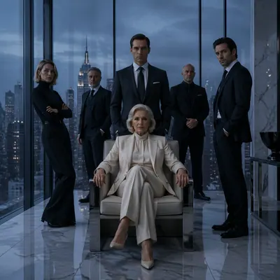</a>

<b><a href="https://gpt-image-2-hub-seven.vercel.app/#m-prestige-tv-key-art-remix%2Fseries-cold-dynasty-campaign%2F01-penthouse-lineup">Penthouse Lineup</a></b>

</td>
<td width="33%" valign="top" align="center">

<b><a href="https://gpt-image-2-hub-seven.vercel.app/#m-prestige-tv-key-art-remix%2Fsingle-ensemble-remix-studies%2Fcouncil-of-heirs">Council of Heirs</a></b>

</td>
<td width="33%" valign="top" align="center">

<a href="https://gpt-image-2-hub-seven.vercel.app/#m-prestige-tv-key-art-remix%2Fseries-cold-dynasty-campaign%2F02-awards-portrait">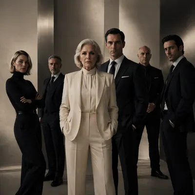</a>

<b><a href="https://gpt-image-2-hub-seven.vercel.app/#m-prestige-tv-key-art-remix%2Fseries-cold-dynasty-campaign%2F02-awards-portrait">Awards Portrait</a></b>

</td>
</tr>
<tr>
<td width="33%" valign="top" align="center">

<b><a href="https://gpt-image-2-hub-seven.vercel.app/#m-prestige-tv-key-art-remix%2Fsingle-ensemble-remix-studies%2Forbital-diplomats">Orbital Diplomats</a></b>

</td>
<td width="33%" valign="top" align="center">

<b><a href="https://gpt-image-2-hub-seven.vercel.app/#m-prestige-tv-key-art-remix%2Fseries-cold-dynasty-campaign%2F03-resort-fracture">Resort Fracture</a></b>

</td>
<td width="33%" valign="top" align="center">

<a href="https://gpt-image-2-hub-seven.vercel.app/#m-prestige-tv-key-art-remix%2Fsingle-ensemble-remix-studies%2Fmonastery-conspirators">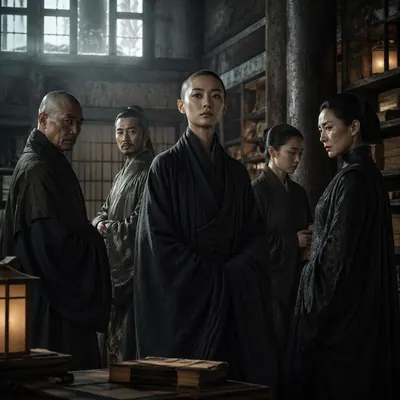</a>

<b><a href="https://gpt-image-2-hub-seven.vercel.app/#m-prestige-tv-key-art-remix%2Fsingle-ensemble-remix-studies%2Fmonastery-conspirators">Monastery Conspirators</a></b>

</td>
</tr>
<tr>
<td width="33%" valign="top" align="center">

<a href="https://gpt-image-2-hub-seven.vercel.app/#m-prestige-tv-key-art-remix%2Fseries-cold-dynasty-campaign%2F04-night-window-truce">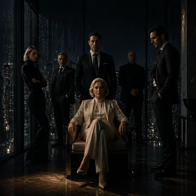</a>

<b><a href="https://gpt-image-2-hub-seven.vercel.app/#m-prestige-tv-key-art-remix%2Fseries-cold-dynasty-campaign%2F04-night-window-truce">Night Window Truce</a></b>

</td>
<td width="33%" valign="top" align="center">

<a href="https://gpt-image-2-hub-seven.vercel.app/#m-prestige-tv-key-art-remix%2Fsingle-ensemble-remix-studies%2Fdesert-empire-board">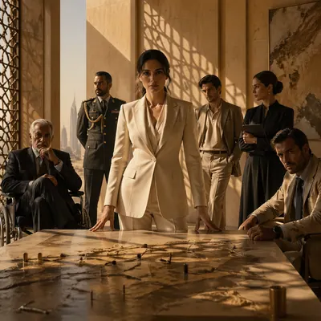</a>

<b><a href="https://gpt-image-2-hub-seven.vercel.app/#m-prestige-tv-key-art-remix%2Fsingle-ensemble-remix-studies%2Fdesert-empire-board">Desert Empire Board</a></b>

</td>
<td width="33%" valign="top" align="center">

<b><a href="https://gpt-image-2-hub-seven.vercel.app/#m-prestige-tv-key-art-remix%2Fsingle-ensemble-remix-studies%2Fcoastal-mystery-cast">Coastal Mystery Cast</a></b>

</td>
</tr>
</table>

### [Interactive Web Campaign Mockup](https://gpt-image-2-hub-seven.vercel.app/#t-interactive-web-campaign-mockup) · 9

> Mock up immersive campaign sites across desktop and mobile screens, focusing on scroll storytelling, interaction cues, and polished conversion sections.

<table>
<tr>
<td width="33%" valign="top" align="center">

<b><a href="https://gpt-image-2-hub-seven.vercel.app/#m-interactive-web-campaign-mockup%2Fseries-core-campaign-system%2F01-anchor-visual">Anchor Visual</a></b>

</td>
<td width="33%" valign="top" align="center">

<b><a href="https://gpt-image-2-hub-seven.vercel.app/#m-interactive-web-campaign-mockup%2Fsingle-independent-surface-studies%2Flead-study">Lead Study</a></b>

</td>
<td width="33%" valign="top" align="center">

<b><a href="https://gpt-image-2-hub-seven.vercel.app/#m-interactive-web-campaign-mockup%2Fseries-core-campaign-system%2F02-tight-hierarchy">Tight Hierarchy</a></b>

</td>
</tr>
<tr>
<td width="33%" valign="top" align="center">

<b><a href="https://gpt-image-2-hub-seven.vercel.app/#m-interactive-web-campaign-mockup%2Fsingle-independent-surface-studies%2Fensemble-study">Ensemble Study</a></b>

</td>
<td width="33%" valign="top" align="center">

<b><a href="https://gpt-image-2-hub-seven.vercel.app/#m-interactive-web-campaign-mockup%2Fseries-core-campaign-system%2F03-environment-rollout">Environment Rollout</a></b>

</td>
<td width="33%" valign="top" align="center">

<b><a href="https://gpt-image-2-hub-seven.vercel.app/#m-interactive-web-campaign-mockup%2Fsingle-independent-surface-studies%2Fproduct-study">Product Study</a></b>

</td>
</tr>
<tr>
<td width="33%" valign="top" align="center">

<b><a href="https://gpt-image-2-hub-seven.vercel.app/#m-interactive-web-campaign-mockup%2Fseries-core-campaign-system%2F04-mood-shift-variant">Mood Shift Variant</a></b>

</td>
<td width="33%" valign="top" align="center">

<b><a href="https://gpt-image-2-hub-seven.vercel.app/#m-interactive-web-campaign-mockup%2Fsingle-independent-surface-studies%2Fnarrative-study">Narrative Study</a></b>

</td>
<td width="33%" valign="top" align="center">

<b><a href="https://gpt-image-2-hub-seven.vercel.app/#m-interactive-web-campaign-mockup%2Fsingle-independent-surface-studies%2Fconversion-study">Conversion Study</a></b>

</td>
</tr>
</table>

### [Arthouse One-Sheet Anime Remake](https://gpt-image-2-hub-seven.vercel.app/#t-arthouse-one-sheet-anime-remake) · 9

> A Prompt Atlas theme for testing whether restrained festival-poster grammar can hold recognizable anime-coded characters without losing negative space, tonal restraint, or layout discipline.

<table>
<tr>
<td width="33%" valign="top" align="center">

<a href="https://gpt-image-2-hub-seven.vercel.app/#m-arthouse-one-sheet-anime-remake%2Fsingle-arthouse-remix-studies%2F01-rain-window-solitude">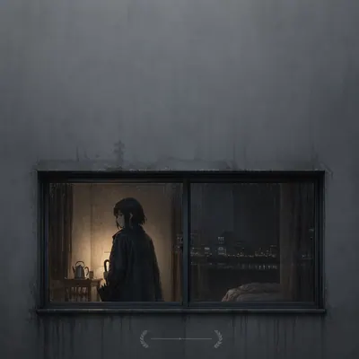</a>

<b><a href="https://gpt-image-2-hub-seven.vercel.app/#m-arthouse-one-sheet-anime-remake%2Fsingle-arthouse-remix-studies%2F01-rain-window-solitude">Rain Window Solitude</a></b>

</td>
<td width="33%" valign="top" align="center">

<a href="https://gpt-image-2-hub-seven.vercel.app/#m-arthouse-one-sheet-anime-remake%2Fsingle-arthouse-remix-studies%2F02-firefly-corridor">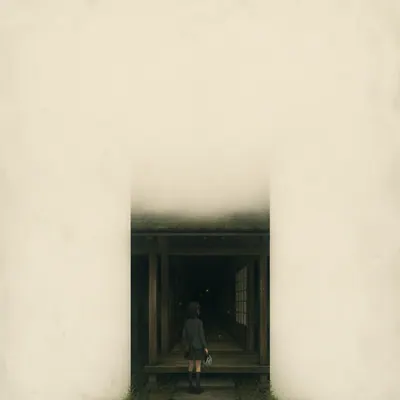</a>

<b><a href="https://gpt-image-2-hub-seven.vercel.app/#m-arthouse-one-sheet-anime-remake%2Fsingle-arthouse-remix-studies%2F02-firefly-corridor">Firefly Corridor</a></b>

</td>
<td width="33%" valign="top" align="center">

<a href="https://gpt-image-2-hub-seven.vercel.app/#m-arthouse-one-sheet-anime-remake%2Fsingle-arthouse-remix-studies%2F03-seaside-shrine-promise">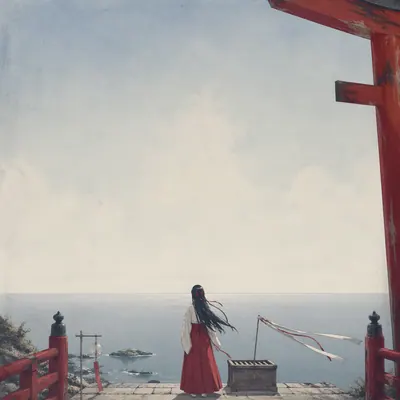</a>

<b><a href="https://gpt-image-2-hub-seven.vercel.app/#m-arthouse-one-sheet-anime-remake%2Fsingle-arthouse-remix-studies%2F03-seaside-shrine-promise">Seaside Shrine Promise</a></b>

</td>
</tr>
<tr>
<td width="33%" valign="top" align="center">

<b><a href="https://gpt-image-2-hub-seven.vercel.app/#m-arthouse-one-sheet-anime-remake%2Fsingle-arthouse-remix-studies%2F04-snow-platform-farewell">Snow Platform Farewell</a></b>

</td>
<td width="33%" valign="top" align="center">

<a href="https://gpt-image-2-hub-seven.vercel.app/#m-arthouse-one-sheet-anime-remake%2Fsingle-arthouse-remix-studies%2F05-aquarium-midnight">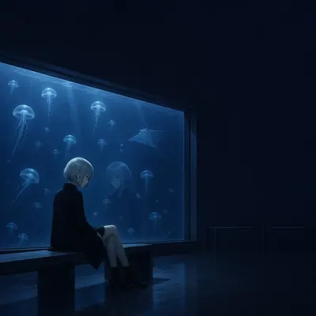</a>

<b><a href="https://gpt-image-2-hub-seven.vercel.app/#m-arthouse-one-sheet-anime-remake%2Fsingle-arthouse-remix-studies%2F05-aquarium-midnight">Aquarium Midnight</a></b>

</td>
<td width="33%" valign="top" align="center">

<a href="https://gpt-image-2-hub-seven.vercel.app/#m-arthouse-one-sheet-anime-remake%2Fsingle-arthouse-remix-studies%2F06-paper-moon-atelier">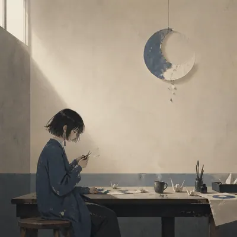</a>

<b><a href="https://gpt-image-2-hub-seven.vercel.app/#m-arthouse-one-sheet-anime-remake%2Fsingle-arthouse-remix-studies%2F06-paper-moon-atelier">Paper Moon Atelier</a></b>

</td>
</tr>
<tr>
<td width="33%" valign="top" align="center">

<a href="https://gpt-image-2-hub-seven.vercel.app/#m-arthouse-one-sheet-anime-remake%2Fsingle-arthouse-remix-studies%2F07-elevator-to-summer">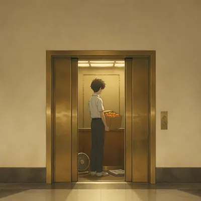</a>

<b><a href="https://gpt-image-2-hub-seven.vercel.app/#m-arthouse-one-sheet-anime-remake%2Fsingle-arthouse-remix-studies%2F07-elevator-to-summer">Elevator to Summer</a></b>

</td>
<td width="33%" valign="top" align="center">

<a href="https://gpt-image-2-hub-seven.vercel.app/#m-arthouse-one-sheet-anime-remake%2Fsingle-arthouse-remix-studies%2F08-hotel-window-eclipse">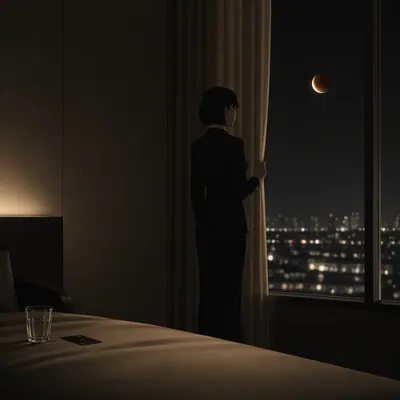</a>

<b><a href="https://gpt-image-2-hub-seven.vercel.app/#m-arthouse-one-sheet-anime-remake%2Fsingle-arthouse-remix-studies%2F08-hotel-window-eclipse">Hotel Window Eclipse</a></b>

</td>
<td width="33%" valign="top" align="center">

<b><a href="https://gpt-image-2-hub-seven.vercel.app/#m-arthouse-one-sheet-anime-remake%2Fsingle-arthouse-remix-studies%2F09-orchard-after-credits">Orchard After Credits</a></b>

</td>
</tr>
</table>

### [Iconic Poster Cast Remix](https://gpt-image-2-hub-seven.vercel.app/#t-iconic-poster-cast-remix) · 9

> A Prompt Atlas theme for rebuilding famous movie-poster composition logic with entirely different character casts, while preserving hierarchy, negative space, and proposal-ready campaign impact.

<table>
<tr>
<td width="33%" valign="top" align="center">

<a href="https://gpt-image-2-hub-seven.vercel.app/#m-iconic-poster-cast-remix%2Fsingle-iconic-poster-remix-studies%2F01-red-noir-suitcase">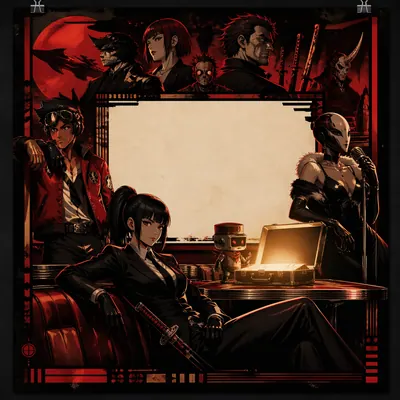</a>

<b><a href="https://gpt-image-2-hub-seven.vercel.app/#m-iconic-poster-cast-remix%2Fsingle-iconic-poster-remix-studies%2F01-red-noir-suitcase">Red Noir Suitcase</a></b>

</td>
<td width="33%" valign="top" align="center">

<a href="https://gpt-image-2-hub-seven.vercel.app/#m-iconic-poster-cast-remix%2Fsingle-iconic-poster-remix-studies%2F02-sepia-dynasty-altar">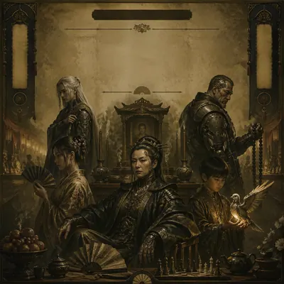</a>

<b><a href="https://gpt-image-2-hub-seven.vercel.app/#m-iconic-poster-cast-remix%2Fsingle-iconic-poster-remix-studies%2F02-sepia-dynasty-altar">Sepia Dynasty Altar</a></b>

</td>
<td width="33%" valign="top" align="center">

<a href="https://gpt-image-2-hub-seven.vercel.app/#m-iconic-poster-cast-remix%2Fsingle-iconic-poster-remix-studies%2F03-iceberg-romance-recast">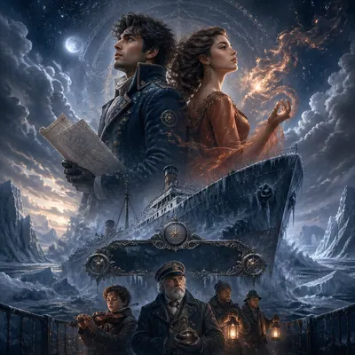</a>

<b><a href="https://gpt-image-2-hub-seven.vercel.app/#m-iconic-poster-cast-remix%2Fsingle-iconic-poster-remix-studies%2F03-iceberg-romance-recast">Iceberg Romance Recast</a></b>

</td>
</tr>
<tr>
<td width="33%" valign="top" align="center">

<a href="https://gpt-image-2-hub-seven.vercel.app/#m-iconic-poster-cast-remix%2Fsingle-iconic-poster-remix-studies%2F04-arcane-ring-ensemble">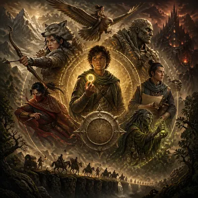</a>

<b><a href="https://gpt-image-2-hub-seven.vercel.app/#m-iconic-poster-cast-remix%2Fsingle-iconic-poster-remix-studies%2F04-arcane-ring-ensemble">Arcane Ring Ensemble</a></b>

</td>
<td width="33%" valign="top" align="center">

<a href="https://gpt-image-2-hub-seven.vercel.app/#m-iconic-poster-cast-remix%2Fsingle-iconic-poster-remix-studies%2F05-neon-hacker-corridor">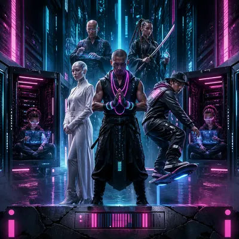</a>

<b><a href="https://gpt-image-2-hub-seven.vercel.app/#m-iconic-poster-cast-remix%2Fsingle-iconic-poster-remix-studies%2F05-neon-hacker-corridor">Neon Hacker Corridor</a></b>

</td>
<td width="33%" valign="top" align="center">

<a href="https://gpt-image-2-hub-seven.vercel.app/#m-iconic-poster-cast-remix%2Fsingle-iconic-poster-remix-studies%2F06-desert-prophecy-procession">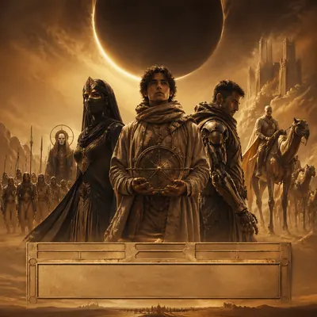</a>

<b><a href="https://gpt-image-2-hub-seven.vercel.app/#m-iconic-poster-cast-remix%2Fsingle-iconic-poster-remix-studies%2F06-desert-prophecy-procession">Desert Prophecy Procession</a></b>

</td>
</tr>
<tr>
<td width="33%" valign="top" align="center">

<a href="https://gpt-image-2-hub-seven.vercel.app/#m-iconic-poster-cast-remix%2Fsingle-iconic-poster-remix-studies%2F07-rain-vigilante-profile">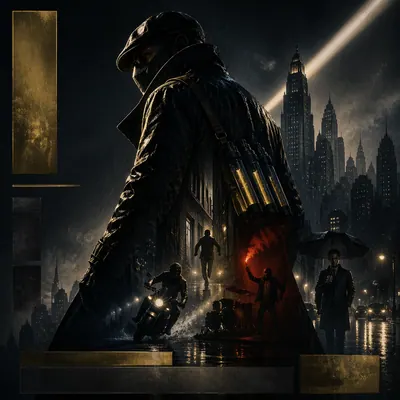</a>

<b><a href="https://gpt-image-2-hub-seven.vercel.app/#m-iconic-poster-cast-remix%2Fsingle-iconic-poster-remix-studies%2F07-rain-vigilante-profile">Rain Vigilante Profile</a></b>

</td>
<td width="33%" valign="top" align="center">

<a href="https://gpt-image-2-hub-seven.vercel.app/#m-iconic-poster-cast-remix%2Fsingle-iconic-poster-remix-studies%2F08-jungle-relic-expedition">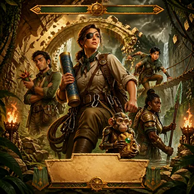</a>

<b><a href="https://gpt-image-2-hub-seven.vercel.app/#m-iconic-poster-cast-remix%2Fsingle-iconic-poster-remix-studies%2F08-jungle-relic-expedition">Jungle Relic Expedition</a></b>

</td>
<td width="33%" valign="top" align="center">

<a href="https://gpt-image-2-hub-seven.vercel.app/#m-iconic-poster-cast-remix%2Fsingle-iconic-poster-remix-studies%2F09-rebel-skyline-uprising">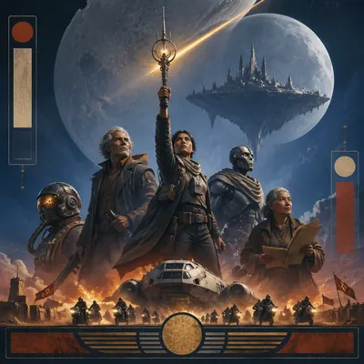</a>

<b><a href="https://gpt-image-2-hub-seven.vercel.app/#m-iconic-poster-cast-remix%2Fsingle-iconic-poster-remix-studies%2F09-rebel-skyline-uprising">Rebel Skyline Uprising</a></b>

</td>
</tr>
</table>

### [App Launch Hero System](https://gpt-image-2-hub-seven.vercel.app/#t-app-launch-hero-system) · 9

> A Prompt Atlas theme for polished SaaS and app launch-page stills that combine product screenshots, abstract hero art, feature storytelling, social-proof modules, and conversion-focused CTA blocks.

<table>
<tr>
<td width="33%" valign="top" align="center">

<b><a href="https://gpt-image-2-hub-seven.vercel.app/#m-app-launch-hero-system%2Fsingle-app-launch-hero-studies%2F01-ai-notebook-copilot">AI Notebook Copilot</a></b>

</td>
<td width="33%" valign="top" align="center">

<a href="https://gpt-image-2-hub-seven.vercel.app/#m-app-launch-hero-system%2Fsingle-app-launch-hero-studies%2F02-focus-streak-coach">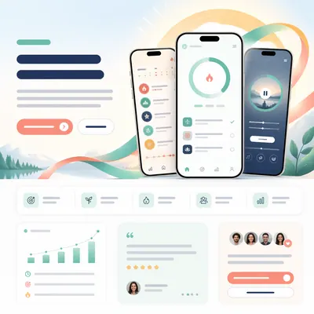</a>

<b><a href="https://gpt-image-2-hub-seven.vercel.app/#m-app-launch-hero-system%2Fsingle-app-launch-hero-studies%2F02-focus-streak-coach">Focus Streak Coach</a></b>

</td>
<td width="33%" valign="top" align="center">

<b><a href="https://gpt-image-2-hub-seven.vercel.app/#m-app-launch-hero-system%2Fsingle-app-launch-hero-studies%2F03-founder-finance-dashboard">Founder Finance Dashboard</a></b>

</td>
</tr>
<tr>
<td width="33%" valign="top" align="center">

<b><a href="https://gpt-image-2-hub-seven.vercel.app/#m-app-launch-hero-system%2Fsingle-app-launch-hero-studies%2F04-design-review-canvas">Design Review Canvas</a></b>

</td>
<td width="33%" valign="top" align="center">

<b><a href="https://gpt-image-2-hub-seven.vercel.app/#m-app-launch-hero-system%2Fsingle-app-launch-hero-studies%2F05-language-sprint-mobile">Language Sprint Mobile</a></b>

</td>
<td width="33%" valign="top" align="center">

<a href="https://gpt-image-2-hub-seven.vercel.app/#m-app-launch-hero-system%2Fsingle-app-launch-hero-studies%2F06-creator-analytics-portal">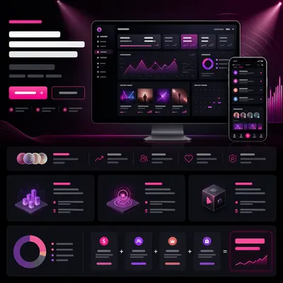</a>

<b><a href="https://gpt-image-2-hub-seven.vercel.app/#m-app-launch-hero-system%2Fsingle-app-launch-hero-studies%2F06-creator-analytics-portal">Creator Analytics Portal</a></b>

</td>
</tr>
<tr>
<td width="33%" valign="top" align="center">

<b><a href="https://gpt-image-2-hub-seven.vercel.app/#m-app-launch-hero-system%2Fsingle-app-launch-hero-studies%2F07-clinic-wellness-companion">Clinic Wellness Companion</a></b>

</td>
<td width="33%" valign="top" align="center">

<a href="https://gpt-image-2-hub-seven.vercel.app/#m-app-launch-hero-system%2Fsingle-app-launch-hero-studies%2F08-trip-planner-orbit">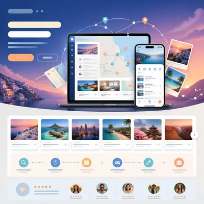</a>

<b><a href="https://gpt-image-2-hub-seven.vercel.app/#m-app-launch-hero-system%2Fsingle-app-launch-hero-studies%2F08-trip-planner-orbit">Trip Planner Orbit</a></b>

</td>
<td width="33%" valign="top" align="center">

<b><a href="https://gpt-image-2-hub-seven.vercel.app/#m-app-launch-hero-system%2Fsingle-app-launch-hero-studies%2F09-developer-api-command-center">Developer API Command Center</a></b>

</td>
</tr>
</table>

### [Festival Poster Fandom Crossover](https://gpt-image-2-hub-seven.vercel.app/#t-festival-poster-fandom-crossover) · 9

> A Prompt Atlas theme for translating fandom-scale characters and ensemble drama into restrained award-festival poster systems with premium cinematic packaging.

<table>
<tr>
<td width="33%" valign="top" align="center">

<a href="https://gpt-image-2-hub-seven.vercel.app/#m-festival-poster-fandom-crossover%2Fseries-midnight-jury-selection%2F01-velvet-reference">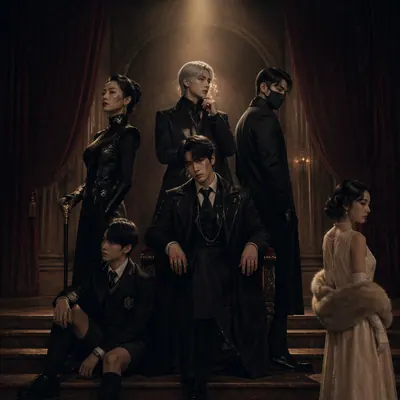</a>

<b><a href="https://gpt-image-2-hub-seven.vercel.app/#m-festival-poster-fandom-crossover%2Fseries-midnight-jury-selection%2F01-velvet-reference">Velvet Reference</a></b>

</td>
<td width="33%" valign="top" align="center">

<a href="https://gpt-image-2-hub-seven.vercel.app/#m-festival-poster-fandom-crossover%2Fsingle-festival-poster-studies%2Forbit-royalty-competition">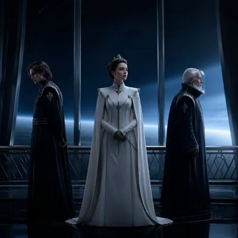</a>

<b><a href="https://gpt-image-2-hub-seven.vercel.app/#m-festival-poster-fandom-crossover%2Fsingle-festival-poster-studies%2Forbit-royalty-competition">Orbit Royalty Competition</a></b>

</td>
<td width="33%" valign="top" align="center">

<a href="https://gpt-image-2-hub-seven.vercel.app/#m-festival-poster-fandom-crossover%2Fseries-midnight-jury-selection%2F02-seaside-selection">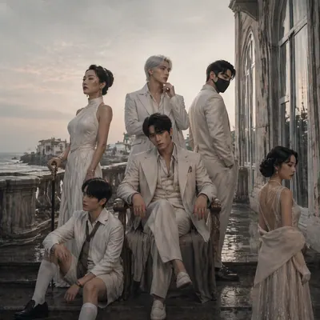</a>

<b><a href="https://gpt-image-2-hub-seven.vercel.app/#m-festival-poster-fandom-crossover%2Fseries-midnight-jury-selection%2F02-seaside-selection">Seaside Selection</a></b>

</td>
</tr>
<tr>
<td width="33%" valign="top" align="center">

<a href="https://gpt-image-2-hub-seven.vercel.app/#m-festival-poster-fandom-crossover%2Fsingle-festival-poster-studies%2Ffolklore-detective-selection">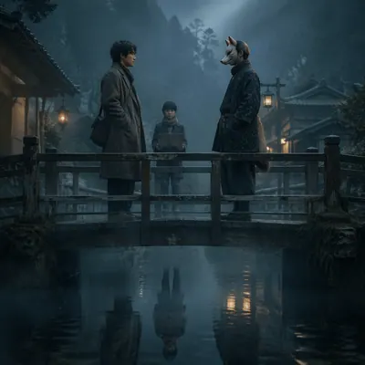</a>

<b><a href="https://gpt-image-2-hub-seven.vercel.app/#m-festival-poster-fandom-crossover%2Fsingle-festival-poster-studies%2Ffolklore-detective-selection">Folklore Detective Selection</a></b>

</td>
<td width="33%" valign="top" align="center">

<a href="https://gpt-image-2-hub-seven.vercel.app/#m-festival-poster-fandom-crossover%2Fseries-midnight-jury-selection%2F03-winter-pressbook">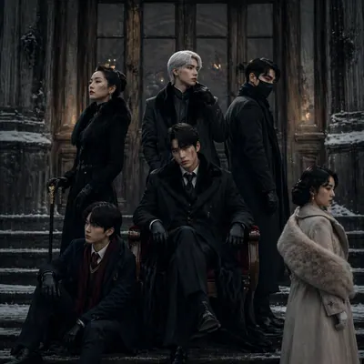</a>

<b><a href="https://gpt-image-2-hub-seven.vercel.app/#m-festival-poster-fandom-crossover%2Fseries-midnight-jury-selection%2F03-winter-pressbook">Winter Pressbook</a></b>

</td>
<td width="33%" valign="top" align="center">

<a href="https://gpt-image-2-hub-seven.vercel.app/#m-festival-poster-fandom-crossover%2Fsingle-festival-poster-studies%2Farena-sisters-jury-sheet">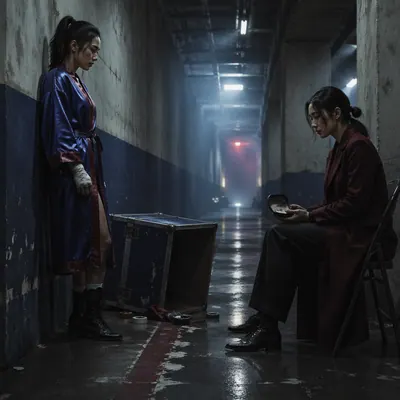</a>

<b><a href="https://gpt-image-2-hub-seven.vercel.app/#m-festival-poster-fandom-crossover%2Fsingle-festival-poster-studies%2Farena-sisters-jury-sheet">Arena Sisters Jury Sheet</a></b>

</td>
</tr>
<tr>
<td width="33%" valign="top" align="center">

<a href="https://gpt-image-2-hub-seven.vercel.app/#m-festival-poster-fandom-crossover%2Fseries-midnight-jury-selection%2F04-gala-window">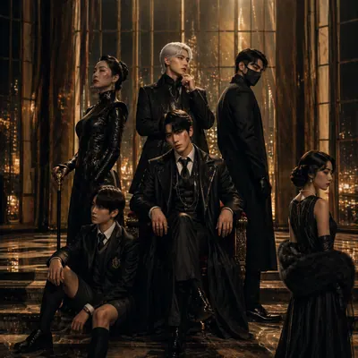</a>

<b><a href="https://gpt-image-2-hub-seven.vercel.app/#m-festival-poster-fandom-crossover%2Fseries-midnight-jury-selection%2F04-gala-window">Gala Window</a></b>

</td>
<td width="33%" valign="top" align="center">

<a href="https://gpt-image-2-hub-seven.vercel.app/#m-festival-poster-fandom-crossover%2Fsingle-festival-poster-studies%2Fkaiju-family-program-cover">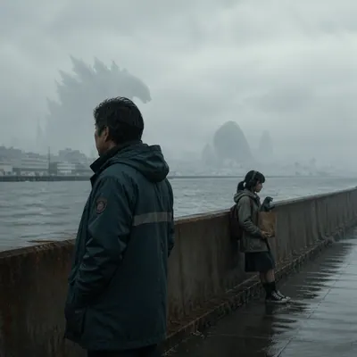</a>

<b><a href="https://gpt-image-2-hub-seven.vercel.app/#m-festival-poster-fandom-crossover%2Fsingle-festival-poster-studies%2Fkaiju-family-program-cover">Kaiju Family Program Cover</a></b>

</td>
<td width="33%" valign="top" align="center">

<a href="https://gpt-image-2-hub-seven.vercel.app/#m-festival-poster-fandom-crossover%2Fsingle-festival-poster-studies%2Fclockwork-lovers-palme-variant">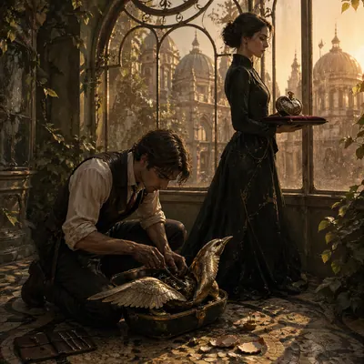</a>

<b><a href="https://gpt-image-2-hub-seven.vercel.app/#m-festival-poster-fandom-crossover%2Fsingle-festival-poster-studies%2Fclockwork-lovers-palme-variant">Clockwork Lovers Palme Variant</a></b>

</td>
</tr>
</table>

### [Short Video Cover Pack](https://gpt-image-2-hub-seven.vercel.app/#t-short-video-cover-pack) · 9

> A Prompt Atlas theme for reusable short-video thumbnail systems that balance face crop, hook zone, category signal, and account-level visual consistency.

<table>
<tr>
<td width="33%" valign="top" align="center">

<b><a href="https://gpt-image-2-hub-seven.vercel.app/#m-short-video-cover-pack%2Fseries-creator-channel-system%2F01-reference-host">Reference Host</a></b>

</td>
<td width="33%" valign="top" align="center">

<b><a href="https://gpt-image-2-hub-seven.vercel.app/#m-short-video-cover-pack%2Fsingle-thumbnail-system-studies%2F01-true-crime-nightcase">True Crime Nightcase</a></b>

</td>
<td width="33%" valign="top" align="center">

<b><a href="https://gpt-image-2-hub-seven.vercel.app/#m-short-video-cover-pack%2Fseries-creator-channel-system%2F02-ai-breakthrough-alert">AI Breakthrough Alert</a></b>

</td>
</tr>
<tr>
<td width="33%" valign="top" align="center">

<b><a href="https://gpt-image-2-hub-seven.vercel.app/#m-short-video-cover-pack%2Fsingle-thumbnail-system-studies%2F02-space-facts-burst">Space Facts Burst</a></b>

</td>
<td width="33%" valign="top" align="center">

<b><a href="https://gpt-image-2-hub-seven.vercel.app/#m-short-video-cover-pack%2Fseries-creator-channel-system%2F03-market-shock-explainer">Market Shock Explainer</a></b>

</td>
<td width="33%" valign="top" align="center">

<b><a href="https://gpt-image-2-hub-seven.vercel.app/#m-short-video-cover-pack%2Fsingle-thumbnail-system-studies%2F03-kitchen-hack-sizzle">Kitchen Hack Sizzle</a></b>

</td>
</tr>
<tr>
<td width="33%" valign="top" align="center">

<b><a href="https://gpt-image-2-hub-seven.vercel.app/#m-short-video-cover-pack%2Fseries-creator-channel-system%2F04-founder-debate-spotlight">Founder Debate Spotlight</a></b>

</td>
<td width="33%" valign="top" align="center">

<b><a href="https://gpt-image-2-hub-seven.vercel.app/#m-short-video-cover-pack%2Fsingle-thumbnail-system-studies%2F04-book-summary-minimal">Book Summary Minimal</a></b>

</td>
<td width="33%" valign="top" align="center">

<b><a href="https://gpt-image-2-hub-seven.vercel.app/#m-short-video-cover-pack%2Fsingle-thumbnail-system-studies%2F05-match-recap-flash">Match Recap Flash</a></b>

</td>
</tr>
</table>

### [Object Boardroom](https://gpt-image-2-hub-seven.vercel.app/#t-object-boardroom) · 8

> A Prompt Atlas theme for photorealistic anthropomorphic objects in executive boardrooms, testing material physics, lighting, and commercial concept staging.

<table>
<tr>
<td width="33%" valign="top" align="center">

<b><a href="https://gpt-image-2-hub-seven.vercel.app/#m-object-boardroom%2Fseries-executive-table%2F01-coffee-chair">Coffee Chair</a></b>

</td>
<td width="33%" valign="top" align="center">

<b><a href="https://gpt-image-2-hub-seven.vercel.app/#m-object-boardroom%2Fsingle-object-negotiations%2Fglass-ceo-vote">Glass CEO Vote</a></b>

</td>
<td width="33%" valign="top" align="center">

<b><a href="https://gpt-image-2-hub-seven.vercel.app/#m-object-boardroom%2Fseries-executive-table%2F02-cigar-chair">Cigar Chair</a></b>

</td>
</tr>
<tr>
<td width="33%" valign="top" align="center">

<b><a href="https://gpt-image-2-hub-seven.vercel.app/#m-object-boardroom%2Fsingle-object-negotiations%2Fcandle-risk-briefing">Candle Risk Briefing</a></b>

</td>
<td width="33%" valign="top" align="center">

<b><a href="https://gpt-image-2-hub-seven.vercel.app/#m-object-boardroom%2Fseries-executive-table%2F03-pen-chair">Pen Chair</a></b>

</td>
<td width="33%" valign="top" align="center">

<b><a href="https://gpt-image-2-hub-seven.vercel.app/#m-object-boardroom%2Fsingle-object-negotiations%2Fscissors-merger-table">Scissors Merger Table</a></b>

</td>
</tr>
</table>

### [Vertical Drama Poster System](https://gpt-image-2-hub-seven.vercel.app/#t-vertical-drama-poster-system) · 9

> A Prompt Atlas theme for mobile-first vertical drama posters that compress emotional hooks, romantic tension, and serialized campaign consistency into narrow streaming-cover formats.

<table>
<tr>
<td width="33%" valign="top" align="center">

<b><a href="https://gpt-image-2-hub-seven.vercel.app/#m-vertical-drama-poster-system%2Fseries-heiress-contract-arc%2F01-rooftop-hook">Rooftop Hook</a></b>

</td>
<td width="33%" valign="top" align="center">

<b><a href="https://gpt-image-2-hub-seven.vercel.app/#m-vertical-drama-poster-system%2Fsingle-genre-poster-studies%2Fpenthouse-revenge-cover">Penthouse Revenge Cover</a></b>

</td>
<td width="33%" valign="top" align="center">

<b><a href="https://gpt-image-2-hub-seven.vercel.app/#m-vertical-drama-poster-system%2Fseries-heiress-contract-arc%2F02-rain-elevator-standoff">Rain Elevator Standoff</a></b>

</td>
</tr>
<tr>
<td width="33%" valign="top" align="center">

<b><a href="https://gpt-image-2-hub-seven.vercel.app/#m-vertical-drama-poster-system%2Fsingle-genre-poster-studies%2Fnight-shift-romance-cover">Night Shift Romance Cover</a></b>

</td>
<td width="33%" valign="top" align="center">

<b><a href="https://gpt-image-2-hub-seven.vercel.app/#m-vertical-drama-poster-system%2Fseries-heiress-contract-arc%2F03-wedding-fallout">Wedding Fallout</a></b>

</td>
<td width="33%" valign="top" align="center">

<b><a href="https://gpt-image-2-hub-seven.vercel.app/#m-vertical-drama-poster-system%2Fsingle-genre-poster-studies%2Frepublic-era-secret-cover">Republic Era Secret Cover</a></b>

</td>
</tr>
<tr>
<td width="33%" valign="top" align="center">

<b><a href="https://gpt-image-2-hub-seven.vercel.app/#m-vertical-drama-poster-system%2Fseries-heiress-contract-arc%2F04-hospital-truce">Hospital Truce</a></b>

</td>
<td width="33%" valign="top" align="center">

<b><a href="https://gpt-image-2-hub-seven.vercel.app/#m-vertical-drama-poster-system%2Fsingle-genre-poster-studies%2Fdesert-exile-cover">Desert Exile Cover</a></b>

</td>
<td width="33%" valign="top" align="center">

<b><a href="https://gpt-image-2-hub-seven.vercel.app/#m-vertical-drama-poster-system%2Fsingle-genre-poster-studies%2Fchef-rivalry-cover">Chef Rivalry Cover</a></b>

</td>
</tr>
</table>

### [Hero Reveal Turnaround Pack](https://gpt-image-2-hub-seven.vercel.app/#t-hero-reveal-turnaround-pack) · 9

> Build a playable-hero reveal pack spanning splash art, bust crop, and multi-view turnaround assets that stay consistent across promo and production use.

<table>
<tr>
<td width="33%" valign="top" align="center">

<b><a href="https://gpt-image-2-hub-seven.vercel.app/#m-hero-reveal-turnaround-pack%2Fseries-hero-launch-system%2F01-reference-hero-anchor">Reference Hero Anchor</a></b>

</td>
<td width="33%" valign="top" align="center">

<b><a href="https://gpt-image-2-hub-seven.vercel.app/#m-hero-reveal-turnaround-pack%2Fseries-production-turnaround-system%2F01-reference-turnaround-sheet">Reference Turnaround Sheet</a></b>

</td>
<td width="33%" valign="top" align="center">

<b><a href="https://gpt-image-2-hub-seven.vercel.app/#m-hero-reveal-turnaround-pack%2Fseries-hero-launch-system%2F02-splash-launch-poster">Splash Launch Poster</a></b>

</td>
</tr>
<tr>
<td width="33%" valign="top" align="center">

<b><a href="https://gpt-image-2-hub-seven.vercel.app/#m-hero-reveal-turnaround-pack%2Fseries-production-turnaround-system%2F02-front-side-back-sheet">Front Side Back Sheet</a></b>

</td>
<td width="33%" valign="top" align="center">

<b><a href="https://gpt-image-2-hub-seven.vercel.app/#m-hero-reveal-turnaround-pack%2Fseries-hero-launch-system%2F03-character-select-bust">Character Select Bust</a></b>

</td>
<td width="33%" valign="top" align="center">

<b><a href="https://gpt-image-2-hub-seven.vercel.app/#m-hero-reveal-turnaround-pack%2Fseries-production-turnaround-system%2F03-equipment-callout-sheet">Equipment Callout Sheet</a></b>

</td>
</tr>
<tr>
<td width="33%" valign="top" align="center">

<b><a href="https://gpt-image-2-hub-seven.vercel.app/#m-hero-reveal-turnaround-pack%2Fseries-hero-launch-system%2F04-victory-banner-pose">Victory Banner Pose</a></b>

</td>
<td width="33%" valign="top" align="center">

<b><a href="https://gpt-image-2-hub-seven.vercel.app/#m-hero-reveal-turnaround-pack%2Fseries-production-turnaround-system%2F04-wiki-approval-layout">Wiki Approval Layout</a></b>

</td>
<td width="33%" valign="top" align="center">

<b><a href="https://gpt-image-2-hub-seven.vercel.app/#m-hero-reveal-turnaround-pack%2Fseries-hero-launch-system%2F05-ability-showcase-triptych">Ability Showcase Triptych</a></b>

</td>
</tr>
</table>

### [Cinematic Hardware Microsite](https://gpt-image-2-hub-seven.vercel.app/#t-cinematic-hardware-microsite) · 9

> Create cinematic microsite visuals for hardware launches, balancing immersive hero storytelling with readable spec sections and conversion modules.

<table>
<tr>
<td width="33%" valign="top" align="center">

<a href="https://gpt-image-2-hub-seven.vercel.app/#m-cinematic-hardware-microsite%2Fseries-launch-narrative%2F01-reference-hero-scene">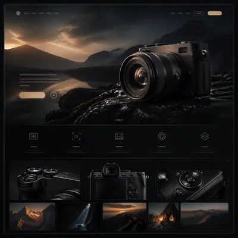</a>

<b><a href="https://gpt-image-2-hub-seven.vercel.app/#m-cinematic-hardware-microsite%2Fseries-launch-narrative%2F01-reference-hero-scene">Reference Hero Scene</a></b>

</td>
<td width="33%" valign="top" align="center">

<a href="https://gpt-image-2-hub-seven.vercel.app/#m-cinematic-hardware-microsite%2Fsingle-module-studies%2F01-device-pairing-board">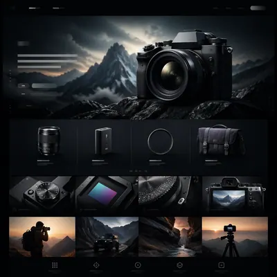</a>

<b><a href="https://gpt-image-2-hub-seven.vercel.app/#m-cinematic-hardware-microsite%2Fsingle-module-studies%2F01-device-pairing-board">Device Pairing Board</a></b>

</td>
<td width="33%" valign="top" align="center">

<a href="https://gpt-image-2-hub-seven.vercel.app/#m-cinematic-hardware-microsite%2Fseries-launch-narrative%2F02-scroll-feature-rhythm">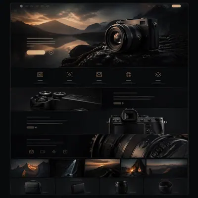</a>

<b><a href="https://gpt-image-2-hub-seven.vercel.app/#m-cinematic-hardware-microsite%2Fseries-launch-narrative%2F02-scroll-feature-rhythm">Scroll Feature Rhythm</a></b>

</td>
</tr>
<tr>
<td width="33%" valign="top" align="center">

<a href="https://gpt-image-2-hub-seven.vercel.app/#m-cinematic-hardware-microsite%2Fsingle-module-studies%2F02-lifestyle-usage-panel">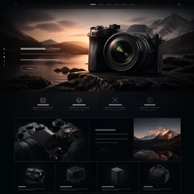</a>

<b><a href="https://gpt-image-2-hub-seven.vercel.app/#m-cinematic-hardware-microsite%2Fsingle-module-studies%2F02-lifestyle-usage-panel">Lifestyle Usage Panel</a></b>

</td>
<td width="33%" valign="top" align="center">

<a href="https://gpt-image-2-hub-seven.vercel.app/#m-cinematic-hardware-microsite%2Fseries-launch-narrative%2F03-material-spec-closeup">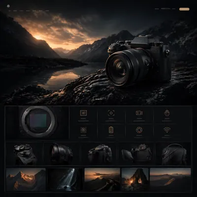</a>

<b><a href="https://gpt-image-2-hub-seven.vercel.app/#m-cinematic-hardware-microsite%2Fseries-launch-narrative%2F03-material-spec-closeup">Material Spec Closeup</a></b>

</td>
<td width="33%" valign="top" align="center">

<b><a href="https://gpt-image-2-hub-seven.vercel.app/#m-cinematic-hardware-microsite%2Fsingle-module-studies%2F03-module-comparison-grid">Module Comparison Grid</a></b>

</td>
</tr>
<tr>
<td width="33%" valign="top" align="center">

<a href="https://gpt-image-2-hub-seven.vercel.app/#m-cinematic-hardware-microsite%2Fseries-launch-narrative%2F04-conversion-finale-frame">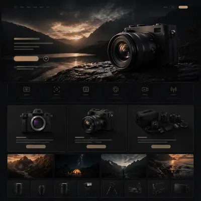</a>

<b><a href="https://gpt-image-2-hub-seven.vercel.app/#m-cinematic-hardware-microsite%2Fseries-launch-narrative%2F04-conversion-finale-frame">Conversion Finale Frame</a></b>

</td>
<td width="33%" valign="top" align="center">

<a href="https://gpt-image-2-hub-seven.vercel.app/#m-cinematic-hardware-microsite%2Fsingle-module-studies%2F04-packaging-accessory-card">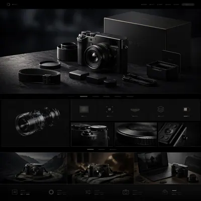</a>

<b><a href="https://gpt-image-2-hub-seven.vercel.app/#m-cinematic-hardware-microsite%2Fsingle-module-studies%2F04-packaging-accessory-card">Packaging Accessory Card</a></b>

</td>
<td width="33%" valign="top" align="center">

<a href="https://gpt-image-2-hub-seven.vercel.app/#m-cinematic-hardware-microsite%2Fsingle-module-studies%2F05-campaign-cutdown-mockup">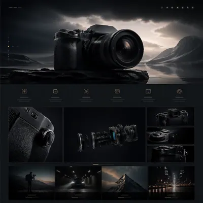</a>

<b><a href="https://gpt-image-2-hub-seven.vercel.app/#m-cinematic-hardware-microsite%2Fsingle-module-studies%2F05-campaign-cutdown-mockup">Campaign Cutdown Mockup</a></b>

</td>
</tr>
</table>

### [Premium Product Landing Page](https://gpt-image-2-hub-seven.vercel.app/#t-premium-product-landing-page) · 9

> A Prompt Atlas theme for premium product landing-page stills, testing hardware hero photography, value-prop hierarchy, module rhythm, and brand-grade web composition with GPT Image 2.

<table>
<tr>
<td width="33%" valign="top" align="center">

<a href="https://gpt-image-2-hub-seven.vercel.app/#m-premium-product-landing-page%2Fsingle-product-launch-studies%2Ftitanium-headphone-hero">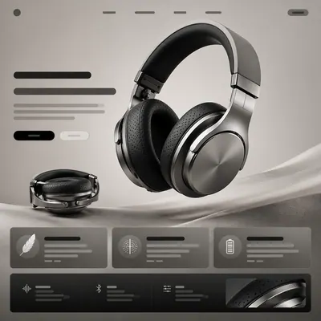</a>

<b><a href="https://gpt-image-2-hub-seven.vercel.app/#m-premium-product-landing-page%2Fsingle-product-launch-studies%2Ftitanium-headphone-hero">Titanium Headphone Hero</a></b>

</td>
<td width="33%" valign="top" align="center">

<a href="https://gpt-image-2-hub-seven.vercel.app/#m-premium-product-landing-page%2Fsingle-product-launch-studies%2Ftransparent-speaker-story">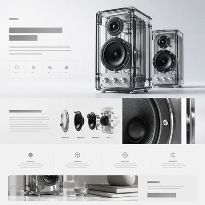</a>

<b><a href="https://gpt-image-2-hub-seven.vercel.app/#m-premium-product-landing-page%2Fsingle-product-launch-studies%2Ftransparent-speaker-story">Transparent Speaker Story</a></b>

</td>
<td width="33%" valign="top" align="center">

<a href="https://gpt-image-2-hub-seven.vercel.app/#m-premium-product-landing-page%2Fsingle-product-launch-studies%2Fmodular-camera-showcase">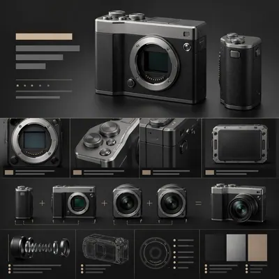</a>

<b><a href="https://gpt-image-2-hub-seven.vercel.app/#m-premium-product-landing-page%2Fsingle-product-launch-studies%2Fmodular-camera-showcase">Modular Camera Showcase</a></b>

</td>
</tr>
<tr>
<td width="33%" valign="top" align="center">

<a href="https://gpt-image-2-hub-seven.vercel.app/#m-premium-product-landing-page%2Fsingle-product-launch-studies%2Fhandheld-console-launch">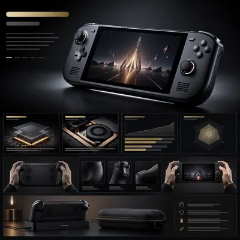</a>

<b><a href="https://gpt-image-2-hub-seven.vercel.app/#m-premium-product-landing-page%2Fsingle-product-launch-studies%2Fhandheld-console-launch">Handheld Console Launch</a></b>

</td>
<td width="33%" valign="top" align="center">

<a href="https://gpt-image-2-hub-seven.vercel.app/#m-premium-product-landing-page%2Fsingle-product-launch-studies%2Fdesktop-synth-arrangement">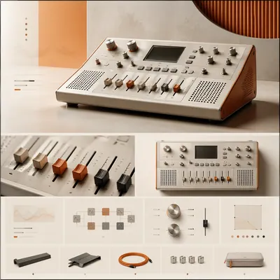</a>

<b><a href="https://gpt-image-2-hub-seven.vercel.app/#m-premium-product-landing-page%2Fsingle-product-launch-studies%2Fdesktop-synth-arrangement">Desktop Synth Arrangement</a></b>

</td>
<td width="33%" valign="top" align="center">

<a href="https://gpt-image-2-hub-seven.vercel.app/#m-premium-product-landing-page%2Fsingle-product-launch-studies%2Fsmartwatch-material-cutaway">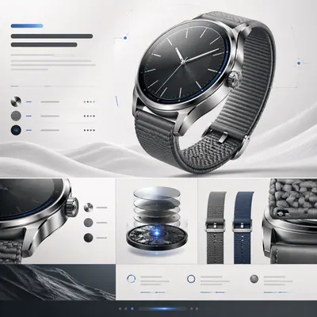</a>

<b><a href="https://gpt-image-2-hub-seven.vercel.app/#m-premium-product-landing-page%2Fsingle-product-launch-studies%2Fsmartwatch-material-cutaway">Smartwatch Material Cutaway</a></b>

</td>
</tr>
<tr>
<td width="33%" valign="top" align="center">

<a href="https://gpt-image-2-hub-seven.vercel.app/#m-premium-product-landing-page%2Fsingle-product-launch-studies%2Fprecision-coffee-launch">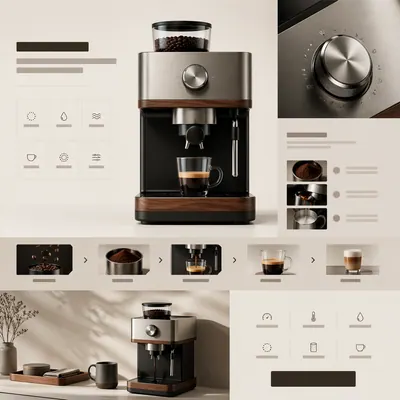</a>

<b><a href="https://gpt-image-2-hub-seven.vercel.app/#m-premium-product-landing-page%2Fsingle-product-launch-studies%2Fprecision-coffee-launch">Precision Coffee Launch</a></b>

</td>
<td width="33%" valign="top" align="center">

<a href="https://gpt-image-2-hub-seven.vercel.app/#m-premium-product-landing-page%2Fsingle-product-launch-studies%2Fportable-projector-night-scene">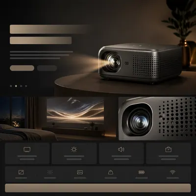</a>

<b><a href="https://gpt-image-2-hub-seven.vercel.app/#m-premium-product-landing-page%2Fsingle-product-launch-studies%2Fportable-projector-night-scene">Portable Projector Night Scene</a></b>

</td>
<td width="33%" valign="top" align="center">

<a href="https://gpt-image-2-hub-seven.vercel.app/#m-premium-product-landing-page%2Fsingle-product-launch-studies%2Fmesh-router-spec-grid">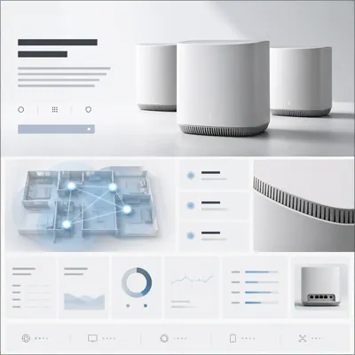</a>

<b><a href="https://gpt-image-2-hub-seven.vercel.app/#m-premium-product-landing-page%2Fsingle-product-launch-studies%2Fmesh-router-spec-grid">Mesh Router Spec Grid</a></b>

</td>
</tr>
</table>

### [Luxury Brand Story Page](https://gpt-image-2-hub-seven.vercel.app/#t-luxury-brand-story-page) · 9

> A Prompt Atlas theme for premium brand-story page stills, testing chaptered storytelling, tactile materials, craft emphasis, and luxury editorial web composition with GPT Image 2.

<table>
<tr>
<td width="33%" valign="top" align="center">

<b><a href="https://gpt-image-2-hub-seven.vercel.app/#m-luxury-brand-story-page%2Fsingle-luxury-story-studies%2Fsculpted-fragrance-chapter">Sculpted Fragrance Chapter</a></b>

</td>
<td width="33%" valign="top" align="center">

<b><a href="https://gpt-image-2-hub-seven.vercel.app/#m-luxury-brand-story-page%2Fsingle-luxury-story-studies%2Fjewelry-craft-atelier">Jewelry Craft Atelier</a></b>

</td>
<td width="33%" valign="top" align="center">

<b><a href="https://gpt-image-2-hub-seven.vercel.app/#m-luxury-brand-story-page%2Fsingle-luxury-story-studies%2Fmoonphase-watch-manifesto">Moonphase Watch Manifesto</a></b>

</td>
</tr>
<tr>
<td width="33%" valign="top" align="center">

<b><a href="https://gpt-image-2-hub-seven.vercel.app/#m-luxury-brand-story-page%2Fsingle-luxury-story-studies%2Fleather-bag-origin-story">Leather Bag Origin Story</a></b>

</td>
<td width="33%" valign="top" align="center">

<b><a href="https://gpt-image-2-hub-seven.vercel.app/#m-luxury-brand-story-page%2Fsingle-luxury-story-studies%2Fsilk-scarf-print-atlas">Silk Scarf Print Atlas</a></b>

</td>
<td width="33%" valign="top" align="center">

<b><a href="https://gpt-image-2-hub-seven.vercel.app/#m-luxury-brand-story-page%2Fsingle-luxury-story-studies%2Fcouture-heel-runway-page">Couture Heel Runway Page</a></b>

</td>
</tr>
<tr>
<td width="33%" valign="top" align="center">

<b><a href="https://gpt-image-2-hub-seven.vercel.app/#m-luxury-brand-story-page%2Fsingle-luxury-story-studies%2Ffountain-pen-heritage-piece">Fountain Pen Heritage Piece</a></b>

</td>
<td width="33%" valign="top" align="center">

<b><a href="https://gpt-image-2-hub-seven.vercel.app/#m-luxury-brand-story-page%2Fsingle-luxury-story-studies%2Fporcelain-skincare-ritual">Porcelain Skincare Ritual</a></b>

</td>
<td width="33%" valign="top" align="center">

<b><a href="https://gpt-image-2-hub-seven.vercel.app/#m-luxury-brand-story-page%2Fsingle-luxury-story-studies%2Fcrystal-decanter-collection">Crystal Decanter Collection</a></b>

</td>
</tr>
</table>

### [Mascot IP Brand Collab](https://gpt-image-2-hub-seven.vercel.app/#t-mascot-ip-brand-collab) · 9

> Imagine premium brand collaborations between mascots and recognizable IP characters, spanning key art, packaging, in-store display, and social promo assets.

<table>
<tr>
<td width="33%" valign="top" align="center">

<b><a href="https://gpt-image-2-hub-seven.vercel.app/#m-mascot-ip-brand-collab%2Fseries-character-pack%2F01-reference-mascot-pack">Reference Mascot Pack</a></b>

</td>
<td width="33%" valign="top" align="center">

<b><a href="https://gpt-image-2-hub-seven.vercel.app/#m-mascot-ip-brand-collab%2Fsingle-retail-support%2Fexplainer-board">Explainer Board</a></b>

</td>
<td width="33%" valign="top" align="center">

<b><a href="https://gpt-image-2-hub-seven.vercel.app/#m-mascot-ip-brand-collab%2Fseries-character-pack%2F02-sticker-burst">Sticker Burst Variant</a></b>

</td>
</tr>
<tr>
<td width="33%" valign="top" align="center">

<b><a href="https://gpt-image-2-hub-seven.vercel.app/#m-mascot-ip-brand-collab%2Fsingle-retail-support%2Fmerch-preview">Merch Preview</a></b>

</td>
<td width="33%" valign="top" align="center">

<b><a href="https://gpt-image-2-hub-seven.vercel.app/#m-mascot-ip-brand-collab%2Fseries-character-pack%2F03-shelf-launch">Shelf Launch Variant</a></b>

</td>
<td width="33%" valign="top" align="center">

<b><a href="https://gpt-image-2-hub-seven.vercel.app/#m-mascot-ip-brand-collab%2Fsingle-retail-support%2Fcounter-display">Counter Display</a></b>

</td>
</tr>
<tr>
<td width="33%" valign="top" align="center">

<b><a href="https://gpt-image-2-hub-seven.vercel.app/#m-mascot-ip-brand-collab%2Fseries-character-pack%2F04-premium-collab-box">Premium Collab Box</a></b>

</td>
<td width="33%" valign="top" align="center">

<b><a href="https://gpt-image-2-hub-seven.vercel.app/#m-mascot-ip-brand-collab%2Fsingle-retail-support%2Flaunch-poster">Launch Poster</a></b>

</td>
<td width="33%" valign="top" align="center">

<b><a href="https://gpt-image-2-hub-seven.vercel.app/#m-mascot-ip-brand-collab%2Fsingle-retail-support%2Fcollector-sheet">Collector Sheet</a></b>

</td>
</tr>
</table>

### [Outdoor Billboard Story Set](https://gpt-image-2-hub-seven.vercel.app/#t-outdoor-billboard-story-set) · 9

> Extend one campaign idea into metro lightboxes, building screens, bus shelters, and event takeovers without losing clarity or impact.

<table>
<tr>
<td width="33%" valign="top" align="center">

<b><a href="https://gpt-image-2-hub-seven.vercel.app/#m-outdoor-billboard-story-set%2Fseries-key-art-pivot%2F01-reference-key-art">Reference Key Art</a></b>

</td>
<td width="33%" valign="top" align="center">

<b><a href="https://gpt-image-2-hub-seven.vercel.app/#m-outdoor-billboard-story-set%2Fsingle-rollout-assets%2Fteaser-card">Teaser Card</a></b>

</td>
<td width="33%" valign="top" align="center">

<b><a href="https://gpt-image-2-hub-seven.vercel.app/#m-outdoor-billboard-story-set%2Fseries-key-art-pivot%2F02-character-surge">Character Surge</a></b>

</td>
</tr>
<tr>
<td width="33%" valign="top" align="center">

<b><a href="https://gpt-image-2-hub-seven.vercel.app/#m-outdoor-billboard-story-set%2Fsingle-rollout-assets%2Fcountdown-poster">Countdown Poster</a></b>

</td>
<td width="33%" valign="top" align="center">

<b><a href="https://gpt-image-2-hub-seven.vercel.app/#m-outdoor-billboard-story-set%2Fseries-key-art-pivot%2F03-genre-pivot">Genre Pivot</a></b>

</td>
<td width="33%" valign="top" align="center">

<b><a href="https://gpt-image-2-hub-seven.vercel.app/#m-outdoor-billboard-story-set%2Fsingle-rollout-assets%2Fplatform-crop-board">Platform Crop Board</a></b>

</td>
</tr>
<tr>
<td width="33%" valign="top" align="center">

<b><a href="https://gpt-image-2-hub-seven.vercel.app/#m-outdoor-billboard-story-set%2Fseries-key-art-pivot%2F04-finale-ensemble">Finale Ensemble</a></b>

</td>
<td width="33%" valign="top" align="center">

<b><a href="https://gpt-image-2-hub-seven.vercel.app/#m-outdoor-billboard-story-set%2Fsingle-rollout-assets%2Fstreet-proof">Street Proof</a></b>

</td>
<td width="33%" valign="top" align="center">

<b><a href="https://gpt-image-2-hub-seven.vercel.app/#m-outdoor-billboard-story-set%2Fsingle-rollout-assets%2Fmerch-sell-sheet">Merch Sell Sheet</a></b>

</td>
</tr>
</table>

### [Collector Figure Blister Ads](https://gpt-image-2-hub-seven.vercel.app/#t-collector-figure-blister-ads) · 9

> Build campaign-ready blister-pack and collector-toy advertisements featuring super-deformed characters, accessories, rarity cues, and retail-style packaging polish.

<table>
<tr>
<td width="33%" valign="top" align="center">

<b><a href="https://gpt-image-2-hub-seven.vercel.app/#m-collector-figure-blister-ads%2Fseries-character-pack%2F01-reference-mascot-pack">Reference Mascot Pack</a></b>

</td>
<td width="33%" valign="top" align="center">

<b><a href="https://gpt-image-2-hub-seven.vercel.app/#m-collector-figure-blister-ads%2Fsingle-retail-support%2Fexplainer-board">Explainer Board</a></b>

</td>
<td width="33%" valign="top" align="center">

<b><a href="https://gpt-image-2-hub-seven.vercel.app/#m-collector-figure-blister-ads%2Fseries-character-pack%2F02-sticker-burst">Sticker Burst Variant</a></b>

</td>
</tr>
<tr>
<td width="33%" valign="top" align="center">

<b><a href="https://gpt-image-2-hub-seven.vercel.app/#m-collector-figure-blister-ads%2Fsingle-retail-support%2Fmerch-preview">Merch Preview</a></b>

</td>
<td width="33%" valign="top" align="center">

<b><a href="https://gpt-image-2-hub-seven.vercel.app/#m-collector-figure-blister-ads%2Fseries-character-pack%2F03-shelf-launch">Shelf Launch Variant</a></b>

</td>
<td width="33%" valign="top" align="center">

<b><a href="https://gpt-image-2-hub-seven.vercel.app/#m-collector-figure-blister-ads%2Fsingle-retail-support%2Fcounter-display">Counter Display</a></b>

</td>
</tr>
<tr>
<td width="33%" valign="top" align="center">

<b><a href="https://gpt-image-2-hub-seven.vercel.app/#m-collector-figure-blister-ads%2Fseries-character-pack%2F04-premium-collab-box">Premium Collab Box</a></b>

</td>
<td width="33%" valign="top" align="center">

<b><a href="https://gpt-image-2-hub-seven.vercel.app/#m-collector-figure-blister-ads%2Fsingle-retail-support%2Flaunch-poster">Launch Poster</a></b>

</td>
<td width="33%" valign="top" align="center">

<b><a href="https://gpt-image-2-hub-seven.vercel.app/#m-collector-figure-blister-ads%2Fsingle-retail-support%2Fcollector-sheet">Collector Sheet</a></b>

</td>
</tr>
</table>

### [Super-Deformed Trailer Cover](https://gpt-image-2-hub-seven.vercel.app/#t-super-deformed-trailer-cover) · 9

> Create high-click trailer covers and promo posters using exaggerated super-deformed character styling, strong expressions, and clean headline zones.

<table>
<tr>
<td width="33%" valign="top" align="center">

<b><a href="https://gpt-image-2-hub-seven.vercel.app/#m-super-deformed-trailer-cover%2Fseries-key-art-pivot%2F01-reference-key-art">Reference Key Art</a></b>

</td>
<td width="33%" valign="top" align="center">

<b><a href="https://gpt-image-2-hub-seven.vercel.app/#m-super-deformed-trailer-cover%2Fsingle-rollout-assets%2Fteaser-card">Teaser Card</a></b>

</td>
<td width="33%" valign="top" align="center">

<b><a href="https://gpt-image-2-hub-seven.vercel.app/#m-super-deformed-trailer-cover%2Fseries-key-art-pivot%2F02-character-surge">Character Surge</a></b>

</td>
</tr>
<tr>
<td width="33%" valign="top" align="center">

<b><a href="https://gpt-image-2-hub-seven.vercel.app/#m-super-deformed-trailer-cover%2Fsingle-rollout-assets%2Fcountdown-poster">Countdown Poster</a></b>

</td>
<td width="33%" valign="top" align="center">

<b><a href="https://gpt-image-2-hub-seven.vercel.app/#m-super-deformed-trailer-cover%2Fseries-key-art-pivot%2F03-genre-pivot">Genre Pivot</a></b>

</td>
<td width="33%" valign="top" align="center">

<b><a href="https://gpt-image-2-hub-seven.vercel.app/#m-super-deformed-trailer-cover%2Fsingle-rollout-assets%2Fplatform-crop-board">Platform Crop Board</a></b>

</td>
</tr>
<tr>
<td width="33%" valign="top" align="center">

<b><a href="https://gpt-image-2-hub-seven.vercel.app/#m-super-deformed-trailer-cover%2Fseries-key-art-pivot%2F04-finale-ensemble">Finale Ensemble</a></b>

</td>
<td width="33%" valign="top" align="center">

<b><a href="https://gpt-image-2-hub-seven.vercel.app/#m-super-deformed-trailer-cover%2Fsingle-rollout-assets%2Fstreet-proof">Street Proof</a></b>

</td>
<td width="33%" valign="top" align="center">

<b><a href="https://gpt-image-2-hub-seven.vercel.app/#m-super-deformed-trailer-cover%2Fsingle-rollout-assets%2Fmerch-sell-sheet">Merch Sell Sheet</a></b>

</td>
</tr>
</table>

### [Social Teaser Promo Carousel](https://gpt-image-2-hub-seven.vercel.app/#t-social-teaser-promo-carousel) · 8

> Design teaser carousels and social promo grids that work as standalone posts but also lock together into a larger release narrative.

<table>
<tr>
<td width="33%" valign="top" align="center">

<b><a href="https://gpt-image-2-hub-seven.vercel.app/#m-social-teaser-promo-carousel%2Fseries-key-art-pivot%2F01-reference-key-art">Reference Key Art</a></b>

</td>
<td width="33%" valign="top" align="center">

<b><a href="https://gpt-image-2-hub-seven.vercel.app/#m-social-teaser-promo-carousel%2Fsingle-rollout-assets%2Fteaser-card">Teaser Card</a></b>

</td>
<td width="33%" valign="top" align="center">

<b><a href="https://gpt-image-2-hub-seven.vercel.app/#m-social-teaser-promo-carousel%2Fseries-key-art-pivot%2F02-character-surge">Character Surge</a></b>

</td>
</tr>
<tr>
<td width="33%" valign="top" align="center">

<b><a href="https://gpt-image-2-hub-seven.vercel.app/#m-social-teaser-promo-carousel%2Fsingle-rollout-assets%2Fcountdown-poster">Countdown Poster</a></b>

</td>
<td width="33%" valign="top" align="center">

<b><a href="https://gpt-image-2-hub-seven.vercel.app/#m-social-teaser-promo-carousel%2Fseries-key-art-pivot%2F03-genre-pivot">Genre Pivot</a></b>

</td>
<td width="33%" valign="top" align="center">

<b><a href="https://gpt-image-2-hub-seven.vercel.app/#m-social-teaser-promo-carousel%2Fsingle-rollout-assets%2Fplatform-crop-board">Platform Crop Board</a></b>

</td>
</tr>
</table>

### [Chibi Franchise Campaign Pack](https://gpt-image-2-hub-seven.vercel.app/#t-chibi-franchise-campaign-pack) · 9

> Convert larger fictional universes into tightly art-directed chibi campaign systems that can span posters, stickers, key visuals, and merch-ready layouts.

<table>
<tr>
<td width="33%" valign="top" align="center">

<b><a href="https://gpt-image-2-hub-seven.vercel.app/#m-chibi-franchise-campaign-pack%2Fseries-character-pack%2F01-reference-mascot-pack">Reference Mascot Pack</a></b>

</td>
<td width="33%" valign="top" align="center">

<b><a href="https://gpt-image-2-hub-seven.vercel.app/#m-chibi-franchise-campaign-pack%2Fsingle-retail-support%2Fexplainer-board">Explainer Board</a></b>

</td>
<td width="33%" valign="top" align="center">

<b><a href="https://gpt-image-2-hub-seven.vercel.app/#m-chibi-franchise-campaign-pack%2Fseries-character-pack%2F02-sticker-burst">Sticker Burst Variant</a></b>

</td>
</tr>
<tr>
<td width="33%" valign="top" align="center">

<b><a href="https://gpt-image-2-hub-seven.vercel.app/#m-chibi-franchise-campaign-pack%2Fsingle-retail-support%2Fmerch-preview">Merch Preview</a></b>

</td>
<td width="33%" valign="top" align="center">

<b><a href="https://gpt-image-2-hub-seven.vercel.app/#m-chibi-franchise-campaign-pack%2Fseries-character-pack%2F03-shelf-launch">Shelf Launch Variant</a></b>

</td>
<td width="33%" valign="top" align="center">

<b><a href="https://gpt-image-2-hub-seven.vercel.app/#m-chibi-franchise-campaign-pack%2Fsingle-retail-support%2Fcounter-display">Counter Display</a></b>

</td>
</tr>
<tr>
<td width="33%" valign="top" align="center">

<b><a href="https://gpt-image-2-hub-seven.vercel.app/#m-chibi-franchise-campaign-pack%2Fseries-character-pack%2F04-premium-collab-box">Premium Collab Box</a></b>

</td>
<td width="33%" valign="top" align="center">

<b><a href="https://gpt-image-2-hub-seven.vercel.app/#m-chibi-franchise-campaign-pack%2Fsingle-retail-support%2Flaunch-poster">Launch Poster</a></b>

</td>
<td width="33%" valign="top" align="center">

<b><a href="https://gpt-image-2-hub-seven.vercel.app/#m-chibi-franchise-campaign-pack%2Fsingle-retail-support%2Fcollector-sheet">Collector Sheet</a></b>

</td>
</tr>
</table>

### [Streaming Thumbnail Campaign](https://gpt-image-2-hub-seven.vercel.app/#t-streaming-thumbnail-campaign) · 8

> Develop thumbnail sets for streaming platforms that hold up at tiny sizes while staying cohesive across rows, genres, and recommendation surfaces.

<table>
<tr>
<td width="33%" valign="top" align="center">

<b><a href="https://gpt-image-2-hub-seven.vercel.app/#m-streaming-thumbnail-campaign%2Fseries-key-art-pivot%2F01-reference-key-art">Reference Key Art</a></b>

</td>
<td width="33%" valign="top" align="center">

<b><a href="https://gpt-image-2-hub-seven.vercel.app/#m-streaming-thumbnail-campaign%2Fsingle-rollout-assets%2Fteaser-card">Teaser Card</a></b>

</td>
<td width="33%" valign="top" align="center">

<b><a href="https://gpt-image-2-hub-seven.vercel.app/#m-streaming-thumbnail-campaign%2Fseries-key-art-pivot%2F02-character-surge">Character Surge</a></b>

</td>
</tr>
<tr>
<td width="33%" valign="top" align="center">

<b><a href="https://gpt-image-2-hub-seven.vercel.app/#m-streaming-thumbnail-campaign%2Fsingle-rollout-assets%2Fcountdown-poster">Countdown Poster</a></b>

</td>
<td width="33%" valign="top" align="center">

<b><a href="https://gpt-image-2-hub-seven.vercel.app/#m-streaming-thumbnail-campaign%2Fseries-key-art-pivot%2F03-genre-pivot">Genre Pivot</a></b>

</td>
<td width="33%" valign="top" align="center">

<b><a href="https://gpt-image-2-hub-seven.vercel.app/#m-streaming-thumbnail-campaign%2Fsingle-rollout-assets%2Fplatform-crop-board">Platform Crop Board</a></b>

</td>
</tr>
</table>

### [Retro Blockbuster Character Swap](https://gpt-image-2-hub-seven.vercel.app/#t-retro-blockbuster-character-swap) · 9

> Recreate painted blockbuster poster language from the 1980s and 1990s with alternate IP casts, preserving airbrushed energy, montage structure, and theatrical hype.

<table>
<tr>
<td width="33%" valign="top" align="center">

<b><a href="https://gpt-image-2-hub-seven.vercel.app/#m-retro-blockbuster-character-swap%2Fseries-key-art-pivot%2F01-reference-key-art">Reference Key Art</a></b>

</td>
<td width="33%" valign="top" align="center">

<b><a href="https://gpt-image-2-hub-seven.vercel.app/#m-retro-blockbuster-character-swap%2Fsingle-rollout-assets%2Fteaser-card">Teaser Card</a></b>

</td>
<td width="33%" valign="top" align="center">

<b><a href="https://gpt-image-2-hub-seven.vercel.app/#m-retro-blockbuster-character-swap%2Fseries-key-art-pivot%2F02-character-surge">Character Surge</a></b>

</td>
</tr>
<tr>
<td width="33%" valign="top" align="center">

<b><a href="https://gpt-image-2-hub-seven.vercel.app/#m-retro-blockbuster-character-swap%2Fsingle-rollout-assets%2Fcountdown-poster">Countdown Poster</a></b>

</td>
<td width="33%" valign="top" align="center">

<b><a href="https://gpt-image-2-hub-seven.vercel.app/#m-retro-blockbuster-character-swap%2Fseries-key-art-pivot%2F03-genre-pivot">Genre Pivot</a></b>

</td>
<td width="33%" valign="top" align="center">

<b><a href="https://gpt-image-2-hub-seven.vercel.app/#m-retro-blockbuster-character-swap%2Fsingle-rollout-assets%2Fplatform-crop-board">Platform Crop Board</a></b>

</td>
</tr>
<tr>
<td width="33%" valign="top" align="center">

<b><a href="https://gpt-image-2-hub-seven.vercel.app/#m-retro-blockbuster-character-swap%2Fseries-key-art-pivot%2F04-finale-ensemble">Finale Ensemble</a></b>

</td>
<td width="33%" valign="top" align="center">

<b><a href="https://gpt-image-2-hub-seven.vercel.app/#m-retro-blockbuster-character-swap%2Fsingle-rollout-assets%2Fstreet-proof">Street Proof</a></b>

</td>
<td width="33%" valign="top" align="center">

<b><a href="https://gpt-image-2-hub-seven.vercel.app/#m-retro-blockbuster-character-swap%2Fsingle-rollout-assets%2Fmerch-sell-sheet">Merch Sell Sheet</a></b>

</td>
</tr>
</table>

### [Cute Product Explainer Poster](https://gpt-image-2-hub-seven.vercel.app/#t-cute-product-explainer-poster) · 9

> Use chibi or mascot characters to explain complex products, workflows, or features through playful yet commercially clear explainer posters.

<table>
<tr>
<td width="33%" valign="top" align="center">

<b><a href="https://gpt-image-2-hub-seven.vercel.app/#m-cute-product-explainer-poster%2Fseries-character-pack%2F01-reference-mascot-pack">Reference Mascot Pack</a></b>

</td>
<td width="33%" valign="top" align="center">

<b><a href="https://gpt-image-2-hub-seven.vercel.app/#m-cute-product-explainer-poster%2Fsingle-retail-support%2Fexplainer-board">Explainer Board</a></b>

</td>
<td width="33%" valign="top" align="center">

<b><a href="https://gpt-image-2-hub-seven.vercel.app/#m-cute-product-explainer-poster%2Fseries-character-pack%2F02-sticker-burst">Sticker Burst Variant</a></b>

</td>
</tr>
<tr>
<td width="33%" valign="top" align="center">

<b><a href="https://gpt-image-2-hub-seven.vercel.app/#m-cute-product-explainer-poster%2Fsingle-retail-support%2Fmerch-preview">Merch Preview</a></b>

</td>
<td width="33%" valign="top" align="center">

<b><a href="https://gpt-image-2-hub-seven.vercel.app/#m-cute-product-explainer-poster%2Fseries-character-pack%2F03-shelf-launch">Shelf Launch Variant</a></b>

</td>
<td width="33%" valign="top" align="center">

<b><a href="https://gpt-image-2-hub-seven.vercel.app/#m-cute-product-explainer-poster%2Fsingle-retail-support%2Fcounter-display">Counter Display</a></b>

</td>
</tr>
<tr>
<td width="33%" valign="top" align="center">

<b><a href="https://gpt-image-2-hub-seven.vercel.app/#m-cute-product-explainer-poster%2Fseries-character-pack%2F04-premium-collab-box">Premium Collab Box</a></b>

</td>
<td width="33%" valign="top" align="center">

<b><a href="https://gpt-image-2-hub-seven.vercel.app/#m-cute-product-explainer-poster%2Fsingle-retail-support%2Flaunch-poster">Launch Poster</a></b>

</td>
<td width="33%" valign="top" align="center">

<b><a href="https://gpt-image-2-hub-seven.vercel.app/#m-cute-product-explainer-poster%2Fsingle-retail-support%2Fcollector-sheet">Collector Sheet</a></b>

</td>
</tr>
</table>

### [Character Banner Gacha Pool Visuals](https://gpt-image-2-hub-seven.vercel.app/#t-character-banner-gacha-pool-visuals) · 9

> Design featured-character banner visuals that sell a summon window or pool rotation through rarity framing, cast hierarchy, and event urgency.

<table>
<tr>
<td width="33%" valign="top" align="center">

<b><a href="https://gpt-image-2-hub-seven.vercel.app/#m-character-banner-gacha-pool-visuals%2Fseries-gacha-banner-core%2F01-reference-featured-banner">Reference Featured Banner</a></b>

</td>
<td width="33%" valign="top" align="center">

<b><a href="https://gpt-image-2-hub-seven.vercel.app/#m-character-banner-gacha-pool-visuals%2Fsingle-gacha-support-assets%2Fpool-lineup-board">Pool Lineup Board</a></b>

</td>
<td width="33%" valign="top" align="center">

<b><a href="https://gpt-image-2-hub-seven.vercel.app/#m-character-banner-gacha-pool-visuals%2Fseries-gacha-banner-core%2F02-rate-up-card-strip">Rate Up Card Strip</a></b>

</td>
</tr>
<tr>
<td width="33%" valign="top" align="center">

<b><a href="https://gpt-image-2-hub-seven.vercel.app/#m-character-banner-gacha-pool-visuals%2Fsingle-gacha-support-assets%2Fsummon-portal-closeup">Summon Portal Closeup</a></b>

</td>
<td width="33%" valign="top" align="center">

<b><a href="https://gpt-image-2-hub-seven.vercel.app/#m-character-banner-gacha-pool-visuals%2Fseries-gacha-banner-core%2F03-pity-explainer-crop">Pity Explainer Crop</a></b>

</td>
<td width="33%" valign="top" align="center">

<b><a href="https://gpt-image-2-hub-seven.vercel.app/#m-character-banner-gacha-pool-visuals%2Fsingle-gacha-support-assets%2Ffeatured-card-frame-study">Featured Card Frame Study</a></b>

</td>
</tr>
<tr>
<td width="33%" valign="top" align="center">

<b><a href="https://gpt-image-2-hub-seven.vercel.app/#m-character-banner-gacha-pool-visuals%2Fseries-gacha-banner-core%2F04-summon-splash-poster">Summon Splash Poster</a></b>

</td>
<td width="33%" valign="top" align="center">

<b><a href="https://gpt-image-2-hub-seven.vercel.app/#m-character-banner-gacha-pool-visuals%2Fsingle-gacha-support-assets%2Fsocial-promo-square">Social Promo Square</a></b>

</td>
<td width="33%" valign="top" align="center">

<b><a href="https://gpt-image-2-hub-seven.vercel.app/#m-character-banner-gacha-pool-visuals%2Fsingle-gacha-support-assets%2Freward-reveal-capsule">Reward Reveal Capsule</a></b>

</td>
</tr>
</table>

### [Bundle Shop Capsule System](https://gpt-image-2-hub-seven.vercel.app/#t-bundle-shop-capsule-system) · 9

> Create a store capsule system for bundles, packs, and limited offers with clear value hierarchy, readable contents, and retail-grade polish.

<table>
<tr>
<td width="33%" valign="top" align="center">

<b><a href="https://gpt-image-2-hub-seven.vercel.app/#m-bundle-shop-capsule-system%2Fsingle-bundle-shop-studies%2Fstarter-pack-capsule">Starter Pack Capsule</a></b>

</td>
<td width="33%" valign="top" align="center">

<b><a href="https://gpt-image-2-hub-seven.vercel.app/#m-bundle-shop-capsule-system%2Fsingle-bundle-shop-studies%2Fholiday-bundle-tile">Holiday Bundle Tile</a></b>

</td>
<td width="33%" valign="top" align="center">

<b><a href="https://gpt-image-2-hub-seven.vercel.app/#m-bundle-shop-capsule-system%2Fsingle-bundle-shop-studies%2Fcurrency-bonus-offer">Currency Bonus Offer</a></b>

</td>
</tr>
<tr>
<td width="33%" valign="top" align="center">

<b><a href="https://gpt-image-2-hub-seven.vercel.app/#m-bundle-shop-capsule-system%2Fsingle-bundle-shop-studies%2Fpremium-monthly-card">Premium Monthly Card</a></b>

</td>
<td width="33%" valign="top" align="center">

<b><a href="https://gpt-image-2-hub-seven.vercel.app/#m-bundle-shop-capsule-system%2Fsingle-bundle-shop-studies%2Fbundle-lineup-board">Bundle Lineup Board</a></b>

</td>
<td width="33%" valign="top" align="center">

<b><a href="https://gpt-image-2-hub-seven.vercel.app/#m-bundle-shop-capsule-system%2Fsingle-bundle-shop-studies%2Fcapsule-closeup-study">Capsule Closeup Study</a></b>

</td>
</tr>
<tr>
<td width="33%" valign="top" align="center">

<b><a href="https://gpt-image-2-hub-seven.vercel.app/#m-bundle-shop-capsule-system%2Fsingle-bundle-shop-studies%2Fshop-homepage-takeover">Shop Homepage Takeover</a></b>

</td>
<td width="33%" valign="top" align="center">

<b><a href="https://gpt-image-2-hub-seven.vercel.app/#m-bundle-shop-capsule-system%2Fsingle-bundle-shop-studies%2Fsubscription-reward-board">Subscription Reward Board</a></b>

</td>
<td width="33%" valign="top" align="center">

<b><a href="https://gpt-image-2-hub-seven.vercel.app/#m-bundle-shop-capsule-system%2Fsingle-bundle-shop-studies%2Fvip-offer-poster">VIP Offer Poster</a></b>

</td>
</tr>
</table>

### [Esports Matchday Visual Kit](https://gpt-image-2-hub-seven.vercel.app/#t-esports-matchday-visual-kit) · 9

> Build an esports matchday kit covering lineups, MVP cards, score updates, and livestream covers in a coherent tournament language.

<table>
<tr>
<td width="33%" valign="top" align="center">

<b><a href="https://gpt-image-2-hub-seven.vercel.app/#m-esports-matchday-visual-kit%2Fseries-matchday-core%2F01-pre-match-lineup-poster">Pre Match Lineup Poster</a></b>

</td>
<td width="33%" valign="top" align="center">

<b><a href="https://gpt-image-2-hub-seven.vercel.app/#m-esports-matchday-visual-kit%2Fsingle-matchday-support-assets%2Fversus-banner-crop">Versus Banner Crop</a></b>

</td>
<td width="33%" valign="top" align="center">

<b><a href="https://gpt-image-2-hub-seven.vercel.app/#m-esports-matchday-visual-kit%2Fseries-matchday-core%2F02-live-cover">Live Cover</a></b>

</td>
</tr>
<tr>
<td width="33%" valign="top" align="center">

<b><a href="https://gpt-image-2-hub-seven.vercel.app/#m-esports-matchday-visual-kit%2Fsingle-matchday-support-assets%2Fbroadcast-lower-third-board">Broadcast Lower Third Board</a></b>

</td>
<td width="33%" valign="top" align="center">

<b><a href="https://gpt-image-2-hub-seven.vercel.app/#m-esports-matchday-visual-kit%2Fseries-matchday-core%2F03-score-update-tile">Score Update Tile</a></b>

</td>
<td width="33%" valign="top" align="center">

<b><a href="https://gpt-image-2-hub-seven.vercel.app/#m-esports-matchday-visual-kit%2Fsingle-matchday-support-assets%2Fpost-match-recap-poster">Post Match Recap Poster</a></b>

</td>
</tr>
<tr>
<td width="33%" valign="top" align="center">

<b><a href="https://gpt-image-2-hub-seven.vercel.app/#m-esports-matchday-visual-kit%2Fseries-matchday-core%2F04-mvp-feature-card">MVP Feature Card</a></b>

</td>
<td width="33%" valign="top" align="center">

<b><a href="https://gpt-image-2-hub-seven.vercel.app/#m-esports-matchday-visual-kit%2Fsingle-matchday-support-assets%2Fsocial-highlight-tile">Social Highlight Tile</a></b>

</td>
<td width="33%" valign="top" align="center">

<b><a href="https://gpt-image-2-hub-seven.vercel.app/#m-esports-matchday-visual-kit%2Fsingle-matchday-support-assets%2Ftournament-gallery-sheet">Tournament Gallery Sheet</a></b>

</td>
</tr>
</table>

## 📐 Technical & Diagrams

### [Thematic Subway Map](https://gpt-image-2-hub-seven.vercel.app/#t-thematic-subway-map) · 8

> A Prompt Atlas theme for turning knowledge domains into subway-map diagrams with clear topology, transfer logic, structured hierarchy, and commercial-grade transit visual language.

<table>
<tr>
<td width="33%" valign="top" align="center">

<b><a href="https://gpt-image-2-hub-seven.vercel.app/#m-thematic-subway-map%2Fsingle-knowledge-transit-maps%2F01-shakespeare-interchange">Shakespeare Interchange</a></b>

</td>
<td width="33%" valign="top" align="center">

<b><a href="https://gpt-image-2-hub-seven.vercel.app/#m-thematic-subway-map%2Fsingle-knowledge-transit-maps%2F02-philosophy-lineage">Philosophy Lineage</a></b>

</td>
<td width="33%" valign="top" align="center">

<b><a href="https://gpt-image-2-hub-seven.vercel.app/#m-thematic-subway-map%2Fsingle-knowledge-transit-maps%2F03-ai-history-rail">AI History Rail</a></b>

</td>
</tr>
<tr>
<td width="33%" valign="top" align="center">

<b><a href="https://gpt-image-2-hub-seven.vercel.app/#m-thematic-subway-map%2Fsingle-knowledge-transit-maps%2F04-chinese-dynasty-network">Chinese Dynasty Network</a></b>

</td>
<td width="33%" valign="top" align="center">

<b><a href="https://gpt-image-2-hub-seven.vercel.app/#m-thematic-subway-map%2Fsingle-knowledge-transit-maps%2F05-jazz-evolution-map">Jazz Evolution Map</a></b>

</td>
<td width="33%" valign="top" align="center">

<b><a href="https://gpt-image-2-hub-seven.vercel.app/#m-thematic-subway-map%2Fsingle-knowledge-transit-maps%2F06-climate-system-loop">Climate System Loop</a></b>

</td>
</tr>
</table>

### [Character Turnaround](https://gpt-image-2-hub-seven.vercel.app/#t-character-turnaround) · 8

> A Prompt Atlas theme for Character Turnaround, testing multi-image-reference, technical-diagram, reasoning-composition, editing-workflow, and identity consistency with GPT Image 2.

<table>
<tr>
<td width="33%" valign="top" align="center">

<b><a href="https://gpt-image-2-hub-seven.vercel.app/#m-character-turnaround%2Fseries-courier-variant-turnarounds%2F01-reference-courier-sheet">Reference Courier Sheet</a></b>

</td>
<td width="33%" valign="top" align="center">

<b><a href="https://gpt-image-2-hub-seven.vercel.app/#m-character-turnaround%2Fsingle-turnaround-sheet-studies%2Farcology-medic-turnaround">Arcology Medic Turnaround</a></b>

</td>
<td width="33%" valign="top" align="center">

<b><a href="https://gpt-image-2-hub-seven.vercel.app/#m-character-turnaround%2Fseries-courier-variant-turnarounds%2F02-arctic-expedition-sheet">Arctic Expedition Sheet</a></b>

</td>
</tr>
<tr>
<td width="33%" valign="top" align="center">

<b><a href="https://gpt-image-2-hub-seven.vercel.app/#m-character-turnaround%2Fsingle-turnaround-sheet-studies%2Freef-salvager-turnaround">Reef Salvager Turnaround</a></b>

</td>
<td width="33%" valign="top" align="center">

<b><a href="https://gpt-image-2-hub-seven.vercel.app/#m-character-turnaround%2Fseries-courier-variant-turnarounds%2F03-desert-scout-sheet">Desert Scout Sheet</a></b>

</td>
<td width="33%" valign="top" align="center">

<b><a href="https://gpt-image-2-hub-seven.vercel.app/#m-character-turnaround%2Fsingle-turnaround-sheet-studies%2Flunar-botanist-turnaround">Lunar Botanist Turnaround</a></b>

</td>
</tr>
</table>

### [Equirectangular VR Panorama](https://gpt-image-2-hub-seven.vercel.app/#t-equirectangular-vr-panorama) · 8

> A Prompt Atlas theme for AI-native 360-degree equirectangular scenes, testing structured layout, extreme aspect ratio control, and immersive style transfer.

<table>
<tr>
<td width="33%" valign="top" align="center">

<b><a href="https://gpt-image-2-hub-seven.vercel.app/#m-equirectangular-vr-panorama%2Fsingle-panorama-studies%2Ffloating-sky-village">Floating Sky Village</a></b>

</td>
<td width="33%" valign="top" align="center">

<b><a href="https://gpt-image-2-hub-seven.vercel.app/#m-equirectangular-vr-panorama%2Fsingle-panorama-studies%2Fundersea-observatory">Undersea Observatory</a></b>

</td>
<td width="33%" valign="top" align="center">

<b><a href="https://gpt-image-2-hub-seven.vercel.app/#m-equirectangular-vr-panorama%2Fsingle-panorama-studies%2Fmoon-temple-courtyard">Moon Temple Courtyard</a></b>

</td>
</tr>
<tr>
<td width="33%" valign="top" align="center">

<b><a href="https://gpt-image-2-hub-seven.vercel.app/#m-equirectangular-vr-panorama%2Fsingle-panorama-studies%2Fdesert-train-station">Desert Train Station</a></b>

</td>
<td width="33%" valign="top" align="center">

<b><a href="https://gpt-image-2-hub-seven.vercel.app/#m-equirectangular-vr-panorama%2Fsingle-panorama-studies%2Fcrystal-forest-clearing">Crystal Forest Clearing</a></b>

</td>
<td width="33%" valign="top" align="center">

<b><a href="https://gpt-image-2-hub-seven.vercel.app/#m-equirectangular-vr-panorama%2Fsingle-panorama-studies%2Fretro-space-habitat">Retro Space Habitat</a></b>

</td>
</tr>
</table>

### [IKEA Instruction World](https://gpt-image-2-hub-seven.vercel.app/#t-ikea-instruction-world) · 8

> A Prompt Atlas theme for turning abstract life situations, recipes, and social rituals into flat-pack instruction worlds with structured layout, technical diagrams, and commercial mockup clarity.

<table>
<tr>
<td width="33%" valign="top" align="center">

<b><a href="https://gpt-image-2-hub-seven.vercel.app/#m-ikea-instruction-world%2Fsingle-manual-worlds%2Fassemble-a-life">Assemble a Life</a></b>

</td>
<td width="33%" valign="top" align="center">

<b><a href="https://gpt-image-2-hub-seven.vercel.app/#m-ikea-instruction-world%2Fsingle-manual-worlds%2Frelationship-flat-pack">Relationship Flat-Pack</a></b>

</td>
<td width="33%" valign="top" align="center">

<b><a href="https://gpt-image-2-hub-seven.vercel.app/#m-ikea-instruction-world%2Fsingle-manual-worlds%2Fhot-sour-soup-kit">Hot Sour Soup Kit</a></b>

</td>
</tr>
<tr>
<td width="33%" valign="top" align="center">

<b><a href="https://gpt-image-2-hub-seven.vercel.app/#m-ikea-instruction-world%2Fsingle-manual-worlds%2Frainy-day-mood-kit">Rainy Day Mood Kit</a></b>

</td>
<td width="33%" valign="top" align="center">

<b><a href="https://gpt-image-2-hub-seven.vercel.app/#m-ikea-instruction-world%2Fsingle-manual-worlds%2Fapartment-move-cart">Apartment Move Cart</a></b>

</td>
<td width="33%" valign="top" align="center">

<b><a href="https://gpt-image-2-hub-seven.vercel.app/#m-ikea-instruction-world%2Fsingle-manual-worlds%2Fcreative-burnout-repair">Creative Burnout Repair</a></b>

</td>
</tr>
</table>

### [Neural Network Self-Explanation](https://gpt-image-2-hub-seven.vercel.app/#t-neural-network-self-explanation) · 8

> A Prompt Atlas theme for visualizing neural networks explaining their own attention, training, denoising, routing, and retrieval processes.

<table>
<tr>
<td width="33%" valign="top" align="center">

<b><a href="https://gpt-image-2-hub-seven.vercel.app/#m-neural-network-self-explanation%2Fsingle-ai-self-explanations%2F01-transformer-attention-atrium">Transformer Attention Atrium</a></b>

</td>
<td width="33%" valign="top" align="center">

<b><a href="https://gpt-image-2-hub-seven.vercel.app/#m-neural-network-self-explanation%2Fsingle-ai-self-explanations%2F02-backpropagation-workbench">Backpropagation Workbench</a></b>

</td>
<td width="33%" valign="top" align="center">

<b><a href="https://gpt-image-2-hub-seven.vercel.app/#m-neural-network-self-explanation%2Fsingle-ai-self-explanations%2F03-diffusion-denoising-lab">Diffusion Denoising Lab</a></b>

</td>
</tr>
<tr>
<td width="33%" valign="top" align="center">

<b><a href="https://gpt-image-2-hub-seven.vercel.app/#m-neural-network-self-explanation%2Fsingle-ai-self-explanations%2F04-token-embedding-observatory">Token Embedding Observatory</a></b>

</td>
<td width="33%" valign="top" align="center">

<b><a href="https://gpt-image-2-hub-seven.vercel.app/#m-neural-network-self-explanation%2Fsingle-ai-self-explanations%2F05-expert-router-switchboard">Expert Router Switchboard</a></b>

</td>
<td width="33%" valign="top" align="center">

<b><a href="https://gpt-image-2-hub-seven.vercel.app/#m-neural-network-self-explanation%2Fsingle-ai-self-explanations%2F06-feedback-alignment-studio">Feedback Alignment Studio</a></b>

</td>
</tr>
</table>

### [Stereoscopic Depth](https://gpt-image-2-hub-seven.vercel.app/#t-stereoscopic-depth) · 3

> A Prompt Atlas theme for images that encode depth through stereo pairs, anaglyph rendering, and hidden-depth patterns.

<table>
<tr>
<td width="33%" valign="top" align="center">

<b><a href="https://gpt-image-2-hub-seven.vercel.app/#m-stereoscopic-depth%2Fsingle-depth-studies%2Fcrossview-crystal-cubes">Crossview Crystal Cubes</a></b>

</td>
<td width="33%" valign="top" align="center">

<b><a href="https://gpt-image-2-hub-seven.vercel.app/#m-stereoscopic-depth%2Fsingle-depth-studies%2Fanaglyph-glass-corridor">Anaglyph Glass Corridor</a></b>

</td>
<td width="33%" valign="top" align="center">

<b><a href="https://gpt-image-2-hub-seven.vercel.app/#m-stereoscopic-depth%2Fsingle-depth-studies%2Fautostereogram-hidden-fish">Autostereogram Hidden Fish</a></b>

</td>
</tr>
</table>

### [Annotated Map Design](https://gpt-image-2-hub-seven.vercel.app/#t-annotated-map-design) · 8

> A Prompt Atlas theme for Annotated Map Design, testing structured-layout, photorealism, technical-diagram, world-knowledge, reasoning-composition with GPT Image 2.

<table>
<tr>
<td width="33%" valign="top" align="center">

<b><a href="https://gpt-image-2-hub-seven.vercel.app/#m-annotated-map-design%2Fsingle-annotated-map-design-studies%2Foverview-plate">Overview Plate</a></b>

</td>
<td width="33%" valign="top" align="center">

<b><a href="https://gpt-image-2-hub-seven.vercel.app/#m-annotated-map-design%2Fsingle-annotated-map-design-studies%2Fcutaway-panel">Cutaway Panel</a></b>

</td>
<td width="33%" valign="top" align="center">

<b><a href="https://gpt-image-2-hub-seven.vercel.app/#m-annotated-map-design%2Fsingle-annotated-map-design-studies%2Fprocess-sequence">Process Sequence</a></b>

</td>
</tr>
<tr>
<td width="33%" valign="top" align="center">

<b><a href="https://gpt-image-2-hub-seven.vercel.app/#m-annotated-map-design%2Fsingle-annotated-map-design-studies%2Fannotation-cluster">Annotation Cluster</a></b>

</td>
<td width="33%" valign="top" align="center">

<b><a href="https://gpt-image-2-hub-seven.vercel.app/#m-annotated-map-design%2Fsingle-annotated-map-design-studies%2Fcomparison-board">Comparison Board</a></b>

</td>
<td width="33%" valign="top" align="center">

<b><a href="https://gpt-image-2-hub-seven.vercel.app/#m-annotated-map-design%2Fsingle-annotated-map-design-studies%2Fmaterial-callout">材质标注</a></b>

</td>
</tr>
</table>

### [Architectural Drawing Board](https://gpt-image-2-hub-seven.vercel.app/#t-architectural-drawing-board) · 8

> A Prompt Atlas theme for Architectural Drawing Board, testing photorealism, physics-materials, technical-diagram, world-knowledge with GPT Image 2.

<table>
<tr>
<td width="33%" valign="top" align="center">

<b><a href="https://gpt-image-2-hub-seven.vercel.app/#m-architectural-drawing-board%2Fsingle-architectural-drawing-board-studies%2Foverview-plate">Overview Plate</a></b>

</td>
<td width="33%" valign="top" align="center">

<b><a href="https://gpt-image-2-hub-seven.vercel.app/#m-architectural-drawing-board%2Fsingle-architectural-drawing-board-studies%2Fcutaway-panel">Cutaway Panel</a></b>

</td>
<td width="33%" valign="top" align="center">

<b><a href="https://gpt-image-2-hub-seven.vercel.app/#m-architectural-drawing-board%2Fsingle-architectural-drawing-board-studies%2Fprocess-sequence">Process Sequence</a></b>

</td>
</tr>
<tr>
<td width="33%" valign="top" align="center">

<b><a href="https://gpt-image-2-hub-seven.vercel.app/#m-architectural-drawing-board%2Fsingle-architectural-drawing-board-studies%2Fannotation-cluster">Annotation Cluster</a></b>

</td>
<td width="33%" valign="top" align="center">

<b><a href="https://gpt-image-2-hub-seven.vercel.app/#m-architectural-drawing-board%2Fsingle-architectural-drawing-board-studies%2Fcomparison-board">Comparison Board</a></b>

</td>
<td width="33%" valign="top" align="center">

<b><a href="https://gpt-image-2-hub-seven.vercel.app/#m-architectural-drawing-board%2Fsingle-architectural-drawing-board-studies%2Fmaterial-callout">材质标注</a></b>

</td>
</tr>
</table>

### [Dashboard Data Visualization](https://gpt-image-2-hub-seven.vercel.app/#t-dashboard-data-visualization) · 8

> A Prompt Atlas theme for Dashboard Data Visualization, testing structured-layout, technical-diagram, reasoning-composition with GPT Image 2.

<table>
<tr>
<td width="33%" valign="top" align="center">

<b><a href="https://gpt-image-2-hub-seven.vercel.app/#m-dashboard-data-visualization%2Fsingle-dashboard-data-visualization-studies%2Foverview-plate">Overview Plate</a></b>

</td>
<td width="33%" valign="top" align="center">

<b><a href="https://gpt-image-2-hub-seven.vercel.app/#m-dashboard-data-visualization%2Fsingle-dashboard-data-visualization-studies%2Fcutaway-panel">Cutaway Panel</a></b>

</td>
<td width="33%" valign="top" align="center">

<b><a href="https://gpt-image-2-hub-seven.vercel.app/#m-dashboard-data-visualization%2Fsingle-dashboard-data-visualization-studies%2Fprocess-sequence">Process Sequence</a></b>

</td>
</tr>
<tr>
<td width="33%" valign="top" align="center">

<b><a href="https://gpt-image-2-hub-seven.vercel.app/#m-dashboard-data-visualization%2Fsingle-dashboard-data-visualization-studies%2Fannotation-cluster">Annotation Cluster</a></b>

</td>
<td width="33%" valign="top" align="center">

<b><a href="https://gpt-image-2-hub-seven.vercel.app/#m-dashboard-data-visualization%2Fsingle-dashboard-data-visualization-studies%2Fcomparison-board">Comparison Board</a></b>

</td>
<td width="33%" valign="top" align="center">

<b><a href="https://gpt-image-2-hub-seven.vercel.app/#m-dashboard-data-visualization%2Fsingle-dashboard-data-visualization-studies%2Fmaterial-callout">材质标注</a></b>

</td>
</tr>
</table>

### [Forensic Scene Reconstruction](https://gpt-image-2-hub-seven.vercel.app/#t-forensic-scene-reconstruction) · 8

> A Prompt Atlas theme for Forensic Scene Reconstruction, testing physics-materials, reasoning-composition, style-transfer with GPT Image 2.

<table>
<tr>
<td width="33%" valign="top" align="center">

<b><a href="https://gpt-image-2-hub-seven.vercel.app/#m-forensic-scene-reconstruction%2Fsingle-forensic-scene-reconstruction-studies%2Fscene-overview">Scene Overview</a></b>

</td>
<td width="33%" valign="top" align="center">

<b><a href="https://gpt-image-2-hub-seven.vercel.app/#m-forensic-scene-reconstruction%2Fsingle-forensic-scene-reconstruction-studies%2Fobject-cluster">Object Cluster</a></b>

</td>
<td width="33%" valign="top" align="center">

<b><a href="https://gpt-image-2-hub-seven.vercel.app/#m-forensic-scene-reconstruction%2Fsingle-forensic-scene-reconstruction-studies%2Ftimeline-board">Timeline Board</a></b>

</td>
</tr>
<tr>
<td width="33%" valign="top" align="center">

<b><a href="https://gpt-image-2-hub-seven.vercel.app/#m-forensic-scene-reconstruction%2Fsingle-forensic-scene-reconstruction-studies%2Fentry-angle">Entry Angle</a></b>

</td>
<td width="33%" valign="top" align="center">

<b><a href="https://gpt-image-2-hub-seven.vercel.app/#m-forensic-scene-reconstruction%2Fsingle-forensic-scene-reconstruction-studies%2Fevidence-table">Evidence Table</a></b>

</td>
<td width="33%" valign="top" align="center">

<b><a href="https://gpt-image-2-hub-seven.vercel.app/#m-forensic-scene-reconstruction%2Fsingle-forensic-scene-reconstruction-studies%2Fdetail-callout">Detail Callout</a></b>

</td>
</tr>
</table>

### [Jewelry CAD Wearable Set](https://gpt-image-2-hub-seven.vercel.app/#t-jewelry-cad-wearable-set) · 8

> A Prompt Atlas theme for Jewelry CAD Wearable Set, testing photorealism, physics-materials, technical-diagram, style-transfer, commercial-mockup with GPT Image 2.

<table>
<tr>
<td width="33%" valign="top" align="center">

<b><a href="https://gpt-image-2-hub-seven.vercel.app/#m-jewelry-cad-wearable-set%2Fsingle-jewelry-cad-wearable-set-studies%2Fhero-model">Hero Model</a></b>

</td>
<td width="33%" valign="top" align="center">

<b><a href="https://gpt-image-2-hub-seven.vercel.app/#m-jewelry-cad-wearable-set%2Fsingle-jewelry-cad-wearable-set-studies%2Fexploded-arrangement">Exploded Arrangement</a></b>

</td>
<td width="33%" valign="top" align="center">

<b><a href="https://gpt-image-2-hub-seven.vercel.app/#m-jewelry-cad-wearable-set%2Fsingle-jewelry-cad-wearable-set-studies%2Fmaterial-pass">Material Pass</a></b>

</td>
</tr>
<tr>
<td width="33%" valign="top" align="center">

<b><a href="https://gpt-image-2-hub-seven.vercel.app/#m-jewelry-cad-wearable-set%2Fsingle-jewelry-cad-wearable-set-studies%2Fstudio-turn">Studio Turn</a></b>

</td>
<td width="33%" valign="top" align="center">

<b><a href="https://gpt-image-2-hub-seven.vercel.app/#m-jewelry-cad-wearable-set%2Fsingle-jewelry-cad-wearable-set-studies%2Fscale-comparison">Scale Comparison</a></b>

</td>
<td width="33%" valign="top" align="center">

<b><a href="https://gpt-image-2-hub-seven.vercel.app/#m-jewelry-cad-wearable-set%2Fsingle-jewelry-cad-wearable-set-studies%2Fdetail-closeup">Detail Closeup</a></b>

</td>
</tr>
</table>

### [PCB Board Layout](https://gpt-image-2-hub-seven.vercel.app/#t-pcb-board-layout) · 8

> A Prompt Atlas theme for PCB Board Layout, testing structured-layout, photorealism, style-transfer, commercial-mockup with GPT Image 2.

<table>
<tr>
<td width="33%" valign="top" align="center">

<b><a href="https://gpt-image-2-hub-seven.vercel.app/#m-pcb-board-layout%2Fsingle-pcb-board-layout-studies%2Foverview-plate">Overview Plate</a></b>

</td>
<td width="33%" valign="top" align="center">

<b><a href="https://gpt-image-2-hub-seven.vercel.app/#m-pcb-board-layout%2Fsingle-pcb-board-layout-studies%2Fcutaway-panel">Cutaway Panel</a></b>

</td>
<td width="33%" valign="top" align="center">

<b><a href="https://gpt-image-2-hub-seven.vercel.app/#m-pcb-board-layout%2Fsingle-pcb-board-layout-studies%2Fprocess-sequence">Process Sequence</a></b>

</td>
</tr>
<tr>
<td width="33%" valign="top" align="center">

<b><a href="https://gpt-image-2-hub-seven.vercel.app/#m-pcb-board-layout%2Fsingle-pcb-board-layout-studies%2Fannotation-cluster">Annotation Cluster</a></b>

</td>
<td width="33%" valign="top" align="center">

<b><a href="https://gpt-image-2-hub-seven.vercel.app/#m-pcb-board-layout%2Fsingle-pcb-board-layout-studies%2Fcomparison-board">Comparison Board</a></b>

</td>
<td width="33%" valign="top" align="center">

<b><a href="https://gpt-image-2-hub-seven.vercel.app/#m-pcb-board-layout%2Fsingle-pcb-board-layout-studies%2Fmaterial-callout">材质标注</a></b>

</td>
</tr>
</table>

### [Precision Mechanical Exploded View](https://gpt-image-2-hub-seven.vercel.app/#t-precision-mechanical-exploded-view) · 8

> A Prompt Atlas theme for Precision Mechanical Exploded View, testing multi-image-reference, physics-materials, technical-diagram, commercial-mockup with GPT Image 2.

<table>
<tr>
<td width="33%" valign="top" align="center">

<b><a href="https://gpt-image-2-hub-seven.vercel.app/#m-precision-mechanical-exploded-view%2Fsingle-precision-mechanical-exploded-view-studies%2Foverview-plate">Overview Plate</a></b>

</td>
<td width="33%" valign="top" align="center">

<b><a href="https://gpt-image-2-hub-seven.vercel.app/#m-precision-mechanical-exploded-view%2Fsingle-precision-mechanical-exploded-view-studies%2Fcutaway-panel">Cutaway Panel</a></b>

</td>
<td width="33%" valign="top" align="center">

<b><a href="https://gpt-image-2-hub-seven.vercel.app/#m-precision-mechanical-exploded-view%2Fsingle-precision-mechanical-exploded-view-studies%2Fprocess-sequence">Process Sequence</a></b>

</td>
</tr>
<tr>
<td width="33%" valign="top" align="center">

<b><a href="https://gpt-image-2-hub-seven.vercel.app/#m-precision-mechanical-exploded-view%2Fsingle-precision-mechanical-exploded-view-studies%2Fannotation-cluster">Annotation Cluster</a></b>

</td>
<td width="33%" valign="top" align="center">

<b><a href="https://gpt-image-2-hub-seven.vercel.app/#m-precision-mechanical-exploded-view%2Fsingle-precision-mechanical-exploded-view-studies%2Fcomparison-board">Comparison Board</a></b>

</td>
<td width="33%" valign="top" align="center">

<b><a href="https://gpt-image-2-hub-seven.vercel.app/#m-precision-mechanical-exploded-view%2Fsingle-precision-mechanical-exploded-view-studies%2Fmaterial-callout">材质标注</a></b>

</td>
</tr>
</table>

### [USPTO Patent Diagram](https://gpt-image-2-hub-seven.vercel.app/#t-uspto-patent-diagram) · 3

> A Prompt Atlas theme for black-and-white patent-style technical plates with strict linework, labels, and multi-view structure.

<table>
<tr>
<td width="33%" valign="top" align="center">

<b><a href="https://gpt-image-2-hub-seven.vercel.app/#m-uspto-patent-diagram%2Fsingle-patent-plates%2Ffoldable-headphones-plate">Foldable Headphones Plate</a></b>

</td>
<td width="33%" valign="top" align="center">

<b><a href="https://gpt-image-2-hub-seven.vercel.app/#m-uspto-patent-diagram%2Fsingle-patent-plates%2Fmodular-teapot-filter-plate">Modular Teapot Filter Plate</a></b>

</td>
<td width="33%" valign="top" align="center">

<b><a href="https://gpt-image-2-hub-seven.vercel.app/#m-uspto-patent-diagram%2Fsingle-patent-plates%2Fdrone-arm-exploded-plate">Drone Arm Exploded Plate</a></b>

</td>
</tr>
</table>

### [Weapon Blueprint Rarity Ladder](https://gpt-image-2-hub-seven.vercel.app/#t-weapon-blueprint-rarity-ladder) · 7

> Show one weapon family across rarity tiers, technical breakdowns, and marketing-ready hero views so progression and desirability are visually clear.

<table>
<tr>
<td width="33%" valign="top" align="center">

<b><a href="https://gpt-image-2-hub-seven.vercel.app/#m-weapon-blueprint-rarity-ladder%2Fseries-rarity-ladder%2F01-reference-platform">Reference Platform</a></b>

</td>
<td width="33%" valign="top" align="center">

<b><a href="https://gpt-image-2-hub-seven.vercel.app/#m-weapon-blueprint-rarity-ladder%2Fseries-rarity-ladder%2F02-rare-tactical-upfit">Rare Tactical Upfit</a></b>

</td>
<td width="33%" valign="top" align="center">

<b><a href="https://gpt-image-2-hub-seven.vercel.app/#m-weapon-blueprint-rarity-ladder%2Fseries-rarity-ladder%2F03-epic-energy-upfit">Epic Energy Upfit</a></b>

</td>
</tr>
<tr>
<td width="33%" valign="top" align="center">

<b><a href="https://gpt-image-2-hub-seven.vercel.app/#m-weapon-blueprint-rarity-ladder%2Fsingle-armory-support-studies%2Fmaterials-wear-board">Materials Wear Board</a></b>

</td>
<td width="33%" valign="top" align="center">

<b><a href="https://gpt-image-2-hub-seven.vercel.app/#m-weapon-blueprint-rarity-ladder%2Fseries-rarity-ladder%2F04-legendary-relic-upfit">Legendary Relic Upfit</a></b>

</td>
<td width="33%" valign="top" align="center">

<b><a href="https://gpt-image-2-hub-seven.vercel.app/#m-weapon-blueprint-rarity-ladder%2Fsingle-armory-support-studies%2Fstore-hero-angle">Store Hero Angle</a></b>

</td>
</tr>
</table>

### [World Knowledge Reconstruction](https://gpt-image-2-hub-seven.vercel.app/#t-world-knowledge-reconstruction) · 8

> A Prompt Atlas theme for reconstructing recognizable real-world architecture, interfaces, retail interiors, and cultural spaces from model knowledge rather than loose visual guesses.

<table>
<tr>
<td width="33%" valign="top" align="center">

<b><a href="https://gpt-image-2-hub-seven.vercel.app/#m-world-knowledge-reconstruction%2Fsingle-knowledge-reconstructions%2Fflatpack-nightclub">Flatpack Nightclub</a></b>

</td>
<td width="33%" valign="top" align="center">

<b><a href="https://gpt-image-2-hub-seven.vercel.app/#m-world-knowledge-reconstruction%2Fsingle-knowledge-reconstructions%2Fdesktop-ui-archive">Desktop UI Archive</a></b>

</td>
<td width="33%" valign="top" align="center">

<b><a href="https://gpt-image-2-hub-seven.vercel.app/#m-world-knowledge-reconstruction%2Fsingle-knowledge-reconstructions%2Fkonbini-aisle">Konbini Aisle</a></b>

</td>
</tr>
<tr>
<td width="33%" valign="top" align="center">

<b><a href="https://gpt-image-2-hub-seven.vercel.app/#m-world-knowledge-reconstruction%2Fsingle-knowledge-reconstructions%2Fminecraft-port-town">Voxel Port Town</a></b>

</td>
<td width="33%" valign="top" align="center">

<b><a href="https://gpt-image-2-hub-seven.vercel.app/#m-world-knowledge-reconstruction%2Fsingle-knowledge-reconstructions%2Fsubway-transfer-hall">Subway Transfer Hall</a></b>

</td>
<td width="33%" valign="top" align="center">

<b><a href="https://gpt-image-2-hub-seven.vercel.app/#m-world-knowledge-reconstruction%2Fsingle-knowledge-reconstructions%2Fflagship-electronics-store">Flagship Electronics Store</a></b>

</td>
</tr>
</table>

### [Hitman Office Level](https://gpt-image-2-hub-seven.vercel.app/#t-hitman-office-level) · 8

> A Prompt Atlas theme for turning a corporate office into a readable top-down stealth-game level with patrol routes, objective UI, and layered HUD composition.

<table>
<tr>
<td width="33%" valign="top" align="center">

<b><a href="https://gpt-image-2-hub-seven.vercel.app/#m-hitman-office-level%2Fseries-corporate-stealth-map%2F01-reference-office-floor">Reference Office Floor</a></b>

</td>
<td width="33%" valign="top" align="center">

<b><a href="https://gpt-image-2-hub-seven.vercel.app/#m-hitman-office-level%2Fsingle-office-level-studies%2Fexecutive-floor-objective">Executive Floor Objective</a></b>

</td>
<td width="33%" valign="top" align="center">

<b><a href="https://gpt-image-2-hub-seven.vercel.app/#m-hitman-office-level%2Fseries-corporate-stealth-map%2F02-server-vault-route">Server Vault Route</a></b>

</td>
</tr>
<tr>
<td width="33%" valign="top" align="center">

<b><a href="https://gpt-image-2-hub-seven.vercel.app/#m-hitman-office-level%2Fsingle-office-level-studies%2Fcoworking-patrol-puzzle">Coworking Patrol Puzzle</a></b>

</td>
<td width="33%" valign="top" align="center">

<b><a href="https://gpt-image-2-hub-seven.vercel.app/#m-hitman-office-level%2Fseries-corporate-stealth-map%2F03-boardroom-social-stealth">Boardroom Social Stealth</a></b>

</td>
<td width="33%" valign="top" align="center">

<b><a href="https://gpt-image-2-hub-seven.vercel.app/#m-hitman-office-level%2Fsingle-office-level-studies%2Fdatacenter-heist-hud">Datacenter Heist HUD</a></b>

</td>
</tr>
</table>

### [Inventory Tooltip Comparison Board](https://gpt-image-2-hub-seven.vercel.app/#t-inventory-tooltip-comparison-board) · 3

> Create a comparison board for gear, items, or cards that makes stats, rarity, set bonuses, and upgrade choices scannable.

<table>
<tr>
<td width="33%" valign="top" align="center">

<b><a href="https://gpt-image-2-hub-seven.vercel.app/#m-inventory-tooltip-comparison-board%2Fsingle-inventory-tooltip-studies%2Fold-vs-new-gear">Old vs New Gear</a></b>

</td>
<td width="33%" valign="top" align="center">

<b><a href="https://gpt-image-2-hub-seven.vercel.app/#m-inventory-tooltip-comparison-board%2Fsingle-inventory-tooltip-studies%2Frarity-badge-study">Rarity Badge Study</a></b>

</td>
<td width="33%" valign="top" align="center">

<b><a href="https://gpt-image-2-hub-seven.vercel.app/#m-inventory-tooltip-comparison-board%2Fsingle-inventory-tooltip-studies%2Fitem-detail-zoom">Item Detail Zoom</a></b>

</td>
</tr>
</table>

## 🗺️ Fantasy & Worldbuilding

### [Hyperreal Diorama Cube](https://gpt-image-2-hub-seven.vercel.app/#t-hyperreal-diorama-cube) · 8

> A Prompt Atlas theme for hyperreal cutaway cubes that compress surface worlds, geology, roots, water, fossils, and hidden chambers into one structured object.

<table>
<tr>
<td width="33%" valign="top" align="center">

<b><a href="https://gpt-image-2-hub-seven.vercel.app/#m-hyperreal-diorama-cube%2Fsingle-diorama-cube-studies%2F01-kyoto-rooftop-core">Kyoto Rooftop Core</a></b>

</td>
<td width="33%" valign="top" align="center">

<b><a href="https://gpt-image-2-hub-seven.vercel.app/#m-hyperreal-diorama-cube%2Fsingle-diorama-cube-studies%2F02-rainforest-canopy-core">Rainforest Canopy Core</a></b>

</td>
<td width="33%" valign="top" align="center">

<b><a href="https://gpt-image-2-hub-seven.vercel.app/#m-hyperreal-diorama-cube%2Fsingle-diorama-cube-studies%2F03-arctic-research-core">Arctic Research Core</a></b>

</td>
</tr>
<tr>
<td width="33%" valign="top" align="center">

<b><a href="https://gpt-image-2-hub-seven.vercel.app/#m-hyperreal-diorama-cube%2Fsingle-diorama-cube-studies%2F04-mars-habitat-core">Mars Habitat Core</a></b>

</td>
<td width="33%" valign="top" align="center">

<b><a href="https://gpt-image-2-hub-seven.vercel.app/#m-hyperreal-diorama-cube%2Fsingle-diorama-cube-studies%2F05-coral-atoll-core">Coral Atoll Core</a></b>

</td>
<td width="33%" valign="top" align="center">

<b><a href="https://gpt-image-2-hub-seven.vercel.app/#m-hyperreal-diorama-cube%2Fsingle-diorama-cube-studies%2F06-megacity-subway-core">Megacity Subway Core</a></b>

</td>
</tr>
</table>

### [Fantasy Handdrawn Map](https://gpt-image-2-hub-seven.vercel.app/#t-fantasy-handdrawn-map) · 8

> A Prompt Atlas theme for Fantasy Handdrawn Map, testing structured-layout, photorealism, world-knowledge, reasoning-composition with GPT Image 2.

<table>
<tr>
<td width="33%" valign="top" align="center">

<b><a href="https://gpt-image-2-hub-seven.vercel.app/#m-fantasy-handdrawn-map%2Fsingle-fantasy-handdrawn-map-studies%2Fdrip-constellation">Drip Constellation</a></b>

</td>
<td width="33%" valign="top" align="center">

<b><a href="https://gpt-image-2-hub-seven.vercel.app/#m-fantasy-handdrawn-map%2Fsingle-fantasy-handdrawn-map-studies%2Fcolor-field-threshold">Color Field Threshold</a></b>

</td>
<td width="33%" valign="top" align="center">

<b><a href="https://gpt-image-2-hub-seven.vercel.app/#m-fantasy-handdrawn-map%2Fsingle-fantasy-handdrawn-map-studies%2Ffractured-figure-surge">Fractured Figure Surge</a></b>

</td>
</tr>
<tr>
<td width="33%" valign="top" align="center">

<b><a href="https://gpt-image-2-hub-seven.vercel.app/#m-fantasy-handdrawn-map%2Fsingle-fantasy-handdrawn-map-studies%2Fblack-brush-choir">Black Brush Choir</a></b>

</td>
<td width="33%" valign="top" align="center">

<b><a href="https://gpt-image-2-hub-seven.vercel.app/#m-fantasy-handdrawn-map%2Fsingle-fantasy-handdrawn-map-studies%2Fstudio-floor-afterimage">Studio Floor Afterimage</a></b>

</td>
<td width="33%" valign="top" align="center">

<b><a href="https://gpt-image-2-hub-seven.vercel.app/#m-fantasy-handdrawn-map%2Fsingle-fantasy-handdrawn-map-studies%2Fimpasto-weather">厚涂天气</a></b>

</td>
</tr>
</table>

### [Mirror Worlds](https://gpt-image-2-hub-seven.vercel.app/#t-mirror-worlds) · 8

> A Prompt Atlas theme for mirror-world compositions, testing multi-image reference, identity consistency, and reasoning composition across simultaneous life stages with GPT Image 2.

<table>
<tr>
<td width="33%" valign="top" align="center">

<b><a href="https://gpt-image-2-hub-seven.vercel.app/#m-mirror-worlds%2Fseries-life-stage-living-room%2F01-reference-age-sheet">Reference Age Sheet</a></b>

</td>
<td width="33%" valign="top" align="center">

<b><a href="https://gpt-image-2-hub-seven.vercel.app/#m-mirror-worlds%2Fsingle-temporal-mirror-studies%2Fchildhood-office-echo">Childhood Office Echo</a></b>

</td>
<td width="33%" valign="top" align="center">

<b><a href="https://gpt-image-2-hub-seven.vercel.app/#m-mirror-worlds%2Fseries-life-stage-living-room%2F02-eight-ages-living-room">Eight Ages Living Room</a></b>

</td>
</tr>
<tr>
<td width="33%" valign="top" align="center">

<b><a href="https://gpt-image-2-hub-seven.vercel.app/#m-mirror-worlds%2Fsingle-temporal-mirror-studies%2Fsubway-platform-ages">Subway Platform Ages</a></b>

</td>
<td width="33%" valign="top" align="center">

<b><a href="https://gpt-image-2-hub-seven.vercel.app/#m-mirror-worlds%2Fseries-life-stage-living-room%2F03-mirror-hall-reunion">Mirror Hall Reunion</a></b>

</td>
<td width="33%" valign="top" align="center">

<b><a href="https://gpt-image-2-hub-seven.vercel.app/#m-mirror-worlds%2Fsingle-temporal-mirror-studies%2Fwedding-mirror-room">Wedding Mirror Room</a></b>

</td>
</tr>
</table>

### [Tarot Card Deck](https://gpt-image-2-hub-seven.vercel.app/#t-tarot-card-deck) · 8

> A Prompt Atlas theme for Tarot Card Deck, testing multi-image-reference with GPT Image 2.

<table>
<tr>
<td width="33%" valign="top" align="center">

<b><a href="https://gpt-image-2-hub-seven.vercel.app/#m-tarot-card-deck%2Fsingle-tarot-card-deck-studies%2Fdrip-constellation">Drip Constellation</a></b>

</td>
<td width="33%" valign="top" align="center">

<b><a href="https://gpt-image-2-hub-seven.vercel.app/#m-tarot-card-deck%2Fsingle-tarot-card-deck-studies%2Fcolor-field-threshold">Color Field Threshold</a></b>

</td>
<td width="33%" valign="top" align="center">

<b><a href="https://gpt-image-2-hub-seven.vercel.app/#m-tarot-card-deck%2Fsingle-tarot-card-deck-studies%2Ffractured-figure-surge">Fractured Figure Surge</a></b>

</td>
</tr>
<tr>
<td width="33%" valign="top" align="center">

<b><a href="https://gpt-image-2-hub-seven.vercel.app/#m-tarot-card-deck%2Fsingle-tarot-card-deck-studies%2Fblack-brush-choir">Black Brush Choir</a></b>

</td>
<td width="33%" valign="top" align="center">

<b><a href="https://gpt-image-2-hub-seven.vercel.app/#m-tarot-card-deck%2Fsingle-tarot-card-deck-studies%2Fstudio-floor-afterimage">Studio Floor Afterimage</a></b>

</td>
<td width="33%" valign="top" align="center">

<b><a href="https://gpt-image-2-hub-seven.vercel.app/#m-tarot-card-deck%2Fsingle-tarot-card-deck-studies%2Fimpasto-weather">厚涂天气</a></b>

</td>
</tr>
</table>

### [Tilt-Shift Miniature World](https://gpt-image-2-hub-seven.vercel.app/#t-tilt-shift-miniature-world) · 8

> A Prompt Atlas theme for Tilt-Shift Miniature World, testing photorealism, physics-materials, style-transfer with GPT Image 2.

<table>
<tr>
<td width="33%" valign="top" align="center">

<b><a href="https://gpt-image-2-hub-seven.vercel.app/#m-tilt-shift-miniature-world%2Fsingle-tilt-shift-miniature-world-studies%2Fvillage-overview">Village Overview</a></b>

</td>
<td width="33%" valign="top" align="center">

<b><a href="https://gpt-image-2-hub-seven.vercel.app/#m-tilt-shift-miniature-world%2Fsingle-tilt-shift-miniature-world-studies%2Fstreet-corner">Street Corner</a></b>

</td>
<td width="33%" valign="top" align="center">

<b><a href="https://gpt-image-2-hub-seven.vercel.app/#m-tilt-shift-miniature-world%2Fsingle-tilt-shift-miniature-world-studies%2Fworkshop-interior">Workshop Interior</a></b>

</td>
</tr>
<tr>
<td width="33%" valign="top" align="center">

<b><a href="https://gpt-image-2-hub-seven.vercel.app/#m-tilt-shift-miniature-world%2Fsingle-tilt-shift-miniature-world-studies%2Ftransit-snapshot">Transit Snapshot</a></b>

</td>
<td width="33%" valign="top" align="center">

<b><a href="https://gpt-image-2-hub-seven.vercel.app/#m-tilt-shift-miniature-world%2Fsingle-tilt-shift-miniature-world-studies%2Fnight-window">Night Window</a></b>

</td>
<td width="33%" valign="top" align="center">

<b><a href="https://gpt-image-2-hub-seven.vercel.app/#m-tilt-shift-miniature-world%2Fsingle-tilt-shift-miniature-world-studies%2Fmarket-table">Market Table</a></b>

</td>
</tr>
</table>

### [Fantasy Live-Action Character Portraits](https://gpt-image-2-hub-seven.vercel.app/#t-fantasy-live-action-character-portraits) · 9

> Translate fictional or stylized characters into live-action portrait photography that still feels emotionally grounded and costume-realistic.

<table>
<tr>
<td width="33%" valign="top" align="center">

<b><a href="https://gpt-image-2-hub-seven.vercel.app/#m-fantasy-live-action-character-portraits%2Fseries-cinematic-portrait-lock%2F01-reference-character-anchor">Reference Character Anchor</a></b>

</td>
<td width="33%" valign="top" align="center">

<b><a href="https://gpt-image-2-hub-seven.vercel.app/#m-fantasy-live-action-character-portraits%2Fseries-cinematic-portrait-lock%2F02-interior-scene">Interior Scene</a></b>

</td>
<td width="33%" valign="top" align="center">

<b><a href="https://gpt-image-2-hub-seven.vercel.app/#m-fantasy-live-action-character-portraits%2Fseries-cinematic-portrait-lock%2F03-transition-pause">Transition Pause</a></b>

</td>
</tr>
<tr>
<td width="33%" valign="top" align="center">

<b><a href="https://gpt-image-2-hub-seven.vercel.app/#m-fantasy-live-action-character-portraits%2Fseries-cinematic-portrait-lock%2F04-closeup-emotion">Close-up Emotion</a></b>

</td>
<td width="33%" valign="top" align="center">

<b><a href="https://gpt-image-2-hub-seven.vercel.app/#m-fantasy-live-action-character-portraits%2Fseries-cinematic-portrait-lock%2F05-exterior-walk">Exterior Walk</a></b>

</td>
<td width="33%" valign="top" align="center">

<b><a href="https://gpt-image-2-hub-seven.vercel.app/#m-fantasy-live-action-character-portraits%2Fseries-cinematic-portrait-lock%2F06-profile-shadow">Profile Shadow</a></b>

</td>
</tr>
<tr>
<td width="33%" valign="top" align="center">

<b><a href="https://gpt-image-2-hub-seven.vercel.app/#m-fantasy-live-action-character-portraits%2Fseries-cinematic-portrait-lock%2F07-detail-prop-frame">Detail Prop Frame</a></b>

</td>
<td width="33%" valign="top" align="center">

<b><a href="https://gpt-image-2-hub-seven.vercel.app/#m-fantasy-live-action-character-portraits%2Fseries-cinematic-portrait-lock%2F08-poster-crop">Poster Crop</a></b>

</td>
<td width="33%" valign="top" align="center">

<b><a href="https://gpt-image-2-hub-seven.vercel.app/#m-fantasy-live-action-character-portraits%2Fseries-cinematic-portrait-lock%2F09-finale-aftermath">Finale Aftermath</a></b>

</td>
</tr>
</table>

## ⚙️ Workflow & UI

### [Sketch to Photoreal Render](https://gpt-image-2-hub-seven.vercel.app/#t-sketch-to-photoreal-render) · 7

> A Prompt Atlas theme for converting architectural pencil sketches into photoreal renders while preserving horizon, proportions, window placement, and real-world plausibility.

<table>
<tr>
<td width="33%" valign="top" align="center">

<b><a href="https://gpt-image-2-hub-seven.vercel.app/#m-sketch-to-photoreal-render%2Fseries-facade-preservation%2F01-pencil-facade-reference">Pencil Facade Reference</a></b>

</td>
<td width="33%" valign="top" align="center">

<b><a href="https://gpt-image-2-hub-seven.vercel.app/#m-sketch-to-photoreal-render%2Fsingle-render-studies%2Fwarehouse-loft-conversion">Warehouse Loft Conversion</a></b>

</td>
<td width="33%" valign="top" align="center">

<b><a href="https://gpt-image-2-hub-seven.vercel.app/#m-sketch-to-photoreal-render%2Fseries-facade-preservation%2F02-daylight-street-render">Daylight Street Render</a></b>

</td>
</tr>
<tr>
<td width="33%" valign="top" align="center">

<b><a href="https://gpt-image-2-hub-seven.vercel.app/#m-sketch-to-photoreal-render%2Fseries-facade-preservation%2F03-rain-night-render">Rain Night Render</a></b>

</td>
<td width="33%" valign="top" align="center">

<b><a href="https://gpt-image-2-hub-seven.vercel.app/#m-sketch-to-photoreal-render%2Fsingle-render-studies%2Fmuseum-stair-atrium">Museum Stair Atrium</a></b>

</td>
<td width="33%" valign="top" align="center">

<b><a href="https://gpt-image-2-hub-seven.vercel.app/#m-sketch-to-photoreal-render%2Fseries-facade-preservation%2F04-interior-courtyard-render">Interior Courtyard Render</a></b>

</td>
</tr>
</table>

### [Thinking Mode](https://gpt-image-2-hub-seven.vercel.app/#t-thinking-mode) · 7

> A Prompt Atlas theme for turning research, trend reasoning, and multi-step analysis into structured editorial images.

<table>
<tr>
<td width="33%" valign="top" align="center">

<b><a href="https://gpt-image-2-hub-seven.vercel.app/#m-thinking-mode%2Fseries-market-reasoning%2F01-reference-market-mountain">Reference Market Mountain</a></b>

</td>
<td width="33%" valign="top" align="center">

<b><a href="https://gpt-image-2-hub-seven.vercel.app/#m-thinking-mode%2Fsingle-reasoning-studies%2Fanalyst-workbench">Analyst Workbench</a></b>

</td>
<td width="33%" valign="top" align="center">

<b><a href="https://gpt-image-2-hub-seven.vercel.app/#m-thinking-mode%2Fseries-market-reasoning%2F02-earnings-weather-map">Earnings Weather Map</a></b>

</td>
</tr>
<tr>
<td width="33%" valign="top" align="center">

<b><a href="https://gpt-image-2-hub-seven.vercel.app/#m-thinking-mode%2Fsingle-reasoning-studies%2Fmodel-thought-trace">Model Thought Trace</a></b>

</td>
<td width="33%" valign="top" align="center">

<b><a href="https://gpt-image-2-hub-seven.vercel.app/#m-thinking-mode%2Fseries-market-reasoning%2F03-supply-chain-switchboard">Supply Chain Switchboard</a></b>

</td>
<td width="33%" valign="top" align="center">

<b><a href="https://gpt-image-2-hub-seven.vercel.app/#m-thinking-mode%2Fsingle-reasoning-studies%2Feditorial-data-room">Editorial Data Room</a></b>

</td>
</tr>
</table>

### [In-Image Translation](https://gpt-image-2-hub-seven.vercel.app/#t-in-image-translation) · 8

> A Prompt Atlas theme for in-image translation, testing text rendering, layout preservation, and localization workflow control with GPT Image 2.

<table>
<tr>
<td width="33%" valign="top" align="center">

<b><a href="https://gpt-image-2-hub-seven.vercel.app/#m-in-image-translation%2Fseries-poster-localization%2F01-english-source-poster">English Source Poster</a></b>

</td>
<td width="33%" valign="top" align="center">

<b><a href="https://gpt-image-2-hub-seven.vercel.app/#m-in-image-translation%2Fsingle-translation-surfaces%2Fmuseum-wayfinding-card">Museum Wayfinding Card</a></b>

</td>
<td width="33%" valign="top" align="center">

<b><a href="https://gpt-image-2-hub-seven.vercel.app/#m-in-image-translation%2Fseries-poster-localization%2F02-japanese-localized-poster">Japanese Localized Poster</a></b>

</td>
</tr>
<tr>
<td width="33%" valign="top" align="center">

<b><a href="https://gpt-image-2-hub-seven.vercel.app/#m-in-image-translation%2Fsingle-translation-surfaces%2Fingredient-label-sheet">Ingredient Label Sheet</a></b>

</td>
<td width="33%" valign="top" align="center">

<b><a href="https://gpt-image-2-hub-seven.vercel.app/#m-in-image-translation%2Fseries-poster-localization%2F03-korean-localized-poster">Korean Localized Poster</a></b>

</td>
<td width="33%" valign="top" align="center">

<b><a href="https://gpt-image-2-hub-seven.vercel.app/#m-in-image-translation%2Fsingle-translation-surfaces%2Ftransit-safety-panel">Transit Safety Panel</a></b>

</td>
</tr>
</table>

### [Virtual Try-On Identity Lock](https://gpt-image-2-hub-seven.vercel.app/#t-virtual-try-on-identity-lock) · 8

> A Prompt Atlas theme for virtual try-on studies that preserve one model identity while changing only clothing, styling, and garment context.

<table>
<tr>
<td width="33%" valign="top" align="center">

<b><a href="https://gpt-image-2-hub-seven.vercel.app/#m-virtual-try-on-identity-lock%2Fsingle-identity-lock-studies%2Fstudio-capsule-lock">Studio Capsule Lock</a></b>

</td>
<td width="33%" valign="top" align="center">

<b><a href="https://gpt-image-2-hub-seven.vercel.app/#m-virtual-try-on-identity-lock%2Fsingle-identity-lock-studies%2Frunway-season-lock">Runway Season Lock</a></b>

</td>
<td width="33%" valign="top" align="center">

<b><a href="https://gpt-image-2-hub-seven.vercel.app/#m-virtual-try-on-identity-lock%2Fsingle-identity-lock-studies%2Foutdoor-light-lock">Outdoor Light Lock</a></b>

</td>
</tr>
<tr>
<td width="33%" valign="top" align="center">

<b><a href="https://gpt-image-2-hub-seven.vercel.app/#m-virtual-try-on-identity-lock%2Fsingle-identity-lock-studies%2Foffice-commute-lock">Office Commute Lock</a></b>

</td>
<td width="33%" valign="top" align="center">

<b><a href="https://gpt-image-2-hub-seven.vercel.app/#m-virtual-try-on-identity-lock%2Fsingle-identity-lock-studies%2Fsportswear-lock">Sportswear Lock</a></b>

</td>
<td width="33%" valign="top" align="center">

<b><a href="https://gpt-image-2-hub-seven.vercel.app/#m-virtual-try-on-identity-lock%2Fsingle-identity-lock-studies%2Feveningwear-lock">Eveningwear Lock</a></b>

</td>
</tr>
</table>

### [UI Screenshot Prototype](https://gpt-image-2-hub-seven.vercel.app/#t-ui-screenshot-prototype) · 8

> A Prompt Atlas theme for UI Screenshot Prototype, testing structured-layout, style-transfer with GPT Image 2.

<table>
<tr>
<td width="33%" valign="top" align="center">

<b><a href="https://gpt-image-2-hub-seven.vercel.app/#m-ui-screenshot-prototype%2Fsingle-ui-screenshot-prototype-studies%2Fhero-spread">Hero Spread</a></b>

</td>
<td width="33%" valign="top" align="center">

<b><a href="https://gpt-image-2-hub-seven.vercel.app/#m-ui-screenshot-prototype%2Fsingle-ui-screenshot-prototype-studies%2Fvariant-grid">Variant Grid</a></b>

</td>
<td width="33%" valign="top" align="center">

<b><a href="https://gpt-image-2-hub-seven.vercel.app/#m-ui-screenshot-prototype%2Fsingle-ui-screenshot-prototype-studies%2Fdesk-review">Desk Review</a></b>

</td>
</tr>
<tr>
<td width="33%" valign="top" align="center">

<b><a href="https://gpt-image-2-hub-seven.vercel.app/#m-ui-screenshot-prototype%2Fsingle-ui-screenshot-prototype-studies%2Fmaterial-closeup">Material Closeup</a></b>

</td>
<td width="33%" valign="top" align="center">

<b><a href="https://gpt-image-2-hub-seven.vercel.app/#m-ui-screenshot-prototype%2Fsingle-ui-screenshot-prototype-studies%2Farchive-sheet">Archive Sheet</a></b>

</td>
<td width="33%" valign="top" align="center">

<b><a href="https://gpt-image-2-hub-seven.vercel.app/#m-ui-screenshot-prototype%2Fsingle-ui-screenshot-prototype-studies%2Fretail-presentation">陈列展示</a></b>

</td>
</tr>
</table>

### [Conversational Editing Workflow](https://gpt-image-2-hub-seven.vercel.app/#t-conversational-editing-workflow) · 7

> A Prompt Atlas theme testing mask-free conversational image editing: preserving most of a scene while applying sequential semantic changes.

<table>
<tr>
<td width="33%" valign="top" align="center">

<b><a href="https://gpt-image-2-hub-seven.vercel.app/#m-conversational-editing-workflow%2Fseries-iterative-poster-edit%2F01-base-transit-poster">Base Transit Poster</a></b>

</td>
<td width="33%" valign="top" align="center">

<b><a href="https://gpt-image-2-hub-seven.vercel.app/#m-conversational-editing-workflow%2Fsingle-editing-scenarios%2Fcafe-menu-revision">Cafe Menu Revision</a></b>

</td>
<td width="33%" valign="top" align="center">

<b><a href="https://gpt-image-2-hub-seven.vercel.app/#m-conversational-editing-workflow%2Fsingle-editing-scenarios%2Fproduct-colorway-edit">Product Colorway Edit</a></b>

</td>
</tr>
<tr>
<td width="33%" valign="top" align="center">

<b><a href="https://gpt-image-2-hub-seven.vercel.app/#m-conversational-editing-workflow%2Fseries-iterative-poster-edit%2F03-larger-cooler-heading">Larger Cooler Heading</a></b>

</td>
<td width="33%" valign="top" align="center">

<b><a href="https://gpt-image-2-hub-seven.vercel.app/#m-conversational-editing-workflow%2Fsingle-editing-scenarios%2Fliving-room-declutter">Living Room Declutter</a></b>

</td>
<td width="33%" valign="top" align="center">

<b><a href="https://gpt-image-2-hub-seven.vercel.app/#m-conversational-editing-workflow%2Fseries-iterative-poster-edit%2F04-final-balanced-campaign">Final Balanced Campaign</a></b>

</td>
</tr>
</table>

## 🏛️ Culture & Heritage

### [New Chinese Ink Poster](https://gpt-image-2-hub-seven.vercel.app/#t-new-chinese-ink-poster) · 8

> A Prompt Atlas theme for vertical new Chinese ink posters with large white space, controlled Chinese typography, restrained luxury palettes, and commercial-ready layout discipline.

<table>
<tr>
<td width="33%" valign="top" align="center">

<b><a href="https://gpt-image-2-hub-seven.vercel.app/#m-new-chinese-ink-poster%2Fsingle-ink-poster-studies%2F01-spring-mountain-lake">Spring Mountain Lake</a></b>

</td>
<td width="33%" valign="top" align="center">

<b><a href="https://gpt-image-2-hub-seven.vercel.app/#m-new-chinese-ink-poster%2Fsingle-ink-poster-studies%2F02-tea-house-launch">Tea House Launch</a></b>

</td>
<td width="33%" valign="top" align="center">

<b><a href="https://gpt-image-2-hub-seven.vercel.app/#m-new-chinese-ink-poster%2Fsingle-ink-poster-studies%2F03-residence-courtyard">Residence Courtyard</a></b>

</td>
</tr>
<tr>
<td width="33%" valign="top" align="center">

<b><a href="https://gpt-image-2-hub-seven.vercel.app/#m-new-chinese-ink-poster%2Fsingle-ink-poster-studies%2F04-museum-night">Museum Night</a></b>

</td>
<td width="33%" valign="top" align="center">

<b><a href="https://gpt-image-2-hub-seven.vercel.app/#m-new-chinese-ink-poster%2Fsingle-ink-poster-studies%2F05-fragrance-bottle">Fragrance Bottle</a></b>

</td>
<td width="33%" valign="top" align="center">

<b><a href="https://gpt-image-2-hub-seven.vercel.app/#m-new-chinese-ink-poster%2Fsingle-ink-poster-studies%2F06-bamboo-rain">Bamboo Rain</a></b>

</td>
</tr>
</table>

### [Ultra-Long Scroll Painting](https://gpt-image-2-hub-seven.vercel.app/#t-ultra-long-scroll-painting) · 3

> A Prompt Atlas theme for dense vertical scroll images that keep continuous geography, time, and narrative structure legible across an extreme aspect ratio.

<table>
<tr>
<td width="33%" valign="top" align="center">

<b><a href="https://gpt-image-2-hub-seven.vercel.app/#m-ultra-long-scroll-painting%2Fsingle-scroll-studies%2Fbeijing-hutong-scroll">Beijing Hutong Scroll</a></b>

</td>
<td width="33%" valign="top" align="center">

<b><a href="https://gpt-image-2-hub-seven.vercel.app/#m-ultra-long-scroll-painting%2Fsingle-scroll-studies%2Fgreat-wall-terrain-scroll">Great Wall Terrain Scroll</a></b>

</td>
<td width="33%" valign="top" align="center">

<b><a href="https://gpt-image-2-hub-seven.vercel.app/#m-ultra-long-scroll-painting%2Fsingle-scroll-studies%2Flifetime-river-scroll">Lifetime River Scroll</a></b>

</td>
</tr>
</table>

### [Song Dynasty Social Feed](https://gpt-image-2-hub-seven.vercel.app/#t-song-dynasty-social-feed) · 3

> A Prompt Atlas theme for modern social-feed layouts reimagined through Song dynasty public life, literary culture, and market scenes.

<table>
<tr>
<td width="33%" valign="top" align="center">

<b><a href="https://gpt-image-2-hub-seven.vercel.app/#m-song-dynasty-social-feed%2Fsingle-social-feed-studies%2Fsushi-nine-grid">Su Shi Nine-Grid</a></b>

</td>
<td width="33%" valign="top" align="center">

<b><a href="https://gpt-image-2-hub-seven.vercel.app/#m-song-dynasty-social-feed%2Fsingle-social-feed-studies%2Fmarket-lantern-thread">Market Lantern Thread</a></b>

</td>
<td width="33%" valign="top" align="center">

<b><a href="https://gpt-image-2-hub-seven.vercel.app/#m-song-dynasty-social-feed%2Fsingle-social-feed-studies%2Fscholar-travel-stories">Scholar Travel Stories</a></b>

</td>
</tr>
</table>

### [Maps to Treasure Map](https://gpt-image-2-hub-seven.vercel.app/#t-maps-to-treasure-map) · 8

> A Prompt Atlas theme for converting modern map topology into physically believable treasure-map artifacts, testing material transformation, route reasoning, and real-world cartographic structure.

<table>
<tr>
<td width="33%" valign="top" align="center">

<b><a href="https://gpt-image-2-hub-seven.vercel.app/#m-maps-to-treasure-map%2Fseries-hutong-parchment%2F01-source-hutong-topology">Source Hutong Topology</a></b>

</td>
<td width="33%" valign="top" align="center">

<b><a href="https://gpt-image-2-hub-seven.vercel.app/#m-maps-to-treasure-map%2Fsingle-cartographic-relics%2Festate-neighborhood-scroll">Estate Neighborhood Scroll</a></b>

</td>
<td width="33%" valign="top" align="center">

<b><a href="https://gpt-image-2-hub-seven.vercel.app/#m-maps-to-treasure-map%2Fseries-hutong-parchment%2F02-parchment-sea-chart">Parchment Sea Chart</a></b>

</td>
</tr>
<tr>
<td width="33%" valign="top" align="center">

<b><a href="https://gpt-image-2-hub-seven.vercel.app/#m-maps-to-treasure-map%2Fsingle-cartographic-relics%2Fsubway-labyrinth-chart">Subway Labyrinth Chart</a></b>

</td>
<td width="33%" valign="top" align="center">

<b><a href="https://gpt-image-2-hub-seven.vercel.app/#m-maps-to-treasure-map%2Fseries-hutong-parchment%2F03-wax-sealed-route">Wax-Sealed Route</a></b>

</td>
<td width="33%" valign="top" align="center">

<b><a href="https://gpt-image-2-hub-seven.vercel.app/#m-maps-to-treasure-map%2Fsingle-cartographic-relics%2Fmountain-trail-parchment">Mountain Trail Parchment</a></b>

</td>
</tr>
</table>

### [Propaganda Poster History](https://gpt-image-2-hub-seven.vercel.app/#t-propaganda-poster-history) · 8

> A Prompt Atlas theme for educational, fictionalized studies of historical propaganda-poster visual languages, focusing on layout, typography fields, print texture, and era-specific style transfer.

<table>
<tr>
<td width="33%" valign="top" align="center">

<b><a href="https://gpt-image-2-hub-seven.vercel.app/#m-propaganda-poster-history%2Fsingle-poster-history-studies%2F01-constructivist-megaphone">Constructivist Megaphone</a></b>

</td>
<td width="33%" valign="top" align="center">

<b><a href="https://gpt-image-2-hub-seven.vercel.app/#m-propaganda-poster-history%2Fsingle-poster-history-studies%2F02-civic-recruitment-hand">Civic Recruitment Hand</a></b>

</td>
<td width="33%" valign="top" align="center">

<b><a href="https://gpt-image-2-hub-seven.vercel.app/#m-propaganda-poster-history%2Fsingle-poster-history-studies%2F03-industrial-harvest-mural">Industrial Harvest Mural</a></b>

</td>
</tr>
<tr>
<td width="33%" valign="top" align="center">

<b><a href="https://gpt-image-2-hub-seven.vercel.app/#m-propaganda-poster-history%2Fsingle-poster-history-studies%2F04-revolution-portrait-study">Revolution Portrait Study</a></b>

</td>
<td width="33%" valign="top" align="center">

<b><a href="https://gpt-image-2-hub-seven.vercel.app/#m-propaganda-poster-history%2Fsingle-poster-history-studies%2F05-space-race-optimism">Space Race Optimism</a></b>

</td>
<td width="33%" valign="top" align="center">

<b><a href="https://gpt-image-2-hub-seven.vercel.app/#m-propaganda-poster-history%2Fsingle-poster-history-studies%2F06-public-health-modernist">Public Health Modernist</a></b>

</td>
</tr>
</table>

### [Museum Exploded View](https://gpt-image-2-hub-seven.vercel.app/#t-museum-exploded-view) · 8

> A Prompt Atlas theme for museum-grade exploded artifact diagrams, testing structured layout, physical materials, technical annotation, and bilingual museum labeling with GPT Image 2.

<table>
<tr>
<td width="33%" valign="top" align="center">

<b><a href="https://gpt-image-2-hub-seven.vercel.app/#m-museum-exploded-view%2Fseries-bronze-ding-atlas%2F01-reference-bronze-ding">Reference Bronze Ding</a></b>

</td>
<td width="33%" valign="top" align="center">

<b><a href="https://gpt-image-2-hub-seven.vercel.app/#m-museum-exploded-view%2Fsingle-artifact-exploded-studies%2Fporcelain-vase-cutaway">Porcelain Vase Cutaway</a></b>

</td>
<td width="33%" valign="top" align="center">

<b><a href="https://gpt-image-2-hub-seven.vercel.app/#m-museum-exploded-view%2Fseries-bronze-ding-atlas%2F02-exploded-ritual-vessel">Exploded Ritual Vessel</a></b>

</td>
</tr>
<tr>
<td width="33%" valign="top" align="center">

<b><a href="https://gpt-image-2-hub-seven.vercel.app/#m-museum-exploded-view%2Fsingle-artifact-exploded-studies%2Fjade-pendant-assembly">Jade Pendant Assembly</a></b>

</td>
<td width="33%" valign="top" align="center">

<b><a href="https://gpt-image-2-hub-seven.vercel.app/#m-museum-exploded-view%2Fseries-bronze-ding-atlas%2F03-casting-process-layers">Casting Process Layers</a></b>

</td>
<td width="33%" valign="top" align="center">

<b><a href="https://gpt-image-2-hub-seven.vercel.app/#m-museum-exploded-view%2Fsingle-artifact-exploded-studies%2Fastrolabe-mechanism">Astrolabe Mechanism</a></b>

</td>
</tr>
</table>

### [Ancient Book Restoration](https://gpt-image-2-hub-seven.vercel.app/#t-ancient-book-restoration) · 8

> A Prompt Atlas theme for Ancient Book Restoration, testing world-knowledge, editing-workflow with GPT Image 2.

<table>
<tr>
<td width="33%" valign="top" align="center">

<b><a href="https://gpt-image-2-hub-seven.vercel.app/#m-ancient-book-restoration%2Fsingle-ancient-book-restoration-studies%2Fsurface-hero">Surface Hero</a></b>

</td>
<td width="33%" valign="top" align="center">

<b><a href="https://gpt-image-2-hub-seven.vercel.app/#m-ancient-book-restoration%2Fsingle-ancient-book-restoration-studies%2Fmacro-study">Macro Study</a></b>

</td>
<td width="33%" valign="top" align="center">

<b><a href="https://gpt-image-2-hub-seven.vercel.app/#m-ancient-book-restoration%2Fsingle-ancient-book-restoration-studies%2Fside-light-study">Side Light Study</a></b>

</td>
</tr>
<tr>
<td width="33%" valign="top" align="center">

<b><a href="https://gpt-image-2-hub-seven.vercel.app/#m-ancient-book-restoration%2Fsingle-ancient-book-restoration-studies%2Fprocess-trace">Process Trace</a></b>

</td>
<td width="33%" valign="top" align="center">

<b><a href="https://gpt-image-2-hub-seven.vercel.app/#m-ancient-book-restoration%2Fsingle-ancient-book-restoration-studies%2Fspecimen-table">Specimen Table</a></b>

</td>
<td width="33%" valign="top" align="center">

<b><a href="https://gpt-image-2-hub-seven.vercel.app/#m-ancient-book-restoration%2Fsingle-ancient-book-restoration-studies%2Fatmospheric-view">氛围场景</a></b>

</td>
</tr>
</table>

### [Courtroom Sketch](https://gpt-image-2-hub-seven.vercel.app/#t-courtroom-sketch) · 8

> A Prompt Atlas theme for Courtroom Sketch, testing photorealism, world-knowledge, style-transfer with GPT Image 2.

<table>
<tr>
<td width="33%" valign="top" align="center">

<b><a href="https://gpt-image-2-hub-seven.vercel.app/#m-courtroom-sketch%2Fsingle-courtroom-sketch-studies%2Fdrip-constellation">Drip Constellation</a></b>

</td>
<td width="33%" valign="top" align="center">

<b><a href="https://gpt-image-2-hub-seven.vercel.app/#m-courtroom-sketch%2Fsingle-courtroom-sketch-studies%2Fcolor-field-threshold">Color Field Threshold</a></b>

</td>
<td width="33%" valign="top" align="center">

<b><a href="https://gpt-image-2-hub-seven.vercel.app/#m-courtroom-sketch%2Fsingle-courtroom-sketch-studies%2Ffractured-figure-surge">Fractured Figure Surge</a></b>

</td>
</tr>
<tr>
<td width="33%" valign="top" align="center">

<b><a href="https://gpt-image-2-hub-seven.vercel.app/#m-courtroom-sketch%2Fsingle-courtroom-sketch-studies%2Fblack-brush-choir">Black Brush Choir</a></b>

</td>
<td width="33%" valign="top" align="center">

<b><a href="https://gpt-image-2-hub-seven.vercel.app/#m-courtroom-sketch%2Fsingle-courtroom-sketch-studies%2Fstudio-floor-afterimage">Studio Floor Afterimage</a></b>

</td>
<td width="33%" valign="top" align="center">

<b><a href="https://gpt-image-2-hub-seven.vercel.app/#m-courtroom-sketch%2Fsingle-courtroom-sketch-studies%2Fimpasto-weather">厚涂天气</a></b>

</td>
</tr>
</table>

## 🔬 Science & Research

### [Glowing Anatomy Overlay](https://gpt-image-2-hub-seven.vercel.app/#t-glowing-anatomy-overlay) · 8

> A Prompt Atlas theme for photoreal sports and wellness images with glowing anatomy, biomechanical stress, breathing, and performance-data overlays.

<table>
<tr>
<td width="33%" valign="top" align="center">

<b><a href="https://gpt-image-2-hub-seven.vercel.app/#m-glowing-anatomy-overlay%2Fsingle-performance-overlays%2F01-runner-cardio-overlay">Runner Cardio Overlay</a></b>

</td>
<td width="33%" valign="top" align="center">

<b><a href="https://gpt-image-2-hub-seven.vercel.app/#m-glowing-anatomy-overlay%2Fsingle-performance-overlays%2F02-cyclist-power-overlay">Cyclist Power Overlay</a></b>

</td>
<td width="33%" valign="top" align="center">

<b><a href="https://gpt-image-2-hub-seven.vercel.app/#m-glowing-anatomy-overlay%2Fsingle-performance-overlays%2F03-swimmer-breath-overlay">Swimmer Breath Overlay</a></b>

</td>
</tr>
<tr>
<td width="33%" valign="top" align="center">

<b><a href="https://gpt-image-2-hub-seven.vercel.app/#m-glowing-anatomy-overlay%2Fsingle-performance-overlays%2F04-basketball-jump-overlay">Basketball Jump Overlay</a></b>

</td>
<td width="33%" valign="top" align="center">

<b><a href="https://gpt-image-2-hub-seven.vercel.app/#m-glowing-anatomy-overlay%2Fsingle-performance-overlays%2F05-yoga-alignment-overlay">Yoga Alignment Overlay</a></b>

</td>
<td width="33%" valign="top" align="center">

<b><a href="https://gpt-image-2-hub-seven.vercel.app/#m-glowing-anatomy-overlay%2Fsingle-performance-overlays%2F06-tennis-serve-overlay">Tennis Serve Overlay</a></b>

</td>
</tr>
</table>

### [Micro-Macro Infographic](https://gpt-image-2-hub-seven.vercel.app/#t-micro-macro-infographic) · 8

> A Prompt Atlas theme for scientific micro-macro comparison infographics, testing structured layout, photorealism, material physics, and reasoning composition.

<table>
<tr>
<td width="33%" valign="top" align="center">

<b><a href="https://gpt-image-2-hub-seven.vercel.app/#m-micro-macro-infographic%2Fsingle-scale-comparison-studies%2Fcell-galaxy-echo">Cell Galaxy Echo</a></b>

</td>
<td width="33%" valign="top" align="center">

<b><a href="https://gpt-image-2-hub-seven.vercel.app/#m-micro-macro-infographic%2Fsingle-scale-comparison-studies%2Fneuron-cosmic-web">Neuron Cosmic Web</a></b>

</td>
<td width="33%" valign="top" align="center">

<b><a href="https://gpt-image-2-hub-seven.vercel.app/#m-micro-macro-infographic%2Fsingle-scale-comparison-studies%2Fstomata-city-grid">Stomata City Grid</a></b>

</td>
</tr>
<tr>
<td width="33%" valign="top" align="center">

<b><a href="https://gpt-image-2-hub-seven.vercel.app/#m-micro-macro-infographic%2Fsingle-scale-comparison-studies%2Fbone-coral-architecture">Bone Coral Architecture</a></b>

</td>
<td width="33%" valign="top" align="center">

<b><a href="https://gpt-image-2-hub-seven.vercel.app/#m-micro-macro-infographic%2Fsingle-scale-comparison-studies%2Fcapillary-river-delta">Capillary River Delta</a></b>

</td>
<td width="33%" valign="top" align="center">

<b><a href="https://gpt-image-2-hub-seven.vercel.app/#m-micro-macro-infographic%2Fsingle-scale-comparison-studies%2Fcrystal-mountain-range">Crystal Mountain Range</a></b>

</td>
</tr>
</table>

### [SEM Microscopy](https://gpt-image-2-hub-seven.vercel.app/#t-sem-microscopy) · 8

> A Prompt Atlas theme for realistic scanning electron microscope image plates with scientific texture, grayscale or false-color rendering, and structured instrument-layout cues.

<table>
<tr>
<td width="33%" valign="top" align="center">

<b><a href="https://gpt-image-2-hub-seven.vercel.app/#m-sem-microscopy%2Fsingle-sem-specimen-plates%2Fbutterfly-wing-scales">Butterfly Wing Scales</a></b>

</td>
<td width="33%" valign="top" align="center">

<b><a href="https://gpt-image-2-hub-seven.vercel.app/#m-sem-microscopy%2Fsingle-sem-specimen-plates%2Fpollen-grain-field">Pollen Grain Field</a></b>

</td>
<td width="33%" valign="top" align="center">

<b><a href="https://gpt-image-2-hub-seven.vercel.app/#m-sem-microscopy%2Fsingle-sem-specimen-plates%2Fmosquito-mouthparts">Mosquito Mouthparts</a></b>

</td>
</tr>
<tr>
<td width="33%" valign="top" align="center">

<b><a href="https://gpt-image-2-hub-seven.vercel.app/#m-sem-microscopy%2Fsingle-sem-specimen-plates%2Fsnowflake-hex-crystal">Snowflake Hex Crystal</a></b>

</td>
<td width="33%" valign="top" align="center">

<b><a href="https://gpt-image-2-hub-seven.vercel.app/#m-sem-microscopy%2Fsingle-sem-specimen-plates%2Fred-blood-cell-terrain">Red Blood Cell Terrain</a></b>

</td>
<td width="33%" valign="top" align="center">

<b><a href="https://gpt-image-2-hub-seven.vercel.app/#m-sem-microscopy%2Fsingle-sem-specimen-plates%2Fdiatom-glass-lattice">Diatom Glass Lattice</a></b>

</td>
</tr>
</table>

### [Audubon Specimen Atlas](https://gpt-image-2-hub-seven.vercel.app/#t-audubon-specimen-atlas) · 8

> A Prompt Atlas theme for Audubon Specimen Atlas, testing structured-layout, technical-diagram with GPT Image 2.

<table>
<tr>
<td width="33%" valign="top" align="center">

<b><a href="https://gpt-image-2-hub-seven.vercel.app/#m-audubon-specimen-atlas%2Fsingle-audubon-specimen-studies%2Fhero-shot">Hero Shot</a></b>

</td>
<td width="33%" valign="top" align="center">

<b><a href="https://gpt-image-2-hub-seven.vercel.app/#m-audubon-specimen-atlas%2Fsingle-audubon-specimen-studies%2Fmacro-study">Macro Study</a></b>

</td>
<td width="33%" valign="top" align="center">

<b><a href="https://gpt-image-2-hub-seven.vercel.app/#m-audubon-specimen-atlas%2Fsingle-audubon-specimen-studies%2Fside-light-study">Side Light Study</a></b>

</td>
</tr>
<tr>
<td width="33%" valign="top" align="center">

<b><a href="https://gpt-image-2-hub-seven.vercel.app/#m-audubon-specimen-atlas%2Fsingle-audubon-specimen-studies%2Fmotion-moment">Motion Moment</a></b>

</td>
<td width="33%" valign="top" align="center">

<b><a href="https://gpt-image-2-hub-seven.vercel.app/#m-audubon-specimen-atlas%2Fsingle-audubon-specimen-studies%2Flow-light-atlas">Low-Light Atlas</a></b>

</td>
<td width="33%" valign="top" align="center">

<b><a href="https://gpt-image-2-hub-seven.vercel.app/#m-audubon-specimen-atlas%2Fsingle-audubon-specimen-studies%2Fspecimen-table">Specimen Table</a></b>

</td>
</tr>
</table>

### [Complex Optics Materials](https://gpt-image-2-hub-seven.vercel.app/#t-complex-optics-materials) · 8

> A Prompt Atlas theme for Complex Optics Materials, testing photorealism, physics-materials, reasoning-composition with GPT Image 2.

<table>
<tr>
<td width="33%" valign="top" align="center">

<b><a href="https://gpt-image-2-hub-seven.vercel.app/#m-complex-optics-materials%2Fsingle-complex-optics-materials-studies%2Fsurface-hero">Surface Hero</a></b>

</td>
<td width="33%" valign="top" align="center">

<b><a href="https://gpt-image-2-hub-seven.vercel.app/#m-complex-optics-materials%2Fsingle-complex-optics-materials-studies%2Fmacro-study">Macro Study</a></b>

</td>
<td width="33%" valign="top" align="center">

<b><a href="https://gpt-image-2-hub-seven.vercel.app/#m-complex-optics-materials%2Fsingle-complex-optics-materials-studies%2Fside-light-study">Side Light Study</a></b>

</td>
</tr>
<tr>
<td width="33%" valign="top" align="center">

<b><a href="https://gpt-image-2-hub-seven.vercel.app/#m-complex-optics-materials%2Fsingle-complex-optics-materials-studies%2Fprocess-trace">Process Trace</a></b>

</td>
<td width="33%" valign="top" align="center">

<b><a href="https://gpt-image-2-hub-seven.vercel.app/#m-complex-optics-materials%2Fsingle-complex-optics-materials-studies%2Fspecimen-table">Specimen Table</a></b>

</td>
<td width="33%" valign="top" align="center">

<b><a href="https://gpt-image-2-hub-seven.vercel.app/#m-complex-optics-materials%2Fsingle-complex-optics-materials-studies%2Fatmospheric-view">氛围场景</a></b>

</td>
</tr>
</table>

### [Fluid Smoke Explosion](https://gpt-image-2-hub-seven.vercel.app/#t-fluid-smoke-explosion) · 8

> A Prompt Atlas theme for Fluid Smoke Explosion, testing physics-materials, commercial-mockup with GPT Image 2.

<table>
<tr>
<td width="33%" valign="top" align="center">

<b><a href="https://gpt-image-2-hub-seven.vercel.app/#m-fluid-smoke-explosion%2Fsingle-fluid-smoke-explosion-studies%2Fhero-shot">Hero Shot</a></b>

</td>
<td width="33%" valign="top" align="center">

<b><a href="https://gpt-image-2-hub-seven.vercel.app/#m-fluid-smoke-explosion%2Fsingle-fluid-smoke-explosion-studies%2Fmacro-study">Macro Study</a></b>

</td>
<td width="33%" valign="top" align="center">

<b><a href="https://gpt-image-2-hub-seven.vercel.app/#m-fluid-smoke-explosion%2Fsingle-fluid-smoke-explosion-studies%2Fside-light-study">Side Light Study</a></b>

</td>
</tr>
<tr>
<td width="33%" valign="top" align="center">

<b><a href="https://gpt-image-2-hub-seven.vercel.app/#m-fluid-smoke-explosion%2Fsingle-fluid-smoke-explosion-studies%2Fmotion-moment">Motion Moment</a></b>

</td>
<td width="33%" valign="top" align="center">

<b><a href="https://gpt-image-2-hub-seven.vercel.app/#m-fluid-smoke-explosion%2Fsingle-fluid-smoke-explosion-studies%2Flow-light-atlas">Low-Light Atlas</a></b>

</td>
<td width="33%" valign="top" align="center">

<b><a href="https://gpt-image-2-hub-seven.vercel.app/#m-fluid-smoke-explosion%2Fsingle-fluid-smoke-explosion-studies%2Fspecimen-table">Specimen Table</a></b>

</td>
</tr>
</table>

### [Food Cross-Section Atlas](https://gpt-image-2-hub-seven.vercel.app/#t-food-cross-section-atlas) · 8

> A Prompt Atlas theme for Food Cross-Section Atlas, testing structured-layout, photorealism, technical-diagram, commercial-mockup with GPT Image 2.

<table>
<tr>
<td width="33%" valign="top" align="center">

<b><a href="https://gpt-image-2-hub-seven.vercel.app/#m-food-cross-section-atlas%2Fsingle-food-cross-section-studies%2Fhero-shot">Hero Shot</a></b>

</td>
<td width="33%" valign="top" align="center">

<b><a href="https://gpt-image-2-hub-seven.vercel.app/#m-food-cross-section-atlas%2Fsingle-food-cross-section-studies%2Fmacro-study">Macro Study</a></b>

</td>
<td width="33%" valign="top" align="center">

<b><a href="https://gpt-image-2-hub-seven.vercel.app/#m-food-cross-section-atlas%2Fsingle-food-cross-section-studies%2Fside-light-study">Side Light Study</a></b>

</td>
</tr>
<tr>
<td width="33%" valign="top" align="center">

<b><a href="https://gpt-image-2-hub-seven.vercel.app/#m-food-cross-section-atlas%2Fsingle-food-cross-section-studies%2Fmotion-moment">Motion Moment</a></b>

</td>
<td width="33%" valign="top" align="center">

<b><a href="https://gpt-image-2-hub-seven.vercel.app/#m-food-cross-section-atlas%2Fsingle-food-cross-section-studies%2Flow-light-atlas">Low-Light Atlas</a></b>

</td>
<td width="33%" valign="top" align="center">

<b><a href="https://gpt-image-2-hub-seven.vercel.app/#m-food-cross-section-atlas%2Fsingle-food-cross-section-studies%2Fspecimen-table">Specimen Table</a></b>

</td>
</tr>
</table>

### [Macro Real Texture](https://gpt-image-2-hub-seven.vercel.app/#t-macro-real-texture) · 8

> A Prompt Atlas theme for Macro Real Texture, testing photorealism, physics-materials with GPT Image 2.

<table>
<tr>
<td width="33%" valign="top" align="center">

<b><a href="https://gpt-image-2-hub-seven.vercel.app/#m-macro-real-texture%2Fsingle-macro-real-texture-studies%2Fsurface-hero">Surface Hero</a></b>

</td>
<td width="33%" valign="top" align="center">

<b><a href="https://gpt-image-2-hub-seven.vercel.app/#m-macro-real-texture%2Fsingle-macro-real-texture-studies%2Fmacro-study">Macro Study</a></b>

</td>
<td width="33%" valign="top" align="center">

<b><a href="https://gpt-image-2-hub-seven.vercel.app/#m-macro-real-texture%2Fsingle-macro-real-texture-studies%2Fside-light-study">Side Light Study</a></b>

</td>
</tr>
<tr>
<td width="33%" valign="top" align="center">

<b><a href="https://gpt-image-2-hub-seven.vercel.app/#m-macro-real-texture%2Fsingle-macro-real-texture-studies%2Fprocess-trace">Process Trace</a></b>

</td>
<td width="33%" valign="top" align="center">

<b><a href="https://gpt-image-2-hub-seven.vercel.app/#m-macro-real-texture%2Fsingle-macro-real-texture-studies%2Fspecimen-table">Specimen Table</a></b>

</td>
<td width="33%" valign="top" align="center">

<b><a href="https://gpt-image-2-hub-seven.vercel.app/#m-macro-real-texture%2Fsingle-macro-real-texture-studies%2Fatmospheric-view">氛围场景</a></b>

</td>
</tr>
</table>

### [Medical Anatomy Illustration](https://gpt-image-2-hub-seven.vercel.app/#t-medical-anatomy-illustration) · 8

> A Prompt Atlas theme for Medical Anatomy Illustration, testing structured-layout, technical-diagram, style-transfer with GPT Image 2.

<table>
<tr>
<td width="33%" valign="top" align="center">

<b><a href="https://gpt-image-2-hub-seven.vercel.app/#m-medical-anatomy-illustration%2Fsingle-medical-anatomy-illustration-studies%2Foverview-plate">Overview Plate</a></b>

</td>
<td width="33%" valign="top" align="center">

<b><a href="https://gpt-image-2-hub-seven.vercel.app/#m-medical-anatomy-illustration%2Fsingle-medical-anatomy-illustration-studies%2Fcutaway-panel">Cutaway Panel</a></b>

</td>
<td width="33%" valign="top" align="center">

<b><a href="https://gpt-image-2-hub-seven.vercel.app/#m-medical-anatomy-illustration%2Fsingle-medical-anatomy-illustration-studies%2Fprocess-sequence">Process Sequence</a></b>

</td>
</tr>
<tr>
<td width="33%" valign="top" align="center">

<b><a href="https://gpt-image-2-hub-seven.vercel.app/#m-medical-anatomy-illustration%2Fsingle-medical-anatomy-illustration-studies%2Fannotation-cluster">Annotation Cluster</a></b>

</td>
<td width="33%" valign="top" align="center">

<b><a href="https://gpt-image-2-hub-seven.vercel.app/#m-medical-anatomy-illustration%2Fsingle-medical-anatomy-illustration-studies%2Fcomparison-board">Comparison Board</a></b>

</td>
<td width="33%" valign="top" align="center">

<b><a href="https://gpt-image-2-hub-seven.vercel.app/#m-medical-anatomy-illustration%2Fsingle-medical-anatomy-illustration-studies%2Fmaterial-callout">材质标注</a></b>

</td>
</tr>
</table>

### [Natural History Infographic](https://gpt-image-2-hub-seven.vercel.app/#t-natural-history-infographic) · 8

> A Prompt Atlas theme for Natural History Infographic, testing structured-layout with GPT Image 2.

<table>
<tr>
<td width="33%" valign="top" align="center">

<b><a href="https://gpt-image-2-hub-seven.vercel.app/#m-natural-history-infographic%2Fsingle-natural-history-infographic-studies%2Foverview-plate">Overview Plate</a></b>

</td>
<td width="33%" valign="top" align="center">

<b><a href="https://gpt-image-2-hub-seven.vercel.app/#m-natural-history-infographic%2Fsingle-natural-history-infographic-studies%2Fcutaway-panel">Cutaway Panel</a></b>

</td>
<td width="33%" valign="top" align="center">

<b><a href="https://gpt-image-2-hub-seven.vercel.app/#m-natural-history-infographic%2Fsingle-natural-history-infographic-studies%2Fprocess-sequence">Process Sequence</a></b>

</td>
</tr>
<tr>
<td width="33%" valign="top" align="center">

<b><a href="https://gpt-image-2-hub-seven.vercel.app/#m-natural-history-infographic%2Fsingle-natural-history-infographic-studies%2Fannotation-cluster">Annotation Cluster</a></b>

</td>
<td width="33%" valign="top" align="center">

<b><a href="https://gpt-image-2-hub-seven.vercel.app/#m-natural-history-infographic%2Fsingle-natural-history-infographic-studies%2Fcomparison-board">Comparison Board</a></b>

</td>
<td width="33%" valign="top" align="center">

<b><a href="https://gpt-image-2-hub-seven.vercel.app/#m-natural-history-infographic%2Fsingle-natural-history-infographic-studies%2Fmaterial-callout">材质标注</a></b>

</td>
</tr>
</table>

### [Orbital Earth Photography](https://gpt-image-2-hub-seven.vercel.app/#t-orbital-earth-photography) · 8

> A Prompt Atlas theme for Orbital Earth Photography, testing photorealism, world-knowledge, style-transfer, editing-workflow with GPT Image 2.

<table>
<tr>
<td width="33%" valign="top" align="center">

<b><a href="https://gpt-image-2-hub-seven.vercel.app/#m-orbital-earth-photography%2Fsingle-orbital-earth-photography-studies%2Fhero-shot">Hero Shot</a></b>

</td>
<td width="33%" valign="top" align="center">

<b><a href="https://gpt-image-2-hub-seven.vercel.app/#m-orbital-earth-photography%2Fsingle-orbital-earth-photography-studies%2Fmacro-study">Macro Study</a></b>

</td>
<td width="33%" valign="top" align="center">

<b><a href="https://gpt-image-2-hub-seven.vercel.app/#m-orbital-earth-photography%2Fsingle-orbital-earth-photography-studies%2Fside-light-study">Side Light Study</a></b>

</td>
</tr>
<tr>
<td width="33%" valign="top" align="center">

<b><a href="https://gpt-image-2-hub-seven.vercel.app/#m-orbital-earth-photography%2Fsingle-orbital-earth-photography-studies%2Fmotion-moment">Motion Moment</a></b>

</td>
<td width="33%" valign="top" align="center">

<b><a href="https://gpt-image-2-hub-seven.vercel.app/#m-orbital-earth-photography%2Fsingle-orbital-earth-photography-studies%2Flow-light-atlas">Low-Light Atlas</a></b>

</td>
<td width="33%" valign="top" align="center">

<b><a href="https://gpt-image-2-hub-seven.vercel.app/#m-orbital-earth-photography%2Fsingle-orbital-earth-photography-studies%2Fspecimen-table">Specimen Table</a></b>

</td>
</tr>
</table>

### [Scientific Paper Figure](https://gpt-image-2-hub-seven.vercel.app/#t-scientific-paper-figure) · 8

> A Prompt Atlas theme for Scientific Paper Figure, testing physics-materials, commercial-mockup with GPT Image 2.

<table>
<tr>
<td width="33%" valign="top" align="center">

<b><a href="https://gpt-image-2-hub-seven.vercel.app/#m-scientific-paper-figure%2Fsingle-scientific-paper-figure-studies%2Foverview-plate">Overview Plate</a></b>

</td>
<td width="33%" valign="top" align="center">

<b><a href="https://gpt-image-2-hub-seven.vercel.app/#m-scientific-paper-figure%2Fsingle-scientific-paper-figure-studies%2Fcutaway-panel">Cutaway Panel</a></b>

</td>
<td width="33%" valign="top" align="center">

<b><a href="https://gpt-image-2-hub-seven.vercel.app/#m-scientific-paper-figure%2Fsingle-scientific-paper-figure-studies%2Fprocess-sequence">Process Sequence</a></b>

</td>
</tr>
<tr>
<td width="33%" valign="top" align="center">

<b><a href="https://gpt-image-2-hub-seven.vercel.app/#m-scientific-paper-figure%2Fsingle-scientific-paper-figure-studies%2Fannotation-cluster">Annotation Cluster</a></b>

</td>
<td width="33%" valign="top" align="center">

<b><a href="https://gpt-image-2-hub-seven.vercel.app/#m-scientific-paper-figure%2Fsingle-scientific-paper-figure-studies%2Fcomparison-board">Comparison Board</a></b>

</td>
<td width="33%" valign="top" align="center">

<b><a href="https://gpt-image-2-hub-seven.vercel.app/#m-scientific-paper-figure%2Fsingle-scientific-paper-figure-studies%2Fmaterial-callout">材质标注</a></b>

</td>
</tr>
</table>

### [Telescope Nebula Galaxy](https://gpt-image-2-hub-seven.vercel.app/#t-telescope-nebula-galaxy) · 8

> A Prompt Atlas theme for Telescope Nebula Galaxy, testing photorealism, world-knowledge with GPT Image 2.

<table>
<tr>
<td width="33%" valign="top" align="center">

<b><a href="https://gpt-image-2-hub-seven.vercel.app/#m-telescope-nebula-galaxy%2Fsingle-telescope-nebula-galaxy-studies%2Fhero-shot">Hero Shot</a></b>

</td>
<td width="33%" valign="top" align="center">

<b><a href="https://gpt-image-2-hub-seven.vercel.app/#m-telescope-nebula-galaxy%2Fsingle-telescope-nebula-galaxy-studies%2Fmacro-study">Macro Study</a></b>

</td>
<td width="33%" valign="top" align="center">

<b><a href="https://gpt-image-2-hub-seven.vercel.app/#m-telescope-nebula-galaxy%2Fsingle-telescope-nebula-galaxy-studies%2Fside-light-study">Side Light Study</a></b>

</td>
</tr>
<tr>
<td width="33%" valign="top" align="center">

<b><a href="https://gpt-image-2-hub-seven.vercel.app/#m-telescope-nebula-galaxy%2Fsingle-telescope-nebula-galaxy-studies%2Fmotion-moment">Motion Moment</a></b>

</td>
<td width="33%" valign="top" align="center">

<b><a href="https://gpt-image-2-hub-seven.vercel.app/#m-telescope-nebula-galaxy%2Fsingle-telescope-nebula-galaxy-studies%2Flow-light-atlas">Low-Light Atlas</a></b>

</td>
<td width="33%" valign="top" align="center">

<b><a href="https://gpt-image-2-hub-seven.vercel.app/#m-telescope-nebula-galaxy%2Fsingle-telescope-nebula-galaxy-studies%2Fspecimen-table">Specimen Table</a></b>

</td>
</tr>
</table>

### [X-Ray Art Photography](https://gpt-image-2-hub-seven.vercel.app/#t-xray-art-photography) · 8

> A Prompt Atlas theme for X-Ray Art Photography, testing photorealism, style-transfer, optical-illusion-geometry with GPT Image 2.

<table>
<tr>
<td width="33%" valign="top" align="center">

<b><a href="https://gpt-image-2-hub-seven.vercel.app/#m-xray-art-photography%2Fsingle-xray-art-photography-studies%2Fhero-shot">Hero Shot</a></b>

</td>
<td width="33%" valign="top" align="center">

<b><a href="https://gpt-image-2-hub-seven.vercel.app/#m-xray-art-photography%2Fsingle-xray-art-photography-studies%2Fmacro-study">Macro Study</a></b>

</td>
<td width="33%" valign="top" align="center">

<b><a href="https://gpt-image-2-hub-seven.vercel.app/#m-xray-art-photography%2Fsingle-xray-art-photography-studies%2Fside-light-study">Side Light Study</a></b>

</td>
</tr>
<tr>
<td width="33%" valign="top" align="center">

<b><a href="https://gpt-image-2-hub-seven.vercel.app/#m-xray-art-photography%2Fsingle-xray-art-photography-studies%2Fmotion-moment">Motion Moment</a></b>

</td>
<td width="33%" valign="top" align="center">

<b><a href="https://gpt-image-2-hub-seven.vercel.app/#m-xray-art-photography%2Fsingle-xray-art-photography-studies%2Flow-light-atlas">Low-Light Atlas</a></b>

</td>
<td width="33%" valign="top" align="center">

<b><a href="https://gpt-image-2-hub-seven.vercel.app/#m-xray-art-photography%2Fsingle-xray-art-photography-studies%2Fspecimen-table">Specimen Table</a></b>

</td>
</tr>
</table>

---

Generated by `npm run readme:gen`
