# GPT Image 2 Hub · AI 视觉灵感图鉴

一份精选的 GPT Image 2 作品集 · 每张图都附完整提示词 · 可直接复制复用。

**104 主题 · 128 合集 · 780 作品** · [English](./README.md)

## [2D 手绘 × 3D 实拍碰撞](https://gpt-image-2-hub-seven.vercel.app/#t-2d-3d-medium-collision)

> 测试二维手绘层与三维实拍物体在同一画面中共存,重点考察阴影、遮挡、材质和渲染层隔离。

<table>
<tr>
<td width="33%" valign="top" align="center">

<a href="https://gpt-image-2-hub-seven.vercel.app/#m-2d-3d-medium-collision%2Fseries-crayon-apple-carrier%2F01-paper-figure-reference">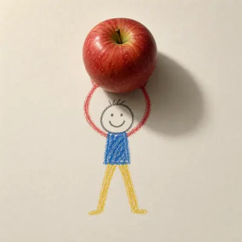</a>

<b><a href="https://gpt-image-2-hub-seven.vercel.app/#m-2d-3d-medium-collision%2Fseries-crayon-apple-carrier%2F01-paper-figure-reference">纸面小人基准</a></b>

</td>
<td width="33%" valign="top" align="center">

<a href="https://gpt-image-2-hub-seven.vercel.app/#m-2d-3d-medium-collision%2Fsingle-medium-collision-studies%2Fchalk-dinosaur-egg">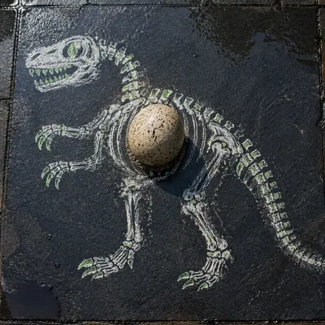</a>

<b><a href="https://gpt-image-2-hub-seven.vercel.app/#m-2d-3d-medium-collision%2Fsingle-medium-collision-studies%2Fchalk-dinosaur-egg">粉笔恐龙蛋</a></b>

</td>
<td width="33%" valign="top" align="center">

<a href="https://gpt-image-2-hub-seven.vercel.app/#m-2d-3d-medium-collision%2Fseries-crayon-apple-carrier%2F02-glass-marble-lift">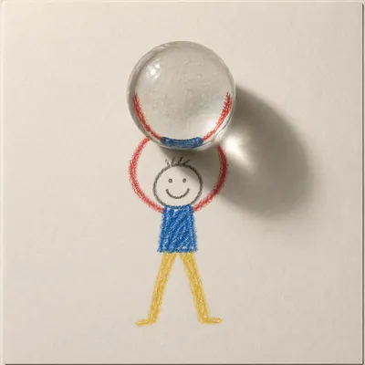</a>

<b><a href="https://gpt-image-2-hub-seven.vercel.app/#m-2d-3d-medium-collision%2Fseries-crayon-apple-carrier%2F02-glass-marble-lift">举起玻璃弹珠</a></b>

</td>
</tr>
<tr>
<td width="33%" valign="top" align="center">

<a href="https://gpt-image-2-hub-seven.vercel.app/#m-2d-3d-medium-collision%2Fsingle-medium-collision-studies%2Fink-cat-fishbowl">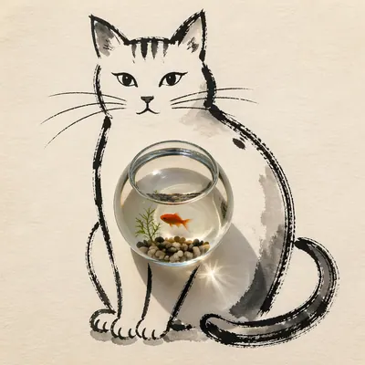</a>

<b><a href="https://gpt-image-2-hub-seven.vercel.app/#m-2d-3d-medium-collision%2Fsingle-medium-collision-studies%2Fink-cat-fishbowl">墨猫鱼缸</a></b>

</td>
<td width="33%" valign="top" align="center">

<a href="https://gpt-image-2-hub-seven.vercel.app/#m-2d-3d-medium-collision%2Fseries-crayon-apple-carrier%2F03-metal-cube-balance">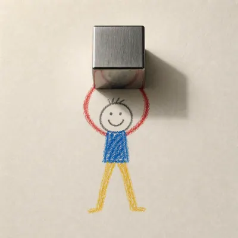</a>

<b><a href="https://gpt-image-2-hub-seven.vercel.app/#m-2d-3d-medium-collision%2Fseries-crayon-apple-carrier%2F03-metal-cube-balance">平衡金属方块</a></b>

</td>
<td width="33%" valign="top" align="center">

<a href="https://gpt-image-2-hub-seven.vercel.app/#m-2d-3d-medium-collision%2Fsingle-medium-collision-studies%2Fcollage-astronaut-orange">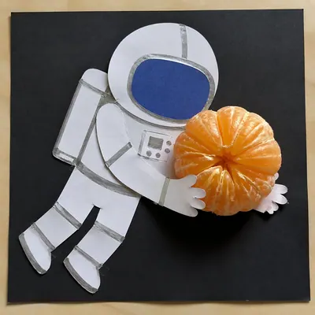</a>

<b><a href="https://gpt-image-2-hub-seven.vercel.app/#m-2d-3d-medium-collision%2Fsingle-medium-collision-studies%2Fcollage-astronaut-orange">拼贴宇航员与橙瓣</a></b>

</td>
</tr>
</table>

## [抽象表现主义 · Pollock 滴画 / Rothko 色域](https://gpt-image-2-hub-seven.vercel.app/#t-abstract-expressionism-study)

> 抽象表现主义 · Pollock 滴画 / Rothko 色域：Pollock 滴溅混沌线条 / Rothko 大色块渐变叠加 / de Kooning 女性碎片 / Kline 黑白书法笔

<table>
<tr>
<td width="33%" valign="top" align="center">

<a href="https://gpt-image-2-hub-seven.vercel.app/#m-abstract-expressionism-study%2Fsingle-abstract-expressionism-studies%2Fdrip-constellation">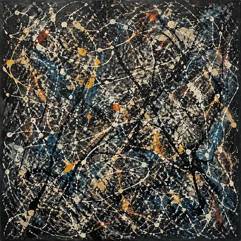</a>

<b><a href="https://gpt-image-2-hub-seven.vercel.app/#m-abstract-expressionism-study%2Fsingle-abstract-expressionism-studies%2Fdrip-constellation">滴画星群</a></b>

</td>
<td width="33%" valign="top" align="center">

<a href="https://gpt-image-2-hub-seven.vercel.app/#m-abstract-expressionism-study%2Fsingle-abstract-expressionism-studies%2Fcolor-field-threshold">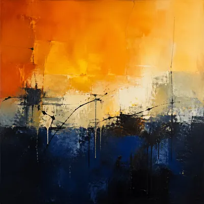</a>

<b><a href="https://gpt-image-2-hub-seven.vercel.app/#m-abstract-expressionism-study%2Fsingle-abstract-expressionism-studies%2Fcolor-field-threshold">色域门槛</a></b>

</td>
<td width="33%" valign="top" align="center">

<a href="https://gpt-image-2-hub-seven.vercel.app/#m-abstract-expressionism-study%2Fsingle-abstract-expressionism-studies%2Ffractured-figure-surge">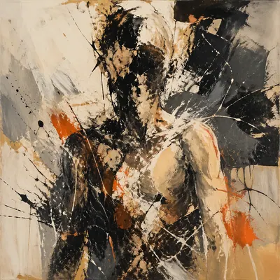</a>

<b><a href="https://gpt-image-2-hub-seven.vercel.app/#m-abstract-expressionism-study%2Fsingle-abstract-expressionism-studies%2Ffractured-figure-surge">碎形浪潮</a></b>

</td>
</tr>
<tr>
<td width="33%" valign="top" align="center">

<a href="https://gpt-image-2-hub-seven.vercel.app/#m-abstract-expressionism-study%2Fsingle-abstract-expressionism-studies%2Fblack-brush-choir">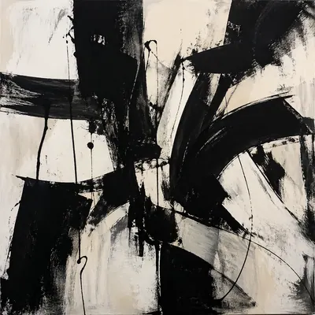</a>

<b><a href="https://gpt-image-2-hub-seven.vercel.app/#m-abstract-expressionism-study%2Fsingle-abstract-expressionism-studies%2Fblack-brush-choir">黑笔合奏</a></b>

</td>
<td width="33%" valign="top" align="center">

<a href="https://gpt-image-2-hub-seven.vercel.app/#m-abstract-expressionism-study%2Fsingle-abstract-expressionism-studies%2Fstudio-floor-afterimage">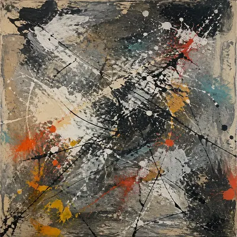</a>

<b><a href="https://gpt-image-2-hub-seven.vercel.app/#m-abstract-expressionism-study%2Fsingle-abstract-expressionism-studies%2Fstudio-floor-afterimage">地面残像</a></b>

</td>
<td width="33%" valign="top" align="center">

<a href="https://gpt-image-2-hub-seven.vercel.app/#m-abstract-expressionism-study%2Fsingle-abstract-expressionism-studies%2Fimpasto-weather">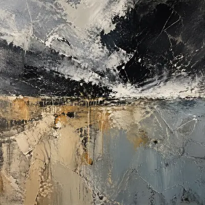</a>

<b><a href="https://gpt-image-2-hub-seven.vercel.app/#m-abstract-expressionism-study%2Fsingle-abstract-expressionism-studies%2Fimpasto-weather">厚涂天气</a></b>

</td>
</tr>
</table>

## [Ambigram 双向字 · 旋转 180° 可读](https://gpt-image-2-hub-seven.vercel.app/#t-ambigram-readability)

> 测试双向字形工程: 正读、倒读、镜像和材质应用中,指定文字必须清晰、无多余字符,几何规则可被肉眼验证。

<table>
<tr>
<td width="33%" valign="top" align="center">

<a href="https://gpt-image-2-hub-seven.vercel.app/#m-ambigram-readability%2Fsingle-ambigram-studies%2Fgpt-image-gothic-plaque">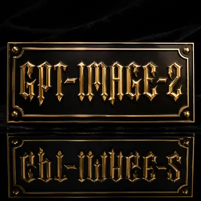</a>

<b><a href="https://gpt-image-2-hub-seven.vercel.app/#m-ambigram-readability%2Fsingle-ambigram-studies%2Fgpt-image-gothic-plaque">GPT Image 哥特牌匾</a></b>

</td>
<td width="33%" valign="top" align="center">

<a href="https://gpt-image-2-hub-seven.vercel.app/#m-ambigram-readability%2Fsingle-ambigram-studies%2Fatlas-tattoo-stencil">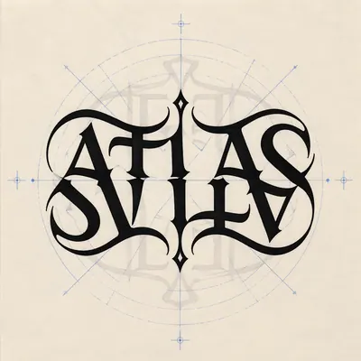</a>

<b><a href="https://gpt-image-2-hub-seven.vercel.app/#m-ambigram-readability%2Fsingle-ambigram-studies%2Fatlas-tattoo-stencil">ATLAS 纹身模板</a></b>

</td>
<td width="33%" valign="top" align="center">

<a href="https://gpt-image-2-hub-seven.vercel.app/#m-ambigram-readability%2Fsingle-ambigram-studies%2Frise-fall-poster">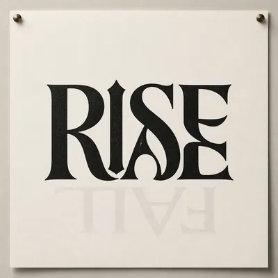</a>

<b><a href="https://gpt-image-2-hub-seven.vercel.app/#m-ambigram-readability%2Fsingle-ambigram-studies%2Frise-fall-poster">RISE / FALL 海报</a></b>

</td>
</tr>
<tr>
<td width="33%" valign="top" align="center">

<a href="https://gpt-image-2-hub-seven.vercel.app/#m-ambigram-readability%2Fsingle-ambigram-studies%2Fflow-wave-ring">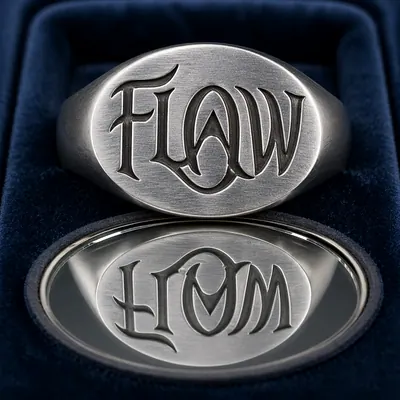</a>

<b><a href="https://gpt-image-2-hub-seven.vercel.app/#m-ambigram-readability%2Fsingle-ambigram-studies%2Fflow-wave-ring">FLOW / WAVE 戒面</a></b>

</td>
<td width="33%" valign="top" align="center">

<a href="https://gpt-image-2-hub-seven.vercel.app/#m-ambigram-readability%2Fsingle-ambigram-studies%2Fcode-arts-logo">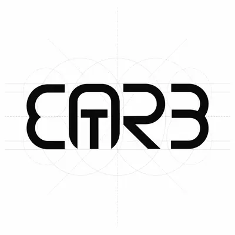</a>

<b><a href="https://gpt-image-2-hub-seven.vercel.app/#m-ambigram-readability%2Fsingle-ambigram-studies%2Fcode-arts-logo">CODE / ARTS 标志</a></b>

</td>
<td width="33%" valign="top" align="center">

<b><a href="https://gpt-image-2-hub-seven.vercel.app/#m-ambigram-readability%2Fsingle-ambigram-studies%2Fdream-awake-neon">DREAM / AWAKE 霓虹</a></b>

</td>
</tr>
</table>

## [变形透视艺术](https://gpt-image-2-hub-seven.vercel.app/#t-anamorphic-perspective-art)

> 测试只在特定视角成立的变形透视图案。

<table>
<tr>
<td width="33%" valign="top" align="center">

<b><a href="https://gpt-image-2-hub-seven.vercel.app/#m-anamorphic-perspective-art%2Fsingle-anamorphic-studies%2Frooftop-atlas-mark">屋顶 ATLAS 标记</a></b>

</td>
<td width="33%" valign="top" align="center">

<a href="https://gpt-image-2-hub-seven.vercel.app/#m-anamorphic-perspective-art%2Fsingle-anamorphic-studies%2Fgallery-cylinder-shadow">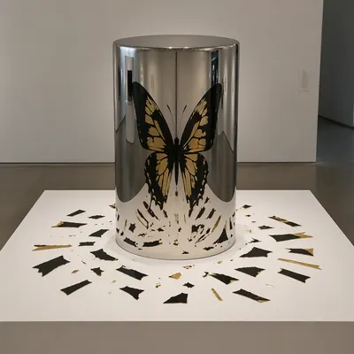</a>

<b><a href="https://gpt-image-2-hub-seven.vercel.app/#m-anamorphic-perspective-art%2Fsingle-anamorphic-studies%2Fgallery-cylinder-shadow">画廊圆柱反射</a></b>

</td>
<td width="33%" valign="top" align="center">

<a href="https://gpt-image-2-hub-seven.vercel.app/#m-anamorphic-perspective-art%2Fsingle-anamorphic-studies%2Fstation-floor-arrow">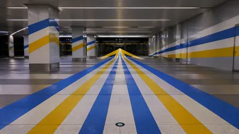</a>

<b><a href="https://gpt-image-2-hub-seven.vercel.app/#m-anamorphic-perspective-art%2Fsingle-anamorphic-studies%2Fstation-floor-arrow">站厅地面箭头</a></b>

</td>
</tr>
</table>

## [古籍复原 · 对照页](https://gpt-image-2-hub-seven.vercel.app/#t-ancient-book-restoration)

> 古籍复原 · 对照页：《永乐大典》残页 + 现代复原 + 注释 + 年代对照

<table>
<tr>
<td width="33%" valign="top" align="center">

<a href="https://gpt-image-2-hub-seven.vercel.app/#m-ancient-book-restoration%2Fsingle-ancient-book-restoration-studies%2Fsurface-hero">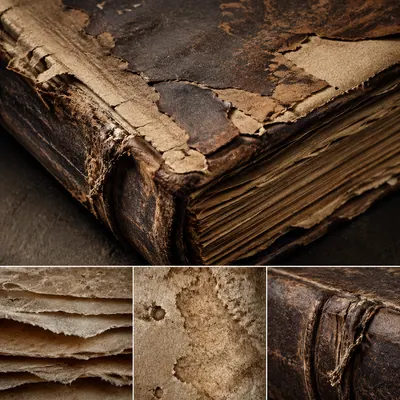</a>

<b><a href="https://gpt-image-2-hub-seven.vercel.app/#m-ancient-book-restoration%2Fsingle-ancient-book-restoration-studies%2Fsurface-hero">材质主图</a></b>

</td>
<td width="33%" valign="top" align="center">

<b><a href="https://gpt-image-2-hub-seven.vercel.app/#m-ancient-book-restoration%2Fsingle-ancient-book-restoration-studies%2Fmacro-study">微距研究</a></b>

</td>
<td width="33%" valign="top" align="center">

<a href="https://gpt-image-2-hub-seven.vercel.app/#m-ancient-book-restoration%2Fsingle-ancient-book-restoration-studies%2Fside-light-study">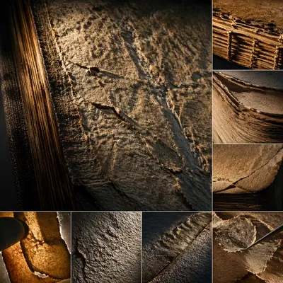</a>

<b><a href="https://gpt-image-2-hub-seven.vercel.app/#m-ancient-book-restoration%2Fsingle-ancient-book-restoration-studies%2Fside-light-study">侧光研究</a></b>

</td>
</tr>
<tr>
<td width="33%" valign="top" align="center">

<a href="https://gpt-image-2-hub-seven.vercel.app/#m-ancient-book-restoration%2Fsingle-ancient-book-restoration-studies%2Fprocess-trace">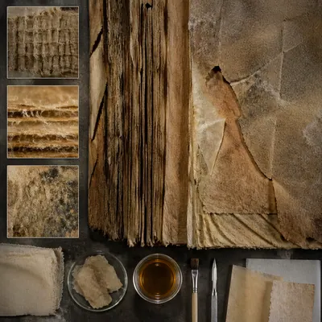</a>

<b><a href="https://gpt-image-2-hub-seven.vercel.app/#m-ancient-book-restoration%2Fsingle-ancient-book-restoration-studies%2Fprocess-trace">工艺痕迹</a></b>

</td>
<td width="33%" valign="top" align="center">

<a href="https://gpt-image-2-hub-seven.vercel.app/#m-ancient-book-restoration%2Fsingle-ancient-book-restoration-studies%2Fspecimen-table">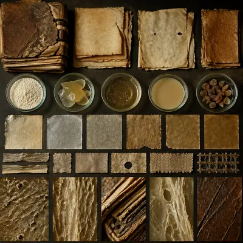</a>

<b><a href="https://gpt-image-2-hub-seven.vercel.app/#m-ancient-book-restoration%2Fsingle-ancient-book-restoration-studies%2Fspecimen-table">标本桌面</a></b>

</td>
<td width="33%" valign="top" align="center">

<b><a href="https://gpt-image-2-hub-seven.vercel.app/#m-ancient-book-restoration%2Fsingle-ancient-book-restoration-studies%2Fatmospheric-view">氛围场景</a></b>

</td>
</tr>
</table>

## [地图 + 信息标注](https://gpt-image-2-hub-seven.vercel.app/#t-annotated-map-design)

> 地图 + 信息标注：古代丝绸之路 + 贸易货品 + 年代标注 · 手绘风但地理准

<table>
<tr>
<td width="33%" valign="top" align="center">

<a href="https://gpt-image-2-hub-seven.vercel.app/#m-annotated-map-design%2Fsingle-annotated-map-design-studies%2Foverview-plate">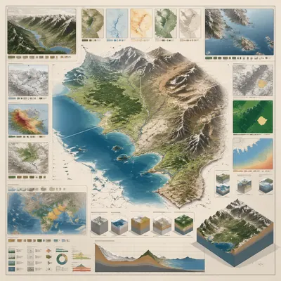</a>

<b><a href="https://gpt-image-2-hub-seven.vercel.app/#m-annotated-map-design%2Fsingle-annotated-map-design-studies%2Foverview-plate">总览板</a></b>

</td>
<td width="33%" valign="top" align="center">

<a href="https://gpt-image-2-hub-seven.vercel.app/#m-annotated-map-design%2Fsingle-annotated-map-design-studies%2Fcutaway-panel">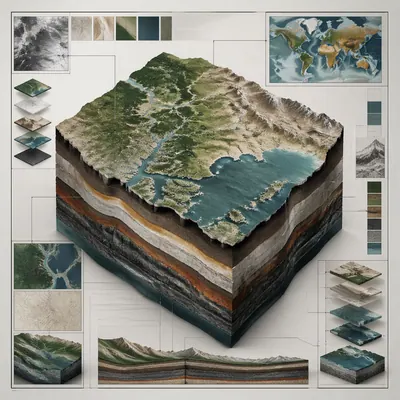</a>

<b><a href="https://gpt-image-2-hub-seven.vercel.app/#m-annotated-map-design%2Fsingle-annotated-map-design-studies%2Fcutaway-panel">剖面板</a></b>

</td>
<td width="33%" valign="top" align="center">

<a href="https://gpt-image-2-hub-seven.vercel.app/#m-annotated-map-design%2Fsingle-annotated-map-design-studies%2Fprocess-sequence">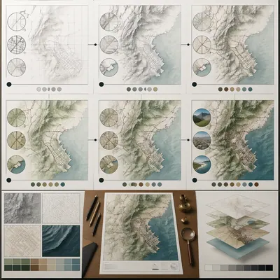</a>

<b><a href="https://gpt-image-2-hub-seven.vercel.app/#m-annotated-map-design%2Fsingle-annotated-map-design-studies%2Fprocess-sequence">流程序列</a></b>

</td>
</tr>
<tr>
<td width="33%" valign="top" align="center">

<a href="https://gpt-image-2-hub-seven.vercel.app/#m-annotated-map-design%2Fsingle-annotated-map-design-studies%2Fannotation-cluster">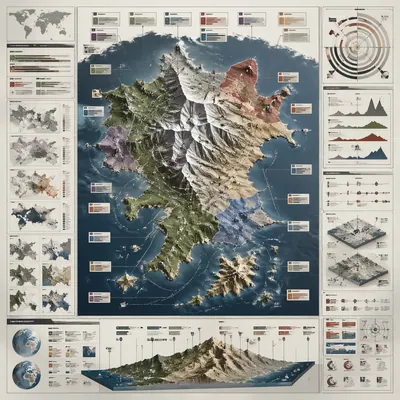</a>

<b><a href="https://gpt-image-2-hub-seven.vercel.app/#m-annotated-map-design%2Fsingle-annotated-map-design-studies%2Fannotation-cluster">注释簇</a></b>

</td>
<td width="33%" valign="top" align="center">

<a href="https://gpt-image-2-hub-seven.vercel.app/#m-annotated-map-design%2Fsingle-annotated-map-design-studies%2Fcomparison-board">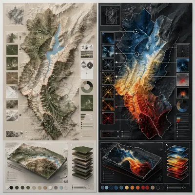</a>

<b><a href="https://gpt-image-2-hub-seven.vercel.app/#m-annotated-map-design%2Fsingle-annotated-map-design-studies%2Fcomparison-board">对照板</a></b>

</td>
<td width="33%" valign="top" align="center">

<a href="https://gpt-image-2-hub-seven.vercel.app/#m-annotated-map-design%2Fsingle-annotated-map-design-studies%2Fmaterial-callout">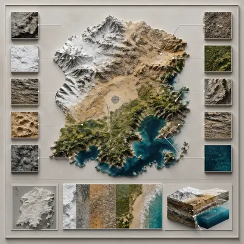</a>

<b><a href="https://gpt-image-2-hub-seven.vercel.app/#m-annotated-map-design%2Fsingle-annotated-map-design-studies%2Fmaterial-callout">材质标注</a></b>

</td>
</tr>
</table>

## [建筑制图 · 平/立/剖 同屏](https://gpt-image-2-hub-seven.vercel.app/#t-architectural-drawing-board)

> 建筑制图 · 平/立/剖 同屏：一栋楼 · 平面图 + 正立面 + 侧剖面 + 总轴测 同屏 · 建筑师级

<table>
<tr>
<td width="33%" valign="top" align="center">

<a href="https://gpt-image-2-hub-seven.vercel.app/#m-architectural-drawing-board%2Fsingle-architectural-drawing-board-studies%2Foverview-plate">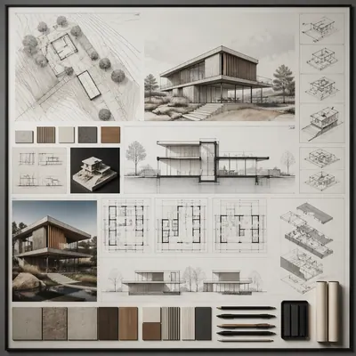</a>

<b><a href="https://gpt-image-2-hub-seven.vercel.app/#m-architectural-drawing-board%2Fsingle-architectural-drawing-board-studies%2Foverview-plate">总览板</a></b>

</td>
<td width="33%" valign="top" align="center">

<a href="https://gpt-image-2-hub-seven.vercel.app/#m-architectural-drawing-board%2Fsingle-architectural-drawing-board-studies%2Fcutaway-panel">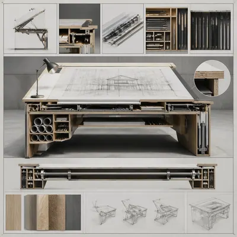</a>

<b><a href="https://gpt-image-2-hub-seven.vercel.app/#m-architectural-drawing-board%2Fsingle-architectural-drawing-board-studies%2Fcutaway-panel">剖面板</a></b>

</td>
<td width="33%" valign="top" align="center">

<a href="https://gpt-image-2-hub-seven.vercel.app/#m-architectural-drawing-board%2Fsingle-architectural-drawing-board-studies%2Fprocess-sequence">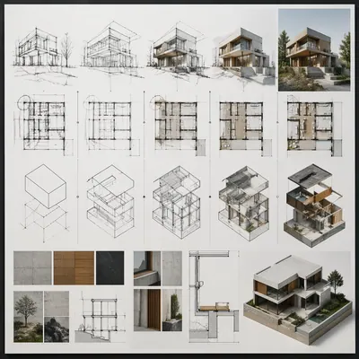</a>

<b><a href="https://gpt-image-2-hub-seven.vercel.app/#m-architectural-drawing-board%2Fsingle-architectural-drawing-board-studies%2Fprocess-sequence">流程序列</a></b>

</td>
</tr>
<tr>
<td width="33%" valign="top" align="center">

<a href="https://gpt-image-2-hub-seven.vercel.app/#m-architectural-drawing-board%2Fsingle-architectural-drawing-board-studies%2Fannotation-cluster">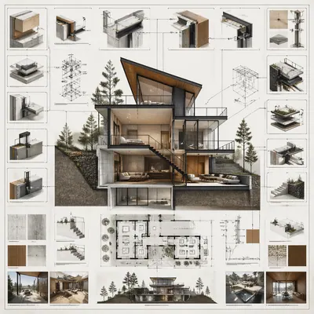</a>

<b><a href="https://gpt-image-2-hub-seven.vercel.app/#m-architectural-drawing-board%2Fsingle-architectural-drawing-board-studies%2Fannotation-cluster">注释簇</a></b>

</td>
<td width="33%" valign="top" align="center">

<a href="https://gpt-image-2-hub-seven.vercel.app/#m-architectural-drawing-board%2Fsingle-architectural-drawing-board-studies%2Fcomparison-board">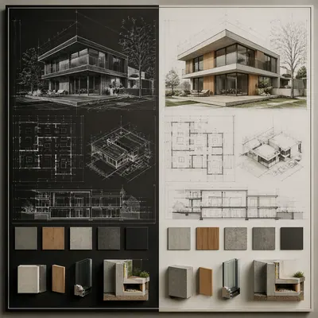</a>

<b><a href="https://gpt-image-2-hub-seven.vercel.app/#m-architectural-drawing-board%2Fsingle-architectural-drawing-board-studies%2Fcomparison-board">对照板</a></b>

</td>
<td width="33%" valign="top" align="center">

<a href="https://gpt-image-2-hub-seven.vercel.app/#m-architectural-drawing-board%2Fsingle-architectural-drawing-board-studies%2Fmaterial-callout">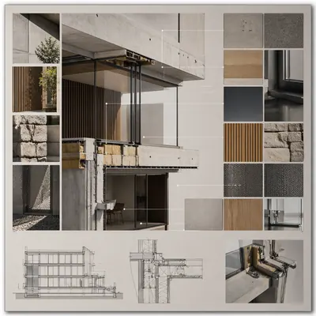</a>

<b><a href="https://gpt-image-2-hub-seven.vercel.app/#m-architectural-drawing-board%2Fsingle-architectural-drawing-board-studies%2Fmaterial-callout">材质标注</a></b>

</td>
</tr>
</table>

## [档案美学 · Wanted / 指纹卡 / 档案页](https://gpt-image-2-hub-seven.vercel.app/#t-archive-aesthetic-file)

> 档案美学 · Wanted / 指纹卡 / 档案页：Old West Wanted 通缉令 + 悬赏 + 罪状 / FBI 档案页 + 指纹 + 侧面照 / 学生档案卡 + 照片 + 成绩

<table>
<tr>
<td width="33%" valign="top" align="center">

<a href="https://gpt-image-2-hub-seven.vercel.app/#m-archive-aesthetic-file%2Fsingle-archive-aesthetic-file-studies%2Fhero-spread">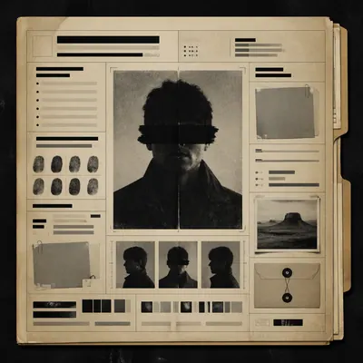</a>

<b><a href="https://gpt-image-2-hub-seven.vercel.app/#m-archive-aesthetic-file%2Fsingle-archive-aesthetic-file-studies%2Fhero-spread">主展开</a></b>

</td>
<td width="33%" valign="top" align="center">

<a href="https://gpt-image-2-hub-seven.vercel.app/#m-archive-aesthetic-file%2Fsingle-archive-aesthetic-file-studies%2Fvariant-grid">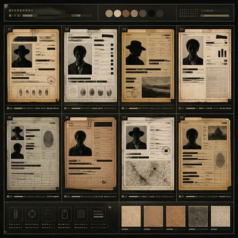</a>

<b><a href="https://gpt-image-2-hub-seven.vercel.app/#m-archive-aesthetic-file%2Fsingle-archive-aesthetic-file-studies%2Fvariant-grid">变体网格</a></b>

</td>
<td width="33%" valign="top" align="center">

<a href="https://gpt-image-2-hub-seven.vercel.app/#m-archive-aesthetic-file%2Fsingle-archive-aesthetic-file-studies%2Fdesk-review">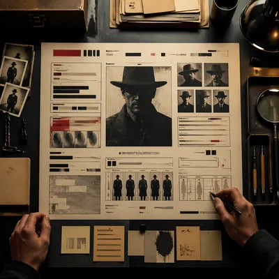</a>

<b><a href="https://gpt-image-2-hub-seven.vercel.app/#m-archive-aesthetic-file%2Fsingle-archive-aesthetic-file-studies%2Fdesk-review">审稿桌面</a></b>

</td>
</tr>
<tr>
<td width="33%" valign="top" align="center">

<a href="https://gpt-image-2-hub-seven.vercel.app/#m-archive-aesthetic-file%2Fsingle-archive-aesthetic-file-studies%2Fmaterial-closeup">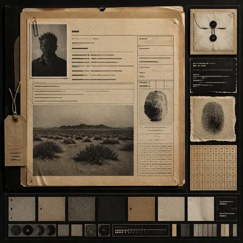</a>

<b><a href="https://gpt-image-2-hub-seven.vercel.app/#m-archive-aesthetic-file%2Fsingle-archive-aesthetic-file-studies%2Fmaterial-closeup">材质特写</a></b>

</td>
<td width="33%" valign="top" align="center">

<a href="https://gpt-image-2-hub-seven.vercel.app/#m-archive-aesthetic-file%2Fsingle-archive-aesthetic-file-studies%2Farchive-sheet">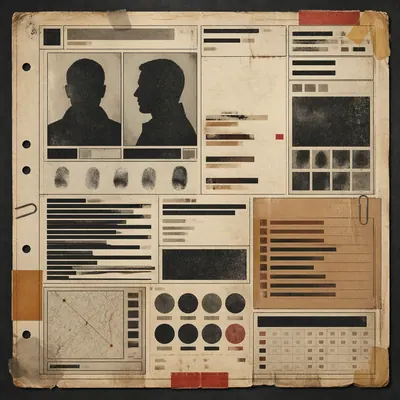</a>

<b><a href="https://gpt-image-2-hub-seven.vercel.app/#m-archive-aesthetic-file%2Fsingle-archive-aesthetic-file-studies%2Farchive-sheet">档案页</a></b>

</td>
<td width="33%" valign="top" align="center">

<a href="https://gpt-image-2-hub-seven.vercel.app/#m-archive-aesthetic-file%2Fsingle-archive-aesthetic-file-studies%2Fretail-presentation">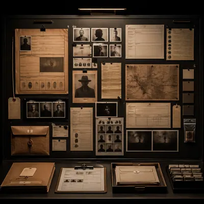</a>

<b><a href="https://gpt-image-2-hub-seven.vercel.app/#m-archive-aesthetic-file%2Fsingle-archive-aesthetic-file-studies%2Fretail-presentation">陈列展示</a></b>

</td>
</tr>
</table>

## [Art Nouveau · Mucha 装饰女性 + 花卉](https://gpt-image-2-hub-seven.vercel.app/#t-art-nouveau-poster)

> Art Nouveau · Mucha 装饰女性 + 花卉：Alphonse Mucha 风 · 飘发女子 + 星形光环 + 百合藤蔓 + 书法 typography · 广告海报(香槟 / 火车 / 烟草)

<table>
<tr>
<td width="33%" valign="top" align="center">

<a href="https://gpt-image-2-hub-seven.vercel.app/#m-art-nouveau-poster%2Fsingle-application-studies%2F01-editorial-study">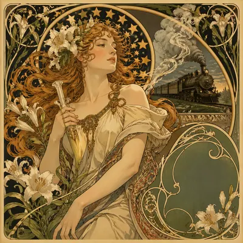</a>

<b><a href="https://gpt-image-2-hub-seven.vercel.app/#m-art-nouveau-poster%2Fsingle-application-studies%2F01-editorial-study">编辑研究</a></b>

</td>
<td width="33%" valign="top" align="center">

<a href="https://gpt-image-2-hub-seven.vercel.app/#m-art-nouveau-poster%2Fsingle-application-studies%2F02-commercial-study">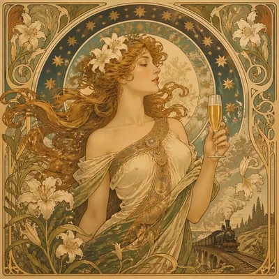</a>

<b><a href="https://gpt-image-2-hub-seven.vercel.app/#m-art-nouveau-poster%2Fsingle-application-studies%2F02-commercial-study">商业研究</a></b>

</td>
<td width="33%" valign="top" align="center">

<a href="https://gpt-image-2-hub-seven.vercel.app/#m-art-nouveau-poster%2Fsingle-application-studies%2F03-technical-study">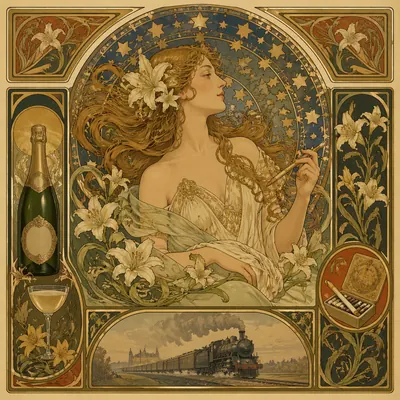</a>

<b><a href="https://gpt-image-2-hub-seven.vercel.app/#m-art-nouveau-poster%2Fsingle-application-studies%2F03-technical-study">技术研究</a></b>

</td>
</tr>
<tr>
<td width="33%" valign="top" align="center">

<b><a href="https://gpt-image-2-hub-seven.vercel.app/#m-art-nouveau-poster%2Fsingle-application-studies%2F04-experimental-study">实验研究</a></b>

</td>
<td width="33%" valign="top" align="center">

<a href="https://gpt-image-2-hub-seven.vercel.app/#m-art-nouveau-poster%2Fsingle-application-studies%2F05-material-study">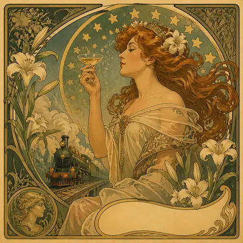</a>

<b><a href="https://gpt-image-2-hub-seven.vercel.app/#m-art-nouveau-poster%2Fsingle-application-studies%2F05-material-study">材质研究</a></b>

</td>
<td width="33%" valign="top" align="center">

<a href="https://gpt-image-2-hub-seven.vercel.app/#m-art-nouveau-poster%2Fsingle-application-studies%2F06-context-study">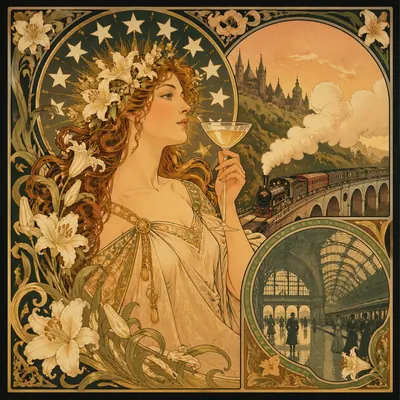</a>

<b><a href="https://gpt-image-2-hub-seven.vercel.app/#m-art-nouveau-poster%2Fsingle-application-studies%2F06-context-study">语境研究</a></b>

</td>
</tr>
</table>

## [Audubon 风生物图谱 · 昆虫 / 鸟类标本盒](https://gpt-image-2-hub-seven.vercel.app/#t-audubon-specimen-atlas)

> Audubon 风生物图谱 · 昆虫 / 鸟类标本盒：John James Audubon 鸟类图鉴风 / Maria Sibylla Merian 昆虫变态图 / 大英博物馆昆虫标本盒整面

<table>
<tr>
<td width="33%" valign="top" align="center">

<a href="https://gpt-image-2-hub-seven.vercel.app/#m-audubon-specimen-atlas%2Fsingle-audubon-specimen-studies%2Fhero-shot">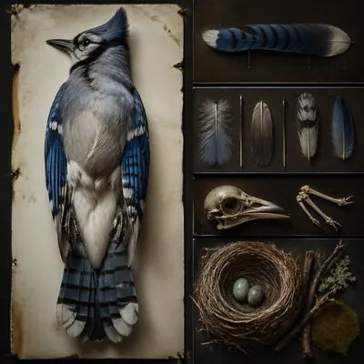</a>

<b><a href="https://gpt-image-2-hub-seven.vercel.app/#m-audubon-specimen-atlas%2Fsingle-audubon-specimen-studies%2Fhero-shot">主镜头</a></b>

</td>
<td width="33%" valign="top" align="center">

<a href="https://gpt-image-2-hub-seven.vercel.app/#m-audubon-specimen-atlas%2Fsingle-audubon-specimen-studies%2Fmacro-study">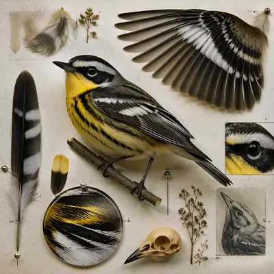</a>

<b><a href="https://gpt-image-2-hub-seven.vercel.app/#m-audubon-specimen-atlas%2Fsingle-audubon-specimen-studies%2Fmacro-study">微距研究</a></b>

</td>
<td width="33%" valign="top" align="center">

<b><a href="https://gpt-image-2-hub-seven.vercel.app/#m-audubon-specimen-atlas%2Fsingle-audubon-specimen-studies%2Fside-light-study">侧光研究</a></b>

</td>
</tr>
<tr>
<td width="33%" valign="top" align="center">

<a href="https://gpt-image-2-hub-seven.vercel.app/#m-audubon-specimen-atlas%2Fsingle-audubon-specimen-studies%2Fmotion-moment">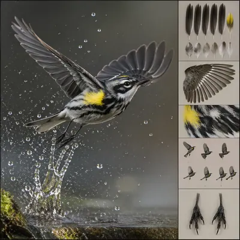</a>

<b><a href="https://gpt-image-2-hub-seven.vercel.app/#m-audubon-specimen-atlas%2Fsingle-audubon-specimen-studies%2Fmotion-moment">动态瞬间</a></b>

</td>
<td width="33%" valign="top" align="center">

<a href="https://gpt-image-2-hub-seven.vercel.app/#m-audubon-specimen-atlas%2Fsingle-audubon-specimen-studies%2Flow-light-atlas">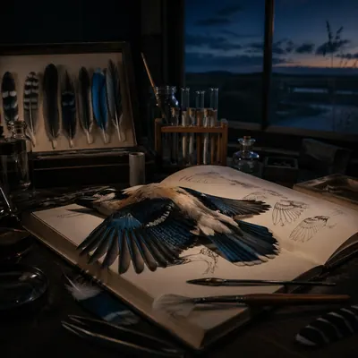</a>

<b><a href="https://gpt-image-2-hub-seven.vercel.app/#m-audubon-specimen-atlas%2Fsingle-audubon-specimen-studies%2Flow-light-atlas">低照图谱</a></b>

</td>
<td width="33%" valign="top" align="center">

<b><a href="https://gpt-image-2-hub-seven.vercel.app/#m-audubon-specimen-atlas%2Fsingle-audubon-specimen-studies%2Fspecimen-table">标本桌面</a></b>

</td>
</tr>
</table>

## [汽车 Concept Art · 设计工作室级](https://gpt-image-2-hub-seven.vercel.app/#t-automotive-concept-art)

> 汽车 Concept Art · 设计工作室级：风格:碳笔草图 + 马克笔快速上色 · 3/4 侧面 + 前视 + 侧视 + 俯视 4 视图 · 铅笔网格辅助线 · 例:概念跑车 / 月球车 / 蒸汽朋克机车

<table>
<tr>
<td width="33%" valign="top" align="center">

<b><a href="https://gpt-image-2-hub-seven.vercel.app/#m-automotive-concept-art%2Fsingle-automotive-concept-art-studies%2Fhero-model">主模型</a></b>

</td>
<td width="33%" valign="top" align="center">

<b><a href="https://gpt-image-2-hub-seven.vercel.app/#m-automotive-concept-art%2Fsingle-automotive-concept-art-studies%2Fexploded-arrangement">爆炸排列</a></b>

</td>
<td width="33%" valign="top" align="center">

<b><a href="https://gpt-image-2-hub-seven.vercel.app/#m-automotive-concept-art%2Fsingle-automotive-concept-art-studies%2Fmaterial-pass">材质通道</a></b>

</td>
</tr>
<tr>
<td width="33%" valign="top" align="center">

<b><a href="https://gpt-image-2-hub-seven.vercel.app/#m-automotive-concept-art%2Fsingle-automotive-concept-art-studies%2Fstudio-turn">转台视角</a></b>

</td>
<td width="33%" valign="top" align="center">

<b><a href="https://gpt-image-2-hub-seven.vercel.app/#m-automotive-concept-art%2Fsingle-automotive-concept-art-studies%2Fscale-comparison">尺度对照</a></b>

</td>
<td width="33%" valign="top" align="center">

<b><a href="https://gpt-image-2-hub-seven.vercel.app/#m-automotive-concept-art%2Fsingle-automotive-concept-art-studies%2Fdetail-closeup">细节特写</a></b>

</td>
</tr>
</table>

## [书籍装帧系列 · 丛书](https://gpt-image-2-hub-seven.vercel.app/#t-book-series-design)

> 书籍装帧系列 · 丛书：一套 6-10 本丛书封面(主题:世界文学 / 哲学经典 / 科幻十大)· 风格统一 · 配色 / 字体 / 装饰一致但各自主题 · 书脊排成一排成图案

<table>
<tr>
<td width="33%" valign="top" align="center">

<b><a href="https://gpt-image-2-hub-seven.vercel.app/#m-book-series-design%2Fsingle-book-series-design-studies%2Fhero-spread">主展开</a></b>

</td>
<td width="33%" valign="top" align="center">

<b><a href="https://gpt-image-2-hub-seven.vercel.app/#m-book-series-design%2Fsingle-book-series-design-studies%2Fvariant-grid">变体网格</a></b>

</td>
<td width="33%" valign="top" align="center">

<b><a href="https://gpt-image-2-hub-seven.vercel.app/#m-book-series-design%2Fsingle-book-series-design-studies%2Fdesk-review">审稿桌面</a></b>

</td>
</tr>
<tr>
<td width="33%" valign="top" align="center">

<b><a href="https://gpt-image-2-hub-seven.vercel.app/#m-book-series-design%2Fsingle-book-series-design-studies%2Fmaterial-closeup">材质特写</a></b>

</td>
<td width="33%" valign="top" align="center">

<b><a href="https://gpt-image-2-hub-seven.vercel.app/#m-book-series-design%2Fsingle-book-series-design-studies%2Farchive-sheet">档案页</a></b>

</td>
<td width="33%" valign="top" align="center">

<b><a href="https://gpt-image-2-hub-seven.vercel.app/#m-book-series-design%2Fsingle-book-series-design-studies%2Fretail-presentation">陈列展示</a></b>

</td>
</tr>
</table>

## [品牌 × 艺术家跨界联名 mockup](https://gpt-image-2-hub-seven.vercel.app/#t-brand-artist-collab-mockup)

> 围绕虚构品牌与艺术家跨界联名的商业样机主题,测试产品、包装与广告海报三件套的结构化版式和风格迁移。

<table>
<tr>
<td width="33%" valign="top" align="center">

<b><a href="https://gpt-image-2-hub-seven.vercel.app/#m-brand-artist-collab-mockup%2Fsingle-collab-proposal-studies%2Fathletic-toy-window">运动玩具橱窗</a></b>

</td>
<td width="33%" valign="top" align="center">

<b><a href="https://gpt-image-2-hub-seven.vercel.app/#m-brand-artist-collab-mockup%2Fsingle-collab-proposal-studies%2Fsoda-stencil-billboard">汽水模板海报</a></b>

</td>
<td width="33%" valign="top" align="center">

<b><a href="https://gpt-image-2-hub-seven.vercel.app/#m-brand-artist-collab-mockup%2Fsingle-collab-proposal-studies%2Fphone-dot-gallery">手机圆点画廊</a></b>

</td>
</tr>
<tr>
<td width="33%" valign="top" align="center">

<b><a href="https://gpt-image-2-hub-seven.vercel.app/#m-brand-artist-collab-mockup%2Fsingle-collab-proposal-studies%2Fsneaker-animation-case">球鞋动画收纳盒</a></b>

</td>
<td width="33%" valign="top" align="center">

<b><a href="https://gpt-image-2-hub-seven.vercel.app/#m-brand-artist-collab-mockup%2Fsingle-collab-proposal-studies%2Fperfume-calligraphy-counter">香水书法柜台</a></b>

</td>
<td width="33%" valign="top" align="center">

<b><a href="https://gpt-image-2-hub-seven.vercel.app/#m-brand-artist-collab-mockup%2Fsingle-collab-proposal-studies%2Fcoffee-riso-launch-kit">咖啡孔版上市套装</a></b>

</td>
</tr>
</table>

## [品牌 Identity 全套 mockup](https://gpt-image-2-hub-seven.vercel.app/#t-brand-identity-mockup-set)

> 品牌 Identity 全套 mockup：一套 8 件:logo (彩/黑白/白底)+ 名片 + 信封 + T恤 + 马克杯 + 帆布袋 + 社交封面 + 包装盒 · 品牌色贯穿

<table>
<tr>
<td width="33%" valign="top" align="center">

<b><a href="https://gpt-image-2-hub-seven.vercel.app/#m-brand-identity-mockup-set%2Fsingle-brand-identity-mockup-set-studies%2Fhero-mockup">主样机</a></b>

</td>
<td width="33%" valign="top" align="center">

<b><a href="https://gpt-image-2-hub-seven.vercel.app/#m-brand-identity-mockup-set%2Fsingle-brand-identity-mockup-set-studies%2Fvariant-grid">变体网格</a></b>

</td>
<td width="33%" valign="top" align="center">

<b><a href="https://gpt-image-2-hub-seven.vercel.app/#m-brand-identity-mockup-set%2Fsingle-brand-identity-mockup-set-studies%2Fdesk-review">审稿桌面</a></b>

</td>
</tr>
<tr>
<td width="33%" valign="top" align="center">

<b><a href="https://gpt-image-2-hub-seven.vercel.app/#m-brand-identity-mockup-set%2Fsingle-brand-identity-mockup-set-studies%2Fmaterial-closeup">材质特写</a></b>

</td>
<td width="33%" valign="top" align="center">

<b><a href="https://gpt-image-2-hub-seven.vercel.app/#m-brand-identity-mockup-set%2Fsingle-brand-identity-mockup-set-studies%2Farchive-proof">打样存档</a></b>

</td>
<td width="33%" valign="top" align="center">

<b><a href="https://gpt-image-2-hub-seven.vercel.app/#m-brand-identity-mockup-set%2Fsingle-brand-identity-mockup-set-studies%2Fretail-shelf">零售货架</a></b>

</td>
</tr>
</table>

## [Character Turnaround 角色四视图](https://gpt-image-2-hub-seven.vercel.app/#t-character-turnaround)

> Character Turnaround 角色四视图：以游戏与动画工业制图语言测试同一角色在正面、四分之三侧面、侧面和背面中的稳定一致性。

<table>
<tr>
<td width="33%" valign="top" align="center">

<b><a href="https://gpt-image-2-hub-seven.vercel.app/#m-character-turnaround%2Fseries-courier-variant-turnarounds%2F01-reference-courier-sheet">基准信使设定图</a></b>

</td>
<td width="33%" valign="top" align="center">

<b><a href="https://gpt-image-2-hub-seven.vercel.app/#m-character-turnaround%2Fsingle-turnaround-sheet-studies%2Farcology-medic-turnaround">巨构医护四视图</a></b>

</td>
<td width="33%" valign="top" align="center">

<b><a href="https://gpt-image-2-hub-seven.vercel.app/#m-character-turnaround%2Fseries-courier-variant-turnarounds%2F02-arctic-expedition-sheet">极地远征设定图</a></b>

</td>
</tr>
<tr>
<td width="33%" valign="top" align="center">

<b><a href="https://gpt-image-2-hub-seven.vercel.app/#m-character-turnaround%2Fsingle-turnaround-sheet-studies%2Freef-salvager-turnaround">礁区打捞员四视图</a></b>

</td>
<td width="33%" valign="top" align="center">

<b><a href="https://gpt-image-2-hub-seven.vercel.app/#m-character-turnaround%2Fseries-courier-variant-turnarounds%2F03-desert-scout-sheet">沙漠侦察设定图</a></b>

</td>
<td width="33%" valign="top" align="center">

<b><a href="https://gpt-image-2-hub-seven.vercel.app/#m-character-turnaround%2Fsingle-turnaround-sheet-studies%2Flunar-botanist-turnaround">月面植物学家四视图</a></b>

</td>
</tr>
</table>

## [黏土 claymation 风](https://gpt-image-2-hub-seven.vercel.app/#t-claymation-style)

> 黏土 claymation 风：整个人 / 动物 / 场景都是黏土捏成 · 有捏痕 · 粘土反光 · stop motion 感

<table>
<tr>
<td width="33%" valign="top" align="center">

<b><a href="https://gpt-image-2-hub-seven.vercel.app/#m-claymation-style%2Fsingle-claymation-style-studies%2Fhero-model">主模型</a></b>

</td>
<td width="33%" valign="top" align="center">

<b><a href="https://gpt-image-2-hub-seven.vercel.app/#m-claymation-style%2Fsingle-claymation-style-studies%2Fexploded-arrangement">爆炸排列</a></b>

</td>
<td width="33%" valign="top" align="center">

<b><a href="https://gpt-image-2-hub-seven.vercel.app/#m-claymation-style%2Fsingle-claymation-style-studies%2Fmaterial-pass">材质通道</a></b>

</td>
</tr>
<tr>
<td width="33%" valign="top" align="center">

<b><a href="https://gpt-image-2-hub-seven.vercel.app/#m-claymation-style%2Fsingle-claymation-style-studies%2Fstudio-turn">转台视角</a></b>

</td>
<td width="33%" valign="top" align="center">

<b><a href="https://gpt-image-2-hub-seven.vercel.app/#m-claymation-style%2Fsingle-claymation-style-studies%2Fscale-comparison">尺度对照</a></b>

</td>
<td width="33%" valign="top" align="center">

<b><a href="https://gpt-image-2-hub-seven.vercel.app/#m-claymation-style%2Fsingle-claymation-style-studies%2Fdetail-closeup">细节特写</a></b>

</td>
</tr>
</table>

## [复杂光学 · caustics / subsurface](https://gpt-image-2-hub-seven.vercel.app/#t-complex-optics-materials)

> 复杂光学 · caustics / subsurface：水波折射到水底光斑(焦散)/ 蜡烛照脸皮肤透光(次表面散射)/ 钻石多面反射

<table>
<tr>
<td width="33%" valign="top" align="center">

<b><a href="https://gpt-image-2-hub-seven.vercel.app/#m-complex-optics-materials%2Fsingle-complex-optics-materials-studies%2Fsurface-hero">材质主图</a></b>

</td>
<td width="33%" valign="top" align="center">

<b><a href="https://gpt-image-2-hub-seven.vercel.app/#m-complex-optics-materials%2Fsingle-complex-optics-materials-studies%2Fmacro-study">微距研究</a></b>

</td>
<td width="33%" valign="top" align="center">

<b><a href="https://gpt-image-2-hub-seven.vercel.app/#m-complex-optics-materials%2Fsingle-complex-optics-materials-studies%2Fside-light-study">侧光研究</a></b>

</td>
</tr>
<tr>
<td width="33%" valign="top" align="center">

<b><a href="https://gpt-image-2-hub-seven.vercel.app/#m-complex-optics-materials%2Fsingle-complex-optics-materials-studies%2Fprocess-trace">工艺痕迹</a></b>

</td>
<td width="33%" valign="top" align="center">

<b><a href="https://gpt-image-2-hub-seven.vercel.app/#m-complex-optics-materials%2Fsingle-complex-optics-materials-studies%2Fspecimen-table">标本桌面</a></b>

</td>
<td width="33%" valign="top" align="center">

<b><a href="https://gpt-image-2-hub-seven.vercel.app/#m-complex-optics-materials%2Fsingle-complex-optics-materials-studies%2Fatmospheric-view">氛围场景</a></b>

</td>
</tr>
</table>

## [多轮对话式编辑工作流](https://gpt-image-2-hub-seven.vercel.app/#t-conversational-editing-workflow)

> 测试免 mask 的多轮对话式图像编辑：在连续语义修改中保留大部分场景、布局和视觉身份。

<table>
<tr>
<td width="33%" valign="top" align="center">

<b><a href="https://gpt-image-2-hub-seven.vercel.app/#m-conversational-editing-workflow%2Fseries-iterative-poster-edit%2F01-base-transit-poster">基础交通海报</a></b>

</td>
<td width="33%" valign="top" align="center">

<b><a href="https://gpt-image-2-hub-seven.vercel.app/#m-conversational-editing-workflow%2Fsingle-editing-scenarios%2Fcafe-menu-revision">咖啡菜单修订</a></b>

</td>
<td width="33%" valign="top" align="center">

<b><a href="https://gpt-image-2-hub-seven.vercel.app/#m-conversational-editing-workflow%2Fsingle-editing-scenarios%2Fproduct-colorway-edit">产品配色编辑</a></b>

</td>
</tr>
<tr>
<td width="33%" valign="top" align="center">

<b><a href="https://gpt-image-2-hub-seven.vercel.app/#m-conversational-editing-workflow%2Fseries-iterative-poster-edit%2F03-larger-cooler-heading">放大标题并降温配色</a></b>

</td>
<td width="33%" valign="top" align="center">

<b><a href="https://gpt-image-2-hub-seven.vercel.app/#m-conversational-editing-workflow%2Fsingle-editing-scenarios%2Fliving-room-declutter">客厅去杂物</a></b>

</td>
<td width="33%" valign="top" align="center">

<b><a href="https://gpt-image-2-hub-seven.vercel.app/#m-conversational-editing-workflow%2Fseries-iterative-poster-edit%2F04-final-balanced-campaign">最终平衡版广告</a></b>

</td>
</tr>
</table>

## [法庭画家速写](https://gpt-image-2-hub-seven.vercel.app/#t-courtroom-sketch)

> 法庭画家速写：风格:彩色铅笔 + 水彩淡彩 + 速写纸 · 法官 / 被告 / 律师 / 陪审团表情捕捉 · 例:世纪审判瞬间 + 报纸报道配图级

<table>
<tr>
<td width="33%" valign="top" align="center">

<b><a href="https://gpt-image-2-hub-seven.vercel.app/#m-courtroom-sketch%2Fsingle-courtroom-sketch-studies%2Fdrip-constellation">滴画星群</a></b>

</td>
<td width="33%" valign="top" align="center">

<b><a href="https://gpt-image-2-hub-seven.vercel.app/#m-courtroom-sketch%2Fsingle-courtroom-sketch-studies%2Fcolor-field-threshold">色域门槛</a></b>

</td>
<td width="33%" valign="top" align="center">

<b><a href="https://gpt-image-2-hub-seven.vercel.app/#m-courtroom-sketch%2Fsingle-courtroom-sketch-studies%2Ffractured-figure-surge">碎形浪潮</a></b>

</td>
</tr>
<tr>
<td width="33%" valign="top" align="center">

<b><a href="https://gpt-image-2-hub-seven.vercel.app/#m-courtroom-sketch%2Fsingle-courtroom-sketch-studies%2Fblack-brush-choir">黑笔合奏</a></b>

</td>
<td width="33%" valign="top" align="center">

<b><a href="https://gpt-image-2-hub-seven.vercel.app/#m-courtroom-sketch%2Fsingle-courtroom-sketch-studies%2Fstudio-floor-afterimage">地面残像</a></b>

</td>
<td width="33%" valign="top" align="center">

<b><a href="https://gpt-image-2-hub-seven.vercel.app/#m-courtroom-sketch%2Fsingle-courtroom-sketch-studies%2Fimpasto-weather">厚涂天气</a></b>

</td>
</tr>
</table>

## [水晶球叙事](https://gpt-image-2-hub-seven.vercel.app/#t-crystal-ball-narrative)

> 把变化的微缩世界压进同一颗水晶球，测试主体连续性。

<table>
<tr>
<td width="33%" valign="top" align="center">

<b><a href="https://gpt-image-2-hub-seven.vercel.app/#m-crystal-ball-narrative%2Fseries-oracle-seasons%2F01-reference-oracle">基准预言球</a></b>

</td>
<td width="33%" valign="top" align="center">

<b><a href="https://gpt-image-2-hub-seven.vercel.app/#m-crystal-ball-narrative%2Fseries-oracle-seasons%2F02-spring-oracle">春日预言球</a></b>

</td>
<td width="33%" valign="top" align="center">

<b><a href="https://gpt-image-2-hub-seven.vercel.app/#m-crystal-ball-narrative%2Fseries-oracle-seasons%2F03-autumn-oracle">秋日预言球</a></b>

</td>
</tr>
</table>

## [3D 手办盲盒级可爱](https://gpt-image-2-hub-seven.vercel.app/#t-cute-blind-box-figurine)

> 3D 手办盲盒级可爱：POP MART 风 · 站在透明塑料底座上 · 哑光 PVC 材质 · studio 棚拍 · 背后光晕

<table>
<tr>
<td width="33%" valign="top" align="center">

<b><a href="https://gpt-image-2-hub-seven.vercel.app/#m-cute-blind-box-figurine%2Fsingle-cute-blind-box-figurine-studies%2Fhero-model">主模型</a></b>

</td>
<td width="33%" valign="top" align="center">

<b><a href="https://gpt-image-2-hub-seven.vercel.app/#m-cute-blind-box-figurine%2Fsingle-cute-blind-box-figurine-studies%2Fexploded-arrangement">爆炸排列</a></b>

</td>
<td width="33%" valign="top" align="center">

<b><a href="https://gpt-image-2-hub-seven.vercel.app/#m-cute-blind-box-figurine%2Fsingle-cute-blind-box-figurine-studies%2Fmaterial-pass">材质通道</a></b>

</td>
</tr>
<tr>
<td width="33%" valign="top" align="center">

<b><a href="https://gpt-image-2-hub-seven.vercel.app/#m-cute-blind-box-figurine%2Fsingle-cute-blind-box-figurine-studies%2Fstudio-turn">转台视角</a></b>

</td>
<td width="33%" valign="top" align="center">

<b><a href="https://gpt-image-2-hub-seven.vercel.app/#m-cute-blind-box-figurine%2Fsingle-cute-blind-box-figurine-studies%2Fscale-comparison">尺度对照</a></b>

</td>
<td width="33%" valign="top" align="center">

<b><a href="https://gpt-image-2-hub-seven.vercel.app/#m-cute-blind-box-figurine%2Fsingle-cute-blind-box-figurine-studies%2Fdetail-closeup">细节特写</a></b>

</td>
</tr>
</table>

## [数据可视化 Dashboard 静帧](https://gpt-image-2-hub-seven.vercel.app/#t-dashboard-data-visualization)

> 数据可视化 Dashboard 静帧：金融(股票 K 线 + 雷达 + 热力图)/ 气候(全球温度 + 海平面 + CO2)/ 健康(心率 + 睡眠 + 运动)· 深色 UI + 10+ 图表共存 + 侧边栏

<table>
<tr>
<td width="33%" valign="top" align="center">

<b><a href="https://gpt-image-2-hub-seven.vercel.app/#m-dashboard-data-visualization%2Fsingle-dashboard-data-visualization-studies%2Foverview-plate">总览板</a></b>

</td>
<td width="33%" valign="top" align="center">

<b><a href="https://gpt-image-2-hub-seven.vercel.app/#m-dashboard-data-visualization%2Fsingle-dashboard-data-visualization-studies%2Fcutaway-panel">剖面板</a></b>

</td>
<td width="33%" valign="top" align="center">

<b><a href="https://gpt-image-2-hub-seven.vercel.app/#m-dashboard-data-visualization%2Fsingle-dashboard-data-visualization-studies%2Fprocess-sequence">流程序列</a></b>

</td>
</tr>
<tr>
<td width="33%" valign="top" align="center">

<b><a href="https://gpt-image-2-hub-seven.vercel.app/#m-dashboard-data-visualization%2Fsingle-dashboard-data-visualization-studies%2Fannotation-cluster">注释簇</a></b>

</td>
<td width="33%" valign="top" align="center">

<b><a href="https://gpt-image-2-hub-seven.vercel.app/#m-dashboard-data-visualization%2Fsingle-dashboard-data-visualization-studies%2Fcomparison-board">对照板</a></b>

</td>
<td width="33%" valign="top" align="center">

<b><a href="https://gpt-image-2-hub-seven.vercel.app/#m-dashboard-data-visualization%2Fsingle-dashboard-data-visualization-studies%2Fmaterial-callout">材质标注</a></b>

</td>
</tr>
</table>

## [八格一致性漫画](https://gpt-image-2-hub-seven.vercel.app/#t-eight-panel-consistency-comic)

> 测试多格漫画中的角色身份、产品道具、版式节奏和画风一致性。

<table>
<tr>
<td width="33%" valign="top" align="center">

<b><a href="https://gpt-image-2-hub-seven.vercel.app/#m-eight-panel-consistency-comic%2Fseries-launch-comic%2F01-reference-hero-orb-page">基准主角光球页</a></b>

</td>
<td width="33%" valign="top" align="center">

<b><a href="https://gpt-image-2-hub-seven.vercel.app/#m-eight-panel-consistency-comic%2Fsingle-comic-studies%2Fproduct-demo-board">产品演示分镜</a></b>

</td>
<td width="33%" valign="top" align="center">

<b><a href="https://gpt-image-2-hub-seven.vercel.app/#m-eight-panel-consistency-comic%2Fseries-launch-comic%2F02-rooftop-launch-page">屋顶发布页</a></b>

</td>
</tr>
<tr>
<td width="33%" valign="top" align="center">

<b><a href="https://gpt-image-2-hub-seven.vercel.app/#m-eight-panel-consistency-comic%2Fsingle-comic-studies%2Fcharacter-turnaround-comic">角色转面漫画</a></b>

</td>
<td width="33%" valign="top" align="center">

<b><a href="https://gpt-image-2-hub-seven.vercel.app/#m-eight-panel-consistency-comic%2Fseries-launch-comic%2F03-studio-demo-page">影棚演示页</a></b>

</td>
<td width="33%" valign="top" align="center">

<b><a href="https://gpt-image-2-hub-seven.vercel.app/#m-eight-panel-consistency-comic%2Fsingle-comic-studies%2Flaunch-storefront-comic">店铺发布漫画</a></b>

</td>
</tr>
</table>

## [360° Equirectangular VR 全景](https://gpt-image-2-hub-seven.vercel.app/#t-equirectangular-vr-panorama)

> 测试可放入 VR 头显观看的 2:1 等距矩形全景图，重点考察连续空间、极端画幅和风格化场景稳定性。

<table>
<tr>
<td width="33%" valign="top" align="center">

<b><a href="https://gpt-image-2-hub-seven.vercel.app/#m-equirectangular-vr-panorama%2Fsingle-panorama-studies%2Ffloating-sky-village">悬浮天空村落</a></b>

</td>
<td width="33%" valign="top" align="center">

<b><a href="https://gpt-image-2-hub-seven.vercel.app/#m-equirectangular-vr-panorama%2Fsingle-panorama-studies%2Fundersea-observatory">深海观测舱</a></b>

</td>
<td width="33%" valign="top" align="center">

<b><a href="https://gpt-image-2-hub-seven.vercel.app/#m-equirectangular-vr-panorama%2Fsingle-panorama-studies%2Fmoon-temple-courtyard">月面寺院庭院</a></b>

</td>
</tr>
<tr>
<td width="33%" valign="top" align="center">

<b><a href="https://gpt-image-2-hub-seven.vercel.app/#m-equirectangular-vr-panorama%2Fsingle-panorama-studies%2Fdesert-train-station">沙漠列车站</a></b>

</td>
<td width="33%" valign="top" align="center">

<b><a href="https://gpt-image-2-hub-seven.vercel.app/#m-equirectangular-vr-panorama%2Fsingle-panorama-studies%2Fcrystal-forest-clearing">水晶森林空地</a></b>

</td>
<td width="33%" valign="top" align="center">

<b><a href="https://gpt-image-2-hub-seven.vercel.app/#m-equirectangular-vr-panorama%2Fsingle-panorama-studies%2Fretro-space-habitat">复古太空栖居舱</a></b>

</td>
</tr>
</table>

## [Escher 不可能几何 · 永恒楼梯](https://gpt-image-2-hub-seven.vercel.app/#t-escher-impossible-geometry)

> Escher 不可能几何 · 永恒楼梯：彭罗斯三角、永恒上升楼梯、瀑布循环、相对性空间等数学视觉悖论。

<table>
<tr>
<td width="33%" valign="top" align="center">

<b><a href="https://gpt-image-2-hub-seven.vercel.app/#m-escher-impossible-geometry%2Fsingle-impossible-geometry-studies%2Fpenrose-triangle-terrace">彭罗斯三角露台</a></b>

</td>
<td width="33%" valign="top" align="center">

<b><a href="https://gpt-image-2-hub-seven.vercel.app/#m-escher-impossible-geometry%2Fsingle-impossible-geometry-studies%2Fendless-stair-court">永恒楼梯庭院</a></b>

</td>
<td width="33%" valign="top" align="center">

<b><a href="https://gpt-image-2-hub-seven.vercel.app/#m-escher-impossible-geometry%2Fsingle-impossible-geometry-studies%2Fwaterfall-loop-mill">瀑布循环水磨</a></b>

</td>
</tr>
<tr>
<td width="33%" valign="top" align="center">

<b><a href="https://gpt-image-2-hub-seven.vercel.app/#m-escher-impossible-geometry%2Fsingle-impossible-geometry-studies%2Frelativity-stair-room">相对性楼梯房间</a></b>

</td>
<td width="33%" valign="top" align="center">

<b><a href="https://gpt-image-2-hub-seven.vercel.app/#m-escher-impossible-geometry%2Fsingle-impossible-geometry-studies%2Fimpossible-bridge-archive">不可能桥档案馆</a></b>

</td>
<td width="33%" valign="top" align="center">

<b><a href="https://gpt-image-2-hub-seven.vercel.app/#m-escher-impossible-geometry%2Fsingle-impossible-geometry-studies%2Finfinite-balcony-library">无限阳台图书馆</a></b>

</td>
</tr>
</table>

## [虚构世界手绘地图 · DnD 级](https://gpt-image-2-hub-seven.vercel.app/#t-fantasy-handdrawn-map)

> 虚构世界手绘地图 · DnD 级：自创奇幻大陆 · 山脉 / 森林 / 河流 / 城邦 · 地名拉丁感 · 风玫瑰 + 比例尺 + 装饰边框 + 航线虚线 + Here Be Dragons

<table>
<tr>
<td width="33%" valign="top" align="center">

<b><a href="https://gpt-image-2-hub-seven.vercel.app/#m-fantasy-handdrawn-map%2Fsingle-fantasy-handdrawn-map-studies%2Fdrip-constellation">滴画星群</a></b>

</td>
<td width="33%" valign="top" align="center">

<b><a href="https://gpt-image-2-hub-seven.vercel.app/#m-fantasy-handdrawn-map%2Fsingle-fantasy-handdrawn-map-studies%2Fcolor-field-threshold">色域门槛</a></b>

</td>
<td width="33%" valign="top" align="center">

<b><a href="https://gpt-image-2-hub-seven.vercel.app/#m-fantasy-handdrawn-map%2Fsingle-fantasy-handdrawn-map-studies%2Ffractured-figure-surge">碎形浪潮</a></b>

</td>
</tr>
<tr>
<td width="33%" valign="top" align="center">

<b><a href="https://gpt-image-2-hub-seven.vercel.app/#m-fantasy-handdrawn-map%2Fsingle-fantasy-handdrawn-map-studies%2Fblack-brush-choir">黑笔合奏</a></b>

</td>
<td width="33%" valign="top" align="center">

<b><a href="https://gpt-image-2-hub-seven.vercel.app/#m-fantasy-handdrawn-map%2Fsingle-fantasy-handdrawn-map-studies%2Fstudio-floor-afterimage">地面残像</a></b>

</td>
<td width="33%" valign="top" align="center">

<b><a href="https://gpt-image-2-hub-seven.vercel.app/#m-fantasy-handdrawn-map%2Fsingle-fantasy-handdrawn-map-studies%2Fimpasto-weather">厚涂天气</a></b>

</td>
</tr>
</table>

## [名人虚构 snapshot · 伪手机抓拍](https://gpt-image-2-hub-seven.vercel.app/#t-fictional-celebrity-snapshot)

> 用完全虚构的公众人物制造看似随手拍的日常照片，测试手机照片真实感、场景推理和非真实事件构图。

<table>
<tr>
<td width="33%" valign="top" align="center">

<b><a href="https://gpt-image-2-hub-seven.vercel.app/#m-fictional-celebrity-snapshot%2Fsingle-fictional-snapshots%2Ftech-founder-skate-stop">科技创始人滑板停靠</a></b>

</td>
<td width="33%" valign="top" align="center">

<b><a href="https://gpt-image-2-hub-seven.vercel.app/#m-fictional-celebrity-snapshot%2Fsingle-fictional-snapshots%2Fdesign-icon-corner-store">设计偶像便利店</a></b>

</td>
<td width="33%" valign="top" align="center">

<b><a href="https://gpt-image-2-hub-seven.vercel.app/#m-fictional-celebrity-snapshot%2Fsingle-fictional-snapshots%2Frocket-heiress-playground">火箭继承人游乐场</a></b>

</td>
</tr>
<tr>
<td width="33%" valign="top" align="center">

<b><a href="https://gpt-image-2-hub-seven.vercel.app/#m-fictional-celebrity-snapshot%2Fsingle-fictional-snapshots%2Fpop-diva-laundromat">流行天后洗衣房</a></b>

</td>
<td width="33%" valign="top" align="center">

<b><a href="https://gpt-image-2-hub-seven.vercel.app/#m-fictional-celebrity-snapshot%2Fsingle-fictional-snapshots%2Faction-star-night-market">动作明星夜市</a></b>

</td>
<td width="33%" valign="top" align="center">

<b><a href="https://gpt-image-2-hub-seven.vercel.app/#m-fictional-celebrity-snapshot%2Fsingle-fictional-snapshots%2Ffashion-muse-subway">时装缪斯地铁</a></b>

</td>
</tr>
</table>

## [架空 IP 电影 / 动漫海报](https://gpt-image-2-hub-seven.vercel.app/#t-fictional-ip-poster)

> 架空 IP 电影 / 动漫海报：虚构动漫或科幻片的发布级海报，测试标题字体、演员阵容、上映日期和虚构制片厂标识。

<table>
<tr>
<td width="33%" valign="top" align="center">

<b><a href="https://gpt-image-2-hub-seven.vercel.app/#m-fictional-ip-poster%2Fseries-neon-railway-saga%2F01-key-art-poster">主视觉海报</a></b>

</td>
<td width="33%" valign="top" align="center">

<b><a href="https://gpt-image-2-hub-seven.vercel.app/#m-fictional-ip-poster%2Fsingle-fictional-release-posters%2Fglass-orbit-poster">玻璃轨道海报</a></b>

</td>
<td width="33%" valign="top" align="center">

<b><a href="https://gpt-image-2-hub-seven.vercel.app/#m-fictional-ip-poster%2Fseries-neon-railway-saga%2F02-teaser-poster">先导海报</a></b>

</td>
</tr>
<tr>
<td width="33%" valign="top" align="center">

<b><a href="https://gpt-image-2-hub-seven.vercel.app/#m-fictional-ip-poster%2Fsingle-fictional-release-posters%2Fclockwork-harbor-poster">发条港湾海报</a></b>

</td>
<td width="33%" valign="top" align="center">

<b><a href="https://gpt-image-2-hub-seven.vercel.app/#m-fictional-ip-poster%2Fseries-neon-railway-saga%2F03-character-one-sheet">角色单人海报</a></b>

</td>
<td width="33%" valign="top" align="center">

<b><a href="https://gpt-image-2-hub-seven.vercel.app/#m-fictional-ip-poster%2Fsingle-fictional-release-posters%2Fsalt-city-noir-poster">盐城黑色电影海报</a></b>

</td>
</tr>
</table>

## [虚构古文字 / 符号系统](https://gpt-image-2-hub-seven.vercel.app/#t-fictional-symbol-system)

> 测试自创魔幻文字、仿古刻符、伪解码页和世界观文物的符号一致性与版式控制。

<table>
<tr>
<td width="33%" valign="top" align="center">

<b><a href="https://gpt-image-2-hub-seven.vercel.app/#m-fictional-symbol-system%2Fseries-inscription-grammar%2F01-core-tablet">核心石板</a></b>

</td>
<td width="33%" valign="top" align="center">

<b><a href="https://gpt-image-2-hub-seven.vercel.app/#m-fictional-symbol-system%2Fsingle-decoder-artifacts%2Foracle-bone-panel">甲骨面板</a></b>

</td>
<td width="33%" valign="top" align="center">

<b><a href="https://gpt-image-2-hub-seven.vercel.app/#m-fictional-symbol-system%2Fseries-inscription-grammar%2F02-ritual-map">仪式地图</a></b>

</td>
</tr>
<tr>
<td width="33%" valign="top" align="center">

<b><a href="https://gpt-image-2-hub-seven.vercel.app/#m-fictional-symbol-system%2Fsingle-decoder-artifacts%2Fmayan-star-disk">星象圆石</a></b>

</td>
<td width="33%" valign="top" align="center">

<b><a href="https://gpt-image-2-hub-seven.vercel.app/#m-fictional-symbol-system%2Fseries-inscription-grammar%2F03-jade-seal">玉印</a></b>

</td>
<td width="33%" valign="top" align="center">

<b><a href="https://gpt-image-2-hub-seven.vercel.app/#m-fictional-symbol-system%2Fsingle-decoder-artifacts%2Frune-field-guide">卢恩田野图鉴</a></b>

</td>
</tr>
</table>

## [胶片摄影美学多风格图鉴](https://gpt-image-2-hub-seven.vercel.app/#t-film-photography-style-atlas)

> 胶片摄影美学多风格图鉴：35mm / Fujifilm Pro 400H / Kodak Portra / CCD 硬闪 / Polaroid 拍立得 / Cyanotype 蓝晒 · 5-6 风格对照

<table>
<tr>
<td width="33%" valign="top" align="center">

<b><a href="https://gpt-image-2-hub-seven.vercel.app/#m-film-photography-style-atlas%2Fsingle-film-photography-style-studies%2Fhero-shot">主镜头</a></b>

</td>
<td width="33%" valign="top" align="center">

<b><a href="https://gpt-image-2-hub-seven.vercel.app/#m-film-photography-style-atlas%2Fsingle-film-photography-style-studies%2Fmacro-study">微距研究</a></b>

</td>
<td width="33%" valign="top" align="center">

<b><a href="https://gpt-image-2-hub-seven.vercel.app/#m-film-photography-style-atlas%2Fsingle-film-photography-style-studies%2Fside-light-study">侧光研究</a></b>

</td>
</tr>
<tr>
<td width="33%" valign="top" align="center">

<b><a href="https://gpt-image-2-hub-seven.vercel.app/#m-film-photography-style-atlas%2Fsingle-film-photography-style-studies%2Fmotion-moment">动态瞬间</a></b>

</td>
<td width="33%" valign="top" align="center">

<b><a href="https://gpt-image-2-hub-seven.vercel.app/#m-film-photography-style-atlas%2Fsingle-film-photography-style-studies%2Flow-light-atlas">低照图谱</a></b>

</td>
<td width="33%" valign="top" align="center">

<b><a href="https://gpt-image-2-hub-seven.vercel.app/#m-film-photography-style-atlas%2Fsingle-film-photography-style-studies%2Fspecimen-table">标本桌面</a></b>

</td>
</tr>
</table>

## [电影 Storyboard 分镜 6-12 帧](https://gpt-image-2-hub-seven.vercel.app/#t-film-storyboard-sequence)

> 测试电影工业分镜板、多面板镜头语言、运动箭头、物理动作连续性和生产级版式层级。

<table>
<tr>
<td width="33%" valign="top" align="center">

<b><a href="https://gpt-image-2-hub-seven.vercel.app/#m-film-storyboard-sequence%2Fseries-rain-alley-storyboards%2F01-reference-alley-board">基准雨巷分镜</a></b>

</td>
<td width="33%" valign="top" align="center">

<b><a href="https://gpt-image-2-hub-seven.vercel.app/#m-film-storyboard-sequence%2Fsingle-production-storyboards%2F01-glass-spill-commercial">玻璃杯泼洒广告</a></b>

</td>
<td width="33%" valign="top" align="center">

<b><a href="https://gpt-image-2-hub-seven.vercel.app/#m-film-storyboard-sequence%2Fseries-rain-alley-storyboards%2F02-market-pursuit-board">市场追逐分镜</a></b>

</td>
</tr>
<tr>
<td width="33%" valign="top" align="center">

<b><a href="https://gpt-image-2-hub-seven.vercel.app/#m-film-storyboard-sequence%2Fsingle-production-storyboards%2F02-perfume-caustic-mockup">香水焦散广告样机</a></b>

</td>
<td width="33%" valign="top" align="center">

<b><a href="https://gpt-image-2-hub-seven.vercel.app/#m-film-storyboard-sequence%2Fseries-rain-alley-storyboards%2F03-rooftop-reveal-board">屋顶揭示分镜</a></b>

</td>
<td width="33%" valign="top" align="center">

<b><a href="https://gpt-image-2-hub-seven.vercel.app/#m-film-storyboard-sequence%2Fsingle-production-storyboards%2F03-rescue-drone-warehouse">仓库救援无人机</a></b>

</td>
</tr>
</table>

## [流体 · 烟雾 · 爆炸](https://gpt-image-2-hub-seven.vercel.app/#t-fluid-smoke-explosion)

> 流体 · 烟雾 · 爆炸：咖啡倒进杯子一瞬 · 奶花旋起 · 慢动作 · 毫秒级

<table>
<tr>
<td width="33%" valign="top" align="center">

<b><a href="https://gpt-image-2-hub-seven.vercel.app/#m-fluid-smoke-explosion%2Fsingle-fluid-smoke-explosion-studies%2Fhero-shot">主镜头</a></b>

</td>
<td width="33%" valign="top" align="center">

<b><a href="https://gpt-image-2-hub-seven.vercel.app/#m-fluid-smoke-explosion%2Fsingle-fluid-smoke-explosion-studies%2Fmacro-study">微距研究</a></b>

</td>
<td width="33%" valign="top" align="center">

<b><a href="https://gpt-image-2-hub-seven.vercel.app/#m-fluid-smoke-explosion%2Fsingle-fluid-smoke-explosion-studies%2Fside-light-study">侧光研究</a></b>

</td>
</tr>
<tr>
<td width="33%" valign="top" align="center">

<b><a href="https://gpt-image-2-hub-seven.vercel.app/#m-fluid-smoke-explosion%2Fsingle-fluid-smoke-explosion-studies%2Fmotion-moment">动态瞬间</a></b>

</td>
<td width="33%" valign="top" align="center">

<b><a href="https://gpt-image-2-hub-seven.vercel.app/#m-fluid-smoke-explosion%2Fsingle-fluid-smoke-explosion-studies%2Flow-light-atlas">低照图谱</a></b>

</td>
<td width="33%" valign="top" align="center">

<b><a href="https://gpt-image-2-hub-seven.vercel.app/#m-fluid-smoke-explosion%2Fsingle-fluid-smoke-explosion-studies%2Fspecimen-table">标本桌面</a></b>

</td>
</tr>
</table>

## [食物横截面图鉴 · Food cross-section](https://gpt-image-2-hub-seven.vercel.app/#t-food-cross-section-atlas)

> 食物横截面图鉴 · Food cross-section：汉堡 7 层剖面标注 / 寿司卷横切材料图 / 拉面一碗成分拆解 / 分子料理演绎卡 / 粽子 / 月饼剖开

<table>
<tr>
<td width="33%" valign="top" align="center">

<b><a href="https://gpt-image-2-hub-seven.vercel.app/#m-food-cross-section-atlas%2Fsingle-food-cross-section-studies%2Fhero-shot">主镜头</a></b>

</td>
<td width="33%" valign="top" align="center">

<b><a href="https://gpt-image-2-hub-seven.vercel.app/#m-food-cross-section-atlas%2Fsingle-food-cross-section-studies%2Fmacro-study">微距研究</a></b>

</td>
<td width="33%" valign="top" align="center">

<b><a href="https://gpt-image-2-hub-seven.vercel.app/#m-food-cross-section-atlas%2Fsingle-food-cross-section-studies%2Fside-light-study">侧光研究</a></b>

</td>
</tr>
<tr>
<td width="33%" valign="top" align="center">

<b><a href="https://gpt-image-2-hub-seven.vercel.app/#m-food-cross-section-atlas%2Fsingle-food-cross-section-studies%2Fmotion-moment">动态瞬间</a></b>

</td>
<td width="33%" valign="top" align="center">

<b><a href="https://gpt-image-2-hub-seven.vercel.app/#m-food-cross-section-atlas%2Fsingle-food-cross-section-studies%2Flow-light-atlas">低照图谱</a></b>

</td>
<td width="33%" valign="top" align="center">

<b><a href="https://gpt-image-2-hub-seven.vercel.app/#m-food-cross-section-atlas%2Fsingle-food-cross-section-studies%2Fspecimen-table">标本桌面</a></b>

</td>
</tr>
</table>

## [法医犯罪现场重建图](https://gpt-image-2-hub-seven.vercel.app/#t-forensic-scene-reconstruction)

> 法医犯罪现场重建图：风格:俯视图 + 白色尸体轮廓线 + 红色证据编号 1,2,3 + 测量标尺 + 黑白对比照 · 或 3D 等距重建 · 例:室内犯罪现场 + 证物分布 + 轨迹分析

<table>
<tr>
<td width="33%" valign="top" align="center">

<b><a href="https://gpt-image-2-hub-seven.vercel.app/#m-forensic-scene-reconstruction%2Fsingle-forensic-scene-reconstruction-studies%2Fscene-overview">现场总览</a></b>

</td>
<td width="33%" valign="top" align="center">

<b><a href="https://gpt-image-2-hub-seven.vercel.app/#m-forensic-scene-reconstruction%2Fsingle-forensic-scene-reconstruction-studies%2Fobject-cluster">物证簇</a></b>

</td>
<td width="33%" valign="top" align="center">

<b><a href="https://gpt-image-2-hub-seven.vercel.app/#m-forensic-scene-reconstruction%2Fsingle-forensic-scene-reconstruction-studies%2Ftimeline-board">时间板</a></b>

</td>
</tr>
<tr>
<td width="33%" valign="top" align="center">

<b><a href="https://gpt-image-2-hub-seven.vercel.app/#m-forensic-scene-reconstruction%2Fsingle-forensic-scene-reconstruction-studies%2Fentry-angle">进入视角</a></b>

</td>
<td width="33%" valign="top" align="center">

<b><a href="https://gpt-image-2-hub-seven.vercel.app/#m-forensic-scene-reconstruction%2Fsingle-forensic-scene-reconstruction-studies%2Fevidence-table">证据桌面</a></b>

</td>
<td width="33%" valign="top" align="center">

<b><a href="https://gpt-image-2-hub-seven.vercel.app/#m-forensic-scene-reconstruction%2Fsingle-forensic-scene-reconstruction-studies%2Fdetail-callout">细节标注</a></b>

</td>
</tr>
</table>

## [Fractal / Generative 算法艺术](https://gpt-image-2-hub-seven.vercel.app/#t-fractal-generative-art)

> Fractal / Generative 算法艺术：Mandelbrot 分形 / Voronoi 泰森多边形 / Flow field 流场 / Reaction-diffusion 反应扩散 / L-system 植物

<table>
<tr>
<td width="33%" valign="top" align="center">

<b><a href="https://gpt-image-2-hub-seven.vercel.app/#m-fractal-generative-art%2Fsingle-fractal-generative-art-studies%2Fhero-study">主研究</a></b>

</td>
<td width="33%" valign="top" align="center">

<b><a href="https://gpt-image-2-hub-seven.vercel.app/#m-fractal-generative-art%2Fsingle-fractal-generative-art-studies%2Fvariant-study">变体研究</a></b>

</td>
<td width="33%" valign="top" align="center">

<b><a href="https://gpt-image-2-hub-seven.vercel.app/#m-fractal-generative-art%2Fsingle-fractal-generative-art-studies%2Fprocess-study">过程研究</a></b>

</td>
</tr>
<tr>
<td width="33%" valign="top" align="center">

<b><a href="https://gpt-image-2-hub-seven.vercel.app/#m-fractal-generative-art%2Fsingle-fractal-generative-art-studies%2Fdetail-study">细节研究</a></b>

</td>
<td width="33%" valign="top" align="center">

<b><a href="https://gpt-image-2-hub-seven.vercel.app/#m-fractal-generative-art%2Fsingle-fractal-generative-art-studies%2Fenvironment-study">环境研究</a></b>

</td>
<td width="33%" valign="top" align="center">

<b><a href="https://gpt-image-2-hub-seven.vercel.app/#m-fractal-generative-art%2Fsingle-fractal-generative-art-studies%2Fcomparison-study">对照研究</a></b>

</td>
</tr>
</table>

## [Ghibli 反题材](https://gpt-image-2-hub-seven.vercel.app/#t-ghibli-countergenre)

> 以温柔手绘动画电影语汇重写硬核科幻、末日废墟、金融交易和赛博朋克场景的反题材风格迁移主题。

<table>
<tr>
<td width="33%" valign="top" align="center">

<b><a href="https://gpt-image-2-hub-seven.vercel.app/#m-ghibli-countergenre%2Fseries-launch-lullaby%2F01-reference-rocket-garden">基准火箭花园</a></b>

</td>
<td width="33%" valign="top" align="center">

<b><a href="https://gpt-image-2-hub-seven.vercel.app/#m-ghibli-countergenre%2Fsingle-countergenre-studies%2F01-ruin-bathhouse-district">废墟澡堂街区</a></b>

</td>
<td width="33%" valign="top" align="center">

<b><a href="https://gpt-image-2-hub-seven.vercel.app/#m-ghibli-countergenre%2Fseries-launch-lullaby%2F02-fueling-lantern-hour">灯笼加注时刻</a></b>

</td>
</tr>
<tr>
<td width="33%" valign="top" align="center">

<b><a href="https://gpt-image-2-hub-seven.vercel.app/#m-ghibli-countergenre%2Fsingle-countergenre-studies%2F02-cyberpunk-crosswalk-messenger">赛博街口信使</a></b>

</td>
<td width="33%" valign="top" align="center">

<b><a href="https://gpt-image-2-hub-seven.vercel.app/#m-ghibli-countergenre%2Fseries-launch-lullaby%2F03-ignition-under-paper-sky">纸空之下点火</a></b>

</td>
<td width="33%" valign="top" align="center">

<b><a href="https://gpt-image-2-hub-seven.vercel.app/#m-ghibli-countergenre%2Fsingle-countergenre-studies%2F03-wall-street-tea-break">华尔街茶歇</a></b>

</td>
</tr>
</table>

## [Glowing Anatomy Overlay · 霓虹解剖](https://gpt-image-2-hub-seven.vercel.app/#t-glowing-anatomy-overlay)

> 霓虹解剖主题：在跑者、泳者、骑行者等实拍运动画面上叠加心率、呼吸、肌肉激活、关节应力和数据感图层。

<table>
<tr>
<td width="33%" valign="top" align="center">

<b><a href="https://gpt-image-2-hub-seven.vercel.app/#m-glowing-anatomy-overlay%2Fsingle-performance-overlays%2F01-runner-cardio-overlay">跑者心肺叠加</a></b>

</td>
<td width="33%" valign="top" align="center">

<b><a href="https://gpt-image-2-hub-seven.vercel.app/#m-glowing-anatomy-overlay%2Fsingle-performance-overlays%2F02-cyclist-power-overlay">骑行功率叠加</a></b>

</td>
<td width="33%" valign="top" align="center">

<b><a href="https://gpt-image-2-hub-seven.vercel.app/#m-glowing-anatomy-overlay%2Fsingle-performance-overlays%2F03-swimmer-breath-overlay">泳者呼吸叠加</a></b>

</td>
</tr>
<tr>
<td width="33%" valign="top" align="center">

<b><a href="https://gpt-image-2-hub-seven.vercel.app/#m-glowing-anatomy-overlay%2Fsingle-performance-overlays%2F04-basketball-jump-overlay">篮球起跳叠加</a></b>

</td>
<td width="33%" valign="top" align="center">

<b><a href="https://gpt-image-2-hub-seven.vercel.app/#m-glowing-anatomy-overlay%2Fsingle-performance-overlays%2F05-yoga-alignment-overlay">瑜伽对齐叠加</a></b>

</td>
<td width="33%" valign="top" align="center">

<b><a href="https://gpt-image-2-hub-seven.vercel.app/#m-glowing-anatomy-overlay%2Fsingle-performance-overlays%2F06-tennis-serve-overlay">网球发球叠加</a></b>

</td>
</tr>
</table>

## [高速摄影级定格](https://gpt-image-2-hub-seven.vercel.app/#t-high-speed-freeze)

> 用受控微距棚拍清晰定格高速物理瞬间。

<table>
<tr>
<td width="33%" valign="top" align="center">

<b><a href="https://gpt-image-2-hub-seven.vercel.app/#m-high-speed-freeze%2Fsingle-impact-studies%2Fwater-crown">水冠</a></b>

</td>
<td width="33%" valign="top" align="center">

<b><a href="https://gpt-image-2-hub-seven.vercel.app/#m-high-speed-freeze%2Fsingle-impact-studies%2Fcitrus-burst">柑橘爆裂</a></b>

</td>
<td width="33%" valign="top" align="center">

<b><a href="https://gpt-image-2-hub-seven.vercel.app/#m-high-speed-freeze%2Fsingle-impact-studies%2Fpowder-ring">粉末环</a></b>

</td>
</tr>
</table>

## [Hitman 关卡 · 办公室游戏化](https://gpt-image-2-hub-seven.vercel.app/#t-hitman-office-level)

> 把公司办公室转成俯视潜行动作关卡: NPC 巡逻路线、任务目标 UI、HUD 与办公空间布局必须清楚叠合。

<table>
<tr>
<td width="33%" valign="top" align="center">

<b><a href="https://gpt-image-2-hub-seven.vercel.app/#m-hitman-office-level%2Fseries-corporate-stealth-map%2F01-reference-office-floor">基准办公室楼层</a></b>

</td>
<td width="33%" valign="top" align="center">

<b><a href="https://gpt-image-2-hub-seven.vercel.app/#m-hitman-office-level%2Fsingle-office-level-studies%2Fexecutive-floor-objective">高管楼层目标</a></b>

</td>
<td width="33%" valign="top" align="center">

<b><a href="https://gpt-image-2-hub-seven.vercel.app/#m-hitman-office-level%2Fseries-corporate-stealth-map%2F02-server-vault-route">服务器金库路线</a></b>

</td>
</tr>
<tr>
<td width="33%" valign="top" align="center">

<b><a href="https://gpt-image-2-hub-seven.vercel.app/#m-hitman-office-level%2Fsingle-office-level-studies%2Fcoworking-patrol-puzzle">共享办公巡逻谜题</a></b>

</td>
<td width="33%" valign="top" align="center">

<b><a href="https://gpt-image-2-hub-seven.vercel.app/#m-hitman-office-level%2Fseries-corporate-stealth-map%2F03-boardroom-social-stealth">董事会议社交潜行</a></b>

</td>
<td width="33%" valign="top" align="center">

<b><a href="https://gpt-image-2-hub-seven.vercel.app/#m-hitman-office-level%2Fsingle-office-level-studies%2Fdatacenter-heist-hud">数据中心 HUD</a></b>

</td>
</tr>
</table>

## [Hyperreal Diorama Cube · 剖面立方](https://gpt-image-2-hub-seven.vercel.app/#t-hyperreal-diorama-cube)

> 剖面立方主题：把顶面场景与四侧地层、树根、含水层、化石、熔岩腔等信息压缩成一个高真实度立方体。

<table>
<tr>
<td width="33%" valign="top" align="center">

<b><a href="https://gpt-image-2-hub-seven.vercel.app/#m-hyperreal-diorama-cube%2Fsingle-diorama-cube-studies%2F01-kyoto-rooftop-core">京都屋顶岩芯</a></b>

</td>
<td width="33%" valign="top" align="center">

<b><a href="https://gpt-image-2-hub-seven.vercel.app/#m-hyperreal-diorama-cube%2Fsingle-diorama-cube-studies%2F02-rainforest-canopy-core">雨林冠层岩芯</a></b>

</td>
<td width="33%" valign="top" align="center">

<b><a href="https://gpt-image-2-hub-seven.vercel.app/#m-hyperreal-diorama-cube%2Fsingle-diorama-cube-studies%2F03-arctic-research-core">北极科研岩芯</a></b>

</td>
</tr>
<tr>
<td width="33%" valign="top" align="center">

<b><a href="https://gpt-image-2-hub-seven.vercel.app/#m-hyperreal-diorama-cube%2Fsingle-diorama-cube-studies%2F04-mars-habitat-core">火星栖居岩芯</a></b>

</td>
<td width="33%" valign="top" align="center">

<b><a href="https://gpt-image-2-hub-seven.vercel.app/#m-hyperreal-diorama-cube%2Fsingle-diorama-cube-studies%2F05-coral-atoll-core">珊瑚环礁岩芯</a></b>

</td>
<td width="33%" valign="top" align="center">

<b><a href="https://gpt-image-2-hub-seven.vercel.app/#m-hyperreal-diorama-cube%2Fsingle-diorama-cube-studies%2F06-megacity-subway-core">巨城地铁岩芯</a></b>

</td>
</tr>
</table>

## [IKEA 万物化说明书](https://gpt-image-2-hub-seven.vercel.app/#t-ikea-instruction-world)

> 把一生、关系、食物和日常情绪画成平板包装说明书，用六角扳手、步骤箭头和小人表情测试幽默信息设计。

<table>
<tr>
<td width="33%" valign="top" align="center">

<b><a href="https://gpt-image-2-hub-seven.vercel.app/#m-ikea-instruction-world%2Fsingle-manual-worlds%2Fassemble-a-life">组装一生</a></b>

</td>
<td width="33%" valign="top" align="center">

<b><a href="https://gpt-image-2-hub-seven.vercel.app/#m-ikea-instruction-world%2Fsingle-manual-worlds%2Frelationship-flat-pack">关系平板包装</a></b>

</td>
<td width="33%" valign="top" align="center">

<b><a href="https://gpt-image-2-hub-seven.vercel.app/#m-ikea-instruction-world%2Fsingle-manual-worlds%2Fhot-sour-soup-kit">酸辣汤套件</a></b>

</td>
</tr>
<tr>
<td width="33%" valign="top" align="center">

<b><a href="https://gpt-image-2-hub-seven.vercel.app/#m-ikea-instruction-world%2Fsingle-manual-worlds%2Frainy-day-mood-kit">雨天心情套件</a></b>

</td>
<td width="33%" valign="top" align="center">

<b><a href="https://gpt-image-2-hub-seven.vercel.app/#m-ikea-instruction-world%2Fsingle-manual-worlds%2Fapartment-move-cart">搬家推车</a></b>

</td>
<td width="33%" valign="top" align="center">

<b><a href="https://gpt-image-2-hub-seven.vercel.app/#m-ikea-instruction-world%2Fsingle-manual-worlds%2Fcreative-burnout-repair">创意枯竭维修</a></b>

</td>
</tr>
</table>

## [图内翻译 · 保 typography 只换文字](https://gpt-image-2-hub-seven.vercel.app/#t-in-image-translation)

> 图内翻译 · 保 typography 只换文字：给英文 infographic，只翻文字到目标语言，字号、间距和图标位置全不动。

<table>
<tr>
<td width="33%" valign="top" align="center">

<b><a href="https://gpt-image-2-hub-seven.vercel.app/#m-in-image-translation%2Fseries-poster-localization%2F01-english-source-poster">英文源海报</a></b>

</td>
<td width="33%" valign="top" align="center">

<b><a href="https://gpt-image-2-hub-seven.vercel.app/#m-in-image-translation%2Fsingle-translation-surfaces%2Fmuseum-wayfinding-card">博物馆导视牌</a></b>

</td>
<td width="33%" valign="top" align="center">

<b><a href="https://gpt-image-2-hub-seven.vercel.app/#m-in-image-translation%2Fseries-poster-localization%2F02-japanese-localized-poster">日文本地化海报</a></b>

</td>
</tr>
<tr>
<td width="33%" valign="top" align="center">

<b><a href="https://gpt-image-2-hub-seven.vercel.app/#m-in-image-translation%2Fsingle-translation-surfaces%2Fingredient-label-sheet">成分标签样张</a></b>

</td>
<td width="33%" valign="top" align="center">

<b><a href="https://gpt-image-2-hub-seven.vercel.app/#m-in-image-translation%2Fseries-poster-localization%2F03-korean-localized-poster">韩文本地化海报</a></b>

</td>
<td width="33%" valign="top" align="center">

<b><a href="https://gpt-image-2-hub-seven.vercel.app/#m-in-image-translation%2Fsingle-translation-surfaces%2Ftransit-safety-panel">交通安全面板</a></b>

</td>
</tr>
</table>

## [珠宝设计 CAD + 3D + 佩戴 三合一](https://gpt-image-2-hub-seven.vercel.app/#t-jewelry-cad-wearable-set)

> 珠宝设计 CAD + 3D + 佩戴 三合一：风格:三栏布局 · 左 CAD 线框 + 尺寸标注 + 右 Octane 渲染实物 + 再右 真人佩戴 iPhone 摄 · 例:订婚戒指 / 项链 / 耳钉

<table>
<tr>
<td width="33%" valign="top" align="center">

<b><a href="https://gpt-image-2-hub-seven.vercel.app/#m-jewelry-cad-wearable-set%2Fsingle-jewelry-cad-wearable-set-studies%2Fhero-model">主模型</a></b>

</td>
<td width="33%" valign="top" align="center">

<b><a href="https://gpt-image-2-hub-seven.vercel.app/#m-jewelry-cad-wearable-set%2Fsingle-jewelry-cad-wearable-set-studies%2Fexploded-arrangement">爆炸排列</a></b>

</td>
<td width="33%" valign="top" align="center">

<b><a href="https://gpt-image-2-hub-seven.vercel.app/#m-jewelry-cad-wearable-set%2Fsingle-jewelry-cad-wearable-set-studies%2Fmaterial-pass">材质通道</a></b>

</td>
</tr>
<tr>
<td width="33%" valign="top" align="center">

<b><a href="https://gpt-image-2-hub-seven.vercel.app/#m-jewelry-cad-wearable-set%2Fsingle-jewelry-cad-wearable-set-studies%2Fstudio-turn">转台视角</a></b>

</td>
<td width="33%" valign="top" align="center">

<b><a href="https://gpt-image-2-hub-seven.vercel.app/#m-jewelry-cad-wearable-set%2Fsingle-jewelry-cad-wearable-set-studies%2Fscale-comparison">尺度对照</a></b>

</td>
<td width="33%" valign="top" align="center">

<b><a href="https://gpt-image-2-hub-seven.vercel.app/#m-jewelry-cad-wearable-set%2Fsingle-jewelry-cad-wearable-set-studies%2Fdetail-closeup">细节特写</a></b>

</td>
</tr>
</table>

## [JSON 名片 · Code as Object](https://gpt-image-2-hub-seven.vercel.app/#t-json-business-card)

> 测试把 JSON 代码块变成真实名片物件: 可读文本、语法高亮、烫金和代码编辑器式装饰。

<table>
<tr>
<td width="33%" valign="top" align="center">

<b><a href="https://gpt-image-2-hub-seven.vercel.app/#m-json-business-card%2Fsingle-code-object-cards%2Ffoil-founder-card">烫金创始人名片</a></b>

</td>
<td width="33%" valign="top" align="center">

<b><a href="https://gpt-image-2-hub-seven.vercel.app/#m-json-business-card%2Fsingle-code-object-cards%2Fdark-mode-card">暗色模式名片</a></b>

</td>
<td width="33%" valign="top" align="center">

<b><a href="https://gpt-image-2-hub-seven.vercel.app/#m-json-business-card%2Fsingle-code-object-cards%2Ftranslucent-acrylic-card">半透明亚克力名片</a></b>

</td>
</tr>
<tr>
<td width="33%" valign="top" align="center">

<b><a href="https://gpt-image-2-hub-seven.vercel.app/#m-json-business-card%2Fsingle-code-object-cards%2Fletterpress-code-card">活版代码名片</a></b>

</td>
<td width="33%" valign="top" align="center">

<b><a href="https://gpt-image-2-hub-seven.vercel.app/#m-json-business-card%2Fsingle-code-object-cards%2Fembossed-api-card">压凸 API 名片</a></b>

</td>
<td width="33%" valign="top" align="center">

<b><a href="https://gpt-image-2-hub-seven.vercel.app/#m-json-business-card%2Fsingle-code-object-cards%2Fminimal-white-card">极简白色名片</a></b>

</td>
</tr>
</table>

## [咖啡拉花图鉴 · Latte Art](https://gpt-image-2-hub-seven.vercel.app/#t-latte-art-atlas)

> 咖啡拉花图鉴 · Latte Art：风格:纯顶视 · 深咖啡底 + 白奶泡拉花 + 咖啡杯边缘清晰 · 例:9 种拉花对照 · 心 / 玫瑰 / 天鹅 / 郁金香 / 蕨叶 / 月桂

<table>
<tr>
<td width="33%" valign="top" align="center">

<b><a href="https://gpt-image-2-hub-seven.vercel.app/#m-latte-art-atlas%2Fsingle-latte-art-studies%2Fhero-shot">主镜头</a></b>

</td>
<td width="33%" valign="top" align="center">

<b><a href="https://gpt-image-2-hub-seven.vercel.app/#m-latte-art-atlas%2Fsingle-latte-art-studies%2Fmacro-study">微距研究</a></b>

</td>
<td width="33%" valign="top" align="center">

<b><a href="https://gpt-image-2-hub-seven.vercel.app/#m-latte-art-atlas%2Fsingle-latte-art-studies%2Fside-light-study">侧光研究</a></b>

</td>
</tr>
<tr>
<td width="33%" valign="top" align="center">

<b><a href="https://gpt-image-2-hub-seven.vercel.app/#m-latte-art-atlas%2Fsingle-latte-art-studies%2Fmotion-moment">动态瞬间</a></b>

</td>
<td width="33%" valign="top" align="center">

<b><a href="https://gpt-image-2-hub-seven.vercel.app/#m-latte-art-atlas%2Fsingle-latte-art-studies%2Flow-light-atlas">低照图谱</a></b>

</td>
<td width="33%" valign="top" align="center">

<b><a href="https://gpt-image-2-hub-seven.vercel.app/#m-latte-art-atlas%2Fsingle-latte-art-studies%2Fspecimen-table">标本桌面</a></b>

</td>
</tr>
</table>

## [Lego / 积木全场景重构](https://gpt-image-2-hub-seven.vercel.app/#t-lego-scene-rebuild)

> Lego / 积木全场景重构：故宫 / 蒸汽朋克街区 / Minecraft 世界 / 星球大战场景 乐高化 · 每块可见 · 玩具盒拍照感 · studio 光

<table>
<tr>
<td width="33%" valign="top" align="center">

<b><a href="https://gpt-image-2-hub-seven.vercel.app/#m-lego-scene-rebuild%2Fsingle-lego-scene-rebuild-studies%2Fhero-model">主模型</a></b>

</td>
<td width="33%" valign="top" align="center">

<b><a href="https://gpt-image-2-hub-seven.vercel.app/#m-lego-scene-rebuild%2Fsingle-lego-scene-rebuild-studies%2Fexploded-arrangement">爆炸排列</a></b>

</td>
<td width="33%" valign="top" align="center">

<b><a href="https://gpt-image-2-hub-seven.vercel.app/#m-lego-scene-rebuild%2Fsingle-lego-scene-rebuild-studies%2Fmaterial-pass">材质通道</a></b>

</td>
</tr>
<tr>
<td width="33%" valign="top" align="center">

<b><a href="https://gpt-image-2-hub-seven.vercel.app/#m-lego-scene-rebuild%2Fsingle-lego-scene-rebuild-studies%2Fstudio-turn">转台视角</a></b>

</td>
<td width="33%" valign="top" align="center">

<b><a href="https://gpt-image-2-hub-seven.vercel.app/#m-lego-scene-rebuild%2Fsingle-lego-scene-rebuild-studies%2Fscale-comparison">尺度对照</a></b>

</td>
<td width="33%" valign="top" align="center">

<b><a href="https://gpt-image-2-hub-seven.vercel.app/#m-lego-scene-rebuild%2Fsingle-lego-scene-rebuild-studies%2Fdetail-closeup">细节特写</a></b>

</td>
</tr>
</table>

## [长曝光 Light Painting · 星轨 / 光迹](https://gpt-image-2-hub-seven.vercel.app/#t-long-exposure-light-painting)

> 长曝光 Light Painting · 星轨 / 光迹：车流光迹 / 星轨同心圆 / 烟花绽放 / silky 瀑布 / 钢丝绒火花旋转 · 快门 10s-30min 模拟

<table>
<tr>
<td width="33%" valign="top" align="center">

<b><a href="https://gpt-image-2-hub-seven.vercel.app/#m-long-exposure-light-painting%2Fsingle-long-exposure-light-painting-studies%2Fhero-shot">主镜头</a></b>

</td>
<td width="33%" valign="top" align="center">

<b><a href="https://gpt-image-2-hub-seven.vercel.app/#m-long-exposure-light-painting%2Fsingle-long-exposure-light-painting-studies%2Fmacro-study">微距研究</a></b>

</td>
<td width="33%" valign="top" align="center">

<b><a href="https://gpt-image-2-hub-seven.vercel.app/#m-long-exposure-light-painting%2Fsingle-long-exposure-light-painting-studies%2Fside-light-study">侧光研究</a></b>

</td>
</tr>
<tr>
<td width="33%" valign="top" align="center">

<b><a href="https://gpt-image-2-hub-seven.vercel.app/#m-long-exposure-light-painting%2Fsingle-long-exposure-light-painting-studies%2Fmotion-moment">动态瞬间</a></b>

</td>
<td width="33%" valign="top" align="center">

<b><a href="https://gpt-image-2-hub-seven.vercel.app/#m-long-exposure-light-painting%2Fsingle-long-exposure-light-painting-studies%2Flow-light-atlas">低照图谱</a></b>

</td>
<td width="33%" valign="top" align="center">

<b><a href="https://gpt-image-2-hub-seven.vercel.app/#m-long-exposure-light-painting%2Fsingle-long-exposure-light-painting-studies%2Fspecimen-table">标本桌面</a></b>

</td>
</tr>
</table>

## [微距真实纹理](https://gpt-image-2-hub-seven.vercel.app/#t-macro-real-texture)

> 微距真实纹理：蝴蝶翅膀鳞粉 / 雪花六角结晶 / 水滴表面张力 · 微距镜头感

<table>
<tr>
<td width="33%" valign="top" align="center">

<b><a href="https://gpt-image-2-hub-seven.vercel.app/#m-macro-real-texture%2Fsingle-macro-real-texture-studies%2Fsurface-hero">材质主图</a></b>

</td>
<td width="33%" valign="top" align="center">

<b><a href="https://gpt-image-2-hub-seven.vercel.app/#m-macro-real-texture%2Fsingle-macro-real-texture-studies%2Fmacro-study">微距研究</a></b>

</td>
<td width="33%" valign="top" align="center">

<b><a href="https://gpt-image-2-hub-seven.vercel.app/#m-macro-real-texture%2Fsingle-macro-real-texture-studies%2Fside-light-study">侧光研究</a></b>

</td>
</tr>
<tr>
<td width="33%" valign="top" align="center">

<b><a href="https://gpt-image-2-hub-seven.vercel.app/#m-macro-real-texture%2Fsingle-macro-real-texture-studies%2Fprocess-trace">工艺痕迹</a></b>

</td>
<td width="33%" valign="top" align="center">

<b><a href="https://gpt-image-2-hub-seven.vercel.app/#m-macro-real-texture%2Fsingle-macro-real-texture-studies%2Fspecimen-table">标本桌面</a></b>

</td>
<td width="33%" valign="top" align="center">

<b><a href="https://gpt-image-2-hub-seven.vercel.app/#m-macro-real-texture%2Fsingle-macro-real-texture-studies%2Fatmospheric-view">氛围场景</a></b>

</td>
</tr>
</table>

## [多页杂志 spread](https://gpt-image-2-hub-seven.vercel.app/#t-magazine-spread-layout)

> 多页杂志 spread：Wired / Vogue 风 · 封面 + 目录 + 特稿 + 视觉大图 · 8 页连贯

<table>
<tr>
<td width="33%" valign="top" align="center">

<b><a href="https://gpt-image-2-hub-seven.vercel.app/#m-magazine-spread-layout%2Fsingle-magazine-spread-layout-studies%2Fhero-spread">主展开</a></b>

</td>
<td width="33%" valign="top" align="center">

<b><a href="https://gpt-image-2-hub-seven.vercel.app/#m-magazine-spread-layout%2Fsingle-magazine-spread-layout-studies%2Fvariant-grid">变体网格</a></b>

</td>
<td width="33%" valign="top" align="center">

<b><a href="https://gpt-image-2-hub-seven.vercel.app/#m-magazine-spread-layout%2Fsingle-magazine-spread-layout-studies%2Fdesk-review">审稿桌面</a></b>

</td>
</tr>
<tr>
<td width="33%" valign="top" align="center">

<b><a href="https://gpt-image-2-hub-seven.vercel.app/#m-magazine-spread-layout%2Fsingle-magazine-spread-layout-studies%2Fmaterial-closeup">材质特写</a></b>

</td>
<td width="33%" valign="top" align="center">

<b><a href="https://gpt-image-2-hub-seven.vercel.app/#m-magazine-spread-layout%2Fsingle-magazine-spread-layout-studies%2Farchive-sheet">档案页</a></b>

</td>
<td width="33%" valign="top" align="center">

<b><a href="https://gpt-image-2-hub-seven.vercel.app/#m-magazine-spread-layout%2Fsingle-magazine-spread-layout-studies%2Fretail-presentation">陈列展示</a></b>

</td>
</tr>
</table>

## [化妆 4 阶段演变 · 美妆博主](https://gpt-image-2-hub-seven.vercel.app/#t-makeup-stage-evolution)

> 化妆 4 阶段演变 · 美妆博主：风格:iPhone 前摄高清 + 美妆博主自拍构图 · 4 格或九宫格 · 素颜 → 底妆 → 眼妆 → 完妆 · 小红书 / 抖音风

<table>
<tr>
<td width="33%" valign="top" align="center">

<b><a href="https://gpt-image-2-hub-seven.vercel.app/#m-makeup-stage-evolution%2Fsingle-makeup-stage-evolution-studies%2Fbare-base-look">素底妆</a></b>

</td>
<td width="33%" valign="top" align="center">

<b><a href="https://gpt-image-2-hub-seven.vercel.app/#m-makeup-stage-evolution%2Fsingle-makeup-stage-evolution-studies%2Feditorial-pigment">编辑色彩</a></b>

</td>
<td width="33%" valign="top" align="center">

<b><a href="https://gpt-image-2-hub-seven.vercel.app/#m-makeup-stage-evolution%2Fsingle-makeup-stage-evolution-studies%2Fmetallic-stage">金属舞台</a></b>

</td>
</tr>
<tr>
<td width="33%" valign="top" align="center">

<b><a href="https://gpt-image-2-hub-seven.vercel.app/#m-makeup-stage-evolution%2Fsingle-makeup-stage-evolution-studies%2Fpastel-wash">粉雾层次</a></b>

</td>
<td width="33%" valign="top" align="center">

<b><a href="https://gpt-image-2-hub-seven.vercel.app/#m-makeup-stage-evolution%2Fsingle-makeup-stage-evolution-studies%2Fwet-gloss-transition">湿亮过渡</a></b>

</td>
<td width="33%" valign="top" align="center">

<b><a href="https://gpt-image-2-hub-seven.vercel.app/#m-makeup-stage-evolution%2Fsingle-makeup-stage-evolution-studies%2Fgraphic-liner">图形眼线</a></b>

</td>
</tr>
</table>

## [曼荼罗精密几何](https://gpt-image-2-hub-seven.vercel.app/#t-mandala-precision-geometry)

> 一个测试高精度曼荼罗图像的 Prompt Atlas 主题，要求文化几何、放射对称与视觉平衡都能经受近看检验。

<table>
<tr>
<td width="33%" valign="top" align="center">

<b><a href="https://gpt-image-2-hub-seven.vercel.app/#m-mandala-precision-geometry%2Fsingle-mandala-studies%2F01-tibetan-eight-ring">藏式八环曼荼罗</a></b>

</td>
<td width="33%" valign="top" align="center">

<b><a href="https://gpt-image-2-hub-seven.vercel.app/#m-mandala-precision-geometry%2Fsingle-mandala-studies%2F02-islamic-star-lattice">伊斯兰星形格网</a></b>

</td>
<td width="33%" valign="top" align="center">

<b><a href="https://gpt-image-2-hub-seven.vercel.app/#m-mandala-precision-geometry%2Fsingle-mandala-studies%2F03-kandinsky-geometry-wheel">康定斯基几何轮</a></b>

</td>
</tr>
<tr>
<td width="33%" valign="top" align="center">

<b><a href="https://gpt-image-2-hub-seven.vercel.app/#m-mandala-precision-geometry%2Fsingle-mandala-studies%2F04-sand-mandala-ritual">沙绘曼荼罗仪式</a></b>

</td>
<td width="33%" valign="top" align="center">

<b><a href="https://gpt-image-2-hub-seven.vercel.app/#m-mandala-precision-geometry%2Fsingle-mandala-studies%2F05-celestial-observatory-mandala">天象观测曼荼罗</a></b>

</td>
<td width="33%" valign="top" align="center">

<b><a href="https://gpt-image-2-hub-seven.vercel.app/#m-mandala-precision-geometry%2Fsingle-mandala-studies%2F06-botanical-healing-mandala">植物疗愈曼荼罗</a></b>

</td>
</tr>
</table>

## [Google Maps → 羊皮纸藏宝图](https://gpt-image-2-hub-seven.vercel.app/#t-maps-to-treasure-map)

> 测试把现代地图路网拓扑换壳为可信的羊皮纸藏宝图，保留路线结构、真实世界方位感和材质物理细节。

<table>
<tr>
<td width="33%" valign="top" align="center">

<b><a href="https://gpt-image-2-hub-seven.vercel.app/#m-maps-to-treasure-map%2Fseries-hutong-parchment%2F01-source-hutong-topology">胡同拓扑源图</a></b>

</td>
<td width="33%" valign="top" align="center">

<b><a href="https://gpt-image-2-hub-seven.vercel.app/#m-maps-to-treasure-map%2Fsingle-cartographic-relics%2Festate-neighborhood-scroll">地产街区卷轴</a></b>

</td>
<td width="33%" valign="top" align="center">

<b><a href="https://gpt-image-2-hub-seven.vercel.app/#m-maps-to-treasure-map%2Fseries-hutong-parchment%2F02-parchment-sea-chart">羊皮纸航海图</a></b>

</td>
</tr>
<tr>
<td width="33%" valign="top" align="center">

<b><a href="https://gpt-image-2-hub-seven.vercel.app/#m-maps-to-treasure-map%2Fsingle-cartographic-relics%2Fsubway-labyrinth-chart">地铁迷宫古图</a></b>

</td>
<td width="33%" valign="top" align="center">

<b><a href="https://gpt-image-2-hub-seven.vercel.app/#m-maps-to-treasure-map%2Fseries-hutong-parchment%2F03-wax-sealed-route">蜡封路线</a></b>

</td>
<td width="33%" valign="top" align="center">

<b><a href="https://gpt-image-2-hub-seven.vercel.app/#m-maps-to-treasure-map%2Fsingle-cartographic-relics%2Fmountain-trail-parchment">山路羊皮纸</a></b>

</td>
</tr>
</table>

## [材质错位](https://gpt-image-2-hub-seven.vercel.app/#t-material-swaps)

> 测试把熟悉物体重构为异常材质时的物理可信度: 光照、重量、表面纹理、边缘和结构强度。

<table>
<tr>
<td width="33%" valign="top" align="center">

<b><a href="https://gpt-image-2-hub-seven.vercel.app/#m-material-swaps%2Fsingle-material-impossibilities%2Fbutter-palace-gate">黄油宫门</a></b>

</td>
<td width="33%" valign="top" align="center">

<b><a href="https://gpt-image-2-hub-seven.vercel.app/#m-material-swaps%2Fsingle-material-impossibilities%2Fglass-rose-stem">玻璃玫瑰</a></b>

</td>
<td width="33%" valign="top" align="center">

<b><a href="https://gpt-image-2-hub-seven.vercel.app/#m-material-swaps%2Fsingle-material-impossibilities%2Flace-cathedral">蕾丝教堂</a></b>

</td>
</tr>
<tr>
<td width="33%" valign="top" align="center">

<b><a href="https://gpt-image-2-hub-seven.vercel.app/#m-material-swaps%2Fsingle-material-impossibilities%2Fporcelain-ocean-wave">瓷质海浪</a></b>

</td>
<td width="33%" valign="top" align="center">

<b><a href="https://gpt-image-2-hub-seven.vercel.app/#m-material-swaps%2Fsingle-material-impossibilities%2Fwax-library-chair">蜡制图书馆椅</a></b>

</td>
<td width="33%" valign="top" align="center">

<b><a href="https://gpt-image-2-hub-seven.vercel.app/#m-material-swaps%2Fsingle-material-impossibilities%2Frubber-bonsai-tree">橡胶盆景</a></b>

</td>
</tr>
</table>

## [医学解剖插画 · Netter 级](https://gpt-image-2-hub-seven.vercel.app/#t-medical-anatomy-illustration)

> 医学解剖插画 · Netter 级：风格:Frank Netter 风 · 柔和水彩 + 精准解剖 + 彩色分层(骨白 / 肌红 / 神经黄 / 血管蓝红)+ 标注箭头 + Latin 学名 · 例:心脏横截面 / 膝关节 / 脑部神经束

<table>
<tr>
<td width="33%" valign="top" align="center">

<b><a href="https://gpt-image-2-hub-seven.vercel.app/#m-medical-anatomy-illustration%2Fsingle-medical-anatomy-illustration-studies%2Foverview-plate">总览板</a></b>

</td>
<td width="33%" valign="top" align="center">

<b><a href="https://gpt-image-2-hub-seven.vercel.app/#m-medical-anatomy-illustration%2Fsingle-medical-anatomy-illustration-studies%2Fcutaway-panel">剖面板</a></b>

</td>
<td width="33%" valign="top" align="center">

<b><a href="https://gpt-image-2-hub-seven.vercel.app/#m-medical-anatomy-illustration%2Fsingle-medical-anatomy-illustration-studies%2Fprocess-sequence">流程序列</a></b>

</td>
</tr>
<tr>
<td width="33%" valign="top" align="center">

<b><a href="https://gpt-image-2-hub-seven.vercel.app/#m-medical-anatomy-illustration%2Fsingle-medical-anatomy-illustration-studies%2Fannotation-cluster">注释簇</a></b>

</td>
<td width="33%" valign="top" align="center">

<b><a href="https://gpt-image-2-hub-seven.vercel.app/#m-medical-anatomy-illustration%2Fsingle-medical-anatomy-illustration-studies%2Fcomparison-board">对照板</a></b>

</td>
<td width="33%" valign="top" align="center">

<b><a href="https://gpt-image-2-hub-seven.vercel.app/#m-medical-anatomy-illustration%2Fsingle-medical-anatomy-illustration-studies%2Fmaterial-callout">材质标注</a></b>

</td>
</tr>
</table>

## [米其林餐盘 Hero Shot](https://gpt-image-2-hub-seven.vercel.app/#t-michelin-plate-hero-shot)

> 以高级餐饮商业拍摄为核心的主题,要求餐盘摆盘、材质、灯光与留白都达到米其林级 hero shot 的精确控制。

<table>
<tr>
<td width="33%" valign="top" align="center">

<b><a href="https://gpt-image-2-hub-seven.vercel.app/#m-michelin-plate-hero-shot%2Fsingle-fine-dining-hero-studies%2F01-caviar-gold-constellation">鱼子酱金箔星群</a></b>

</td>
<td width="33%" valign="top" align="center">

<b><a href="https://gpt-image-2-hub-seven.vercel.app/#m-michelin-plate-hero-shot%2Fsingle-fine-dining-hero-studies%2F02-langoustine-citrus-ribbon">海螯虾柑橘丝带</a></b>

</td>
<td width="33%" valign="top" align="center">

<b><a href="https://gpt-image-2-hub-seven.vercel.app/#m-michelin-plate-hero-shot%2Fsingle-fine-dining-hero-studies%2F03-wagyu-smoke-lacquer">和牛烟雾亮釉</a></b>

</td>
</tr>
<tr>
<td width="33%" valign="top" align="center">

<b><a href="https://gpt-image-2-hub-seven.vercel.app/#m-michelin-plate-hero-shot%2Fsingle-fine-dining-hero-studies%2F04-beetroot-rose-tartare">甜菜玫瑰塔塔</a></b>

</td>
<td width="33%" valign="top" align="center">

<b><a href="https://gpt-image-2-hub-seven.vercel.app/#m-michelin-plate-hero-shot%2Fsingle-fine-dining-hero-studies%2F05-truffle-broth-island">松露清汤孤岛</a></b>

</td>
<td width="33%" valign="top" align="center">

<b><a href="https://gpt-image-2-hub-seven.vercel.app/#m-michelin-plate-hero-shot%2Fsingle-fine-dining-hero-studies%2F06-sea-urchin-saffron-spiral">海胆藏红花螺旋</a></b>

</td>
</tr>
</table>

## [米粒级微缩刻字 · Jewelry 定制](https://gpt-image-2-hub-seven.vercel.app/#t-micro-engraved-jewelry)

> 测试珠宝和微型奢侈品上的像素级刻字定位、可读微观文字、微距材质真实感和 C 端情感定制价值。

<table>
<tr>
<td width="33%" valign="top" align="center">

<b><a href="https://gpt-image-2-hub-seven.vercel.app/#m-micro-engraved-jewelry%2Fseries-inner-ring-inscription%2F01-reference-ring">基准戒指</a></b>

</td>
<td width="33%" valign="top" align="center">

<b><a href="https://gpt-image-2-hub-seven.vercel.app/#m-micro-engraved-jewelry%2Fsingle-micro-inscription-studies%2Fnamed-rice-grain">姓名米粒</a></b>

</td>
<td width="33%" valign="top" align="center">

<b><a href="https://gpt-image-2-hub-seven.vercel.app/#m-micro-engraved-jewelry%2Fseries-inner-ring-inscription%2F02-wedding-band-gold">金色婚戒</a></b>

</td>
</tr>
<tr>
<td width="33%" valign="top" align="center">

<b><a href="https://gpt-image-2-hub-seven.vercel.app/#m-micro-engraved-jewelry%2Fsingle-micro-inscription-studies%2Flocket-edge-script">吊坠边缘刻字</a></b>

</td>
<td width="33%" valign="top" align="center">

<b><a href="https://gpt-image-2-hub-seven.vercel.app/#m-micro-engraved-jewelry%2Fseries-inner-ring-inscription%2F03-sapphire-shadow">蓝宝石阴影</a></b>

</td>
<td width="33%" valign="top" align="center">

<b><a href="https://gpt-image-2-hub-seven.vercel.app/#m-micro-engraved-jewelry%2Fsingle-micro-inscription-studies%2Fwatch-gear-initials">腕表齿轮 initials</a></b>

</td>
</tr>
</table>

## [微观 × 宏观对比信息图](https://gpt-image-2-hub-seven.vercel.app/#t-micro-macro-infographic)

> 以显微结构和宏观世界的相似纹理为核心，测试科普信息图、写实材质和跨尺度构图。

<table>
<tr>
<td width="33%" valign="top" align="center">

<b><a href="https://gpt-image-2-hub-seven.vercel.app/#m-micro-macro-infographic%2Fsingle-scale-comparison-studies%2Fcell-galaxy-echo">细胞星系回声</a></b>

</td>
<td width="33%" valign="top" align="center">

<b><a href="https://gpt-image-2-hub-seven.vercel.app/#m-micro-macro-infographic%2Fsingle-scale-comparison-studies%2Fneuron-cosmic-web">神经元宇宙网</a></b>

</td>
<td width="33%" valign="top" align="center">

<b><a href="https://gpt-image-2-hub-seven.vercel.app/#m-micro-macro-infographic%2Fsingle-scale-comparison-studies%2Fstomata-city-grid">气孔城市网格</a></b>

</td>
</tr>
<tr>
<td width="33%" valign="top" align="center">

<b><a href="https://gpt-image-2-hub-seven.vercel.app/#m-micro-macro-infographic%2Fsingle-scale-comparison-studies%2Fbone-coral-architecture">骨骼珊瑚结构</a></b>

</td>
<td width="33%" valign="top" align="center">

<b><a href="https://gpt-image-2-hub-seven.vercel.app/#m-micro-macro-infographic%2Fsingle-scale-comparison-studies%2Fcapillary-river-delta">毛细血管河口三角洲</a></b>

</td>
<td width="33%" valign="top" align="center">

<b><a href="https://gpt-image-2-hub-seven.vercel.app/#m-micro-macro-infographic%2Fsingle-scale-comparison-studies%2Fcrystal-mountain-range">晶体山脉</a></b>

</td>
</tr>
</table>

## [Mirror Worlds · 同角色跨时空同框](https://gpt-image-2-hub-seven.vercel.app/#t-mirror-worlds)

> Mirror Worlds · 同角色跨时空同框：同一个人从小到老同时出现在同一空间的不同角落，测试身份一致性和时空拼接。

<table>
<tr>
<td width="33%" valign="top" align="center">

<b><a href="https://gpt-image-2-hub-seven.vercel.app/#m-mirror-worlds%2Fseries-life-stage-living-room%2F01-reference-age-sheet">年龄谱参考图</a></b>

</td>
<td width="33%" valign="top" align="center">

<b><a href="https://gpt-image-2-hub-seven.vercel.app/#m-mirror-worlds%2Fsingle-temporal-mirror-studies%2Fchildhood-office-echo">童年办公室回声</a></b>

</td>
<td width="33%" valign="top" align="center">

<b><a href="https://gpt-image-2-hub-seven.vercel.app/#m-mirror-worlds%2Fseries-life-stage-living-room%2F02-eight-ages-living-room">八个年龄的客厅</a></b>

</td>
</tr>
<tr>
<td width="33%" valign="top" align="center">

<b><a href="https://gpt-image-2-hub-seven.vercel.app/#m-mirror-worlds%2Fsingle-temporal-mirror-studies%2Fsubway-platform-ages">地铁站台年龄线</a></b>

</td>
<td width="33%" valign="top" align="center">

<b><a href="https://gpt-image-2-hub-seven.vercel.app/#m-mirror-worlds%2Fseries-life-stage-living-room%2F03-mirror-hall-reunion">镜厅重逢</a></b>

</td>
<td width="33%" valign="top" align="center">

<b><a href="https://gpt-image-2-hub-seven.vercel.app/#m-mirror-worlds%2Fsingle-temporal-mirror-studies%2Fwedding-mirror-room">婚礼镜室</a></b>

</td>
</tr>
</table>

## [多时代 Album Cover 专辑封面合集](https://gpt-image-2-hub-seven.vercel.app/#t-multi-era-album-covers)

> 测试同一音乐概念在 1960s 民谣、1970s 摇滚、1980s synthwave、1990s grunge、2000s emo、2020s hyperpop 等时代视觉中的重新演绎。

<table>
<tr>
<td width="33%" valign="top" align="center">

<b><a href="https://gpt-image-2-hub-seven.vercel.app/#m-multi-era-album-covers%2Fsingle-era-cover-sets%2Flunar-motel-set">月球汽车旅馆合集</a></b>

</td>
<td width="33%" valign="top" align="center">

<b><a href="https://gpt-image-2-hub-seven.vercel.app/#m-multi-era-album-covers%2Fsingle-era-cover-sets%2Fdesert-signal-set">沙漠信号合集</a></b>

</td>
<td width="33%" valign="top" align="center">

<b><a href="https://gpt-image-2-hub-seven.vercel.app/#m-multi-era-album-covers%2Fsingle-era-cover-sets%2Fglass-garden-set">玻璃花园合集</a></b>

</td>
</tr>
<tr>
<td width="33%" valign="top" align="center">

<b><a href="https://gpt-image-2-hub-seven.vercel.app/#m-multi-era-album-covers%2Fsingle-era-cover-sets%2Fcity-rain-set">城市雨夜合集</a></b>

</td>
<td width="33%" valign="top" align="center">

<b><a href="https://gpt-image-2-hub-seven.vercel.app/#m-multi-era-album-covers%2Fsingle-era-cover-sets%2Fvelvet-comet-set">天鹅绒彗星合集</a></b>

</td>
<td width="33%" valign="top" align="center">

<b><a href="https://gpt-image-2-hub-seven.vercel.app/#m-multi-era-album-covers%2Fsingle-era-cover-sets%2Fpaper-tigers-set">纸老虎合集</a></b>

</td>
</tr>
</table>

## [多脚本同屏海报(4-9 语言)](https://gpt-image-2-hub-seven.vercel.app/#t-multi-script-poster)

> 多脚本同屏海报：在菜单、议程、机场指示等场景中测试中、日、韩、阿拉伯、印地、梵文等非拉丁文字的同屏排版。

<table>
<tr>
<td width="33%" valign="top" align="center">

<b><a href="https://gpt-image-2-hub-seven.vercel.app/#m-multi-script-poster%2Fsingle-global-script-posters%2F01-market-menu-wall">市场菜单墙</a></b>

</td>
<td width="33%" valign="top" align="center">

<b><a href="https://gpt-image-2-hub-seven.vercel.app/#m-multi-script-poster%2Fsingle-global-script-posters%2F02-un-assembly-agenda">大会日程</a></b>

</td>
<td width="33%" valign="top" align="center">

<b><a href="https://gpt-image-2-hub-seven.vercel.app/#m-multi-script-poster%2Fsingle-global-script-posters%2F03-airport-wayfinding-grid">机场导视网格</a></b>

</td>
</tr>
<tr>
<td width="33%" valign="top" align="center">

<b><a href="https://gpt-image-2-hub-seven.vercel.app/#m-multi-script-poster%2Fsingle-global-script-posters%2F04-museum-exhibition-poster">博物馆展览海报</a></b>

</td>
<td width="33%" valign="top" align="center">

<b><a href="https://gpt-image-2-hub-seven.vercel.app/#m-multi-script-poster%2Fsingle-global-script-posters%2F05-night-market-festival">夜市节庆海报</a></b>

</td>
<td width="33%" valign="top" align="center">

<b><a href="https://gpt-image-2-hub-seven.vercel.app/#m-multi-script-poster%2Fsingle-global-script-posters%2F06-clinic-service-board">诊所服务牌</a></b>

</td>
</tr>
</table>

## [Museum Exploded View · 文物拆解图鉴](https://gpt-image-2-hub-seven.vercel.app/#t-museum-exploded-view)

> Museum Exploded View · 文物拆解图鉴：将文物拆成爆炸图，展示材料、工艺、年代、编号标注和中英双语信息层级。

<table>
<tr>
<td width="33%" valign="top" align="center">

<b><a href="https://gpt-image-2-hub-seven.vercel.app/#m-museum-exploded-view%2Fseries-bronze-ding-atlas%2F01-reference-bronze-ding">青铜鼎参考图</a></b>

</td>
<td width="33%" valign="top" align="center">

<b><a href="https://gpt-image-2-hub-seven.vercel.app/#m-museum-exploded-view%2Fsingle-artifact-exploded-studies%2Fporcelain-vase-cutaway">瓷瓶剖面爆炸图</a></b>

</td>
<td width="33%" valign="top" align="center">

<b><a href="https://gpt-image-2-hub-seven.vercel.app/#m-museum-exploded-view%2Fseries-bronze-ding-atlas%2F02-exploded-ritual-vessel">礼器爆炸图</a></b>

</td>
</tr>
<tr>
<td width="33%" valign="top" align="center">

<b><a href="https://gpt-image-2-hub-seven.vercel.app/#m-museum-exploded-view%2Fsingle-artifact-exploded-studies%2Fjade-pendant-assembly">玉佩工艺拆解图</a></b>

</td>
<td width="33%" valign="top" align="center">

<b><a href="https://gpt-image-2-hub-seven.vercel.app/#m-museum-exploded-view%2Fseries-bronze-ding-atlas%2F03-casting-process-layers">铸造工艺层图</a></b>

</td>
<td width="33%" valign="top" align="center">

<b><a href="https://gpt-image-2-hub-seven.vercel.app/#m-museum-exploded-view%2Fsingle-artifact-exploded-studies%2Fastrolabe-mechanism">星盘机构爆炸图</a></b>

</td>
</tr>
</table>

## [博物图鉴科普竖版信息图](https://gpt-image-2-hub-seven.vercel.app/#t-natural-history-infographic)

> 博物图鉴科普竖版信息图：主题 X(蘑菇 / 恐龙 / 茶叶 / 乐器 / 深海鱼)· 9:16 竖版 · 顶部大标题 + 4-6 模块卡(品种/产地/年代/特点)+ 底部收藏编号 · 博物百科感

<table>
<tr>
<td width="33%" valign="top" align="center">

<b><a href="https://gpt-image-2-hub-seven.vercel.app/#m-natural-history-infographic%2Fsingle-natural-history-infographic-studies%2Foverview-plate">总览板</a></b>

</td>
<td width="33%" valign="top" align="center">

<b><a href="https://gpt-image-2-hub-seven.vercel.app/#m-natural-history-infographic%2Fsingle-natural-history-infographic-studies%2Fcutaway-panel">剖面板</a></b>

</td>
<td width="33%" valign="top" align="center">

<b><a href="https://gpt-image-2-hub-seven.vercel.app/#m-natural-history-infographic%2Fsingle-natural-history-infographic-studies%2Fprocess-sequence">流程序列</a></b>

</td>
</tr>
<tr>
<td width="33%" valign="top" align="center">

<b><a href="https://gpt-image-2-hub-seven.vercel.app/#m-natural-history-infographic%2Fsingle-natural-history-infographic-studies%2Fannotation-cluster">注释簇</a></b>

</td>
<td width="33%" valign="top" align="center">

<b><a href="https://gpt-image-2-hub-seven.vercel.app/#m-natural-history-infographic%2Fsingle-natural-history-infographic-studies%2Fcomparison-board">对照板</a></b>

</td>
<td width="33%" valign="top" align="center">

<b><a href="https://gpt-image-2-hub-seven.vercel.app/#m-natural-history-infographic%2Fsingle-natural-history-infographic-studies%2Fmaterial-callout">材质标注</a></b>

</td>
</tr>
</table>

## [自然奇观摄影](https://gpt-image-2-hub-seven.vercel.app/#t-natural-wonder-photography)

> 自然奇观摄影：极光 Aurora 北欧夜空 / 火山熔岩喷发 / 闪电击树瞬间 / 冰川蓝洞 / 沙漠星空银河 / 钟乳石洞

<table>
<tr>
<td width="33%" valign="top" align="center">

<b><a href="https://gpt-image-2-hub-seven.vercel.app/#m-natural-wonder-photography%2Fsingle-natural-wonder-photography-studies%2Fhero-shot">主镜头</a></b>

</td>
<td width="33%" valign="top" align="center">

<b><a href="https://gpt-image-2-hub-seven.vercel.app/#m-natural-wonder-photography%2Fsingle-natural-wonder-photography-studies%2Fmacro-study">微距研究</a></b>

</td>
<td width="33%" valign="top" align="center">

<b><a href="https://gpt-image-2-hub-seven.vercel.app/#m-natural-wonder-photography%2Fsingle-natural-wonder-photography-studies%2Fside-light-study">侧光研究</a></b>

</td>
</tr>
<tr>
<td width="33%" valign="top" align="center">

<b><a href="https://gpt-image-2-hub-seven.vercel.app/#m-natural-wonder-photography%2Fsingle-natural-wonder-photography-studies%2Fmotion-moment">动态瞬间</a></b>

</td>
<td width="33%" valign="top" align="center">

<b><a href="https://gpt-image-2-hub-seven.vercel.app/#m-natural-wonder-photography%2Fsingle-natural-wonder-photography-studies%2Flow-light-atlas">低照图谱</a></b>

</td>
<td width="33%" valign="top" align="center">

<b><a href="https://gpt-image-2-hub-seven.vercel.app/#m-natural-wonder-photography%2Fsingle-natural-wonder-photography-studies%2Fspecimen-table">标本桌面</a></b>

</td>
</tr>
</table>

## [神经网络自解释图 · AI 画自己](https://gpt-image-2-hub-seven.vercel.app/#t-neural-network-self-explanation)

> 神经网络自解释图：用学术级节点连线、数据流、装置摄影和抽象注释表现注意力、反向传播、扩散去噪等过程。

<table>
<tr>
<td width="33%" valign="top" align="center">

<b><a href="https://gpt-image-2-hub-seven.vercel.app/#m-neural-network-self-explanation%2Fsingle-ai-self-explanations%2F01-transformer-attention-atrium">Transformer 注意力中庭</a></b>

</td>
<td width="33%" valign="top" align="center">

<b><a href="https://gpt-image-2-hub-seven.vercel.app/#m-neural-network-self-explanation%2Fsingle-ai-self-explanations%2F02-backpropagation-workbench">反向传播工作台</a></b>

</td>
<td width="33%" valign="top" align="center">

<b><a href="https://gpt-image-2-hub-seven.vercel.app/#m-neural-network-self-explanation%2Fsingle-ai-self-explanations%2F03-diffusion-denoising-lab">扩散去噪实验室</a></b>

</td>
</tr>
<tr>
<td width="33%" valign="top" align="center">

<b><a href="https://gpt-image-2-hub-seven.vercel.app/#m-neural-network-self-explanation%2Fsingle-ai-self-explanations%2F04-token-embedding-observatory">Token 嵌入观测台</a></b>

</td>
<td width="33%" valign="top" align="center">

<b><a href="https://gpt-image-2-hub-seven.vercel.app/#m-neural-network-self-explanation%2Fsingle-ai-self-explanations%2F05-expert-router-switchboard">专家路由交换板</a></b>

</td>
<td width="33%" valign="top" align="center">

<b><a href="https://gpt-image-2-hub-seven.vercel.app/#m-neural-network-self-explanation%2Fsingle-ai-self-explanations%2F06-feedback-alignment-studio">反馈对齐工作室</a></b>

</td>
</tr>
</table>

## [新中式水墨极简海报](https://gpt-image-2-hub-seven.vercel.app/#t-new-chinese-ink-poster)

> 9:16 竖版新中式水墨极简海报,强调奇峻山水、大留白、低饱和青绿雾蓝色系、可读中文标题和奢华商业质感。

<table>
<tr>
<td width="33%" valign="top" align="center">

<b><a href="https://gpt-image-2-hub-seven.vercel.app/#m-new-chinese-ink-poster%2Fsingle-ink-poster-studies%2F01-spring-mountain-lake">春山入湖</a></b>

</td>
<td width="33%" valign="top" align="center">

<b><a href="https://gpt-image-2-hub-seven.vercel.app/#m-new-chinese-ink-poster%2Fsingle-ink-poster-studies%2F02-tea-house-launch">云上问茶</a></b>

</td>
<td width="33%" valign="top" align="center">

<b><a href="https://gpt-image-2-hub-seven.vercel.app/#m-new-chinese-ink-poster%2Fsingle-ink-poster-studies%2F03-residence-courtyard">山院有境</a></b>

</td>
</tr>
<tr>
<td width="33%" valign="top" align="center">

<b><a href="https://gpt-image-2-hub-seven.vercel.app/#m-new-chinese-ink-poster%2Fsingle-ink-poster-studies%2F04-museum-night">墨山夜游</a></b>

</td>
<td width="33%" valign="top" align="center">

<b><a href="https://gpt-image-2-hub-seven.vercel.app/#m-new-chinese-ink-poster%2Fsingle-ink-poster-studies%2F05-fragrance-bottle">一缕山岚</a></b>

</td>
<td width="33%" valign="top" align="center">

<b><a href="https://gpt-image-2-hub-seven.vercel.app/#m-new-chinese-ink-poster%2Fsingle-ink-poster-studies%2F06-bamboo-rain">听雨见竹</a></b>

</td>
</tr>
</table>

## [The New Yorker editorial illustration](https://gpt-image-2-hub-seven.vercel.app/#t-new-yorker-editorial)

> 纽约客式编辑插画研究：手绘线条、水彩填色、装饰花边和一眼成立的双关隐喻。

<table>
<tr>
<td width="33%" valign="top" align="center">

<b><a href="https://gpt-image-2-hub-seven.vercel.app/#m-new-yorker-editorial%2Fseries-cover-metaphors%2F01-reference-cover">基准封面</a></b>

</td>
<td width="33%" valign="top" align="center">

<b><a href="https://gpt-image-2-hub-seven.vercel.app/#m-new-yorker-editorial%2Fsingle-editorial-studies%2F01-subway-notification-garden">地铁通知花园</a></b>

</td>
<td width="33%" valign="top" align="center">

<b><a href="https://gpt-image-2-hub-seven.vercel.app/#m-new-yorker-editorial%2Fseries-cover-metaphors%2F02-ai-labor-desk">AI 劳动桌</a></b>

</td>
</tr>
<tr>
<td width="33%" valign="top" align="center">

<b><a href="https://gpt-image-2-hub-seven.vercel.app/#m-new-yorker-editorial%2Fsingle-editorial-studies%2F02-robot-copy-desk">机器人编辑台</a></b>

</td>
<td width="33%" valign="top" align="center">

<b><a href="https://gpt-image-2-hub-seven.vercel.app/#m-new-yorker-editorial%2Fseries-cover-metaphors%2F03-social-window-grid">社交窗格</a></b>

</td>
<td width="33%" valign="top" align="center">

<b><a href="https://gpt-image-2-hub-seven.vercel.app/#m-new-yorker-editorial%2Fsingle-editorial-studies%2F03-flooded-boardroom">被淹的董事会</a></b>

</td>
</tr>
</table>

## [3x3 九宫格多表情写真](https://gpt-image-2-hub-seven.vercel.app/#t-nine-expression-portrait-grid)

> 测试 9:16 竖幅 3x3 九宫格中同一人物的脸部一致性、表情差异、姿态变化和版式清晰度。

<table>
<tr>
<td width="33%" valign="top" align="center">

<b><a href="https://gpt-image-2-hub-seven.vercel.app/#m-nine-expression-portrait-grid%2Fseries-idol-expression-lock%2F01-reference-idol-sheet">基准偶像表情表</a></b>

</td>
<td width="33%" valign="top" align="center">

<b><a href="https://gpt-image-2-hub-seven.vercel.app/#m-nine-expression-portrait-grid%2Fsingle-expression-grid-studies%2F01-family-album-matriarch">家族相册祖母</a></b>

</td>
<td width="33%" valign="top" align="center">

<b><a href="https://gpt-image-2-hub-seven.vercel.app/#m-nine-expression-portrait-grid%2Fsingle-expression-grid-studies%2F02-actor-audition-contact-sheet">演员试镜接触表</a></b>

</td>
</tr>
<tr>
<td width="33%" valign="top" align="center">

<b><a href="https://gpt-image-2-hub-seven.vercel.app/#m-nine-expression-portrait-grid%2Fseries-idol-expression-lock%2F03-soft-album-sheet">柔光专辑表情表</a></b>

</td>
<td width="33%" valign="top" align="center">

<b><a href="https://gpt-image-2-hub-seven.vercel.app/#m-nine-expression-portrait-grid%2Fsingle-expression-grid-studies%2F03-athlete-media-day">运动员媒体日</a></b>

</td>
<td width="33%" valign="top" align="center">

<b><a href="https://gpt-image-2-hub-seven.vercel.app/#m-nine-expression-portrait-grid%2Fseries-idol-expression-lock%2F04-street-casting-sheet">街头试镜表情表</a></b>

</td>
</tr>
</table>

## [物体拟人化开会](https://gpt-image-2-hub-seven.vercel.app/#t-object-boardroom)

> 用写实广告级画面表现物体穿西装坐进会议室,测试材质、光照、物理可信度和高概念幽默。

<table>
<tr>
<td width="33%" valign="top" align="center">

<b><a href="https://gpt-image-2-hub-seven.vercel.app/#m-object-boardroom%2Fseries-executive-table%2F01-coffee-chair">咖啡主席</a></b>

</td>
<td width="33%" valign="top" align="center">

<b><a href="https://gpt-image-2-hub-seven.vercel.app/#m-object-boardroom%2Fsingle-object-negotiations%2Fglass-ceo-vote">玻璃杯投票</a></b>

</td>
<td width="33%" valign="top" align="center">

<b><a href="https://gpt-image-2-hub-seven.vercel.app/#m-object-boardroom%2Fseries-executive-table%2F02-cigar-chair">雪茄董事</a></b>

</td>
</tr>
<tr>
<td width="33%" valign="top" align="center">

<b><a href="https://gpt-image-2-hub-seven.vercel.app/#m-object-boardroom%2Fsingle-object-negotiations%2Fcandle-risk-briefing">蜡烛风控会</a></b>

</td>
<td width="33%" valign="top" align="center">

<b><a href="https://gpt-image-2-hub-seven.vercel.app/#m-object-boardroom%2Fseries-executive-table%2F03-pen-chair">钢笔席位</a></b>

</td>
<td width="33%" valign="top" align="center">

<b><a href="https://gpt-image-2-hub-seven.vercel.app/#m-object-boardroom%2Fsingle-object-negotiations%2Fscissors-merger-table">剪刀并购桌</a></b>

</td>
</tr>
</table>

## [Octane / Keyshot 级产品渲染](https://gpt-image-2-hub-seven.vercel.app/#t-octane-keyshot-render)

> Octane / Keyshot 级产品渲染：高级香水瓶 · 玻璃折射 + 金属盖反光 + 液体漂浮 + 无缝灰色背景 · 商业拍摄级

<table>
<tr>
<td width="33%" valign="top" align="center">

<b><a href="https://gpt-image-2-hub-seven.vercel.app/#m-octane-keyshot-render%2Fsingle-octane-keyshot-render-studies%2Fhero-model">主模型</a></b>

</td>
<td width="33%" valign="top" align="center">

<b><a href="https://gpt-image-2-hub-seven.vercel.app/#m-octane-keyshot-render%2Fsingle-octane-keyshot-render-studies%2Fexploded-arrangement">爆炸排列</a></b>

</td>
<td width="33%" valign="top" align="center">

<b><a href="https://gpt-image-2-hub-seven.vercel.app/#m-octane-keyshot-render%2Fsingle-octane-keyshot-render-studies%2Fmaterial-pass">材质通道</a></b>

</td>
</tr>
<tr>
<td width="33%" valign="top" align="center">

<b><a href="https://gpt-image-2-hub-seven.vercel.app/#m-octane-keyshot-render%2Fsingle-octane-keyshot-render-studies%2Fstudio-turn">转台视角</a></b>

</td>
<td width="33%" valign="top" align="center">

<b><a href="https://gpt-image-2-hub-seven.vercel.app/#m-octane-keyshot-render%2Fsingle-octane-keyshot-render-studies%2Fscale-comparison">尺度对照</a></b>

</td>
<td width="33%" valign="top" align="center">

<b><a href="https://gpt-image-2-hub-seven.vercel.app/#m-octane-keyshot-render%2Fsingle-octane-keyshot-render-studies%2Fdetail-closeup">细节特写</a></b>

</td>
</tr>
</table>

## [1920s 老报纸头版](https://gpt-image-2-hub-seven.vercel.app/#t-old-newspaper-front-page)

> 1920s 老报纸头版：大标 + 3 栏文章 + 复古广告 + 天气栏 + 汇率表 · 发黄纸张

<table>
<tr>
<td width="33%" valign="top" align="center">

<b><a href="https://gpt-image-2-hub-seven.vercel.app/#m-old-newspaper-front-page%2Fsingle-old-newspaper-front-page-studies%2Fhero-spread">主展开</a></b>

</td>
<td width="33%" valign="top" align="center">

<b><a href="https://gpt-image-2-hub-seven.vercel.app/#m-old-newspaper-front-page%2Fsingle-old-newspaper-front-page-studies%2Fvariant-grid">变体网格</a></b>

</td>
<td width="33%" valign="top" align="center">

<b><a href="https://gpt-image-2-hub-seven.vercel.app/#m-old-newspaper-front-page%2Fsingle-old-newspaper-front-page-studies%2Fdesk-review">审稿桌面</a></b>

</td>
</tr>
<tr>
<td width="33%" valign="top" align="center">

<b><a href="https://gpt-image-2-hub-seven.vercel.app/#m-old-newspaper-front-page%2Fsingle-old-newspaper-front-page-studies%2Fmaterial-closeup">材质特写</a></b>

</td>
<td width="33%" valign="top" align="center">

<b><a href="https://gpt-image-2-hub-seven.vercel.app/#m-old-newspaper-front-page%2Fsingle-old-newspaper-front-page-studies%2Farchive-sheet">档案页</a></b>

</td>
<td width="33%" valign="top" align="center">

<b><a href="https://gpt-image-2-hub-seven.vercel.app/#m-old-newspaper-front-page%2Fsingle-old-newspaper-front-page-studies%2Fretail-presentation">陈列展示</a></b>

</td>
</tr>
</table>

## [ISS / 卫星俯视地球 · 太空摄影](https://gpt-image-2-hub-seven.vercel.app/#t-orbital-earth-photography)

> ISS / 卫星俯视地球 · 太空摄影：风格:真 NASA ISS 拍摄感 · 曲率地平线 + 大气层蓝色 + 星空背景 · 例:夜晚城市灯光链 / 飓风眼 / 极光带 / 撒哈拉沙丘

<table>
<tr>
<td width="33%" valign="top" align="center">

<b><a href="https://gpt-image-2-hub-seven.vercel.app/#m-orbital-earth-photography%2Fsingle-orbital-earth-photography-studies%2Fhero-shot">主镜头</a></b>

</td>
<td width="33%" valign="top" align="center">

<b><a href="https://gpt-image-2-hub-seven.vercel.app/#m-orbital-earth-photography%2Fsingle-orbital-earth-photography-studies%2Fmacro-study">微距研究</a></b>

</td>
<td width="33%" valign="top" align="center">

<b><a href="https://gpt-image-2-hub-seven.vercel.app/#m-orbital-earth-photography%2Fsingle-orbital-earth-photography-studies%2Fside-light-study">侧光研究</a></b>

</td>
</tr>
<tr>
<td width="33%" valign="top" align="center">

<b><a href="https://gpt-image-2-hub-seven.vercel.app/#m-orbital-earth-photography%2Fsingle-orbital-earth-photography-studies%2Fmotion-moment">动态瞬间</a></b>

</td>
<td width="33%" valign="top" align="center">

<b><a href="https://gpt-image-2-hub-seven.vercel.app/#m-orbital-earth-photography%2Fsingle-orbital-earth-photography-studies%2Flow-light-atlas">低照图谱</a></b>

</td>
<td width="33%" valign="top" align="center">

<b><a href="https://gpt-image-2-hub-seven.vercel.app/#m-orbital-earth-photography%2Fsingle-orbital-earth-photography-studies%2Fspecimen-table">标本桌面</a></b>

</td>
</tr>
</table>

## [名画人物 OOTD · 穿搭九宫格](https://gpt-image-2-hub-seven.vercel.app/#t-painting-character-ootd)

> 测试名画人物身份保留、现代穿搭替换、社交媒体九宫格版式和跨时代风格反串。

<table>
<tr>
<td width="33%" valign="top" align="center">

<b><a href="https://gpt-image-2-hub-seven.vercel.app/#m-painting-character-ootd%2Fseries-renaissance-ootd-grid%2F01-reference-portrait-grid">基准肖像九宫格</a></b>

</td>
<td width="33%" valign="top" align="center">

<b><a href="https://gpt-image-2-hub-seven.vercel.app/#m-painting-character-ootd%2Fsingle-art-history-ootd-studies%2F01-pearl-earring-fit-check">珍珠耳环试穿</a></b>

</td>
<td width="33%" valign="top" align="center">

<b><a href="https://gpt-image-2-hub-seven.vercel.app/#m-painting-character-ootd%2Fseries-renaissance-ootd-grid%2F02-streetwear-layering">街头叠搭</a></b>

</td>
</tr>
<tr>
<td width="33%" valign="top" align="center">

<b><a href="https://gpt-image-2-hub-seven.vercel.app/#m-painting-character-ootd%2Fsingle-art-history-ootd-studies%2F02-baroque-tailor-carousel">巴洛克剪裁轮播</a></b>

</td>
<td width="33%" valign="top" align="center">

<b><a href="https://gpt-image-2-hub-seven.vercel.app/#m-painting-character-ootd%2Fseries-renaissance-ootd-grid%2F03-gallery-tailoring">画廊剪裁</a></b>

</td>
<td width="33%" valign="top" align="center">

<b><a href="https://gpt-image-2-hub-seven.vercel.app/#m-painting-character-ootd%2Fsingle-art-history-ootd-studies%2F03-ukiyo-e-street-style">浮世绘街拍</a></b>

</td>
</tr>
</table>

## [PCB 电路板设计版图](https://gpt-image-2-hub-seven.vercel.app/#t-pcb-board-layout)

> PCB 电路板设计版图：风格:经典绿色 PCB 底板 + 金色铜线走线 + 白色丝印 + 贴片元件(电阻 / 电容 / 芯片) · 微距摄影级 · 或 白底工程线稿 schematic · 例:Arduino 板 / 耳机 PCB / 主板局部

<table>
<tr>
<td width="33%" valign="top" align="center">

<b><a href="https://gpt-image-2-hub-seven.vercel.app/#m-pcb-board-layout%2Fsingle-pcb-board-layout-studies%2Foverview-plate">总览板</a></b>

</td>
<td width="33%" valign="top" align="center">

<b><a href="https://gpt-image-2-hub-seven.vercel.app/#m-pcb-board-layout%2Fsingle-pcb-board-layout-studies%2Fcutaway-panel">剖面板</a></b>

</td>
<td width="33%" valign="top" align="center">

<b><a href="https://gpt-image-2-hub-seven.vercel.app/#m-pcb-board-layout%2Fsingle-pcb-board-layout-studies%2Fprocess-sequence">流程序列</a></b>

</td>
</tr>
<tr>
<td width="33%" valign="top" align="center">

<b><a href="https://gpt-image-2-hub-seven.vercel.app/#m-pcb-board-layout%2Fsingle-pcb-board-layout-studies%2Fannotation-cluster">注释簇</a></b>

</td>
<td width="33%" valign="top" align="center">

<b><a href="https://gpt-image-2-hub-seven.vercel.app/#m-pcb-board-layout%2Fsingle-pcb-board-layout-studies%2Fcomparison-board">对照板</a></b>

</td>
<td width="33%" valign="top" align="center">

<b><a href="https://gpt-image-2-hub-seven.vercel.app/#m-pcb-board-layout%2Fsingle-pcb-board-layout-studies%2Fmaterial-callout">材质标注</a></b>

</td>
</tr>
</table>

## [精密机械爆炸图](https://gpt-image-2-hub-seven.vercel.app/#t-precision-mechanical-exploded-view)

> 精密机械爆炸图：机械表拆解 · 300 个零件 exploded view + 数字标注 + 装配箭头

<table>
<tr>
<td width="33%" valign="top" align="center">

<b><a href="https://gpt-image-2-hub-seven.vercel.app/#m-precision-mechanical-exploded-view%2Fsingle-precision-mechanical-exploded-view-studies%2Foverview-plate">总览板</a></b>

</td>
<td width="33%" valign="top" align="center">

<b><a href="https://gpt-image-2-hub-seven.vercel.app/#m-precision-mechanical-exploded-view%2Fsingle-precision-mechanical-exploded-view-studies%2Fcutaway-panel">剖面板</a></b>

</td>
<td width="33%" valign="top" align="center">

<b><a href="https://gpt-image-2-hub-seven.vercel.app/#m-precision-mechanical-exploded-view%2Fsingle-precision-mechanical-exploded-view-studies%2Fprocess-sequence">流程序列</a></b>

</td>
</tr>
<tr>
<td width="33%" valign="top" align="center">

<b><a href="https://gpt-image-2-hub-seven.vercel.app/#m-precision-mechanical-exploded-view%2Fsingle-precision-mechanical-exploded-view-studies%2Fannotation-cluster">注释簇</a></b>

</td>
<td width="33%" valign="top" align="center">

<b><a href="https://gpt-image-2-hub-seven.vercel.app/#m-precision-mechanical-exploded-view%2Fsingle-precision-mechanical-exploded-view-studies%2Fcomparison-board">对照板</a></b>

</td>
<td width="33%" valign="top" align="center">

<b><a href="https://gpt-image-2-hub-seven.vercel.app/#m-precision-mechanical-exploded-view%2Fsingle-precision-mechanical-exploded-view-studies%2Fmaterial-callout">材质标注</a></b>

</td>
</tr>
</table>

## [产品包装立体棚拍 mockup](https://gpt-image-2-hub-seven.vercel.app/#t-product-packaging-studio-mockup)

> 产品包装立体棚拍 mockup：咖啡袋 / 化妆品瓶 / 饮料罐 / 冰淇淋盒 · studio 光 + 深灰无缝背景 + 阴影反光真实 · 包装平面图转立体

<table>
<tr>
<td width="33%" valign="top" align="center">

<b><a href="https://gpt-image-2-hub-seven.vercel.app/#m-product-packaging-studio-mockup%2Fsingle-product-packaging-studio-mockup-studies%2Fhero-mockup">主样机</a></b>

</td>
<td width="33%" valign="top" align="center">

<b><a href="https://gpt-image-2-hub-seven.vercel.app/#m-product-packaging-studio-mockup%2Fsingle-product-packaging-studio-mockup-studies%2Fvariant-grid">变体网格</a></b>

</td>
<td width="33%" valign="top" align="center">

<b><a href="https://gpt-image-2-hub-seven.vercel.app/#m-product-packaging-studio-mockup%2Fsingle-product-packaging-studio-mockup-studies%2Fdesk-review">审稿桌面</a></b>

</td>
</tr>
<tr>
<td width="33%" valign="top" align="center">

<b><a href="https://gpt-image-2-hub-seven.vercel.app/#m-product-packaging-studio-mockup%2Fsingle-product-packaging-studio-mockup-studies%2Fmaterial-closeup">材质特写</a></b>

</td>
<td width="33%" valign="top" align="center">

<b><a href="https://gpt-image-2-hub-seven.vercel.app/#m-product-packaging-studio-mockup%2Fsingle-product-packaging-studio-mockup-studies%2Farchive-proof">打样存档</a></b>

</td>
<td width="33%" valign="top" align="center">

<b><a href="https://gpt-image-2-hub-seven.vercel.app/#m-product-packaging-studio-mockup%2Fsingle-product-packaging-studio-mockup-studies%2Fretail-shelf">零售货架</a></b>

</td>
</tr>
</table>

## [政治宣传海报艺术史](https://gpt-image-2-hub-seven.vercel.app/#t-propaganda-poster-history)

> 以教学和设计史研究为目的,测试历史宣传海报视觉语言、版式、字体区域、印刷质感和时代风格转译。

<table>
<tr>
<td width="33%" valign="top" align="center">

<b><a href="https://gpt-image-2-hub-seven.vercel.app/#m-propaganda-poster-history%2Fsingle-poster-history-studies%2F01-constructivist-megaphone">构成主义扩音器</a></b>

</td>
<td width="33%" valign="top" align="center">

<b><a href="https://gpt-image-2-hub-seven.vercel.app/#m-propaganda-poster-history%2Fsingle-poster-history-studies%2F02-civic-recruitment-hand">公民招募手势</a></b>

</td>
<td width="33%" valign="top" align="center">

<b><a href="https://gpt-image-2-hub-seven.vercel.app/#m-propaganda-poster-history%2Fsingle-poster-history-studies%2F03-industrial-harvest-mural">工业丰收壁画</a></b>

</td>
</tr>
<tr>
<td width="33%" valign="top" align="center">

<b><a href="https://gpt-image-2-hub-seven.vercel.app/#m-propaganda-poster-history%2Fsingle-poster-history-studies%2F04-revolution-portrait-study">革命肖像研究</a></b>

</td>
<td width="33%" valign="top" align="center">

<b><a href="https://gpt-image-2-hub-seven.vercel.app/#m-propaganda-poster-history%2Fsingle-poster-history-studies%2F05-space-race-optimism">太空竞赛乐观主义</a></b>

</td>
<td width="33%" valign="top" align="center">

<b><a href="https://gpt-image-2-hub-seven.vercel.app/#m-propaganda-poster-history%2Fsingle-poster-history-studies%2F06-public-health-modernist">现代主义公共卫生</a></b>

</td>
</tr>
</table>

## [伪真实文档 · 票据 / 护照 / 药方 / 字帖](https://gpt-image-2-hub-seven.vercel.app/#t-pseudo-real-documents)

> 测试虚构 specimen 文档的可读文字、纸张材质、印刷纹理、印章、手写笔迹和商业 mockup 真实感。

<table>
<tr>
<td width="33%" valign="top" align="center">

<b><a href="https://gpt-image-2-hub-seven.vercel.app/#m-pseudo-real-documents%2Fsingle-document-specimens%2Fspecimen-boarding-pass">样张登机牌</a></b>

</td>
<td width="33%" valign="top" align="center">

<b><a href="https://gpt-image-2-hub-seven.vercel.app/#m-pseudo-real-documents%2Fsingle-document-specimens%2Fpassport-stamp-spread">护照印章样页</a></b>

</td>
<td width="33%" valign="top" align="center">

<b><a href="https://gpt-image-2-hub-seven.vercel.app/#m-pseudo-real-documents%2Fsingle-document-specimens%2Ftcm-herbal-note">草本学习单</a></b>

</td>
</tr>
<tr>
<td width="33%" valign="top" align="center">

<b><a href="https://gpt-image-2-hub-seven.vercel.app/#m-pseudo-real-documents%2Fsingle-document-specimens%2Fcalligraphy-copybook">书法临摹字帖</a></b>

</td>
<td width="33%" valign="top" align="center">

<b><a href="https://gpt-image-2-hub-seven.vercel.app/#m-pseudo-real-documents%2Fsingle-document-specimens%2Fpalm-reading-report">手相鉴定样张</a></b>

</td>
<td width="33%" valign="top" align="center">

<b><a href="https://gpt-image-2-hub-seven.vercel.app/#m-pseudo-real-documents%2Fsingle-document-specimens%2Fmuseum-ticket-receipt">博物馆票据样张</a></b>

</td>
</tr>
</table>

## [Risograph 丝网错版印刷](https://gpt-image-2-hub-seven.vercel.app/#t-risograph-misprint)

> 测试荧光粉、钴蓝、黑色三色分版，1-2mm 故意错位、颗粒 halftone、纸张纤维和 80 年代 zine 质感。

<table>
<tr>
<td width="33%" valign="top" align="center">

<b><a href="https://gpt-image-2-hub-seven.vercel.app/#m-risograph-misprint%2Fseries-three-plate-zine%2F01-reference-zine-poster">基准 Zine 海报</a></b>

</td>
<td width="33%" valign="top" align="center">

<b><a href="https://gpt-image-2-hub-seven.vercel.app/#m-risograph-misprint%2Fsingle-riso-print-studies%2Fbotanical-zine-spread">植物 Zine 跨页</a></b>

</td>
<td width="33%" valign="top" align="center">

<b><a href="https://gpt-image-2-hub-seven.vercel.app/#m-risograph-misprint%2Fseries-three-plate-zine%2F02-pink-plate-shift">荧光粉版错位</a></b>

</td>
</tr>
<tr>
<td width="33%" valign="top" align="center">

<b><a href="https://gpt-image-2-hub-seven.vercel.app/#m-risograph-misprint%2Fsingle-riso-print-studies%2Fcosmic-bike-poster">宇宙自行车海报</a></b>

</td>
<td width="33%" valign="top" align="center">

<b><a href="https://gpt-image-2-hub-seven.vercel.app/#m-risograph-misprint%2Fseries-three-plate-zine%2F03-blue-ghost-feed">钴蓝重影进纸</a></b>

</td>
<td width="33%" valign="top" align="center">

<b><a href="https://gpt-image-2-hub-seven.vercel.app/#m-risograph-misprint%2Fsingle-riso-print-studies%2Faquarium-flyer-misprint">水族馆传单错版</a></b>

</td>
</tr>
</table>

## [科学论文配图](https://gpt-image-2-hub-seven.vercel.app/#t-scientific-paper-figure)

> 科学论文配图：分子结构式 + 反应链 + 数据图 · Nature / Science 封面级

<table>
<tr>
<td width="33%" valign="top" align="center">

<b><a href="https://gpt-image-2-hub-seven.vercel.app/#m-scientific-paper-figure%2Fsingle-scientific-paper-figure-studies%2Foverview-plate">总览板</a></b>

</td>
<td width="33%" valign="top" align="center">

<b><a href="https://gpt-image-2-hub-seven.vercel.app/#m-scientific-paper-figure%2Fsingle-scientific-paper-figure-studies%2Fcutaway-panel">剖面板</a></b>

</td>
<td width="33%" valign="top" align="center">

<b><a href="https://gpt-image-2-hub-seven.vercel.app/#m-scientific-paper-figure%2Fsingle-scientific-paper-figure-studies%2Fprocess-sequence">流程序列</a></b>

</td>
</tr>
<tr>
<td width="33%" valign="top" align="center">

<b><a href="https://gpt-image-2-hub-seven.vercel.app/#m-scientific-paper-figure%2Fsingle-scientific-paper-figure-studies%2Fannotation-cluster">注释簇</a></b>

</td>
<td width="33%" valign="top" align="center">

<b><a href="https://gpt-image-2-hub-seven.vercel.app/#m-scientific-paper-figure%2Fsingle-scientific-paper-figure-studies%2Fcomparison-board">对照板</a></b>

</td>
<td width="33%" valign="top" align="center">

<b><a href="https://gpt-image-2-hub-seven.vercel.app/#m-scientific-paper-figure%2Fsingle-scientific-paper-figure-studies%2Fmaterial-callout">材质标注</a></b>

</td>
</tr>
</table>

## [SEM 电子显微镜显微摄影](https://gpt-image-2-hub-seven.vercel.app/#t-sem-microscopy)

> 测试真实扫描电镜质感、灰阶或假彩色显微摄影、比例尺区域和仪器信息栏式结构化版式。

<table>
<tr>
<td width="33%" valign="top" align="center">

<b><a href="https://gpt-image-2-hub-seven.vercel.app/#m-sem-microscopy%2Fsingle-sem-specimen-plates%2Fbutterfly-wing-scales">蝴蝶翅膀鳞粉</a></b>

</td>
<td width="33%" valign="top" align="center">

<b><a href="https://gpt-image-2-hub-seven.vercel.app/#m-sem-microscopy%2Fsingle-sem-specimen-plates%2Fpollen-grain-field">花粉粒场</a></b>

</td>
<td width="33%" valign="top" align="center">

<b><a href="https://gpt-image-2-hub-seven.vercel.app/#m-sem-microscopy%2Fsingle-sem-specimen-plates%2Fmosquito-mouthparts">蚊子口器</a></b>

</td>
</tr>
<tr>
<td width="33%" valign="top" align="center">

<b><a href="https://gpt-image-2-hub-seven.vercel.app/#m-sem-microscopy%2Fsingle-sem-specimen-plates%2Fsnowflake-hex-crystal">雪花六角晶体</a></b>

</td>
<td width="33%" valign="top" align="center">

<b><a href="https://gpt-image-2-hub-seven.vercel.app/#m-sem-microscopy%2Fsingle-sem-specimen-plates%2Fred-blood-cell-terrain">红细胞地形</a></b>

</td>
<td width="33%" valign="top" align="center">

<b><a href="https://gpt-image-2-hub-seven.vercel.app/#m-sem-microscopy%2Fsingle-sem-specimen-plates%2Fdiatom-glass-lattice">硅藻玻璃晶格</a></b>

</td>
</tr>
</table>

## [Silhouette Universe · 剪影宇宙](https://gpt-image-2-hub-seven.vercel.app/#t-silhouette-universe)

> 测试黑色剪影作为叙事容器的象征性构图,让塔、门和骷髅轮廓内部承载完整世界。

<table>
<tr>
<td width="33%" valign="top" align="center">

<b><a href="https://gpt-image-2-hub-seven.vercel.app/#m-silhouette-universe%2Fsingle-silhouette-studies%2Ftower-at-dusk">黄昏之塔</a></b>

</td>
<td width="33%" valign="top" align="center">

<b><a href="https://gpt-image-2-hub-seven.vercel.app/#m-silhouette-universe%2Fsingle-silhouette-studies%2Fdoorway-threshold">门槛异界</a></b>

</td>
<td width="33%" valign="top" align="center">

<b><a href="https://gpt-image-2-hub-seven.vercel.app/#m-silhouette-universe%2Fsingle-silhouette-studies%2Fskull-memento">骷髅纪念</a></b>

</td>
</tr>
</table>

## [十六参考融合](https://gpt-image-2-hub-seven.vercel.app/#t-sixteen-reference-fusion)

> 把多组视觉输入融合成一张连贯图，同时保持身份、地点、材质和风格线索。

<table>
<tr>
<td width="33%" valign="top" align="center">

<b><a href="https://gpt-image-2-hub-seven.vercel.app/#m-sixteen-reference-fusion%2Fseries-reference-fusion-atlas%2F01-sixteen-source-board">十六来源板</a></b>

</td>
<td width="33%" valign="top" align="center">

<b><a href="https://gpt-image-2-hub-seven.vercel.app/#m-sixteen-reference-fusion%2Fsingle-fusion-studies%2Fsixteen-swatch-portrait">十六色卡肖像</a></b>

</td>
<td width="33%" valign="top" align="center">

<b><a href="https://gpt-image-2-hub-seven.vercel.app/#m-sixteen-reference-fusion%2Fseries-reference-fusion-atlas%2F02-canal-wanderer-fusion">运河漫步融合</a></b>

</td>
</tr>
<tr>
<td width="33%" valign="top" align="center">

<b><a href="https://gpt-image-2-hub-seven.vercel.app/#m-sixteen-reference-fusion%2Fsingle-fusion-studies%2Farchive-object-hybrid">档案物件混合体</a></b>

</td>
<td width="33%" valign="top" align="center">

<b><a href="https://gpt-image-2-hub-seven.vercel.app/#m-sixteen-reference-fusion%2Fseries-reference-fusion-atlas%2F03-studio-creature-fusion">工作室生物融合</a></b>

</td>
<td width="33%" valign="top" align="center">

<b><a href="https://gpt-image-2-hub-seven.vercel.app/#m-sixteen-reference-fusion%2Fsingle-fusion-studies%2Ftravel-poster-fusion">旅行海报融合</a></b>

</td>
</tr>
</table>

## [草图 → 写实一键渲染](https://gpt-image-2-hub-seven.vercel.app/#t-sketch-to-photoreal-render)

> 测试将建筑铅笔草图转为照片级效果图时,能否保持地平线、比例、窗户位置和真实世界合理性。

<table>
<tr>
<td width="33%" valign="top" align="center">

<b><a href="https://gpt-image-2-hub-seven.vercel.app/#m-sketch-to-photoreal-render%2Fseries-facade-preservation%2F01-pencil-facade-reference">铅笔立面参考</a></b>

</td>
<td width="33%" valign="top" align="center">

<b><a href="https://gpt-image-2-hub-seven.vercel.app/#m-sketch-to-photoreal-render%2Fsingle-render-studies%2Fwarehouse-loft-conversion">仓库阁楼改造</a></b>

</td>
<td width="33%" valign="top" align="center">

<b><a href="https://gpt-image-2-hub-seven.vercel.app/#m-sketch-to-photoreal-render%2Fseries-facade-preservation%2F02-daylight-street-render">日景街道渲染</a></b>

</td>
</tr>
<tr>
<td width="33%" valign="top" align="center">

<b><a href="https://gpt-image-2-hub-seven.vercel.app/#m-sketch-to-photoreal-render%2Fseries-facade-preservation%2F03-rain-night-render">雨夜渲染</a></b>

</td>
<td width="33%" valign="top" align="center">

<b><a href="https://gpt-image-2-hub-seven.vercel.app/#m-sketch-to-photoreal-render%2Fsingle-render-studies%2Fmuseum-stair-atrium">博物馆楼梯中庭</a></b>

</td>
<td width="33%" valign="top" align="center">

<b><a href="https://gpt-image-2-hub-seven.vercel.app/#m-sketch-to-photoreal-render%2Fseries-facade-preservation%2F04-interior-courtyard-render">内院侧渲染</a></b>

</td>
</tr>
</table>

## [宋朝朋友圈](https://gpt-image-2-hub-seven.vercel.app/#t-song-dynasty-social-feed)

> 用现代社交动态版式重构宋代文人、市场和出游场景。

<table>
<tr>
<td width="33%" valign="top" align="center">

<b><a href="https://gpt-image-2-hub-seven.vercel.app/#m-song-dynasty-social-feed%2Fsingle-social-feed-studies%2Fsushi-nine-grid">苏轼九宫格</a></b>

</td>
<td width="33%" valign="top" align="center">

<b><a href="https://gpt-image-2-hub-seven.vercel.app/#m-song-dynasty-social-feed%2Fsingle-social-feed-studies%2Fmarket-lantern-thread">夜市灯帖</a></b>

</td>
<td width="33%" valign="top" align="center">

<b><a href="https://gpt-image-2-hub-seven.vercel.app/#m-song-dynasty-social-feed%2Fsingle-social-feed-studies%2Fscholar-travel-stories">文人出游故事</a></b>

</td>
</tr>
</table>

## [立体视差](https://gpt-image-2-hub-seven.vercel.app/#t-stereoscopic-depth)

> 测试左右视差、红蓝 3D 和隐藏深度图案。

<table>
<tr>
<td width="33%" valign="top" align="center">

<b><a href="https://gpt-image-2-hub-seven.vercel.app/#m-stereoscopic-depth%2Fsingle-depth-studies%2Fcrossview-crystal-cubes">交叉视水晶方块</a></b>

</td>
<td width="33%" valign="top" align="center">

<b><a href="https://gpt-image-2-hub-seven.vercel.app/#m-stereoscopic-depth%2Fsingle-depth-studies%2Fanaglyph-glass-corridor">红蓝玻璃走廊</a></b>

</td>
<td width="33%" valign="top" align="center">

<b><a href="https://gpt-image-2-hub-seven.vercel.app/#m-stereoscopic-depth%2Fsingle-depth-studies%2Fautostereogram-hidden-fish">隐藏鱼立体图</a></b>

</td>
</tr>
</table>

## [建筑摄影 · 对称广角 HDR](https://gpt-image-2-hub-seven.vercel.app/#t-symmetric-hdr-architecture)

> 建筑摄影 · 对称广角 HDR：万神殿穹顶仰视对称 / Apple Park 俯视同心圆 / 梵蒂冈圣彼得广场 / 北京中轴线 · 极对称 + 消点透视 + HDR 层次

<table>
<tr>
<td width="33%" valign="top" align="center">

<b><a href="https://gpt-image-2-hub-seven.vercel.app/#m-symmetric-hdr-architecture%2Fsingle-symmetric-hdr-architecture-studies%2Fhero-shot">主镜头</a></b>

</td>
<td width="33%" valign="top" align="center">

<b><a href="https://gpt-image-2-hub-seven.vercel.app/#m-symmetric-hdr-architecture%2Fsingle-symmetric-hdr-architecture-studies%2Fmacro-study">微距研究</a></b>

</td>
<td width="33%" valign="top" align="center">

<b><a href="https://gpt-image-2-hub-seven.vercel.app/#m-symmetric-hdr-architecture%2Fsingle-symmetric-hdr-architecture-studies%2Fside-light-study">侧光研究</a></b>

</td>
</tr>
<tr>
<td width="33%" valign="top" align="center">

<b><a href="https://gpt-image-2-hub-seven.vercel.app/#m-symmetric-hdr-architecture%2Fsingle-symmetric-hdr-architecture-studies%2Fmotion-moment">动态瞬间</a></b>

</td>
<td width="33%" valign="top" align="center">

<b><a href="https://gpt-image-2-hub-seven.vercel.app/#m-symmetric-hdr-architecture%2Fsingle-symmetric-hdr-architecture-studies%2Flow-light-atlas">低照图谱</a></b>

</td>
<td width="33%" valign="top" align="center">

<b><a href="https://gpt-image-2-hub-seven.vercel.app/#m-symmetric-hdr-architecture%2Fsingle-symmetric-hdr-architecture-studies%2Fspecimen-table">标本桌面</a></b>

</td>
</tr>
</table>

## [塔罗牌全套 78 张 · 系列卡](https://gpt-image-2-hub-seven.vercel.app/#t-tarot-card-deck)

> 塔罗牌全套 78 张 · 系列卡：大阿卡纳 22 + 小阿卡纳 56 · 同一画风贯穿 · 边框装饰一致 · 编号 + 名称 + 罗马数字

<table>
<tr>
<td width="33%" valign="top" align="center">

<b><a href="https://gpt-image-2-hub-seven.vercel.app/#m-tarot-card-deck%2Fsingle-tarot-card-deck-studies%2Fdrip-constellation">滴画星群</a></b>

</td>
<td width="33%" valign="top" align="center">

<b><a href="https://gpt-image-2-hub-seven.vercel.app/#m-tarot-card-deck%2Fsingle-tarot-card-deck-studies%2Fcolor-field-threshold">色域门槛</a></b>

</td>
<td width="33%" valign="top" align="center">

<b><a href="https://gpt-image-2-hub-seven.vercel.app/#m-tarot-card-deck%2Fsingle-tarot-card-deck-studies%2Ffractured-figure-surge">碎形浪潮</a></b>

</td>
</tr>
<tr>
<td width="33%" valign="top" align="center">

<b><a href="https://gpt-image-2-hub-seven.vercel.app/#m-tarot-card-deck%2Fsingle-tarot-card-deck-studies%2Fblack-brush-choir">黑笔合奏</a></b>

</td>
<td width="33%" valign="top" align="center">

<b><a href="https://gpt-image-2-hub-seven.vercel.app/#m-tarot-card-deck%2Fsingle-tarot-card-deck-studies%2Fstudio-floor-afterimage">地面残像</a></b>

</td>
<td width="33%" valign="top" align="center">

<b><a href="https://gpt-image-2-hub-seven.vercel.app/#m-tarot-card-deck%2Fsingle-tarot-card-deck-studies%2Fimpasto-weather">厚涂天气</a></b>

</td>
</tr>
</table>

## [刺青 Flash Sheet](https://gpt-image-2-hub-seven.vercel.app/#t-tattoo-flash-sheet)

> 聚焦现代刺青店 flash sheet 展示语言：白纸排布、独立图案、商业店铺清晰度与风格化纹身母题。

<table>
<tr>
<td width="33%" valign="top" align="center">

<b><a href="https://gpt-image-2-hub-seven.vercel.app/#m-tattoo-flash-sheet%2Fsingle-parlor-flash-studies%2F01-classic-parlor-wall">经典店墙图纸</a></b>

</td>
<td width="33%" valign="top" align="center">

<b><a href="https://gpt-image-2-hub-seven.vercel.app/#m-tattoo-flash-sheet%2Fsingle-parlor-flash-studies%2F02-blackwork-night-creatures">黑工夜生物图纸</a></b>

</td>
<td width="33%" valign="top" align="center">

<b><a href="https://gpt-image-2-hub-seven.vercel.app/#m-tattoo-flash-sheet%2Fsingle-parlor-flash-studies%2F03-western-roadside-charms">西部路边护符</a></b>

</td>
</tr>
<tr>
<td width="33%" valign="top" align="center">

<b><a href="https://gpt-image-2-hub-seven.vercel.app/#m-tattoo-flash-sheet%2Fsingle-parlor-flash-studies%2F04-lucky-love-icons">幸运恋爱图标</a></b>

</td>
<td width="33%" valign="top" align="center">

<b><a href="https://gpt-image-2-hub-seven.vercel.app/#m-tattoo-flash-sheet%2Fsingle-parlor-flash-studies%2F05-maritime-memory-sheet">航海记忆图纸</a></b>

</td>
<td width="33%" valign="top" align="center">

<b><a href="https://gpt-image-2-hub-seven.vercel.app/#m-tattoo-flash-sheet%2Fsingle-parlor-flash-studies%2F06-floral-dagger-study">花匕首研究</a></b>

</td>
</tr>
</table>

## [天文望远镜风 · 星云星系](https://gpt-image-2-hub-seven.vercel.app/#t-telescope-nebula-galaxy)

> 天文望远镜风 · 星云星系：哈勃 Pillars of Creation / JWST 韦伯深空场 / 黑洞吸积盘 / 超新星残骸 / 红巨星爆发 · 假彩色 + 星尘噪点

<table>
<tr>
<td width="33%" valign="top" align="center">

<b><a href="https://gpt-image-2-hub-seven.vercel.app/#m-telescope-nebula-galaxy%2Fsingle-telescope-nebula-galaxy-studies%2Fhero-shot">主镜头</a></b>

</td>
<td width="33%" valign="top" align="center">

<b><a href="https://gpt-image-2-hub-seven.vercel.app/#m-telescope-nebula-galaxy%2Fsingle-telescope-nebula-galaxy-studies%2Fmacro-study">微距研究</a></b>

</td>
<td width="33%" valign="top" align="center">

<b><a href="https://gpt-image-2-hub-seven.vercel.app/#m-telescope-nebula-galaxy%2Fsingle-telescope-nebula-galaxy-studies%2Fside-light-study">侧光研究</a></b>

</td>
</tr>
<tr>
<td width="33%" valign="top" align="center">

<b><a href="https://gpt-image-2-hub-seven.vercel.app/#m-telescope-nebula-galaxy%2Fsingle-telescope-nebula-galaxy-studies%2Fmotion-moment">动态瞬间</a></b>

</td>
<td width="33%" valign="top" align="center">

<b><a href="https://gpt-image-2-hub-seven.vercel.app/#m-telescope-nebula-galaxy%2Fsingle-telescope-nebula-galaxy-studies%2Flow-light-atlas">低照图谱</a></b>

</td>
<td width="33%" valign="top" align="center">

<b><a href="https://gpt-image-2-hub-seven.vercel.app/#m-telescope-nebula-galaxy%2Fsingle-telescope-nebula-galaxy-studies%2Fspecimen-table">标本桌面</a></b>

</td>
</tr>
</table>

## [无缝拼贴](https://gpt-image-2-hub-seven.vercel.app/#t-tessellation-pattern)

> 测试无缝几何平铺、视觉错觉结构和 Escher 式互嵌轮廓。

<table>
<tr>
<td width="33%" valign="top" align="center">

<b><a href="https://gpt-image-2-hub-seven.vercel.app/#m-tessellation-pattern%2Fseries-living-tiles%2F01-reference-tile">基准瓷砖</a></b>

</td>
<td width="33%" valign="top" align="center">

<b><a href="https://gpt-image-2-hub-seven.vercel.app/#m-tessellation-pattern%2Fseries-living-tiles%2F02-coral-lattice">珊瑚格栅</a></b>

</td>
<td width="33%" valign="top" align="center">

<b><a href="https://gpt-image-2-hub-seven.vercel.app/#m-tessellation-pattern%2Fseries-living-tiles%2F03-moth-lattice">蛾翼格栅</a></b>

</td>
</tr>
</table>

## [X 主题地铁路线图](https://gpt-image-2-hub-seven.vercel.app/#t-thematic-subway-map)

> 把莎士比亚戏剧、哲学史、AI 发展史或中国朝代等知识体系抽象为地铁路线图,测试关系可视化、线路拓扑和商业制图质感。

<table>
<tr>
<td width="33%" valign="top" align="center">

<b><a href="https://gpt-image-2-hub-seven.vercel.app/#m-thematic-subway-map%2Fsingle-knowledge-transit-maps%2F01-shakespeare-interchange">莎剧换乘站</a></b>

</td>
<td width="33%" valign="top" align="center">

<b><a href="https://gpt-image-2-hub-seven.vercel.app/#m-thematic-subway-map%2Fsingle-knowledge-transit-maps%2F02-philosophy-lineage">哲学谱系线路</a></b>

</td>
<td width="33%" valign="top" align="center">

<b><a href="https://gpt-image-2-hub-seven.vercel.app/#m-thematic-subway-map%2Fsingle-knowledge-transit-maps%2F03-ai-history-rail">AI 历史轨道</a></b>

</td>
</tr>
<tr>
<td width="33%" valign="top" align="center">

<b><a href="https://gpt-image-2-hub-seven.vercel.app/#m-thematic-subway-map%2Fsingle-knowledge-transit-maps%2F04-chinese-dynasty-network">中国朝代网络</a></b>

</td>
<td width="33%" valign="top" align="center">

<b><a href="https://gpt-image-2-hub-seven.vercel.app/#m-thematic-subway-map%2Fsingle-knowledge-transit-maps%2F05-jazz-evolution-map">爵士演化地图</a></b>

</td>
<td width="33%" valign="top" align="center">

<b><a href="https://gpt-image-2-hub-seven.vercel.app/#m-thematic-subway-map%2Fsingle-knowledge-transit-maps%2F06-climate-system-loop">气候系统环线</a></b>

</td>
</tr>
</table>

## [Thinking Mode](https://gpt-image-2-hub-seven.vercel.app/#t-thinking-mode)

> 把研究、趋势判断和多步分析转化成结构化编辑插画。

<table>
<tr>
<td width="33%" valign="top" align="center">

<b><a href="https://gpt-image-2-hub-seven.vercel.app/#m-thinking-mode%2Fseries-market-reasoning%2F01-reference-market-mountain">基准趋势山</a></b>

</td>
<td width="33%" valign="top" align="center">

<b><a href="https://gpt-image-2-hub-seven.vercel.app/#m-thinking-mode%2Fsingle-reasoning-studies%2Fanalyst-workbench">分析师工作台</a></b>

</td>
<td width="33%" valign="top" align="center">

<b><a href="https://gpt-image-2-hub-seven.vercel.app/#m-thinking-mode%2Fseries-market-reasoning%2F02-earnings-weather-map">财报天气图</a></b>

</td>
</tr>
<tr>
<td width="33%" valign="top" align="center">

<b><a href="https://gpt-image-2-hub-seven.vercel.app/#m-thinking-mode%2Fsingle-reasoning-studies%2Fmodel-thought-trace">模型思路轨迹</a></b>

</td>
<td width="33%" valign="top" align="center">

<b><a href="https://gpt-image-2-hub-seven.vercel.app/#m-thinking-mode%2Fseries-market-reasoning%2F03-supply-chain-switchboard">供应链交换台</a></b>

</td>
<td width="33%" valign="top" align="center">

<b><a href="https://gpt-image-2-hub-seven.vercel.app/#m-thinking-mode%2Fsingle-reasoning-studies%2Feditorial-data-room">编辑数据室</a></b>

</td>
</tr>
</table>

## [移轴微缩迷你世界 · tilt-shift](https://gpt-image-2-hub-seven.vercel.app/#t-tilt-shift-miniature-world)

> 移轴微缩迷你世界 · tilt-shift：俯视城市 / 工地 / 游园会 / 足球场 · tilt-shift 前后模糊 · 人车变玩具感 · 景深仿微距

<table>
<tr>
<td width="33%" valign="top" align="center">

<b><a href="https://gpt-image-2-hub-seven.vercel.app/#m-tilt-shift-miniature-world%2Fsingle-tilt-shift-miniature-world-studies%2Fvillage-overview">村落总览</a></b>

</td>
<td width="33%" valign="top" align="center">

<b><a href="https://gpt-image-2-hub-seven.vercel.app/#m-tilt-shift-miniature-world%2Fsingle-tilt-shift-miniature-world-studies%2Fstreet-corner">街角</a></b>

</td>
<td width="33%" valign="top" align="center">

<b><a href="https://gpt-image-2-hub-seven.vercel.app/#m-tilt-shift-miniature-world%2Fsingle-tilt-shift-miniature-world-studies%2Fworkshop-interior">工坊内部</a></b>

</td>
</tr>
<tr>
<td width="33%" valign="top" align="center">

<b><a href="https://gpt-image-2-hub-seven.vercel.app/#m-tilt-shift-miniature-world%2Fsingle-tilt-shift-miniature-world-studies%2Ftransit-snapshot">交通瞬间</a></b>

</td>
<td width="33%" valign="top" align="center">

<b><a href="https://gpt-image-2-hub-seven.vercel.app/#m-tilt-shift-miniature-world%2Fsingle-tilt-shift-miniature-world-studies%2Fnight-window">夜窗</a></b>

</td>
<td width="33%" valign="top" align="center">

<b><a href="https://gpt-image-2-hub-seven.vercel.app/#m-tilt-shift-miniature-world%2Fsingle-tilt-shift-miniature-world-studies%2Fmarket-table">集市桌面</a></b>

</td>
</tr>
</table>

## [时空错位反差](https://gpt-image-2-hub-seven.vercel.app/#t-time-space-contrast)

> 测试考究历史服饰、真实世界细节、现代科技道具和宽幅时空错位构图的融合能力。

<table>
<tr>
<td width="33%" valign="top" align="center">

<b><a href="https://gpt-image-2-hub-seven.vercel.app/#m-time-space-contrast%2Fseries-scholar-tech-desk%2F01-reference-scholar-desk">基准书斋</a></b>

</td>
<td width="33%" valign="top" align="center">

<b><a href="https://gpt-image-2-hub-seven.vercel.app/#m-time-space-contrast%2Fsingle-historical-tech-collisions%2F01-qing-vr-parlor">清代太太 VR 厅堂</a></b>

</td>
<td width="33%" valign="top" align="center">

<b><a href="https://gpt-image-2-hub-seven.vercel.app/#m-time-space-contrast%2Fseries-scholar-tech-desk%2F02-pocket-glass-message">掌中玻璃信</a></b>

</td>
</tr>
<tr>
<td width="33%" valign="top" align="center">

<b><a href="https://gpt-image-2-hub-seven.vercel.app/#m-time-space-contrast%2Fsingle-historical-tech-collisions%2F02-tang-poet-mobile-game">唐代诗人手游局</a></b>

</td>
<td width="33%" valign="top" align="center">

<b><a href="https://gpt-image-2-hub-seven.vercel.app/#m-time-space-contrast%2Fseries-scholar-tech-desk%2F03-vr-astronomy-lesson">虚拟天文课</a></b>

</td>
<td width="33%" valign="top" align="center">

<b><a href="https://gpt-image-2-hub-seven.vercel.app/#m-time-space-contrast%2Fsingle-historical-tech-collisions%2F03-han-courier-drone">汉代驿使无人机</a></b>

</td>
</tr>
</table>

## [Type Specimen 字体样册](https://gpt-image-2-hub-seven.vercel.app/#t-type-specimen-book)

> Type Specimen 字体样册：一款字体 · 所有字形(ABC...)+ 不同字重(Light/Regular/Bold/Black)+ 段落示范 + 数字符号 + 应用场景举例 · 独立页

<table>
<tr>
<td width="33%" valign="top" align="center">

<b><a href="https://gpt-image-2-hub-seven.vercel.app/#m-type-specimen-book%2Fsingle-type-specimen-book-studies%2Fhero-spread">主展开</a></b>

</td>
<td width="33%" valign="top" align="center">

<b><a href="https://gpt-image-2-hub-seven.vercel.app/#m-type-specimen-book%2Fsingle-type-specimen-book-studies%2Fvariant-grid">变体网格</a></b>

</td>
<td width="33%" valign="top" align="center">

<b><a href="https://gpt-image-2-hub-seven.vercel.app/#m-type-specimen-book%2Fsingle-type-specimen-book-studies%2Fdesk-review">审稿桌面</a></b>

</td>
</tr>
<tr>
<td width="33%" valign="top" align="center">

<b><a href="https://gpt-image-2-hub-seven.vercel.app/#m-type-specimen-book%2Fsingle-type-specimen-book-studies%2Fmaterial-closeup">材质特写</a></b>

</td>
<td width="33%" valign="top" align="center">

<b><a href="https://gpt-image-2-hub-seven.vercel.app/#m-type-specimen-book%2Fsingle-type-specimen-book-studies%2Farchive-sheet">档案页</a></b>

</td>
<td width="33%" valign="top" align="center">

<b><a href="https://gpt-image-2-hub-seven.vercel.app/#m-type-specimen-book%2Fsingle-type-specimen-book-studies%2Fretail-presentation">陈列展示</a></b>

</td>
</tr>
</table>

## [UI 截图级原型](https://gpt-image-2-hub-seven.vercel.app/#t-ui-screenshot-prototype)

> UI 截图级原型：iOS app 7 个界面 · onboarding 流程 · 风格一致 · 可当高保真原型

<table>
<tr>
<td width="33%" valign="top" align="center">

<b><a href="https://gpt-image-2-hub-seven.vercel.app/#m-ui-screenshot-prototype%2Fsingle-ui-screenshot-prototype-studies%2Fhero-spread">主展开</a></b>

</td>
<td width="33%" valign="top" align="center">

<b><a href="https://gpt-image-2-hub-seven.vercel.app/#m-ui-screenshot-prototype%2Fsingle-ui-screenshot-prototype-studies%2Fvariant-grid">变体网格</a></b>

</td>
<td width="33%" valign="top" align="center">

<b><a href="https://gpt-image-2-hub-seven.vercel.app/#m-ui-screenshot-prototype%2Fsingle-ui-screenshot-prototype-studies%2Fdesk-review">审稿桌面</a></b>

</td>
</tr>
<tr>
<td width="33%" valign="top" align="center">

<b><a href="https://gpt-image-2-hub-seven.vercel.app/#m-ui-screenshot-prototype%2Fsingle-ui-screenshot-prototype-studies%2Fmaterial-closeup">材质特写</a></b>

</td>
<td width="33%" valign="top" align="center">

<b><a href="https://gpt-image-2-hub-seven.vercel.app/#m-ui-screenshot-prototype%2Fsingle-ui-screenshot-prototype-studies%2Farchive-sheet">档案页</a></b>

</td>
<td width="33%" valign="top" align="center">

<b><a href="https://gpt-image-2-hub-seven.vercel.app/#m-ui-screenshot-prototype%2Fsingle-ui-screenshot-prototype-studies%2Fretail-presentation">陈列展示</a></b>

</td>
</tr>
</table>

## [超长竖卷画](https://gpt-image-2-hub-seven.vercel.app/#t-ultra-long-scroll-painting)

> 测试极端长画幅中连续地理、时间线和叙事密度是否仍然清楚。

<table>
<tr>
<td width="33%" valign="top" align="center">

<b><a href="https://gpt-image-2-hub-seven.vercel.app/#m-ultra-long-scroll-painting%2Fsingle-scroll-studies%2Fbeijing-hutong-scroll">北京胡同长卷</a></b>

</td>
<td width="33%" valign="top" align="center">

<b><a href="https://gpt-image-2-hub-seven.vercel.app/#m-ultra-long-scroll-painting%2Fsingle-scroll-studies%2Fgreat-wall-terrain-scroll">长城地形长卷</a></b>

</td>
<td width="33%" valign="top" align="center">

<b><a href="https://gpt-image-2-hub-seven.vercel.app/#m-ultra-long-scroll-painting%2Fsingle-scroll-studies%2Flifetime-river-scroll">人生河流长卷</a></b>

</td>
</tr>
</table>

## [水下摄影 · 气泡光刀](https://gpt-image-2-hub-seven.vercel.app/#t-underwater-bubble-light)

> 水下摄影 · 气泡光刀：潜水员逆光剪影 · 鱼群穿过光柱 · 珊瑚荧光 · 水面波纹折射光刀 · 蓝绿色调主导

<table>
<tr>
<td width="33%" valign="top" align="center">

<b><a href="https://gpt-image-2-hub-seven.vercel.app/#m-underwater-bubble-light%2Fsingle-underwater-bubble-light-studies%2Fhero-shot">主镜头</a></b>

</td>
<td width="33%" valign="top" align="center">

<b><a href="https://gpt-image-2-hub-seven.vercel.app/#m-underwater-bubble-light%2Fsingle-underwater-bubble-light-studies%2Fmacro-study">微距研究</a></b>

</td>
<td width="33%" valign="top" align="center">

<b><a href="https://gpt-image-2-hub-seven.vercel.app/#m-underwater-bubble-light%2Fsingle-underwater-bubble-light-studies%2Fside-light-study">侧光研究</a></b>

</td>
</tr>
<tr>
<td width="33%" valign="top" align="center">

<b><a href="https://gpt-image-2-hub-seven.vercel.app/#m-underwater-bubble-light%2Fsingle-underwater-bubble-light-studies%2Fmotion-moment">动态瞬间</a></b>

</td>
<td width="33%" valign="top" align="center">

<b><a href="https://gpt-image-2-hub-seven.vercel.app/#m-underwater-bubble-light%2Fsingle-underwater-bubble-light-studies%2Flow-light-atlas">低照图谱</a></b>

</td>
<td width="33%" valign="top" align="center">

<b><a href="https://gpt-image-2-hub-seven.vercel.app/#m-underwater-bubble-light%2Fsingle-underwater-bubble-light-studies%2Fspecimen-table">标本桌面</a></b>

</td>
</tr>
</table>

## [美国专利技术图](https://gpt-image-2-hub-seven.vercel.app/#t-uspto-patent-diagram)

> 测试黑白专利风技术线稿、多视图编号和结构拆解。

<table>
<tr>
<td width="33%" valign="top" align="center">

<b><a href="https://gpt-image-2-hub-seven.vercel.app/#m-uspto-patent-diagram%2Fsingle-patent-plates%2Ffoldable-headphones-plate">折叠耳机专利图</a></b>

</td>
<td width="33%" valign="top" align="center">

<b><a href="https://gpt-image-2-hub-seven.vercel.app/#m-uspto-patent-diagram%2Fsingle-patent-plates%2Fmodular-teapot-filter-plate">模块茶壶滤器专利图</a></b>

</td>
<td width="33%" valign="top" align="center">

<b><a href="https://gpt-image-2-hub-seven.vercel.app/#m-uspto-patent-diagram%2Fsingle-patent-plates%2Fdrone-arm-exploded-plate">无人机折臂专利图</a></b>

</td>
</tr>
</table>

## [虚拟试衣 · 身份零漂移](https://gpt-image-2-hub-seven.vercel.app/#t-virtual-try-on-identity-lock)

> 测试虚拟试衣中的身份锁定: 脸、五官、肤色和体型保持一致,只改变服装与造型。

<table>
<tr>
<td width="33%" valign="top" align="center">

<b><a href="https://gpt-image-2-hub-seven.vercel.app/#m-virtual-try-on-identity-lock%2Fsingle-identity-lock-studies%2Fstudio-capsule-lock">棚拍胶囊衣橱锁定</a></b>

</td>
<td width="33%" valign="top" align="center">

<b><a href="https://gpt-image-2-hub-seven.vercel.app/#m-virtual-try-on-identity-lock%2Fsingle-identity-lock-studies%2Frunway-season-lock">秀场季节造型锁定</a></b>

</td>
<td width="33%" valign="top" align="center">

<b><a href="https://gpt-image-2-hub-seven.vercel.app/#m-virtual-try-on-identity-lock%2Fsingle-identity-lock-studies%2Foutdoor-light-lock">户外光线锁定</a></b>

</td>
</tr>
<tr>
<td width="33%" valign="top" align="center">

<b><a href="https://gpt-image-2-hub-seven.vercel.app/#m-virtual-try-on-identity-lock%2Fsingle-identity-lock-studies%2Foffice-commute-lock">通勤职场锁定</a></b>

</td>
<td width="33%" valign="top" align="center">

<b><a href="https://gpt-image-2-hub-seven.vercel.app/#m-virtual-try-on-identity-lock%2Fsingle-identity-lock-studies%2Fsportswear-lock">运动装锁定</a></b>

</td>
<td width="33%" valign="top" align="center">

<b><a href="https://gpt-image-2-hub-seven.vercel.app/#m-virtual-try-on-identity-lock%2Fsingle-identity-lock-studies%2Feveningwear-lock">晚装礼服锁定</a></b>

</td>
</tr>
</table>

## [Wes Anderson × 一切 · 导演视觉语言](https://gpt-image-2-hub-seven.vercel.app/#t-wes-anderson-language)

> 测试中轴对称、糖果色、正面凝视、微缩布景和电影海报感如何迁移到候诊室、春运、航天发射和商品陈列等不同主题。

<table>
<tr>
<td width="33%" valign="top" align="center">

<b><a href="https://gpt-image-2-hub-seven.vercel.app/#m-wes-anderson-language%2Fseries-axis-institutions%2F01-lobby-clerk">大堂职员</a></b>

</td>
<td width="33%" valign="top" align="center">

<b><a href="https://gpt-image-2-hub-seven.vercel.app/#m-wes-anderson-language%2Fsingle-pastel-transfer-studies%2F01-hospital-waiting-room">医院候诊室</a></b>

</td>
<td width="33%" valign="top" align="center">

<b><a href="https://gpt-image-2-hub-seven.vercel.app/#m-wes-anderson-language%2Fseries-axis-institutions%2F02-clinic-reception">诊所接待处</a></b>

</td>
</tr>
<tr>
<td width="33%" valign="top" align="center">

<b><a href="https://gpt-image-2-hub-seven.vercel.app/#m-wes-anderson-language%2Fsingle-pastel-transfer-studies%2F02-spring-travel-platform">春运站台</a></b>

</td>
<td width="33%" valign="top" align="center">

<b><a href="https://gpt-image-2-hub-seven.vercel.app/#m-wes-anderson-language%2Fseries-axis-institutions%2F03-rail-ticket-hall">铁路售票厅</a></b>

</td>
<td width="33%" valign="top" align="center">

<b><a href="https://gpt-image-2-hub-seven.vercel.app/#m-wes-anderson-language%2Fsingle-pastel-transfer-studies%2F03-orbital-launch-breakfast">轨道发射早餐</a></b>

</td>
</tr>
</table>

## [World Knowledge 场景还原](https://gpt-image-2-hub-seven.vercel.app/#t-world-knowledge-reconstruction)

> 测试真实品牌、建筑、系统界面和文化空间的知识还原能力: 重点不是泛化风格,而是让细节像模型真的知道现实世界。

<table>
<tr>
<td width="33%" valign="top" align="center">

<b><a href="https://gpt-image-2-hub-seven.vercel.app/#m-world-knowledge-reconstruction%2Fsingle-knowledge-reconstructions%2Fflatpack-nightclub">平板家具夜店</a></b>

</td>
<td width="33%" valign="top" align="center">

<b><a href="https://gpt-image-2-hub-seven.vercel.app/#m-world-knowledge-reconstruction%2Fsingle-knowledge-reconstructions%2Fdesktop-ui-archive">桌面界面档案</a></b>

</td>
<td width="33%" valign="top" align="center">

<b><a href="https://gpt-image-2-hub-seven.vercel.app/#m-world-knowledge-reconstruction%2Fsingle-knowledge-reconstructions%2Fkonbini-aisle">便利店过道</a></b>

</td>
</tr>
<tr>
<td width="33%" valign="top" align="center">

<b><a href="https://gpt-image-2-hub-seven.vercel.app/#m-world-knowledge-reconstruction%2Fsingle-knowledge-reconstructions%2Fminecraft-port-town">方块港口小镇</a></b>

</td>
<td width="33%" valign="top" align="center">

<b><a href="https://gpt-image-2-hub-seven.vercel.app/#m-world-knowledge-reconstruction%2Fsingle-knowledge-reconstructions%2Fsubway-transfer-hall">地铁换乘大厅</a></b>

</td>
<td width="33%" valign="top" align="center">

<b><a href="https://gpt-image-2-hub-seven.vercel.app/#m-world-knowledge-reconstruction%2Fsingle-knowledge-reconstructions%2Fflagship-electronics-store">旗舰电子商店</a></b>

</td>
</tr>
</table>

## [X 光艺术摄影 · Nick Veasey 风](https://gpt-image-2-hub-seven.vercel.app/#t-xray-art-photography)

> X 光艺术摄影 · Nick Veasey 风：风格:纯黑底 + 半透明白影 · 骨骼 / 金属 / 电线清晰 · 软组织淡影 · 例:花束 X 光 / iPhone 内部 / 运动鞋 / 行李箱 / 人手骨

<table>
<tr>
<td width="33%" valign="top" align="center">

<b><a href="https://gpt-image-2-hub-seven.vercel.app/#m-xray-art-photography%2Fsingle-xray-art-photography-studies%2Fhero-shot">主镜头</a></b>

</td>
<td width="33%" valign="top" align="center">

<b><a href="https://gpt-image-2-hub-seven.vercel.app/#m-xray-art-photography%2Fsingle-xray-art-photography-studies%2Fmacro-study">微距研究</a></b>

</td>
<td width="33%" valign="top" align="center">

<b><a href="https://gpt-image-2-hub-seven.vercel.app/#m-xray-art-photography%2Fsingle-xray-art-photography-studies%2Fside-light-study">侧光研究</a></b>

</td>
</tr>
<tr>
<td width="33%" valign="top" align="center">

<b><a href="https://gpt-image-2-hub-seven.vercel.app/#m-xray-art-photography%2Fsingle-xray-art-photography-studies%2Fmotion-moment">动态瞬间</a></b>

</td>
<td width="33%" valign="top" align="center">

<b><a href="https://gpt-image-2-hub-seven.vercel.app/#m-xray-art-photography%2Fsingle-xray-art-photography-studies%2Fspecimen-table">标本桌面</a></b>

</td>
<td width="33%" valign="top" align="center">

<b><a href="https://gpt-image-2-hub-seven.vercel.app/#m-xray-art-photography%2Fsingle-xray-art-photography-studies%2Fatmospheric-view">氛围视图</a></b>

</td>
</tr>
</table>

## [Y2K / Vaporwave / CRT 时代美学](https://gpt-image-2-hub-seven.vercel.app/#t-y2k-vaporwave-crt)

> 测试 Y2K 虹彩金属、chrome 气泡、vaporwave 雕塑与棕榈，以及 CRT 扫描线、RGB 色散和 glitch 时代美学。

<table>
<tr>
<td width="33%" valign="top" align="center">

<b><a href="https://gpt-image-2-hub-seven.vercel.app/#m-y2k-vaporwave-crt%2Fsingle-crt-era-studies%2Fchrome-bubble-desktop">Chrome 气泡桌面</a></b>

</td>
<td width="33%" valign="top" align="center">

<b><a href="https://gpt-image-2-hub-seven.vercel.app/#m-y2k-vaporwave-crt%2Fsingle-crt-era-studies%2Fmarble-bust-scanlines">大理石胸像扫描线</a></b>

</td>
<td width="33%" valign="top" align="center">

<b><a href="https://gpt-image-2-hub-seven.vercel.app/#m-y2k-vaporwave-crt%2Fsingle-crt-era-studies%2Firidescent-disc-tower">虹彩光盘塔</a></b>

</td>
</tr>
<tr>
<td width="33%" valign="top" align="center">

<b><a href="https://gpt-image-2-hub-seven.vercel.app/#m-y2k-vaporwave-crt%2Fsingle-crt-era-studies%2Fpalm-grid-arcade">棕榈网格街机厅</a></b>

</td>
<td width="33%" valign="top" align="center">

<b><a href="https://gpt-image-2-hub-seven.vercel.app/#m-y2k-vaporwave-crt%2Fsingle-crt-era-studies%2Ftransparent-phone-shell">透明翻盖手机外壳</a></b>

</td>
<td width="33%" valign="top" align="center">

<b><a href="https://gpt-image-2-hub-seven.vercel.app/#m-y2k-vaporwave-crt%2Fsingle-crt-era-studies%2Fliquid-metal-interface">液态金属界面</a></b>

</td>
</tr>
</table>

---

由 `npm run readme:gen` 自动生成
