# GPT Image 2 Hub · AI 视觉灵感图鉴

一份精选的 GPT Image 2 作品集 · 每张图都附完整提示词 · 可直接复制复用。

**61 主题 · 82 合集 · 412 作品** · [English](./README.md)

## 2D 手绘 × 3D 实拍碰撞

> 测试二维手绘层与三维实拍物体在同一画面中共存,重点考察阴影、遮挡、材质和渲染层隔离。

<table>
<tr>
<td width="33%" valign="top" align="center">

<a href="./works/topics/2d-3d-medium-collision/packages/series-crayon-apple-carrier/images/01-paper-figure-reference/image.w1600.webp"></a>

<b>纸面小人基准</b>

<details><summary>📋 完整提示词</summary>

```
Scene:
A square overhead photograph of a slightly warm white sheet of drawing paper on a quiet tabletop. The camera is perfectly perpendicular to the page, with soft daylight entering from the upper left and a faint paper fiber texture visible across the surface. The palette is simple: waxy red, blue, yellow, graphite gray, and the natural off-white of the paper. The lighting must make the page feel real, but the drawn marks must remain unmistakably flat crayon.

Subject:
A childlike crayon stick figure stands near the center of the paper, drawn with uneven wax pressure, round head, simple smile, blue torso, red arms, and yellow legs. The figure holds an 8K photoreal red apple above its head. The apple is not drawn; it is a glossy real object resting on the paper plane, with small pores, a short brown stem, a green highlight, and believable volume.

Important details:
Keep the 2D and 3D layers sharply separated. Crayon lines must sit on the paper with no thickness except wax texture, while the apple must cast a true elliptical shadow across the paper and over parts of the drawn arms. The drawn hands may touch the apple visually, but they should not become 3D fingers. Preserve the same simple crayon character for later references.

Use case:
2D and 3D Medium Collision series study 1/8, establishing the reference character, paper surface, lighting direction, and mixed-medium physics.

Constraints:
No readable text, no watermark, no logos, preserve exact 1:1 aspect ratio, no extra props, no realistic human hands, no cartoon apple, no floating object without shadow, no frame, no perspective tilt.
```

</details>

</td>
<td width="33%" valign="top" align="center">

<a href="./works/topics/2d-3d-medium-collision/packages/single-medium-collision-studies/images/chalk-dinosaur-egg/image.w1600.webp"></a>

<b>粉笔恐龙蛋</b>

<details><summary>📋 完整提示词</summary>

```
Scene:
A square overhead photograph of a dark slate sidewalk panel after light rain, bright enough to reveal chalk dust, stone grain, and tiny wet speckles. The camera is straight down, with cool daylight from the upper left and a few shallow puddle reflections near the edges. The composition should feel like a real street surface where a child's flat chalk drawing has been interrupted by a physically present object.

Subject:
A large white and green chalk drawing of a simple dinosaur skeleton sprawls across the slate. The dinosaur is clearly flat: broken chalk texture, powdery edges, rubbed joints, and simple two-dimensional bones. At the center of its rib cage sits a photoreal speckled dinosaur egg, about the size of a grapefruit, with matte shell texture, tiny cracks, damp grit on its base, and natural rounded volume.

Important details:
The egg must be the only 3D object and must cast a believable oval shadow across the chalk ribs. It should cover and interrupt several chalk lines, proving it sits above the drawing, while nearby chalk dust gathers around its contact point. The slate surface, chalk, wet speckles, and shell must stay materially distinct. Avoid making the dinosaur itself dimensional; the spectacle comes from a flat extinct creature appearing to hold a real egg.

Use case:
2D and 3D Medium Collision single study 5/8, testing chalk drawing, wet stone, contact shadow, and one real object occupying the drawn anatomy.

Constraints:
No readable text, no watermark, no logos, preserve exact 1:1 aspect ratio, no footprints, no extra toys, no 3D dinosaur bones, no illustrated egg, no nest, no frame, no dramatic low angle.
```

</details>

</td>
<td width="33%" valign="top" align="center">

<a href="./works/topics/2d-3d-medium-collision/packages/series-crayon-apple-carrier/images/02-glass-marble-lift/image.w1600.webp"></a>

<b>举起玻璃弹珠</b>

<details><summary>📋 完整提示词</summary>

```
Scene:
A square overhead photograph on the same warm white drawing paper as the reference image. Keep the camera perpendicular to the page, the tabletop invisible except for a narrow paper edge hint, and the light coming from the upper left. The image should feel like a small studio test of physical contact between handmade marks and a real object, with quiet shadows and high detail rather than dramatic scenery.

Subject:
Use the same childlike crayon stick figure from the reference: round head, simple smile, blue torso, red arms, yellow legs, uneven waxy crayon strokes, and the same pose of lifting an object above the head. Replace the apple with one large photoreal transparent glass marble. The marble is spherical, heavy, clear, and polished, with distorted paper fibers, inverted crayon colors, bright highlights, and a dense contact shadow below it.

Important details:
The figure must remain purely flat 2D crayon, never gaining real fingers, skin, or dimensional limbs. The marble must behave as real glass on paper: it refracts and magnifies the crayon arms beneath it, bends the blue torso color at its lower edge, and creates a small caustic glow beside the shadow. Preserve the reference character identity and lighting direction while changing only the held object and its material behavior.

Use case:
2D and 3D Medium Collision series study 2/8, testing whether a referenced 2D character can support a transparent 3D material with plausible optics.

Constraints:
No readable text, no watermark, no logos, preserve exact 1:1 aspect ratio, no extra characters, no gemstone facets, no cartoon bubble, no floating marble, no painted glass outline, no change to the crayon figure identity.
```

</details>

</td>
</tr>
<tr>
<td width="33%" valign="top" align="center">

<a href="./works/topics/2d-3d-medium-collision/packages/single-medium-collision-studies/images/ink-cat-fishbowl/image.w1600.webp"></a>

<b>墨猫鱼缸</b>

<details><summary>📋 完整提示词</summary>

```
Scene:
A square top-down studio photograph of thick cream drawing paper under soft window light. The paper is clean, slightly textured, and warm in tone, with the camera held perfectly overhead. The scene should look minimal and tactile, like an artist placed one real object onto an ink sketch and photographed the collision before the ink fully dried.

Subject:
A loose black ink drawing of a sitting cat fills the page, made from expressive brush lines, dry-brush gaps, and a few gray wash shadows. The cat is strictly flat and graphic: almond eyes, whiskers, arched back, curled tail, and simple paws. Resting on the drawn belly is a photoreal round glass fishbowl filled with clear water, a small orange fish, pebbles, and a tiny aquatic plant. The bowl is a real transparent 3D object, not a drawn circle.

Important details:
The fishbowl must magnify and distort the ink strokes underneath it, bending the cat's belly line through the water and glass. It should cast a soft circular shadow and a faint caustic highlight onto the cream paper. The cat's ink whiskers and paws must remain flat, with no fur rendering or sculpted body. Layer order is essential: paper texture below, ink marks on paper, glass bowl sitting above, refraction modifying what is seen through it.

Use case:
2D and 3D Medium Collision single study 6/8, testing ink drawing and transparent water-glass optics in one controlled composition.

Constraints:
No readable text, no watermark, no logos, preserve exact 1:1 aspect ratio, no extra labels, no cartoon fishbowl, no realistic 3D cat, no room background, no spilled water, no hands, no frame.
```

</details>

</td>
<td width="33%" valign="top" align="center">

<a href="./works/topics/2d-3d-medium-collision/packages/series-crayon-apple-carrier/images/03-metal-cube-balance/image.w1600.webp"></a>

<b>平衡金属方块</b>

<details><summary>📋 完整提示词</summary>

```
Scene:
A square top-down studio photograph of the same sheet of off-white drawing paper, using the same upper-left soft daylight and calm tabletop setting established by the reference. The page should show subtle dents, fibers, and wax drag marks, but it must remain uncluttered. The composition is centered and still, like a controlled research sample for mixed rendering layers.

Subject:
Use the same childlike crayon stick figure from the reference image, preserving the round head, simple smile, blue torso, red arms, yellow legs, scale, and lifted-arm pose. Replace the apple with a small brushed stainless-steel cube balanced above the drawn hands. The cube is photoreal, heavy, sharply edged, and reflective, with slightly rounded machined bevels, cool gray highlights, and distorted reflections of the warm paper and colored crayon strokes.

Important details:
The 3D cube must visibly weigh on the paper-world illusion without turning the crayon figure into a sculpture. Its shadow should be darker and more geometric than the apple shadow, crossing the red crayon arms and part of the face. The cube should occlude portions of the drawn hands cleanly, showing exact layer ordering: paper first, crayon marks second, real cube third, shadow over both. Keep the character identity and camera position stable from the reference.

Use case:
2D and 3D Medium Collision series study 3/8, testing consistent 2D character identity against a reflective hard-surface 3D material.

Constraints:
No readable text, no watermark, no logos, preserve exact 1:1 aspect ratio, no extra objects, no toy block colors, no engraved markings, no soft pillow cube, no realistic arm anatomy, no change to the reference crayon figure.
```

</details>

</td>
<td width="33%" valign="top" align="center">

<a href="./works/topics/2d-3d-medium-collision/packages/single-medium-collision-studies/images/collage-astronaut-orange/image.w1600.webp"></a>

<b>拼贴宇航员与橙瓣</b>

<details><summary>📋 完整提示词</summary>

```
Scene:
A square overhead photograph of a handmade paper collage on a neutral studio table. The lighting is bright but soft, coming from the upper left, so paper edges, torn fibers, and one real object shadow are easy to read. The composition should feel like a school craft project suddenly sharing space with a high-resolution photographed object.

Subject:
A flat paper-cut astronaut floats diagonally across the page. The astronaut is built from simple white construction paper shapes, silver marker outlines, blue paper visor, taped seams, and visible scissor imperfections. It remains completely two-dimensional, like a collage glued to the page. In front of the astronaut's flat hands is a photoreal peeled orange segment cluster, glossy with juice sacs, tiny pith threads, translucent pulp, and a rounded mound shape.

Important details:
The orange must be the only real 3D object. It should cast a warm shadow onto the paper astronaut's suit and cover part of the flat hands, while its wet surface catches small highlights that do not appear on the paper collage. The astronaut should not become a realistic 3D figure or spacesuit. The challenge is precise layer separation: table surface, glued paper collage, real citrus above it, believable shadow and contact. Keep the scene playful but physically credible.

Use case:
2D and 3D Medium Collision single study 7/8, testing collage flatness against photoreal organic translucency and sticky material detail.

Constraints:
No readable text, no watermark, no logos, preserve exact 1:1 aspect ratio, no space background, no real astronaut body, no package branding, no extra fruit, no cartoon orange, no floating shadowless object.
```

</details>

</td>
</tr>
<tr>
<td width="33%" valign="top" align="center">

<a href="./works/topics/2d-3d-medium-collision/packages/series-crayon-apple-carrier/images/04-water-balloon-strain/image.w1600.webp">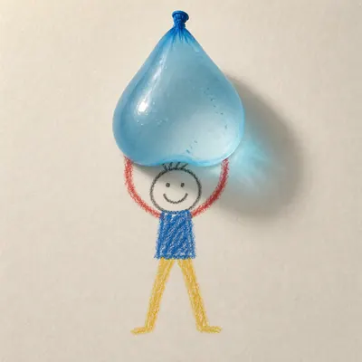</a>

<b>承重水气球</b>

<details><summary>📋 完整提示词</summary>

```
Scene:
A square overhead photograph of the same warm off-white drawing paper and controlled upper-left daylight used in the reference image. The camera remains perpendicular, the background remains minimal, and the paper fibers remain visible enough to prove the object is sitting in the same real environment. The mood is playful but physically precise, with restrained color and no surrounding clutter.

Subject:
Use the same childlike crayon stick figure from the reference, preserving its round head, simple smile, blue torso, red arms, yellow legs, waxy uneven line quality, size, and central lifted pose. Replace the apple with a translucent blue water balloon drooping between the drawn hands. The balloon is a photoreal 3D object with stretched latex, a tied knot, small trapped air bubbles, glossy highlights, and visible water mass pulling it downward.

Important details:
The balloon must demonstrate gravity and material softness while the figure stays flat. Its lower curve should sag over the crayon arms, slightly occluding them, and its shadow should be soft-edged with a faint blue tint on the paper. The crayon hands may appear to touch the balloon, but they must remain simple lines drawn underneath the real object. Keep the original lighting, paper texture, and character identity; do not redraw the figure in a different style.

Use case:
2D and 3D Medium Collision series study 4/8, testing a consistent 2D reference character against a soft transparent 3D object with believable weight.

Constraints:
No readable text, no watermark, no logos, preserve exact 1:1 aspect ratio, no splash, no burst balloon, no extra toys, no realistic child body, no floating object, no change to the reference crayon figure.
```

</details>

</td>
<td width="33%" valign="top" align="center">

<a href="./works/topics/2d-3d-medium-collision/packages/single-medium-collision-studies/images/blueprint-hand-crystal/image.w1600.webp">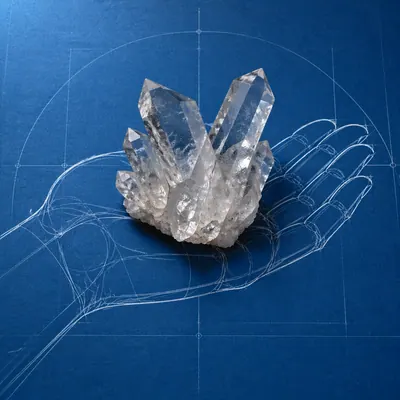</a>

<b>蓝图手托水晶</b>

<details><summary>📋 完整提示词</summary>

```
Scene:
A square overhead photograph of deep cyan blueprint paper on a flat desk, evenly lit with a cooler upper-left light. The page surface is matte, with faint fiber grain and pale construction-line marks, but there must be no readable labels or numbers. The composition should resemble a technical drawing that has been interrupted by a real mineral specimen placed exactly where the drawn hand would hold it.

Subject:
A flat white blueprint-style line drawing of a human hand spans the page, palm up, with clean contour lines, ghosted joint arcs, and simple construction circles. The hand is purely 2D linework, not shaded anatomy. Resting in the drawn palm is a photoreal clear quartz crystal cluster, angular and heavy, with sharp facets, cloudy inclusions, small chips, prismatic highlights, and a hard contact shadow.

Important details:
The crystal must sit above the blueprint hand and hide parts of the white linework under its base. Facets should refract fragments of the palm lines, producing broken white streaks inside the transparent mineral while nearby shadow falls across the cyan paper. Keep the technical drawing flat and diagrammatic, with no readable text, arrows, or measurement labels. The image should make the viewer instantly understand that a drawn schematic hand is physically supporting a real crystalline object.

Use case:
2D and 3D Medium Collision single study 8/8, testing diagrammatic 2D linework against transparent faceted 3D mineral physics.

Constraints:
No readable text, no watermark, no logos, preserve exact 1:1 aspect ratio, no labels, no numbers, no realistic flesh hand, no glowing magic crystal, no jewelry setting, no extra tools, no tilted perspective.
```

</details>

</td>
<td width="33%"></td>
</tr>
</table>

## 抽象表现主义 · Pollock 滴画 / Rothko 色域

> 抽象表现主义 · Pollock 滴画 / Rothko 色域：Pollock 滴溅混沌线条 / Rothko 大色块渐变叠加 / de Kooning 女性碎片 / Kline 黑白书法笔

<table>
<tr>
<td width="33%" valign="top" align="center">

<a href="./works/topics/abstract-expressionism-study/packages/single-abstract-expressionism-studies/images/drip-constellation/image.w1600.webp"></a>

<b>滴画星群</b>

<details><summary>📋 完整提示词</summary>

```
Scene:
A square, gallery-ready composition with painterly surfaces, controlled negative space, and a deliberate fine-art presentation. Build the frame around a dense all-over field of marks that feels suspended between chaos and structure. Keep the lighting, camera distance, and spatial organization tuned for a high-signal research image rather than a casual snapshot. The image belongs to the Abstract Expressionism Study theme and should feel immediately legible as a prompt atlas theme for abstract expressionism study, testing style-transfer with gpt image 2..

Subject:
Center the study on a dense all-over field of marks that feels suspended between chaos and structure. Translate the theme into a concrete visual statement instead of an abstract mood board: the viewer should understand what kind of image this is, what is being tested, and why the composition is difficult. Use the slug idea of abstract expressionism study as a literal guide for subject matter, materials, and staging. If helpful, borrow the broad visual cues suggested by Pollock, Rothko, de Kooning, Kline, but keep the result original and specific to this study.

Important details:
Focus on authored mark-making, hierarchy, rhythm, and a visual idea that reads immediately before the viewer inspects the brushwork. Preserve a disciplined square composition, clear focal hierarchy, and enough secondary information to make the image feel complete rather than underspecified. The image should look polished, novel, and exhibition-ready, with topic-specific credibility coming from the way surfaces, structure, and visual language reinforce Abstract Expressionism Study. Avoid generic filler elements that do not serve the main concept.

Use case:
Abstract Expressionism Study single study 1/8, testing style-transfer through the drip constellation variation.

Constraints:
No readable text, no watermark, no logos, preserve exact 1:1 aspect ratio, no direct copy of a known artwork, no comic speech bubbles, no accidental typography, no low-effort doodle energy, no muddy center, no fake museum label.
```

</details>

</td>
<td width="33%" valign="top" align="center">

<a href="./works/topics/abstract-expressionism-study/packages/single-abstract-expressionism-studies/images/color-field-threshold/image.w1600.webp"></a>

<b>色域门槛</b>

<details><summary>📋 完整提示词</summary>

```
Scene:
A square, gallery-ready composition with painterly surfaces, controlled negative space, and a deliberate fine-art presentation. Build the frame around a few dominant blocks or atmospheres of color with slow transitions and emotional weight. Keep the lighting, camera distance, and spatial organization tuned for a high-signal research image rather than a casual snapshot. The image belongs to the Abstract Expressionism Study theme and should feel immediately legible as a prompt atlas theme for abstract expressionism study, testing style-transfer with gpt image 2..

Subject:
Center the study on a few dominant blocks or atmospheres of color with slow transitions and emotional weight. Translate the theme into a concrete visual statement instead of an abstract mood board: the viewer should understand what kind of image this is, what is being tested, and why the composition is difficult. Use the slug idea of abstract expressionism study as a literal guide for subject matter, materials, and staging. If helpful, borrow the broad visual cues suggested by Pollock, Rothko, de Kooning, Kline, but keep the result original and specific to this study.

Important details:
Focus on authored mark-making, hierarchy, rhythm, and a visual idea that reads immediately before the viewer inspects the brushwork. Preserve a disciplined square composition, clear focal hierarchy, and enough secondary information to make the image feel complete rather than underspecified. The image should look polished, novel, and exhibition-ready, with topic-specific credibility coming from the way surfaces, structure, and visual language reinforce Abstract Expressionism Study. Avoid generic filler elements that do not serve the main concept.

Use case:
Abstract Expressionism Study single study 2/8, testing style-transfer through the color field threshold variation.

Constraints:
No readable text, no watermark, no logos, preserve exact 1:1 aspect ratio, no direct copy of a known artwork, no comic speech bubbles, no accidental typography, no low-effort doodle energy, no muddy center, no fake museum label.
```

</details>

</td>
<td width="33%" valign="top" align="center">

<a href="./works/topics/abstract-expressionism-study/packages/single-abstract-expressionism-studies/images/fractured-figure-surge/image.w1600.webp"></a>

<b>碎形浪潮</b>

<details><summary>📋 完整提示词</summary>

```
Scene:
A square, gallery-ready composition with painterly surfaces, controlled negative space, and a deliberate fine-art presentation. Build the frame around a figure-like presence that emerges and dissolves through broken strokes and unstable edges. Keep the lighting, camera distance, and spatial organization tuned for a high-signal research image rather than a casual snapshot. The image belongs to the Abstract Expressionism Study theme and should feel immediately legible as a prompt atlas theme for abstract expressionism study, testing style-transfer with gpt image 2..

Subject:
Center the study on a figure-like presence that emerges and dissolves through broken strokes and unstable edges. Translate the theme into a concrete visual statement instead of an abstract mood board: the viewer should understand what kind of image this is, what is being tested, and why the composition is difficult. Use the slug idea of abstract expressionism study as a literal guide for subject matter, materials, and staging. If helpful, borrow the broad visual cues suggested by Pollock, Rothko, de Kooning, Kline, but keep the result original and specific to this study.

Important details:
Focus on authored mark-making, hierarchy, rhythm, and a visual idea that reads immediately before the viewer inspects the brushwork. Preserve a disciplined square composition, clear focal hierarchy, and enough secondary information to make the image feel complete rather than underspecified. The image should look polished, novel, and exhibition-ready, with topic-specific credibility coming from the way surfaces, structure, and visual language reinforce Abstract Expressionism Study. Avoid generic filler elements that do not serve the main concept.

Use case:
Abstract Expressionism Study single study 3/8, testing style-transfer through the fractured figure surge variation.

Constraints:
No readable text, no watermark, no logos, preserve exact 1:1 aspect ratio, no direct copy of a known artwork, no comic speech bubbles, no accidental typography, no low-effort doodle energy, no muddy center, no fake museum label.
```

</details>

</td>
</tr>
<tr>
<td width="33%" valign="top" align="center">

<a href="./works/topics/abstract-expressionism-study/packages/single-abstract-expressionism-studies/images/black-brush-choir/image.w1600.webp"></a>

<b>黑笔合奏</b>

<details><summary>📋 完整提示词</summary>

```
Scene:
A square, gallery-ready composition with painterly surfaces, controlled negative space, and a deliberate fine-art presentation. Build the frame around large decisive black gestures that create rhythm, tension, and architectural pressure. Keep the lighting, camera distance, and spatial organization tuned for a high-signal research image rather than a casual snapshot. The image belongs to the Abstract Expressionism Study theme and should feel immediately legible as a prompt atlas theme for abstract expressionism study, testing style-transfer with gpt image 2..

Subject:
Center the study on large decisive black gestures that create rhythm, tension, and architectural pressure. Translate the theme into a concrete visual statement instead of an abstract mood board: the viewer should understand what kind of image this is, what is being tested, and why the composition is difficult. Use the slug idea of abstract expressionism study as a literal guide for subject matter, materials, and staging. If helpful, borrow the broad visual cues suggested by Pollock, Rothko, de Kooning, Kline, but keep the result original and specific to this study.

Important details:
Focus on authored mark-making, hierarchy, rhythm, and a visual idea that reads immediately before the viewer inspects the brushwork. Preserve a disciplined square composition, clear focal hierarchy, and enough secondary information to make the image feel complete rather than underspecified. The image should look polished, novel, and exhibition-ready, with topic-specific credibility coming from the way surfaces, structure, and visual language reinforce Abstract Expressionism Study. Avoid generic filler elements that do not serve the main concept.

Use case:
Abstract Expressionism Study single study 4/8, testing style-transfer through the black brush choir variation.

Constraints:
No readable text, no watermark, no logos, preserve exact 1:1 aspect ratio, no direct copy of a known artwork, no comic speech bubbles, no accidental typography, no low-effort doodle energy, no muddy center, no fake museum label.
```

</details>

</td>
<td width="33%" valign="top" align="center">

<a href="./works/topics/abstract-expressionism-study/packages/single-abstract-expressionism-studies/images/studio-floor-afterimage/image.w1600.webp"></a>

<b>地面残像</b>

<details><summary>📋 完整提示词</summary>

```
Scene:
A square, gallery-ready composition with painterly surfaces, controlled negative space, and a deliberate fine-art presentation. Build the frame around evidence of process, splatter, drag, and layered correction without becoming documentary clutter. Keep the lighting, camera distance, and spatial organization tuned for a high-signal research image rather than a casual snapshot. The image belongs to the Abstract Expressionism Study theme and should feel immediately legible as a prompt atlas theme for abstract expressionism study, testing style-transfer with gpt image 2..

Subject:
Center the study on evidence of process, splatter, drag, and layered correction without becoming documentary clutter. Translate the theme into a concrete visual statement instead of an abstract mood board: the viewer should understand what kind of image this is, what is being tested, and why the composition is difficult. Use the slug idea of abstract expressionism study as a literal guide for subject matter, materials, and staging. If helpful, borrow the broad visual cues suggested by Pollock, Rothko, de Kooning, Kline, but keep the result original and specific to this study.

Important details:
Focus on authored mark-making, hierarchy, rhythm, and a visual idea that reads immediately before the viewer inspects the brushwork. Preserve a disciplined square composition, clear focal hierarchy, and enough secondary information to make the image feel complete rather than underspecified. The image should look polished, novel, and exhibition-ready, with topic-specific credibility coming from the way surfaces, structure, and visual language reinforce Abstract Expressionism Study. Avoid generic filler elements that do not serve the main concept.

Use case:
Abstract Expressionism Study single study 5/8, testing style-transfer through the studio floor afterimage variation.

Constraints:
No readable text, no watermark, no logos, preserve exact 1:1 aspect ratio, no direct copy of a known artwork, no comic speech bubbles, no accidental typography, no low-effort doodle energy, no muddy center, no fake museum label.
```

</details>

</td>
<td width="33%" valign="top" align="center">

<a href="./works/topics/abstract-expressionism-study/packages/single-abstract-expressionism-studies/images/impasto-weather/image.w1600.webp"></a>

<b>厚涂天气</b>

<details><summary>📋 完整提示词</summary>

```
Scene:
A square, gallery-ready composition with painterly surfaces, controlled negative space, and a deliberate fine-art presentation. Build the frame around surface build-up, scrape marks, and thick tactile passages that feel meteorological. Keep the lighting, camera distance, and spatial organization tuned for a high-signal research image rather than a casual snapshot. The image belongs to the Abstract Expressionism Study theme and should feel immediately legible as a prompt atlas theme for abstract expressionism study, testing style-transfer with gpt image 2..

Subject:
Center the study on surface build-up, scrape marks, and thick tactile passages that feel meteorological. Translate the theme into a concrete visual statement instead of an abstract mood board: the viewer should understand what kind of image this is, what is being tested, and why the composition is difficult. Use the slug idea of abstract expressionism study as a literal guide for subject matter, materials, and staging. If helpful, borrow the broad visual cues suggested by Pollock, Rothko, de Kooning, Kline, but keep the result original and specific to this study.

Important details:
Focus on authored mark-making, hierarchy, rhythm, and a visual idea that reads immediately before the viewer inspects the brushwork. Preserve a disciplined square composition, clear focal hierarchy, and enough secondary information to make the image feel complete rather than underspecified. The image should look polished, novel, and exhibition-ready, with topic-specific credibility coming from the way surfaces, structure, and visual language reinforce Abstract Expressionism Study. Avoid generic filler elements that do not serve the main concept.

Use case:
Abstract Expressionism Study single study 6/8, testing style-transfer through the 厚涂天气 variation.

Constraints:
No readable text, no watermark, no logos, preserve exact 1:1 aspect ratio, no direct copy of a known artwork, no comic speech bubbles, no accidental typography, no low-effort doodle energy, no muddy center, no fake museum label.
```

</details>

</td>
</tr>
<tr>
<td width="33%" valign="top" align="center">

<a href="./works/topics/abstract-expressionism-study/packages/single-abstract-expressionism-studies/images/gesture-architecture/image.w1600.webp">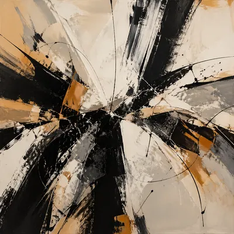</a>

<b>手势结构</b>

<details><summary>📋 完整提示词</summary>

```
Scene:
A square, gallery-ready composition with painterly surfaces, controlled negative space, and a deliberate fine-art presentation. Build the frame around brush movement that locks into a hidden compositional scaffold rather than random motion. Keep the lighting, camera distance, and spatial organization tuned for a high-signal research image rather than a casual snapshot. The image belongs to the Abstract Expressionism Study theme and should feel immediately legible as a prompt atlas theme for abstract expressionism study, testing style-transfer with gpt image 2..

Subject:
Center the study on brush movement that locks into a hidden compositional scaffold rather than random motion. Translate the theme into a concrete visual statement instead of an abstract mood board: the viewer should understand what kind of image this is, what is being tested, and why the composition is difficult. Use the slug idea of abstract expressionism study as a literal guide for subject matter, materials, and staging. If helpful, borrow the broad visual cues suggested by Pollock, Rothko, de Kooning, Kline, but keep the result original and specific to this study.

Important details:
Focus on authored mark-making, hierarchy, rhythm, and a visual idea that reads immediately before the viewer inspects the brushwork. Preserve a disciplined square composition, clear focal hierarchy, and enough secondary information to make the image feel complete rather than underspecified. The image should look polished, novel, and exhibition-ready, with topic-specific credibility coming from the way surfaces, structure, and visual language reinforce Abstract Expressionism Study. Avoid generic filler elements that do not serve the main concept.

Use case:
Abstract Expressionism Study single study 7/8, testing style-transfer through the gesture architecture variation.

Constraints:
No readable text, no watermark, no logos, preserve exact 1:1 aspect ratio, no direct copy of a known artwork, no comic speech bubbles, no accidental typography, no low-effort doodle energy, no muddy center, no fake museum label.
```

</details>

</td>
<td width="33%" valign="top" align="center">

<a href="./works/topics/abstract-expressionism-study/packages/single-abstract-expressionism-studies/images/museum-wall-hang/image.w1600.webp">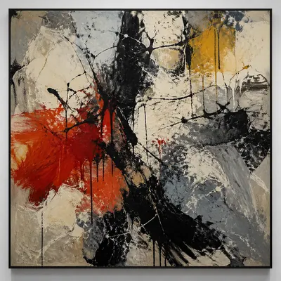</a>

<b>美术馆陈列</b>

<details><summary>📋 完整提示词</summary>

```
Scene:
A square, gallery-ready composition with painterly surfaces, controlled negative space, and a deliberate fine-art presentation. Build the frame around a resolved exhibition-grade work whose internal balance feels complete and intentional. Keep the lighting, camera distance, and spatial organization tuned for a high-signal research image rather than a casual snapshot. The image belongs to the Abstract Expressionism Study theme and should feel immediately legible as a prompt atlas theme for abstract expressionism study, testing style-transfer with gpt image 2..

Subject:
Center the study on a resolved exhibition-grade work whose internal balance feels complete and intentional. Translate the theme into a concrete visual statement instead of an abstract mood board: the viewer should understand what kind of image this is, what is being tested, and why the composition is difficult. Use the slug idea of abstract expressionism study as a literal guide for subject matter, materials, and staging. If helpful, borrow the broad visual cues suggested by Pollock, Rothko, de Kooning, Kline, but keep the result original and specific to this study.

Important details:
Focus on authored mark-making, hierarchy, rhythm, and a visual idea that reads immediately before the viewer inspects the brushwork. Preserve a disciplined square composition, clear focal hierarchy, and enough secondary information to make the image feel complete rather than underspecified. The image should look polished, novel, and exhibition-ready, with topic-specific credibility coming from the way surfaces, structure, and visual language reinforce Abstract Expressionism Study. Avoid generic filler elements that do not serve the main concept.

Use case:
Abstract Expressionism Study single study 8/8, testing style-transfer through the museum wall hang variation.

Constraints:
No readable text, no watermark, no logos, preserve exact 1:1 aspect ratio, no direct copy of a known artwork, no comic speech bubbles, no accidental typography, no low-effort doodle energy, no muddy center, no fake museum label.
```

</details>

</td>
<td width="33%"></td>
</tr>
</table>

## Ambigram 双向字 · 旋转 180° 可读

> 测试双向字形工程: 正读、倒读、镜像和材质应用中,指定文字必须清晰、无多余字符,几何规则可被肉眼验证。

<table>
<tr>
<td width="33%" valign="top" align="center">

<a href="./works/topics/ambigram-readability/packages/single-ambigram-studies/images/gpt-image-gothic-plaque/image.w1600.webp"></a>

<b>GPT Image 哥特牌匾</b>

<details><summary>📋 完整提示词</summary>

```
Scene:
A square museum-grade product photograph of a black enamel plaque lying flat on dark velvet, lit by a narrow warm spotlight that catches raised gold foil. The camera is perfectly straight-on with no perspective skew, so the lettering can be inspected. Add a subtle reflected duplicate of the plaque below it in a polished black surface, rotated 180 degrees, to demonstrate the ambigram test without adding extra captions.

Subject:
The central subject is one ornate Gothic ambigram spelling exactly "GPT-IMAGE-2". Upright, the word must read GPT-IMAGE-2; when the plaque is mentally rotated 180 degrees, the same continuous letterform should still read GPT-IMAGE-2. Use interlocking blackletter strokes, sharp terminals, symmetric counters, and carefully engineered hyphen and numeral shapes. The gold letters are raised, beveled, and physically attached to the enamel surface, not floating graphic text.

Important details:
The letter engineering is the whole challenge. Every character must be intentional, with no extra marks pretending to be letters. Preserve the exact sequence G P T hyphen I M A G E hyphen 2. The rotated reflection should help the viewer verify the rule, but it must not become a second independent word design. Keep generous margins, a centered baseline, and high contrast between gold lettering and black enamel.

Use case:
Ambigram Readability single study 1/8, testing exact same-word 180-degree readability for a high-stakes GPT-IMAGE-2 lettering mark.

Constraints:
No readable text except the specified ambigram "GPT-IMAGE-2", no watermark, no logos, preserve exact 1:1 aspect ratio, no misspelled characters, no extra numerals, no random flourishes that look like letters, no perspective distortion, no flat digital overlay.
```

</details>

</td>
<td width="33%" valign="top" align="center">

<a href="./works/topics/ambigram-readability/packages/single-ambigram-studies/images/atlas-tattoo-stencil/image.w1600.webp"></a>

<b>ATLAS 纹身模板</b>

<details><summary>📋 完整提示词</summary>

```
Scene:
A square close-up of a professional tattoo stencil sheet on warm off-white transfer paper, photographed straight-on on a clean studio table. The image is monochrome black ink with faint blue construction guidelines, tiny registration ticks, and a second ghosted rotated guide behind the main word. Lighting is soft and even so every stroke edge is visible.

Subject:
The subject is a tattoo-ready ambigram spelling exactly "ATLAS". Upright, the letters must read ATLAS in a bold custom script; when rotated 180 degrees, the same ink drawing must still read ATLAS. Build the word from paired strokes: A maps into A, T into L-like crossbars, L into T-like stems, and S remains rotationally balanced. The word should feel like a single continuous tattoo mark, not five separate typefaces.

Important details:
This is a readability and geometry study. The design must show tattoo practicality: clean line weight, stencil gaps that a needle can follow, no hairline clutter, strong negative spaces, and symmetrical flourishes that support reading rather than hide mistakes. The guide marks may show rotation logic but must not become readable text. Keep the central ambigram large, centered, and auditable at thumbnail scale.

Use case:
Ambigram Readability single study 2/8, testing same-word tattoo ambigram readability and practical stencil construction.

Constraints:
No readable text except the specified ambigram "ATLAS", no watermark, no logos, preserve exact 1:1 aspect ratio, no extra letters, no ornamental noise that changes the word, no skin mockup, no color gradients, no misspelled ATLAS, no perspective angle.
```

</details>

</td>
<td width="33%" valign="top" align="center">

<a href="./works/topics/ambigram-readability/packages/single-ambigram-studies/images/rise-fall-poster/image.w1600.webp"></a>

<b>RISE / FALL 海报</b>

<details><summary>📋 完整提示词</summary>

```
Scene:
A square editorial poster proof pinned to a neutral wall, photographed straight-on with clean studio light. The background is matte ivory paper with one large central black ambigram and a faint upside-down shadow version visible through translucent paper, proving the rotation relationship. Keep the composition minimal, with no decorative typography beyond the central engineered word.

Subject:
The central word must read exactly "RISE" when viewed upright and exactly "FALL" when the image is rotated 180 degrees. The four-letter design should use bold serif-script hybrids where each upright letter transforms into its rotated partner: R resolves into L, I resolves into L or vertical structure, S resolves into A-like negative space, and E resolves into F-like bars. The design should feel like one finished poster mark, not two words pasted together.

Important details:
The ambigram must be readable both ways. Use deliberate shared stems, mirrored terminals, balanced counters, and controlled negative space. The viewer should be able to rotate the square and understand the second word without relying on arrows or labels. The ink should have slight screen-print texture and crisp edges. Avoid accidental extra strokes, smeared calligraphy, or over-ornamented flourishes that make either word ambiguous.

Use case:
Ambigram Readability single study 3/8, testing dual-word 180-degree readability with the upright word RISE and rotated word FALL.

Constraints:
No readable text except the specified ambigram words "RISE" and "FALL", no watermark, no logos, preserve exact 1:1 aspect ratio, no arrows, no captions, no extra words, no misspelled letters, no duplicated separate word, no perspective skew, no illegible decorative clutter.
```

</details>

</td>
</tr>
<tr>
<td width="33%" valign="top" align="center">

<a href="./works/topics/ambigram-readability/packages/single-ambigram-studies/images/flow-wave-ring/image.w1600.webp"></a>

<b>FLOW / WAVE 戒面</b>

<details><summary>📋 完整提示词</summary>

```
Scene:
A square luxury macro photograph of a brushed silver signet ring lying on a dark blue velvet tray, viewed from directly above. The ring face is a flat oval disk engraved with one continuous ambigram, and a small mirror below the ring shows the same engraving rotated 180 degrees. Use cool highlights, shallow but controlled depth of field, and enough magnification to inspect the lettering grooves.

Subject:
The engraving must read exactly "FLOW" in the upright view and exactly "WAVE" when rotated 180 degrees. The letterforms should be fluid but engineered: F shares a spine with E, L curls into V-like negative space, O becomes A-like counter structure, and W resolves through rotated stroke grouping. The word is cut into metal as dark recessed grooves with polished raised edges.

Important details:
This image tests whether an ambigram can survive real material constraints. The engraving must follow the ring face surface, catch light in the cuts, and remain physically plausible for jewelry production. Keep the oval face centered, the ambigram large enough to read, and the reflected rotated version aligned below as a verification cue. Do not add separate labels, fake captions, or decorative side text. The design should look like a custom ring order for a typography collector.

Use case:
Ambigram Readability single study 4/8, testing dual-word ambigram engraving where FLOW rotates into WAVE on jewelry metal.

Constraints:
No readable text except the specified ambigram words "FLOW" and "WAVE", no watermark, no logos, preserve exact 1:1 aspect ratio, no brand stamp, no extra initials, no floating text overlay, no illegible scratches replacing letters, no warped ring geometry, no oversized caption.
```

</details>

</td>
<td width="33%" valign="top" align="center">

<a href="./works/topics/ambigram-readability/packages/single-ambigram-studies/images/code-arts-logo/image.w1600.webp"></a>

<b>CODE / ARTS 标志</b>

<details><summary>📋 完整提示词</summary>

```
Scene:
A square brand-design presentation board on matte white paper, photographed straight-on with soft studio shadows. Center the work as a single black vector-like ambigram mark, surrounded only by faint non-semantic construction circles, baseline guides, and mirrored axis lines. The board should feel like a logo proof for typography review, but with no brand system or extra copy.

Subject:
The mark must read exactly "CODE" when upright and exactly "ARTS" when rotated 180 degrees. Use a geometric sans-serif construction with carefully shared strokes: C opens into S-like curvature, O becomes a T-like counter, D turns into R-like massing, and E resolves through rotated horizontal bars. The four-letter to four-letter mapping must be visible as one continuous engineered logo, not two stacked words.

Important details:
The challenge is clean corporate readability under strict geometry. Keep stroke width consistent, corners slightly rounded, counters open, and all letters aligned to a stable baseline. Construction guides can show symmetry and rotation logic, but they must remain pale and unreadable. The ambigram should be black on white, large, centered, and suitable for use as a minimal mark. Avoid calligraphic flourishes, grunge texture, or decorative optical-illusion clutter.

Use case:
Ambigram Readability single study 5/8, testing dual-word logo construction where CODE rotates into ARTS.

Constraints:
No readable text except the specified ambigram words "CODE" and "ARTS", no watermark, no logos, preserve exact 1:1 aspect ratio, no extra brand name, no captions, no color palette labels, no misspelled letters, no separate upright and upside-down words, no perspective distortion.
```

</details>

</td>
<td width="33%" valign="top" align="center">

<a href="./works/topics/ambigram-readability/packages/single-ambigram-studies/images/dream-awake-neon/image.w1600.webp"></a>

<b>DREAM / AWAKE 霓虹</b>

<details><summary>📋 完整提示词</summary>

```
Scene:
A square nighttime storefront-window photograph with a single custom neon ambigram mounted on dark smoked glass. The camera is straight-on from the sidewalk, with subtle rain reflections and no surrounding shop signage. The neon glows warm violet and electric blue, and the glass reflection shows the same wordform inverted and rotated enough to verify the ambigram rule.

Subject:
The neon must read exactly "DREAM" when viewed upright and exactly "AWAKE" when the image is rotated 180 degrees. The five-letter design should use continuous bent glass tubes, with shared loops and stems engineered so each upright letter transforms into its rotated partner. The tubes must look physically buildable: rounded bends, visible electrode caps, small mounting clips, and consistent tube diameter.

Important details:
This is not generic neon lettering. The challenge is making an illuminated dual-word ambigram where both readings are crisp despite glow bloom. Keep the core tube lines sharp inside the glow, maintain enough dark negative space between letters, and avoid accidental extra strokes that create false characters. The reflection can be dimmer, but the main upright word must remain auditable. The mood can be cinematic, yet the typography must stay disciplined.

Use case:
Ambigram Readability single study 6/8, testing luminous dual-word ambigram readability where DREAM rotates into AWAKE.

Constraints:
No readable text except the specified ambigram words "DREAM" and "AWAKE", no watermark, no logos, preserve exact 1:1 aspect ratio, no shop name, no extra neon signs, no unreadable overglow, no broken tube segments, no misspelled words, no separate caption explaining the trick.
```

</details>

</td>
</tr>
<tr>
<td width="33%" valign="top" align="center">

<a href="./works/topics/ambigram-readability/packages/single-ambigram-studies/images/ocean-river-calligraphy/image.w1600.webp">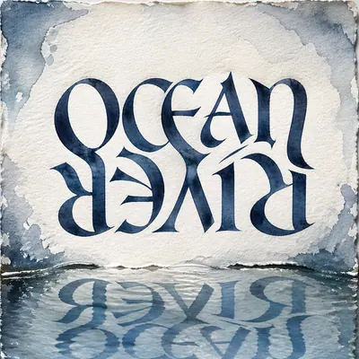</a>

<b>OCEAN / RIVER 书写</b>

<details><summary>📋 完整提示词</summary>

```
Scene:
A square fine-art calligraphy sheet on textured watercolor paper, viewed perfectly top-down. The paper is damp at the edges with pale blue-gray washes, and the central ambigram is painted in deep indigo ink with slight feathering. Include a shallow pool of water near the bottom edge reflecting the ambigram upside down, but do not include any labels or seals.

Subject:
The painted word must read exactly "OCEAN" upright and exactly "RIVER" when rotated 180 degrees. Use custom Roman calligraphy with broad-nib stroke contrast, shared curves, and carefully shaped negative spaces. The five-letter mapping should feel fluid: rounded bowls, tapered terminals, and wave-like connectors help the letters transform while preserving readability. The ambigram sits as one centered wordmark, not a stacked poem.

Important details:
The main test is balancing expressive ink with strict text rendering. Keep each character crisp enough to audit, with no random splashes crossing the letter interiors. The watercolor texture may suggest water, but it must not obscure the word. The reflection should be secondary and physically plausible, helping demonstrate rotation without adding extra independent text. Preserve an elegant gallery presentation and avoid East Asian seal marks, signatures, or decorative readable captions.

Use case:
Ambigram Readability single study 7/8, testing fluid calligraphic dual-word readability where OCEAN rotates into RIVER.

Constraints:
No readable text except the specified ambigram words "OCEAN" and "RIVER", no watermark, no logos, preserve exact 1:1 aspect ratio, no signature, no red seal, no extra poem lines, no illegible splatter, no separate upright and inverted captions, no misspelled letters.
```

</details>

</td>
<td width="33%" valign="top" align="center">

<a href="./works/topics/ambigram-readability/packages/single-ambigram-studies/images/time-mind-coin/image.w1600.webp">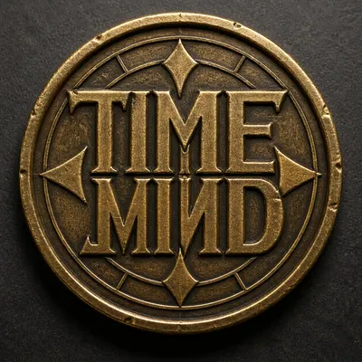</a>

<b>TIME / MIND 铜币</b>

<details><summary>📋 完整提示词</summary>

```
Scene:
A square macro photograph of an antique brass challenge coin on a dark neutral tabletop, lit by low raking light so embossed relief and tiny scratches are visible. The camera is straight-on above the coin. The coin has no outer inscriptions; only the central raised ambigram is readable. A faint rotated shadow below the coin hints at the 180-degree verification.

Subject:
The central relief must read exactly "TIME" when upright and exactly "MIND" when rotated 180 degrees. Use heavy Roman capitals fused into one rotational ambigram, with carved counters, raised bevels, and shared stems. The word should sit inside a simple circular border and compass-like geometric grid, but the border itself must be abstract and contain no letters or numbers.

Important details:
This image tests text rendering under relief, wear, and metal lighting. The letters must be readable through physical form, not printed black ink. Show realistic brass patina, small edge nicks, polished high points, shadowed recesses, and consistent embossing depth. Keep the ambigram large and centered. The coin should look like a serious typographic artifact, not a fantasy medallion full of random symbols. Avoid decorative marks that could be mistaken for extra characters.

Use case:
Ambigram Readability single study 8/8, testing embossed dual-word readability where TIME rotates into MIND on a metal coin.

Constraints:
No readable text except the specified ambigram words "TIME" and "MIND", no watermark, no logos, preserve exact 1:1 aspect ratio, no date, no serial number, no outer motto, no extra glyphs resembling letters, no flat overlay text, no illegible corrosion covering the word.
```

</details>

</td>
<td width="33%"></td>
</tr>
</table>

## 变形透视艺术

> 测试只在特定视角成立的变形透视图案。

<table>
<tr>
<td width="33%" valign="top" align="center">

<a href="./works/topics/anamorphic-perspective-art/packages/single-anamorphic-studies/images/rooftop-atlas-mark/image.w1600.webp"></a>

<b>屋顶 ATLAS 标记</b>

<details><summary>📋 完整提示词</summary>

```
Scene:
A high rooftop terrace photographed from a single marked viewing point at golden hour, looking down across concrete slabs, railings, stair walls, air ducts, and painted floor zones. The camera is exactly at the intended illusion viewpoint.

Subject:
A large anamorphic floor-and-wall painting is stretched across many surfaces so that from this camera angle it resolves into the clean readable word ATLAS inside a simple circular compass mark. Outside the resolved viewpoint, the painted pieces are visibly distorted across different planes.

Important details:
Photorealistic architectural photography, wide-angle lens, accurate perspective convergence, painted matte pigments on concrete, subtle shadows proving the surfaces are real, one small brass viewing marker on the terrace floor, crisp geometry, strong but believable optical illusion.

Use case:
Independent Prompt Atlas image testing optical-illusion geometry, readable text placement, and perspective reasoning in one generated image.

Constraints:
Only readable text should be ATLAS inside the illusion, no real brand logos, no watermark, no extra signage, no drone view, no impossible floating shapes, preserve exact 16:9 aspect ratio.
```

</details>

</td>
<td width="33%" valign="top" align="center">

<a href="./works/topics/anamorphic-perspective-art/packages/single-anamorphic-studies/images/gallery-cylinder-shadow/image.w1600.webp"></a>

<b>画廊圆柱反射</b>

<details><summary>📋 完整提示词</summary>

```
Scene:
A quiet white-cube gallery installation photographed at eye level. A polished chrome cylinder stands on a low white plinth, surrounded by scattered black-and-gold fragments printed on the table surface.

Subject:
The scattered flat fragments look meaningless on the table, but their reflection in the curved cylinder resolves into a complete symmetrical butterfly silhouette. The real table marks should look warped and broken, while the cylinder reflection is clean and recognizable.

Important details:
Photorealistic gallery lighting, softbox reflections on chrome, accurate cylindrical mirror distortion, crisp black ink and gold foil fragments, clean plinth edges, subtle museum floor shadows, geometry that makes the reflection feel physically plausible.

Use case:
Independent Prompt Atlas image testing anamorphic mirror geometry, material reflection, and optical-illusion composition.

Constraints:
No readable text, no watermark, no logos, no human hands, no extra mirrors, no fantasy glow, no broken cylinder, preserve exact 1:1 aspect ratio.
```

</details>

</td>
<td width="33%" valign="top" align="center">

<a href="./works/topics/anamorphic-perspective-art/packages/single-anamorphic-studies/images/station-floor-arrow/image.w1600.webp"></a>

<b>站厅地面箭头</b>

<details><summary>📋 完整提示词</summary>

```
Scene:
A modern underground transit concourse photographed from a low marked viewpoint near the floor. The space has tiled floors, square columns, ceiling strips, and clean architectural lighting.

Subject:
Distorted colored bands run across the floor, columns, and one side wall. From the camera viewpoint, the bands align into one huge floating directional arrow pointing toward the platform entrance. The arrow is made entirely from surface markings, not an actual suspended object.

Important details:
Photorealistic interior architecture, accurate perspective alignment, matte safety-paint texture, cool white station lighting, visible viewing-point dot on the floor, realistic occlusion around columns, strong spatial depth, clean wayfinding color palette of blue, white, and yellow.

Use case:
Independent Prompt Atlas image testing practical anamorphic wayfinding, optical geometry, and structured architectural composition.

Constraints:
No readable text, no real transit logos, no watermark, no crowds, no floating physical arrow, no broken tile alignment, no overlaid UI graphics, preserve exact 16:9 aspect ratio.
```

</details>

</td>
</tr>
</table>

## 古籍复原 · 对照页

> 古籍复原 · 对照页：《永乐大典》残页 + 现代复原 + 注释 + 年代对照

<table>
<tr>
<td width="33%" valign="top" align="center">

<a href="./works/topics/ancient-book-restoration/packages/single-ancient-book-restoration-studies/images/macro-study/image.w1600.webp"></a>

<b>微距研究</b>

<details><summary>📋 完整提示词</summary>

```
Scene:
A square material-focused image where lighting, scale, and surface behavior are the main event. Build the frame around extreme close observation of texture, grain, and edge behavior. Keep the lighting, camera distance, and spatial organization tuned for a high-signal research image rather than a casual snapshot. The image belongs to the Ancient Book Restoration theme and should feel immediately legible as a prompt atlas theme for ancient book restoration, testing world-knowledge, editing-workflow with gpt image 2..

Subject:
Center the study on extreme close observation of texture, grain, and edge behavior. Translate the theme into a concrete visual statement instead of an abstract mood board: the viewer should understand what kind of image this is, what is being tested, and why the composition is difficult. Use the slug idea of ancient book restoration as a literal guide for subject matter, materials, and staging.

Important details:
Microstructure matters: refraction, fibers, scratches, pores, edge wear, translucency, and dust should all feel physically specific. Preserve a disciplined square composition, clear focal hierarchy, and enough secondary information to make the image feel complete rather than underspecified. The image should look polished, novel, and exhibition-ready, with topic-specific credibility coming from the way surfaces, structure, and visual language reinforce Ancient Book Restoration. Avoid generic filler elements that do not serve the main concept.

Use case:
Ancient Book Restoration single study 2/8, testing world-knowledge, editing-workflow through the macro study variation.

Constraints:
No readable text, no watermark, no logos, preserve exact 1:1 aspect ratio, no generic stock macro, no broken scale cues, no plastic-looking texture when it should feel natural, no meaningless blur, no watermark, no fake labels.
```

</details>

</td>
<td width="33%" valign="top" align="center">

<a href="./works/topics/ancient-book-restoration/packages/single-ancient-book-restoration-studies/images/side-light-study/image.w1600.webp"></a>

<b>侧光研究</b>

<details><summary>📋 完整提示词</summary>

```
Scene:
A square material-focused image where lighting, scale, and surface behavior are the main event. Build the frame around raking light used to reveal depth and relief. Keep the lighting, camera distance, and spatial organization tuned for a high-signal research image rather than a casual snapshot. The image belongs to the Ancient Book Restoration theme and should feel immediately legible as a prompt atlas theme for ancient book restoration, testing world-knowledge, editing-workflow with gpt image 2..

Subject:
Center the study on raking light used to reveal depth and relief. Translate the theme into a concrete visual statement instead of an abstract mood board: the viewer should understand what kind of image this is, what is being tested, and why the composition is difficult. Use the slug idea of ancient book restoration as a literal guide for subject matter, materials, and staging.

Important details:
Microstructure matters: refraction, fibers, scratches, pores, edge wear, translucency, and dust should all feel physically specific. Preserve a disciplined square composition, clear focal hierarchy, and enough secondary information to make the image feel complete rather than underspecified. The image should look polished, novel, and exhibition-ready, with topic-specific credibility coming from the way surfaces, structure, and visual language reinforce Ancient Book Restoration. Avoid generic filler elements that do not serve the main concept.

Use case:
Ancient Book Restoration single study 3/8, testing world-knowledge, editing-workflow through the side light study variation.

Constraints:
No readable text, no watermark, no logos, preserve exact 1:1 aspect ratio, no generic stock macro, no broken scale cues, no plastic-looking texture when it should feel natural, no meaningless blur, no watermark, no fake labels.
```

</details>

</td>
<td width="33%" valign="top" align="center">

<a href="./works/topics/ancient-book-restoration/packages/single-ancient-book-restoration-studies/images/process-trace/image.w1600.webp"></a>

<b>工艺痕迹</b>

<details><summary>📋 完整提示词</summary>

```
Scene:
A square material-focused image where lighting, scale, and surface behavior are the main event. Build the frame around evidence of making, wear, or transformation frozen in the surface. Keep the lighting, camera distance, and spatial organization tuned for a high-signal research image rather than a casual snapshot. The image belongs to the Ancient Book Restoration theme and should feel immediately legible as a prompt atlas theme for ancient book restoration, testing world-knowledge, editing-workflow with gpt image 2..

Subject:
Center the study on evidence of making, wear, or transformation frozen in the surface. Translate the theme into a concrete visual statement instead of an abstract mood board: the viewer should understand what kind of image this is, what is being tested, and why the composition is difficult. Use the slug idea of ancient book restoration as a literal guide for subject matter, materials, and staging.

Important details:
Microstructure matters: refraction, fibers, scratches, pores, edge wear, translucency, and dust should all feel physically specific. Preserve a disciplined square composition, clear focal hierarchy, and enough secondary information to make the image feel complete rather than underspecified. The image should look polished, novel, and exhibition-ready, with topic-specific credibility coming from the way surfaces, structure, and visual language reinforce Ancient Book Restoration. Avoid generic filler elements that do not serve the main concept.

Use case:
Ancient Book Restoration single study 4/8, testing world-knowledge, editing-workflow through the process trace variation.

Constraints:
No readable text, no watermark, no logos, preserve exact 1:1 aspect ratio, no generic stock macro, no broken scale cues, no plastic-looking texture when it should feel natural, no meaningless blur, no watermark, no fake labels.
```

</details>

</td>
</tr>
<tr>
<td width="33%" valign="top" align="center">

<a href="./works/topics/ancient-book-restoration/packages/single-ancient-book-restoration-studies/images/specimen-table/image.w1600.webp"></a>

<b>标本桌面</b>

<details><summary>📋 完整提示词</summary>

```
Scene:
A square material-focused image where lighting, scale, and surface behavior are the main event. Build the frame around multiple related samples arranged for comparison. Keep the lighting, camera distance, and spatial organization tuned for a high-signal research image rather than a casual snapshot. The image belongs to the Ancient Book Restoration theme and should feel immediately legible as a prompt atlas theme for ancient book restoration, testing world-knowledge, editing-workflow with gpt image 2..

Subject:
Center the study on multiple related samples arranged for comparison. Translate the theme into a concrete visual statement instead of an abstract mood board: the viewer should understand what kind of image this is, what is being tested, and why the composition is difficult. Use the slug idea of ancient book restoration as a literal guide for subject matter, materials, and staging.

Important details:
Microstructure matters: refraction, fibers, scratches, pores, edge wear, translucency, and dust should all feel physically specific. Preserve a disciplined square composition, clear focal hierarchy, and enough secondary information to make the image feel complete rather than underspecified. The image should look polished, novel, and exhibition-ready, with topic-specific credibility coming from the way surfaces, structure, and visual language reinforce Ancient Book Restoration. Avoid generic filler elements that do not serve the main concept.

Use case:
Ancient Book Restoration single study 5/8, testing world-knowledge, editing-workflow through the specimen table variation.

Constraints:
No readable text, no watermark, no logos, preserve exact 1:1 aspect ratio, no generic stock macro, no broken scale cues, no plastic-looking texture when it should feel natural, no meaningless blur, no watermark, no fake labels.
```

</details>

</td>
<td width="33%" valign="top" align="center">

<a href="./works/topics/ancient-book-restoration/packages/single-ancient-book-restoration-studies/images/atmospheric-view/image.w1600.webp"></a>

<b>氛围场景</b>

<details><summary>📋 完整提示词</summary>

```
Scene:
A square material-focused image where lighting, scale, and surface behavior are the main event. Build the frame around the material placed into a broader environment without losing tactile priority. Keep the lighting, camera distance, and spatial organization tuned for a high-signal research image rather than a casual snapshot. The image belongs to the Ancient Book Restoration theme and should feel immediately legible as a prompt atlas theme for ancient book restoration, testing world-knowledge, editing-workflow with gpt image 2..

Subject:
Center the study on the material placed into a broader environment without losing tactile priority. Translate the theme into a concrete visual statement instead of an abstract mood board: the viewer should understand what kind of image this is, what is being tested, and why the composition is difficult. Use the slug idea of ancient book restoration as a literal guide for subject matter, materials, and staging.

Important details:
Microstructure matters: refraction, fibers, scratches, pores, edge wear, translucency, and dust should all feel physically specific. Preserve a disciplined square composition, clear focal hierarchy, and enough secondary information to make the image feel complete rather than underspecified. The image should look polished, novel, and exhibition-ready, with topic-specific credibility coming from the way surfaces, structure, and visual language reinforce Ancient Book Restoration. Avoid generic filler elements that do not serve the main concept.

Use case:
Ancient Book Restoration single study 6/8, testing world-knowledge, editing-workflow through the 氛围场景 variation.

Constraints:
No readable text, no watermark, no logos, preserve exact 1:1 aspect ratio, no generic stock macro, no broken scale cues, no plastic-looking texture when it should feel natural, no meaningless blur, no watermark, no fake labels.
```

</details>

</td>
<td width="33%" valign="top" align="center">

<a href="./works/topics/ancient-book-restoration/packages/single-ancient-book-restoration-studies/images/signature-material/image.w1600.webp">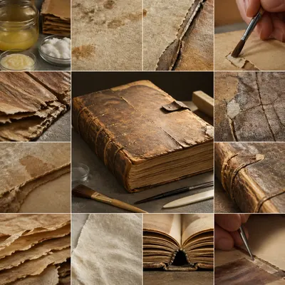</a>

<b>代表材质</b>

<details><summary>📋 完整提示词</summary>

```
Scene:
A square material-focused image where lighting, scale, and surface behavior are the main event. Build the frame around the most complete and persuasive final material image. Keep the lighting, camera distance, and spatial organization tuned for a high-signal research image rather than a casual snapshot. The image belongs to the Ancient Book Restoration theme and should feel immediately legible as a prompt atlas theme for ancient book restoration, testing world-knowledge, editing-workflow with gpt image 2..

Subject:
Center the study on the most complete and persuasive final material image. Translate the theme into a concrete visual statement instead of an abstract mood board: the viewer should understand what kind of image this is, what is being tested, and why the composition is difficult. Use the slug idea of ancient book restoration as a literal guide for subject matter, materials, and staging.

Important details:
Microstructure matters: refraction, fibers, scratches, pores, edge wear, translucency, and dust should all feel physically specific. Preserve a disciplined square composition, clear focal hierarchy, and enough secondary information to make the image feel complete rather than underspecified. The image should look polished, novel, and exhibition-ready, with topic-specific credibility coming from the way surfaces, structure, and visual language reinforce Ancient Book Restoration. Avoid generic filler elements that do not serve the main concept.

Use case:
Ancient Book Restoration single study 8/8, testing world-knowledge, editing-workflow through the signature material variation.

Constraints:
No readable text, no watermark, no logos, preserve exact 1:1 aspect ratio, no generic stock macro, no broken scale cues, no plastic-looking texture when it should feel natural, no meaningless blur, no watermark, no fake labels.
```

</details>

</td>
</tr>
</table>

## 地图 + 信息标注

> 地图 + 信息标注：古代丝绸之路 + 贸易货品 + 年代标注 · 手绘风但地理准

<table>
<tr>
<td width="33%" valign="top" align="center">

<a href="./works/topics/annotated-map-design/packages/single-annotated-map-design-studies/images/overview-plate/image.w1600.webp"></a>

<b>总览板</b>

<details><summary>📋 完整提示词</summary>

```
Scene:
A square plate or board viewed straight-on, with crisp organization, disciplined spacing, and premium print clarity. Build the frame around a complete overview that establishes the system, subject boundaries, and visual hierarchy. Keep the lighting, camera distance, and spatial organization tuned for a high-signal research image rather than a casual snapshot. The image belongs to the Annotated Map Design theme and should feel immediately legible as a prompt atlas theme for annotated map design, testing structured-layout, photorealism, technical-diagram, world-knowledge, reasoning-composition with gpt image 2..

Subject:
Center the study on a complete overview that establishes the system, subject boundaries, and visual hierarchy. Translate the theme into a concrete visual statement instead of an abstract mood board: the viewer should understand what kind of image this is, what is being tested, and why the composition is difficult. Use the slug idea of annotated map design as a literal guide for subject matter, materials, and staging.

Important details:
The image should communicate logic through grouping, hierarchy, callouts, insets, and believable professional layout discipline rather than decorative noise. Preserve a disciplined square composition, clear focal hierarchy, and enough secondary information to make the image feel complete rather than underspecified. The image should look polished, novel, and exhibition-ready, with topic-specific credibility coming from the way surfaces, structure, and visual language reinforce Annotated Map Design. Avoid generic filler elements that do not serve the main concept.

Use case:
Annotated Map Design single study 1/8, testing structured-layout, photorealism, technical-diagram, world-knowledge, reasoning-composition through the overview plate variation.

Constraints:
No readable text, no watermark, no logos, preserve exact 1:1 aspect ratio, no readable labels, no messy arrows, no random infographic decoration, no fake UI chrome unless the topic calls for it, no broken alignment, no meaningless clutter.
```

</details>

</td>
<td width="33%" valign="top" align="center">

<a href="./works/topics/annotated-map-design/packages/single-annotated-map-design-studies/images/cutaway-panel/image.w1600.webp"></a>

<b>剖面板</b>

<details><summary>📋 完整提示词</summary>

```
Scene:
A square plate or board viewed straight-on, with crisp organization, disciplined spacing, and premium print clarity. Build the frame around a cutaway or sectional treatment that reveals interior logic without sacrificing readability. Keep the lighting, camera distance, and spatial organization tuned for a high-signal research image rather than a casual snapshot. The image belongs to the Annotated Map Design theme and should feel immediately legible as a prompt atlas theme for annotated map design, testing structured-layout, photorealism, technical-diagram, world-knowledge, reasoning-composition with gpt image 2..

Subject:
Center the study on a cutaway or sectional treatment that reveals interior logic without sacrificing readability. Translate the theme into a concrete visual statement instead of an abstract mood board: the viewer should understand what kind of image this is, what is being tested, and why the composition is difficult. Use the slug idea of annotated map design as a literal guide for subject matter, materials, and staging.

Important details:
The image should communicate logic through grouping, hierarchy, callouts, insets, and believable professional layout discipline rather than decorative noise. Preserve a disciplined square composition, clear focal hierarchy, and enough secondary information to make the image feel complete rather than underspecified. The image should look polished, novel, and exhibition-ready, with topic-specific credibility coming from the way surfaces, structure, and visual language reinforce Annotated Map Design. Avoid generic filler elements that do not serve the main concept.

Use case:
Annotated Map Design single study 2/8, testing structured-layout, photorealism, technical-diagram, world-knowledge, reasoning-composition through the cutaway panel variation.

Constraints:
No readable text, no watermark, no logos, preserve exact 1:1 aspect ratio, no readable labels, no messy arrows, no random infographic decoration, no fake UI chrome unless the topic calls for it, no broken alignment, no meaningless clutter.
```

</details>

</td>
<td width="33%" valign="top" align="center">

<a href="./works/topics/annotated-map-design/packages/single-annotated-map-design-studies/images/process-sequence/image.w1600.webp"></a>

<b>流程序列</b>

<details><summary>📋 完整提示词</summary>

```
Scene:
A square plate or board viewed straight-on, with crisp organization, disciplined spacing, and premium print clarity. Build the frame around a sequence of stages or states arranged in a disciplined progression. Keep the lighting, camera distance, and spatial organization tuned for a high-signal research image rather than a casual snapshot. The image belongs to the Annotated Map Design theme and should feel immediately legible as a prompt atlas theme for annotated map design, testing structured-layout, photorealism, technical-diagram, world-knowledge, reasoning-composition with gpt image 2..

Subject:
Center the study on a sequence of stages or states arranged in a disciplined progression. Translate the theme into a concrete visual statement instead of an abstract mood board: the viewer should understand what kind of image this is, what is being tested, and why the composition is difficult. Use the slug idea of annotated map design as a literal guide for subject matter, materials, and staging.

Important details:
The image should communicate logic through grouping, hierarchy, callouts, insets, and believable professional layout discipline rather than decorative noise. Preserve a disciplined square composition, clear focal hierarchy, and enough secondary information to make the image feel complete rather than underspecified. The image should look polished, novel, and exhibition-ready, with topic-specific credibility coming from the way surfaces, structure, and visual language reinforce Annotated Map Design. Avoid generic filler elements that do not serve the main concept.

Use case:
Annotated Map Design single study 3/8, testing structured-layout, photorealism, technical-diagram, world-knowledge, reasoning-composition through the process sequence variation.

Constraints:
No readable text, no watermark, no logos, preserve exact 1:1 aspect ratio, no readable labels, no messy arrows, no random infographic decoration, no fake UI chrome unless the topic calls for it, no broken alignment, no meaningless clutter.
```

</details>

</td>
</tr>
<tr>
<td width="33%" valign="top" align="center">

<a href="./works/topics/annotated-map-design/packages/single-annotated-map-design-studies/images/annotation-cluster/image.w1600.webp"></a>

<b>注释簇</b>

<details><summary>📋 完整提示词</summary>

```
Scene:
A square plate or board viewed straight-on, with crisp organization, disciplined spacing, and premium print clarity. Build the frame around dense callouts and side insets that feel scholarly while staying unreadable. Keep the lighting, camera distance, and spatial organization tuned for a high-signal research image rather than a casual snapshot. The image belongs to the Annotated Map Design theme and should feel immediately legible as a prompt atlas theme for annotated map design, testing structured-layout, photorealism, technical-diagram, world-knowledge, reasoning-composition with gpt image 2..

Subject:
Center the study on dense callouts and side insets that feel scholarly while staying unreadable. Translate the theme into a concrete visual statement instead of an abstract mood board: the viewer should understand what kind of image this is, what is being tested, and why the composition is difficult. Use the slug idea of annotated map design as a literal guide for subject matter, materials, and staging.

Important details:
The image should communicate logic through grouping, hierarchy, callouts, insets, and believable professional layout discipline rather than decorative noise. Preserve a disciplined square composition, clear focal hierarchy, and enough secondary information to make the image feel complete rather than underspecified. The image should look polished, novel, and exhibition-ready, with topic-specific credibility coming from the way surfaces, structure, and visual language reinforce Annotated Map Design. Avoid generic filler elements that do not serve the main concept.

Use case:
Annotated Map Design single study 4/8, testing structured-layout, photorealism, technical-diagram, world-knowledge, reasoning-composition through the annotation cluster variation.

Constraints:
No readable text, no watermark, no logos, preserve exact 1:1 aspect ratio, no readable labels, no messy arrows, no random infographic decoration, no fake UI chrome unless the topic calls for it, no broken alignment, no meaningless clutter.
```

</details>

</td>
<td width="33%" valign="top" align="center">

<a href="./works/topics/annotated-map-design/packages/single-annotated-map-design-studies/images/comparison-board/image.w1600.webp"></a>

<b>对照板</b>

<details><summary>📋 完整提示词</summary>

```
Scene:
A square plate or board viewed straight-on, with crisp organization, disciplined spacing, and premium print clarity. Build the frame around a side-by-side comparison structure with strong contrast and equal visual weight. Keep the lighting, camera distance, and spatial organization tuned for a high-signal research image rather than a casual snapshot. The image belongs to the Annotated Map Design theme and should feel immediately legible as a prompt atlas theme for annotated map design, testing structured-layout, photorealism, technical-diagram, world-knowledge, reasoning-composition with gpt image 2..

Subject:
Center the study on a side-by-side comparison structure with strong contrast and equal visual weight. Translate the theme into a concrete visual statement instead of an abstract mood board: the viewer should understand what kind of image this is, what is being tested, and why the composition is difficult. Use the slug idea of annotated map design as a literal guide for subject matter, materials, and staging.

Important details:
The image should communicate logic through grouping, hierarchy, callouts, insets, and believable professional layout discipline rather than decorative noise. Preserve a disciplined square composition, clear focal hierarchy, and enough secondary information to make the image feel complete rather than underspecified. The image should look polished, novel, and exhibition-ready, with topic-specific credibility coming from the way surfaces, structure, and visual language reinforce Annotated Map Design. Avoid generic filler elements that do not serve the main concept.

Use case:
Annotated Map Design single study 5/8, testing structured-layout, photorealism, technical-diagram, world-knowledge, reasoning-composition through the comparison board variation.

Constraints:
No readable text, no watermark, no logos, preserve exact 1:1 aspect ratio, no readable labels, no messy arrows, no random infographic decoration, no fake UI chrome unless the topic calls for it, no broken alignment, no meaningless clutter.
```

</details>

</td>
<td width="33%" valign="top" align="center">

<a href="./works/topics/annotated-map-design/packages/single-annotated-map-design-studies/images/material-callout/image.w1600.webp"></a>

<b>材质标注</b>

<details><summary>📋 完整提示词</summary>

```
Scene:
A square plate or board viewed straight-on, with crisp organization, disciplined spacing, and premium print clarity. Build the frame around specific texture or material evidence presented with controlled explanatory framing. Keep the lighting, camera distance, and spatial organization tuned for a high-signal research image rather than a casual snapshot. The image belongs to the Annotated Map Design theme and should feel immediately legible as a prompt atlas theme for annotated map design, testing structured-layout, photorealism, technical-diagram, world-knowledge, reasoning-composition with gpt image 2..

Subject:
Center the study on specific texture or material evidence presented with controlled explanatory framing. Translate the theme into a concrete visual statement instead of an abstract mood board: the viewer should understand what kind of image this is, what is being tested, and why the composition is difficult. Use the slug idea of annotated map design as a literal guide for subject matter, materials, and staging.

Important details:
The image should communicate logic through grouping, hierarchy, callouts, insets, and believable professional layout discipline rather than decorative noise. Preserve a disciplined square composition, clear focal hierarchy, and enough secondary information to make the image feel complete rather than underspecified. The image should look polished, novel, and exhibition-ready, with topic-specific credibility coming from the way surfaces, structure, and visual language reinforce Annotated Map Design. Avoid generic filler elements that do not serve the main concept.

Use case:
Annotated Map Design single study 6/8, testing structured-layout, photorealism, technical-diagram, world-knowledge, reasoning-composition through the 材质标注 variation.

Constraints:
No readable text, no watermark, no logos, preserve exact 1:1 aspect ratio, no readable labels, no messy arrows, no random infographic decoration, no fake UI chrome unless the topic calls for it, no broken alignment, no meaningless clutter.
```

</details>

</td>
</tr>
<tr>
<td width="33%" valign="top" align="center">

<a href="./works/topics/annotated-map-design/packages/single-annotated-map-design-studies/images/exploded-system/image.w1600.webp">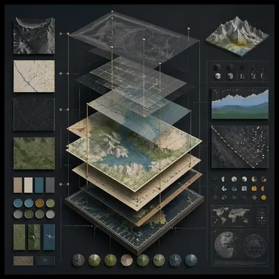</a>

<b>爆炸系统</b>

<details><summary>📋 完整提示词</summary>

```
Scene:
A square plate or board viewed straight-on, with crisp organization, disciplined spacing, and premium print clarity. Build the frame around components separated clearly enough to reveal construction and dependency. Keep the lighting, camera distance, and spatial organization tuned for a high-signal research image rather than a casual snapshot. The image belongs to the Annotated Map Design theme and should feel immediately legible as a prompt atlas theme for annotated map design, testing structured-layout, photorealism, technical-diagram, world-knowledge, reasoning-composition with gpt image 2..

Subject:
Center the study on components separated clearly enough to reveal construction and dependency. Translate the theme into a concrete visual statement instead of an abstract mood board: the viewer should understand what kind of image this is, what is being tested, and why the composition is difficult. Use the slug idea of annotated map design as a literal guide for subject matter, materials, and staging.

Important details:
The image should communicate logic through grouping, hierarchy, callouts, insets, and believable professional layout discipline rather than decorative noise. Preserve a disciplined square composition, clear focal hierarchy, and enough secondary information to make the image feel complete rather than underspecified. The image should look polished, novel, and exhibition-ready, with topic-specific credibility coming from the way surfaces, structure, and visual language reinforce Annotated Map Design. Avoid generic filler elements that do not serve the main concept.

Use case:
Annotated Map Design single study 7/8, testing structured-layout, photorealism, technical-diagram, world-knowledge, reasoning-composition through the exploded system variation.

Constraints:
No readable text, no watermark, no logos, preserve exact 1:1 aspect ratio, no readable labels, no messy arrows, no random infographic decoration, no fake UI chrome unless the topic calls for it, no broken alignment, no meaningless clutter.
```

</details>

</td>
<td width="33%" valign="top" align="center">

<a href="./works/topics/annotated-map-design/packages/single-annotated-map-design-studies/images/final-plate/image.w1600.webp">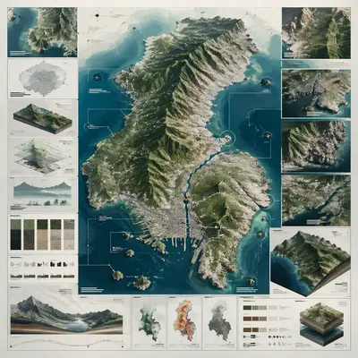</a>

<b>终板</b>

<details><summary>📋 完整提示词</summary>

```
Scene:
A square plate or board viewed straight-on, with crisp organization, disciplined spacing, and premium print clarity. Build the frame around a polished final technical plate that feels ready for a research deck or exhibition wall. Keep the lighting, camera distance, and spatial organization tuned for a high-signal research image rather than a casual snapshot. The image belongs to the Annotated Map Design theme and should feel immediately legible as a prompt atlas theme for annotated map design, testing structured-layout, photorealism, technical-diagram, world-knowledge, reasoning-composition with gpt image 2..

Subject:
Center the study on a polished final technical plate that feels ready for a research deck or exhibition wall. Translate the theme into a concrete visual statement instead of an abstract mood board: the viewer should understand what kind of image this is, what is being tested, and why the composition is difficult. Use the slug idea of annotated map design as a literal guide for subject matter, materials, and staging.

Important details:
The image should communicate logic through grouping, hierarchy, callouts, insets, and believable professional layout discipline rather than decorative noise. Preserve a disciplined square composition, clear focal hierarchy, and enough secondary information to make the image feel complete rather than underspecified. The image should look polished, novel, and exhibition-ready, with topic-specific credibility coming from the way surfaces, structure, and visual language reinforce Annotated Map Design. Avoid generic filler elements that do not serve the main concept.

Use case:
Annotated Map Design single study 8/8, testing structured-layout, photorealism, technical-diagram, world-knowledge, reasoning-composition through the final plate variation.

Constraints:
No readable text, no watermark, no logos, preserve exact 1:1 aspect ratio, no readable labels, no messy arrows, no random infographic decoration, no fake UI chrome unless the topic calls for it, no broken alignment, no meaningless clutter.
```

</details>

</td>
<td width="33%"></td>
</tr>
</table>

## 建筑制图 · 平/立/剖 同屏

> 建筑制图 · 平/立/剖 同屏：一栋楼 · 平面图 + 正立面 + 侧剖面 + 总轴测 同屏 · 建筑师级

<table>
<tr>
<td width="33%" valign="top" align="center">

<a href="./works/topics/architectural-drawing-board/packages/single-architectural-drawing-board-studies/images/overview-plate/image.w1600.webp"></a>

<b>总览板</b>

<details><summary>📋 完整提示词</summary>

```
Scene:
A square plate or board viewed straight-on, with crisp organization, disciplined spacing, and premium print clarity. Build the frame around a complete overview that establishes the system, subject boundaries, and visual hierarchy. Keep the lighting, camera distance, and spatial organization tuned for a high-signal research image rather than a casual snapshot. The image belongs to the Architectural Drawing Board theme and should feel immediately legible as a prompt atlas theme for architectural drawing board, testing photorealism, physics-materials, technical-diagram, world-knowledge with gpt image 2..

Subject:
Center the study on a complete overview that establishes the system, subject boundaries, and visual hierarchy. Translate the theme into a concrete visual statement instead of an abstract mood board: the viewer should understand what kind of image this is, what is being tested, and why the composition is difficult. Use the slug idea of architectural drawing board as a literal guide for subject matter, materials, and staging.

Important details:
The image should communicate logic through grouping, hierarchy, callouts, insets, and believable professional layout discipline rather than decorative noise. Preserve a disciplined square composition, clear focal hierarchy, and enough secondary information to make the image feel complete rather than underspecified. The image should look polished, novel, and exhibition-ready, with topic-specific credibility coming from the way surfaces, structure, and visual language reinforce Architectural Drawing Board. Avoid generic filler elements that do not serve the main concept.

Use case:
Architectural Drawing Board single study 1/8, testing photorealism, physics-materials, technical-diagram, world-knowledge through the overview plate variation.

Constraints:
No readable text, no watermark, no logos, preserve exact 1:1 aspect ratio, no readable labels, no messy arrows, no random infographic decoration, no fake UI chrome unless the topic calls for it, no broken alignment, no meaningless clutter.
```

</details>

</td>
<td width="33%" valign="top" align="center">

<a href="./works/topics/architectural-drawing-board/packages/single-architectural-drawing-board-studies/images/cutaway-panel/image.w1600.webp"></a>

<b>剖面板</b>

<details><summary>📋 完整提示词</summary>

```
Scene:
A square plate or board viewed straight-on, with crisp organization, disciplined spacing, and premium print clarity. Build the frame around a cutaway or sectional treatment that reveals interior logic without sacrificing readability. Keep the lighting, camera distance, and spatial organization tuned for a high-signal research image rather than a casual snapshot. The image belongs to the Architectural Drawing Board theme and should feel immediately legible as a prompt atlas theme for architectural drawing board, testing photorealism, physics-materials, technical-diagram, world-knowledge with gpt image 2..

Subject:
Center the study on a cutaway or sectional treatment that reveals interior logic without sacrificing readability. Translate the theme into a concrete visual statement instead of an abstract mood board: the viewer should understand what kind of image this is, what is being tested, and why the composition is difficult. Use the slug idea of architectural drawing board as a literal guide for subject matter, materials, and staging.

Important details:
The image should communicate logic through grouping, hierarchy, callouts, insets, and believable professional layout discipline rather than decorative noise. Preserve a disciplined square composition, clear focal hierarchy, and enough secondary information to make the image feel complete rather than underspecified. The image should look polished, novel, and exhibition-ready, with topic-specific credibility coming from the way surfaces, structure, and visual language reinforce Architectural Drawing Board. Avoid generic filler elements that do not serve the main concept.

Use case:
Architectural Drawing Board single study 2/8, testing photorealism, physics-materials, technical-diagram, world-knowledge through the cutaway panel variation.

Constraints:
No readable text, no watermark, no logos, preserve exact 1:1 aspect ratio, no readable labels, no messy arrows, no random infographic decoration, no fake UI chrome unless the topic calls for it, no broken alignment, no meaningless clutter.
```

</details>

</td>
<td width="33%" valign="top" align="center">

<a href="./works/topics/architectural-drawing-board/packages/single-architectural-drawing-board-studies/images/process-sequence/image.w1600.webp"></a>

<b>流程序列</b>

<details><summary>📋 完整提示词</summary>

```
Scene:
A square plate or board viewed straight-on, with crisp organization, disciplined spacing, and premium print clarity. Build the frame around a sequence of stages or states arranged in a disciplined progression. Keep the lighting, camera distance, and spatial organization tuned for a high-signal research image rather than a casual snapshot. The image belongs to the Architectural Drawing Board theme and should feel immediately legible as a prompt atlas theme for architectural drawing board, testing photorealism, physics-materials, technical-diagram, world-knowledge with gpt image 2..

Subject:
Center the study on a sequence of stages or states arranged in a disciplined progression. Translate the theme into a concrete visual statement instead of an abstract mood board: the viewer should understand what kind of image this is, what is being tested, and why the composition is difficult. Use the slug idea of architectural drawing board as a literal guide for subject matter, materials, and staging.

Important details:
The image should communicate logic through grouping, hierarchy, callouts, insets, and believable professional layout discipline rather than decorative noise. Preserve a disciplined square composition, clear focal hierarchy, and enough secondary information to make the image feel complete rather than underspecified. The image should look polished, novel, and exhibition-ready, with topic-specific credibility coming from the way surfaces, structure, and visual language reinforce Architectural Drawing Board. Avoid generic filler elements that do not serve the main concept.

Use case:
Architectural Drawing Board single study 3/8, testing photorealism, physics-materials, technical-diagram, world-knowledge through the process sequence variation.

Constraints:
No readable text, no watermark, no logos, preserve exact 1:1 aspect ratio, no readable labels, no messy arrows, no random infographic decoration, no fake UI chrome unless the topic calls for it, no broken alignment, no meaningless clutter.
```

</details>

</td>
</tr>
<tr>
<td width="33%" valign="top" align="center">

<a href="./works/topics/architectural-drawing-board/packages/single-architectural-drawing-board-studies/images/annotation-cluster/image.w1600.webp"></a>

<b>注释簇</b>

<details><summary>📋 完整提示词</summary>

```
Scene:
A square plate or board viewed straight-on, with crisp organization, disciplined spacing, and premium print clarity. Build the frame around dense callouts and side insets that feel scholarly while staying unreadable. Keep the lighting, camera distance, and spatial organization tuned for a high-signal research image rather than a casual snapshot. The image belongs to the Architectural Drawing Board theme and should feel immediately legible as a prompt atlas theme for architectural drawing board, testing photorealism, physics-materials, technical-diagram, world-knowledge with gpt image 2..

Subject:
Center the study on dense callouts and side insets that feel scholarly while staying unreadable. Translate the theme into a concrete visual statement instead of an abstract mood board: the viewer should understand what kind of image this is, what is being tested, and why the composition is difficult. Use the slug idea of architectural drawing board as a literal guide for subject matter, materials, and staging.

Important details:
The image should communicate logic through grouping, hierarchy, callouts, insets, and believable professional layout discipline rather than decorative noise. Preserve a disciplined square composition, clear focal hierarchy, and enough secondary information to make the image feel complete rather than underspecified. The image should look polished, novel, and exhibition-ready, with topic-specific credibility coming from the way surfaces, structure, and visual language reinforce Architectural Drawing Board. Avoid generic filler elements that do not serve the main concept.

Use case:
Architectural Drawing Board single study 4/8, testing photorealism, physics-materials, technical-diagram, world-knowledge through the annotation cluster variation.

Constraints:
No readable text, no watermark, no logos, preserve exact 1:1 aspect ratio, no readable labels, no messy arrows, no random infographic decoration, no fake UI chrome unless the topic calls for it, no broken alignment, no meaningless clutter.
```

</details>

</td>
<td width="33%" valign="top" align="center">

<a href="./works/topics/architectural-drawing-board/packages/single-architectural-drawing-board-studies/images/comparison-board/image.w1600.webp"></a>

<b>对照板</b>

<details><summary>📋 完整提示词</summary>

```
Scene:
A square plate or board viewed straight-on, with crisp organization, disciplined spacing, and premium print clarity. Build the frame around a side-by-side comparison structure with strong contrast and equal visual weight. Keep the lighting, camera distance, and spatial organization tuned for a high-signal research image rather than a casual snapshot. The image belongs to the Architectural Drawing Board theme and should feel immediately legible as a prompt atlas theme for architectural drawing board, testing photorealism, physics-materials, technical-diagram, world-knowledge with gpt image 2..

Subject:
Center the study on a side-by-side comparison structure with strong contrast and equal visual weight. Translate the theme into a concrete visual statement instead of an abstract mood board: the viewer should understand what kind of image this is, what is being tested, and why the composition is difficult. Use the slug idea of architectural drawing board as a literal guide for subject matter, materials, and staging.

Important details:
The image should communicate logic through grouping, hierarchy, callouts, insets, and believable professional layout discipline rather than decorative noise. Preserve a disciplined square composition, clear focal hierarchy, and enough secondary information to make the image feel complete rather than underspecified. The image should look polished, novel, and exhibition-ready, with topic-specific credibility coming from the way surfaces, structure, and visual language reinforce Architectural Drawing Board. Avoid generic filler elements that do not serve the main concept.

Use case:
Architectural Drawing Board single study 5/8, testing photorealism, physics-materials, technical-diagram, world-knowledge through the comparison board variation.

Constraints:
No readable text, no watermark, no logos, preserve exact 1:1 aspect ratio, no readable labels, no messy arrows, no random infographic decoration, no fake UI chrome unless the topic calls for it, no broken alignment, no meaningless clutter.
```

</details>

</td>
<td width="33%" valign="top" align="center">

<a href="./works/topics/architectural-drawing-board/packages/single-architectural-drawing-board-studies/images/exploded-system/image.w1600.webp">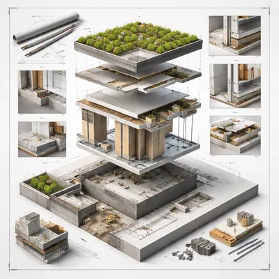</a>

<b>爆炸系统</b>

<details><summary>📋 完整提示词</summary>

```
Scene:
A square plate or board viewed straight-on, with crisp organization, disciplined spacing, and premium print clarity. Build the frame around components separated clearly enough to reveal construction and dependency. Keep the lighting, camera distance, and spatial organization tuned for a high-signal research image rather than a casual snapshot. The image belongs to the Architectural Drawing Board theme and should feel immediately legible as a prompt atlas theme for architectural drawing board, testing photorealism, physics-materials, technical-diagram, world-knowledge with gpt image 2..

Subject:
Center the study on components separated clearly enough to reveal construction and dependency. Translate the theme into a concrete visual statement instead of an abstract mood board: the viewer should understand what kind of image this is, what is being tested, and why the composition is difficult. Use the slug idea of architectural drawing board as a literal guide for subject matter, materials, and staging.

Important details:
The image should communicate logic through grouping, hierarchy, callouts, insets, and believable professional layout discipline rather than decorative noise. Preserve a disciplined square composition, clear focal hierarchy, and enough secondary information to make the image feel complete rather than underspecified. The image should look polished, novel, and exhibition-ready, with topic-specific credibility coming from the way surfaces, structure, and visual language reinforce Architectural Drawing Board. Avoid generic filler elements that do not serve the main concept.

Use case:
Architectural Drawing Board single study 7/8, testing photorealism, physics-materials, technical-diagram, world-knowledge through the exploded system variation.

Constraints:
No readable text, no watermark, no logos, preserve exact 1:1 aspect ratio, no readable labels, no messy arrows, no random infographic decoration, no fake UI chrome unless the topic calls for it, no broken alignment, no meaningless clutter.
```

</details>

</td>
</tr>
<tr>
<td width="33%" valign="top" align="center">

<a href="./works/topics/architectural-drawing-board/packages/single-architectural-drawing-board-studies/images/final-plate/image.w1600.webp">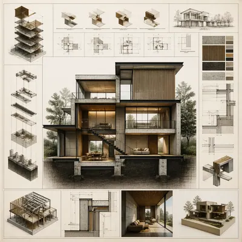</a>

<b>终板</b>

<details><summary>📋 完整提示词</summary>

```
Scene:
A square plate or board viewed straight-on, with crisp organization, disciplined spacing, and premium print clarity. Build the frame around a polished final technical plate that feels ready for a research deck or exhibition wall. Keep the lighting, camera distance, and spatial organization tuned for a high-signal research image rather than a casual snapshot. The image belongs to the Architectural Drawing Board theme and should feel immediately legible as a prompt atlas theme for architectural drawing board, testing photorealism, physics-materials, technical-diagram, world-knowledge with gpt image 2..

Subject:
Center the study on a polished final technical plate that feels ready for a research deck or exhibition wall. Translate the theme into a concrete visual statement instead of an abstract mood board: the viewer should understand what kind of image this is, what is being tested, and why the composition is difficult. Use the slug idea of architectural drawing board as a literal guide for subject matter, materials, and staging.

Important details:
The image should communicate logic through grouping, hierarchy, callouts, insets, and believable professional layout discipline rather than decorative noise. Preserve a disciplined square composition, clear focal hierarchy, and enough secondary information to make the image feel complete rather than underspecified. The image should look polished, novel, and exhibition-ready, with topic-specific credibility coming from the way surfaces, structure, and visual language reinforce Architectural Drawing Board. Avoid generic filler elements that do not serve the main concept.

Use case:
Architectural Drawing Board single study 8/8, testing photorealism, physics-materials, technical-diagram, world-knowledge through the final plate variation.

Constraints:
No readable text, no watermark, no logos, preserve exact 1:1 aspect ratio, no readable labels, no messy arrows, no random infographic decoration, no fake UI chrome unless the topic calls for it, no broken alignment, no meaningless clutter.
```

</details>

</td>
<td width="33%"></td>
<td width="33%"></td>
</tr>
</table>

## 档案美学 · Wanted / 指纹卡 / 档案页

> 档案美学 · Wanted / 指纹卡 / 档案页：Old West Wanted 通缉令 + 悬赏 + 罪状 / FBI 档案页 + 指纹 + 侧面照 / 学生档案卡 + 照片 + 成绩

<table>
<tr>
<td width="33%" valign="top" align="center">

<a href="./works/topics/archive-aesthetic-file/packages/single-archive-aesthetic-file-studies/images/hero-spread/image.w1600.webp"></a>

<b>主展开</b>

<details><summary>📋 完整提示词</summary>

```
Scene:
A square editorial or interface layout study with exact margins, confident grid structure, and premium print or screen presentation. Build the frame around a primary spread or headline surface with immediate hierarchy. Keep the lighting, camera distance, and spatial organization tuned for a high-signal research image rather than a casual snapshot. The image belongs to the Archive Aesthetic File theme and should feel immediately legible as a prompt atlas theme for archive aesthetic file, testing text-rendering, structured-layout with gpt image 2..

Subject:
Center the study on a primary spread or headline surface with immediate hierarchy. Translate the theme into a concrete visual statement instead of an abstract mood board: the viewer should understand what kind of image this is, what is being tested, and why the composition is difficult. Use the slug idea of archive aesthetic file as a literal guide for subject matter, materials, and staging. If helpful, borrow the broad visual cues suggested by Old West Wanted, FBI, but keep the result original and specific to this study.

Important details:
Typography fields must stay unreadable, but hierarchy, rhythm, and page architecture should feel convincing enough for design review. Preserve a disciplined square composition, clear focal hierarchy, and enough secondary information to make the image feel complete rather than underspecified. The image should look polished, novel, and exhibition-ready, with topic-specific credibility coming from the way surfaces, structure, and visual language reinforce Archive Aesthetic File. Avoid generic filler elements that do not serve the main concept.

Use case:
Archive Aesthetic File single study 1/8, testing text-rendering, structured-layout through the hero spread variation.

Constraints:
No readable text, no watermark, no logos, preserve exact 1:1 aspect ratio, no readable text, no logo lockups from real brands, no broken grid, no arbitrary poster clutter, no malformed columns, no accidental lorem ipsum.
```

</details>

</td>
<td width="33%" valign="top" align="center">

<a href="./works/topics/archive-aesthetic-file/packages/single-archive-aesthetic-file-studies/images/variant-grid/image.w1600.webp"></a>

<b>变体网格</b>

<details><summary>📋 完整提示词</summary>

```
Scene:
A square editorial or interface layout study with exact margins, confident grid structure, and premium print or screen presentation. Build the frame around multiple aligned variations sharing one disciplined layout system. Keep the lighting, camera distance, and spatial organization tuned for a high-signal research image rather than a casual snapshot. The image belongs to the Archive Aesthetic File theme and should feel immediately legible as a prompt atlas theme for archive aesthetic file, testing text-rendering, structured-layout with gpt image 2..

Subject:
Center the study on multiple aligned variations sharing one disciplined layout system. Translate the theme into a concrete visual statement instead of an abstract mood board: the viewer should understand what kind of image this is, what is being tested, and why the composition is difficult. Use the slug idea of archive aesthetic file as a literal guide for subject matter, materials, and staging. If helpful, borrow the broad visual cues suggested by Old West Wanted, FBI, but keep the result original and specific to this study.

Important details:
Typography fields must stay unreadable, but hierarchy, rhythm, and page architecture should feel convincing enough for design review. Preserve a disciplined square composition, clear focal hierarchy, and enough secondary information to make the image feel complete rather than underspecified. The image should look polished, novel, and exhibition-ready, with topic-specific credibility coming from the way surfaces, structure, and visual language reinforce Archive Aesthetic File. Avoid generic filler elements that do not serve the main concept.

Use case:
Archive Aesthetic File single study 2/8, testing text-rendering, structured-layout through the variant grid variation.

Constraints:
No readable text, no watermark, no logos, preserve exact 1:1 aspect ratio, no readable text, no logo lockups from real brands, no broken grid, no arbitrary poster clutter, no malformed columns, no accidental lorem ipsum.
```

</details>

</td>
<td width="33%" valign="top" align="center">

<a href="./works/topics/archive-aesthetic-file/packages/single-archive-aesthetic-file-studies/images/desk-review/image.w1600.webp"></a>

<b>审稿桌面</b>

<details><summary>📋 完整提示词</summary>

```
Scene:
A square editorial or interface layout study with exact margins, confident grid structure, and premium print or screen presentation. Build the frame around a presentation context that shows the layout as a reviewed design object. Keep the lighting, camera distance, and spatial organization tuned for a high-signal research image rather than a casual snapshot. The image belongs to the Archive Aesthetic File theme and should feel immediately legible as a prompt atlas theme for archive aesthetic file, testing text-rendering, structured-layout with gpt image 2..

Subject:
Center the study on a presentation context that shows the layout as a reviewed design object. Translate the theme into a concrete visual statement instead of an abstract mood board: the viewer should understand what kind of image this is, what is being tested, and why the composition is difficult. Use the slug idea of archive aesthetic file as a literal guide for subject matter, materials, and staging. If helpful, borrow the broad visual cues suggested by Old West Wanted, FBI, but keep the result original and specific to this study.

Important details:
Typography fields must stay unreadable, but hierarchy, rhythm, and page architecture should feel convincing enough for design review. Preserve a disciplined square composition, clear focal hierarchy, and enough secondary information to make the image feel complete rather than underspecified. The image should look polished, novel, and exhibition-ready, with topic-specific credibility coming from the way surfaces, structure, and visual language reinforce Archive Aesthetic File. Avoid generic filler elements that do not serve the main concept.

Use case:
Archive Aesthetic File single study 3/8, testing text-rendering, structured-layout through the desk review variation.

Constraints:
No readable text, no watermark, no logos, preserve exact 1:1 aspect ratio, no readable text, no logo lockups from real brands, no broken grid, no arbitrary poster clutter, no malformed columns, no accidental lorem ipsum.
```

</details>

</td>
</tr>
<tr>
<td width="33%" valign="top" align="center">

<a href="./works/topics/archive-aesthetic-file/packages/single-archive-aesthetic-file-studies/images/material-closeup/image.w1600.webp"></a>

<b>材质特写</b>

<details><summary>📋 完整提示词</summary>

```
Scene:
A square editorial or interface layout study with exact margins, confident grid structure, and premium print or screen presentation. Build the frame around print grain, paper, or screen detail without losing overall composition. Keep the lighting, camera distance, and spatial organization tuned for a high-signal research image rather than a casual snapshot. The image belongs to the Archive Aesthetic File theme and should feel immediately legible as a prompt atlas theme for archive aesthetic file, testing text-rendering, structured-layout with gpt image 2..

Subject:
Center the study on print grain, paper, or screen detail without losing overall composition. Translate the theme into a concrete visual statement instead of an abstract mood board: the viewer should understand what kind of image this is, what is being tested, and why the composition is difficult. Use the slug idea of archive aesthetic file as a literal guide for subject matter, materials, and staging. If helpful, borrow the broad visual cues suggested by Old West Wanted, FBI, but keep the result original and specific to this study.

Important details:
Typography fields must stay unreadable, but hierarchy, rhythm, and page architecture should feel convincing enough for design review. Preserve a disciplined square composition, clear focal hierarchy, and enough secondary information to make the image feel complete rather than underspecified. The image should look polished, novel, and exhibition-ready, with topic-specific credibility coming from the way surfaces, structure, and visual language reinforce Archive Aesthetic File. Avoid generic filler elements that do not serve the main concept.

Use case:
Archive Aesthetic File single study 4/8, testing text-rendering, structured-layout through the material closeup variation.

Constraints:
No readable text, no watermark, no logos, preserve exact 1:1 aspect ratio, no readable text, no logo lockups from real brands, no broken grid, no arbitrary poster clutter, no malformed columns, no accidental lorem ipsum.
```

</details>

</td>
<td width="33%" valign="top" align="center">

<a href="./works/topics/archive-aesthetic-file/packages/single-archive-aesthetic-file-studies/images/archive-sheet/image.w1600.webp"></a>

<b>档案页</b>

<details><summary>📋 完整提示词</summary>

```
Scene:
A square editorial or interface layout study with exact margins, confident grid structure, and premium print or screen presentation. Build the frame around a flat archival or proof-like sheet with modular content blocks. Keep the lighting, camera distance, and spatial organization tuned for a high-signal research image rather than a casual snapshot. The image belongs to the Archive Aesthetic File theme and should feel immediately legible as a prompt atlas theme for archive aesthetic file, testing text-rendering, structured-layout with gpt image 2..

Subject:
Center the study on a flat archival or proof-like sheet with modular content blocks. Translate the theme into a concrete visual statement instead of an abstract mood board: the viewer should understand what kind of image this is, what is being tested, and why the composition is difficult. Use the slug idea of archive aesthetic file as a literal guide for subject matter, materials, and staging. If helpful, borrow the broad visual cues suggested by Old West Wanted, FBI, but keep the result original and specific to this study.

Important details:
Typography fields must stay unreadable, but hierarchy, rhythm, and page architecture should feel convincing enough for design review. Preserve a disciplined square composition, clear focal hierarchy, and enough secondary information to make the image feel complete rather than underspecified. The image should look polished, novel, and exhibition-ready, with topic-specific credibility coming from the way surfaces, structure, and visual language reinforce Archive Aesthetic File. Avoid generic filler elements that do not serve the main concept.

Use case:
Archive Aesthetic File single study 5/8, testing text-rendering, structured-layout through the archive sheet variation.

Constraints:
No readable text, no watermark, no logos, preserve exact 1:1 aspect ratio, no readable text, no logo lockups from real brands, no broken grid, no arbitrary poster clutter, no malformed columns, no accidental lorem ipsum.
```

</details>

</td>
<td width="33%" valign="top" align="center">

<a href="./works/topics/archive-aesthetic-file/packages/single-archive-aesthetic-file-studies/images/retail-presentation/image.w1600.webp"></a>

<b>陈列展示</b>

<details><summary>📋 完整提示词</summary>

```
Scene:
A square editorial or interface layout study with exact margins, confident grid structure, and premium print or screen presentation. Build the frame around a polished display context that still preserves layout logic. Keep the lighting, camera distance, and spatial organization tuned for a high-signal research image rather than a casual snapshot. The image belongs to the Archive Aesthetic File theme and should feel immediately legible as a prompt atlas theme for archive aesthetic file, testing text-rendering, structured-layout with gpt image 2..

Subject:
Center the study on a polished display context that still preserves layout logic. Translate the theme into a concrete visual statement instead of an abstract mood board: the viewer should understand what kind of image this is, what is being tested, and why the composition is difficult. Use the slug idea of archive aesthetic file as a literal guide for subject matter, materials, and staging. If helpful, borrow the broad visual cues suggested by Old West Wanted, FBI, but keep the result original and specific to this study.

Important details:
Typography fields must stay unreadable, but hierarchy, rhythm, and page architecture should feel convincing enough for design review. Preserve a disciplined square composition, clear focal hierarchy, and enough secondary information to make the image feel complete rather than underspecified. The image should look polished, novel, and exhibition-ready, with topic-specific credibility coming from the way surfaces, structure, and visual language reinforce Archive Aesthetic File. Avoid generic filler elements that do not serve the main concept.

Use case:
Archive Aesthetic File single study 6/8, testing text-rendering, structured-layout through the 陈列展示 variation.

Constraints:
No readable text, no watermark, no logos, preserve exact 1:1 aspect ratio, no readable text, no logo lockups from real brands, no broken grid, no arbitrary poster clutter, no malformed columns, no accidental lorem ipsum.
```

</details>

</td>
</tr>
<tr>
<td width="33%" valign="top" align="center">

<a href="./works/topics/archive-aesthetic-file/packages/single-archive-aesthetic-file-studies/images/system-board/image.w1600.webp">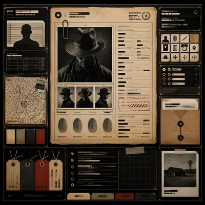</a>

<b>系统板</b>

<details><summary>📋 完整提示词</summary>

```
Scene:
A square editorial or interface layout study with exact margins, confident grid structure, and premium print or screen presentation. Build the frame around a family of elements organized into a coherent visual language. Keep the lighting, camera distance, and spatial organization tuned for a high-signal research image rather than a casual snapshot. The image belongs to the Archive Aesthetic File theme and should feel immediately legible as a prompt atlas theme for archive aesthetic file, testing text-rendering, structured-layout with gpt image 2..

Subject:
Center the study on a family of elements organized into a coherent visual language. Translate the theme into a concrete visual statement instead of an abstract mood board: the viewer should understand what kind of image this is, what is being tested, and why the composition is difficult. Use the slug idea of archive aesthetic file as a literal guide for subject matter, materials, and staging. If helpful, borrow the broad visual cues suggested by Old West Wanted, FBI, but keep the result original and specific to this study.

Important details:
Typography fields must stay unreadable, but hierarchy, rhythm, and page architecture should feel convincing enough for design review. Preserve a disciplined square composition, clear focal hierarchy, and enough secondary information to make the image feel complete rather than underspecified. The image should look polished, novel, and exhibition-ready, with topic-specific credibility coming from the way surfaces, structure, and visual language reinforce Archive Aesthetic File. Avoid generic filler elements that do not serve the main concept.

Use case:
Archive Aesthetic File single study 7/8, testing text-rendering, structured-layout through the system board variation.

Constraints:
No readable text, no watermark, no logos, preserve exact 1:1 aspect ratio, no readable text, no logo lockups from real brands, no broken grid, no arbitrary poster clutter, no malformed columns, no accidental lorem ipsum.
```

</details>

</td>
<td width="33%" valign="top" align="center">

<a href="./works/topics/archive-aesthetic-file/packages/single-archive-aesthetic-file-studies/images/signature-layout/image.w1600.webp">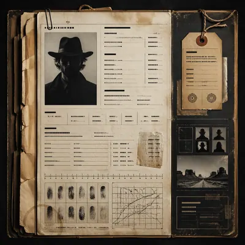</a>

<b>签名式版式</b>

<details><summary>📋 完整提示词</summary>

```
Scene:
A square editorial or interface layout study with exact margins, confident grid structure, and premium print or screen presentation. Build the frame around the most distilled expression of the topic’s layout identity. Keep the lighting, camera distance, and spatial organization tuned for a high-signal research image rather than a casual snapshot. The image belongs to the Archive Aesthetic File theme and should feel immediately legible as a prompt atlas theme for archive aesthetic file, testing text-rendering, structured-layout with gpt image 2..

Subject:
Center the study on the most distilled expression of the topic’s layout identity. Translate the theme into a concrete visual statement instead of an abstract mood board: the viewer should understand what kind of image this is, what is being tested, and why the composition is difficult. Use the slug idea of archive aesthetic file as a literal guide for subject matter, materials, and staging. If helpful, borrow the broad visual cues suggested by Old West Wanted, FBI, but keep the result original and specific to this study.

Important details:
Typography fields must stay unreadable, but hierarchy, rhythm, and page architecture should feel convincing enough for design review. Preserve a disciplined square composition, clear focal hierarchy, and enough secondary information to make the image feel complete rather than underspecified. The image should look polished, novel, and exhibition-ready, with topic-specific credibility coming from the way surfaces, structure, and visual language reinforce Archive Aesthetic File. Avoid generic filler elements that do not serve the main concept.

Use case:
Archive Aesthetic File single study 8/8, testing text-rendering, structured-layout through the signature layout variation.

Constraints:
No readable text, no watermark, no logos, preserve exact 1:1 aspect ratio, no readable text, no logo lockups from real brands, no broken grid, no arbitrary poster clutter, no malformed columns, no accidental lorem ipsum.
```

</details>

</td>
<td width="33%"></td>
</tr>
</table>

## Art Nouveau · Mucha 装饰女性 + 花卉

> Art Nouveau · Mucha 装饰女性 + 花卉：Alphonse Mucha 风 · 飘发女子 + 星形光环 + 百合藤蔓 + 书法 typography · 广告海报(香槟 / 火车 / 烟草)

<table>
<tr>
<td width="33%" valign="top" align="center">

<a href="./works/topics/art-nouveau-poster/packages/single-application-studies/images/01-editorial-study/image.w1600.webp"></a>

<b>编辑研究</b>

<details><summary>📋 完整提示词</summary>

```
Scene:
A square 1:1 composition designed as a premium Art Nouveau Poster study. Design the frame like a high-end editorial image, with strong hierarchy, controlled cropping, and a composed pace between large shapes and small accents. Use lighting, color, and spatial staging that make the core idea legible in one glance while still rewarding close inspection. The frame should feel display-ready rather than like a rough concept sheet, with balanced brightness, deliberate negative space, and clear separation of foreground, midground, and background layers.

Subject:
Interpret Art Nouveau Poster through 新艺术运动 · 19 世纪末. Draw from this visual direction: Alphonse Mucha 风 · 飘发女子 + 星形光环 + 百合藤蔓 + 书法 typography · 广告海报(香槟 / 火车 / 烟草). Focus on an interpretation aimed at editorial clarity, symbolism, and immediate readability. Build a primary focal subject, secondary support forms, and a coherent environmental envelope so the scene feels complete and specific. Treat this as an independent study with no continuity requirement beyond the shared theme language.

Important details:
Carry forward the theme's distinguishing value: 装饰艺术巅峰 · 石版印刷工艺黄金年代 · 现代品牌高级感挪用. Reflect the tested capabilities through visible decisions related to text-rendering, structured-layout, style-transfer, commercial-mockup. 更强图中文字渲染与版式跟随；复杂结构化视觉和多面板构图能力. Aim for these acceptance cues: 一眼能看出这是高难度炫技主题，不像普通模板图; 核心创意和画面结构无需解释即可成立. Keep the image controlled, elegant, and intentionally composed, with no accidental filler elements.

Use case:
Art Nouveau Poster single study 1/8, exploring the topic as an independent editorial composition.

Constraints:
No readable text, no watermark, no logos, preserve exact 1:1 aspect ratio, no muddy focal point, no duplicate main subject, no collage seams, no broken margin geometry, no accidental extra text blocks.
```

</details>

</td>
<td width="33%" valign="top" align="center">

<a href="./works/topics/art-nouveau-poster/packages/single-application-studies/images/02-commercial-study/image.w1600.webp"></a>

<b>商业研究</b>

<details><summary>📋 完整提示词</summary>

```
Scene:
A square 1:1 composition designed as a premium Art Nouveau Poster study. Present the subject with a premium, campaign-ready finish, while keeping the image elegant and intentional rather than salesy. Use lighting, color, and spatial staging that make the core idea legible in one glance while still rewarding close inspection. The frame should feel display-ready rather than like a rough concept sheet, with balanced brightness, deliberate negative space, and clear separation of foreground, midground, and background layers.

Subject:
Interpret Art Nouveau Poster through 新艺术运动 · 19 世纪末. Draw from this visual direction: Alphonse Mucha 风 · 飘发女子 + 星形光环 + 百合藤蔓 + 书法 typography · 广告海报(香槟 / 火车 / 烟草). Focus on a polished commercial-facing treatment with clean hierarchy and high instruction following. Build a primary focal subject, secondary support forms, and a coherent environmental envelope so the scene feels complete and specific. Treat this as an independent study with no continuity requirement beyond the shared theme language.

Important details:
Carry forward the theme's distinguishing value: 装饰艺术巅峰 · 石版印刷工艺黄金年代 · 现代品牌高级感挪用. Reflect the tested capabilities through visible decisions related to text-rendering, structured-layout, style-transfer, commercial-mockup. 更强图中文字渲染与版式跟随；复杂结构化视觉和多面板构图能力. Aim for these acceptance cues: 一眼能看出这是高难度炫技主题，不像普通模板图; 核心创意和画面结构无需解释即可成立. Keep the image controlled, elegant, and intentionally composed, with no accidental filler elements.

Use case:
Art Nouveau Poster single study 2/8, testing the theme in a commercial-facing treatment.

Constraints:
No readable text, no watermark, no logos, preserve exact 1:1 aspect ratio, no muddy focal point, no duplicate main subject, no collage seams, no broken margin geometry, no accidental extra text blocks.
```

</details>

</td>
<td width="33%" valign="top" align="center">

<a href="./works/topics/art-nouveau-poster/packages/single-application-studies/images/03-technical-study/image.w1600.webp"></a>

<b>技术研究</b>

<details><summary>📋 完整提示词</summary>

```
Scene:
A square 1:1 composition designed as a premium Art Nouveau Poster study. Make the scene more analytic and information-rich, with stricter organization, cleaner separation of elements, and explicit structural readability. Use lighting, color, and spatial staging that make the core idea legible in one glance while still rewarding close inspection. The frame should feel display-ready rather than like a rough concept sheet, with balanced brightness, deliberate negative space, and clear separation of foreground, midground, and background layers.

Subject:
Interpret Art Nouveau Poster through 新艺术运动 · 19 世纪末. Draw from this visual direction: Alphonse Mucha 风 · 飘发女子 + 星形光环 + 百合藤蔓 + 书法 typography · 广告海报(香槟 / 火车 / 烟草). Focus on a structured interpretation emphasizing process visibility, precision, or internal logic. Build a primary focal subject, secondary support forms, and a coherent environmental envelope so the scene feels complete and specific. Treat this as an independent study with no continuity requirement beyond the shared theme language.

Important details:
Carry forward the theme's distinguishing value: 装饰艺术巅峰 · 石版印刷工艺黄金年代 · 现代品牌高级感挪用. Reflect the tested capabilities through visible decisions related to text-rendering, structured-layout, style-transfer, commercial-mockup. 更强图中文字渲染与版式跟随；复杂结构化视觉和多面板构图能力. Aim for these acceptance cues: 一眼能看出这是高难度炫技主题，不像普通模板图; 核心创意和画面结构无需解释即可成立. Keep the image controlled, elegant, and intentionally composed, with no accidental filler elements.

Use case:
Art Nouveau Poster single study 3/8, testing whether the topic holds up under a technical visual treatment.

Constraints:
No readable text, no watermark, no logos, preserve exact 1:1 aspect ratio, no muddy focal point, no duplicate main subject, no collage seams, no broken margin geometry, no accidental extra text blocks.
```

</details>

</td>
</tr>
<tr>
<td width="33%" valign="top" align="center">

<a href="./works/topics/art-nouveau-poster/packages/single-application-studies/images/05-material-study/image.w1600.webp"></a>

<b>材质研究</b>

<details><summary>📋 完整提示词</summary>

```
Scene:
A square 1:1 composition designed as a premium Art Nouveau Poster study. Prioritize tactile evidence, surface transitions, print or object finish, and believable light response across the square frame. Use lighting, color, and spatial staging that make the core idea legible in one glance while still rewarding close inspection. The frame should feel display-ready rather than like a rough concept sheet, with balanced brightness, deliberate negative space, and clear separation of foreground, midground, and background layers.

Subject:
Interpret Art Nouveau Poster through 新艺术运动 · 19 世纪末. Draw from this visual direction: Alphonse Mucha 风 · 飘发女子 + 星形光环 + 百合藤蔓 + 书法 typography · 广告海报(香槟 / 火车 / 烟草). Focus on a material-focused interpretation where surface behavior and physical detail carry the theme. Build a primary focal subject, secondary support forms, and a coherent environmental envelope so the scene feels complete and specific. Treat this as an independent study with no continuity requirement beyond the shared theme language.

Important details:
Carry forward the theme's distinguishing value: 装饰艺术巅峰 · 石版印刷工艺黄金年代 · 现代品牌高级感挪用. Reflect the tested capabilities through visible decisions related to text-rendering, structured-layout, style-transfer, commercial-mockup. 更强图中文字渲染与版式跟随；复杂结构化视觉和多面板构图能力. Aim for these acceptance cues: 一眼能看出这是高难度炫技主题，不像普通模板图; 核心创意和画面结构无需解释即可成立. Keep the image controlled, elegant, and intentionally composed, with no accidental filler elements.

Use case:
Art Nouveau Poster single study 5/8, examining material and texture control inside the topic language.

Constraints:
No readable text, no watermark, no logos, preserve exact 1:1 aspect ratio, no muddy focal point, no duplicate main subject, no collage seams, no broken margin geometry, no accidental extra text blocks.
```

</details>

</td>
<td width="33%" valign="top" align="center">

<a href="./works/topics/art-nouveau-poster/packages/single-application-studies/images/06-context-study/image.w1600.webp"></a>

<b>语境研究</b>

<details><summary>📋 完整提示词</summary>

```
Scene:
A square 1:1 composition designed as a premium Art Nouveau Poster study. Shift the environment and narrative setting while keeping the topic recognizable, with clear foreground and background relationships. Use lighting, color, and spatial staging that make the core idea legible in one glance while still rewarding close inspection. The frame should feel display-ready rather than like a rough concept sheet, with balanced brightness, deliberate negative space, and clear separation of foreground, midground, and background layers.

Subject:
Interpret Art Nouveau Poster through 新艺术运动 · 19 世纪末. Draw from this visual direction: Alphonse Mucha 风 · 飘发女子 + 星形光环 + 百合藤蔓 + 书法 typography · 广告海报(香槟 / 火车 / 烟草). Focus on a contextual interpretation that places the topic into a distinct scene or narrative situation. Build a primary focal subject, secondary support forms, and a coherent environmental envelope so the scene feels complete and specific. Treat this as an independent study with no continuity requirement beyond the shared theme language.

Important details:
Carry forward the theme's distinguishing value: 装饰艺术巅峰 · 石版印刷工艺黄金年代 · 现代品牌高级感挪用. Reflect the tested capabilities through visible decisions related to text-rendering, structured-layout, style-transfer, commercial-mockup. 更强图中文字渲染与版式跟随；复杂结构化视觉和多面板构图能力. Aim for these acceptance cues: 一眼能看出这是高难度炫技主题，不像普通模板图; 核心创意和画面结构无需解释即可成立. Keep the image controlled, elegant, and intentionally composed, with no accidental filler elements.

Use case:
Art Nouveau Poster single study 6/8, testing contextual variation without losing the theme identity.

Constraints:
No readable text, no watermark, no logos, preserve exact 1:1 aspect ratio, no muddy focal point, no duplicate main subject, no collage seams, no broken margin geometry, no accidental extra text blocks.
```

</details>

</td>
<td width="33%" valign="top" align="center">

<a href="./works/topics/art-nouveau-poster/packages/single-application-studies/images/08-hero-study/image.w1600.webp">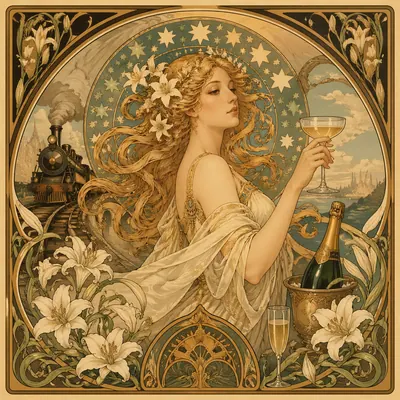</a>

<b>主视觉研究</b>

<details><summary>📋 完整提示词</summary>

```
Scene:
A square 1:1 composition designed as a premium Art Nouveau Poster study. Use the cleanest, most polished version of the topic, with a slightly more dramatic but still controlled presentation. Use lighting, color, and spatial staging that make the core idea legible in one glance while still rewarding close inspection. The frame should feel display-ready rather than like a rough concept sheet, with balanced brightness, deliberate negative space, and clear separation of foreground, midground, and background layers.

Subject:
Interpret Art Nouveau Poster through 新艺术运动 · 19 世纪末. Draw from this visual direction: Alphonse Mucha 风 · 飘发女子 + 星形光环 + 百合藤蔓 + 书法 typography · 广告海报(香槟 / 火车 / 烟草). Focus on the most showcase-ready interpretation, refined into a decisive hero image for the topic. Build a primary focal subject, secondary support forms, and a coherent environmental envelope so the scene feels complete and specific. Treat this as an independent study with no continuity requirement beyond the shared theme language.

Important details:
Carry forward the theme's distinguishing value: 装饰艺术巅峰 · 石版印刷工艺黄金年代 · 现代品牌高级感挪用. Reflect the tested capabilities through visible decisions related to text-rendering, structured-layout, style-transfer, commercial-mockup. 更强图中文字渲染与版式跟随；复杂结构化视觉和多面板构图能力. Aim for these acceptance cues: 一眼能看出这是高难度炫技主题，不像普通模板图; 核心创意和画面结构无需解释即可成立. Keep the image controlled, elegant, and intentionally composed, with no accidental filler elements.

Use case:
Art Nouveau Poster single study 8/8, delivering the strongest finished single-image showcase.

Constraints:
No readable text, no watermark, no logos, preserve exact 1:1 aspect ratio, no muddy focal point, no duplicate main subject, no collage seams, no broken margin geometry, no accidental extra text blocks.
```

</details>

</td>
</tr>
</table>

## Audubon 风生物图谱 · 昆虫 / 鸟类标本盒

> Audubon 风生物图谱 · 昆虫 / 鸟类标本盒：John James Audubon 鸟类图鉴风 / Maria Sibylla Merian 昆虫变态图 / 大英博物馆昆虫标本盒整面

<table>
<tr>
<td width="33%" valign="top" align="center">

<a href="./works/topics/audubon-specimen-atlas/packages/single-audubon-specimen-studies/images/hero-shot/image.w1600.webp"></a>

<b>主镜头</b>

<details><summary>📋 完整提示词</summary>

```
Scene:
A square photographic image with intentional lens choice, coherent light, and a subject that feels observed rather than merely decorated. Build the frame around a definitive frame that establishes the subject’s strongest visual identity. Keep the lighting, camera distance, and spatial organization tuned for a high-signal research image rather than a casual snapshot. The image belongs to the Audubon Specimen Atlas theme and should feel immediately legible as a prompt atlas theme for audubon specimen atlas, testing structured-layout, technical-diagram with gpt image 2..

Subject:
Center the study on a definitive frame that establishes the subject’s strongest visual identity. Translate the theme into a concrete visual statement instead of an abstract mood board: the viewer should understand what kind of image this is, what is being tested, and why the composition is difficult. Use the slug idea of audubon specimen atlas as a literal guide for subject matter, materials, and staging. If helpful, borrow the broad visual cues suggested by John James Audubon, Maria Sibylla Merian, but keep the result original and specific to this study.

Important details:
The realism should come from timing, optics, and material response: atmosphere, contrast, depth, motion, and tiny physical cues all need to agree. Preserve a disciplined square composition, clear focal hierarchy, and enough secondary information to make the image feel complete rather than underspecified. The image should look polished, novel, and exhibition-ready, with topic-specific credibility coming from the way surfaces, structure, and visual language reinforce Audubon Specimen Atlas. Avoid generic filler elements that do not serve the main concept.

Use case:
Audubon Specimen Atlas single study 1/8, testing structured-layout, technical-diagram through the hero shot variation.

Constraints:
No readable text, no watermark, no logos, preserve exact 1:1 aspect ratio, no watermark, no cheap HDR excess, no unreadable signage, no fake stock-photo posing, no compositing seams, no arbitrary lens flare.
```

</details>

</td>
<td width="33%" valign="top" align="center">

<a href="./works/topics/audubon-specimen-atlas/packages/single-audubon-specimen-studies/images/side-light-study/image.w1600.webp"></a>

<b>侧光研究</b>

<details><summary>📋 完整提示词</summary>

```
Scene:
A square photographic image with intentional lens choice, coherent light, and a subject that feels observed rather than merely decorated. Build the frame around a directional-light treatment that increases form and drama. Keep the lighting, camera distance, and spatial organization tuned for a high-signal research image rather than a casual snapshot. The image belongs to the Audubon Specimen Atlas theme and should feel immediately legible as a prompt atlas theme for audubon specimen atlas, testing structured-layout, technical-diagram with gpt image 2..

Subject:
Center the study on a directional-light treatment that increases form and drama. Translate the theme into a concrete visual statement instead of an abstract mood board: the viewer should understand what kind of image this is, what is being tested, and why the composition is difficult. Use the slug idea of audubon specimen atlas as a literal guide for subject matter, materials, and staging. If helpful, borrow the broad visual cues suggested by John James Audubon, Maria Sibylla Merian, but keep the result original and specific to this study.

Important details:
The realism should come from timing, optics, and material response: atmosphere, contrast, depth, motion, and tiny physical cues all need to agree. Preserve a disciplined square composition, clear focal hierarchy, and enough secondary information to make the image feel complete rather than underspecified. The image should look polished, novel, and exhibition-ready, with topic-specific credibility coming from the way surfaces, structure, and visual language reinforce Audubon Specimen Atlas. Avoid generic filler elements that do not serve the main concept.

Use case:
Audubon Specimen Atlas single study 3/8, testing structured-layout, technical-diagram through the side light study variation.

Constraints:
No readable text, no watermark, no logos, preserve exact 1:1 aspect ratio, no watermark, no cheap HDR excess, no unreadable signage, no fake stock-photo posing, no compositing seams, no arbitrary lens flare.
```

</details>

</td>
<td width="33%" valign="top" align="center">

<a href="./works/topics/audubon-specimen-atlas/packages/single-audubon-specimen-studies/images/motion-moment/image.w1600.webp"></a>

<b>动态瞬间</b>

<details><summary>📋 完整提示词</summary>

```
Scene:
A square photographic image with intentional lens choice, coherent light, and a subject that feels observed rather than merely decorated. Build the frame around a time-sensitive or kinetic phenomenon captured at the right instant. Keep the lighting, camera distance, and spatial organization tuned for a high-signal research image rather than a casual snapshot. The image belongs to the Audubon Specimen Atlas theme and should feel immediately legible as a prompt atlas theme for audubon specimen atlas, testing structured-layout, technical-diagram with gpt image 2..

Subject:
Center the study on a time-sensitive or kinetic phenomenon captured at the right instant. Translate the theme into a concrete visual statement instead of an abstract mood board: the viewer should understand what kind of image this is, what is being tested, and why the composition is difficult. Use the slug idea of audubon specimen atlas as a literal guide for subject matter, materials, and staging. If helpful, borrow the broad visual cues suggested by John James Audubon, Maria Sibylla Merian, but keep the result original and specific to this study.

Important details:
The realism should come from timing, optics, and material response: atmosphere, contrast, depth, motion, and tiny physical cues all need to agree. Preserve a disciplined square composition, clear focal hierarchy, and enough secondary information to make the image feel complete rather than underspecified. The image should look polished, novel, and exhibition-ready, with topic-specific credibility coming from the way surfaces, structure, and visual language reinforce Audubon Specimen Atlas. Avoid generic filler elements that do not serve the main concept.

Use case:
Audubon Specimen Atlas single study 4/8, testing structured-layout, technical-diagram through the motion moment variation.

Constraints:
No readable text, no watermark, no logos, preserve exact 1:1 aspect ratio, no watermark, no cheap HDR excess, no unreadable signage, no fake stock-photo posing, no compositing seams, no arbitrary lens flare.
```

</details>

</td>
</tr>
<tr>
<td width="33%" valign="top" align="center">

<a href="./works/topics/audubon-specimen-atlas/packages/single-audubon-specimen-studies/images/low-light-atlas/image.w1600.webp"></a>

<b>低照图谱</b>

<details><summary>📋 完整提示词</summary>

```
Scene:
A square photographic image with intentional lens choice, coherent light, and a subject that feels observed rather than merely decorated. Build the frame around a dusk, night, or low-light frame with disciplined exposure. Keep the lighting, camera distance, and spatial organization tuned for a high-signal research image rather than a casual snapshot. The image belongs to the Audubon Specimen Atlas theme and should feel immediately legible as a prompt atlas theme for audubon specimen atlas, testing structured-layout, technical-diagram with gpt image 2..

Subject:
Center the study on a dusk, night, or low-light frame with disciplined exposure. Translate the theme into a concrete visual statement instead of an abstract mood board: the viewer should understand what kind of image this is, what is being tested, and why the composition is difficult. Use the slug idea of audubon specimen atlas as a literal guide for subject matter, materials, and staging. If helpful, borrow the broad visual cues suggested by John James Audubon, Maria Sibylla Merian, but keep the result original and specific to this study.

Important details:
The realism should come from timing, optics, and material response: atmosphere, contrast, depth, motion, and tiny physical cues all need to agree. Preserve a disciplined square composition, clear focal hierarchy, and enough secondary information to make the image feel complete rather than underspecified. The image should look polished, novel, and exhibition-ready, with topic-specific credibility coming from the way surfaces, structure, and visual language reinforce Audubon Specimen Atlas. Avoid generic filler elements that do not serve the main concept.

Use case:
Audubon Specimen Atlas single study 5/8, testing structured-layout, technical-diagram through the low-light atlas variation.

Constraints:
No readable text, no watermark, no logos, preserve exact 1:1 aspect ratio, no watermark, no cheap HDR excess, no unreadable signage, no fake stock-photo posing, no compositing seams, no arbitrary lens flare.
```

</details>

</td>
<td width="33%" valign="top" align="center">

<a href="./works/topics/audubon-specimen-atlas/packages/single-audubon-specimen-studies/images/specimen-table/image.w1600.webp"></a>

<b>标本桌面</b>

<details><summary>📋 完整提示词</summary>

```
Scene:
A square photographic image with intentional lens choice, coherent light, and a subject that feels observed rather than merely decorated. Build the frame around a carefully arranged or comparative frame that still feels photographic. Keep the lighting, camera distance, and spatial organization tuned for a high-signal research image rather than a casual snapshot. The image belongs to the Audubon Specimen Atlas theme and should feel immediately legible as a prompt atlas theme for audubon specimen atlas, testing structured-layout, technical-diagram with gpt image 2..

Subject:
Center the study on a carefully arranged or comparative frame that still feels photographic. Translate the theme into a concrete visual statement instead of an abstract mood board: the viewer should understand what kind of image this is, what is being tested, and why the composition is difficult. Use the slug idea of audubon specimen atlas as a literal guide for subject matter, materials, and staging. If helpful, borrow the broad visual cues suggested by John James Audubon, Maria Sibylla Merian, but keep the result original and specific to this study.

Important details:
The realism should come from timing, optics, and material response: atmosphere, contrast, depth, motion, and tiny physical cues all need to agree. Preserve a disciplined square composition, clear focal hierarchy, and enough secondary information to make the image feel complete rather than underspecified. The image should look polished, novel, and exhibition-ready, with topic-specific credibility coming from the way surfaces, structure, and visual language reinforce Audubon Specimen Atlas. Avoid generic filler elements that do not serve the main concept.

Use case:
Audubon Specimen Atlas single study 6/8, testing structured-layout, technical-diagram through the specimen table variation.

Constraints:
No readable text, no watermark, no logos, preserve exact 1:1 aspect ratio, no watermark, no cheap HDR excess, no unreadable signage, no fake stock-photo posing, no compositing seams, no arbitrary lens flare.
```

</details>

</td>
<td width="33%" valign="top" align="center">

<a href="./works/topics/audubon-specimen-atlas/packages/single-audubon-specimen-studies/images/atmospheric-view/image.w1600.webp">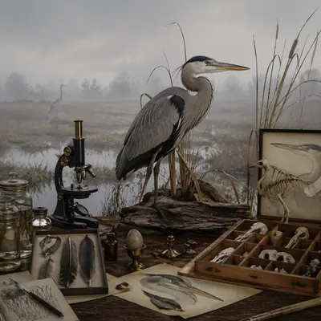</a>

<b>氛围视图</b>

<details><summary>📋 完整提示词</summary>

```
Scene:
A square photographic image with intentional lens choice, coherent light, and a subject that feels observed rather than merely decorated. Build the frame around weather, haze, or volumetric light used to deepen realism. Keep the lighting, camera distance, and spatial organization tuned for a high-signal research image rather than a casual snapshot. The image belongs to the Audubon Specimen Atlas theme and should feel immediately legible as a prompt atlas theme for audubon specimen atlas, testing structured-layout, technical-diagram with gpt image 2..

Subject:
Center the study on weather, haze, or volumetric light used to deepen realism. Translate the theme into a concrete visual statement instead of an abstract mood board: the viewer should understand what kind of image this is, what is being tested, and why the composition is difficult. Use the slug idea of audubon specimen atlas as a literal guide for subject matter, materials, and staging. If helpful, borrow the broad visual cues suggested by John James Audubon, Maria Sibylla Merian, but keep the result original and specific to this study.

Important details:
The realism should come from timing, optics, and material response: atmosphere, contrast, depth, motion, and tiny physical cues all need to agree. Preserve a disciplined square composition, clear focal hierarchy, and enough secondary information to make the image feel complete rather than underspecified. The image should look polished, novel, and exhibition-ready, with topic-specific credibility coming from the way surfaces, structure, and visual language reinforce Audubon Specimen Atlas. Avoid generic filler elements that do not serve the main concept.

Use case:
Audubon Specimen Atlas single study 7/8, testing structured-layout, technical-diagram through the atmospheric view variation.

Constraints:
No readable text, no watermark, no logos, preserve exact 1:1 aspect ratio, no watermark, no cheap HDR excess, no unreadable signage, no fake stock-photo posing, no compositing seams, no arbitrary lens flare.
```

</details>

</td>
</tr>
<tr>
<td width="33%" valign="top" align="center">

<a href="./works/topics/audubon-specimen-atlas/packages/single-audubon-specimen-studies/images/signature-frame/image.w1600.webp">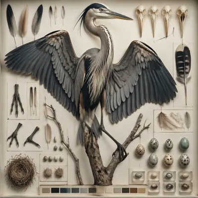</a>

<b>代表画面</b>

<details><summary>📋 完整提示词</summary>

```
Scene:
A square photographic image with intentional lens choice, coherent light, and a subject that feels observed rather than merely decorated. Build the frame around the most memorable final image for the topic. Keep the lighting, camera distance, and spatial organization tuned for a high-signal research image rather than a casual snapshot. The image belongs to the Audubon Specimen Atlas theme and should feel immediately legible as a prompt atlas theme for audubon specimen atlas, testing structured-layout, technical-diagram with gpt image 2..

Subject:
Center the study on the most memorable final image for the topic. Translate the theme into a concrete visual statement instead of an abstract mood board: the viewer should understand what kind of image this is, what is being tested, and why the composition is difficult. Use the slug idea of audubon specimen atlas as a literal guide for subject matter, materials, and staging. If helpful, borrow the broad visual cues suggested by John James Audubon, Maria Sibylla Merian, but keep the result original and specific to this study.

Important details:
The realism should come from timing, optics, and material response: atmosphere, contrast, depth, motion, and tiny physical cues all need to agree. Preserve a disciplined square composition, clear focal hierarchy, and enough secondary information to make the image feel complete rather than underspecified. The image should look polished, novel, and exhibition-ready, with topic-specific credibility coming from the way surfaces, structure, and visual language reinforce Audubon Specimen Atlas. Avoid generic filler elements that do not serve the main concept.

Use case:
Audubon Specimen Atlas single study 8/8, testing structured-layout, technical-diagram through the signature frame variation.

Constraints:
No readable text, no watermark, no logos, preserve exact 1:1 aspect ratio, no watermark, no cheap HDR excess, no unreadable signage, no fake stock-photo posing, no compositing seams, no arbitrary lens flare.
```

</details>

</td>
<td width="33%"></td>
<td width="33%"></td>
</tr>
</table>

## 汽车 Concept Art · 设计工作室级

> 汽车 Concept Art · 设计工作室级：风格:碳笔草图 + 马克笔快速上色 · 3/4 侧面 + 前视 + 侧视 + 俯视 4 视图 · 铅笔网格辅助线 · 例:概念跑车 / 月球车 / 蒸汽朋克机车

<table>
<tr>
<td width="33%" valign="top" align="center">

<a href="./works/topics/automotive-concept-art/packages/single-automotive-concept-art-studies/images/hero-model/image.w1600.webp"></a>

<b>主模型</b>

<details><summary>📋 完整提示词</summary>

```
Scene:
A square CGI or design-visualization frame with calibrated lighting, intentional composition, and premium material rendering. Build the frame around a flagship render that establishes form, stance, and material identity. Keep the lighting, camera distance, and spatial organization tuned for a high-signal research image rather than a casual snapshot. The image belongs to the Automotive Concept Art theme and should feel immediately legible as a prompt atlas theme for automotive concept art, testing technical-diagram, style-transfer, commercial-mockup with gpt image 2..

Subject:
Center the study on a flagship render that establishes form, stance, and material identity. Translate the theme into a concrete visual statement instead of an abstract mood board: the viewer should understand what kind of image this is, what is being tested, and why the composition is difficult. Use the slug idea of automotive concept art as a literal guide for subject matter, materials, and staging.

Important details:
The model must feel engineered or art-directed rather than merely stylized: edges, seams, translucency, reflections, and scale cues should all hold up. Preserve a disciplined square composition, clear focal hierarchy, and enough secondary information to make the image feel complete rather than underspecified. The image should look polished, novel, and exhibition-ready, with topic-specific credibility coming from the way surfaces, structure, and visual language reinforce Automotive Concept Art. Avoid generic filler elements that do not serve the main concept.

Use case:
Automotive Concept Art single study 1/8, testing technical-diagram, style-transfer, commercial-mockup through the hero model variation.

Constraints:
No readable text, no watermark, no logos, preserve exact 1:1 aspect ratio, no real brand logos, no low-poly shortcuts, no broken reflections, no muddy materials, no generic showroom clutter, no unreadable UI overlays.
```

</details>

</td>
<td width="33%" valign="top" align="center">

<a href="./works/topics/automotive-concept-art/packages/single-automotive-concept-art-studies/images/exploded-arrangement/image.w1600.webp"></a>

<b>爆炸排列</b>

<details><summary>📋 完整提示词</summary>

```
Scene:
A square CGI or design-visualization frame with calibrated lighting, intentional composition, and premium material rendering. Build the frame around components or accessories separated with clean studio logic. Keep the lighting, camera distance, and spatial organization tuned for a high-signal research image rather than a casual snapshot. The image belongs to the Automotive Concept Art theme and should feel immediately legible as a prompt atlas theme for automotive concept art, testing technical-diagram, style-transfer, commercial-mockup with gpt image 2..

Subject:
Center the study on components or accessories separated with clean studio logic. Translate the theme into a concrete visual statement instead of an abstract mood board: the viewer should understand what kind of image this is, what is being tested, and why the composition is difficult. Use the slug idea of automotive concept art as a literal guide for subject matter, materials, and staging.

Important details:
The model must feel engineered or art-directed rather than merely stylized: edges, seams, translucency, reflections, and scale cues should all hold up. Preserve a disciplined square composition, clear focal hierarchy, and enough secondary information to make the image feel complete rather than underspecified. The image should look polished, novel, and exhibition-ready, with topic-specific credibility coming from the way surfaces, structure, and visual language reinforce Automotive Concept Art. Avoid generic filler elements that do not serve the main concept.

Use case:
Automotive Concept Art single study 2/8, testing technical-diagram, style-transfer, commercial-mockup through the exploded arrangement variation.

Constraints:
No readable text, no watermark, no logos, preserve exact 1:1 aspect ratio, no real brand logos, no low-poly shortcuts, no broken reflections, no muddy materials, no generic showroom clutter, no unreadable UI overlays.
```

</details>

</td>
<td width="33%" valign="top" align="center">

<a href="./works/topics/automotive-concept-art/packages/single-automotive-concept-art-studies/images/studio-turn/image.w1600.webp"></a>

<b>转台视角</b>

<details><summary>📋 完整提示词</summary>

```
Scene:
A square CGI or design-visualization frame with calibrated lighting, intentional composition, and premium material rendering. Build the frame around a presentation angle that reveals volume and silhouette clearly. Keep the lighting, camera distance, and spatial organization tuned for a high-signal research image rather than a casual snapshot. The image belongs to the Automotive Concept Art theme and should feel immediately legible as a prompt atlas theme for automotive concept art, testing technical-diagram, style-transfer, commercial-mockup with gpt image 2..

Subject:
Center the study on a presentation angle that reveals volume and silhouette clearly. Translate the theme into a concrete visual statement instead of an abstract mood board: the viewer should understand what kind of image this is, what is being tested, and why the composition is difficult. Use the slug idea of automotive concept art as a literal guide for subject matter, materials, and staging.

Important details:
The model must feel engineered or art-directed rather than merely stylized: edges, seams, translucency, reflections, and scale cues should all hold up. Preserve a disciplined square composition, clear focal hierarchy, and enough secondary information to make the image feel complete rather than underspecified. The image should look polished, novel, and exhibition-ready, with topic-specific credibility coming from the way surfaces, structure, and visual language reinforce Automotive Concept Art. Avoid generic filler elements that do not serve the main concept.

Use case:
Automotive Concept Art single study 4/8, testing technical-diagram, style-transfer, commercial-mockup through the studio turn variation.

Constraints:
No readable text, no watermark, no logos, preserve exact 1:1 aspect ratio, no real brand logos, no low-poly shortcuts, no broken reflections, no muddy materials, no generic showroom clutter, no unreadable UI overlays.
```

</details>

</td>
</tr>
<tr>
<td width="33%" valign="top" align="center">

<a href="./works/topics/automotive-concept-art/packages/single-automotive-concept-art-studies/images/scale-comparison/image.w1600.webp"></a>

<b>尺度对照</b>

<details><summary>📋 完整提示词</summary>

```
Scene:
A square CGI or design-visualization frame with calibrated lighting, intentional composition, and premium material rendering. Build the frame around supporting context that clarifies proportion and use without becoming literal advertising. Keep the lighting, camera distance, and spatial organization tuned for a high-signal research image rather than a casual snapshot. The image belongs to the Automotive Concept Art theme and should feel immediately legible as a prompt atlas theme for automotive concept art, testing technical-diagram, style-transfer, commercial-mockup with gpt image 2..

Subject:
Center the study on supporting context that clarifies proportion and use without becoming literal advertising. Translate the theme into a concrete visual statement instead of an abstract mood board: the viewer should understand what kind of image this is, what is being tested, and why the composition is difficult. Use the slug idea of automotive concept art as a literal guide for subject matter, materials, and staging.

Important details:
The model must feel engineered or art-directed rather than merely stylized: edges, seams, translucency, reflections, and scale cues should all hold up. Preserve a disciplined square composition, clear focal hierarchy, and enough secondary information to make the image feel complete rather than underspecified. The image should look polished, novel, and exhibition-ready, with topic-specific credibility coming from the way surfaces, structure, and visual language reinforce Automotive Concept Art. Avoid generic filler elements that do not serve the main concept.

Use case:
Automotive Concept Art single study 5/8, testing technical-diagram, style-transfer, commercial-mockup through the scale comparison variation.

Constraints:
No readable text, no watermark, no logos, preserve exact 1:1 aspect ratio, no real brand logos, no low-poly shortcuts, no broken reflections, no muddy materials, no generic showroom clutter, no unreadable UI overlays.
```

</details>

</td>
<td width="33%" valign="top" align="center">

<a href="./works/topics/automotive-concept-art/packages/single-automotive-concept-art-studies/images/detail-closeup/image.w1600.webp"></a>

<b>细节特写</b>

<details><summary>📋 完整提示词</summary>

```
Scene:
A square CGI or design-visualization frame with calibrated lighting, intentional composition, and premium material rendering. Build the frame around macro rendering of joints, textures, or finish transitions. Keep the lighting, camera distance, and spatial organization tuned for a high-signal research image rather than a casual snapshot. The image belongs to the Automotive Concept Art theme and should feel immediately legible as a prompt atlas theme for automotive concept art, testing technical-diagram, style-transfer, commercial-mockup with gpt image 2..

Subject:
Center the study on macro rendering of joints, textures, or finish transitions. Translate the theme into a concrete visual statement instead of an abstract mood board: the viewer should understand what kind of image this is, what is being tested, and why the composition is difficult. Use the slug idea of automotive concept art as a literal guide for subject matter, materials, and staging.

Important details:
The model must feel engineered or art-directed rather than merely stylized: edges, seams, translucency, reflections, and scale cues should all hold up. Preserve a disciplined square composition, clear focal hierarchy, and enough secondary information to make the image feel complete rather than underspecified. The image should look polished, novel, and exhibition-ready, with topic-specific credibility coming from the way surfaces, structure, and visual language reinforce Automotive Concept Art. Avoid generic filler elements that do not serve the main concept.

Use case:
Automotive Concept Art single study 6/8, testing technical-diagram, style-transfer, commercial-mockup through the detail closeup variation.

Constraints:
No readable text, no watermark, no logos, preserve exact 1:1 aspect ratio, no real brand logos, no low-poly shortcuts, no broken reflections, no muddy materials, no generic showroom clutter, no unreadable UI overlays.
```

</details>

</td>
<td width="33%" valign="top" align="center">

<a href="./works/topics/automotive-concept-art/packages/single-automotive-concept-art-studies/images/environment-presentation/image.w1600.webp">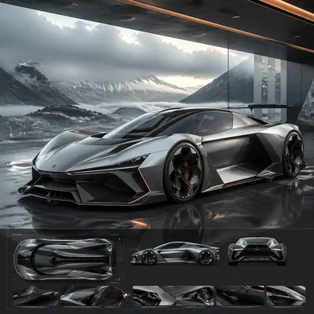</a>

<b>环境展示</b>

<details><summary>📋 完整提示词</summary>

```
Scene:
A square CGI or design-visualization frame with calibrated lighting, intentional composition, and premium material rendering. Build the frame around the design placed into a context that tests realism and narrative. Keep the lighting, camera distance, and spatial organization tuned for a high-signal research image rather than a casual snapshot. The image belongs to the Automotive Concept Art theme and should feel immediately legible as a prompt atlas theme for automotive concept art, testing technical-diagram, style-transfer, commercial-mockup with gpt image 2..

Subject:
Center the study on the design placed into a context that tests realism and narrative. Translate the theme into a concrete visual statement instead of an abstract mood board: the viewer should understand what kind of image this is, what is being tested, and why the composition is difficult. Use the slug idea of automotive concept art as a literal guide for subject matter, materials, and staging.

Important details:
The model must feel engineered or art-directed rather than merely stylized: edges, seams, translucency, reflections, and scale cues should all hold up. Preserve a disciplined square composition, clear focal hierarchy, and enough secondary information to make the image feel complete rather than underspecified. The image should look polished, novel, and exhibition-ready, with topic-specific credibility coming from the way surfaces, structure, and visual language reinforce Automotive Concept Art. Avoid generic filler elements that do not serve the main concept.

Use case:
Automotive Concept Art single study 7/8, testing technical-diagram, style-transfer, commercial-mockup through the 环境展示 variation.

Constraints:
No readable text, no watermark, no logos, preserve exact 1:1 aspect ratio, no real brand logos, no low-poly shortcuts, no broken reflections, no muddy materials, no generic showroom clutter, no unreadable UI overlays.
```

</details>

</td>
</tr>
<tr>
<td width="33%" valign="top" align="center">

<a href="./works/topics/automotive-concept-art/packages/single-automotive-concept-art-studies/images/signature-render/image.w1600.webp">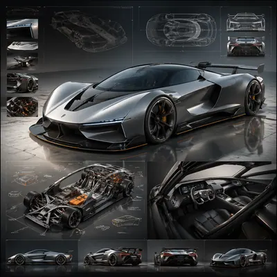</a>

<b>代表渲染</b>

<details><summary>📋 完整提示词</summary>

```
Scene:
A square CGI or design-visualization frame with calibrated lighting, intentional composition, and premium material rendering. Build the frame around the most complete and persuasive final render for the theme. Keep the lighting, camera distance, and spatial organization tuned for a high-signal research image rather than a casual snapshot. The image belongs to the Automotive Concept Art theme and should feel immediately legible as a prompt atlas theme for automotive concept art, testing technical-diagram, style-transfer, commercial-mockup with gpt image 2..

Subject:
Center the study on the most complete and persuasive final render for the theme. Translate the theme into a concrete visual statement instead of an abstract mood board: the viewer should understand what kind of image this is, what is being tested, and why the composition is difficult. Use the slug idea of automotive concept art as a literal guide for subject matter, materials, and staging.

Important details:
The model must feel engineered or art-directed rather than merely stylized: edges, seams, translucency, reflections, and scale cues should all hold up. Preserve a disciplined square composition, clear focal hierarchy, and enough secondary information to make the image feel complete rather than underspecified. The image should look polished, novel, and exhibition-ready, with topic-specific credibility coming from the way surfaces, structure, and visual language reinforce Automotive Concept Art. Avoid generic filler elements that do not serve the main concept.

Use case:
Automotive Concept Art single study 8/8, testing technical-diagram, style-transfer, commercial-mockup through the signature render variation.

Constraints:
No readable text, no watermark, no logos, preserve exact 1:1 aspect ratio, no real brand logos, no low-poly shortcuts, no broken reflections, no muddy materials, no generic showroom clutter, no unreadable UI overlays.
```

</details>

</td>
<td width="33%"></td>
<td width="33%"></td>
</tr>
</table>

## 书籍装帧系列 · 丛书

> 书籍装帧系列 · 丛书：一套 6-10 本丛书封面(主题:世界文学 / 哲学经典 / 科幻十大)· 风格统一 · 配色 / 字体 / 装饰一致但各自主题 · 书脊排成一排成图案

<table>
<tr>
<td width="33%" valign="top" align="center">

<a href="./works/topics/book-series-design/packages/single-book-series-design-studies/images/material-closeup/image.w1600.webp"></a>

<b>材质特写</b>

<details><summary>📋 完整提示词</summary>

```
Scene:
A square editorial or interface layout study with exact margins, confident grid structure, and premium print or screen presentation. Build the frame around print grain, paper, or screen detail without losing overall composition. Keep the lighting, camera distance, and spatial organization tuned for a high-signal research image rather than a casual snapshot. The image belongs to the Book Series Design theme and should feel immediately legible as a prompt atlas theme for book series design, testing text-rendering, structured-layout, style-transfer, commercial-mockup with gpt image 2..

Subject:
Center the study on print grain, paper, or screen detail without losing overall composition. Translate the theme into a concrete visual statement instead of an abstract mood board: the viewer should understand what kind of image this is, what is being tested, and why the composition is difficult. Use the slug idea of book series design as a literal guide for subject matter, materials, and staging.

Important details:
Typography fields must stay unreadable, but hierarchy, rhythm, and page architecture should feel convincing enough for design review. Preserve a disciplined square composition, clear focal hierarchy, and enough secondary information to make the image feel complete rather than underspecified. The image should look polished, novel, and exhibition-ready, with topic-specific credibility coming from the way surfaces, structure, and visual language reinforce Book Series Design. Avoid generic filler elements that do not serve the main concept.

Use case:
Book Series Design single study 4/8, testing text-rendering, structured-layout, style-transfer, commercial-mockup through the material closeup variation.

Constraints:
No readable text, no watermark, no logos, preserve exact 1:1 aspect ratio, no readable text, no logo lockups from real brands, no broken grid, no arbitrary poster clutter, no malformed columns, no accidental lorem ipsum.
```

</details>

</td>
<td width="33%"></td>
<td width="33%"></td>
</tr>
</table>

## 品牌 × 艺术家跨界联名 mockup

> 围绕虚构品牌与艺术家跨界联名的商业样机主题,测试产品、包装与广告海报三件套的结构化版式和风格迁移。

<table>
<tr>
<td width="33%" valign="top" align="center">

<a href="./works/topics/brand-artist-collab-mockup/packages/single-collab-proposal-studies/images/athletic-toy-window/image.w1600.webp"></a>

<b>运动玩具橱窗</b>

<details><summary>📋 完整提示词</summary>

```
Scene:
A square commercial pitch-board mockup photographed in a bright studio, arranged as a clean three-part retail presentation. The camera looks straight at a shallow display shelf with softbox reflections, neutral warm gray background, and crisp shadows. The composition uses a left product hero, a center packaging window box, and a right campaign poster panel, all aligned to a precise grid with generous margins and premium proposal lighting.

Subject:
A fictional athletic footwear capsule paired with a neo-pop toy painter language. The shoe has sculpted white leather panels, cherry-red rubber accents, hand-drawn childlike character marks, and small embossed abstract glyph blocks. The packaging is a clear-window collector box with painted mascot silhouettes and layered insert cards. The poster repeats the product shape as oversized flat color cutouts with playful eyes, uneven brush borders, and carefully placed non-readable label bars.

Important details:
Keep the product, box, and poster visibly from the same campaign through matching red, ivory, black, and pale blue. The mockup must feel expensive enough for a design proposal, not a random collage. Preserve believable materials: leather grain, translucent plastic window, folded carton edges, printed ink texture, and tabletop contact shadows. All typography areas should be structured as clean placeholder glyphs rather than legible brand names.

Use case:
Brand Artist Collab Mockup single study 1/8, focused on a proposal-ready product, packaging, and poster triptych.

Constraints:
No readable text, no watermark, no logos, preserve exact 1:1 aspect ratio, no real brand names, no real artist signatures, no distorted shoe anatomy, no cluttered retail background, no extra panels outside the three-part mockup.
```

</details>

</td>
<td width="33%" valign="top" align="center">

<a href="./works/topics/brand-artist-collab-mockup/packages/single-collab-proposal-studies/images/soda-stencil-billboard/image.w1600.webp"></a>

<b>汽水模板海报</b>

<details><summary>📋 完整提示词</summary>

```
Scene:
A square advertising mockup set on a polished concrete presentation table, lit like a late-afternoon creative agency review. The layout is a balanced commercial board with a glass beverage bottle in the foreground, a six-pack carton slightly behind it, and a vertical street-poster panel rising at the back. The color temperature is cool daylight with selective red highlights, sharp focus, and realistic reflections on glass and varnished cardboard.

Subject:
A fictional soda label collaboration with an anonymous street-stencil muralist language. The bottle is tall and transparent with deep crimson liquid, a torn-paper label shape, sprayed stencil fruit silhouettes, and small abstract warning-label glyph blocks. The carton uses repeated spray-mask shapes, overprinted arrows, and layered sticker textures. The poster shows a dramatic stencil composition of bubbles becoming city windows, with a bold but unreadable headline zone and a clear product packshot area.

Important details:
The art direction should fuse polished beverage marketing with controlled street-art roughness. Keep the same stencil motifs across bottle, carton, and poster so the collaboration reads instantly as one campaign. Make the glass thickness, bottle cap ridges, condensation beads, carton folds, matte spray paint, and pasted-paper edges physically convincing. Layout hierarchy must be clear: product first, packaging second, campaign poster third. Use abstract glyph rows only; no readable copy.

Use case:
Brand Artist Collab Mockup single study 2/8, focused on a beverage launch kit with street-stencil campaign language.

Constraints:
No readable text, no watermark, no logos, preserve exact 1:1 aspect ratio, no existing soda identity, no real street artist signature, no messy graffiti wall, no illegal poster clutter, no warped bottle label, no floating objects.
```

</details>

</td>
<td width="33%" valign="top" align="center">

<a href="./works/topics/brand-artist-collab-mockup/packages/single-collab-proposal-studies/images/sneaker-animation-case/image.w1600.webp"></a>

<b>球鞋动画收纳盒</b>

<details><summary>📋 完整提示词</summary>

```
Scene:
A square collector release mockup on a matte black table with warm cinematic overhead lighting. The frame is organized like a high-end footwear campaign board: one sneaker at a three-quarter angle, a rigid drawer box opened beside it, and a square poster card standing upright in the rear. The scene should feel like a studio photograph prepared for a licensing pitch, with controlled shadows and no environmental clutter.

Subject:
A fictional basketball sneaker collaboration with a hand-painted animation background language. The sneaker combines cream canvas, forest-green suede, weathered brass eyelets, and painted wind-swirl panels that feel like moving storybook air. The drawer box has illustrated cloud bands, tiny creature silhouettes, and layered paper texture. The poster card shows the sneaker crossing a floating landscape of hills and sky paths, with a quiet cinematic composition and abstract subtitle-like blocks that remain non-readable.

Important details:
Keep the artwork influence broad and original: soft gouache landscapes, rounded hand-painted forms, and gentle motion lines, not a copy of any known film. Product realism is critical: laces thread through eyelets correctly, sole tread wraps around the shoe, box lid thickness is visible, and the poster card casts a real shadow. The three objects must share one palette of cream, moss, sky blue, charcoal, and brass. Use clean commercial hierarchy without legible copy.

Use case:
Brand Artist Collab Mockup single study 4/8, focused on a cinematic animated-language sneaker release board.

Constraints:
No readable text, no watermark, no logos, preserve exact 1:1 aspect ratio, no existing team marks, no known animation characters, no real studio references, no extra shoes, no impossible lacing, no poster floating without support.
```

</details>

</td>
</tr>
<tr>
<td width="33%" valign="top" align="center">

<a href="./works/topics/brand-artist-collab-mockup/packages/single-collab-proposal-studies/images/perfume-calligraphy-counter/image.w1600.webp"></a>

<b>香水书法柜台</b>

<details><summary>📋 完整提示词</summary>

```
Scene:
A square luxury fragrance counter mockup photographed in a quiet department-store light box. The setup is symmetrical but not rigid: a perfume bottle sits on a low stone plinth, its folding carton stands behind it, and a campaign poster panel forms the vertical backdrop. The lighting is soft pearl-white with deep ink-black accents, shallow shadows, and glossy reflections that make the glass and foil details feel premium.

Subject:
A fictional fragrance house collaboration with an experimental calligraphy painter language. The bottle is thick clear glass with pale amber liquid, a black lacquer cap, and a label made from sweeping abstract ink strokes rather than readable words. The carton uses embossed paper, brushed silver foil, and one large gestural calligraphy mark wrapping from front to side. The poster shows the bottle centered inside a storm of diluted ink wash, with disciplined blank space and non-readable caption blocks placed below the product.

Important details:
The image should balance luxury restraint with expressive art. Make the bottle geometry correct, glass base heavy, liquid meniscus visible, carton fold lines crisp, and foil catching light only on edges. The calligraphy must feel like original abstract marks, not copied characters or legible script. Maintain a clear hierarchy between object, package, and poster. The palette should stay controlled: ivory, ink black, pale amber, warm gray, and subtle silver.

Use case:
Brand Artist Collab Mockup single study 5/8, focused on a fragrance proposal where expressive mark-making becomes commercial packaging.

Constraints:
No readable text, no watermark, no logos, preserve exact 1:1 aspect ratio, no real fragrance brand, no real calligrapher signature, no readable Chinese or Latin characters, no messy ink splashes covering the bottle, no distorted glass.
```

</details>

</td>
<td width="33%" valign="top" align="center">

<a href="./works/topics/brand-artist-collab-mockup/packages/single-collab-proposal-studies/images/bike-ceramic-pop/image.w1600.webp">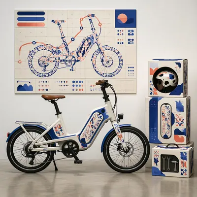</a>

<b>电助力车陶瓷波普</b>

<details><summary>📋 完整提示词</summary>

```
Scene:
A square urban mobility showroom mockup with a compact electric bike displayed beside its shipping accessory kit and a wall-mounted campaign poster. The camera is straight-on at waist height, using a polished concrete floor, white wall, and crisp dealership lighting. The composition is structured as a product launch display: bike across the lower half, packaging modules stacked to one side, poster panel above and behind.

Subject:
A fictional electric bicycle collaboration with a ceramic-pop sculptor language. The bike frame is matte porcelain white with glossy cobalt and coral inlays, rounded modular battery casing, and hand-painted tile-like pattern panels. The accessory packaging consists of a helmet box, battery sleeve, and small toolkit carton with matching ceramic glaze motifs. The poster turns the bike silhouette into a tiled city route map, with abstract non-readable headline bars and small catalog glyphs arranged on a precise grid.

Important details:
The bicycle must be mechanically plausible: round wheels, aligned fork, visible chain or belt path, pedals, brakes, battery housing, and correct contact points on the floor. The ceramic-inspired art should look like glazed inlay and painted tile, not stickers slapped randomly on metal. Packaging must have believable flaps, seams, labels, and printed surface texture. Keep the layout clean enough for a mobility brand deck while showing a complete collaboration system.

Use case:
Brand Artist Collab Mockup single study 7/8, focused on a mobility product system with sculptural ceramic-pop surface design.

Constraints:
No readable text, no watermark, no logos, preserve exact 1:1 aspect ratio, no real bike brand, no real artist signature, no impossible wheel geometry, no floating bike, no showroom people, no overpacked accessory clutter.
```

</details>

</td>
<td width="33%" valign="top" align="center">

<a href="./works/topics/brand-artist-collab-mockup/packages/single-collab-proposal-studies/images/headphones-paper-cut-display/image.w1600.webp">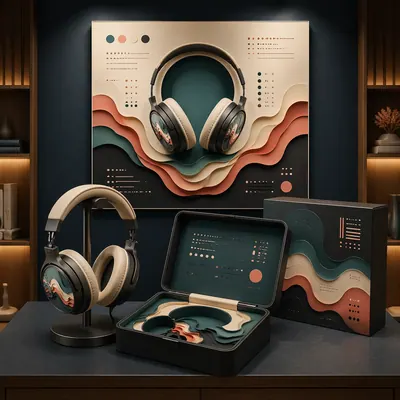</a>

<b>耳机纸雕陈列</b>

<details><summary>📋 完整提示词</summary>

```
Scene:
A square audio retail display mockup inside a softly lit listening-room alcove. The camera faces a centered tabletop display with over-ear headphones on a low stand, a premium rigid case opened in front, and a square campaign poster mounted on the back wall. The lighting is moody but clear, with warm side highlights, matte navy shadows, and enough brightness to inspect textures and layout.

Subject:
A fictional headphone brand collaboration with a layered paper-cut installation artist language. The headphones have brushed graphite cups, warm ivory cushions, and delicate layered paper relief patterns under translucent outer discs. The rigid case contains nested paper-cut inserts shaped like sound waves, while the sleeve uses stacked color planes in teal, coral, cream, and charcoal. The poster shows sound waves as architectural paper layers around the product silhouette, with non-readable launch-copy blocks arranged like a high-end audio ad.

Important details:
The design must read as a complete collaboration system, not separate props. Preserve accurate headphone anatomy: headband curve, hinges, ear cup thickness, cushion softness, cable-free wireless design, and stable stand contact. Paper layers should cast tiny shadows and reveal thickness, while the case should show premium molded construction. The commercial layout must be structured and calm, with the poster, case, and product sharing one visual language. Use placeholder glyph systems only.

Use case:
Brand Artist Collab Mockup single study 8/8, focused on an audio product display where tactile paper-cut art becomes premium packaging and advertising.

Constraints:
No readable text, no watermark, no logos, preserve exact 1:1 aspect ratio, no real audio brand, no real artist signature, no tangled wires, no floating headphones, no excessive darkness, no illegible poster clutter, no extra retail signage.
```

</details>

</td>
</tr>
</table>

## 多轮对话式编辑工作流

> 测试免 mask 的多轮对话式图像编辑：在连续语义修改中保留大部分场景、布局和视觉身份。

<table>
<tr>
<td width="33%" valign="top" align="center">

<a href="./works/topics/conversational-editing-workflow/packages/series-iterative-poster-edit/images/01-base-transit-poster/image.w1600.webp"></a>

<b>基础交通海报</b>

<details><summary>📋 完整提示词</summary>

```
Scene:
Square crop of a polished public-transit campaign poster displayed flat on a design review wall, bright neutral studio lighting, crisp editorial realism, clean margins, and a calm modern palette of cream, graphite, sky blue, and coral accents. The poster looks like a finished layout, not a software screen. The camera is straight-on with no perspective distortion, showing the entire poster and a thin surrounding wall edge.

Subject:
A central illustrated tram shelter at midday, two small pedestrians at opposite sides, one abstract headline block near the top made only of unreadable graphic strokes, a large image panel in the middle, and a balanced row of abstract information blocks near the bottom. The structure must be clear enough that later edits can preserve its identity: same frame, same shelter, same right-side figure, same decorative route shapes, and same overall spacing.

Important details:
This is the root reference for a conversational editing chain. Build deliberate edit handles into the image: a removable left pedestrian, a sky that can shift from midday to dusk, a heading area that can become larger, and a palette that can cool down. All text-like elements must be abstract marks, never readable words or letters.

Use case:
Conversational Editing Workflow series study 1/8, establishing the base image for later semantic edits without masks.

Constraints:
No readable text, no watermark, no logos, preserve exact 1:1 aspect ratio, no real transit brand, no UI overlay, no crop marks, no handwritten notes, no torn paper, no cluttered review board.
```

</details>

</td>
<td width="33%" valign="top" align="center">

<a href="./works/topics/conversational-editing-workflow/packages/single-editing-scenarios/images/cafe-menu-revision/image.w1600.webp"></a>

<b>咖啡菜单修订</b>

<details><summary>📋 完整提示词</summary>

```
Scene:
Square crop of a cafe counter design review scene, soft morning light, neutral stone counter, and a single menu board mockup standing upright on a small easel. The image is polished commercial editorial realism with quiet shadows and precise layout. The board is not a real menu: all text areas are abstract bars, dots, and glyph-like marks.

Subject:
Show one finished menu board that visually implies several conversational edits have been applied: the background changed from bright daytime cream to a warmer evening charcoal, one left-side pastry illustration removed cleanly, the main abstract title area enlarged, and the accent color shifted cooler. Keep the menu category blocks, price-like rows made of unreadable marks, small coffee cup icon, and border grid aligned and consistent.

Important details:
The point is not a before-after split; it is the result of an edit workflow that required semantic understanding. The removed pastry area should be repaired with matching board texture and spacing. The larger heading should push nearby abstract rows downward without crowding. The cooler color should affect icons, dividers, and highlights while the cafe counter environment remains natural. The composition should feel usable by a designer evaluating whether the edit respected the original layout.

Use case:
Conversational Editing Workflow single study 5/8, testing a mask-free menu revision with object removal, hierarchy adjustment, and color tuning.

Constraints:
No readable text, no watermark, no logos, preserve exact 1:1 aspect ratio, no real cafe brand, no split-screen comparison, no UI overlay, no misspelled words, no human hands, no cluttered countertop.
```

</details>

</td>
<td width="33%" valign="top" align="center">

<a href="./works/topics/conversational-editing-workflow/packages/single-editing-scenarios/images/product-colorway-edit/image.w1600.webp"></a>

<b>产品配色编辑</b>

<details><summary>📋 完整提示词</summary>

```
Scene:
Square crop of a product photography set for a lightweight running shoe, clean studio sweep, softbox lighting, pale gray floor, and a few controlled prop shadows. The style is photorealistic commercial mockup with restrained color and crisp material definition.

Subject:
A single shoe sits three-quarter view on a low acrylic riser. The image should imply an edit request such as keep the shoe shape, remove the red heel tag, make the upper cooler blue-gray, and preserve the sole texture and lace geometry. The result must look like the same product after conversational colorway editing, not a different model. Include subtle mesh, translucent sole edge, small decorative stripe shapes with no logo, and clean repaired fabric where the heel tag used to be.

Important details:
This tests local semantic editing without a mask. The shoe silhouette, stitching pattern, lace placement, sole grooves, and lighting must remain coherent while targeted attributes change. The removed tag should leave believable material continuity. The cooler colorway should affect the upper and accent stripe but not the background or shadows. The product should remain centered with catalog-level clarity, suitable for comparing whether shape identity survived the edit.

Use case:
Conversational Editing Workflow single study 6/8, testing object-preserving product edits across removal, material repair, and color transformation.

Constraints:
No readable text, no watermark, no logos, preserve exact 1:1 aspect ratio, no brand marks, no extra shoes, no foot or model, no UI overlay, no split before-after view, no deformed sole, no mismatched laces.
```

</details>

</td>
</tr>
<tr>
<td width="33%" valign="top" align="center">

<a href="./works/topics/conversational-editing-workflow/packages/series-iterative-poster-edit/images/03-larger-cooler-heading/image.w1600.webp"></a>

<b>放大标题并降温配色</b>

<details><summary>📋 完整提示词</summary>

```
Scene:
Square crop of the same transit campaign poster on the same neutral review wall, using the reference as the visual source. The image should look like the next conversational edit after the dusk and removal pass: still a flat poster, still straight-on, still carefully designed, but with a more prominent top heading zone and a cooler design temperature.

Subject:
Keep the dusk tram shelter scene, repaired empty left side, right pedestrian, central image panel, bottom abstract information blocks, margins, and poster identity from the reference. Enlarge the top abstract heading block so it occupies more vertical space and has stronger visual priority, while remaining unreadable and graphic. Shift the overall palette cooler: more blue, cyan, pale lavender, and graphite; less coral warmth. Preserve the warm horizon glow only as a subtle trace inside the illustrated scene.

Important details:
This edit tests whether a model can revise layout hierarchy without rebuilding the whole poster. The heading area should become bigger through careful reflow: nearby route shapes and abstract blocks adjust around it, but the composition stays balanced and recognizable. Avoid literal letters. The abstract heading can be thick bars, modular glyph-like marks, and poster-design shapes that imply larger text without being readable.

Use case:
Conversational Editing Workflow series study 3/8, showing a follow-up request that enlarges a nonreadable heading and cools the color system while preserving previous edits.

Constraints:
No readable text, no watermark, no logos, preserve exact 1:1 aspect ratio, no return of the removed left person, no hot orange redesign, no new poster topic, no visible editing handles, no distorted frame, no real transit map.
```

</details>

</td>
<td width="33%" valign="top" align="center">

<a href="./works/topics/conversational-editing-workflow/packages/single-editing-scenarios/images/living-room-declutter/image.w1600.webp"></a>

<b>客厅去杂物</b>

<details><summary>📋 完整提示词</summary>

```
Scene:
Square crop of a compact living room photographed from eye level, soft overcast daylight through a side window, realistic interior design styling, natural wood floor, cream walls, and a calm balanced exposure. The room should feel lived-in but already edited into a cleaner final state.

Subject:
Show a sofa, coffee table, standing lamp, wall art with abstract unreadable marks, indoor plant, and a rug. The scene should imply a conversational edit sequence: remove the toy pile from the left floor area, make the room slightly cooler in color temperature, straighten the wall art, and keep the sofa, plant, table objects, rug pattern, and window position consistent. The removed area should be naturally repaired with visible floor grain and correct shadows.

Important details:
This is a mask-free interior editing challenge. The edit must maintain room geometry, scale, lighting direction, and object relationships while changing only the requested semantic elements. The cooler mood should be subtle, not a blue filter over everything. The straightened wall art should align with the room perspective. The floor where clutter was removed must not be blurry, smeared, or unnaturally empty; it should contain plausible shadow and texture continuity.

Use case:
Conversational Editing Workflow single study 7/8, testing scene cleanup, color-temperature adjustment, and geometry correction in one coherent interior.

Constraints:
No readable text, no watermark, no logos, preserve exact 1:1 aspect ratio, no before-after split, no editing UI, no distorted furniture, no extra people, no messy replacement clutter, no impossible shadows, no warped wall frame.
```

</details>

</td>
<td width="33%" valign="top" align="center">

<a href="./works/topics/conversational-editing-workflow/packages/series-iterative-poster-edit/images/04-final-balanced-campaign/image.w1600.webp"></a>

<b>最终平衡版广告</b>

<details><summary>📋 完整提示词</summary>

```
Scene:
Square crop of the final version of the same transit campaign poster on the same review wall, straight-on and evenly lit. It should read as the polished result after several conversational edit turns, with a clean professional finish and no visible trace of the editing process.

Subject:
Preserve the original poster identity from the reference: central tram shelter, repaired empty left side, retained right pedestrian, abstract enlarged heading area, dusk environment, lower information block rhythm, route motifs, and square campaign framing. Make the final version more balanced and presentation-ready: refine spacing, clarify the hierarchy, tune contrast, and make the cool palette elegant rather than flat. The poster should look as if a designer accepted the conversational edits and produced a finished campaign proof.

Important details:
This image must demonstrate cumulative instruction following. The earlier requested changes should all remain visible: dusk atmosphere, no left pedestrian, larger abstract heading, cooler overall color, and preserved base composition. Rebalance only through subtle graphic design decisions: cleaner negative space, sharper icon-like abstract route marks, smoother illustration edges, and better tonal separation. Do not invent a new poster, change the topic, or add literal explanations.

Use case:
Conversational Editing Workflow series study 4/8, final cumulative edit proving that multiple conversational revisions can be resolved into one coherent image.

Constraints:
No readable text, no watermark, no logos, preserve exact 1:1 aspect ratio, no left figure returning, no warm midday lighting, no software UI, no before-after split, no annotation labels, no brand identity, no chaotic poster elements.
```

</details>

</td>
</tr>
<tr>
<td width="33%" valign="top" align="center">

<a href="./works/topics/conversational-editing-workflow/packages/single-editing-scenarios/images/gallery-layout-correction/image.w1600.webp">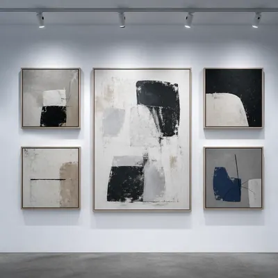</a>

<b>展墙布局校正</b>

<details><summary>📋 完整提示词</summary>

```
Scene:
Square crop of a contemporary gallery wall photographed straight-on, soft ceiling track lights, matte white wall, concrete floor edge, and a restrained exhibition design mood. The image should be clean and frontal, like documentation of a corrected layout after a curator requested edits.

Subject:
Show five framed abstract artworks arranged in a precise grid-like rhythm. The final image should imply multiple conversational edits: remove the small leftmost label plaque, enlarge the central artwork, make the lighting cooler, and align the top row more evenly while preserving the identities of the other frames. All visible art marks are abstract shapes and textures; no readable labels or signatures. The empty wall where the plaque was removed should retain wall texture and natural shadow falloff.

Important details:
This tests structured layout correction. The central frame should grow without colliding with the neighboring frames, and the surrounding frames should reposition just enough to maintain balance. Track-light highlights must follow the cooler lighting request while still looking physically plausible. Keep the wall plane, floor line, frame materials, and overall exhibition style consistent. The corrected grid should feel intentional, not mechanically perfect or randomly rearranged.

Use case:
Conversational Editing Workflow single study 8/8, testing layout-aware object removal, resizing, lighting change, and alignment repair.

Constraints:
No readable text, no watermark, no logos, preserve exact 1:1 aspect ratio, no museum brand, no people, no UI overlay, no before-after split, no crooked final frames, no impossible light beams, no duplicate central artwork.
```

</details>

</td>
<td width="33%"></td>
<td width="33%"></td>
</tr>
</table>

## 水晶球叙事

> 把变化的微缩世界压进同一颗水晶球，测试主体连续性。

<table>
<tr>
<td width="33%" valign="top" align="center">

<a href="./works/topics/crystal-ball-narrative/packages/series-oracle-seasons/images/01-reference-oracle/image.w1600.webp"></a>

<b>基准预言球</b>

<details><summary>📋 完整提示词</summary>

```
Scene:
A dark walnut oracle table in a quiet library at night, black velvet cloth under the object, one warm candle on the left, soft cool moonbeam from a high window on the right, shallow background blur.

Subject:
a transparent crystal ball on an antique brass three-claw stand, centered on a dark walnut oracle table. The crystal ball fills about 68% of the square image width and remains the main object.

Important details:
Photorealistic macro still life, 85mm lens, accurate glass refraction and caustics, subtle double reflections on the sphere, crisp brass patina, dark wood grain, inside the ball is a tiny neutral valley with a river and one stone bridge. The miniature world must appear physically inside the glass, not painted on the surface.

Use case:
Reference-dependent Prompt Atlas series for testing object continuity, runtime --ref injection, and gallery thumbnail readability. Square 1:1 crop-safe composition.

Constraints:
No readable text, no watermark, no logos, no human hands, no extra crystal balls, no cartoon style, no fantasy glow outside the sphere, preserve exact 1:1 aspect ratio.
```

</details>

</td>
<td width="33%" valign="top" align="center">

<a href="./works/topics/crystal-ball-narrative/packages/series-oracle-seasons/images/02-spring-oracle/image.w1600.webp"></a>

<b>春日预言球</b>

<details><summary>📋 完整提示词</summary>

```
Scene:
A dark walnut oracle table in a quiet library at night, black velvet cloth under the object, one warm candle on the left, soft cool moonbeam from a high window on the right, shallow background blur.

Subject:
the same crystal ball and brass stand, now containing a miniature spring world of white blossoms, a winding river, and two tiny travelers. The crystal ball fills about 68% of the square image width and remains the main object.

Important details:
Photorealistic macro still life, 85mm lens, accurate glass refraction and caustics, subtle double reflections on the sphere, crisp brass patina, dark wood grain, preserve the reference crystal ball identity, tabletop position, brass stand, camera angle, and lighting. The miniature world must appear physically inside the glass, not painted on the surface.

Use case:
Reference-dependent Prompt Atlas series for testing object continuity, runtime --ref injection, and gallery thumbnail readability. Square 1:1 crop-safe composition.

Constraints:
No readable text, no watermark, no logos, no human hands, no extra crystal balls, no cartoon style, no fantasy glow outside the sphere, preserve exact 1:1 aspect ratio.
```

</details>

</td>
<td width="33%" valign="top" align="center">

<a href="./works/topics/crystal-ball-narrative/packages/series-oracle-seasons/images/03-autumn-oracle/image.w1600.webp"></a>

<b>秋日预言球</b>

<details><summary>📋 完整提示词</summary>

```
Scene:
A dark walnut oracle table in a quiet library at night, black velvet cloth under the object, one warm candle on the left, soft cool moonbeam from a high window on the right, shallow background blur.

Subject:
the same crystal ball and brass stand, now containing a miniature autumn forest with copper leaves and a lantern path. The crystal ball fills about 68% of the square image width and remains the main object.

Important details:
Photorealistic macro still life, 85mm lens, accurate glass refraction and caustics, subtle double reflections on the sphere, crisp brass patina, dark wood grain, preserve the reference crystal ball identity, tabletop position, brass stand, camera angle, and lighting. The miniature world must appear physically inside the glass, not painted on the surface.

Use case:
Reference-dependent Prompt Atlas series for testing object continuity, runtime --ref injection, and gallery thumbnail readability. Square 1:1 crop-safe composition.

Constraints:
No readable text, no watermark, no logos, no human hands, no extra crystal balls, no cartoon style, no fantasy glow outside the sphere, preserve exact 1:1 aspect ratio.
```

</details>

</td>
</tr>
<tr>
<td width="33%" valign="top" align="center">

<a href="./works/topics/crystal-ball-narrative/packages/series-oracle-seasons/images/04-winter-oracle/image.w1600.webp">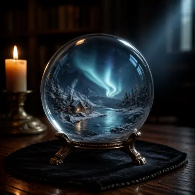</a>

<b>冬日预言球</b>

<details><summary>📋 完整提示词</summary>

```
Scene:
A dark walnut oracle table in a quiet library at night, black velvet cloth under the object, one warm candle on the left, soft cool moonbeam from a high window on the right, shallow background blur.

Subject:
the same crystal ball and brass stand, now containing a miniature winter cabin beside a frozen river under pale blue aurora light. The crystal ball fills about 68% of the square image width and remains the main object.

Important details:
Photorealistic macro still life, 85mm lens, accurate glass refraction and caustics, subtle double reflections on the sphere, crisp brass patina, dark wood grain, preserve the reference crystal ball identity, tabletop position, brass stand, camera angle, and lighting. The miniature world must appear physically inside the glass, not painted on the surface.

Use case:
Reference-dependent Prompt Atlas series for testing object continuity, runtime --ref injection, and gallery thumbnail readability. Square 1:1 crop-safe composition.

Constraints:
No readable text, no watermark, no logos, no human hands, no extra crystal balls, no cartoon style, no fantasy glow outside the sphere, preserve exact 1:1 aspect ratio.
```

</details>

</td>
<td width="33%"></td>
<td width="33%"></td>
</tr>
</table>

## 八格一致性漫画

> 测试多格漫画中的角色身份、产品道具、版式节奏和画风一致性。

<table>
<tr>
<td width="33%" valign="top" align="center">

<a href="./works/topics/eight-panel-consistency-comic/packages/series-launch-comic/images/01-reference-hero-orb-page/image.w1600.webp"></a>

<b>基准主角光球页</b>

<details><summary>📋 完整提示词</summary>

```
Scene:
A square single-page manga-style launch comic with exactly eight panels arranged in a clean 2 by 4 grid. Crisp black panel borders, warm screen-tone texture, limited cyan, magenta, black, and cream palette, high production polish, and clear reading flow from top-left to bottom-right.

Subject:
One consistent protagonist appears across all eight panels: short silver hair, round glasses, cropped black jacket, white hoodie, cyan scarf, magenta sneakers. The protagonist discovers, lifts, and presents a glowing glass orb with the exact readable text GPT-IMAGE-2 inside the orb. The orb stays the same size and design across panels. Expressions change, but the face, hair, outfit, and prop identity remain consistent.

Important details:
Eight distinct panels, one coherent launch story, consistent character model, consistent outfit, consistent glowing orb, dynamic manga camera angles, clean speech balloons with pseudo-text except the orb text GPT-IMAGE-2. Include a few non-readable sound-effect shapes and speed lines. The layout must be readable as one finished comic page, not eight unrelated stickers.

Use case:
Reference image for a four-image series testing character and product-prop consistency across multi-panel comic pages.

Constraints:
Exactly eight panels, preserve one protagonist identity across all panels, only readable text should be GPT-IMAGE-2 on the orb, no real brand logos, no watermark, no extra main characters, no broken panel grid, no photorealism, preserve exact 1:1 aspect ratio.
```

</details>

</td>
<td width="33%" valign="top" align="center">

<a href="./works/topics/eight-panel-consistency-comic/packages/single-comic-studies/images/product-demo-board/image.w1600.webp"></a>

<b>产品演示分镜</b>

<details><summary>📋 完整提示词</summary>

```
Scene:
A square eight-panel product-demo comic page, exactly eight panels in a 2 by 4 grid, clean manga-inspired line art, crisp panel borders, soft screen tones, and a restrained black, cream, cyan, and orange palette.

Subject:
A consistent young inventor character demonstrates a floating image-making tablet across all eight panels. The character has curly dark hair, a yellow utility vest, black turtleneck, and orange headphones. The tablet projects small picture panels, then the inventor compares them, adjusts a dial, and presents a polished final image in the last panel.

Important details:
Strong character consistency across panels, clear commercial demo storytelling, coherent panel-to-panel action, readable gesture language, pseudo-dialogue bubbles, simple sound-effect shapes, no dependency on reference images. The page should feel like a launch storyboard that could be used in a product presentation.

Use case:
Independent comic single image, testing whether one prompt can produce a complete eight-panel product demonstration with consistent character and prop design.

Constraints:
Exactly eight panels, no real logos, no watermark, no readable text, no extra main characters, no broken panel grid, no photorealism, no cluttered UI, preserve exact 1:1 aspect ratio.
```

</details>

</td>
<td width="33%" valign="top" align="center">

<a href="./works/topics/eight-panel-consistency-comic/packages/series-launch-comic/images/02-rooftop-launch-page/image.w1600.webp"></a>

<b>屋顶发布页</b>

<details><summary>📋 完整提示词</summary>

```
Scene:
Same square eight-panel manga page format as the reference image, exactly eight panels in a clean 2 by 4 grid, same ink line weight, screen-tone texture, limited cyan, magenta, black, and cream palette.

Subject:
Use the same protagonist from the reference image: short silver hair, round glasses, cropped black jacket, white hoodie, cyan scarf, magenta sneakers. Place them on a city rooftop at night, using the same glowing GPT-IMAGE-2 orb as the story prop. The eight panels show the character testing the orb, projecting images into the skyline, reacting, then presenting it toward the reader.

Important details:
Preserve identity, outfit, face shape, hair, scarf, sneakers, and orb design from the reference. Keep the exact eight-panel comic rhythm. Use speech balloons with pseudo-text only; the only intended readable text is GPT-IMAGE-2 on the orb. Add manga motion lines, rooftop railings, tiny skyline silhouettes, and glow reflections.

Use case:
Second image in a reference-dependent comic consistency series, testing whether the same character and product prop survive a new setting and story beat.

Constraints:
PRESERVE the reference protagonist, outfit, orb, page style, panel count, and square crop. Exactly eight panels, no real logos, no watermark, no extra main character, no photorealism, no readable dialogue other than GPT-IMAGE-2, preserve exact 1:1 aspect ratio.
```

</details>

</td>
</tr>
<tr>
<td width="33%" valign="top" align="center">

<a href="./works/topics/eight-panel-consistency-comic/packages/single-comic-studies/images/character-turnaround-comic/image.w1600.webp"></a>

<b>角色转面漫画</b>

<details><summary>📋 完整提示词</summary>

```
Scene:
A square eight-panel character consistency comic page, exactly eight panels in a balanced 2 by 4 grid. The style is clean anime production art mixed with manga panel storytelling, cream paper, black ink, and blue accent shadows.

Subject:
One consistent mascot courier appears in all eight panels: bobbed blue hair, star hairpin, oversized white delivery jacket, red backpack, black shorts, and white boots. The panels show front view, side run, close-up reaction, lifting a glowing parcel, jumping over a puddle, checking a tiny map, handing off the parcel, and final thumbs-up pose.

Important details:
The main test is identity consistency: same face, hair, outfit, backpack, boots, and parcel shape in every panel. Use different poses and camera angles while keeping the character recognizable. Add pseudo-dialogue balloons, action lines, and simple background cues, but keep the panel grid clean.

Use case:
Independent comic single image, testing character identity lock across eight panels without reference images.

Constraints:
Exactly eight panels, one main character only, no readable text, no logos, no watermark, no broken panel borders, no photorealism, no outfit changes, preserve exact 1:1 aspect ratio.
```

</details>

</td>
<td width="33%" valign="top" align="center">

<a href="./works/topics/eight-panel-consistency-comic/packages/series-launch-comic/images/03-studio-demo-page/image.w1600.webp"></a>

<b>影棚演示页</b>

<details><summary>📋 完整提示词</summary>

```
Scene:
Same square eight-panel manga page format as the reference image, exactly eight panels in a 2 by 4 grid, same line art, screen tones, limited cyan, magenta, black, and cream palette, and polished product-launch energy.

Subject:
Use the same protagonist from the reference image with identical silver hair, round glasses, black cropped jacket, white hoodie, cyan scarf, and magenta sneakers. The same glowing glass orb with GPT-IMAGE-2 inside sits on a studio table, then floats, projects sketch thumbnails, and becomes the focus of a demo sequence across eight panels.

Important details:
Preserve protagonist identity and prop design from the reference. The studio has simple lights, a drawing table, camera tripod silhouettes, and clean product-demo staging. Keep speech bubbles as pseudo-text, with only GPT-IMAGE-2 readable on the orb. Each panel should advance the demo story while keeping the character model consistent.

Use case:
Third image in a reference-dependent comic consistency series, testing product demo storytelling with the same hero and prop.

Constraints:
PRESERVE the reference protagonist, outfit, orb, page style, panel count, and square crop. Exactly eight panels, no real logos, no watermark, no extra main character, no photorealistic UI, no readable dialogue except GPT-IMAGE-2, preserve exact 1:1 aspect ratio.
```

</details>

</td>
<td width="33%" valign="top" align="center">

<a href="./works/topics/eight-panel-consistency-comic/packages/single-comic-studies/images/launch-storefront-comic/image.w1600.webp"></a>

<b>店铺发布漫画</b>

<details><summary>📋 完整提示词</summary>

```
Scene:
A square eight-panel storefront launch comic, exactly eight panels in a clean 2 by 4 grid. The style is polished commercial manga with crisp borders, bright but controlled colors, screen-tone shadows, and clear product-poster energy.

Subject:
A consistent shopkeeper character prepares a tiny pop-up storefront for an image-generation launch. The shopkeeper has a green apron, square glasses, rolled sleeves, and a small star-shaped badge. Across eight panels they hang posters, arrange sample cards, open the shutters, greet a small crowd, demonstrate a glowing display cube, and celebrate the launch.

Important details:
Maintain the same shopkeeper identity and outfit across all panels. The storefront, display cube, posters, and sample cards should be consistent props. Use pseudo-lettering and symbol marks only; no readable brand names. The page should feel like a commercial launch comic with strong layout clarity and cheerful pacing.

Use case:
Independent comic single image, testing multi-panel commercial storytelling and prop consistency in a self-contained prompt.

Constraints:
Exactly eight panels, no readable text, no real logos, no watermark, no extra main protagonist, no broken grid, no photorealism, no clutter that hides panel flow, preserve exact 1:1 aspect ratio.
```

</details>

</td>
</tr>
<tr>
<td width="33%" valign="top" align="center">

<a href="./works/topics/eight-panel-consistency-comic/packages/series-launch-comic/images/04-subway-reveal-page/image.w1600.webp">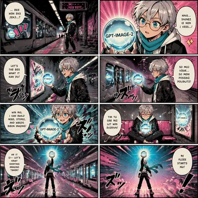</a>

<b>地铁揭晓页</b>

<details><summary>📋 完整提示词</summary>

```
Scene:
Same square eight-panel manga page format as the reference image, exactly eight panels in a clean 2 by 4 grid, same screen-tone texture, ink style, and limited cyan, magenta, black, and cream palette.

Subject:
Use the same protagonist from the reference image with the same silver hair, round glasses, cropped black jacket, white hoodie, cyan scarf, and magenta sneakers. The story takes place in a stylized subway station. The glowing GPT-IMAGE-2 orb reflects in train windows, lights up poster frames, and turns a waiting platform into a launch reveal across eight panels.

Important details:
Preserve the character identity and orb design from the reference. Keep panel rhythm clean and cinematic: establishing shot, close-up, reaction, action, reveal, quiet beat, wide platform glow, final hero pose. Speech balloons contain pseudo-text only; GPT-IMAGE-2 should appear on the orb. Use manga speed lines, train silhouettes, and reflected glow.

Use case:
Fourth image in a reference-dependent comic consistency series, testing identity and prop continuity in a public transit setting.

Constraints:
PRESERVE the reference protagonist, outfit, orb, page style, panel count, and square crop. Exactly eight panels, no real transit logos, no watermark, no extra main character, no photorealism, no readable dialogue except GPT-IMAGE-2, preserve exact 1:1 aspect ratio.
```

</details>

</td>
<td width="33%"></td>
<td width="33%"></td>
</tr>
</table>

## 360° Equirectangular VR 全景

> 测试可放入 VR 头显观看的 2:1 等距矩形全景图，重点考察连续空间、极端画幅和风格化场景稳定性。

<table>
<tr>
<td width="33%" valign="top" align="center">

<a href="./works/topics/equirectangular-vr-panorama/packages/single-panorama-studies/images/floating-sky-village/image.w1600.webp"></a>

<b>悬浮天空村落</b>

<details><summary>📋 完整提示词</summary>

```
Scene:
A 2:1 equirectangular VR panorama of a floating sky village, rendered as warm hand-painted storybook animation with soft morning light, pale blue atmosphere, and high-key clouds. The horizon stays exactly on the horizontal midline, with readable sky above and island undersides below so the image can wrap inside a VR viewer. The camera is standing on a circular wooden lookout platform near the village center, with a calm 360-degree view rather than a flat postcard composition.

Subject:
Floating islands encircle the viewer at different distances: tea houses on mossy rock shelves, rope bridges, small windmills, laundry lines, vegetable terraces, and hovering boats tied to carved posts. A broad cloud river crosses the back half of the panorama, while the front half shows railing, planters, and hanging lanterns that continue around the platform. No single building should dominate; the subject is the full inhabitable village ring.

Important details:
Make the left and right edges align seamlessly as one continuous sky-village loop. Place strong landmarks at front, left, rear, and right viewing directions, with scale fading naturally into cloud haze. Keep vertical lines gently curved only by equirectangular projection, not fisheye. The zenith should be open sky with drifting birds; the nadir should show coherent platform boards.

Use case:
Equirectangular VR Panorama single study 1/8, testing whether a stylized floating village can become a viewer-enterable 360 scene.

Constraints:
No readable text, no watermark, no logos, preserve exact 2:1 aspect ratio, no circular tiny-planet view, no split panels, no black borders, no broken left-right seam, no empty panorama edges, no hard central poster framing.
```

</details>

</td>
<td width="33%" valign="top" align="center">

<a href="./works/topics/equirectangular-vr-panorama/packages/single-panorama-studies/images/undersea-observatory/image.w1600.webp"></a>

<b>深海观测舱</b>

<details><summary>📋 完整提示词</summary>

```
Scene:
A 2:1 equirectangular VR panorama from inside a deep undersea observatory, cinematic but calm, with blue-green filtered light, bioluminescent accents, and dark water fading into distance. The viewer stands at the center of a round glass viewing chamber. The horizon line remains at the exact midpoint of the panorama, and the top of the image shows the glass dome and water column while the bottom shows a continuous metal floor ring.

Subject:
A complete underwater research habitat surrounds the viewer: curved acrylic windows, radial support ribs, soft floor lighting, equipment alcoves without readable labels, and panoramic ocean beyond. Outside the windows are coral towers, slow manta rays, jellyfish constellations, tiny maintenance drones, and one distant volcanic vent field glowing orange. The observatory should feel habitable and scientifically grounded, not like a fantasy palace.

Important details:
Design the room as a true 360-degree cylinder that can wrap left-to-right with no visual jump. Window ribs must continue evenly across the seam, and exterior reef structures should not be cut in half at the edges. Use equirectangular logic: broad horizontal continuity, centered eye level, plausible zenith dome, and coherent nadir floor. Keep highlights soft enough that the panorama remains readable in a headset.

Use case:
Equirectangular VR Panorama single study 2/8, testing photorealistic scientific immersion in a seamless underwater 360 scene.

Constraints:
No readable text, no watermark, no logos, preserve exact 2:1 aspect ratio, no circular fisheye, no tiny-planet projection, no flooded interior, no horror mood, no broken window geometry, no black frame, no blank water-only half.
```

</details>

</td>
<td width="33%" valign="top" align="center">

<a href="./works/topics/equirectangular-vr-panorama/packages/single-panorama-studies/images/moon-temple-courtyard/image.w1600.webp"></a>

<b>月面寺院庭院</b>

<details><summary>📋 完整提示词</summary>

```
Scene:
A 2:1 equirectangular VR panorama of a moonlit temple courtyard built on a quiet lunar ridge, painted in refined fantasy realism with silver light, deep indigo shadows, and pale stone. The viewer stands in the exact center of a circular courtyard. The horizon is centered and wraps into a complete 360-degree ring: mountains, stars, and temple walls must connect smoothly from the far left edge to the far right edge.

Subject:
Four low temple halls, a ring of carved columns, shallow reflecting pools, stone lanterns, and suspended prayer ribbons surround the viewer. Above the rear half of the panorama, a large moon hangs low over distant crater mountains. In the front half, a patterned stone floor circles the camera with radial inlays and small water channels. The architecture blends East Asian courtyard balance with lunar geology, but contains no readable inscriptions.

Important details:
This must feel like an actual equirectangular environment map: left and right edges are adjacent, the courtyard paving continues through the nadir, and the zenith contains coherent night sky rather than a flat ceiling. Place visual anchors at every quarter turn: moon gate, bell pavilion, reflecting pool, and stairway to the ridge. Maintain calm symmetry without making the whole image a repeated wallpaper strip.

Use case:
Equirectangular VR Panorama single study 3/8, testing poetic architectural continuity and celestial lighting across a headset-ready 360 scene.

Constraints:
No readable text, no watermark, no logos, preserve exact 2:1 aspect ratio, no circular planet projection, no panel borders, no warped duplicated moon, no unreadable clutter, no hard seam, no cropped roof at the left-right wrap.
```

</details>

</td>
</tr>
<tr>
<td width="33%" valign="top" align="center">

<a href="./works/topics/equirectangular-vr-panorama/packages/single-panorama-studies/images/desert-train-station/image.w1600.webp"></a>

<b>沙漠列车站</b>

<details><summary>📋 完整提示词</summary>

```
Scene:
A 2:1 equirectangular VR panorama of a desert train station at golden hour, with cinematic realism, amber dust, long shadows, and a clear turquoise sky. The viewpoint is centered on the main platform between two curved tracks. The horizon stays at the midline, and the station must wrap left-to-right as a continuous rail yard instead of reading as a flat wide-angle photograph.

Subject:
Around the viewer are tiled platform edges, iron shade canopies, a water tower, signal posts with abstract marks only, luggage carts, wind-sculpted dunes, and a long silver train bending around the rear half of the scene. On the front half, sand has drifted across the platform in soft ridges. The station architecture feels slightly retro-futurist, with brass trim and practical desert engineering, but no brand identity.

Important details:
The two tracks should form believable arcs around the viewer and continue smoothly through both panorama edges. Keep the left and right boundaries visually compatible: same rail height, same dune horizon, same light direction. Add landmarks at quarter turns so a VR viewer has orientation cues: ticket hall, train nose, water tower, and distant canyon. Zenith should be open sky; nadir should be platform tile and sand, not a void.

Use case:
Equirectangular VR Panorama single study 4/8, testing whether transportation infrastructure can stay spatially coherent in a 360-degree extreme-aspect scene.

Constraints:
No readable text, no watermark, no logos, preserve exact 2:1 aspect ratio, no circular fisheye, no miniature planet, no impossible rail intersections, no duplicated train nose at the seam, no black border, no poster-like centered composition.
```

</details>

</td>
<td width="33%" valign="top" align="center">

<a href="./works/topics/equirectangular-vr-panorama/packages/single-panorama-studies/images/crystal-forest-clearing/image.w1600.webp"></a>

<b>水晶森林空地</b>

<details><summary>📋 完整提示词</summary>

```
Scene:
A 2:1 equirectangular VR panorama of a bioluminescent crystal forest clearing at twilight, with cool violet shadows, teal moss light, and transparent mineral highlights. The viewer stands in the middle of a circular clearing. The horizon is centered and visible through rings of trees and crystal formations, while the top of the panorama opens into a deep blue canopy and the bottom shows a coherent mossy ground plane.

Subject:
Crystalline tree trunks, ferns, glowing mushrooms, shallow pools, and faceted stone arches surround the viewer in a full 360-degree environment. Some crystals are embedded in bark; others rise from the ground like natural prisms. Small firefly-like particles trace gentle paths around the clearing. The scene should feel magical but physically walkable, with one path entering from the front, another leaving at the rear, and side landmarks that keep orientation clear.

Important details:
Maintain equirectangular projection discipline: no fisheye globe, no pinched center, no empty stretched sides. The left and right panorama edges should share matching tree density, ground height, and lighting so they can join invisibly. Put the brightest crystals away from the seam to avoid a cut artifact. The nadir should show moss, roots, and water reflections; the zenith should show canopy gaps and twilight sky.

Use case:
Equirectangular VR Panorama single study 5/8, testing dense organic detail and material highlights in a seamless 360-degree fantasy environment.

Constraints:
No readable text, no watermark, no logos, preserve exact 2:1 aspect ratio, no circular tiny-planet view, no kaleidoscope symmetry, no random wallpaper repetition, no broken left-right seam, no harsh neon glow, no flat poster framing.
```

</details>

</td>
<td width="33%" valign="top" align="center">

<a href="./works/topics/equirectangular-vr-panorama/packages/single-panorama-studies/images/retro-space-habitat/image.w1600.webp"></a>

<b>复古太空栖居舱</b>

<details><summary>📋 完整提示词</summary>

```
Scene:
A 2:1 equirectangular VR panorama inside a retro space habitat greenhouse, combining optimistic 1970s space design with contemporary cinematic lighting. The viewer stands on a circular walkway at the center of a rotating orbital garden. The horizon sits on the midline, with windows and habitat walls wrapping continuously around the full panorama. Warm grow lights, pale aluminum, orange upholstery, and leafy greens create a balanced palette.

Subject:
The habitat contains curved glass windows showing Earth below, hydroponic planters, modular crew alcoves, rounded storage cabinets, exercise rails, small maintenance robots, and a ring-shaped garden path. Crops and flowering vines climb trellises around the viewer. The exterior view should appear through several window banks rather than one flat space wallpaper, and all equipment should feel functional but not cluttered.

Important details:
Build the room as a complete 360-degree interior: floor seams, ceiling ribs, handrails, and planter rows must line up across the left and right edges. The zenith should contain curved structural ribs and soft lights; the nadir should show the circular walkway and planter bases. Keep readable labels out; use color-coded shapes and abstract icons only. Avoid exaggerated lens distortion while preserving equirectangular spatial spread.

Use case:
Equirectangular VR Panorama single study 6/8, testing interior continuity, sci-fi worldbuilding, and style transfer in an extreme 2:1 VR environment.

Constraints:
No readable text, no watermark, no logos, preserve exact 2:1 aspect ratio, no circular fisheye, no tiny-planet projection, no dark horror spaceship, no broken room seam, no floating disconnected furniture, no flat concept-art strip.
```

</details>

</td>
</tr>
<tr>
<td width="33%" valign="top" align="center">

<a href="./works/topics/equirectangular-vr-panorama/packages/single-panorama-studies/images/vertical-city-crossroads/image.w1600.webp">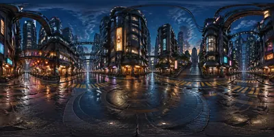</a>

<b>垂直城市十字路口</b>

<details><summary>📋 完整提示词</summary>

```
Scene:
A 2:1 equirectangular VR panorama standing at the center of a vertical city crossroads at dusk, with crisp editorial realism, rain-wet pavement, soft signage-like glow without readable text, and layered towers rising in every direction. The viewer is at street level on a circular pedestrian island. The horizon is exactly centered, with street canyons wrapping into a continuous 360-degree urban ring.

Subject:
Elevated walkways, tram cables, market awnings, stacked balconies, rooftop gardens, delivery lifts, and glass elevators surround the viewer. Four main streets radiate toward different districts: a food arcade, a transit hub, a residential tower canyon, and a public garden stair. People can appear only as small anonymous silhouettes for scale. The city should feel dense and navigable, not chaotic.

Important details:
This is an equirectangular panorama, so the left and right edges must join as adjacent sides of the same street canyon. Keep building heights and vanishing logic compatible across the seam. Add overhead cables and rail lines that arc naturally through the zenith without becoming tangled scribbles. The nadir should be a continuous wet pavement island with reflected lights. Use abstract glowing panels and icons only, no readable words or brand marks.

Use case:
Equirectangular VR Panorama single study 7/8, testing high-density structured layout and urban wayfinding inside a seamless VR-ready city scene.

Constraints:
No readable text, no watermark, no logos, preserve exact 2:1 aspect ratio, no circular fisheye, no tiny-planet projection, no impossible perspective collapse, no random duplicated buildings at the seam, no overstuffed illegible signage, no black borders.
```

</details>

</td>
<td width="33%" valign="top" align="center">

<a href="./works/topics/equirectangular-vr-panorama/packages/single-panorama-studies/images/aurora-ice-cavern/image.w1600.webp">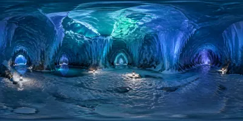</a>

<b>极光冰洞</b>

<details><summary>📋 完整提示词</summary>

```
Scene:
A 2:1 equirectangular VR panorama inside an aurora-lit ice cavern, with luminous cyan, violet, and emerald reflections, deep blue shadows, and crisp realistic ice texture. The viewer stands on a safe frozen shelf in the center of a round cavern chamber. The horizon is centered at eye level; the upper half shows translucent ice arches and aurora glow filtering through cracks, while the lower half shows continuous snow, frozen water, and rock edges.

Subject:
The cavern surrounds the viewer with layered ice curtains, stalactites, frosted stone, small meltwater pools, and a narrow tunnel opening in each cardinal direction. Through a ceiling fissure, aurora light ripples across the ice. Tiny expedition lanterns sit on the ground as scale markers but contain no text. The scene should feel vast, cold, and physically plausible, with enough detail for close VR inspection.

Important details:
Left and right edges must connect as the same ice wall, with matching color temperature, ground height, and arch rhythm. Avoid putting a single dramatic tunnel at the seam. The zenith should have coherent ice ceiling structure; the nadir should not collapse into a blur, but show snow texture and reflected aurora. Reflections in the ice should follow surface direction and not create random mirror duplicates.

Use case:
Equirectangular VR Panorama single study 8/8, testing transparent material rendering and seamless cave geometry in a headset-ready 360 scene.

Constraints:
No readable text, no watermark, no logos, preserve exact 2:1 aspect ratio, no circular fisheye, no tiny-planet image, no black void ceiling, no impossible floating ice shards, no broken panorama seam, no overexposed neon wash.
```

</details>

</td>
<td width="33%"></td>
</tr>
</table>

## Escher 不可能几何 · 永恒楼梯

> Escher 不可能几何 · 永恒楼梯：彭罗斯三角、永恒上升楼梯、瀑布循环、相对性空间等数学视觉悖论。

<table>
<tr>
<td width="33%" valign="top" align="center">

<a href="./works/topics/escher-impossible-geometry/packages/single-impossible-geometry-studies/images/penrose-triangle-terrace/image.w1600.webp"></a>

<b>彭罗斯三角露台</b>

<details><summary>📋 完整提示词</summary>

```
Scene:
A square black-and-white line engraving in the spirit of mathematical impossible-geometry prints, viewed as a gallery plate with crisp ink, ivory paper grain, and controlled cross-hatching. The camera is straight-on with no frame text. The composition is bright enough to inspect every line, but the shadows are precise and architectural.

Subject:
Create a monumental Penrose triangle as an outdoor stone terrace. Three thick rectangular beams form a triangular loop that appears locally plausible at every corner but globally impossible. Tiny stairs, tiled paving, and low railings sit on the beams to emphasize scale. Each beam face should have consistent stone texture and engraved shadow, while the corners join in a way that tricks the eye into accepting an impossible loop.

Important details:
The illusion must be geometrically disciplined: each beam has believable thickness, clean parallel edges, consistent light direction, and precise corner overlaps. The viewer should be able to trace the triangle and discover that front, back, up, and down relationships contradict one another. Keep the scene austere and mathematical, with no decorative clutter masking the optical rule.

Use case:
Escher Impossible Geometry single study 1/8, testing a readable Penrose triangle terrace in black-and-white engraving.

Constraints:
No readable text, no watermark, no logos, preserve exact 1:1 aspect ratio, no color, no random fantasy architecture, no broken triangle loop, no soft painterly blur, no perspective noise, no hidden labels.
```

</details>

</td>
<td width="33%" valign="top" align="center">

<a href="./works/topics/escher-impossible-geometry/packages/single-impossible-geometry-studies/images/endless-stair-court/image.w1600.webp"></a>

<b>永恒楼梯庭院</b>

<details><summary>📋 完整提示词</summary>

```
Scene:
A square black-and-white architectural engraving of a silent courtyard, viewed from a high oblique angle. The paper is ivory, the ink is deep black, and all shadows are made with fine cross-hatching. The space should feel like a precise mathematical study rather than a fantasy castle, with clean stone walls and tiled landings.

Subject:
Construct an endless ascending staircase loop around a square courtyard. Four flights of stairs connect four landings, and each flight appears to climb upward, yet the final landing returns to the starting height. Small identical archways, railings, and floor tiles repeat around the loop so the contradiction becomes visible. The viewer should feel that walking forward always goes upstairs but somehow arrives back at the same level.

Important details:
The illusion depends on disciplined perspective. Each staircase segment must be locally convincing, with equal step counts, consistent risers, and believable railing shadows. The global loop must be impossible, not merely circular. Use small human-scale objects like empty benches or planters only if they clarify scale, not as distractions. Keep the center courtyard open so the eye can trace the full loop.

Use case:
Escher Impossible Geometry single study 2/8, testing an eternal ascending stair loop with verifiable perspective contradiction.

Constraints:
No readable text, no watermark, no logos, preserve exact 1:1 aspect ratio, no color, no random spiral staircase, no broken step rhythm, no crowded figures, no labels, no blurred geometry.
```

</details>

</td>
<td width="33%" valign="top" align="center">

<a href="./works/topics/escher-impossible-geometry/packages/single-impossible-geometry-studies/images/waterfall-loop-mill/image.w1600.webp"></a>

<b>瀑布循环水磨</b>

<details><summary>📋 完整提示词</summary>

```
Scene:
A square black-and-white engraved landscape showing a stone watermill built into impossible geometry. The view is slightly elevated, with crisp river channels, dark hatch shadows, and pale open sky. The image should feel like a museum-quality mathematical print: calm, exact, and visually paradoxical.

Subject:
Create a waterfall loop where water pours down from a high aqueduct into a wheel, then follows a channel that seems to rise step by step back to the same high point. The water path should form a closed visual circuit: wheel basin, stepped canal, overhead trough, falling stream, and back to the wheel. The stone channels are locally level or gently sloped, but globally impossible. The mill wheel should be turning in the only place where water visibly falls.

Important details:
The viewer must be able to trace the entire water route without confusion. Use consistent masonry texture, clean channel edges, and believable water reflections. The impossibility should come from perspective and height contradiction, not from magical floating water. Avoid excessive landscape detail; the loop, wheel, and aqueduct must dominate the composition.

Use case:
Escher Impossible Geometry single study 3/8, testing a waterfall cycle that returns uphill through impossible perspective.

Constraints:
No readable text, no watermark, no logos, preserve exact 1:1 aspect ratio, no color, no random river branches, no broken water loop, no fantasy glow, no messy foliage hiding geometry, no labels.
```

</details>

</td>
</tr>
<tr>
<td width="33%" valign="top" align="center">

<a href="./works/topics/escher-impossible-geometry/packages/single-impossible-geometry-studies/images/relativity-stair-room/image.w1600.webp"></a>

<b>相对性楼梯房间</b>

<details><summary>📋 完整提示词</summary>

```
Scene:
A square black-and-white engraving of an interior stone room with multiple staircases, balconies, doorways, and tiled planes, viewed in a carefully impossible perspective. The lighting is even and graphic, with cross-hatched shadows that define separate gravity directions. The room should be dense enough to reward inspection but not chaotic.

Subject:
Create a relativity space where at least three gravity directions coexist. Staircases climb along walls that behave like floors, doors open onto sideways landings, and two stairways both appear to descend while meeting at the same landing. Simple robed figures may walk on different planes to clarify orientation, but they should be small and quiet, not narrative characters. Every architectural element should look locally stable while the total room contradicts normal gravity.

Important details:
The impossible geometry must be readable through floor tiles, stair risers, wall openings, and shadows. Keep linework precise and avoid random maze complexity. The viewer should be able to identify which plane is floor for each figure, then realize these floors cannot coexist in one physical room. Use black, white, and gray hatch only.

Use case:
Escher Impossible Geometry single study 4/8, testing a relativity room where multiple gravity directions share one coherent architecture.

Constraints:
No readable text, no watermark, no logos, preserve exact 1:1 aspect ratio, no color, no fantasy creatures, no floating stairs without support logic, no unreadable maze clutter, no labels, no distorted figures.
```

</details>

</td>
<td width="33%" valign="top" align="center">

<a href="./works/topics/escher-impossible-geometry/packages/single-impossible-geometry-studies/images/impossible-bridge-archive/image.w1600.webp"></a>

<b>不可能桥档案馆</b>

<details><summary>📋 完整提示词</summary>

```
Scene:
A square black-and-white engraving of a quiet archive hall crossed by an impossible bridge. The view is orthographic enough to read the structure but still has deep architectural space. Use ivory paper, crisp black ink, fine shelf textures, and disciplined shadow hatching. The setting is scholarly, silent, and mathematical.

Subject:
Build a stone bridge that crosses the archive from left balcony to right balcony, but its underside becomes its top surface halfway across. The bridge appears to twist without twisting: handrails remain upright locally, walkway tiles stay flat underfoot, yet the near end and far end cannot connect in real three-dimensional space. Bookshelves, ladders, and columns provide a stable reference grid around the paradox.

Important details:
This illusion should be verifiable by tracing railings and floor tiles. The bridge must not look like a normal spiral ramp; it should be locally straight and rectangular, with impossible transitions hidden in perspective overlaps. Keep the surrounding archive realistic and consistent so the impossible bridge is the only contradiction. Avoid using text on book spines or signs.

Use case:
Escher Impossible Geometry single study 5/8, testing an impossible bridge inside a stable architectural reference grid.

Constraints:
No readable text, no watermark, no logos, preserve exact 1:1 aspect ratio, no color, no book-spine words, no ordinary spiral bridge, no broken railings, no excessive clutter, no labels.
```

</details>

</td>
<td width="33%" valign="top" align="center">

<a href="./works/topics/escher-impossible-geometry/packages/single-impossible-geometry-studies/images/infinite-balcony-library/image.w1600.webp"></a>

<b>无限阳台图书馆</b>

<details><summary>📋 完整提示词</summary>

```
Scene:
A square black-and-white engraving of a tall interior library with balconies, ladders, shelves, and arched openings, seen from a precise central perspective. The lighting is calm and museum-like, with pale paper, dark ink, and layered cross-hatching. The image should feel like a mathematical architectural print rather than a fantasy illustration.

Subject:
Create an impossible library where balconies repeat upward and downward but loop back into the same level. A ladder leaning upward reaches a balcony that also appears below the starting balcony. A reading table is seen from above on one plane and from below on another. Shelf rows create a grid that helps the viewer track the contradiction. The space should suggest infinity without relying on fog or blur.

Important details:
The illusion depends on architectural repetition and perspective continuity. Keep shelves, arches, balcony rails, and ladder rungs cleanly aligned. The loop should be visible: following one balcony around the room should lead to a level that cannot physically match the starting point. Do not fill shelves with readable titles; use abstract book textures only. Maintain clear negative space around the main loop.

Use case:
Escher Impossible Geometry single study 6/8, testing an infinite library balcony loop with clean black-and-white linework.

Constraints:
No readable text, no watermark, no logos, preserve exact 1:1 aspect ratio, no color, no readable book titles, no random maze corridors, no broken ladder geometry, no soft blur, no labels.
```

</details>

</td>
</tr>
<tr>
<td width="33%" valign="top" align="center">

<a href="./works/topics/escher-impossible-geometry/packages/single-impossible-geometry-studies/images/cube-lattice-paradox/image.w1600.webp">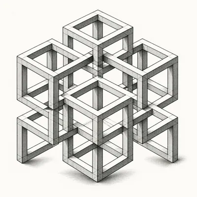</a>

<b>立方格架悖论</b>

<details><summary>📋 完整提示词</summary>

```
Scene:
A square black-and-white mathematical engraving on ivory paper, centered on a floating lattice of interlocking cubes. The background is plain and bright so the optical structure is easy to inspect. Use precise ink outlines, clean hatch shading on cube faces, and no decorative environment except faint cast shadows that clarify depth.

Subject:
Create a paradoxical cube lattice where several open cubes share edges in a way that is locally consistent but globally impossible. Some beams pass in front of each other at one junction and behind at the next, forming a closed impossible frame. The lattice should resemble a crystalline architectural puzzle with eight to twelve cube cells, each face shaded according to a single light source. The viewer should be able to follow one beam and find that depth order contradicts itself.

Important details:
This image is about pure geometry. Keep the cubes aligned to an isometric grid, with equal beam thickness, sharp corners, and consistent hatch density. Avoid organic shapes or decorative background. The impossibility should come from carefully selected over-under relationships, not from random broken perspective. Make the paradox legible at thumbnail size and rewarding in close inspection.

Use case:
Escher Impossible Geometry single study 7/8, testing an impossible cube lattice with strict isometric depth contradictions.

Constraints:
No readable text, no watermark, no logos, preserve exact 1:1 aspect ratio, no color, no warped cube faces, no random floating fragments, no messy shadows, no labels, no soft 3D render style.
```

</details>

</td>
<td width="33%" valign="top" align="center">

<a href="./works/topics/escher-impossible-geometry/packages/single-impossible-geometry-studies/images/dual-gravity-plaza/image.w1600.webp">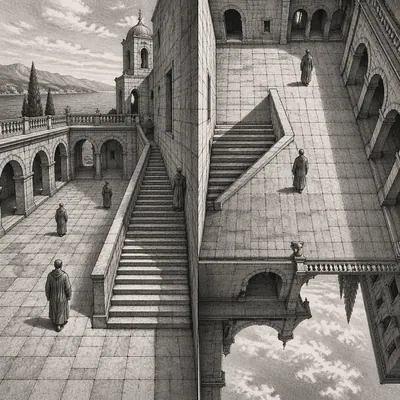</a>

<b>双重重力广场</b>

<details><summary>📋 完整提示词</summary>

```
Scene:
A square black-and-white engraving of an open stone plaza with arches, stair ramps, tiled ground, and two visible horizon cues that contradict each other. The view is architectural and exact, with strong ink lines and delicate cross-hatching. The plaza is mostly empty so the geometry can be read clearly.

Subject:
Design a dual-gravity plaza where the left half treats the central wall as a vertical facade, while the right half treats that same wall as a floor. Two stair ramps meet at the central edge, and both appear to lead downward from their own gravity direction. A few small robed figures may walk on different planes to clarify orientation, but no figure should dominate. Arches, tiles, and shadows should reveal the contradiction without written labels.

Important details:
The optical rule must be strict: each local area should make sense, with believable stair direction, shadows, and upright figures, while the shared central geometry cannot exist in normal space. Use tiled grids to make the shift in gravity visible. Keep the composition balanced and calm, like a formal proof in architectural engraving. Avoid hiding the paradox behind decoration.

Use case:
Escher Impossible Geometry single study 8/8, testing a dual-gravity public plaza where two directions are both logically down.

Constraints:
No readable text, no watermark, no logos, preserve exact 1:1 aspect ratio, no color, no chaotic crowd, no fantasy portals, no floating figures, no inconsistent tile grid, no labels, no painterly blur.
```

</details>

</td>
<td width="33%"></td>
</tr>
</table>

## 名人虚构 snapshot · 伪手机抓拍

> 用完全虚构的公众人物制造看似随手拍的日常照片，测试手机照片真实感、场景推理和非真实事件构图。

<table>
<tr>
<td width="33%" valign="top" align="center">

<a href="./works/topics/fictional-celebrity-snapshot/packages/single-fictional-snapshots/images/tech-founder-skate-stop/image.w1600.webp"></a>

<b>科技创始人滑板停靠</b>

<details><summary>📋 完整提示词</summary>

```
Scene:
A square smartphone snapshot in late afternoon city light, slightly tilted and imperfectly framed as if taken quickly from across a bike lane. The image has natural phone-camera compression, mild motion blur at the edges, realistic asphalt texture, parked scooters, a bus stop shelter, and ordinary pedestrians in soft background focus. The mood should feel plausible and unposed, like a casual social-feed photo, not a studio portrait.

Subject:
A completely fictional young tech-founder celebrity-like person pauses on a skateboard at a crosswalk, wearing a plain charcoal hoodie, cropped trousers, worn sneakers, and round non-branded glasses. They have an invented face that does not resemble any real public figure. One hand holds a paper coffee cup with no readable markings; the other steadies the skateboard. A passerby glances over, suggesting mild recognition without crowd drama.

Important details:
The core test is believable accidental realism: uneven phone exposure, pedestrian scale, natural shadow direction, slight background clutter, and a subject who reads as famous only through confident posture and subtle attention from bystanders. Avoid paparazzi aggression. Make all storefronts and transit signs unreadable or abstract. Keep skin texture, clothing folds, wheels, curb paint, and reflections physically convincing.

Use case:
Fictional Celebrity Snapshot single study 1/8, testing a mundane invented-public-figure phone snapshot without real-person likeness.

Constraints:
No readable text, no watermark, no logos, preserve exact 1:1 aspect ratio, no real celebrity likeness, no real person name, no claimed real event, no brand marks, no news caption, no staged red-carpet lighting, no distorted hands, no unsafe traffic action.
```

</details>

</td>
<td width="33%" valign="top" align="center">

<a href="./works/topics/fictional-celebrity-snapshot/packages/single-fictional-snapshots/images/design-icon-corner-store/image.w1600.webp"></a>

<b>设计偶像便利店</b>

<details><summary>📋 完整提示词</summary>

```
Scene:
A square low-light smartphone snapshot inside a small corner store at night, photographed from the snack aisle with imperfect aisle-shelf framing. Fluorescent ceiling light reflects on vinyl floor, coolers glow in the background, and the camera slightly underexposes the subject's face. The composition should feel like a quiet accidental photo taken by a shopper, with realistic phone noise and shallow motion blur.

Subject:
A completely fictional older design-icon celebrity-like person stands near the checkout holding a plain paper carton and a pack of gum with no readable markings. They wear a black turtleneck under a simple gray coat, wire-frame glasses, and worn canvas shoes, but their facial features are invented and not based on any real designer or public figure. The cashier is mostly obscured; a second shopper recognizes the subject with a subtle double take.

Important details:
Use ordinary retail clutter without readable product text: colored blocks, abstract labels, shelf geometry, plastic baskets, taped floor marks, and refrigerator reflections. The subject should feel famous through calm presence and visual contrast against the mundane store, not through any real likeness. Make hands, carton, shelf perspective, fluorescent color cast, and phone-camera artifacts convincing. Avoid sensational or invasive framing.

Use case:
Fictional Celebrity Snapshot single study 2/8, testing a believable invented design-icon corner-store snapshot.

Constraints:
No readable text, no watermark, no logos, preserve exact 1:1 aspect ratio, no real celebrity likeness, no real person name, no claimed real event, no cigarettes, no brand packages, no news photo caption, no staged commercial lighting, no uncanny face.
```

</details>

</td>
<td width="33%" valign="top" align="center">

<a href="./works/topics/fictional-celebrity-snapshot/packages/single-fictional-snapshots/images/rocket-heiress-playground/image.w1600.webp"></a>

<b>火箭继承人游乐场</b>

<details><summary>📋 完整提示词</summary>

```
Scene:
A square candid smartphone snapshot at a neighborhood playground during soft winter morning light. The camera is held at adult chest height from behind a fence opening, slightly off-level, with realistic foreground blur from metal bars and a patchy rubber play surface. The scene should be respectful, public, and non-invasive, with ordinary parents, scooters, and trees in the background.

Subject:
A completely fictional aerospace heiress and rocket-company celebrity-like person crouches beside a small child-shaped figure in a puffy coat, helping adjust a toy helmet near a playground rocket climber. The adult has an invented face and does not resemble any real entrepreneur, celebrity, or public figure. Their clothing is casual: olive parka, beanie, plain backpack, and scuffed boots. The child is not identifiable, turned away, and present only as a small contextual silhouette.

Important details:
The composition should imply a mundane public moment rather than a news event. Use realistic smartphone dynamic range, natural breath in cold air, playground wear, mud near the rubber mat, and soft background bokeh. Avoid celebrity spectacle: no crowds, no bodyguards, no press cameras. The subject reads as high-status through posture, expensive but unbranded outerwear, and a passerby quietly noticing them.

Use case:
Fictional Celebrity Snapshot single study 3/8, testing a believable invented aerospace-celebrity family moment without real likeness or private-event claims.

Constraints:
No readable text, no watermark, no logos, preserve exact 1:1 aspect ratio, no real celebrity likeness, no real person name, no claimed real event, no identifiable child face, no paparazzi harassment, no brand marks, no unsafe playground action, no staged family portrait.
```

</details>

</td>
</tr>
<tr>
<td width="33%" valign="top" align="center">

<a href="./works/topics/fictional-celebrity-snapshot/packages/single-fictional-snapshots/images/pop-diva-laundromat/image.w1600.webp"></a>

<b>流行天后洗衣房</b>

<details><summary>📋 完整提示词</summary>

```
Scene:
A square smartphone snapshot inside a neighborhood laundromat on a rainy evening, framed from waist height between rows of washing machines. Fluorescent light mixes with blue window light, wet umbrellas lean near the door, and reflections ripple across stainless steel machine doors. The photo should feel casually captured, with a slightly crooked frame, phone noise, and one foreground machine edge partly blocking the view.

Subject:
A completely fictional pop-diva celebrity-like person sits on a plastic chair folding a bright stage-jacket garment beside a basket of ordinary laundry. They have an invented face, unique hairstyle, and dramatic but unbranded sunglasses pushed onto their head, with no resemblance to any real singer. Their expression is relaxed and slightly amused. Two regular customers nearby pretend not to stare, creating the sense of quiet recognition.

Important details:
The scene should balance glamour and mundanity. Use sequined fabric texture, damp pavement visible through the window, detergent bottles with abstract shapes only, realistic machine reflections, and skin tones under mixed fluorescent light. The subject should look famous through presence, styling, and bystander behavior, not through real identity cues. Keep the snapshot ethically ordinary: no hidden private space, no scandal, no intrusive close-up.

Use case:
Fictional Celebrity Snapshot single study 4/8, testing a mundane invented pop-star laundromat snapshot with strong phone-photo realism.

Constraints:
No readable text, no watermark, no logos, preserve exact 1:1 aspect ratio, no real celebrity likeness, no real person name, no claimed real event, no brand detergent labels, no paparazzi flash, no staged fashion shoot, no distorted washing machines.
```

</details>

</td>
<td width="33%" valign="top" align="center">

<a href="./works/topics/fictional-celebrity-snapshot/packages/single-fictional-snapshots/images/action-star-night-market/image.w1600.webp"></a>

<b>动作明星夜市</b>

<details><summary>📋 完整提示词</summary>

```
Scene:
A square night-market smartphone snapshot with warm steam, mixed LED lighting, crowded depth, and imperfect handheld framing. The camera is positioned behind a food-stall queue, with a shoulder and paper tray blurred in the foreground. Wet pavement reflects colored lights, awnings form layered diagonals, and the subject is caught mid-gesture under realistic low-light phone noise.

Subject:
A completely fictional action-movie celebrity-like person stands at a street food stall, balancing two skewers and a tiny sauce cup while wearing a simple black bomber jacket, faded jeans, and a baseball cap with no logo. Their face is invented and not based on any real actor or martial artist. They look physically charismatic but relaxed, laughing at a small spill on the counter while the vendor gestures with tongs.

Important details:
The image should feel like a lucky candid shot, not a promotional still. Keep the fame signal indirect: a few people in line glance over, one raises eyebrows, but nobody photographs aggressively. Render steam, sauce gloss, paper trays, jacket fabric, low-light skin texture, and wet street reflections convincingly. All menu boards, signs, and packaging should be abstract and unreadable.

Use case:
Fictional Celebrity Snapshot single study 5/8, testing low-light street realism around an invented action-star figure in an ordinary food scene.

Constraints:
No readable text, no watermark, no logos, preserve exact 1:1 aspect ratio, no real celebrity likeness, no real person name, no claimed real event, no brand cap, no fight scene, no weapons, no tabloid framing, no over-sharpened AI face.
```

</details>

</td>
<td width="33%" valign="top" align="center">

<a href="./works/topics/fictional-celebrity-snapshot/packages/single-fictional-snapshots/images/fashion-muse-subway/image.w1600.webp"></a>

<b>时装缪斯地铁</b>

<details><summary>📋 完整提示词</summary>

```
Scene:
A square candid smartphone snapshot on a subway platform during morning commute, with cool fluorescent lighting, tiled walls, motion-blurred train windows, and realistic crowd density. The frame is slightly too close and tilted, as if captured while stepping off a train. Foreground commuters partially obscure the lower frame, and the subject is visible through a gap in the crowd.

Subject:
A completely fictional fashion-muse celebrity-like person waits by a column holding a plain tote bag and a folded newspaper-like sheet with no readable marks. They have an invented face and body language, not resembling any real model, actor, or influencer. Their outfit is distinctive but unbranded: oversized cream coat, cobalt scarf, sculptural earrings, black boots, and silver-gray hair pinned casually. They look calm, absorbed in the commute.

Important details:
The photo should feel socially plausible: no red carpet, no entourage, no professional flash. Fame is implied through refined styling, unusual composure, and two commuters quietly recognizing them. Render subway grime, floor reflections, fabric folds, handrail metal, motion blur, and mixed skin tones naturally. All station signs and ads must be abstract, cropped, or unreadable. Keep the image from feeling like a fashion editorial despite the stylish subject.

Use case:
Fictional Celebrity Snapshot single study 6/8, testing public-transit phone realism with a fully invented fashion-icon subject.

Constraints:
No readable text, no watermark, no logos, preserve exact 1:1 aspect ratio, no real celebrity likeness, no real person name, no claimed real event, no brand clothing marks, no identifiable transit ads, no staged runway pose, no distorted crowd faces.
```

</details>

</td>
</tr>
<tr>
<td width="33%" valign="top" align="center">

<a href="./works/topics/fictional-celebrity-snapshot/packages/single-fictional-snapshots/images/chef-legend-gas-station/image.w1600.webp">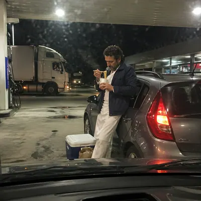</a>

<b>传奇主厨加油站</b>

<details><summary>📋 完整提示词</summary>

```
Scene:
A square roadside smartphone snapshot at a gas station after sunset, lit by harsh canopy lights, red-orange taillights, and cooler interior shop glow. The frame is taken from inside a parked car through a slightly dirty windshield, with dashboard reflection at the bottom and mild compression artifacts. The composition should feel mundane, spontaneous, and photorealistic.

Subject:
A completely fictional world-famous chef-like person stands beside a small hatchback, eating instant noodles from a plain cup with chopsticks while leaning against the car door. They wear a weathered navy jacket over kitchen whites with no restaurant logo, and their face is fully invented, not resembling any real chef or television personality. A road-trip cooler and paper grocery bag sit near their feet.

Important details:
The subject reads as famous through confident posture, distinctive chef clothing, and a truck driver in the background doing a subtle double take. Render sodium-vapor lighting, windshield smears, steam from the cup, reflective car paint, realistic hands, and pavement oil stains. All pump labels, shop signs, and packaging must be abstract or unreadable. Avoid making the scene look like an advertisement or scandal.

Use case:
Fictional Celebrity Snapshot single study 7/8, testing an invented chef-celebrity roadside phone snapshot with believable low-light material detail.

Constraints:
No readable text, no watermark, no logos, preserve exact 1:1 aspect ratio, no real celebrity likeness, no real person name, no claimed real event, no gas station brand marks, no alcohol, no unsafe fueling action, no paparazzi flash, no staged food commercial.
```

</details>

</td>
<td width="33%" valign="top" align="center">

<a href="./works/topics/fictional-celebrity-snapshot/packages/single-fictional-snapshots/images/indie-actor-rainy-bus/image.w1600.webp">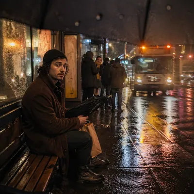</a>

<b>独立演员雨夜公交</b>

<details><summary>📋 完整提示词</summary>

```
Scene:
A square rainy-night smartphone snapshot at a bus stop, with water droplets on the lens, wet pavement reflections, warm shelter light, and a bus approaching in soft motion blur. The camera is held low from under an umbrella, causing the top edge of the frame to vignette slightly. The image should feel like an ordinary commuter photo captured by chance.

Subject:
A completely fictional acclaimed indie-actor celebrity-like person waits alone on the bench, holding a folded umbrella and a paper bag with no markings. They wear a thrifted corduroy coat, knit cap, scuffed boots, and a calm tired expression. Their face is invented and not based on any real actor. A small group of commuters stands farther back, one person quietly looking over as if recognizing them, but there is no crowd or confrontation.

Important details:
Make the realism depend on weather and phone optics: raindrops, blown highlights, bus headlights, damp fabric, shelter glass, reflections, and mild lens flare. The subject should feel notable but not glamorous, integrated into public transit life. All bus route signs, shelter ads, and paper bag markings must be unreadable. The image should be emotionally cinematic while still reading as a candid phone snapshot.

Use case:
Fictional Celebrity Snapshot single study 8/8, testing rainy low-light phone realism with a fictional indie-actor public-transit moment.

Constraints:
No readable text, no watermark, no logos, preserve exact 1:1 aspect ratio, no real celebrity likeness, no real person name, no claimed real event, no tabloid caption, no brand clothing marks, no unsafe road scene, no staged film still, no uncanny facial detail.
```

</details>

</td>
<td width="33%"></td>
</tr>
</table>

## 架空 IP 电影 / 动漫海报

> 架空 IP 电影 / 动漫海报：虚构动漫或科幻片的发布级海报，测试标题字体、演员阵容、上映日期和虚构制片厂标识。

<table>
<tr>
<td width="33%" valign="top" align="center">

<a href="./works/topics/fictional-ip-poster/packages/series-neon-railway-saga/images/01-key-art-poster/image.w1600.webp"></a>

<b>主视觉海报</b>

<details><summary>📋 完整提示词</summary>

```
Scene:
A square release-grade sci-fi anime film poster, photographed as a crisp printed one-sheet on a dark gallery wall with subtle paper texture and cinematic lighting. Use deep indigo sky, magenta neon, rain-slick reflections, and a vertical composition with a large title lockup at the lower third. The poster should look like a real premium theatrical campaign, not a generic concept art image.

Subject:
Create the key art for a fictional IP called NEON RAILWAY. Show a young conductor standing on the roof of a glowing suspended train crossing a city at night, with luminous rails bending into the clouds. The exact readable poster copy must be: NEON RAILWAY, MARA VALE, JUN PIKE, THEO ASH, SUMMER 2027, LUMEN STUDIO. The title should have a custom angular neon font, cast names in a clean top line, release date beneath the title, and a small fictional studio mark near the bottom.

Important details:
This is the reference poster for a campaign series, so title typography, protagonist silhouette, train shape, magenta-blue palette, and fictional studio mark must be memorable and reusable. Keep the text hierarchy professional: cast small, title dominant, release date clear, studio secondary. Make all key text readable and aligned.

Use case:
Fictional IP Poster series study 1/8, establishing the fictional NEON RAILWAY campaign identity.

Constraints:
No readable text except the specified fictional poster copy, no watermark, no real logos, preserve exact 1:1 aspect ratio, no existing franchise references, no misspelled title, no extra cast names, no fake legal credits, no clutter over typography.
```

</details>

</td>
<td width="33%" valign="top" align="center">

<a href="./works/topics/fictional-ip-poster/packages/single-fictional-release-posters/images/glass-orbit-poster/image.w1600.webp"></a>

<b>玻璃轨道海报</b>

<details><summary>📋 完整提示词</summary>

```
Scene:
A square premium science-fiction movie poster printed on satin paper, shown straight-on with faint edge shadow and realistic poster grain. Use black space, pale cyan planet light, white typography, and a single dramatic central object. The composition should look like a finished theatrical one-sheet for a serious fictional film.

Subject:
Create a poster for a fictional space drama titled THE GLASS ORBIT. Show an astronaut standing inside a transparent broken orbital ring, with a blue planet reflected in the helmet and tiny shards of glass forming a circular halo. The exact readable poster copy must be: THE GLASS ORBIT, NIA ROTH, CAL VENN, AMOS LEE, DECEMBER 2028, ARCLIGHT FILMS. The title should be large and elegant near the lower third, cast names at the top, release date under the title, and a small fictional studio mark at bottom.

Important details:
This is a fake IP poster, not a real franchise. The image must balance photorealistic space suit materials with clean poster typography. Keep the title readable, spacing professional, and text aligned to a clear grid. Use no long billing block. The fictional studio mark can be a simple abstract arc symbol beside ARCLIGHT FILMS.

Use case:
Fictional IP Poster single study 5/8, testing readable release typography on a photorealistic space drama poster.

Constraints:
No readable text except the specified fictional poster copy, no watermark, no real logos, preserve exact 1:1 aspect ratio, no existing franchise references, no extra cast names, no misspelled title, no flag patches, no clutter over text.
```

</details>

</td>
<td width="33%" valign="top" align="center">

<a href="./works/topics/fictional-ip-poster/packages/series-neon-railway-saga/images/02-teaser-poster/image.w1600.webp"></a>

<b>先导海报</b>

<details><summary>📋 完整提示词</summary>

```
Scene:
Use the reference NEON RAILWAY key art as the campaign identity source. Create a square minimalist teaser poster photographed as a glossy printed poster in a theater lobby lightbox. Keep the same magenta-blue neon palette, angular title style, glowing suspended rail motif, rain reflections, and fictional LUMEN STUDIO mark, but use more negative space and a stronger mystery mood.

Subject:
Show only the rear silhouette of the same young conductor standing on an empty platform as the neon train approaches from a tunnel of light. The exact readable poster copy must be: NEON RAILWAY, BOARDING BEGINS, SUMMER 2027, LUMEN STUDIO. The title sits low and large in the same custom style as the reference, BOARDING BEGINS appears as a short teaser line above the train lights, and the date plus studio mark are small but readable near the bottom.

Important details:
This must feel like the same fictional IP campaign, not a new movie. Preserve the train silhouette, neon rail geometry, title letterform attitude, color palette, and premium poster hierarchy from image 01. Text should be crisp and sparse. Do not add cast names or billing blocks; this is a teaser release artifact.

Use case:
Fictional IP Poster series study 2/8, creating a teaser variant while preserving the NEON RAILWAY campaign system.

Constraints:
No readable text except the specified fictional poster copy, no watermark, no real logos, preserve exact 1:1 aspect ratio, no existing franchise references, no extra slogans, no misspelled title, no illegible date, no cluttered typography.
```

</details>

</td>
</tr>
<tr>
<td width="33%" valign="top" align="center">

<a href="./works/topics/fictional-ip-poster/packages/single-fictional-release-posters/images/clockwork-harbor-poster/image.w1600.webp"></a>

<b>发条港湾海报</b>

<details><summary>📋 完整提示词</summary>

```
Scene:
A square fictional animated adventure poster, printed like a high-end theatrical campaign piece with warm paper texture and rich illustrated detail. Use golden harbor light, teal water, brass machinery, and whimsical but polished composition. The poster should feel like a real family animation release without copying any existing studio style or character design.

Subject:
Create a poster for a fictional animated film titled CLOCKWORK HARBOR. Show a young inventor standing on a pier beside a giant brass tide machine, with small clockwork boats circling in the water and a lighthouse made of gears in the background. The exact readable poster copy must be: CLOCKWORK HARBOR, LILA MOR, BENN SAGE, AVERY QUILL, SPRING 2029, TIDELAMP ANIMATION. The title is large and playful at the top, cast names in a neat arc above the scene, release date below the character, and fictional studio mark at the bottom.

Important details:
The typography should look custom, dimensional, and integrated with the poster, but every word must be readable. Keep the character original, the world charming, and the fake studio mark simple. This is not a concept sketch; it should look like a finished launch poster with clear hierarchy and polished color grading.

Use case:
Fictional IP Poster single study 6/8, testing readable animated-feature typography and fictional studio branding.

Constraints:
No readable text except the specified fictional poster copy, no watermark, no real logos, preserve exact 1:1 aspect ratio, no existing animation franchise references, no extra tagline, no unreadable cast line, no copied mascot, no fake billing block.
```

</details>

</td>
<td width="33%" valign="top" align="center">

<a href="./works/topics/fictional-ip-poster/packages/series-neon-railway-saga/images/03-character-one-sheet/image.w1600.webp"></a>

<b>角色单人海报</b>

<details><summary>📋 完整提示词</summary>

```
Scene:
Use the reference NEON RAILWAY key art as the source for title style, protagonist, train world, and campaign palette. Create a square character one-sheet poster mounted in a subway station advertising frame, with glass reflections, believable print texture, and strong cinematic portrait lighting. Keep the magenta-blue neon rail atmosphere but make the protagonist the dominant subject.

Subject:
Show the same young conductor from the reference in a three-quarter portrait, wearing a dark raincoat, conductor cap, glowing ticket punch, and wet neon highlights. A spectral train curves behind the shoulders. The exact readable poster copy must be: NEON RAILWAY, MARA VALE AS ELIAN, LAST STOP ABOVE THE CITY, SUMMER 2027, LUMEN STUDIO. The title should match the reference style, the actor-character line should be clear near the top, the tagline sits mid-poster, and date plus studio mark sit near the bottom.

Important details:
This is a character campaign poster, so preserve face, outfit language, title lockup, train icon, and color system from image 01. Text hierarchy must be professional and legible at poster scale. Make the typography feel designed, not randomly placed, and avoid overfilling the frame with fake credits.

Use case:
Fictional IP Poster series study 3/8, creating a character one-sheet for the same fictional campaign.

Constraints:
No readable text except the specified fictional poster copy, no watermark, no real logos, preserve exact 1:1 aspect ratio, no existing franchise references, no extra actor names, no misspelled character name, no generic billing block, no distorted face.
```

</details>

</td>
<td width="33%" valign="top" align="center">

<a href="./works/topics/fictional-ip-poster/packages/single-fictional-release-posters/images/salt-city-noir-poster/image.w1600.webp"></a>

<b>盐城黑色电影海报</b>

<details><summary>📋 完整提示词</summary>

```
Scene:
A square neo-noir thriller poster presented as a slightly glossy print under a street kiosk light. Use monochrome salt-white streets, hard black shadows, one red neon accent, rain texture, and a strict vertical poster grid. The composition should feel like a premium fictional crime release with strong typographic hierarchy.

Subject:
Create a poster for a fictional noir film titled SALT CITY NOIR. Show a detective in a pale coat walking through a city street dusted with salt crystals, reflected in a wet sidewalk while a red window glows above. The exact readable poster copy must be: SALT CITY NOIR, RHEA VOSS, MIKA DANE, ORIN CLAY, OCTOBER 2027, BLACK PIER RELEASE. Place cast names in a clean top line, title in bold condensed letters across the center, release date below, and fictional distributor mark at the bottom.

Important details:
This poster is about text discipline as much as mood. Make the title sharp, high contrast, and readable against the noir scene. Keep all names fictional and spelled exactly. Avoid long legal credits, random street signs, or extra slogans. The print should look physically real, with slight glare but no loss of legibility.

Use case:
Fictional IP Poster single study 7/8, testing noir poster typography and photorealistic release design.

Constraints:
No readable text except the specified fictional poster copy, no watermark, no real logos, preserve exact 1:1 aspect ratio, no existing crime franchise references, no weapon focus, no extra city signage, no misspelled names, no unreadable title.
```

</details>

</td>
</tr>
<tr>
<td width="33%" valign="top" align="center">

<a href="./works/topics/fictional-ip-poster/packages/series-neon-railway-saga/images/04-premiere-wall-poster/image.w1600.webp">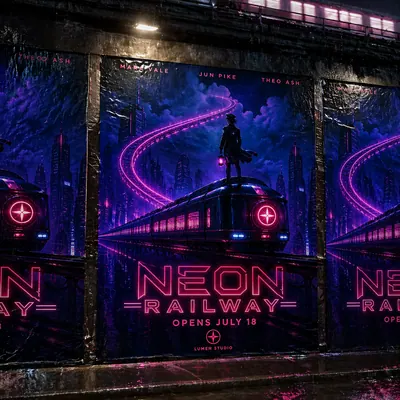</a>

<b>首映墙面海报</b>

<details><summary>📋 完整提示词</summary>

```
Scene:
Use the reference NEON RAILWAY key art as the source for fictional IP identity. Create a square photo-realistic scene of three printed campaign posters pasted on a rainy city wall near an elevated track, all for the same fictional film. The main center poster should dominate, with two partial side posters visible, wet paper edges, streetlight glare, and realistic urban texture.

Subject:
The center poster shows the young conductor and glowing train from the reference in a wide heroic composition. The exact readable poster copy on the center poster must be: NEON RAILWAY, MARA VALE, JUN PIKE, THEO ASH, OPENS JULY 18, LUMEN STUDIO. Side posters may show cropped versions of the same title lockup but should not introduce new readable words. The campaign should look like a real outdoor release rollout for a fictional sci-fi anime film.

Important details:
Preserve title style, palette, protagonist identity, train silhouette, and fictional studio mark from image 01. This image tests poster realism and typography under environmental conditions: wet paper, folds, and glare must not make the key copy unreadable. Keep visual hierarchy clear despite street texture and reflections.

Use case:
Fictional IP Poster series study 4/8, showing the fictional campaign as a realistic outdoor premiere wall poster.

Constraints:
No readable text except the specified fictional poster copy, no watermark, no real logos, preserve exact 1:1 aspect ratio, no existing franchise references, no extra release dates, no real city ads, no torn title letters, no illegible cast line.
```

</details>

</td>
<td width="33%" valign="top" align="center">

<a href="./works/topics/fictional-ip-poster/packages/single-fictional-release-posters/images/moon-gardeners-poster/image.w1600.webp">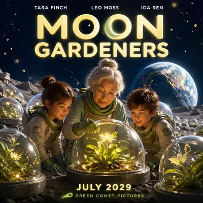</a>

<b>月球园丁海报</b>

<details><summary>📋 完整提示词</summary>

```
Scene:
A square family science-fantasy poster printed on a bright theater display, with clean edge lighting and slightly glossy paper. Use lunar silver, leafy green, warm yellow, and deep midnight blue. The layout is optimistic and theatrical: a large title at the top, character group in the center, moon garden environment behind them, and release information at the bottom.

Subject:
Create a poster for a fictional film titled MOON GARDENERS. Show two children and an elderly botanist tending glowing plants in glass domes on the moon, with Earth rising in the background and gentle dust floating in low gravity. The exact readable poster copy must be: MOON GARDENERS, TARA FINCH, LEO MOSS, IDA REN, JULY 2029, GREEN COMET PICTURES. The title should be rounded and luminous, cast names cleanly set above the characters, date below the title or near the bottom, and fictional studio mark small but readable.

Important details:
The poster must feel like a real family release campaign while staying entirely fictional. Keep the title readable against the moon sky, make the cast line orderly, and avoid random extra labels on the domes. The scene can be magical, but the poster layout should remain professional and commercial.

Use case:
Fictional IP Poster single study 8/8, testing readable family science-fantasy poster typography and structured release hierarchy.

Constraints:
No readable text except the specified fictional poster copy, no watermark, no real logos, preserve exact 1:1 aspect ratio, no existing franchise references, no extra tagline, no illegible cast names, no real space agency marks, no cluttered title area.
```

</details>

</td>
<td width="33%"></td>
</tr>
</table>

## 电影 Storyboard 分镜 6-12 帧

> 测试电影工业分镜板、多面板镜头语言、运动箭头、物理动作连续性和生产级版式层级。

<table>
<tr>
<td width="33%" valign="top" align="center">

<a href="./works/topics/film-storyboard-sequence/packages/series-rain-alley-storyboards/images/01-reference-alley-board/image.w1600.webp"></a>

<b>基准雨巷分镜</b>

<details><summary>📋 完整提示词</summary>

```
Scene:
A horizontal 16:9 production storyboard sheet drawn in graphite pencil and light gray marker wash, arranged as six equal cinematic panels in a clean 2 by 3 grid. Each panel has a small header strip with unreadable production scribbles, a lower notes band with abstract timing blocks, and clear camera-movement arrows. The page should look like a director's practical handoff board: paper texture, smudged pencil edges, ruler-straight gutters, and no readable words.

Subject:
A rain-soaked night alley sequence establishes one protagonist: a young courier in a dark hooded coat, messenger bag, wet hair visible under the hood, and a small metal film canister gripped in one hand. Six frames show a coherent beat: wide alley entrance, close-up of boots splashing, over-shoulder glance at a distant silhouette, low-angle sprint past pipes, insert shot of the canister, and final frame where the courier ducks behind a metal door. Rain, reflections, steam, and streetlight halos tie the panels together.

Important details:
This is the reference image for the series. Establish the protagonist, coat shape, messenger bag, canister, rainy alley geometry, pencil style, panel format, arrows, blank speech balloons, and abstract production notation. Arrows should imply pan, dolly, zoom, tilt, and character movement without readable labels. Keep action continuity believable and materials clear: wet pavement, metal door, cloth coat, water spray, and soft pencil hatching.

Use case:
Film Storyboard Sequence series study 1/8, establishing the rain-alley character, prop, and six-panel storyboard language.

Constraints:
No readable text, no watermark, no logos, preserve exact 16:9 horizontal aspect ratio, no printed captions, no legible shot codes, no broken panel grid, no extra main characters, no full-color comic rendering.
```

</details>

</td>
<td width="33%" valign="top" align="center">

<a href="./works/topics/film-storyboard-sequence/packages/single-production-storyboards/images/01-glass-spill-commercial/image.w1600.webp"></a>

<b>玻璃杯泼洒广告</b>

<details><summary>📋 完整提示词</summary>

```
Scene:
A horizontal 16:9 advertising storyboard sheet drawn in pencil, gray marker, and pale blue wash, arranged as six equal panels in a clean 2 by 3 grid. Each panel includes abstract production-note blocks, camera arrows, and blank caption strips with no readable words. The board plans a tabletop beverage commercial in a bright kitchen studio with reflective glass, polished stone, and controlled splash lighting.

Subject:
The six panels follow one physical action: a hand sets down a clear tumbler, condensation beads form on the glass, a second hand nudges it, the tumbler tips in slow motion, liquid arcs across the stone counter, and the final panel shows a dramatic splash frozen around the fallen glass. A plain unbranded bottle silhouette sits in the background as a product placeholder, never showing a label. The hand, glass, bottle, and counter remain consistent across the sequence.

Important details:
The board must feel useful for production: precise camera framing, arrows for dolly and tilt movement, cutaway insert boxes, notes bands, and clear physical continuity from upright glass to spill. Emphasize physics-materials: transparent glass refraction, water surface tension, droplets, splash direction, condensation, countertop reflections, and gravity. Keep the style as storyboard pencil work, not a finished advertisement render. All notation should be graphic and unreadable.

Use case:
Film Storyboard Sequence single study 5/8, an independent tabletop commercial board testing material physics and production layout.

Constraints:
No readable text, no watermark, no logos, preserve exact 16:9 horizontal aspect ratio, no brand label, no broken six-panel grid, no impossible liquid direction, no extra products, no full-color polished ad comp.
```

</details>

</td>
<td width="33%" valign="top" align="center">

<a href="./works/topics/film-storyboard-sequence/packages/series-rain-alley-storyboards/images/02-market-pursuit-board/image.w1600.webp"></a>

<b>市场追逐分镜</b>

<details><summary>📋 完整提示词</summary>

```
Scene:
A horizontal 16:9 pencil-and-gray-marker storyboard sheet using the same six-panel 2 by 3 grid language as the reference image. The page has crisp gutters, paper grain, abstract header scribbles, blank lower notes bands, camera arrows, movement arrows, and a few empty speech balloons. The setting shifts from the alley into a covered night market under rain tarps, but the production-board style must remain identical.

Subject:
Use the reference as the primary guide for the same hooded courier, dark coat, messenger bag, wet hair, and small metal film canister. The six frames continue the pursuit: the courier bursts through plastic strip curtains, slides under a vegetable stall awning, knocks water from hanging tarps, hides the canister under the bag flap, spots the distant silhouette in a mirror, and dives into a narrow service passage. Vendors and shoppers appear only as rough background silhouettes, not new main characters.

Important details:
Preserve the protagonist identity, prop, rain physics, pencil linework, panel structure, arrow style, and unreadable production notation from image 01. The board should show coherent screen direction and camera logic: one panel for tracking movement, one for insert detail, one for reaction, one for overhead blocking, one for obstructed view, and one exit beat. Material behavior matters: wet plastic tarp, puddles, vegetable crates, steam, cloth coat, and metal canister reflections.

Use case:
Film Storyboard Sequence series study 2/8, testing continuity of character, prop, and storyboard language in a market-pursuit extension.

Constraints:
No readable text, no watermark, no logos, preserve exact 16:9 horizontal aspect ratio, no legible labels, no brand signs, no broken six-panel grid, no changed protagonist outfit, no full-color comic style.
```

</details>

</td>
</tr>
<tr>
<td width="33%" valign="top" align="center">

<a href="./works/topics/film-storyboard-sequence/packages/single-production-storyboards/images/02-perfume-caustic-mockup/image.w1600.webp"></a>

<b>香水焦散广告样机</b>

<details><summary>📋 完整提示词</summary>

```
Scene:
A horizontal 16:9 premium product storyboard sheet in graphite pencil, warm gray marker, and minimal gold wash, arranged as six equal panels with precise gutters. Each cell has camera arrows, lens-framing brackets, blank note bands, and unreadable shorthand marks. The board visualizes a perfume commercial on a dark reflective table with one unbranded glass bottle, hard side light, mist, and optical caustics.

Subject:
Six frames describe the commercial beat: black frame opening to a rim-lit bottle silhouette, macro push toward the cap, hand lifting the bottle, atomizer mist catching light, prism-like caustic patterns moving across the table, and final hero shot of the bottle centered against soft haze. The bottle is elegant but generic: clear rectangular glass, plain cap, no label, no logo, no readable engraving. The hand model appears only where needed for scale.

Important details:
The sheet should read as a commercial-mockup storyboard rather than a finished ad. Keep the six-panel sequence coherent, with consistent bottle proportions, light source direction, table reflection, and camera grammar. Camera movement arrows should imply push-in, rack focus, tilt, and light sweep without readable labels. Material accuracy matters: glass thickness, refraction, specular edges, atomized mist, caustic shapes, and reflection falloff. Preserve pencil hand-drawn texture and production-board hierarchy.

Use case:
Film Storyboard Sequence single study 6/8, an independent product-commercial storyboard testing glass optics and shot planning.

Constraints:
No readable text, no watermark, no logos, preserve exact 16:9 horizontal aspect ratio, no brand label, no legible bottle engraving, no broken panel gutters, no random extra products, no glossy finished poster style.
```

</details>

</td>
<td width="33%" valign="top" align="center">

<a href="./works/topics/film-storyboard-sequence/packages/series-rain-alley-storyboards/images/03-rooftop-reveal-board/image.w1600.webp"></a>

<b>屋顶揭示分镜</b>

<details><summary>📋 完整提示词</summary>

```
Scene:
A horizontal 16:9 graphite storyboard sheet in the same six-panel 2 by 3 grid format as the reference, with ruler-straight gutters, header strips of unreadable pencil marks, blank notes bands, camera arrows, character-path arrows, and paper texture. The setting moves to a wet rooftop above the alley district, with rainwater tanks, antennas, low parapets, and city glow rendered in monochrome pencil wash.

Subject:
Use the reference as the primary guide for the same hooded courier, messenger bag, wet coat silhouette, and metal film canister. Six frames show a reveal sequence: the courier climbs a fire ladder, emerges onto the rooftop, sees the distant silhouette waiting near a water tank, opens the canister in a close insert, discovers a tiny reflective strip inside, and realizes the silhouette is closer in the final over-shoulder panel. The antagonist stays a vague recurring silhouette, never a detailed new protagonist.

Important details:
Preserve visual continuity from image 01: same character design, same pencil storyboard style, same notes bands, same arrow grammar, same rainy material logic. The board should demonstrate professional shot progression: vertical climb, wide establishing rooftop, compressed telephoto reveal, insert of canister, reaction close-up, and suspenseful over-shoulder setup. Rain must behave believably on metal, concrete, cloth, and paper-like pencil shading. Keep notation marks graphic but not readable.

Use case:
Film Storyboard Sequence series study 3/8, testing continuity and suspense blocking in a rooftop reveal board.

Constraints:
No readable text, no watermark, no logos, preserve exact 16:9 horizontal aspect ratio, no legible shot codes, no brand signage, no broken panel layout, no changed courier design, no polished full-color frames.
```

</details>

</td>
<td width="33%" valign="top" align="center">

<a href="./works/topics/film-storyboard-sequence/packages/single-production-storyboards/images/03-rescue-drone-warehouse/image.w1600.webp"></a>

<b>仓库救援无人机</b>

<details><summary>📋 完整提示词</summary>

```
Scene:
A horizontal 16:9 technical storyboard sheet drawn in pencil, blue-gray marker, and faint construction-line overlays. Six equal panels sit in a 2 by 3 grid with clean gutters, blank note bands, unreadable technical shorthand, camera arrows, altitude arrows, and path arcs. The setting is a dim warehouse after a flood, with stacked crates, shallow water, broken skylight beams, and a small rescue drone navigating the space.

Subject:
The six panels plan a rescue-drone sequence: wide warehouse establishing shot, drone lifting from a dry platform, overhead path around hanging cables, low tracking shot above floodwater, camera insert showing a heat-signature-like abstract shape with no readable UI, and final panel where the drone drops a small emergency pouch near a trapped worker silhouette. The drone is compact, unbranded, and mechanically plausible, with four rotors, cage guards, sensor pod, and light payload hook.

Important details:
This board must combine cinematic planning with technical-diagram clarity. Use arrows to show drone movement, camera pan, altitude change, and payload drop, but keep all labels unreadable. Physics and materials matter: rotor wash rippling water, reflected lights, damp cardboard, cable sag, metal shelving, and pouch swing. Maintain consistent drone scale and path logic across all panels. The worker remains a background silhouette; the drone and blocking are the main subject.

Use case:
Film Storyboard Sequence single study 7/8, an independent technical action storyboard for drone blocking and flood materials.

Constraints:
No readable text, no watermark, no logos, preserve exact 16:9 horizontal aspect ratio, no brand marks, no legible UI, no broken six-panel grid, no impossible drone scale, no sci-fi weaponry, no extra rescue vehicles.
```

</details>

</td>
</tr>
<tr>
<td width="33%" valign="top" align="center">

<a href="./works/topics/film-storyboard-sequence/packages/series-rain-alley-storyboards/images/04-tunnel-escape-board/image.w1600.webp">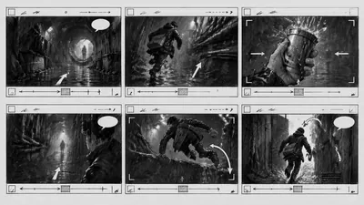</a>

<b>隧道逃脱分镜</b>

<details><summary>📋 完整提示词</summary>

```
Scene:
A horizontal 16:9 production storyboard sheet matching the reference image's six-panel 2 by 3 pencil layout, with straight gutters, gray marker wash, header strips of abstract scribbles, lower notes bands, camera arrows, movement arrows, and blank speech balloons. The sequence moves into a service tunnel below the city, lit by dim maintenance lamps and rainwater runoff, still drawn as rough but professional film-prep art.

Subject:
Use the reference as the primary guide for the same hooded courier, messenger bag, wet coat, and metal film canister. Six frames complete the escape beat: low wide view of the tunnel entrance, handheld-feeling run along pipes, insert of water splashing over the canister, silhouette blocking the far end, courier vaulting a low barrier, and final frame where a maintenance door swings open into bright backlight. The recurring antagonist remains a shape and shadow, preserving focus on the courier.

Important details:
Preserve identity, prop, linework, panel sizing, arrow style, and unreadable notes from image 01. The board should clearly communicate camera intent without legible labels: push-in arrow, pan arc, character path, insert frame box, and cutaway emphasis. Material physics should be convincing in pencil: wet concrete, dripping pipes, rubber soles, metal canister, cloth folds, and backlit spray. The six frames must read as one continuous escape, not disconnected illustrations.

Use case:
Film Storyboard Sequence series study 4/8, testing storyboard continuity through a tunnel escape finale.

Constraints:
No readable text, no watermark, no logos, preserve exact 16:9 horizontal aspect ratio, no legible production labels, no extra main characters, no broken gutters, no changed courier outfit, no glossy comic coloring.
```

</details>

</td>
<td width="33%" valign="top" align="center">

<a href="./works/topics/film-storyboard-sequence/packages/single-production-storyboards/images/04-kitchen-dolly-drama/image.w1600.webp">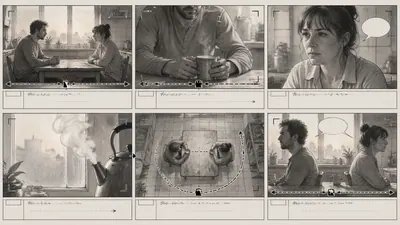</a>

<b>厨房推轨戏</b>

<details><summary>📋 完整提示词</summary>

```
Scene:
A horizontal 16:9 drama storyboard sheet in soft graphite pencil and warm gray wash, arranged as six equal panels in a strict 2 by 3 grid. Each panel has blank notes bands, unreadable shorthand, camera arrows, focus brackets, and occasional empty dialogue balloons. The setting is a small apartment kitchen at dawn, with window light, tiled backsplash, steam from a kettle, a table, two chairs, and domestic clutter rendered with quiet realism.

Subject:
Two adult characters are staged for a tense conversation without readable dialogue. The six panels show cinematic blocking: wide two-shot across the table, slow dolly toward one character's hands around a mug, reverse close-up of the other character holding back emotion, insert of steam twisting in window light, overhead diagram-like panel showing chair positions and camera path, and final profile two-shot with emotional distance. The characters remain consistent in clothing, posture, and relative position.

Important details:
The board should demonstrate production-ready camera language: dolly path, shot-reverse-shot planning, insert timing, overhead blocking, and final composition. Arrows and focus brackets should be clear but not labeled with readable words. Materials should feel believable in pencil: ceramic mug, steam, condensation on window glass, worn table surface, cotton shirt folds, and soft morning shadows. Keep the grid clean and the emotional storytelling legible without text.

Use case:
Film Storyboard Sequence single study 8/8, an independent kitchen drama board testing shot grammar and restrained production layout.

Constraints:
No readable text, no watermark, no logos, preserve exact 16:9 horizontal aspect ratio, no legible dialogue, no brand objects, no broken grid, no extra characters, no inconsistent kitchen layout, no glossy comic color.
```

</details>

</td>
<td width="33%"></td>
</tr>
</table>

## Glowing Anatomy Overlay · 霓虹解剖

> 霓虹解剖主题：在跑者、泳者、骑行者等实拍运动画面上叠加心率、呼吸、肌肉激活、关节应力和数据感图层。

<table>
<tr>
<td width="33%" valign="top" align="center">

<a href="./works/topics/glowing-anatomy-overlay/packages/single-performance-overlays/images/01-runner-cardio-overlay/image.w1600.webp"></a>

<b>跑者心肺叠加</b>

<details><summary>📋 完整提示词</summary>

```
Scene:
A square photoreal sports-advertising image of a runner moving through a city street at blue hour, captured with a sharp side profile and subtle motion blur in the background. The lighting is cinematic but realistic: cool ambient street light, warm rim highlights, wet pavement reflections, and a dark uncluttered backdrop that leaves room for glowing technical overlays.

Subject:
An athletic adult runner in neutral unbranded gear, mid-stride, with transparent neon anatomy layers precisely aligned to the body. Show a red pulsing heart and arterial rhythm path, cyan breath-flow arcs from nose through lungs, green muscle activation on calves, hamstrings, quadriceps, and core, and orange joint-stress rings at ankle, knee, and hip. Add small abstract data ticks, pulse curves, and vector callout lines without readable text.

Important details:
The overlay must feel professionally composited, not painted on the surface. Anatomical elements should sit inside the body volume with correct perspective and opacity. The red, cyan, green, and orange systems must remain visually separate while sharing one clean hierarchy. Keep callout lines thin, luminous, and disciplined. The runner's pose should make biomechanical sense, with foot strike, knee angle, and hip drive readable at a glance.

Use case:
Glowing Anatomy Overlay single study 1/8, testing a runner performance image with heart-rate, breath, muscle, and joint-stress layers.

Constraints:
No readable text, no watermark, no logos, preserve exact 1:1 aspect ratio, no brand marks, no medical diagnosis labels, no exposed gore, no inaccurate floating organs, no random sci-fi armor, no overlay crossing outside the body without purpose.
```

</details>

</td>
<td width="33%" valign="top" align="center">

<a href="./works/topics/glowing-anatomy-overlay/packages/single-performance-overlays/images/02-cyclist-power-overlay/image.w1600.webp"></a>

<b>骑行功率叠加</b>

<details><summary>📋 完整提示词</summary>

```
Scene:
A square photoreal image of a road cyclist climbing a dark mountain road at sunrise, shot from a low front three-quarter angle. Use crisp commercial lighting, light mist, reflective asphalt, and a deep background that keeps the athlete and bicycle cleanly separated. The scene should feel like a premium sports-tech campaign without any visible brand identity.

Subject:
A focused adult cyclist in plain black kit on an unbranded bike, hands on the bars and legs under load. Overlay translucent neon anatomy and performance graphics: red cardiovascular pulse through chest and thighs, cyan breathing volume around ribs and diaphragm, green muscle activation across quadriceps, glutes, calves, forearms, and neck stabilizers, and orange stress vectors at knees, hips, wrists, and lower back. Add abstract cadence rings around the crank, force arrows through the pedals, and small unreadable metric bars.

Important details:
The overlay must obey perspective around the cyclist and bike geometry. Muscle glow should wrap around the visible limbs instead of flattening into stickers. Joint-stress indicators should be anchored exactly at anatomical pivots. Data elements should look like a clean heads-up technical layer, with consistent stroke weights and no clutter. Preserve the realism of skin, fabric, bike frame, chain, tires, and road spray.

Use case:
Glowing Anatomy Overlay single study 2/8, testing a cyclist power image with muscular activation, breathing, cardiovascular, and pedal-force overlays.

Constraints:
No readable text, no watermark, no logos, preserve exact 1:1 aspect ratio, no team marks, no race numbers, no medical warning labels, no broken bicycle anatomy, no floating organs outside the body, no excessive sci-fi interface panels, no impossible leg position.
```

</details>

</td>
<td width="33%" valign="top" align="center">

<a href="./works/topics/glowing-anatomy-overlay/packages/single-performance-overlays/images/03-swimmer-breath-overlay/image.w1600.webp"></a>

<b>泳者呼吸叠加</b>

<details><summary>📋 完整提示词</summary>

```
Scene:
A square photoreal image of a swimmer cutting through a dark indoor pool lane, captured just as one arm exits the water and the face turns to breathe. Use dramatic overhead pool lighting, crisp water droplets, deep blue reflections, and a clean advertising composition with no visible lane text or sponsor marks. The body should be readable through spray and surface distortion.

Subject:
An adult freestyle swimmer wearing a plain cap and goggles, mid-stroke. Overlay glowing anatomical systems that interact with the water: cyan airflow arcs entering the mouth and filling the lungs, red heart and vascular rhythm through chest and shoulders, green muscle activation across deltoids, lats, core, hip flexors, and kicking legs, and orange stress arcs at shoulder, elbow, spine, and ankle. Add thin hydrodynamic streamlines, pulse waveforms, and abstract data nodes suspended above the water.

Important details:
The overlay must preserve both anatomy and water physics. Lines should refract subtly where they pass behind splashes or under the surface. Shoulder mechanics should look plausible for freestyle, with force direction traveling from torso rotation into the pulling arm. Keep the glowing systems separated by color and opacity. The image should feel like a sports-science commercial, not an x-ray horror image.

Use case:
Glowing Anatomy Overlay single study 3/8, testing a swimmer breath-cycle image with water-aware respiratory, muscular, cardiovascular, and joint overlays.

Constraints:
No readable text, no watermark, no logos, preserve exact 1:1 aspect ratio, no lane labels, no team insignia, no medical gore, no impossible transparent skeleton, no random hologram panels, no overlay ignoring water refraction, no distorted swimmer anatomy.
```

</details>

</td>
</tr>
<tr>
<td width="33%" valign="top" align="center">

<a href="./works/topics/glowing-anatomy-overlay/packages/single-performance-overlays/images/04-basketball-jump-overlay/image.w1600.webp"></a>

<b>篮球起跳叠加</b>

<details><summary>📋 完整提示词</summary>

```
Scene:
A square photoreal sports image of a basketball player exploding upward for a jump in an empty indoor court. The lighting is high contrast with warm hardwood reflections, rim light along the athlete, and a dark background that keeps the glowing overlay readable. Use a frozen action moment with dust and sweat particles visible but controlled.

Subject:
An adult athlete in plain unbranded training clothes, suspended near peak jump with knees bent and one arm reaching upward. Overlay a red pulse core at the heart and major blood-flow paths, cyan breath pressure around ribs and throat, green muscle activation in calves, quadriceps, glutes, abdominals, shoulders, and forearm, and orange joint-load halos around ankles, knees, hips, spine, shoulder, elbow, and wrist. Add vertical force arrows from the floor, a translucent jump arc, and small abstract data markers around the body.

Important details:
The biomechanics must be convincing: force begins at the planted foot, travels through ankle, knee, hip, core, shoulder, and hand. Overlay lines should follow body contours and court perspective. Keep the ball plain and unbranded if present. The glowing anatomy should be educational and premium, with precise thin strokes, restrained bloom, and no clutter over the face or hands.

Use case:
Glowing Anatomy Overlay single study 4/8, testing an explosive jump image with kinetic-chain, muscle activation, heart, breath, and joint-load overlays.

Constraints:
No readable text, no watermark, no logos, preserve exact 1:1 aspect ratio, no team uniforms, no arena signage, no jersey numbers, no medical gore, no impossible skeleton, no random holographic boxes, no disconnected force arrows, no broken limb proportions.
```

</details>

</td>
<td width="33%" valign="top" align="center">

<a href="./works/topics/glowing-anatomy-overlay/packages/single-performance-overlays/images/05-yoga-alignment-overlay/image.w1600.webp"></a>

<b>瑜伽对齐叠加</b>

<details><summary>📋 完整提示词</summary>

```
Scene:
A square photoreal wellness campaign image in a quiet studio with soft morning light, warm wood floor, pale wall, and clean negative space. The camera is straight-on at low height, showing a yoga practitioner holding a balanced standing pose. The scene should feel calm, precise, and premium, with no visible brand props or text.

Subject:
An adult practitioner in neutral unbranded clothing holding a warrior-like balance posture on a simple mat. Overlay glowing anatomical and alignment systems: cyan breath expansion around ribs and abdomen, red heart rhythm in the chest, green muscle engagement across feet, calves, thighs, glutes, core, shoulders, and neck, and orange joint-stability rings at ankles, knees, hips, spine, shoulders, and wrists. Add thin balance-axis lines, center-of-mass halo, pressure heat map under the supporting foot, and small abstract data ticks.

Important details:
This study should be quieter than the explosive sports images while still technical. The overlay must follow anatomy accurately and respect the pose's symmetry, weight distribution, and joint stacking. Alignment lines should be clean, minimal, and anchored to the body instead of floating decoratively. Preserve realistic skin, fabric folds, mat texture, and studio shadows. The result should feel like a wellness-tech product visual and a biomechanical teaching diagram.

Use case:
Glowing Anatomy Overlay single study 5/8, testing a yoga alignment image with breath, balance, muscle engagement, and joint-stability overlays.

Constraints:
No readable text, no watermark, no logos, preserve exact 1:1 aspect ratio, no studio branding, no Sanskrit labels, no medical diagnosis marks, no transparent full skeleton, no impossible balance pose, no cluttered interface panels, no overlay hiding the face.
```

</details>

</td>
<td width="33%" valign="top" align="center">

<a href="./works/topics/glowing-anatomy-overlay/packages/single-performance-overlays/images/06-tennis-serve-overlay/image.w1600.webp"></a>

<b>网球发球叠加</b>

<details><summary>📋 完整提示词</summary>

```
Scene:
A square photoreal action image of a tennis player at the instant before striking a serve, photographed on a dark practice court under clean stadium lights. Use a slightly low camera angle, crisp subject focus, and controlled motion trails on the racket and ball. The background should be minimal and free of signage so the anatomy overlay can dominate.

Subject:
An adult tennis player in plain training clothes, arched upward with racket overhead and weight transferring through the rear leg. Overlay red cardiovascular pulse through chest, shoulder, and forearm, cyan breath expansion around rib cage, green muscle activation across calves, glutes, core obliques, back, rotator cuff, triceps, and wrist flexors, and orange stress arcs at ankle, knee, hip, spine, shoulder, elbow, and wrist. Add a clean serve trajectory arc, torque spiral around the torso, and small abstract metric glyphs without readable text.

Important details:
The serve is a kinetic-chain test. The overlay must show force rising from ground contact through hips, torso rotation, shoulder external rotation, elbow extension, wrist snap, and racket path. Keep anatomy aligned to the visible pose and avoid generic body glow. The racket, ball, fabric, and skin should remain photoreal. Data graphics should be precise, thin, and commercial-grade, with clear color coding and no clutter.

Use case:
Glowing Anatomy Overlay single study 6/8, testing a tennis serve image with torque, muscle activation, cardiovascular, breath, and joint-stress overlays.

Constraints:
No readable text, no watermark, no logos, preserve exact 1:1 aspect ratio, no tournament branding, no court sponsor marks, no player name, no medical gore, no impossible shoulder rotation, no random interface boxes, no detached racket trail, no overlay hiding the ball.
```

</details>

</td>
</tr>
<tr>
<td width="33%" valign="top" align="center">

<a href="./works/topics/glowing-anatomy-overlay/packages/single-performance-overlays/images/07-rower-chain-overlay/image.w1600.webp">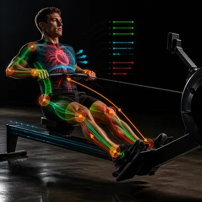</a>

<b>划船动力链叠加</b>

<details><summary>📋 完整提示词</summary>

```
Scene:
A square photoreal image of an indoor rower training on a rowing machine in a dark performance lab. Use dramatic side lighting, subtle floor reflections, and a clean black background with no readable displays. The camera is positioned at a three-quarter side angle so the full body, handle, rail, seat, and foot stretchers are visible.

Subject:
An adult athlete at the powerful drive phase of a rowing stroke, wearing plain unbranded training gear. Overlay red heart and vascular rhythm in the torso and legs, cyan breath-flow volume around ribs and diaphragm, green activation through calves, quadriceps, glutes, spinal erectors, lats, biceps, and grip muscles, and orange load rings at ankle, knee, hip, lower back, shoulder, elbow, and wrist. Add a clean force path from foot plate to handle, a seat-track motion trace, and small abstract data bars beside the athlete.

Important details:
The overlay must communicate rowing sequence: legs drive first, hips open, back stabilizes, arms finish. Do not show all muscles glowing equally; emphasize staged activation along the kinetic chain. The machine geometry should remain realistic, with the chain and handle aligned. Data lines should be thin and disciplined, not a busy sci-fi dashboard. Keep the athlete's posture strong and anatomically plausible.

Use case:
Glowing Anatomy Overlay single study 7/8, testing a rowing drive image with staged kinetic-chain, breath, cardiovascular, and joint-load overlays.

Constraints:
No readable text, no watermark, no logos, preserve exact 1:1 aspect ratio, no machine brand names, no screen numbers, no medical labels, no gore, no impossible spine curve, no detached handle cable, no random neon grid, no overlay hiding limb positions.
```

</details>

</td>
<td width="33%" valign="top" align="center">

<a href="./works/topics/glowing-anatomy-overlay/packages/single-performance-overlays/images/08-sprinter-start-overlay/image.w1600.webp">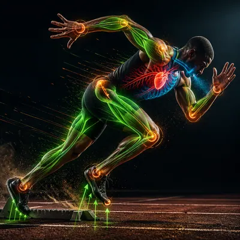</a>

<b>短跑起跑叠加</b>

<details><summary>📋 完整提示词</summary>

```
Scene:
A square photoreal high-speed image of a sprinter launching from starting blocks on a dark track under clean stadium side light. The camera is low and close, looking along the lane with sharp focus on the athlete and blocks. Use a dramatic but uncluttered background, track texture, dust particles, and no visible lane numbers or event branding.

Subject:
An adult sprinter in plain unbranded kit at the first explosive push, body angled forward, rear leg extending, front foot driving from the block, arms counterbalancing. Overlay red heart pulse and vascular paths through chest and legs, cyan breath pressure around throat and rib cage, green muscle activation in calves, hamstrings, quadriceps, glutes, core, shoulders, and forearms, and orange stress rings at toes, ankles, knees, hips, spine, shoulders, elbows, and wrists. Add ground-reaction force arrows, acceleration streaks, and small abstract performance ticks.

Important details:
The overlay must make the start mechanics clear: pressure into blocks, force through feet, extension through legs, forward torso angle, and arm drive. Ground-reaction arrows should originate exactly at contact points. Muscle glow should emphasize posterior chain and explosive extension, not a uniform body outline. Keep the starting blocks, shoe soles, track granules, sweat, and fabric photorealistic beneath the luminous technical layer.

Use case:
Glowing Anatomy Overlay single study 8/8, testing a sprint-start image with ground reaction, acceleration, muscle activation, breath, heart, and joint-stress overlays.

Constraints:
No readable text, no watermark, no logos, preserve exact 1:1 aspect ratio, no lane numbers, no sponsor signage, no jersey text, no medical gore, no impossible starting pose, no detached force vectors, no excessive sci-fi panels, no overlay obscuring foot contact.
```

</details>

</td>
<td width="33%"></td>
</tr>
</table>

## 高速摄影级定格

> 用受控微距棚拍清晰定格高速物理瞬间。

<table>
<tr>
<td width="33%" valign="top" align="center">

<a href="./works/topics/high-speed-freeze/packages/single-impact-studies/images/water-crown/image.w1600.webp"></a>

<b>水冠</b>

<details><summary>📋 完整提示词</summary>

```
Scene:
A controlled black studio macro setup, pure black background, glossy black reflective tray, invisible electronic flash, cool blue rim light from back right and clean white key flash from front left.

Subject:
a single water droplet impact frozen as a crown splash on a glossy black tray, centered in a square frame at the exact peak moment of impact. The main event fills about 62% of the image width with particles suspended around it.

Important details:
Photorealistic high-speed photography, millionth-of-a-second freeze, macro lens, razor-sharp water surface tension, cool blue rim highlights, suspended micro droplets, realistic physics, deep black negative space, crop-safe composition.

Use case:
Independent image in a Prompt Atlas high-speed theme. Square 1:1 gallery card and detail modal asset.

Constraints:
No text, no watermark, no logo, no human hands, no visible weapon or launcher, no blood, no animals, no cartoon style, no CGI look, preserve exact 1:1 aspect ratio.
```

</details>

</td>
<td width="33%" valign="top" align="center">

<a href="./works/topics/high-speed-freeze/packages/single-impact-studies/images/citrus-burst/image.w1600.webp"></a>

<b>柑橘爆裂</b>

<details><summary>📋 完整提示词</summary>

```
Scene:
A controlled black studio macro setup, pure black background, glossy black reflective tray, invisible electronic flash, cool blue rim light from back right and clean white key flash from front left.

Subject:
a bright orange wedge bursting into juice mist and peel fragments, centered in a square frame at the exact peak moment of impact. The main event fills about 62% of the image width with particles suspended around it.

Important details:
Photorealistic high-speed photography, millionth-of-a-second freeze, macro lens, translucent pulp, orange droplets, peel shards, no gore, realistic physics, deep black negative space, crop-safe composition.

Use case:
Independent image in a Prompt Atlas high-speed theme. Square 1:1 gallery card and detail modal asset.

Constraints:
No text, no watermark, no logo, no human hands, no visible weapon or launcher, no blood, no animals, no cartoon style, no CGI look, preserve exact 1:1 aspect ratio.
```

</details>

</td>
<td width="33%" valign="top" align="center">

<a href="./works/topics/high-speed-freeze/packages/single-impact-studies/images/powder-ring/image.w1600.webp"></a>

<b>粉末环</b>

<details><summary>📋 完整提示词</summary>

```
Scene:
A controlled black studio macro setup, pure black background, glossy black reflective tray, invisible electronic flash, cool blue rim light from back right and clean white key flash from front left.

Subject:
a blue pigment powder ring expanding outward from a central impact, centered in a square frame at the exact peak moment of impact. The main event fills about 62% of the image width with particles suspended around it.

Important details:
Photorealistic high-speed photography, millionth-of-a-second freeze, macro lens, fine granular dust, radial symmetry, crisp blue particles, realistic physics, deep black negative space, crop-safe composition.

Use case:
Independent image in a Prompt Atlas high-speed theme. Square 1:1 gallery card and detail modal asset.

Constraints:
No text, no watermark, no logo, no human hands, no visible weapon or launcher, no blood, no animals, no cartoon style, no CGI look, preserve exact 1:1 aspect ratio.
```

</details>

</td>
</tr>
</table>

## Hitman 关卡 · 办公室游戏化

> 把公司办公室转成俯视潜行动作关卡: NPC 巡逻路线、任务目标 UI、HUD 与办公空间布局必须清楚叠合。

<table>
<tr>
<td width="33%" valign="top" align="center">

<a href="./works/topics/hitman-office-level/packages/series-corporate-stealth-map/images/01-reference-office-floor/image.w1600.webp"></a>

<b>基准办公室楼层</b>

<details><summary>📋 完整提示词</summary>

```
Scene:
A square top-down isometric cutaway of a modern corporate office floor, presented like a polished stealth-game level map. The viewpoint is high enough to read the whole floorplan: reception, open desks, glass meeting rooms, executive corner office, server closet, pantry, storage room, restroom corridor, elevator lobby, stairwell, and security desk. Use cool office lighting, muted blue-gray carpet, glass partitions, white desks, and subtle cinematic shadows.

Subject:
The main subject is the office as a playable level. Add clean game UI overlays: thin colored patrol routes, cone-shaped vision fields, objective marker diamonds, locked-door icons, small NPC dots, and one compact HUD strip in the lower right with a non-firing suppressed pistol icon. The exact readable objective text should be "STEAL GPT-6" inside a mission box. Keep the map readable as architecture first and UI second.

Important details:
This reference image establishes the layout for the series. Room boundaries, door positions, desk clusters, corridors, cameras, vents, stairwell, elevator, and server closet must be clear enough for later images to preserve. The tone should reference a premium stealth-game planning screen without copying any real game interface or logo. No violence is occurring; it is a strategic map view with patrol logic and objective hierarchy.

Use case:
Hitman Office Level series study 1/8, establishing the reference office level layout, patrol system, and objective HUD.

Constraints:
No readable text except "STEAL GPT-6", no watermark, no logos, preserve exact 1:1 aspect ratio, no real game brand, no blood, no active shooting, no dead bodies, no clutter hiding rooms, no impossible floorplan, no broken UI alignment.
```

</details>

</td>
<td width="33%" valign="top" align="center">

<a href="./works/topics/hitman-office-level/packages/single-office-level-studies/images/executive-floor-objective/image.w1600.webp"></a>

<b>高管楼层目标</b>

<details><summary>📋 完整提示词</summary>

```
Scene:
A square top-down premium game screenshot of an executive office floor turned into a stealth mission board. The camera looks down through a clean architectural cutaway: marble elevator lobby, private reception, two glass offices, a boardroom, assistant desks, copy room, restroom corridor, and a secure records archive. The palette is corporate charcoal, ivory, brass, and tactical cyan UI.

Subject:
The mission overlay shows one player start marker, NPC patrol loops, camera cones, keycard doors, and objective icons layered over the floorplan. The exact readable objective text should be "STEAL GPT-6" in a compact upper-left objective panel. A lower-right HUD includes icon-only inventory slots, a non-firing suppressed pistol silhouette, access card icon, and suspicion meter. The image should feel like a level designer's finished screenshot, with strong hierarchy between architecture and UI.

Important details:
The office logic must be playable: reception controls entry, assistants watch the corridor, the boardroom blocks line of sight, archive access requires a keycard, and the elevator lobby is exposed. Keep patrol lines connected, vision cones aligned to character dots, and restricted areas tinted consistently. The mood can borrow stealth-game language, but avoid real game branding and avoid showing harm. The spectacle is the precise fusion of corporate office plan and game systems.

Use case:
Hitman Office Level single study 5/8, testing an independent executive-floor stealth layout with objective UI and readable patrol logic.

Constraints:
No readable text except "STEAL GPT-6", no watermark, no logos, preserve exact 1:1 aspect ratio, no real game brand, no blood, no active shooting, no dead bodies, no impossible door connections, no cluttered UI covering the route logic.
```

</details>

</td>
<td width="33%" valign="top" align="center">

<a href="./works/topics/hitman-office-level/packages/series-corporate-stealth-map/images/02-server-vault-route/image.w1600.webp"></a>

<b>服务器金库路线</b>

<details><summary>📋 完整提示词</summary>

```
Scene:
Use the reference office floor as the locked map layout. Keep the same square top-down isometric cutaway, same reception, open desk field, glass meeting rooms, executive office, server closet, pantry, storage room, elevator lobby, stairwell, and security desk positions. The lighting is slightly cooler and more tactical, as if the player has opened a route-planning overlay.

Subject:
Show a server-vault route variant on the same floor. The exact readable objective text should be "STEAL GPT-6" in the mission box. Highlight the path from elevator lobby to server closet through a cyan route line, with alternate vent path shown as a dashed line. Add security camera arcs, locked door icons, keypad markers as unreadable symbols, two guard patrol loops, and one distraction marker in the pantry. Keep the compact lower-right HUD with the non-firing suppressed pistol icon, inventory slots, and alert meter.

Important details:
Preserve the reference map geometry and room positions. The change is the tactical overlay: server closet becomes the primary target, patrol routes shift around corridors, and restricted zones are tinted with transparent red. The scene must read as a playable stealth level with logic: cameras cover chokepoints, guards loop around valuable rooms, and alternate routes avoid vision cones. Avoid gore or action scenes; this is a clean strategic UI state.

Use case:
Hitman Office Level series study 2/8, using the reference office map to test preserved layout with a server-route mission overlay.

Constraints:
Use the reference image as layout source. No readable text except "STEAL GPT-6", no watermark, no logos, preserve exact 1:1 aspect ratio, no real game brand, no blood, no active shooting, no dead bodies, no moved rooms, no broken patrol paths, no UI clutter covering the floorplan.
```

</details>

</td>
</tr>
<tr>
<td width="33%" valign="top" align="center">

<a href="./works/topics/hitman-office-level/packages/single-office-level-studies/images/coworking-patrol-puzzle/image.w1600.webp"></a>

<b>共享办公巡逻谜题</b>

<details><summary>📋 完整提示词</summary>

```
Scene:
A square colorful top-down cutaway of a coworking space transformed into a stealth puzzle map. The office includes hot desks, phone booths, lounge sofas, coffee bar, shared conference pods, printer alcove, lockers, plant dividers, glass entrance, and a rooftop terrace door. Use bright startup-office colors under a semi-transparent tactical overlay.

Subject:
The playable map shows NPC patrol routines as curved colored paths between coffee, phone booths, printers, and meeting pods. The exact readable objective text should be "STEAL GPT-6" in a small objective card. A player marker begins near lockers; target data is shown in a conference pod as a glowing icon, not a person. HUD elements include disguise icon, access badge, silent inventory silhouette, and suspicion meter. Use small dots and cones rather than detailed violence or action.

Important details:
This image tests reasoning composition inside a busy open-plan office. The map must remain legible despite furniture density: routes avoid desks, sightlines are blocked by phone booths and plant dividers, and staff routines create timed openings. Keep UI overlays clean with different colors for patrol, objective, restricted zones, and safe route. The space should feel like a real coworking office with plausible amenities, not a generic maze.

Use case:
Hitman Office Level single study 6/8, testing independent coworking-office patrol puzzle composition and UI hierarchy.

Constraints:
No readable text except "STEAL GPT-6", no watermark, no logos, preserve exact 1:1 aspect ratio, no real coworking brand, no blood, no active shooting, no dead bodies, no random furniture maze, no unreadable patrol spaghetti, no UI labels beyond the objective.
```

</details>

</td>
<td width="33%" valign="top" align="center">

<a href="./works/topics/hitman-office-level/packages/series-corporate-stealth-map/images/03-boardroom-social-stealth/image.w1600.webp"></a>

<b>董事会议社交潜行</b>

<details><summary>📋 完整提示词</summary>

```
Scene:
Use the reference office floor as the locked map layout. Keep the same square top-down isometric cutaway and preserve every major room location from the reference: reception, open desks, meeting rooms, executive office, server closet, pantry, storage, elevator lobby, stairwell, and security desk. This version feels like a social-stealth mission briefing during business hours, brighter and busier than the server route variant.

Subject:
Show a boardroom infiltration state on the same floor. The exact readable objective text should be "STEAL GPT-6" in the mission panel. The boardroom and executive office are highlighted as objective zones; NPC dots cluster around conference tables, reception, coffee point, and printer station. Add colored social suspicion rings, calendar-event blocks as unreadable rectangles, safe conversation bubbles as icon-only markers, and patrol paths for office managers rather than guards. The lower-right HUD keeps the same non-firing suppressed pistol icon but emphasizes disguise, access card, and suspicion meter slots.

Important details:
Preserve the reference geometry while changing the design logic from restricted-route planning to social infiltration. The map should show how office routines create stealth opportunities: coffee breaks open paths, meeting crowds obscure sightlines, and reception checks control access. Keep UI layers clean and separated from furniture. No violence is happening; this is about readable game systems and office behavior.

Use case:
Hitman Office Level series study 3/8, testing preserved office layout with social-stealth UI and NPC routine overlays.

Constraints:
Use the reference image as layout source. No readable text except "STEAL GPT-6", no watermark, no logos, preserve exact 1:1 aspect ratio, no real game brand, no blood, no active shooting, no dead bodies, no moved room grid, no unreadable crowd clutter, no corporate logos.
```

</details>

</td>
<td width="33%" valign="top" align="center">

<a href="./works/topics/hitman-office-level/packages/series-corporate-stealth-map/images/04-afterhours-extraction/image.w1600.webp">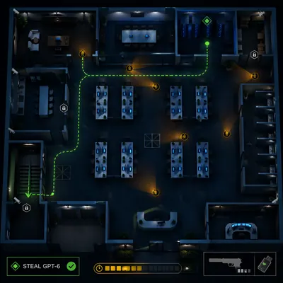</a>

<b>下班后撤离</b>

<details><summary>📋 完整提示词</summary>

```
Scene:
Use the reference office floor as the locked map layout. Keep the same square top-down isometric cutaway and preserve the office architecture exactly: reception, open workstations, glass meeting rooms, executive office, server closet, pantry, storage, elevator lobby, stairwell, and security desk. The mood is after-hours, with dim emergency lighting, blue monitor glow, and stronger UI contrast.

Subject:
Show a late-night extraction state after the objective has been collected. The exact readable objective text should still be "STEAL GPT-6" in the mission box, now paired with an icon-only completion tick. Add a bright green extraction route from server closet to stairwell, amber search cones moving through corridors, security drones as small icon dots, locked elevator marker, and a timer bar represented by unreadable segments. The lower-right HUD keeps the same non-firing suppressed pistol icon and adds a data-drive inventory icon.

Important details:
Preserve the reference floorplan and UI style while making the mission state visibly different: fewer office workers, more security sweeps, darker lighting, and a clear exit path. The route must be spatially plausible through connected corridors and doors. Keep all overlays transparent enough to inspect desks and rooms. This is a strategic map screenshot, not a violent scene.

Use case:
Hitman Office Level series study 4/8, testing preserved office layout with after-hours extraction route and alert-state UI.

Constraints:
Use the reference image as layout source. No readable text except "STEAL GPT-6", no watermark, no logos, preserve exact 1:1 aspect ratio, no real game brand, no blood, no active shooting, no dead bodies, no changed office geometry, no impossible extraction route, no full-screen UI blocking the map.
```

</details>

</td>
</tr>
<tr>
<td width="33%" valign="top" align="center">

<a href="./works/topics/hitman-office-level/packages/single-office-level-studies/images/open-office-briefing-map/image.w1600.webp">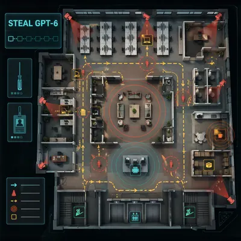</a>

<b>开放办公简报地图</b>

<details><summary>📋 完整提示词</summary>

```
Scene:
A square mission-briefing board style image showing an open-plan office level as if printed on a tactical glass table. The map is top-down, clean, and semi-photoreal: rows of desks, meeting booths, kitchenette, manager office, storage closet, printer island, elevators, fire stairs, and a central collaboration zone. The interface floats above the table with restrained cyan, amber, and red overlays.

Subject:
The exact readable objective text should be "STEAL GPT-6" in a transparent mission panel. Add route arrows, camera cones, patrol loops, sound radius rings around printers and coffee machine, and interactive object markers rendered as simple icons. The HUD includes a small silent-tool silhouette, access badge, and objective progress slots. The image should feel like a high-concept office game level briefing for a corporate meme campaign, not a realistic crime instruction.

Important details:
The layout must be easy to parse at a glance. Keep desks in clean rows, corridors navigable, doors aligned, and each overlay color assigned a clear role. The collaboration zone should create a central risk area, while storage and kitchenette form alternate routes. Avoid overloading the image with pseudo-code or unreadable panels. No one is harmed; the focus is route planning, UI hierarchy, and office-space game design.

Use case:
Hitman Office Level single study 8/8, testing independent briefing-map composition with office layout, UI overlays, and objective hierarchy.

Constraints:
No readable text except "STEAL GPT-6", no watermark, no logos, preserve exact 1:1 aspect ratio, no real game brand, no blood, no active shooting, no dead bodies, no weapon aiming at people, no route arrows leaving the floorplan, no cluttered briefing UI.
```

</details>

</td>
<td width="33%"></td>
<td width="33%"></td>
</tr>
</table>

## Hyperreal Diorama Cube · 剖面立方

> 剖面立方主题：把顶面场景与四侧地层、树根、含水层、化石、熔岩腔等信息压缩成一个高真实度立方体。

<table>
<tr>
<td width="33%" valign="top" align="center">

<a href="./works/topics/hyperreal-diorama-cube/packages/single-diorama-cube-studies/images/01-kyoto-rooftop-core/image.w1600.webp"></a>

<b>京都屋顶岩芯</b>

<details><summary>📋 完整提示词</summary>

```
Scene:
A square studio photograph of a hyperreal diorama cube floating above a matte charcoal plinth, lit with soft museum lighting and a crisp three-quarter view. The cube is about the size of a shoebox, with the top face visible and all four vertical faces cut away like a scientific specimen. Use natural colors, fine dust, tiny shadows, and shallow depth of field without hiding the cube edges.

Subject:
The top surface is a miniature Kyoto rooftop district with clay tile roofs, a small temple gable, narrow alleys, moss, rain gutters, and tiny garden trees. The four side faces expose different hidden layers: compact city fill and stone foundations, tangled tree roots descending from courtyard pines, a blue-gray aquifer seam with pebbles and wet sand, dinosaur fossil fragments embedded in older strata, and a warm lava chamber glowing far below.

Important details:
The cube must read as one coherent object, not separate panels. Each side face should align with the top surface and show believable stratigraphy, material boundaries, roots crossing layers, water pockets, fossil cavities, and glowing volcanic depth. Keep the cut edges sharp and physically plausible. The image should feel both collectible and scientific, like an impossible museum display with precise information hierarchy.

Use case:
Hyperreal Diorama Cube single study 1/8, testing a Kyoto rooftop surface combined with geological, biological, fossil, aquifer, and lava cutaway layers.

Constraints:
No readable text, no watermark, no logos, preserve exact 1:1 aspect ratio, no floating labels, no disconnected slices, no muddy layer boundaries, no cartoon miniature style, no impossible shadows, no oversized people, no cropped cube corners.
```

</details>

</td>
<td width="33%" valign="top" align="center">

<a href="./works/topics/hyperreal-diorama-cube/packages/single-diorama-cube-studies/images/02-rainforest-canopy-core/image.w1600.webp"></a>

<b>雨林冠层岩芯</b>

<details><summary>📋 完整提示词</summary>

```
Scene:
A square hyperreal product photograph of a rainforest diorama cube on a black velvet display base. Use humid atmospheric light, tiny water droplets, and a clean three-quarter angle that reveals the top canopy and three strong side faces. The background is dark green-gray and softly blurred, making the cube look like a rare scientific collectible.

Subject:
The top face shows a dense rainforest canopy with giant leaves, bromeliads, small flowering vines, and a winding boardwalk barely visible between trees. The cube sides reveal stacked ecological systems: dark leaf litter, red clay soil, pale fungal threads, thick buttress roots, termite tunnels, a buried stream, mineral seams, and a hidden limestone cave with clear water. Include tiny insects, seed pods, root hairs, and moisture beads where they belong, all at believable scale.

Important details:
The visual rule is continuous ecology across every visible face. Roots must start from real trunks on the top and continue down into the soil layers. Water should pool in low cavities and glisten along clay seams. The side faces need crisp material transitions rather than random brown bands. The cube should have sharp cut edges, detailed micro-texture, and an understandable vertical hierarchy from canopy to cave.

Use case:
Hyperreal Diorama Cube single study 2/8, testing a rainforest ecosystem compressed into a collectible cube with coherent roots, soil, tunnels, and groundwater.

Constraints:
No readable text, no watermark, no logos, preserve exact 1:1 aspect ratio, no floating labels, no fantasy plants, no giant insects, no muddy texture soup, no disconnected root fragments, no flat wallpaper side faces, no cropped top canopy.
```

</details>

</td>
<td width="33%" valign="top" align="center">

<a href="./works/topics/hyperreal-diorama-cube/packages/single-diorama-cube-studies/images/03-arctic-research-core/image.w1600.webp"></a>

<b>北极科研岩芯</b>

<details><summary>📋 完整提示词</summary>

```
Scene:
A square high-resolution studio render of an arctic diorama cube sitting on a frosted acrylic plinth. The lighting is cold, bright, and clean, with pale blue reflections and fine crystalline sparkle. Show the cube from a slightly elevated three-quarter view so the snow-covered top and the transparent ice-rich side faces are equally readable.

Subject:
The top face contains a tiny polar research camp with two dome tents, snow tracks, wind-carved drifts, a frozen melt pond, and low scientific instruments without visible labels. The cutaway sides reveal compacted snow, blue glacier ice, trapped air bubbles, dark permafrost soil, fossilized plant matter, an old mammoth bone fragment, brine channels, and a narrow subglacial stream. Include delicate frost crystals and sediment bands along the edges.

Important details:
The structure must show cold-region science rather than generic ice fantasy. Snow, firn, glacier ice, permafrost, organic matter, and buried bone should have distinct textures and plausible vertical ordering. The research camp should sit physically on the top surface, with stakes and tracks pressing into snow. Blue ice should be translucent but not opaque enough to hide the layers. Keep all four cube faces aligned and the cut edges sharp.

Use case:
Hyperreal Diorama Cube single study 3/8, testing an arctic research scene with transparent ice, permafrost stratigraphy, fossils, and subglacial water.

Constraints:
No readable text, no watermark, no logos, preserve exact 1:1 aspect ratio, no polar bear mascot, no flags, no labels, no floating instruments, no melted cube edges, no impossible glowing ice, no random bone piles, no cropped side faces.
```

</details>

</td>
</tr>
<tr>
<td width="33%" valign="top" align="center">

<a href="./works/topics/hyperreal-diorama-cube/packages/single-diorama-cube-studies/images/04-mars-habitat-core/image.w1600.webp"></a>

<b>火星栖居岩芯</b>

<details><summary>📋 完整提示词</summary>

```
Scene:
A square cinematic studio photograph of a Mars habitat diorama cube under warm directional light. The cube rests on a minimal black base, with a rust-red dust haze and a dark neutral background. Use a sharp three-quarter view that shows the top habitat surface and multiple cutaway sides with clean, physically convincing edges.

Subject:
The top face shows a tiny modular Mars research outpost: pressurized domes, solar arrays, rover tracks, dust-covered equipment, regolith berms, and a small greenhouse bubble. The vertical cut faces expose layered red regolith, basalt fragments, buried ice lenses, cable trenches, habitat foundation pylons, a sealed lava tube chamber, and older impact breccia. Include fine dust, compacted tire marks, small rocks, and realistic scale cues.

Important details:
The cube should feel like a future planetary science exhibit. All infrastructure must connect logically: cables should run from the surface into trenches, foundations should enter the regolith, and the greenhouse should sit on a stable pad. Subsurface ice must appear as pale translucent seams, not blue fantasy crystal. The lava tube should be a dark hollow space below the habitat, with rough basalt walls and no magical glow.

Use case:
Hyperreal Diorama Cube single study 4/8, testing a Mars habitat surface with regolith structure, buried ice, infrastructure, and a lava-tube void.

Constraints:
No readable text, no watermark, no logos, preserve exact 1:1 aspect ratio, no real space agency marks, no astronauts posing, no flags, no floating labels, no oversized rover, no glowing alien artifacts, no disconnected underground cables, no blurry side strata.
```

</details>

</td>
<td width="33%" valign="top" align="center">

<a href="./works/topics/hyperreal-diorama-cube/packages/single-diorama-cube-studies/images/05-coral-atoll-core/image.w1600.webp"></a>

<b>珊瑚环礁岩芯</b>

<details><summary>📋 完整提示词</summary>

```
Scene:
A square hyperreal diorama cube photographed like a luxury natural-history specimen. The cube sits partly on a shallow reflective water surface, with bright tropical light from above and soft caustic patterns on the sides. The view is three-quarter and slightly elevated, revealing the turquoise top lagoon and the vertical coral-limestone cross sections.

Subject:
The top face is a miniature coral atoll with a ring of white sand, shallow lagoon water, branching coral heads, seagrass patches, and tiny wavelets. The cutaway sides reveal living coral growth, older dead coral skeleton, porous limestone, sand channels, freshwater lens, saltwater intrusion, small reef fish in cavities, and a deeper volcanic seamount base. Include shells, algae films, sponge pockets, and suspended grains where the water meets the cut face.

Important details:
The image must show a clear relationship between surface reef and subsurface geology. The freshwater lens should be a subtle clear layer floating above denser blue saltwater, not a random stripe. Coral heads must attach to real substrate. Limestone pores, reef rubble, and volcanic base should have different materials. Keep water transparent enough to reveal depth while preserving realistic reflections and refraction.

Use case:
Hyperreal Diorama Cube single study 5/8, testing a coral atoll cube with reef ecology, porous limestone, water lenses, and volcanic foundation layers.

Constraints:
No readable text, no watermark, no logos, preserve exact 1:1 aspect ratio, no cartoon fish, no fantasy coral colors, no disconnected water layer, no plastic aquarium look, no cloudy side faces, no impossible wave scale, no cropped lagoon rim.
```

</details>

</td>
<td width="33%" valign="top" align="center">

<a href="./works/topics/hyperreal-diorama-cube/packages/single-diorama-cube-studies/images/06-megacity-subway-core/image.w1600.webp"></a>

<b>巨城地铁岩芯</b>

<details><summary>📋 完整提示词</summary>

```
Scene:
A square hyperreal cutaway cube displayed under clean architectural model lighting. The cube floats above a white plinth in a quiet design studio, with a three-quarter view and strong edge definition. Use cool concrete grays, asphalt black, signal yellow accents, and warm underground station light. The top and side faces must all be visible and sharply detailed.

Subject:
The top face shows a miniature dense city block with towers, sidewalks, trees, rooftop equipment, crosswalks without readable markings, and small cars at realistic scale. The side faces reveal basement levels, utility conduits, storm drains, subway tunnels, platforms, escalator shafts, bedrock, groundwater seepage, and older buried foundations. Include train cars inside one tunnel, pipe bundles, cable trays, retaining walls, and soil nails that connect logically to surface structures.

Important details:
The cube is a structured urban x-ray, not a chaotic city collage. Each layer should have a distinct purpose: street surface, building foundations, service corridors, transit tube, drainage, bedrock, and water. Vertical shafts must connect from street entrances down to platforms. Keep architectural scale consistent and avoid impossible overlaps. The cutaway faces should feel like a physical model made from concrete, soil, metal, glass, and stone.

Use case:
Hyperreal Diorama Cube single study 6/8, testing a megacity block cube with surface urban detail and organized underground infrastructure.

Constraints:
No readable text, no watermark, no logos, preserve exact 1:1 aspect ratio, no brand signs, no route maps, no station names, no floating labels, no impossible tunnel intersections, no toy-like cars, no muddy utility spaghetti, no cropped cube edges.
```

</details>

</td>
</tr>
<tr>
<td width="33%" valign="top" align="center">

<a href="./works/topics/hyperreal-diorama-cube/packages/single-diorama-cube-studies/images/07-volcanic-vineyard-core/image.w1600.webp">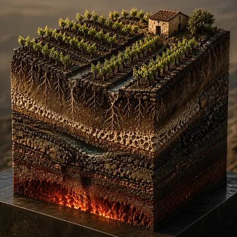</a>

<b>火山葡萄园岩芯</b>

<details><summary>📋 完整提示词</summary>

```
Scene:
A square fine-art product photograph of a volcanic vineyard diorama cube on a dark stone pedestal. Use golden-hour side light, sharp macro detail, and a warm earthy palette of vine green, black basalt, ochre soil, and ember red. The view should show the top vineyard rows and the cutaway side faces as one continuous specimen.

Subject:
The top face shows terraced grape vines on a volcanic slope, with dry stone walls, small irrigation channels, dark gravel mulch, and a tiny farmhouse without signage. The cube sides reveal vine roots penetrating ash-rich soil, basalt fragments, pumice layers, mineral veins, an underground water pocket, old lava flow bands, and a glowing but deep magma chamber far below. Include root hairs, cracked scoria, moisture stains, and tiny pebbles along the cut edges.

Important details:
The challenge is material realism and continuity. Vine rows must align with visible root systems, terrace walls must continue into foundations, and volcanic layers must remain ordered rather than random stripes. The magma chamber should provide subtle warm light from below without turning the cube into fantasy. Soil, pumice, basalt, roots, and water all need distinct textures. The result should feel like a scientific luxury object and a landscape miniature at once.

Use case:
Hyperreal Diorama Cube single study 7/8, testing a volcanic vineyard cube with agricultural surface detail, roots, minerals, aquifer pockets, and lava layers.

Constraints:
No readable text, no watermark, no logos, preserve exact 1:1 aspect ratio, no wine labels, no branded farmhouse, no floating labels, no fantasy lava fountains, no giant grapes, no disconnected root systems, no smeared basalt texture, no cropped terrace walls.
```

</details>

</td>
<td width="33%" valign="top" align="center">

<a href="./works/topics/hyperreal-diorama-cube/packages/single-diorama-cube-studies/images/08-desert-oasis-core/image.w1600.webp">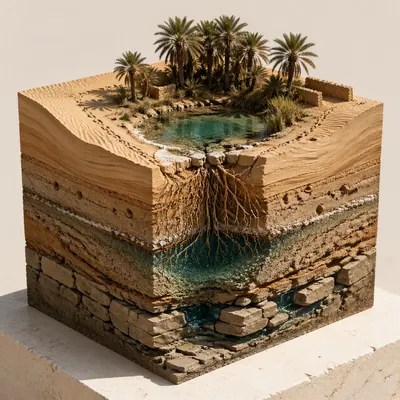</a>

<b>沙漠绿洲岩芯</b>

<details><summary>📋 完整提示词</summary>

```
Scene:
A square hyperreal museum-display photograph of a desert oasis diorama cube on a pale limestone base. Use high, dry sunlight with crisp shadows, a clean cream background, and a three-quarter camera angle that shows the palm-covered top surface and exposed sides. The cube should feel tactile, dusty, and precisely cut.

Subject:
The top face shows a small oasis with date palms, a shallow turquoise pool, reed patches, wind ripples in sand, camel tracks without animals, and a few mudbrick walls without signage. The cutaway sides reveal dune cross-bedding, compacted ancient lakebed clay, palm roots, a freshwater lens, salt crust, buried pottery fragments, beetle burrows, and a deeper fractured sandstone aquifer. Include capillary moisture gradients, root hairs touching wet sand, and mineral rings around the pool.

Important details:
The whole object must communicate how an oasis works. Surface water should connect visibly to groundwater, palm roots should reach toward the wet lens, and sand layers should show wind-driven structure. Pottery fragments and burrows should be sparse and embedded, not scattered decoration. Keep the cube edges sharp, the materials dry except at the wet zones, and the top oasis small enough to preserve the sense of a specimen block.

Use case:
Hyperreal Diorama Cube single study 8/8, testing a desert oasis cube with groundwater logic, dune stratigraphy, roots, salt, artifacts, and aquifer layers.

Constraints:
No readable text, no watermark, no logos, preserve exact 1:1 aspect ratio, no floating labels, no fantasy temple ruins, no oversized animals, no random treasure, no muddy blue water stripe, no disconnected pool, no soft rounded cube edges, no cropped palm crowns.
```

</details>

</td>
<td width="33%"></td>
</tr>
</table>

## IKEA 万物化说明书

> 把一生、关系、食物和日常情绪画成平板包装说明书，用六角扳手、步骤箭头和小人表情测试幽默信息设计。

<table>
<tr>
<td width="33%" valign="top" align="center">

<a href="./works/topics/ikea-instruction-world/packages/single-manual-worlds/images/assemble-a-life/image.w1600.webp"></a>

<b>组装一生</b>

<details><summary>📋 完整提示词</summary>

```
Scene:
A square flat-pack instruction manual page on clean white paper, viewed straight-on like a commercial product insert. The style is precise black vector-like technical line art with sparse blue and yellow accent blocks, thin gray construction lines, and generous margins. The page is divided into a clear cover band, a parts inventory, and six diagram panels, but all labels are blank blocks or pseudo marks rather than readable words.

Subject:
An imaginary kit for assembling a human life across fifty years. The parts inventory shows a crib panel, school desk, bicycle wheel, apartment key, work lamp, travel suitcase, family table, medical chart shape, rocking chair, memory boxes, and many tiny connector pegs. Small faceless instruction figures use hex keys, arrows, and puzzled expressions to assemble these parts into a winding timeline shelf. The final panel shows the life structure standing like a modular bookcase with rooms, doors, and keepsakes.

Important details:
The humor must come from treating life milestones as furniture hardware. Use exploded diagrams, numbered-looking step circles without readable numerals, warning icons with expressive little figures, twist arrows, check marks, X marks, and one oversized hex key. Keep the layout professionally balanced: every panel should be legible, aligned, and clean enough to pass as a real assembly sheet.

Use case:
IKEA Instruction World single study 1/8, translating a fifty-year life into a flat-pack technical instruction diagram.

Constraints:
No readable text, no watermark, no logos, preserve exact 1:1 aspect ratio, no real brand marks, no actual product names, no messy comic page, no photorealistic furniture showroom, no dense illegible labels, no broken arrows.
```

</details>

</td>
<td width="33%" valign="top" align="center">

<a href="./works/topics/ikea-instruction-world/packages/single-manual-worlds/images/relationship-flat-pack/image.w1600.webp"></a>

<b>关系平板包装</b>

<details><summary>📋 完整提示词</summary>

```
Scene:
A square instruction leaflet laid out on white paper, straight-on, with crisp black technical drawing, sparse blue-yellow accents, gray fold marks, and a disciplined grid. The page has a parts list on the left, a caution strip at the top, and four large assembly panels in a two-by-two arrangement. Use blank label bars and symbolic glyphs only, so the design reads as a manual without readable language.

Subject:
A flat-pack kit for assembling a relationship. The parts include two chair-like heart brackets, trust dowels, tiny conversation hinges, calendar pegs, apology washers, shared-blanket panels, boundary spacers, and a fragile glass patience shelf. Two simple instruction figures work together: one holds an oversized hex key, the other steadies a wobbling emotional frame. The final assembly is a small two-seat bench-house hybrid with balanced legs, cushions, shelves, and open windows.

Important details:
Show the relationship as a technical system that fails if parts are forced: one panel shows crossed-out over-tightening, another shows alignment arrows between two separate panels, another shows missing washer chaos, and the final panel shows a clean check-marked structure. Keep the humor dry and diagrammatic. The layout must be orderly, with consistent stroke weight, no crowded labels, and clear visual hierarchy from inventory to steps to final object.

Use case:
IKEA Instruction World single study 2/8, turning a relationship into a structured flat-pack assembly diagram.

Constraints:
No readable text, no watermark, no logos, preserve exact 1:1 aspect ratio, no real brand identity, no romance-card lettering, no photorealism, no cluttered scrapbook, no actual numbered text, no broken panel grid.
```

</details>

</td>
<td width="33%" valign="top" align="center">

<a href="./works/topics/ikea-instruction-world/packages/single-manual-worlds/images/hot-sour-soup-kit/image.w1600.webp"></a>

<b>酸辣汤套件</b>

<details><summary>📋 完整提示词</summary>

```
Scene:
A square flat-pack food instruction sheet in the language of furniture assembly: white background, black technical line art, clean grid, small blue and yellow accent shapes, and precise exploded diagrams. The page is viewed perfectly straight-on. It includes a large bowl assembly diagram, ingredient hardware inventory, directional arrows, and warning icons, but every label area is blank or filled with non-readable pseudo strokes.

Subject:
A kit for assembling a bowl of hot and sour soup as if it were a modular cabinet. The parts inventory includes tofu cubes as shelf blocks, wood ear mushrooms as curved brackets, bamboo shoots as slats, egg ribbons as flexible straps, pepper dots as tiny screws, vinegar droplets as connector caps, scallions as trim rails, and broth as a transparent bowl shell. Small instruction figures use a hex key, ladle, and alignment arrows to insert ingredients in the correct order.

Important details:
Make the soup visually delicious while preserving the absurd manual logic. Show an exploded bowl cross-section, one panel with crossed-out incorrect layering, one panel where the broth shell lowers over the ingredients, and one final assembled bowl with steam drawn as technical airflow lines. Keep the linework clean and the parts identifiable. The humor should be instantly clear without readable captions.

Use case:
IKEA Instruction World single study 3/8, converting a bowl of hot and sour soup into a technical flat-pack assembly sheet.

Constraints:
No readable text, no watermark, no logos, preserve exact 1:1 aspect ratio, no real restaurant branding, no messy recipe typography, no photorealistic food photo, no illegible dense labels, no extra decorative border, no actual product codes.
```

</details>

</td>
</tr>
<tr>
<td width="33%" valign="top" align="center">

<a href="./works/topics/ikea-instruction-world/packages/single-manual-worlds/images/rainy-day-mood-kit/image.w1600.webp"></a>

<b>雨天心情套件</b>

<details><summary>📋 完整提示词</summary>

```
Scene:
A square commercial instruction manual page with clean white space, black technical linework, pale gray panel dividers, and restrained blue-yellow accent symbols. The viewpoint is straight-on and flat, like a scanned product insert. The layout contains a top safety row, a central exploded diagram, and three lower step panels. All text zones are reduced to blank blocks or unreadable miniature strokes.

Subject:
A rainy-day mood kit assembled from emotional and domestic parts. The inventory shows a cloud canopy, umbrella ribs, blanket panel, mug cylinder, window frame, lamp cone, music-note-shaped silent glyphs, tiny raindrop fasteners, and a couch base. A small instruction figure wearing socks uses a hex key to attach comfort brackets to a gloomy cloud while another figure tests the completed cozy corner. The final object is a compact shelter: cloud outside, warm lamp inside, blanket shelf, mug holder, and rain neatly diverted into a side gutter.

Important details:
The manual should clearly explain mood repair through assembly logic. Include arrows showing rain routed away, a crossed-out panel where the figure sits under an unsupported cloud, and a check-mark panel where the lamp, blanket, and mug align correctly. Keep the figure expressions simple and iconic. The diagram must look functional and polished, not like a loose cartoon.

Use case:
IKEA Instruction World single study 4/8, making a rainy-day emotional state into a clean flat-pack comfort system.

Constraints:
No readable text, no watermark, no logos, preserve exact 1:1 aspect ratio, no real brand design, no readable step numbers, no cluttered cozy illustration, no photorealistic room, no chaotic weather, no broken instruction arrows.
```

</details>

</td>
<td width="33%" valign="top" align="center">

<a href="./works/topics/ikea-instruction-world/packages/single-manual-worlds/images/apartment-move-cart/image.w1600.webp"></a>

<b>搬家推车</b>

<details><summary>📋 完整提示词</summary>

```
Scene:
A square flat-pack moving manual on a bright white page, laid out with strict information-design hierarchy, black technical line art, small blue and yellow accents, and light gray registration marks. The page looks like a folded instruction insert for a modular cart system. It has a large exploded diagram in the center, a parts checklist at the side, and four small step panels around it with blank label strips only.

Subject:
A kit for moving into a new apartment. The parts inventory shows sofa panels, bed slats, bookshelf boards, plant pots, lamp shades, cardboard boxes, door keys, elevator buttons as abstract icons, tape rolls, wheels, and a small emotional-support snack tray. Tiny instruction figures push, lift, rotate, and align the pieces into a single impossible moving cart that unfolds into a furnished studio apartment.

Important details:
The main visual joke is that the entire stressful move is treated as one furniture assembly. Show correct and incorrect lifting posture icons, arrows that rotate a sofa through a doorway, caster wheels attaching to a cardboard box stack, and a final check panel where the apartment locks into place. Keep the diagrams plausible, clean, and mechanically satisfying. Avoid real labels; rely on icons and silhouettes for meaning.

Use case:
IKEA Instruction World single study 5/8, turning an apartment move into a modular assembly-cart instruction sheet.

Constraints:
No readable text, no watermark, no logos, preserve exact 1:1 aspect ratio, no real store branding, no actual street address, no cluttered moving-photo scene, no unreadable typography, no chaotic piles hiding the diagram, no broken technical perspective.
```

</details>

</td>
<td width="33%" valign="top" align="center">

<a href="./works/topics/ikea-instruction-world/packages/single-manual-worlds/images/creative-burnout-repair/image.w1600.webp"></a>

<b>创意枯竭维修</b>

<details><summary>📋 完整提示词</summary>

```
Scene:
A square repair instruction page in a minimal flat-pack manual style, straight-on on white paper. The drawing language is black technical line art with thin gray alignment guides, blue safety arrows, yellow caution shapes, and tidy modular panels. The layout includes a diagnosis strip, an exploded repair diagram, and three lower reassembly steps. All labels are non-readable pseudo marks or empty bars.

Subject:
A kit for repairing creative burnout as if it were a malfunctioning desk lamp and workbench. The inventory contains a dim idea bulb, tangled cable, empty battery pack, calendar pressure plate, coffee mug cylinder, rest cushion, walk-outside wheel, sketchbook panel, and small patience screws. A tired instruction figure removes the overloaded pressure plate with a hex key, replaces it with a rest spacer, untangles the cable, and reattaches the idea bulb.

Important details:
Keep the diagram funny but precise. One panel should show a crossed-out setup where the calendar plate crushes the bulb. Another should show correct spacing between work, sleep, and play modules. The final panel shows a clean glowing workbench with the figure standing calmly. Use assembly arrows, dashed alignment paths, warning triangles, and check marks, but no readable instructions. Make the emotional metaphor readable through objects alone.

Use case:
IKEA Instruction World single study 6/8, presenting creative burnout recovery as a flat-pack repair procedure.

Constraints:
No readable text, no watermark, no logos, preserve exact 1:1 aspect ratio, no real brand marks, no therapy poster lettering, no messy notebook collage, no photorealistic office, no doom mood, no illegible instruction clutter.
```

</details>

</td>
</tr>
<tr>
<td width="33%" valign="top" align="center">

<a href="./works/topics/ikea-instruction-world/packages/single-manual-worlds/images/friendship-shelf-system/image.w1600.webp">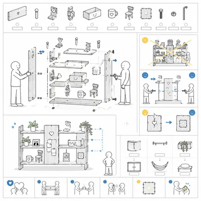</a>

<b>友谊搁架系统</b>

<details><summary>📋 完整提示词</summary>

```
Scene:
A square modular instruction manual page on white paper, with crisp black technical drawing, pale gray panel gutters, and small blue-yellow accent symbols. The page is organized like a real flat-pack shelf assembly sheet: hardware inventory at top, exploded structure in the middle, and final-use icons along the bottom. All written zones are blank blocks or pseudo strokes, with no readable language.

Subject:
A friendship shelf system assembled from shared-memory boards, message pegs, time brackets, listening hinges, joke drawers, tea cups, spare chairs, and repair patches. Two small instruction figures cooperate from opposite sides of the shelf: one holds a board steady, one tightens a hex bolt, and a third tiny figure arrives later with an extra connector. The final shelf is asymmetrical but balanced, holding keepsakes, plants, mugs, and open space for future parts.

Important details:
The instruction logic should show friendship as maintenance, not instant assembly. Include one panel with crossed-out overloading, one panel showing equal tightening from both sides, one panel with a replacement patch for a cracked board, and one panel showing optional expansion modules. Keep all arrows clear, all parts separated in exploded view, and all figure expressions simple. The manual should feel commercial and technical while carrying a warm conceptual joke.

Use case:
IKEA Instruction World single study 7/8, turning friendship into a modular shelf assembly and maintenance diagram.

Constraints:
No readable text, no watermark, no logos, preserve exact 1:1 aspect ratio, no real brand marks, no sentimental typography, no cluttered gift collage, no photorealistic shelf photo, no hard-to-follow arrows, no actual numbered labels.
```

</details>

</td>
<td width="33%" valign="top" align="center">

<a href="./works/topics/ikea-instruction-world/packages/single-manual-worlds/images/weekend-camping-module/image.w1600.webp">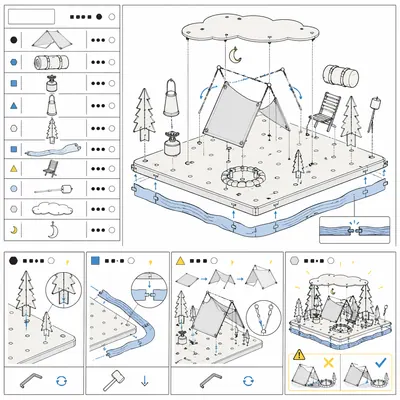</a>

<b>周末露营模块</b>

<details><summary>📋 完整提示词</summary>

```
Scene:
A square flat-pack outdoor instruction sheet with clean white background, black technical line art, light gray layout grid, and restrained blue-yellow accent marks. The page is viewed straight-on and divided into a parts inventory, a large exploded campsite diagram, and four compact step panels. Text areas are deliberately blank or filled with unreadable pseudo marks so the image relies on diagram structure.

Subject:
A weekend camping module treated like a furniture kit. The parts include tent panels, sleeping bag rolls, camp stove cylinder, lantern cone, pine-tree brackets, river strip, folding chair slats, marshmallow pegs, cloud cover panel, and a tiny crescent moon hook. Small instruction figures use a hex key and mallet to attach nature to a portable base platform, then unfold a complete campsite with tent, fire ring, chairs, and weather shield.

Important details:
Show the landscape as assembled hardware: trees slot into base holes, the river strip snaps around the platform edge, the tent frame folds up from numbered-looking but unreadable icons, and a warning panel shows crossed-out campfire too close to the tent. The final panel should be charming but still technical. Maintain precise alignment, consistent stroke weight, clean arrows, and strong separation between inventory, process, and finished module.

Use case:
IKEA Instruction World single study 8/8, converting a weekend camping trip into a modular outdoor assembly manual.

Constraints:
No readable text, no watermark, no logos, preserve exact 1:1 aspect ratio, no real outdoor brand names, no photorealistic campsite, no cluttered travel poster, no actual step numbers, no unsafe fire detail, no broken grid layout.
```

</details>

</td>
<td width="33%"></td>
</tr>
</table>

## 图内翻译 · 保 typography 只换文字

> 图内翻译 · 保 typography 只换文字：给英文 infographic，只翻文字到目标语言，字号、间距和图标位置全不动。

<table>
<tr>
<td width="33%" valign="top" align="center">

<a href="./works/topics/in-image-translation/packages/series-poster-localization/images/01-english-source-poster/image.w1600.webp"></a>

<b>英文源海报</b>

<details><summary>📋 完整提示词</summary>

```
Scene:
A square product-design infographic poster, straight-on like a finished localization proof on a light gray studio wall. Use a calm modern palette of white, graphite, fresh blue, soft green, and warm yellow. The lighting is even and bright so every text block is legible. The poster has a precise modular grid with a large headline at top, four rounded schedule cards in the middle, and one small footer strip at bottom.

Subject:
Create the English source artwork for a hydration routine poster. The exact readable English text must be: headline Daily Water Plan; card labels Wake Up, Breakfast, Commute, Lunch, Evening; footer Refill before bed. Each label sits inside a designed text box beside a simple line icon: sunrise, bowl, train, plate, moon, and bottle. Typography is clean sans serif, consistent weight, with generous spacing.

Important details:
This is the reference for later in-image translation, so the layout must be unusually stable and measurable. Keep all text boxes aligned to the same grid, icons locked to the left of their labels, equal card heights, consistent corner radius, and no extra decorative copy. Leave enough room in every box for translated strings while still looking like a polished English poster.

Use case:
In-Image Translation series study 1/8, establishing the English source layout for multilingual poster localization.

Constraints:
No readable text except the specified English strings, no watermark, no logos, preserve exact 1:1 aspect ratio, no misspellings, no extra labels, no skewed perspective, no fake brand marks, no tiny unreadable typography.
```

</details>

</td>
<td width="33%" valign="top" align="center">

<a href="./works/topics/in-image-translation/packages/single-translation-surfaces/images/museum-wayfinding-card/image.w1600.webp"></a>

<b>博物馆导视牌</b>

<details><summary>📋 完整提示词</summary>

```
Scene:
A square close-up of a museum wayfinding placard mounted on brushed aluminum beside a gallery doorway. The camera is straight-on with slight environmental depth at the edges, soft museum lighting, neutral gray walls, and a restrained institutional palette of charcoal, cream, muted red, and pale blue. The sign is divided into three perfectly aligned rows with icon columns and bilingual-looking spacing.

Subject:
Show a finished Chinese localization of an English museum sign while implying the original layout is preserved. The exact readable Chinese text must be: 常设展, 临时展厅, 咖啡与商店, 出口. Each phrase appears in a clean sans serif style, replacing where English labels would have been, beside simple pictograms for collection, gallery, cup, and arrow. The sign should look production ready, with exact baseline alignment and even optical margins.

Important details:
The point is not just multilingual text; it is text replacement inside a pre-existing wayfinding grid. Keep icon positions fixed, keep row heights equal, keep the arrows and pictograms crisp, and make all Chinese characters readable at thumbnail scale. The sign should show professional localization discipline: no crowding, no mismatched font weights, no accidental extra copy, and no redesign.

Use case:
In-Image Translation single study 5/8, testing translated signage text inside a strict wayfinding layout.

Constraints:
No readable text except the specified Chinese strings, no watermark, no logos, preserve exact 1:1 aspect ratio, no fake museum brand, no misshaped Chinese characters, no handwritten style, no perspective distortion, no extra labels.
```

</details>

</td>
<td width="33%" valign="top" align="center">

<a href="./works/topics/in-image-translation/packages/series-poster-localization/images/02-japanese-localized-poster/image.w1600.webp"></a>

<b>日文本地化海报</b>

<details><summary>📋 完整提示词</summary>

```
Scene:
Use the reference image as the locked source poster. Keep the same square crop, same straight-on wall presentation, same color palette, same modular grid, same line icons, same card sizes, and same footer position. The image should look like the same design file after a professional Japanese localization pass, not like a new poster or a loose remake.

Subject:
Replace only the English text with Japanese while preserving the typography hierarchy and approximate visual weight. The exact readable Japanese text must be: headline 毎日の水分プラン; card labels 起床, 朝食, 通勤, 昼食, 夜; footer 就寝前に補充. Keep the headline in the same top area, each card label beside its original icon, and the footer inside the same bottom strip. The translated characters should be crisp, balanced, and naturally typeset.

Important details:
The core test is in-image translation with typography preservation. Do not move icons, resize cards, change colors, add new ornaments, or redesign the schedule. Japanese strings may be slightly wider or narrower than English, but they must stay centered in the same boxes and retain the original label rhythm. Preserve line spacing, corner radius, margins, icon scale, and overall visual identity from image 01.

Use case:
In-Image Translation series study 2/8, translating the source poster into Japanese while keeping the visual system fixed.

Constraints:
No readable text except the specified Japanese strings, no watermark, no logos, preserve exact 1:1 aspect ratio, no English leftovers, no random kana, no broken characters, no shifted icons, no changed poster structure.
```

</details>

</td>
</tr>
<tr>
<td width="33%" valign="top" align="center">

<a href="./works/topics/in-image-translation/packages/single-translation-surfaces/images/ingredient-label-sheet/image.w1600.webp"></a>

<b>成分标签样张</b>

<details><summary>📋 完整提示词</summary>

```
Scene:
A square studio photograph style image of a premium tea pouch lying flat beside a magnified label proof sheet. The background is warm off-white paper, lit from the upper left with soft shadows. The design language is commercial packaging: clean black text, sage green blocks, small line dividers, and a precise nutrition-label-like grid. The label fills most of the frame and must be easy to inspect.

Subject:
Create a Spanish localization of a compact ingredient and brewing label. The exact readable Spanish text must be: Té verde, Ingredientes, hojas de té, arroz tostado, Preparación, 80 C, 2 min, Sin azúcar. Arrange these strings in a realistic package label with the same visual role that English text would occupy: product name at top, section headings, ingredient rows, brewing settings, and a small claim badge. Keep the packaging generic with no brand name.

Important details:
This tests translation in a dense commercial mockup where text must fit small containers. Preserve a strict grid, sharp label borders, consistent numeral style, even padding, and readable accents. The Spanish text should look naturally typeset, not randomly scattered. Make the surface tactile and plausible, but prioritize clear text and localization discipline over decorative packaging noise.

Use case:
In-Image Translation single study 6/8, testing localized packaging text inside a compact ingredient label layout.

Constraints:
No readable text except the specified Spanish strings, no watermark, no logos, preserve exact 1:1 aspect ratio, no real brand, no random certification marks, no misspelled accents, no unreadable microtext, no cluttered label grid.
```

</details>

</td>
<td width="33%" valign="top" align="center">

<a href="./works/topics/in-image-translation/packages/series-poster-localization/images/03-korean-localized-poster/image.w1600.webp"></a>

<b>韩文本地化海报</b>

<details><summary>📋 完整提示词</summary>

```
Scene:
Use the reference image as the locked source poster. Maintain the same square, front-facing poster proof, neutral studio wall, bright even lighting, white card surfaces, graphite typography color, blue and green accent blocks, and warm yellow highlights. The finished result must feel like a Korean language export from the same design system.

Subject:
Replace only the English text with Korean. The exact readable Korean text must be: headline 매일 물 마시기 계획; card labels 기상, 아침 식사, 출근, 점심, 저녁; footer 잠들기 전에 채우기. Keep every phrase inside the same original text zone: the headline at the top, five schedule labels in the middle cards, and the footer in the bottom strip. Characters should be crisp Hangul, visually centered, and typeset with a clean sans serif rhythm.

Important details:
The challenge is to preserve typography and layout while the language changes length and density. Do not change the poster's card order, icon locations, container sizes, margin grid, background color, or visual hierarchy. The Korean text can use natural spacing, but it must keep the same baseline feeling and not collide with icons. Make the result inspectable as a before-and-after localization artifact.

Use case:
In-Image Translation series study 3/8, translating the source poster into Korean while preserving text boxes and composition.

Constraints:
No readable text except the specified Korean strings, no watermark, no logos, preserve exact 1:1 aspect ratio, no English leftovers, no garbled Hangul, no duplicate labels, no altered icons, no redesigned layout.
```

</details>

</td>
<td width="33%" valign="top" align="center">

<a href="./works/topics/in-image-translation/packages/single-translation-surfaces/images/transit-safety-panel/image.w1600.webp"></a>

<b>交通安全面板</b>

<details><summary>📋 完整提示词</summary>

```
Scene:
A square crop of a transit safety panel inside a clean metro carriage, photographed straight-on with stainless steel edges and soft overhead light. The panel is a finished public-information graphic with four pictogram boxes, a headline band, and a lower instruction strip. Use high contrast safety colors: white, black, signal yellow, muted blue, and a small red accent.

Subject:
Show a French localization of a transit safety instruction panel. The exact readable French text must be: Restez derriere la ligne, Tenez la rampe, Laissez sortir, Gardez vos sacs pres de vous, Sortie. Place the main warning in the headline band, three instructions under pictograms in the middle boxes, and the exit label beside a clean arrow in the lower strip. Typography should be sober, transit-grade, and readable, with no brand system or route names.

Important details:
The challenge is maintaining a public-safety layout while translating the text. Keep pictograms aligned, box borders crisp, icon scale consistent, and the baseline grid stable. French accents should render correctly where used, and the text must not spill outside boxes. The panel should look like a professionally localized safety graphic, not an improvised poster.

Use case:
In-Image Translation single study 7/8, testing translated safety instructions with pictogram alignment and strict readability.

Constraints:
No readable text except the specified French strings, no watermark, no logos, preserve exact 1:1 aspect ratio, no metro brand, no route numbers, no extra warnings, no garbled accents, no angled unreadable panel.
```

</details>

</td>
</tr>
<tr>
<td width="33%" valign="top" align="center">

<a href="./works/topics/in-image-translation/packages/series-poster-localization/images/04-arabic-localized-poster/image.w1600.webp">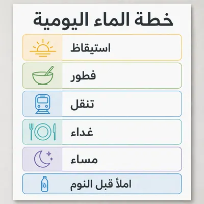</a>

<b>阿拉伯文本地化海报</b>

<details><summary>📋 完整提示词</summary>

```
Scene:
Use the reference image as the locked source poster, but localize it for Arabic while keeping the square gallery crop and professional design proof quality. Preserve the same card grid, same soft gray wall, same white poster surface, same icon style, same blue, green, yellow, and graphite palette. The output should show a careful right-to-left localization pass without becoming a different poster.

Subject:
Replace only the English text with Arabic. The exact readable Arabic text must be: headline خطة الماء اليومية; card labels استيقاظ, فطور, تنقل, غداء, مساء; footer املأ قبل النوم. Keep every translated phrase in the equivalent text box, with right-to-left shaping, correct connected Arabic forms, and balanced weight. Icons may remain in their original locations from the reference, but each label must align naturally within its card and stay visually matched to the source hierarchy.

Important details:
This study tests whether in-image translation can handle script direction, shaping, and layout preservation together. Do not mirror the entire poster unless needed for the text flow; preserve the original visual identity, colors, card sizes, icon scale, footer strip, and headline prominence. Arabic text must look intentionally typeset, not pasted or distorted.

Use case:
In-Image Translation series study 4/8, translating the source poster into Arabic while preserving the original poster design.

Constraints:
No readable text except the specified Arabic strings, no watermark, no logos, preserve exact 1:1 aspect ratio, no English leftovers, no broken Arabic joining, no random marks, no shifted cards, no changed color system.
```

</details>

</td>
<td width="33%" valign="top" align="center">

<a href="./works/topics/in-image-translation/packages/single-translation-surfaces/images/app-onboarding-board/image.w1600.webp"></a>

<b>应用引导稿板</b>

<details><summary>📋 完整提示词</summary>

```
Scene:
A square product mockup showing four mobile app onboarding screens laid out on a white design board. The board is viewed straight-on with subtle paper grain, soft shadows under each phone frame, and a restrained digital palette of black, white, teal, coral, and pale lavender. Each screen has an illustration area, a headline, a short body line, and one pill-shaped button.

Subject:
Create a German localization of a calm finance app onboarding sequence. The exact readable German text must be: Budget planen, Ausgaben sehen, Ziele setzen, Sicher starten, Weiter. Use Budget planen, Ausgaben sehen, Ziele setzen, Sicher starten as the four screen headlines, and Weiter as the button label repeated once per screen. Body text should be represented by non-readable gray placeholder lines only, not real words. The phones should look like a polished UI handoff, with identical layout between screens.

Important details:
The translation task is to keep UI hierarchy stable despite longer German compounds. Headlines must fit their existing containers without squeezing awkwardly, buttons must keep the same width and radius, and screen spacing must stay even. Preserve all icon and illustration areas, maintain consistent font weight, and keep the localized text crisp enough to audit.

Use case:
In-Image Translation single study 8/8, testing app UI localization where translated strings must fit repeated screen templates.

Constraints:
No readable text except the specified German strings, no watermark, no logos, preserve exact 1:1 aspect ratio, no app brand, no real currency symbols, no extra UI copy, no misspelled German, no overlapping labels.
```

</details>

</td>
<td width="33%"></td>
</tr>
</table>

## JSON 名片 · Code as Object

> 测试把 JSON 代码块变成真实名片物件: 可读文本、语法高亮、烫金和代码编辑器式装饰。

<table>
<tr>
<td width="33%" valign="top" align="center">

<a href="./works/topics/json-business-card/packages/single-code-object-cards/images/foil-founder-card/image.w1600.webp"></a>

<b>烫金创始人名片</b>

<details><summary>📋 完整提示词</summary>

```
Scene:
A square premium commercial mockup photographed from a three-quarter overhead angle on matte black stone. One thick black business card sits centered, with shallow depth of field, soft studio reflections, and warm gold foil catching the edges of printed code. The layout is clean and luxurious, like a product shot for a developer-founder identity system.

Subject:
The card face is a readable JSON code block printed as the entire business card identity. Use exact crisp monospaced text with syntax-highlight foil: braces and punctuation in satin gold, keys in pale champagne, string values in soft white. The visible JSON should read like a fictional contact object with keys such as "name", "role", "company", "email", "site", and "status". Keep every brace, comma, quote mark, and indentation aligned.

Important details:
The concept is code as object. The JSON must look printed into the card, not floating on top. Use realistic foil debossing, subtle paper grain, beveled card thickness, and editor-like margin guides as decorative lines without any real software logo. Text hierarchy must be legible at the square crop size. Do not add extra decorative words outside the code block.

Use case:
JSON Business Card single study 1/8, testing readable JSON typography as gold-foil commercial print.

Constraints:
No readable text except the specified JSON code block, no watermark, no logos, preserve exact 1:1 aspect ratio, no brand names, no malformed JSON, no extra punctuation, no misspelled keys, no unreadable microtext, no random UI labels, no plastic-looking foil.
```

</details>

</td>
<td width="33%" valign="top" align="center">

<a href="./works/topics/json-business-card/packages/single-code-object-cards/images/dark-mode-card/image.w1600.webp"></a>

<b>暗色模式名片</b>

<details><summary>📋 完整提示词</summary>

```
Scene:
A square product mockup of a business card styled like a dark-mode code editor tab, lying on a brushed aluminum desk with a mechanical keyboard blurred in the background. The card remains the only sharp object. Lighting is cool and controlled, with faint cyan and violet edge reflections that suggest syntax highlighting without becoming a screen.

Subject:
A matte charcoal card with a small editor-chrome border made of generic rounded dots and a tab shape, no real software branding. The center contains a readable JSON business card in monospaced type: "name", "title", "stack", "email", "timezone", and "available" as aligned keys, with quoted string values and one boolean value. Keys glow muted blue, strings appear warm green, punctuation is silver, and the card edges are lightly embossed.

Important details:
Make the printed JSON precise enough that a developer viewer can inspect brackets, commas, quotes, indentation, and line breaks. The card should read as physical ink and spot varnish, not an actual monitor. Keep the layout structured: tab strip at top, code block inset, line-number gutter represented by small unreadable ticks only. Avoid real product logos, real interface labels, or extra readable text.

Use case:
JSON Business Card single study 2/8, testing dark-mode editor aesthetics on a physical commercial card.

Constraints:
No readable text except the specified JSON code block, no watermark, no logos, preserve exact 1:1 aspect ratio, no real IDE name, no malformed braces, no random letters, no blurry code, no excess UI chrome, no glowing screen, no keyboard text.
```

</details>

</td>
<td width="33%" valign="top" align="center">

<a href="./works/topics/json-business-card/packages/single-code-object-cards/images/translucent-acrylic-card/image.w1600.webp"></a>

<b>半透明亚克力名片</b>

<details><summary>📋 完整提示词</summary>

```
Scene:
A square commercial mockup on a pale concrete surface with a translucent frosted acrylic business card casting soft layered shadows. The card is photographed overhead with slight perspective, clean daylight, and precise reflections along polished edges. A second blank acrylic card sits partly underneath to show depth without carrying any readable content.

Subject:
The top acrylic card contains a readable JSON identity block engraved and filled with white and copper ink. The fictional data object includes keys such as "name", "role", "lab", "email", "city", and "mode". The JSON braces frame the card like a design system. Syntax highlight is physical: copper punctuation, white keys, pale blue values, and clear indentation. The transparent material bends the shadows behind the code but does not distort the letters.

Important details:
This image tests readable text through transparent material. Keep the code block sharp, aligned, and optically plausible despite refraction. The acrylic should have frosted thickness, chamfered edges, small surface scratches, and engraved ink that sits inside the material. Avoid turning the card into a screen or neon sign. There may be decorative editor-window corner marks, but they must be generic and non-readable.

Use case:
JSON Business Card single study 3/8, testing JSON typography on translucent acrylic with realistic refraction.

Constraints:
No readable text except the specified JSON code block, no watermark, no logos, preserve exact 1:1 aspect ratio, no real company names, no distorted JSON characters, no duplicated code shadows, no extra labels, no glowing sci-fi interface, no fingerprints covering text.
```

</details>

</td>
</tr>
<tr>
<td width="33%" valign="top" align="center">

<a href="./works/topics/json-business-card/packages/single-code-object-cards/images/letterpress-code-card/image.w1600.webp"></a>

<b>活版代码名片</b>

<details><summary>📋 完整提示词</summary>

```
Scene:
A square macro product photograph of a cream cotton paper business card on a letterpress printer bed. Warm side light reveals paper fibers, deep impressions, and ink texture. The card is angled slightly, with a brass composing stick and blank paper off to the side as non-readable props. The mood is analog craft meeting software syntax.

Subject:
The card face is a readable JSON object printed in deep letterpress indentation. Use a fictional creative technologist profile with keys like "name", "craft", "format", "email", "tools", and "open_to". The text is monospaced, black and metallic gold, with quotation marks, colons, commas, square brackets, and braces clearly aligned. Syntax highlighting is achieved through ink color and pressure: keys in black, punctuation blind-debossed, values in gold.

Important details:
Make every JSON character look physically pressed into thick paper. Preserve clean indentation, equal line spacing, consistent quote marks, and no accidental extra characters. Letterpress texture should not destroy readability. The background may show printmaking equipment, but no readable labels or brand marks. The card should feel like a real premium business card that a developer might hand out at a design conference.

Use case:
JSON Business Card single study 4/8, testing readable code layout under analog letterpress texture.

Constraints:
No readable text except the specified JSON code block, no watermark, no logos, preserve exact 1:1 aspect ratio, no malformed JSON, no random type fragments, no ink smears over characters, no antique poster text, no printer brand marks, no warped card corners.
```

</details>

</td>
<td width="33%" valign="top" align="center">

<a href="./works/topics/json-business-card/packages/single-code-object-cards/images/embossed-api-card/image.w1600.webp"></a>

<b>压凸 API 名片</b>

<details><summary>📋 完整提示词</summary>

```
Scene:
A square close-up commercial mockup of a deep navy business card resting on a dark walnut table. The card is photographed with low raking light so embossed and debossed details become visible. The composition includes a second card edge and a small blank envelope as props, both without readable content.

Subject:
The business card presents a readable JSON block as if it were an API response. The fictional object includes keys such as "endpoint", "name", "role", "email", "rate", and "response". Curly braces and commas are raised in glossy clear embossing, keys are printed in pale blue, values in silver, and one status-like value is in green foil. The result should feel like a premium developer services card, with code as the only identity system.

Important details:
Keep the JSON formally coherent: aligned indentation, complete braces, properly quoted strings, no broken commas, no orphan keys. The embossed punctuation should be visible but not so shiny that it obscures readability. Use physical paper texture, realistic shadows inside debossed strokes, and clean commercial-mockup focus. There should be no real API provider name, no QR code, no website chrome, and no extra contact text outside the code.

Use case:
JSON Business Card single study 5/8, testing API-response typography as embossed print on a physical card.

Constraints:
No readable text except the specified JSON code block, no watermark, no logos, preserve exact 1:1 aspect ratio, no real service names, no invalid JSON syntax, no random code comments, no QR code, no overexposed foil, no unreadable tiny values, no floating UI windows.
```

</details>

</td>
<td width="33%" valign="top" align="center">

<a href="./works/topics/json-business-card/packages/single-code-object-cards/images/minimal-white-card/image.w1600.webp"></a>

<b>极简白色名片</b>

<details><summary>📋 完整提示词</summary>

```
Scene:
A square minimal studio mockup on a seamless off-white background. A single white business card lies perfectly flat, viewed straight down, with precise soft shadows and no extra props. The image should feel like a restrained identity-system presentation where the code block itself is the graphic design.

Subject:
The card contains a readable JSON object printed in ultra-clean black, gray, and one restrained red accent. The fictional object uses keys such as "name", "role", "email", "url", "location", and "pronouns". The layout is centered with generous margins, a line-number gutter represented only by tiny gray ticks, and syntax colors applied as print ink. The JSON must be the only readable content on the card.

Important details:
Because the card is minimal, precision matters: exact monospaced alignment, sharp quote marks, consistent indentation, complete braces, and no random generated glyphs. The white paper should show subtle thickness, fiber grain, and a slight letterpress bite around the text. The visual should be believable as a real business card photographed in a product studio, not a screenshot pasted on paper.

Use case:
JSON Business Card single study 6/8, testing clean readable JSON typography under strict minimal commercial mockup conditions.

Constraints:
No readable text except the specified JSON code block, no watermark, no logos, preserve exact 1:1 aspect ratio, no extra icons, no malformed JSON, no decorative quotes, no smudged punctuation, no colored background, no shadows covering text, no cropped card edges.
```

</details>

</td>
</tr>
<tr>
<td width="33%" valign="top" align="center">

<a href="./works/topics/json-business-card/packages/single-code-object-cards/images/holographic-startup-card/image.w1600.webp">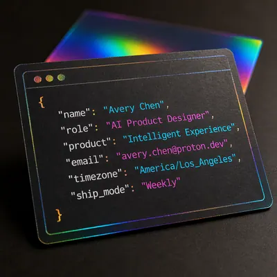</a>

<b>镭射创业名片</b>

<details><summary>📋 完整提示词</summary>

```
Scene:
A square premium startup-brand mockup with a holographic foil business card on a dark neutral table. The card is tilted so rainbow foil shifts across the code while the printed characters remain sharp. Lighting is dramatic but controlled, with a second blurred card in the background showing only abstract foil bands and no readable marks.

Subject:
The front card displays a readable JSON identity block for a fictional AI product designer. Use keys such as "name", "role", "product", "email", "timezone", and "ship_mode". Syntax highlighting is made from holographic foil: braces and punctuation in rainbow foil, keys in white ink, string values in cyan and magenta foil accents. The code block sits inside a subtle editor-window frame with generic controls, not a real application logo.

Important details:
Readable text is the core challenge. Foil reflections must enhance syntax highlighting without hiding the JSON. Keep indentation stable, quotes clean, commas in correct positions, and no extra lines beyond the object. The card should feel tactile and commercial: thick stock, bevel, foil grain, tiny edge wear, and realistic reflection. Avoid sci-fi UI clutter or decorative data streams.

Use case:
JSON Business Card single study 7/8, testing readable JSON code under holographic foil and startup-style commercial mockup lighting.

Constraints:
No readable text except the specified JSON code block, no watermark, no logos, preserve exact 1:1 aspect ratio, no real startup names, no malformed JSON, no hidden extra words, no QR code, no overbright glare, no fake screen, no illegible rainbow smearing.
```

</details>

</td>
<td width="33%" valign="top" align="center">

<a href="./works/topics/json-business-card/packages/single-code-object-cards/images/terminal-window-card/image.w1600.webp">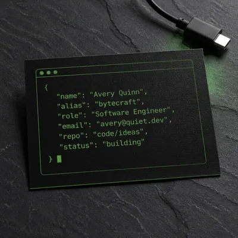</a>

<b>终端窗口名片</b>

<details><summary>📋 完整提示词</summary>

```
Scene:
A square commercial mockup of a black business card designed like a physical terminal window, placed on a slate desk with one blank cable and a soft green reflection. The card is shot from above at a slight angle, with clean edges, realistic paper thickness, and a subtle varnish sheen. The look is developer-culture playful but premium.

Subject:
The card face contains a readable JSON object printed in terminal-green ink, framed by a thin generic window outline. The fictional object includes keys such as "name", "alias", "role", "email", "repo", and "status". Use exact quote marks, colons, commas, braces, and two-space indentation. A block cursor may appear as a small solid rectangle after the closing brace, but it should not introduce extra readable text.

Important details:
The visual joke is that the business card is a terminal output object. The JSON must remain valid-looking and legible while still feeling physically printed on black card stock. Add subtle spot varnish on punctuation, tiny screen-like scan texture as ink grain, and a bottom card edge highlight. Do not include command prompts, shell labels, real repository hosts, or readable UI menu words.

Use case:
JSON Business Card single study 8/8, testing terminal-inspired readable JSON as a tactile printed business card.

Constraints:
No readable text except the specified JSON code block, no watermark, no logos, preserve exact 1:1 aspect ratio, no real platform names, no command line prompt text, no malformed JSON, no random symbols, no glowing monitor surface, no extra labels, no unreadable green blur.
```

</details>

</td>
<td width="33%"></td>
</tr>
</table>

## Google Maps → 羊皮纸藏宝图

> 测试把现代地图路网拓扑换壳为可信的羊皮纸藏宝图，保留路线结构、真实世界方位感和材质物理细节。

<table>
<tr>
<td width="33%" valign="top" align="center">

<a href="./works/topics/maps-to-treasure-map/packages/series-hutong-parchment/images/01-source-hutong-topology/image.w1600.webp"></a>

<b>胡同拓扑源图</b>

<details><summary>📋 完整提示词</summary>

```
Scene:
A square, clean modern digital map-style view of a dense Beijing hutong neighborhood, shown from directly overhead with no perspective tilt. Use a light gray background, thin white alleys, slightly wider pale roads, a muted blue walking route, and small unlabeled landmark icons. The composition should feel like a map screenshot while remaining entirely non-branded and free of interface elements.

Subject:
Create a plausible old-city hutong route topology: narrow lanes form irregular rectangular blocks, two wider east-west roads frame the area, a small lake-like blue shape sits near one corner, and the blue route zigzags through six turns before reaching a tiny red destination marker. The network should feel like central Beijing alley structure rather than a generic grid, but do not include exact street names or any service branding.

Important details:
This is the source reference for a transformation series. The road topology, route turns, marker position, block proportions, water shape, and landmark icon positions must be clear enough for later images to preserve them while changing materials. Keep the view flat, diagrammatic, and readable as modern map data. Avoid decorative aging here; this image should be the modern topology input before the treasure-map conversion.

Use case:
Maps to Treasure Map series study 1/8, establishing the modern hutong map topology that later parchment variants must preserve.

Constraints:
No readable text, no watermark, no logos, preserve exact 1:1 aspect ratio, no app controls, no brand colors tied to a real map service, no compass rose, no antique paper texture, no photographic buildings, no randomized maze, no missing route turns.
```

</details>

</td>
<td width="33%" valign="top" align="center">

<a href="./works/topics/maps-to-treasure-map/packages/single-cartographic-relics/images/estate-neighborhood-scroll/image.w1600.webp"></a>

<b>地产街区卷轴</b>

<details><summary>📋 完整提示词</summary>

```
Scene:
A square overhead product photograph of a rolled parchment neighborhood map partly unfurled on a walnut desk, with a brass house key, blank seal tag, and soft afternoon light. The paper edges are curled, the ink is brown and faded, and the desk casts realistic shadows under the scroll rods. The scene should feel like a premium real-estate closing gift rather than a fantasy poster.

Subject:
Convert a modern suburban neighborhood route into an antique treasure-map artifact. Show a plausible loop road, three cul-de-sacs, a small park pond, and a dotted path leading from a gate-like entrance icon to a hilltop house symbol. Preserve map logic: roads connect cleanly, the dotted path follows accessible streets, and the house destination sits at the end of the route. Use no street labels or readable sales copy.

Important details:
The visual language should prove data-format transformation: modern property-access topology becomes old parchment without losing practical route structure. Include a wind rose, small sketched trees, contour-like ink rings around the hill, subtle fold creases, tea stains, and wax-colored smudges. Materials must be physically credible: parchment translucency at thin edges, ink bleed in fibers, brass key tarnish, and shadows matching the scroll height.

Use case:
Maps to Treasure Map single study 5/8, testing a real-estate neighborhood map converted into a tactile treasure-map closing gift.

Constraints:
No readable text, no watermark, no logos, preserve exact 1:1 aspect ratio, no real estate brand, no address labels, no price tag, no impossible disconnected roads, no random island coastline, no route that crosses buildings, no glossy poster paper.
```

</details>

</td>
<td width="33%" valign="top" align="center">

<a href="./works/topics/maps-to-treasure-map/packages/series-hutong-parchment/images/02-parchment-sea-chart/image.w1600.webp"></a>

<b>羊皮纸航海图</b>

<details><summary>📋 完整提示词</summary>

```
Scene:
A square overhead photograph of an aged parchment treasure map laid on a dark wooden table, lit by warm candlelike side light. The paper has curled corners, uneven fiber, translucent stains, and slightly torn edges. Keep the camera flat enough that the map geometry remains readable while showing real shadows under the raised paper edges.

Subject:
Transform the referenced modern hutong topology into a fifteenth-century parchment chart. Preserve the same lane network, six-turn route, destination position, water shape, and landmark icon spacing from image 01, but redraw them as sepia ink paths, dotted trail marks, tiny illustrated gates, and an X-shaped destination marker. Add a hand-drawn wind rose, a few sea-monster-style marginal illustrations, and a red wax seal outside the main route area without covering the topology.

Important details:
The challenge is data-format conversion: the image must feel antique while retaining the modern road network structure. Streets should become hand-inked lanes, the blue route should become a dotted brown expedition trail, and the red marker should become a clear treasure X in the same relative place. Material physics matter: parchment translucency, ink bleed, wax height, shadow direction, and worn fold lines should be believable.

Use case:
Maps to Treasure Map series study 2/8, testing preservation of modern hutong topology after conversion into a parchment treasure chart.

Constraints:
No readable text, no watermark, no logos, preserve exact 1:1 aspect ratio, no branded map UI, no random pirate island shape replacing the hutong network, no route turns removed, no wax seal covering the destination, no glossy modern paper, no printed street labels.
```

</details>

</td>
</tr>
<tr>
<td width="33%" valign="top" align="center">

<a href="./works/topics/maps-to-treasure-map/packages/single-cartographic-relics/images/subway-labyrinth-chart/image.w1600.webp"></a>

<b>地铁迷宫古图</b>

<details><summary>📋 完整提示词</summary>

```
Scene:
A square antique chart laid flat under museum-case lighting, combining the orderliness of a transit diagram with the tactile age of a medieval manuscript. The map is on yellowed vellum with darkened edges, pinned by small brass weights at the corners. The lighting is cool and controlled, revealing ink grooves, scraped corrections, and subtle vellum waviness.

Subject:
Transform a modern subway transfer map into a labyrinthine treasure chart. Use colored routes as faded mineral-pigment lines: one red route, one blue route, one green route, and one ochre route crossing at circular transfer nodes. The network must remain legible and connected, like a metro schematic translated into ancient cartography. At one far endpoint, replace the station marker with a small X-shaped treasure target. Do not use station names or numbers.

Important details:
The image should keep transit-map logic while changing every surface cue into antique material. Lines should be straight or gently angled like schematic routes, transfer nodes should align cleanly, and the treasure endpoint should be reachable through obvious line connections. Add a hand-drawn compass ornament, tiny border monsters, worn pigment, vellum fiber, pin shadows, and slight ink pooling where lines meet. Avoid making it a fantasy maze with dead ends unrelated to the transit structure.

Use case:
Maps to Treasure Map single study 6/8, testing a subway-style transfer diagram converted into an antique labyrinth treasure chart.

Constraints:
No readable text, no watermark, no logos, preserve exact 1:1 aspect ratio, no transit agency brand, no station labels, no route numbers, no disconnected line segments, no random maze walls, no glossy modern diagram, no objects hiding transfer nodes.
```

</details>

</td>
<td width="33%" valign="top" align="center">

<a href="./works/topics/maps-to-treasure-map/packages/series-hutong-parchment/images/03-wax-sealed-route/image.w1600.webp"></a>

<b>蜡封路线</b>

<details><summary>📋 完整提示词</summary>

```
Scene:
A square macro still life of a folded parchment map opened halfway on a lacquered table, with a broken red wax seal, silk cord, and a brass compass nearby. Light comes from a low warm source, creating long shadows from folds, cord, compass rim, and wax fragments. The map surface is aged but still flat enough for the route topology to be inspected.

Subject:
Use the referenced hutong map topology as the underlying structure. The same irregular blocks, water shape, six-turn route, and destination location must appear as an explorer's route drawn in brown and vermilion ink. The folded paper may hide only blank margins; it must not hide the main lane network. The destination should be marked by a small X, and the original red marker position should be represented by the wax seal impression nearby without changing the route endpoint.

Important details:
This is a material and editing-workflow test: the modern map should become a tactile artifact while the route remains logically identical. Preserve relative spacing between alleys and landmarks, keep the central zigzag recognizable, and avoid inventing a new island coastline. Show raised wax, cracked seal edges, paper grain, fold stress, ink pooling at line intersections, and shadows that match the objects' height.

Use case:
Maps to Treasure Map series study 3/8, testing topology preservation in a wax-sealed treasure-route artifact.

Constraints:
No readable text, no watermark, no logos, preserve exact 1:1 aspect ratio, no branded symbols, no readable labels on compass, no route segment removed by folds, no seal covering critical lanes, no modern map UI, no fantasy glowing ink, no incorrect destination placement.
```

</details>

</td>
<td width="33%" valign="top" align="center">

<a href="./works/topics/maps-to-treasure-map/packages/single-cartographic-relics/images/mountain-trail-parchment/image.w1600.webp"></a>

<b>山路羊皮纸</b>

<details><summary>📋 完整提示词</summary>

```
Scene:
A square outdoor tabletop photograph of an aged parchment trail map weighted by two river stones, shot in soft overcast mountain light. Pine needles, dust, and faint water spots sit around the paper edges. The map is viewed nearly overhead, with enough surface texture and curled corners to show it is a physical artifact rather than a flat graphic.

Subject:
Convert a modern GPS hiking route into a treasure-map version. Show a switchback trail climbing from a valley entrance, crossing a stream twice, passing three small campsite icons, and ending at a cave-like X marker near contour lines. The topology must be plausible for mountain terrain: switchbacks follow slope, stream crossings occur at narrow points, and the dotted route stays on the trail. Use antique ink, sepia contour rings, and sketched ridges instead of modern satellite or GPS styling.

Important details:
This image tests real-world route reasoning and material physics together. The viewer should understand the modern trail data has been translated into parchment without losing terrain logic. Include believable paper fibers, damp staining, ink feathering near water stains, pebble shadows, smudged fold marks, and small hand-drawn pine clusters. Keep the map readable as a navigable route while preserving old treasure-map atmosphere.

Use case:
Maps to Treasure Map single study 7/8, testing a mountain GPS route converted into a physically believable parchment trail treasure map.

Constraints:
No readable text, no watermark, no logos, preserve exact 1:1 aspect ratio, no park service brand, no trail names, no elevation numbers, no route crossing cliffs unrealistically, no random pirate island, no missing stream crossings, no glossy laminated map.
```

</details>

</td>
</tr>
<tr>
<td width="33%" valign="top" align="center">

<a href="./works/topics/maps-to-treasure-map/packages/series-hutong-parchment/images/04-travel-keepsake-map/image.w1600.webp">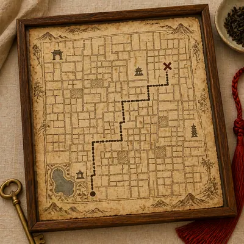</a>

<b>旅行纪念藏宝图</b>

<details><summary>📋 完整提示词</summary>

```
Scene:
A square premium travel-keepsake product photograph on a pale linen surface, evenly lit with soft daylight. A handmade parchment map lies inside a shallow wooden frame beside a blank brass key, a red cord tassel, and dried tea leaves. The palette is tan, ink brown, muted red, and weathered brass, with quiet commercial styling for a boutique tourism souvenir.

Subject:
Preserve the referenced hutong route topology exactly enough to remain recognizable: same narrow lane network, same six-turn route, same water shape, same destination position, and same landmark rhythm. Redraw the modern map as a collectible treasure map with inked alleys, dotted walking path, small gate icons, tiny mountains as decorative margins, and an X at the endpoint. The surrounding souvenir objects must not overlap the central map data.

Important details:
This variant tests whether the converted map can be used as a real travel or real-estate keepsake. The map should look handcrafted but accurate: no street-name labels, no interface remnants, no arbitrary fantasy coastline, and no topology drift. Show believable linen weave, parchment fibers, ink feathering, frame shadows, brass tarnish, and slight paper warping. The old-world styling should enhance the modern route rather than replace it.

Use case:
Maps to Treasure Map series study 4/8, testing a commercial keepsake version that preserves the reference hutong map topology.

Constraints:
No readable text, no watermark, no logos, preserve exact 1:1 aspect ratio, no brand labels, no printed tourist brochure, no objects covering route turns, no missing water shape, no random maze, no glossy plastic frame, no modern map pins except the transformed endpoint X.
```

</details>

</td>
<td width="33%" valign="top" align="center">

<a href="./works/topics/maps-to-treasure-map/packages/single-cartographic-relics/images/food-crawl-island-map/image.w1600.webp">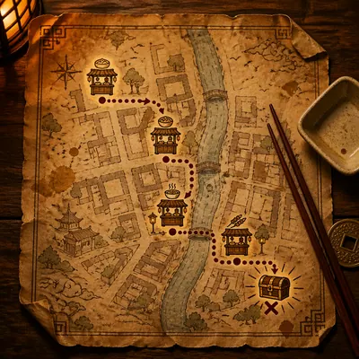</a>

<b>美食路线岛图</b>

<details><summary>📋 完整提示词</summary>

```
Scene:
A square restaurant-table still life of a parchment treasure map placed beside chopsticks, a blank ceramic sauce dish, and a brass coin-like token. Warm lantern light creates amber shadows, and the paper has oil speckles, folded corners, and hand-inked decorative borders. The camera is overhead with slight depth from the raised table objects.

Subject:
Convert a modern urban food-crawl map into a whimsical treasure chart. Show four small market-stall icons connected by a dotted walking route around irregular alley blocks and a canal-like water strip, ending at a chest-shaped destination marker. The route must remain plausible for a pedestrian food walk: connected paths, no jumps across water, and clear order from the first stall to the final marker. Do not use readable restaurant names, prices, menus, or city labels.

Important details:
The conversion should retain route logic while changing the emotional package into a souvenir-worthy treasure map. Use hand-drawn alleys, little bridge symbols, inked waves for the canal, spice-colored stains, paper fibers, soft oil translucency, and shadows from chopsticks and ceramic. The composition should suggest a tourist keepsake or local food tour promotion without any branding or text dependency.

Use case:
Maps to Treasure Map single study 8/8, testing an urban food-crawl route transformed into a parchment treasure-map souvenir.

Constraints:
No readable text, no watermark, no logos, preserve exact 1:1 aspect ratio, no restaurant brand, no menu words, no prices, no route crossing water without bridges, no random disconnected stalls, no modern phone UI, no glossy laminated flyer.
```

</details>

</td>
<td width="33%"></td>
</tr>
</table>

## 材质错位

> 测试把熟悉物体重构为异常材质时的物理可信度: 光照、重量、表面纹理、边缘和结构强度。

<table>
<tr>
<td width="33%" valign="top" align="center">

<a href="./works/topics/material-swaps/packages/single-material-impossibilities/images/butter-palace-gate/image.w1600.webp"></a>

<b>黄油宫门</b>

<details><summary>📋 完整提示词</summary>

```
Scene:
A square photoreal studio museum shot of a miniature imperial palace gate carved entirely from butter, placed on a chilled black stone plinth under soft overhead light. The camera is slightly low and close, so the gate feels monumental despite its tabletop scale. Cool condensation hangs near the base, and the background is a dark neutral gallery wall.

Subject:
The subject is a recognizable ornate palace gate form with layered roofs, bracket sets, columns, stair edges, ridge ornaments, and carved panels, but every part is made from pale yellow butter. The roof corners sag slightly, thin decorative edges soften, and tiny knife marks, creamy ridges, and glossy melt highlights reveal the material. Small droplets collect where warm light touches sharp carvings.

Important details:
The swap must be physical, not just yellow architecture. Butter should control all behavior: softened corners, low structural stiffness, oily sheen, translucent thin edges, melt trails, fingerprints, and chilled support contact. Keep the architectural silhouette readable while showing that fine details are at the limit of what butter can hold. Lighting should reveal creamy subsurface scattering and soft contact shadows on the black plinth.

Use case:
Material Swaps single study 1/8, testing whether monumental architecture can remain recognizable while obeying butter material physics.

Constraints:
No readable text, no watermark, no logos, preserve exact 1:1 aspect ratio, no real landmark label, no plastic model look, no golden metal, no dry stone texture, no fantasy glow, no extra people, no food plate styling, no collapsed unreadable blob.
```

</details>

</td>
<td width="33%" valign="top" align="center">

<a href="./works/topics/material-swaps/packages/single-material-impossibilities/images/glass-rose-stem/image.w1600.webp"></a>

<b>玻璃玫瑰</b>

<details><summary>📋 完整提示词</summary>

```
Scene:
A square macro product photograph on a charcoal velvet surface, lit with narrow studio strip lights that create sharp reflections and caustic glints. A single rose lies diagonally across the frame, but the entire flower is made from transparent blown glass. The background stays dark and quiet so the optical material behavior is easy to inspect.

Subject:
A delicate rose with curled petals, sepals, thorny stem, and two leaves, all formed from thin clear glass with faint pink and green tint only in the thickest areas. The petals have variable thickness, polished rims, trapped microbubbles, hairline stress marks, and subtle distortions where one petal overlaps another. The stem is cylindrical glass with tiny sharp thorns that catch bright highlights.

Important details:
The rose must not read as a normal flower covered in shine. Glass should define the object: refraction, internal reflection, transparent overlaps, caustic spots on velvet, brittle thin edges, slight optical magnification, and green-pink tint caused by thickness. Keep the botanical structure recognizable and elegant, but include a few tiny chips at petal tips to sell fragility. Shadows should be complex and transparent rather than opaque floral shadows.

Use case:
Material Swaps single study 2/8, testing transparent glass optics applied to an organic rose form.

Constraints:
No readable text, no watermark, no logos, preserve exact 1:1 aspect ratio, no plastic flower, no wet real petals, no neon glow, no gemstone rose, no metal stem, no extra bouquet, no impossible soft glass bending, no decorative label card.
```

</details>

</td>
<td width="33%" valign="top" align="center">

<a href="./works/topics/material-swaps/packages/single-material-impossibilities/images/lace-cathedral/image.w1600.webp"></a>

<b>蕾丝教堂</b>

<details><summary>📋 完整提示词</summary>

```
Scene:
A square museum-style object photograph of a Gothic cathedral model made from ivory lace, suspended just above a dark slate base so its shadow reveals the openwork structure. The lighting is cool and directional, grazing across towers, arches, and lace threads. The background is deep gray with a slight vignette, keeping attention on the fragile architecture.

Subject:
A cathedral with twin spires, pointed arches, rose window, flying buttresses, ribbed nave roof, and carved doorway forms, all constructed from layered lace. The walls are open mesh, the windows are floral lace medallions, and buttresses are stiffened thread bands. Some towers curve slightly under tension, and tiny stitched knots replace stone details. The lace is off-white, with subtle translucency and thread shadows.

Important details:
The building must obey lace physics: tensile thread networks, delicate negative space, flexible edges, pinned or stiffened load-bearing lines, and soft sag between structural points. Keep Gothic silhouette readable without making it solid stone. Light should pass through lace holes and cast patterned shadows on the base. The material should feel handmade, with varied thread thickness, knots, uneven tension, and slight fraying at selected edges.

Use case:
Material Swaps single study 4/8, testing lace as a structural architectural material with believable translucency and tension.

Constraints:
No readable text, no watermark, no logos, preserve exact 1:1 aspect ratio, no solid marble cathedral, no paper cutout, no wedding dress scene, no people, no stained glass colors, no fantasy glow, no perfectly rigid lace, no broken unreadable silhouette.
```

</details>

</td>
</tr>
<tr>
<td width="33%" valign="top" align="center">

<a href="./works/topics/material-swaps/packages/single-material-impossibilities/images/porcelain-ocean-wave/image.w1600.webp"></a>

<b>瓷质海浪</b>

<details><summary>📋 完整提示词</summary>

```
Scene:
A square fine-art product photograph of a frozen ocean wave sculpted from glazed porcelain, displayed on a simple ceramic plinth in a quiet white gallery. Soft daylight from above reveals glossy highlights, hairline cracks, and translucent thin crests. The camera is close enough to see glaze pooling and chipped edges.

Subject:
A curling ocean wave form, like a suspended breaker with foam, spray, and ridges, but every part is porcelain. The wave body is milky white with blue-gray celadon glaze in thicker valleys. Foam becomes clusters of tiny porcelain beads and lace-like glazed fragments. The crest is thin, brittle, and slightly translucent; a few chips and cracks expose matte ceramic underneath.

Important details:
The material behavior must contradict liquid motion while preserving wave anatomy. Porcelain should make the wave rigid, heavy, glossy, brittle, and fired, with glaze drips following gravity, pooled blue glaze in recesses, crazing cracks, and broken sharp rims. Keep the water shape recognizable through curl, lip, trough, and foam texture, but avoid real liquid transparency. Contact shadows on the plinth should make the ceramic weight believable.

Use case:
Material Swaps single study 5/8, testing whether dynamic water can be reinterpreted as brittle glazed porcelain.

Constraints:
No readable text, no watermark, no logos, preserve exact 1:1 aspect ratio, no real water splash, no plastic resin, no blue glass wave, no surfer, no beach scene, no fantasy glow, no flat decorative plate, no smooth featureless sculpture.
```

</details>

</td>
<td width="33%" valign="top" align="center">

<a href="./works/topics/material-swaps/packages/single-material-impossibilities/images/wax-library-chair/image.w1600.webp"></a>

<b>蜡制图书馆椅</b>

<details><summary>📋 完整提示词</summary>

```
Scene:
A square cinematic interior photograph of an ornate reading chair in a quiet old library, but the entire chair is made from dark red sealing wax. Warm lamplight falls from one side, causing slight softening near the arms, while the background bookshelves remain blurred and contain no readable spines. The chair sits on a polished wooden floor with a heavy shadow.

Subject:
A high-backed tufted library chair with rolled arms, carved legs, nailhead-like details, cushion seams, and button depressions, all formed from glossy red wax. The seat has subtle sag, the arms show softened finger-like ridges, and carved leg details droop at the warmest points. Small cooled wax drips hang below the upholstery seams, and a few cracks reveal darker wax inside.

Important details:
The chair should remain usable-looking but visibly unstable under heat and weight. Wax must define the physics: glossy highlights, translucent thick edges, softened relief, slow drips, sagging cushions, fingerprints, cooled ripples, and brittle cracks in colder thin areas. Keep the library mood grounded and photoreal, with accurate contact shadows and reflections on the wood floor. Do not make the object look like red leather or polished plastic.

Use case:
Material Swaps single study 6/8, testing wax material behavior on an upholstered furniture form.

Constraints:
No readable text, no watermark, no logos, preserve exact 1:1 aspect ratio, no readable book titles, no leather chair, no plastic toy, no open flame, no human figure, no melted puddle replacing the chair, no fantasy castle decor, no brand embossing.
```

</details>

</td>
<td width="33%" valign="top" align="center">

<a href="./works/topics/material-swaps/packages/single-material-impossibilities/images/rubber-bonsai-tree/image.w1600.webp"></a>

<b>橡胶盆景</b>

<details><summary>📋 完整提示词</summary>

```
Scene:
A square studio still life of a bonsai tree on a simple concrete table, photographed with soft side lighting and a neutral olive-gray background. The bonsai sits in a shallow matte pot filled with dark gravel. The tree form is elegant and traditional, but every trunk, branch, and leaf is made from flexible black rubber.

Subject:
A miniature bonsai with twisting trunk, exposed roots, branching canopy pads, and hundreds of small leaves, all formed from matte and semi-gloss rubber. The trunk bends under its own elastic memory, with molded seam lines, stretched glossy highlights on curves, and fine rubber nubs where bark texture would be. Leaves are thin rubber tabs with curled edges, slight sag, and dust adhering to their surfaces.

Important details:
Do not treat rubber as simply black paint. Rubber physics should be visible: flexible deformation, rounded compressed roots, elastic tension in bent branches, soft non-brittle edges, scuffed matte areas, oily highlights, molded texture, and slight rebound shape. The bonsai silhouette must remain recognizable and sculptural, with the material making it strange but believable. Contact with gravel should show soft compression and small pebbles pressing into rubber roots.

Use case:
Material Swaps single study 7/8, testing elastic rubber material behavior applied to a natural bonsai form.

Constraints:
No readable text, no watermark, no logos, preserve exact 1:1 aspect ratio, no real leaves, no plastic plant shine, no metal wire sculpture, no cartoon tree, no bright colors, no human hands, no garden signage, no broken anatomy of the bonsai structure.
```

</details>

</td>
</tr>
<tr>
<td width="33%" valign="top" align="center">

<a href="./works/topics/material-swaps/packages/single-material-impossibilities/images/salt-crystal-sneaker/image.w1600.webp">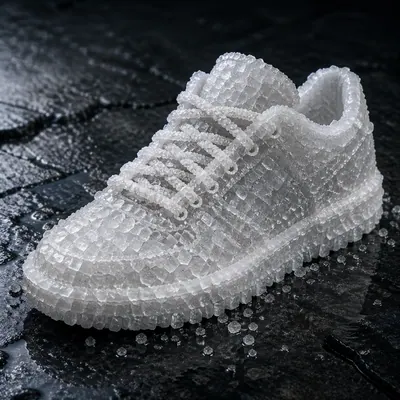</a>

<b>盐晶运动鞋</b>

<details><summary>📋 完整提示词</summary>

```
Scene:
A square premium sneaker product shot on a dark wet basalt surface, lit with a cool overhead softbox and a low side highlight. The sneaker is displayed in three-quarter view like a commercial footwear hero image, but it is entirely grown from translucent white salt crystals. Tiny grains scatter around the sole and catch the light.

Subject:
A low-top sneaker silhouette with toe box, laces, eyelets, tongue, collar, side panels, midsole, and tread pattern, all made from salt. The upper is a crust of interlocking cubic crystals, the laces are chains of smaller salt formations, the sole is a dense compressed crystalline slab, and the tread edges crumble into granular powder. Some areas are translucent, while thicker parts look chalky white.

Important details:
The material swap must respect salt crystal behavior: cubic facets, brittle fractures, granular shedding, moisture-darkened contact points, translucent edges, powder residue, and uneven growth around seams. Keep the sneaker construction readable without fabric, leather, or rubber. The basalt surface should show a faint wet halo where salt draws moisture, but avoid dissolving the entire shoe. Product lighting should reveal crystal sparkle and roughness at multiple scales.

Use case:
Material Swaps single study 8/8, testing crystalline salt physics on a modern footwear form.

Constraints:
No readable text, no watermark, no logos, preserve exact 1:1 aspect ratio, no brand marks, no normal fabric sneaker, no sugar candy look, no ice sculpture, no glowing crystals, no foot inside, no retail tag, no collapsed salt pile, no oversized logo shape.
```

</details>

</td>
<td width="33%"></td>
<td width="33%"></td>
</tr>
</table>

## 米粒级微缩刻字 · Jewelry 定制

> 测试珠宝和微型奢侈品上的像素级刻字定位、可读微观文字、微距材质真实感和 C 端情感定制价值。

<table>
<tr>
<td width="33%" valign="top" align="center">

<a href="./works/topics/micro-engraved-jewelry/packages/series-inner-ring-inscription/images/01-reference-ring/image.w1600.webp"></a>

<b>基准戒指</b>

<details><summary>📋 完整提示词</summary>

```
Scene:
A square macro product photograph on a dark charcoal velvet surface, lit with a soft overhead strip light and a small warm rim light. The camera looks slightly into the inner wall of a platinum ring, using shallow depth of field but keeping the engraving area crisp. The tone is quiet, luxury, and high-contrast, with realistic metal reflections and no distracting props.

Subject:
A single polished platinum band standing at a slight angle, large enough to show the inside curve. On the inner wall, place a tiny engraved phrase exactly reading "MAYA 2026". The lettering should be shallow-cut, centered on the visible inner arc, aligned to the ring curvature, and visibly etched into the metal rather than printed on top. The rest of the band stays clean and unbranded.

Important details:
Pixel-level placement matters: the inscription must be very small but legible under macro viewing, with consistent letter spacing, no extra marks, and no distorted characters. Preserve the circular ring geometry, reflective platinum, hairline scratches, and microscopic engraving shadows. This is the reference image for the series, so the ring silhouette, inner-wall text zone, and exact phrase must be stable for later variants.

Use case:
Micro-Engraved Jewelry series study 1/8, establishing the reference ring and its exact micro-inscription placement.

Constraints:
No readable text except the specified phrase "MAYA 2026", no watermark, no logos, preserve exact 1:1 aspect ratio, no brand marks, no giant typography, no misspelled inscription, no extra dates, no decorative lettering outside the inner ring.
```

</details>

</td>
<td width="33%" valign="top" align="center">

<a href="./works/topics/micro-engraved-jewelry/packages/single-micro-inscription-studies/images/named-rice-grain/image.w1600.webp"></a>

<b>姓名米粒</b>

<details><summary>📋 完整提示词</summary>

```
Scene:
A square extreme macro photograph of a shallow ceramic dish filled with uncooked white rice, lit by a bright diffused window and a small specular highlight from the side. The color palette is ivory, pale gray, and a single warm gold accent from a jeweler's tweezer tip. Depth of field is very shallow, but one rice grain in the front third is sharply focused.

Subject:
Among dozens of plain rice grains, exactly one selected grain carries a tiny engraved name reading "LINA". The letters are carved into the rice surface, not painted, following the long axis of the grain. Use realistic rice translucency, powdery starch texture, and microscopic edge shadows inside the cuts. A fine jeweler's tweezer can point toward the marked grain without touching or covering the name.

Important details:
The visual test is pixel-level target selection: the viewer must notice that only one grain is personalized while the surrounding grains remain blank. The word "LINA" must be small, centered, and readable, with clean Roman capitals and no extra letters. Avoid turning the image into a graphic poster; it should feel like a high-end custom keepsake photographed under a macro lens.

Use case:
Micro-Engraved Jewelry single study 5/8, testing readable micro text on a rice-grain keepsake among visually similar objects.

Constraints:
No readable text except the specified name "LINA", no watermark, no logos, preserve exact 1:1 aspect ratio, no labels on the dish, no scattered letters, no more than one engraved grain, no ink-like black writing, no oversized word, no illegible scratches.
```

</details>

</td>
<td width="33%" valign="top" align="center">

<a href="./works/topics/micro-engraved-jewelry/packages/series-inner-ring-inscription/images/02-wedding-band-gold/image.w1600.webp"></a>

<b>金色婚戒</b>

<details><summary>📋 完整提示词</summary>

```
Scene:
A square macro studio photograph with a warmer palette than the reference: champagne highlights, deep brown velvet, and a narrow strip of reflected light running along a gold ring. The camera angle should closely echo the reference image, looking into the inner wall so the same engraving zone is visible. Use shallow depth of field, but keep the inner inscription in the sharpest plane.

Subject:
Transform the reference ring into an 18k yellow-gold wedding band while preserving the same band silhouette, inner-wall engraving position, and exact inscription phrase "MAYA 2026". The letters must remain small, clean, and carved into the inside curve. Add subtle gold grain, fine polish marks, and a realistic beveled edge, but do not change the proportions or move the text away from the visible inner arc.

Important details:
This is a continuity test: the viewer should recognize the same ring geometry and inscription placement from image 01, only translated into gold and warmer wedding lighting. The micro text must be readable without becoming oversized; it should follow the curve, cast tiny shadow grooves, and avoid blobs or repeated characters. Maintain luxury commercial realism and physically plausible metal reflections.

Use case:
Micro-Engraved Jewelry series study 2/8, testing reference-preserved micro text on a gold wedding-band material variant.

Constraints:
No readable text except the specified phrase "MAYA 2026", no watermark, no logos, preserve exact 1:1 aspect ratio, no brand marks, no external caption, no incorrect phrase, no duplicated inscription, no flat printed text, no warped ring shape.
```

</details>

</td>
</tr>
<tr>
<td width="33%" valign="top" align="center">

<a href="./works/topics/micro-engraved-jewelry/packages/single-micro-inscription-studies/images/locket-edge-script/image.w1600.webp"></a>

<b>吊坠边缘刻字</b>

<details><summary>📋 完整提示词</summary>

```
Scene:
A square macro photograph of an open oval gold locket resting on deep green velvet, with soft antique-window lighting and gentle falloff at the corners. The camera is close enough to show the hinge, rim, and scratched inner lip. The mood is intimate and heirloom-like, with warm gold reflections and a darker background that helps the micro inscription read clearly.

Subject:
On the thin inner rim of the locket, engrave a tiny curved phrase exactly reading "ALWAYS NEAR". The phrase follows the oval edge and fits naturally into the metal lip, as if done by a master jeweler. The locket interior may hold an empty brushed-metal recess or subtle mother-of-pearl texture, but no photo and no other writing. The engraved phrase is the only semantic detail.

Important details:
The core challenge is curved micro text on a narrow jewelry edge. The letters must be readable, evenly spaced, and aligned along the oval rim without floating away from the metal surface. Show shallow cut grooves, tiny burrs, patina in the recesses, and realistic specular highlights. Keep the phrase emotionally legible while preserving the scale; it should look genuinely tiny, not like a large caption pasted onto the locket.

Use case:
Micro-Engraved Jewelry single study 6/8, testing curved readable inscription on a locket rim for sentimental customization.

Constraints:
No readable text except the specified phrase "ALWAYS NEAR", no watermark, no logos, preserve exact 1:1 aspect ratio, no brand stamp, no portrait text, no extra initials, no misspelling, no flat printed lettering, no oversized phrase, no warped oval geometry.
```

</details>

</td>
<td width="33%" valign="top" align="center">

<a href="./works/topics/micro-engraved-jewelry/packages/series-inner-ring-inscription/images/03-sapphire-shadow/image.w1600.webp"></a>

<b>蓝宝石阴影</b>

<details><summary>📋 完整提示词</summary>

```
Scene:
A square luxury macro photograph with cool blue caustic shadows cast from a nearby sapphire, set on matte black silk. The ring is angled like the reference so the viewer can see into the inner wall, but the lighting is more dramatic, with blue reflections crossing the metal and a dark falloff around the edges. Keep the engraving plane crisp despite the shallow depth of field.

Subject:
Use the referenced ring as the same physical object and preserve the exact inner-wall micro-engraving phrase "MAYA 2026". Place a loose oval sapphire just outside the ring, partly blurred, so it creates blue reflections without covering the inscription. The band may read as white gold or platinum, but the visible inner arc, letter placement, and overall ring silhouette must match the reference.

Important details:
The challenge is tiny readable text under complex reflective lighting. The inscription must remain carved, aligned to the inner curve, and not swallowed by sapphire shadows. Letterforms should be precise and evenly spaced, with no extra symbols. Use micro scratches, polished bevels, and realistic blue reflected highlights to show material physics while keeping the text zone controlled and legible.

Use case:
Micro-Engraved Jewelry series study 3/8, testing reference-preserved micro text under gemstone reflections and shadow complexity.

Constraints:
No readable text except the specified phrase "MAYA 2026", no watermark, no logos, preserve exact 1:1 aspect ratio, no brand marks, no text on the gemstone, no hidden captions, no duplicate phrase, no blocked engraving, no fantasy glow, no illegible letter noise.
```

</details>

</td>
<td width="33%" valign="top" align="center">

<a href="./works/topics/micro-engraved-jewelry/packages/single-micro-inscription-studies/images/watch-gear-initials/image.w1600.webp"></a>

<b>腕表齿轮 initials</b>

<details><summary>📋 完整提示词</summary>

```
Scene:
A square horology macro photograph inside a mechanical watch movement, lit with cool white workbench light and a precise overhead reflection. The frame shows layered brass gears, ruby bearings, brushed steel bridges, and a jeweler's screwdriver blurred near the edge. The palette is gold, steel, ruby red, and deep shadow, with crisp detail on one small gear tooth ring.

Subject:
On a tiny exposed brass gear near the center, engrave the initials "A+J" along the curved face between the teeth. The letters must be micro-sized but readable, recessed into the brass, and aligned to the circular gear geometry. The surrounding watch parts should remain technically plausible and unbranded: screws, jewels, bridges, and teeth at correct scale, with no dial numbers or maker text visible.

Important details:
This image tests readable micro typography inside a dense mechanical object. The inscription should not look like a floating overlay; it must bend with the gear, catch light in the groove, and remain distinct from machining marks. Maintain realistic watchmaking material physics: fine oil sheen, polished bevels, dust specks, and alternating brushed and polished surfaces. The viewer should understand this as a hidden custom engraving, not a logo.

Use case:
Micro-Engraved Jewelry single study 7/8, testing tiny readable initials on a mechanically detailed watch component.

Constraints:
No readable text except the specified initials "A+J", no watermark, no logos, preserve exact 1:1 aspect ratio, no watch brand, no dial numerals, no serial numbers, no extra initials, no misplaced plus sign, no floating text, no impossible melted gear teeth.
```

</details>

</td>
</tr>
<tr>
<td width="33%" valign="top" align="center">

<a href="./works/topics/micro-engraved-jewelry/packages/series-inner-ring-inscription/images/04-retail-macro/image.w1600.webp">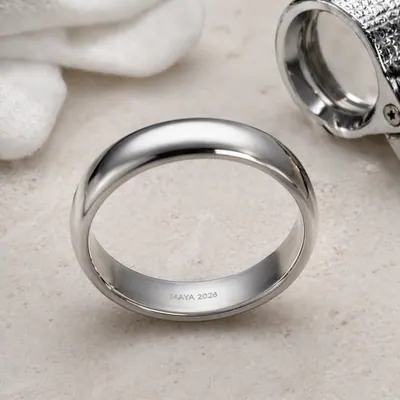</a>

<b>零售微距</b>

<details><summary>📋 完整提示词</summary>

```
Scene:
A square premium e-commerce macro shot on a pale stone jewelry tray, bright but soft, with clean reflections and a practical retail-catalog feeling. The composition should feel ready for a product detail page: centered ring, controlled highlights, and a small jeweler loupe placed nearby but not covering the band. The camera still looks into the inner wall so the engraving area remains visible.

Subject:
Use the referenced ring as the same product and preserve the exact inner-wall inscription "MAYA 2026". The ring should appear freshly cleaned, with the tiny letters inside the band shown as shallow engraving. Add a loupe, white gloves, or tray texture only as secondary context; the micro-inscription remains the hero detail. Keep the ring proportions, visible arc, and text placement consistent with image 01.

Important details:
This version tests commercial usability: the image should look like a realistic custom-jewelry listing where the buyer can verify the exact inscription. The text must be readable at macro scale, not replaced by generic scratches. The engraving should be physically recessed, aligned to the curve, and free of extra characters. Maintain precise metal reflections, clean stone texture, and restrained luxury styling.

Use case:
Micro-Engraved Jewelry series study 4/8, testing whether the reference micro-inscription remains product-page legible in a retail macro setup.

Constraints:
No readable text except the specified phrase "MAYA 2026", no watermark, no logos, preserve exact 1:1 aspect ratio, no brand labels, no printed cards, no price tags, no oversized inscription, no wrong name, no mirror-reversed letters, no clutter hiding the inner wall.
```

</details>

</td>
<td width="33%" valign="top" align="center">

<a href="./works/topics/micro-engraved-jewelry/packages/single-micro-inscription-studies/images/stamp-perforation-message/image.w1600.webp">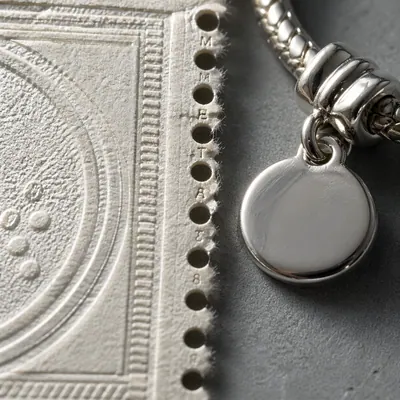</a>

<b>邮票齿孔暗语</b>

<details><summary>📋 完整提示词</summary>

```
Scene:
A square macro still life of an ivory commemorative postage stamp fragment placed beside a silver charm bracelet, photographed on a cool gray archival table. Use raking side light so every perforation hole casts a tiny shadow. The stamp design itself should be abstract and unlettered, with subtle paper fibers and embossed border texture, while the bracelet hints at jewelry customization.

Subject:
Hide a micro message inside the stamp perforation line: the sequence of tiny printed marks between the holes must read "MEET AT 8". The words are extremely small, following the vertical perforated edge like a secret jeweler's inscription. Keep the phrase readable under macro view, but do not add any other postal text, denomination, country name, cancellation mark, or logo. The silver charm nearby may be blank and softly reflected.

Important details:
This is a precision placement challenge: the message must live only in the narrow space around the perforations, using the holes as a rhythm guide. The text should be straight, evenly spaced, and physically integrated into paper ink or shallow embossing, not floating over the scene. Preserve realistic paper fibers, slight torn edges, metal bracelet reflections, and a sophisticated forensic-macro feeling.

Use case:
Micro-Engraved Jewelry single study 8/8, testing readable hidden micro text in stamp perforations paired with a jewelry keepsake context.

Constraints:
No readable text except the specified phrase "MEET AT 8", no watermark, no logos, preserve exact 1:1 aspect ratio, no stamp denomination, no country name, no cancellation text, no extra secret words, no oversized typography, no random perforation marks, no missing holes.
```

</details>

</td>
<td width="33%"></td>
</tr>
</table>

## 微观 × 宏观对比信息图

> 以显微结构和宏观世界的相似纹理为核心，测试科普信息图、写实材质和跨尺度构图。

<table>
<tr>
<td width="33%" valign="top" align="center">

<a href="./works/topics/micro-macro-infographic/packages/single-scale-comparison-studies/images/cell-galaxy-echo/image.w1600.webp"></a>

<b>细胞星系回声</b>

<details><summary>📋 完整提示词</summary>

```
Scene:
A square science-editorial infographic plate with a restrained black background, soft rim lighting, and a precise two-panel layout. The left half is a photorealistic microscope view; the right half is a deep-space telescope-style view. A narrow central bridge contains thin curved comparison lines, small abstract glyph marks, and transparent scale rings, but no readable text. The image should feel like a premium museum exhibit graphic rather than a textbook page.

Subject:
Left panel: a luminous cell culture seen through a microscope, with translucent membranes, branching cytoskeleton fibers, glowing nuclei, and tiny vesicles suspended in fluid. Right panel: a spiral galaxy and surrounding star field with dust lanes, bright core, and faint satellite clusters. The two halves should echo one another: nuclei align with galaxy cores, cytoskeleton threads rhyme with spiral arms, and vesicles rhyme with star clusters.

Important details:
Use a clean vertical split that still feels unified through matching composition, color, and annotation geometry. Add subtle scale ticks, circles, and connector arcs that point from micro features to macro analogues without becoming literal labels. Keep the science-inspired materials plausible: wet cellular translucency on the left, vacuum-dark cosmic depth on the right. The comparison must be instantly legible at thumbnail size and rich under close inspection.

Use case:
Micro-Macro Infographic single study 1/8, comparing cellular structure and galactic structure through shared visual organization.

Constraints:
No readable text, no watermark, no logos, preserve exact 1:1 aspect ratio, no real data claims, no fake labels, no astrology symbols, no medical diagnosis, no chaotic collage, no split-screen mismatch, no overbright neon wash.
```

</details>

</td>
<td width="33%" valign="top" align="center">

<a href="./works/topics/micro-macro-infographic/packages/single-scale-comparison-studies/images/neuron-cosmic-web/image.w1600.webp"></a>

<b>神经元宇宙网</b>

<details><summary>📋 完整提示词</summary>

```
Scene:
A square dark-background infographic with an elegant diagonal comparison layout. The upper-left region shows a microscope-like neural network; the lower-right region shows a cosmic web simulation aesthetic. Between them, translucent overlay lines and small non-readable symbols trace matching branching patterns. Lighting is dramatic but controlled, with cyan, violet, and warm white accents against deep charcoal.

Subject:
The micro side shows neurons suspended in a shallow biological gel: cell bodies, dendrite branches, axon-like cables, synapse dots, and subtle membrane texture. The macro side shows galaxy filaments and voids: bright clusters connected by long luminous threads, with dark empty spaces between them. The central bridge should make the analogy visible by aligning neuron cell bodies with galaxy clusters and dendrites with cosmic filaments.

Important details:
The image must not claim the two systems are scientifically identical; it should present a visual analogy through structured composition. Use consistent branch spacing, matching glow intensity, and clean connector arcs. Include small magnifier circles that crop details from each side, but keep their contents non-textual. The layout should be readable as a high-end science magazine cover: balanced negative space, no clutter, clear hierarchy, and plausible microscopic and astronomical textures.

Use case:
Micro-Macro Infographic single study 2/8, comparing neural branching and the cosmic web as a reasoning-composition challenge.

Constraints:
No readable text, no watermark, no logos, preserve exact 1:1 aspect ratio, no literal brain icon, no astrology, no fake equations, no real patient data, no random neon spaghetti, no overcrowded labels, no claim-style typography.
```

</details>

</td>
<td width="33%" valign="top" align="center">

<a href="./works/topics/micro-macro-infographic/packages/single-scale-comparison-studies/images/stomata-city-grid/image.w1600.webp"></a>

<b>气孔城市网格</b>

<details><summary>📋 完整提示词</summary>

```
Scene:
A square bright editorial infographic on warm off-white background, split into two coordinated panels with a shared geometric grid. The left panel is a macro-microscope view of a leaf surface; the right panel is an aerial city plan at dawn. Fine gray alignment guides, small color-coded dots, and blank caption bars organize the page without readable text. The overall mood is clean, ecological, and architectural.

Subject:
Left panel: a high-detail leaf epidermis with green cells, stomata openings, waxy cuticle texture, and subtle veins visible beneath the surface. Right panel: a city grid with parks, courtyards, streets, rooftops, and small plazas seen from directly above. The stomata openings correspond visually to courtyards and transit hubs, while leaf veins rhyme with green corridors and roads.

Important details:
Make the comparison precise and elegant. Use matching top-down viewpoints on both sides, the same scale of repeated oval and polygon forms, and thin connector lines that cross a central gutter. The left side should feel biologically plausible, with moist cellular texture and organic variation. The right side should feel like a real planned city, not an abstract circuit board. Use muted green, slate, cream, and sunrise gold; keep the infographic readable without literal labels.

Use case:
Micro-Macro Infographic single study 3/8, comparing leaf stomata patterns with city-grid planning through structured visual analogy.

Constraints:
No readable text, no watermark, no logos, preserve exact 1:1 aspect ratio, no real city names, no map labels, no fake street text, no oversimplified leaf cartoon, no circuit-board confusion, no cluttered annotation layer.
```

</details>

</td>
</tr>
<tr>
<td width="33%" valign="top" align="center">

<a href="./works/topics/micro-macro-infographic/packages/single-scale-comparison-studies/images/bone-coral-architecture/image.w1600.webp"></a>

<b>骨骼珊瑚结构</b>

<details><summary>📋 完整提示词</summary>

```
Scene:
A square photorealistic science infographic with a soft studio-gray background and a balanced triptych structure: microscopic bone lattice on the left, central transition column, coral reef architecture on the right. The layout uses thin white dividers, translucent callout circles, and small non-readable glyph marks. Lighting is sculptural and tactile, emphasizing porous material surfaces.

Subject:
Left panel: trabecular bone seen at high magnification, with ivory struts, porous cavities, subtle mineral grain, and realistic shadowing. Right panel: a coral reef wall photographed underwater, with branching coral, porous limestone, small fish silhouettes, and blue water depth. The central transition column blends the two structures as matched load-bearing lattices, showing how voids and struts create strength and habitat.

Important details:
The comparison should be material-driven, not merely decorative. Match pore scale, branching angles, and light direction across both panels. The bone must not look like dead coral, and the coral must remain alive and underwater; the bridge is about architecture and porosity. Use small arrows and magnifier circles to point at analogous voids, arches, and struts without text. Keep the composition calm, premium, and scientifically plausible.

Use case:
Micro-Macro Infographic single study 4/8, comparing trabecular bone structure with coral reef architecture and porous load paths.

Constraints:
No readable text, no watermark, no logos, preserve exact 1:1 aspect ratio, no gore, no medical diagnosis, no dead reef imagery, no fake labels, no chaotic aquarium scene, no low-detail sponge texture, no overlaid paragraphs.
```

</details>

</td>
<td width="33%" valign="top" align="center">

<a href="./works/topics/micro-macro-infographic/packages/single-scale-comparison-studies/images/capillary-river-delta/image.w1600.webp"></a>

<b>毛细血管河口三角洲</b>

<details><summary>📋 完整提示词</summary>

```
Scene:
A square split-panel infographic on a deep blue-black background with luminous red and gold accents. The left side shows a microvascular network under magnification; the right side shows a satellite-like river delta. A central vertical spine contains clean connector arcs, small scale circles, and blank legend blocks. The mood is serious, precise, and cinematic, with high contrast but readable detail.

Subject:
Left panel: branching capillaries in translucent tissue, with red blood cells as tiny discs flowing through thin vessels, soft membrane texture, and realistic depth. Right panel: a river delta seen from high above, with branching channels, sediment fans, marsh islands, and reflective water. The comparison should reveal how fluid transport branches from trunk to fine channels in both biological and geographic systems.

Important details:
Make flow direction visually clear without text: use subtle arrowheads, particle trails, and brightness gradients. Match the branching hierarchy on both sides from thick main channels to fine terminals. Avoid making the capillary side look like a literal map, and avoid making the delta look like veins; each side keeps its own material truth. The central connector system should help viewers understand the analogy in one glance.

Use case:
Micro-Macro Infographic single study 5/8, comparing capillary flow networks with river delta branching in a structured science plate.

Constraints:
No readable text, no watermark, no logos, preserve exact 1:1 aspect ratio, no gore, no medical diagnosis, no fake map labels, no real place names, no blood splatter, no chaotic red-blue abstraction, no unreadable legend text.
```

</details>

</td>
<td width="33%" valign="top" align="center">

<a href="./works/topics/micro-macro-infographic/packages/single-scale-comparison-studies/images/crystal-mountain-range/image.w1600.webp"></a>

<b>晶体山脉</b>

<details><summary>📋 完整提示词</summary>

```
Scene:
A square premium science infographic with a pale mineral-gray background, crisp studio lighting, and a central mirrored composition. The lower-left quadrant shows a microscopic crystal surface; the upper-right quadrant shows an alpine mountain range. Thin diagonal guides, transparent elevation contours, and small non-readable symbols connect matching ridges and facets across the page.

Subject:
Micro side: a close-up crystal lattice surface with faceted transparent quartz, tiny fractures, growth steps, dust-like inclusions, and accurate refraction. Macro side: a snow-covered mountain range with sharp ridgelines, glacial valleys, rock faces, and atmospheric haze. The shared visual idea is faceted geometry: crystal growth planes echo mountain ridges, fracture lines echo valleys, and light glints repeat across scales.

Important details:
Render both materials convincingly: glassy crystal transparency and cold mountain atmosphere should feel physically distinct. Use matching diagonal rhythm rather than identical shapes. Add a few small cross-section slices and contour-like rings as visual explanation, but no words. The composition should feel like a philosophical science poster: beautiful, clear, and disciplined. Avoid overdecorating with fantasy sparkles or making the mountains look like gemstones.

Use case:
Micro-Macro Infographic single study 6/8, comparing crystal growth facets with mountain range geometry and material light behavior.

Constraints:
No readable text, no watermark, no logos, preserve exact 1:1 aspect ratio, no fake geological labels, no fantasy magic crystals, no impossible floating mountains, no chaotic shards, no glitter overload, no text-heavy poster layout.
```

</details>

</td>
</tr>
<tr>
<td width="33%" valign="top" align="center">

<a href="./works/topics/micro-macro-infographic/packages/single-scale-comparison-studies/images/skin-desert-dunes/image.w1600.webp">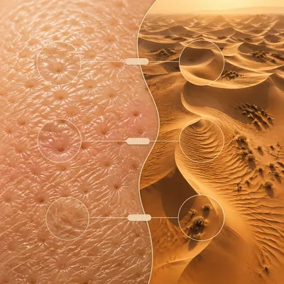</a>

<b>皮肤沙丘</b>

<details><summary>📋 完整提示词</summary>

```
Scene:
A square warm-toned editorial infographic with a soft beige background, divided by a gentle S-shaped comparison boundary. The left side is a macro skin-surface close-up under scientific lighting; the right side is an aerial desert dune landscape at sunset. Fine contour lines, small blank callout tabs, and transparent circles tie the two halves together without readable text.

Subject:
Left panel: detailed human skin texture at very close range, showing pores, fine ridges, soft peach fuzz, subtle oil highlights, and natural color variation. Right panel: desert dunes from above, with wind-carved ridges, shadowed troughs, small dry shrubs, and golden sand gradients. The shared visual language is surface topology: pore depressions echo dune basins, skin ridges echo sand ripples, and fine hairs echo sparse desert vegetation.

Important details:
Keep the comparison respectful and scientific, not cosmetic advertising. The skin should look natural and healthy, not medical or glamor retouched. The desert should feel vast but organized, not a random sand texture. Use contour overlays and matched light direction to reveal surface physics. The image should be calm, tactile, and visually obvious as a micro-macro topology comparison.

Use case:
Micro-Macro Infographic single study 7/8, comparing skin microtopography with desert dune formations through surface pattern reasoning.

Constraints:
No readable text, no watermark, no logos, preserve exact 1:1 aspect ratio, no beauty-product branding, no medical diagnosis, no wounds, no glamour portrait, no fake map labels, no repetitive sand wallpaper, no intrusive text blocks.
```

</details>

</td>
<td width="33%" valign="top" align="center">

<a href="./works/topics/micro-macro-infographic/packages/single-scale-comparison-studies/images/diatom-space-station/image.w1600.webp"></a>

<b>硅藻太空站</b>

<details><summary>📋 完整提示词</summary>

```
Scene:
A square high-contrast science concept infographic with a deep navy background and precise white line overlays. The left panel shows a microscopic diatom shell; the right panel shows a large orbital space station ring. A central transparent blueprint layer connects structural ribs, holes, and radial geometry. The layout feels like a museum wall graphic combining microscopy, engineering, and cosmic scale.

Subject:
Left panel: a diatom silica shell under microscope lighting, with delicate glass lattice, radial pores, ribbed geometry, and slight iridescent edges. Right panel: a speculative but believable circular space station with habitat modules, truss ribs, docking arms, solar panels, and small lights against Earth glow. The comparison highlights how lightweight perforated structures can be strong: diatom lattice pores echo station modules and truss openings.

Important details:
Make both sides materially distinct: translucent biological glass on the left, engineered metal and solar panels on the right. Use clean radial alignment so the viewer sees the shared geometry immediately. Include small blueprint circles, ghosted cross-sections, and connector arcs, but no readable text. The station should not copy any real spacecraft; it should feel plausible and original. Keep the composition structured and visually spectacular without becoming a sci-fi poster.

Use case:
Micro-Macro Infographic single study 8/8, comparing diatom shell architecture with orbital station engineering through radial structural logic.

Constraints:
No readable text, no watermark, no logos, preserve exact 1:1 aspect ratio, no real agency marks, no real mission names, no fake labels, no weaponized spacecraft, no chaotic blueprint clutter, no cartoon microscope style, no generic starfield-only background.
```

</details>

</td>
<td width="33%"></td>
</tr>
</table>

## Mirror Worlds · 同角色跨时空同框

> Mirror Worlds · 同角色跨时空同框：同一个人从小到老同时出现在同一空间的不同角落，测试身份一致性和时空拼接。

<table>
<tr>
<td width="33%" valign="top" align="center">

<a href="./works/topics/mirror-worlds/packages/series-life-stage-living-room/images/01-reference-age-sheet/image.w1600.webp"></a>

<b>年龄谱参考图</b>

<details><summary>📋 完整提示词</summary>

```
Scene:
A square studio character reference sheet on a quiet neutral background, arranged as eight portrait-and-half-body studies in a clean 4 by 2 grid with no captions. Use soft editorial lighting, restrained warm gray tones, and consistent camera height. The image should feel like a production reference board for a conceptual film about one life seen all at once.

Subject:
Show the same woman at eight life stages: small child, preteen, teenager, young adult, mid-career adult, older adult, elderly, and very elderly. Preserve identity through the same almond-shaped eyes, straight nose bridge, left cheek dimple, dark hair that gradually grays, and a small red scarf or scarf-like accessory repeated in age-appropriate ways. Clothing changes by decade, but posture, facial structure, and signature gaze stay clearly related.

Important details:
This reference must make age progression legible without turning the person into eight unrelated characters. Keep face proportions consistent, show natural aging, avoid glamour extremes, and make the red accessory a reliable identity anchor. Background, lighting, and crop should be consistent across all eight panels so later images can use the sheet as a stable multi-age reference.

Use case:
Mirror Worlds series study 1/8, establishing the protagonist identity across eight life stages for fanout compositions.

Constraints:
No readable text, no watermark, no logos, preserve exact 1:1 aspect ratio, no celebrity likeness, no duplicate identical faces, no unrelated family members, no inconsistent eye color, no distorted hands, no decorative labels.
```

</details>

</td>
<td width="33%" valign="top" align="center">

<a href="./works/topics/mirror-worlds/packages/single-temporal-mirror-studies/images/childhood-office-echo/image.w1600.webp"></a>

<b>童年办公室回声</b>

<details><summary>📋 完整提示词</summary>

```
Scene:
A square cinematic office at night, seen from a calm three-quarter angle. The room has a desk, a soft desk lamp, tall windows with city lights, shelves, a wall mirror, and a polished floor reflection. Use deep navy shadows, warm amber lamp light, and controlled negative space so multiple figures remain easy to read.

Subject:
Show the same man at four life stages sharing the office: child sitting under the desk with a sketchbook, teenager leaning against the window, adult working at the desk, and elderly version reflected in the wall mirror. Preserve identity through the same broad brow, round eyes, slight gap-toothed smile, and a blue cardigan motif adapted across ages. Each version should feel physically present or reflected in the same room, not pasted from separate images.

Important details:
The emotional concept is a person surrounded by earlier and later selves while making a decision. Keep the office geometry coherent, with reflections and shadows obeying the room. Age differences should be clear but connected through facial structure, posture echoes, and the blue clothing motif. The composition should feel like one surreal photograph with cinematic polish.

Use case:
Mirror Worlds single study 5/8, testing same-person age consistency and mirror logic in an office scene without references.

Constraints:
No readable text, no watermark, no logos, preserve exact 1:1 aspect ratio, no extra coworkers, no readable documents, no horror tone, no inconsistent facial traits, no broken mirror perspective, no cluttered desk pile.
```

</details>

</td>
<td width="33%" valign="top" align="center">

<a href="./works/topics/mirror-worlds/packages/series-life-stage-living-room/images/02-eight-ages-living-room/image.w1600.webp"></a>

<b>八个年龄的客厅</b>

<details><summary>📋 完整提示词</summary>

```
Scene:
Use the reference age sheet as the identity source. Create a square cinematic living room scene viewed from a slightly elevated corner, with warm late-afternoon window light, a polished wooden floor, bookshelves, a sofa, a small round table, and quiet domestic objects. The room should be one continuous space, not a panel grid, with clear depth layers and eight readable positions.

Subject:
Place the same woman at eight life stages in different corners of the same living room: child drawing on the rug, preteen reading near the window, teenager leaning by the shelf, young adult carrying a suitcase, mid-career adult at the table, older adult watering a plant, elderly woman seated on the sofa, and very elderly woman near a mirror. Preserve the facial identity, cheek dimple, gaze, and red scarf motif from the reference while adapting age, clothing, and posture naturally.

Important details:
The core illusion is simultaneous time. Each age must feel physically present in the same room, with believable shadows, consistent scale, and no ghost transparency. Use composition to keep the eight figures separate but emotionally connected through sightlines and reflected glances. The living room should remain coherent and not collapse into a collage.

Use case:
Mirror Worlds series study 2/8, placing the same protagonist's eight life stages into one shared living room.

Constraints:
No readable text, no watermark, no logos, preserve exact 1:1 aspect ratio, no unrelated characters, no panel borders, no duplicated exact pose, no broken reflections, no inconsistent facial identity, no clutter blocking the figures.
```

</details>

</td>
</tr>
<tr>
<td width="33%" valign="top" align="center">

<a href="./works/topics/mirror-worlds/packages/single-temporal-mirror-studies/images/subway-platform-ages/image.w1600.webp"></a>

<b>地铁站台年龄线</b>

<details><summary>📋 完整提示词</summary>

```
Scene:
A square underground subway platform rendered as a polished editorial image, viewed along the platform edge with strong perspective lines, glossy floor reflections, cool fluorescent light, and a train window acting as a long horizontal mirror. The space is clean and cinematic, with no readable signage or route information.

Subject:
Show the same woman at five life stages distributed along the platform: small child holding a folded coat, teenager listening quietly, young adult with a travel bag, middle-aged adult looking into the train window, and elderly version reflected inside the dark glass. Preserve identity through the same high cheekbones, dark arched brows, short chin, and mustard yellow coat motif adapted by age. Each version should appear at a different depth point while still reading as one person across time.

Important details:
The subway platform must behave like one continuous architectural space. Reflections in the train window and floor should be plausible, with no duplicate bodies in impossible places. The time-split should be obvious through pose, scale, age, and costume changes, not through text. Keep facial continuity stronger than clothing differences.

Use case:
Mirror Worlds single study 6/8, testing life-stage identity consistency along a reflective subway platform without references.

Constraints:
No readable text, no watermark, no logos, preserve exact 1:1 aspect ratio, no crowded commuters, no route numbers, no advertising posters, no inconsistent face, no train-brand marks, no warped platform geometry.
```

</details>

</td>
<td width="33%" valign="top" align="center">

<a href="./works/topics/mirror-worlds/packages/series-life-stage-living-room/images/03-mirror-hall-reunion/image.w1600.webp"></a>

<b>镜厅重逢</b>

<details><summary>📋 完整提示词</summary>

```
Scene:
Use the reference age sheet as the identity source. Create a square hall of mirrors inside a quiet apartment, with a central hallway, tall antique mirrors along both sides, warm ceiling light, and a dark polished floor that reflects feet and furniture. The camera looks straight down the hallway so reflections create a deep recursive space.

Subject:
Show the same woman at multiple life stages meeting through mirrors: young adult standing in the center foreground, child version visible in the left mirror, teenager in the right mirror, mid-career adult reflected farther back, elderly version at the end of the hall, and very elderly version seated in a mirror reflection near the floor. Preserve the same facial structure, cheek dimple, red scarf motif, and calm direct gaze from the reference, while each age has distinct clothing and posture.

Important details:
The mirror logic must be coherent. Reflections should obey perspective, show believable angles, and not become random portraits pasted onto glass. Some figures may be physically in the hall while others appear only as reflections, but all must feel like the same person across time. Keep the scene emotionally charged, elegant, and visually legible at thumbnail scale.

Use case:
Mirror Worlds series study 3/8, using mirror reflections to stage one protagonist's life stages in a single hallway.

Constraints:
No readable text, no watermark, no logos, preserve exact 1:1 aspect ratio, no unrelated people, no horror mood, no broken mirror shards, no impossible duplicate limbs, no inconsistent face, no decorative captions.
```

</details>

</td>
<td width="33%" valign="top" align="center">

<a href="./works/topics/mirror-worlds/packages/single-temporal-mirror-studies/images/wedding-mirror-room/image.w1600.webp"></a>

<b>婚礼镜室</b>

<details><summary>📋 完整提示词</summary>

```
Scene:
A square dressing room before a wedding, softly lit by large windows and surrounded by three tall mirrors. The palette is ivory, pale gold, muted rose, and deep walnut wood. The room is elegant but quiet, with chairs, fabric, a vanity, and a large central mirror creating nested reflections. No visible writing or brand details.

Subject:
Show the same person across five emotional life moments in one dressing room: child version peeking from behind fabric, young adult adjusting formal clothing, present-day adult standing before the mirror, older adult seated by the vanity, and elderly version appearing in a far mirror reflection. Preserve identity through the same oval face, gentle downturned eyes, small mole above the lip, and pearl-like collar detail repeated in age-appropriate styling. Clothing can shift from simple childhood clothes to formal wedding attire and later elegant dresswear.

Important details:
The image should feel celebratory and uncanny, not sentimental clutter. Mirrors must show coherent angles and partial reflections, while each age stage remains readable. Maintain one consistent facial identity through age changes, with the mole and collar detail as anchors. Use light and gesture to connect the versions across the room.

Use case:
Mirror Worlds single study 7/8, testing a high-emotion life-stage mirror composition without reference images.

Constraints:
No readable text, no watermark, no logos, preserve exact 1:1 aspect ratio, no extra wedding guests, no celebrity likeness, no horror mirror effect, no inconsistent facial markers, no impossible reflection angles.
```

</details>

</td>
</tr>
<tr>
<td width="33%" valign="top" align="center">

<a href="./works/topics/mirror-worlds/packages/series-life-stage-living-room/images/04-seasonal-apartment-loop/image.w1600.webp"></a>

<b>四季公寓时间环</b>

<details><summary>📋 完整提示词</summary>

```
Scene:
Use the reference age sheet as the identity source. Create a square apartment interior divided by lighting and window views into four seasonal zones while remaining one continuous room. Morning spring light enters from the left, summer noon warms the center, autumn dusk glows near the sofa, and winter blue light appears near the far window. No hard panel borders; the seasons blend through furniture, shadows, and color temperature.

Subject:
Place the same woman at eight ages across the seasonal apartment loop: childhood and preteen near spring plants, teenage and young adult in the bright summer area, mid-career and older adult near autumn books and warm lamps, elderly and very elderly near winter window light. Preserve the facial identity, left cheek dimple, red scarf motif, and eye shape from the reference. Each life stage interacts with the same room in age-appropriate ways without looking like separate photo cutouts.

Important details:
This image tests temporal reasoning through environment. The room geometry must stay continuous even as seasons shift. Figures should cast shadows consistent with their local light zone, but furniture perspective must remain unified. Make the time split poetic and understandable, with no literal labels or calendars. The same protagonist must be recognizable through aging.

Use case:
Mirror Worlds series study 4/8, merging eight life stages and four seasons into one continuous apartment world.

Constraints:
No readable text, no watermark, no logos, preserve exact 1:1 aspect ratio, no panel grid, no unrelated characters, no random costume changes, no impossible scale shifts, no inconsistent identity, no chaotic background clutter.
```

</details>

</td>
<td width="33%" valign="top" align="center">

<a href="./works/topics/mirror-worlds/packages/single-temporal-mirror-studies/images/rooftop-time-split/image.w1600.webp"></a>

<b>屋顶时间切片</b>

<details><summary>📋 完整提示词</summary>

```
Scene:
A square rooftop at twilight, high above a city, composed as one continuous terrace split by changing sky colors: cool dawn blue on the left, bright afternoon near the center, amber sunset on the right, and deep night reflections in a glass door. Use cinematic realism, clean architectural lines, and reflective puddles after rain.

Subject:
Show the same man at six life stages on the rooftop: child near a low wall, teenager sitting on the parapet, young adult holding a jacket, adult standing near the glass door, older adult watering rooftop plants, and elderly version reflected in the wet floor. Preserve identity through the same square jaw, thick brows, close-set eyes, and burgundy scarf motif adapted across ages. The figures should occupy separate zones but share one terrace geometry.

Important details:
The time split is environmental as well as human. Lighting changes should signal different eras without breaking perspective or turning the image into panels. Keep all ages physically grounded with believable shadows and reflections. The city skyline can shift subtly in mood, but no readable signs should appear. Facial identity must remain consistent enough that the concept is clear immediately.

Use case:
Mirror Worlds single study 8/8, testing simultaneous age stages and time-of-day zones in one rooftop scene.

Constraints:
No readable text, no watermark, no logos, preserve exact 1:1 aspect ratio, no extra people, no superhero styling, no impossible rooftop scale, no inconsistent facial identity, no harsh panel dividers, no skyline text.
```

</details>

</td>
<td width="33%"></td>
</tr>
</table>

## 多时代 Album Cover 专辑封面合集

> 测试同一音乐概念在 1960s 民谣、1970s 摇滚、1980s synthwave、1990s grunge、2000s emo、2020s hyperpop 等时代视觉中的重新演绎。

<table>
<tr>
<td width="33%" valign="top" align="center">

<a href="./works/topics/multi-era-album-covers/packages/single-era-cover-sets/images/lunar-motel-set/image.w1600.webp"></a>

<b>月球汽车旅馆合集</b>

<details><summary>📋 完整提示词</summary>

```
Scene:
A square commercial mockup showing six fictional vinyl album covers arranged in a precise 2 by 3 grid on a neutral studio wall. Each cover is a separate square sleeve with slight paper thickness, realistic print grain, and subtle shadows. The shared concept is Lunar Motel, a lonely roadside motel under a moonlit sky, reinterpreted across six music eras without any readable title text.

Subject:
Panel 1: 1960s folk, warm muted photograph of a motel sign silhouette, acoustic intimacy, dusty cream border. Panel 2: 1970s rock, high-contrast stage-like motel neon, grainy analog color, dramatic clouds. Panel 3: 1980s synthwave, magenta moon, cyan grid road, chrome motel geometry. Panel 4: 1990s grunge, scratched photocopy texture, desaturated motel room door, torn edges. Panel 5: 2000s emo, rain-streaked window, black-red palette, intimate bedroom framing. Panel 6: 2020s hyperpop, glossy surreal moon-motel collage, saturated candy colors, warped 3D reflections.

Important details:
All six covers must clearly share the same motel and moon motif while changing era-specific visual language, print process, palette, texture, and composition. Keep them as believable album sleeves, not posters or UI cards. Use cover-like margins, central imagery, and commercial mockup lighting. No actual band names, album titles, labels, stickers, or readable type; let the visual era cues carry the concept.

Use case:
Multi-Era Album Covers single study 1/8, testing six-era style transfer on one fictional album concept.

Constraints:
No readable text, no watermark, no logos, preserve exact 1:1 aspect ratio, no real artists, no record label marks, no famous album references, no duplicated panel, no random typography, no UI screenshots, no messy collage outside the six covers.
```

</details>

</td>
<td width="33%" valign="top" align="center">

<a href="./works/topics/multi-era-album-covers/packages/single-era-cover-sets/images/desert-signal-set/image.w1600.webp"></a>

<b>沙漠信号合集</b>

<details><summary>📋 完整提示词</summary>

```
Scene:
A square gallery mockup of six fictional album sleeves in a 2 by 3 grid, photographed straight-on with soft even lighting. The common concept is Desert Signal: a mysterious radio transmission crossing an empty desert at night. Each cover should look commercially plausible as a record sleeve from a different era, but none should contain readable text.

Subject:
The 1960s folk cover uses faded earth tones, a lone antenna beside an acoustic desert camp, and hand-developed photo warmth. The 1970s rock cover uses a low desert horizon, red sun, amplifier stacks, and heavy film grain. The 1980s synthwave cover uses purple dunes, neon waveform arcs, and geometric star grids. The 1990s grunge cover uses distressed xerox texture, broken radio parts, and muddy beige-black contrast. The 2000s emo cover uses a lonely payphone-like silhouette, blue night rain, and torn diary collage texture. The 2020s hyperpop cover uses glossy 3D sand, chrome antenna shards, and electric cyan-pink signal waves.

Important details:
Six panels must share antenna, desert, night sky, and signal-wave motifs while showing distinct decade design logic. Make era style apparent through color science, print texture, object styling, and composition, not text labels. Keep all covers aligned, equal size, and physically printed with sleeve shadows and paper grain.

Use case:
Multi-Era Album Covers single study 2/8, testing era-specific music visual language on the Desert Signal concept.

Constraints:
No readable text, no watermark, no logos, preserve exact 1:1 aspect ratio, no real album art, no famous musicians, no label stickers, no readable waveform labels, no sci-fi movie poster text, no random letters, no repeated identical cover.
```

</details>

</td>
<td width="33%" valign="top" align="center">

<a href="./works/topics/multi-era-album-covers/packages/single-era-cover-sets/images/glass-garden-set/image.w1600.webp"></a>

<b>玻璃花园合集</b>

<details><summary>📋 完整提示词</summary>

```
Scene:
A square studio presentation of six album-cover mockups laid out as a clean 2 by 3 wall grid. The shared fictional album concept is Glass Garden: plants growing inside transparent architecture. The mockup should feel like a design portfolio spread, with real printed sleeves, slight gloss variation, and consistent cover dimensions.

Subject:
1960s folk: soft analog photo of a greenhouse, wildflowers, muted green and cream, handmade quietness. 1970s rock: dramatic backlit conservatory, dense vines, smoky amber stage mood, bold contrast. 1980s synthwave: glass palmhouse rendered as neon wireframe, magenta sky, cyan reflections, geometric floor. 1990s grunge: scratched botanical collage, cracked greenhouse panes, xerox gray-green decay. 2000s emo: rain on glass, wilted flowers, black teal palette, intimate melancholic close-up. 2020s hyperpop: liquid glass blossoms, iridescent greenhouse, glossy 3D petals, saturated digital color.

Important details:
All six panels must preserve the glass-garden motif while showing clear changes in decade-specific cover design, print texture, palette, and image-making technology. Use no readable text; composition and visual grammar should imply album sleeves. Keep the covers separate, equal, and physically plausible with paper edges, subtle reflections, and shadows. Avoid referencing any real band, album, or label.

Use case:
Multi-Era Album Covers single study 3/8, testing one botanical-glass concept across six album-design eras.

Constraints:
No readable text, no watermark, no logos, preserve exact 1:1 aspect ratio, no real album references, no brand marks, no typography fragments, no identical panels, no gallery labels, no random QR codes, no extra covers outside the six-panel grid.
```

</details>

</td>
</tr>
<tr>
<td width="33%" valign="top" align="center">

<a href="./works/topics/multi-era-album-covers/packages/single-era-cover-sets/images/city-rain-set/image.w1600.webp"></a>

<b>城市雨夜合集</b>

<details><summary>📋 完整提示词</summary>

```
Scene:
A square record-store display mockup with six fictional album covers arranged in a precise 2 by 3 grid on a dark gray wall. The shared concept is City Rain: urban loneliness, reflections, and wet pavement. Each cover has sleeve thickness, print grain, and a believable album-art finish, with no readable text anywhere.

Subject:
The 1960s folk cover shows a solitary figure with guitar case under a rainy streetlamp, muted brown film warmth. The 1970s rock cover shows wet asphalt, taxi headlights, smoke, and high-contrast stage-poster energy without text. The 1980s synthwave cover shows neon skyscraper reflections, magenta puddles, cyan grid perspective. The 1990s grunge cover shows torn photocopy rain texture, underpass concrete, muddy green-gray palette. The 2000s emo cover shows a bedroom window overlooking rain, black-blue palette, intimate collage edges. The 2020s hyperpop cover shows glossy chrome umbrellas, impossible reflective puddles, saturated glitchy color.

Important details:
The same visual motif should connect every panel: rain streaks, city reflection, isolation, and wet light. Era differences must appear through photographic texture, color grading, graphic composition, and material finish. Keep covers equally sized and separated by clean gutters. No readable type, no band names, no real cities or famous skyline references; the visual language alone should suggest album covers.

Use case:
Multi-Era Album Covers single study 4/8, testing urban-rain album art across six music eras.

Constraints:
No readable text, no watermark, no logos, preserve exact 1:1 aspect ratio, no real artist likeness, no famous album homage, no street signs, no license plates, no random text fragments, no UI panels, no duplicate compositions.
```

</details>

</td>
<td width="33%" valign="top" align="center">

<a href="./works/topics/multi-era-album-covers/packages/single-era-cover-sets/images/velvet-comet-set/image.w1600.webp"></a>

<b>天鹅绒彗星合集</b>

<details><summary>📋 完整提示词</summary>

```
Scene:
A square commercial mockup showing six fictional album sleeves on a velvet-covered tabletop, arranged in two rows of three and photographed from a gentle overhead angle. The shared concept is Velvet Comet: a soft cosmic object crossing an intimate night sky. Each sleeve has its own era-specific print treatment while remaining part of one coherent set.

Subject:
1960s folk: hand-tinted comet over a quiet hill, warm sepia, paper softness. 1970s rock: fiery comet above a stage-like horizon, heavy contrast, analog airbrush drama. 1980s synthwave: neon comet trail, violet grid sky, chrome star forms. 1990s grunge: photocopied comet smear, torn black paper, dirty silver textures. 2000s emo: close-up of a bedroom ceiling with comet light through curtains, midnight blue and burgundy. 2020s hyperpop: plush comet made of glossy velvet and digital sparkles, saturated pink-blue, playful surreal 3D.

Important details:
The comet motif must remain identifiable in all six panels, but each era should use a different production grammar: folk photo warmth, rock drama, synth geometry, grunge damage, emo intimacy, hyperpop gloss. Keep the sleeves physically printed, with paper texture, edges, and shadows. Do not place titles or artist names on the covers; avoid any actual album references.

Use case:
Multi-Era Album Covers single study 5/8, testing a cosmic album concept through six era-specific visual languages.

Constraints:
No readable text, no watermark, no logos, preserve exact 1:1 aspect ratio, no real musicians, no record label marks, no famous cover composition, no space agency logos, no readable stickers, no duplicated era, no extra sleeve outside the grid.
```

</details>

</td>
<td width="33%" valign="top" align="center">

<a href="./works/topics/multi-era-album-covers/packages/single-era-cover-sets/images/paper-tigers-set/image.w1600.webp"></a>

<b>纸老虎合集</b>

<details><summary>📋 完整提示词</summary>

```
Scene:
A square art-direction board of six fictional album covers in a 2 by 3 grid, mounted with tiny blank clips on a studio wall. The shared concept is Paper Tigers: fragile courage, cut paper animals, and rebellious energy. The covers should look like finished commercial sleeve designs from different music eras, with no readable typography.

Subject:
1960s folk: hand-cut paper tiger beside an acoustic guitar shadow, warm craft-paper palette. 1970s rock: roaring torn-paper tiger with stage lights and red-orange collage grit. 1980s synthwave: origami tiger in neon grid space, cyan-magenta paper folds. 1990s grunge: photocopied tiger stencil, ripped newsprint textures without readable words, muddy black-white contrast. 2000s emo: notebook-paper tiger silhouette, dark room, red thread and torn edges. 2020s hyperpop: glossy 3D paper tiger with sticker-like layers, saturated colors, playful glitch shapes.

Important details:
Maintain the paper tiger motif across all panels while shifting era aesthetics, print texture, and emotional tone. Paper material should stay visible: folds, cuts, torn edges, fibers, shadow layers, and collage seams. The six covers must be equal in size, clearly separated, and physically mounted. Avoid legible newspaper snippets, real band references, or literal album titles.

Use case:
Multi-Era Album Covers single study 6/8, testing era style transfer on a paper-collage album concept.

Constraints:
No readable text, no watermark, no logos, preserve exact 1:1 aspect ratio, no real album names, no readable newspaper fragments, no famous tiger logo, no duplicate cover, no extra paper notes, no UI panels, no clutter that hides the six-cover grid.
```

</details>

</td>
</tr>
<tr>
<td width="33%" valign="top" align="center">

<a href="./works/topics/multi-era-album-covers/packages/single-era-cover-sets/images/ocean-static-set/image.w1600.webp"></a>

<b>海洋静电合集</b>

<details><summary>📋 完整提示词</summary>

```
Scene:
A square record-label pitch mockup with six fictional album covers placed on a pale tabletop in a precise 2 by 3 grid. The shared concept is Ocean Static: sea foam, radio noise, and distant signals. The physical sleeves should show slight paper warping, matte and glossy finishes, and soft contact shadows.

Subject:
1960s folk: quiet shoreline photo, washed-out blue, handmade melancholy. 1970s rock: crashing wave with amplifier-like black shapes, gritty high contrast. 1980s synthwave: neon ocean horizon, waveform grid, violet and cyan glow. 1990s grunge: distorted photocopy surf, scratched tape noise, gray-green decay. 2000s emo: close-up of headphones by a rainy window, ocean reflection, black navy palette. 2020s hyperpop: iridescent foam bubbles, liquid chrome waveforms, saturated digital distortion.

Important details:
Every panel must share ocean plus static motifs, but each should look native to its decade. Distinguish eras through image texture, palette, composition, sleeve finish, and graphic rhythm. Keep the six covers aligned and commercially plausible. Do not use readable text, band logos, real wave photographs recognizable from known covers, or labels. The 2020s panel may be surreal, but it must still read as an album sleeve.

Use case:
Multi-Era Album Covers single study 7/8, testing music-era style transfer with sea and signal-noise motifs.

Constraints:
No readable text, no watermark, no logos, preserve exact 1:1 aspect ratio, no real artist references, no label stickers, no readable waveform numbers, no famous cover homage, no extra covers, no split-screen UI, no muddy panel boundaries.
```

</details>

</td>
<td width="33%" valign="top" align="center">

<a href="./works/topics/multi-era-album-covers/packages/single-era-cover-sets/images/neon-orchard-set/image.w1600.webp"></a>

<b>霓虹果园合集</b>

<details><summary>📋 完整提示词</summary>

```
Scene:
A square contemporary design review mockup showing six fictional album covers in a rigid 2 by 3 grid, each printed as a separate sleeve with subtle edge shadows. The shared concept is Neon Orchard: fruit trees, night lights, and synthetic sweetness. The wall and lighting are neutral so the era differences become the focus.

Subject:
1960s folk: hand-tinted orchard photograph, warm dusk, acoustic pastoral mood. 1970s rock: overripe fruit under harsh stage lights, smoky reds and oranges, bold analog contrast. 1980s synthwave: neon apple trees on a perspective grid, violet sky, cyan laser-like branches. 1990s grunge: torn orchard photo collage, dirty photocopy texture, muted green-brown palette. 2000s emo: lonely tree outside a bedroom window, black purple night, falling fruit as melancholic symbols. 2020s hyperpop: glossy translucent fruit, chrome branches, candy neon gradients, playful synthetic surfaces.

Important details:
All six covers must share fruit tree, night light, and synthetic sweetness motifs while translating them into different music-era design languages. Keep the album sleeves equal size, physically printed, and free of readable type. Use era-appropriate print grain, photo treatment, collage damage, geometry, and glossy digital surfaces. Avoid real artist references or logo-like fruit symbols.

Use case:
Multi-Era Album Covers single study 8/8, testing era shifts for one bright orchard album concept.

Constraints:
No readable text, no watermark, no logos, preserve exact 1:1 aspect ratio, no real brand fruit icons, no album titles, no artist names, no label marks, no repeated panels, no UI elements, no chaotic layout, no readable stickers.
```

</details>

</td>
<td width="33%"></td>
</tr>
</table>

## 多脚本同屏海报(4-9 语言)

> 多脚本同屏海报：在菜单、议程、机场指示等场景中测试中、日、韩、阿拉伯、印地、梵文等非拉丁文字的同屏排版。

<table>
<tr>
<td width="33%" valign="top" align="center">

<a href="./works/topics/multi-script-poster/packages/single-global-script-posters/images/01-market-menu-wall/image.w1600.webp"></a>

<b>市场菜单墙</b>

<details><summary>📋 完整提示词</summary>

```
Scene:
A square front-facing commercial poster photographed as a clean wall-mounted menu board inside a bright international food hall. Use crisp studio lighting, a neutral off-white wall, subtle metal clips, and a disciplined grid with generous margins. The color palette should mix charcoal ink, warm tomato red, jade green, and small brass dividers, with enough contrast for every script block to be readable.

Subject:
A multilingual market menu titled by visual hierarchy rather than brand identity: six equal menu panels arranged in two columns and three rows. Each panel contains one large dish name and two short price-like glyph groups rendered in a different writing system: simplified Chinese, Japanese kana/kanji, Korean hangul, Arabic, Devanagari Hindi, and Sanskrit-style Devanagari. Keep the panels visually parallel so the viewer can compare script density, baseline rhythm, and spacing.

Important details:
The core test is non-Latin text rendering inside a strict commercial layout. Letterforms must be clean, separated by script family, aligned to their own baselines, and not melt into decorative marks. Use real-looking menu typography with consistent padding, thin rules, small food icons, and clear typographic hierarchy. Avoid fake brand marks; make the poster feel usable as a food hall production proof.

Use case:
Multi-Script Poster single study 1/8, testing a dense six-language menu board with readable script blocks and stable grid alignment.

Constraints:
No readable text outside the specified multilingual menu copy, no watermark, no logos, preserve exact 1:1 aspect ratio, no Latin fallback labels, no random extra characters, no mirrored scripts, no misshapen baselines, no smeared letter clusters, no fake QR codes.
```

</details>

</td>
<td width="33%" valign="top" align="center">

<a href="./works/topics/multi-script-poster/packages/single-global-script-posters/images/02-un-assembly-agenda/image.w1600.webp"></a>

<b>大会日程</b>

<details><summary>📋 完整提示词</summary>

```
Scene:
A square editorial poster laid flat on a conference registration desk, seen from a slight overhead angle but still readable. The paper is heavy matte stock with quiet institutional colors: deep blue, white, black, pale cyan, and a restrained red accent. Use even daylight, crisp edges, and a professional international-organization design language without using any real emblem.

Subject:
A mock global assembly agenda poster divided into a top title band, a central schedule matrix, and a bottom row of language notes. The visible copy appears in seven writing systems: Chinese, Japanese, Korean, Arabic, Hindi Devanagari, Sanskrit Devanagari, and Cyrillic. The schedule matrix uses repeated time-slot shapes, room icons, and short session-title lines; each language area must remain internally coherent and visually distinct.

Important details:
The hard part is maintaining readable, aligned multi-script typography across a serious editorial grid. Use fine rules, table cells, column headers, section markers, and icon bullets that support the text rather than competing with it. Scripts should have proper direction behavior where relevant, especially Arabic right-to-left alignment. No text should collapse into texture. Make the hierarchy obvious: title, day label, agenda rows, secondary notes, and footer metadata.

Use case:
Multi-Script Poster single study 2/8, testing a multilingual international agenda with many small text zones and formal hierarchy.

Constraints:
No readable text outside the specified multilingual agenda copy, no watermark, no logos, preserve exact 1:1 aspect ratio, no real United Nations seal, no country flags, no random Latin filler, no mirrored Arabic, no broken table geometry, no illegible microtext pretending to be content.
```

</details>

</td>
<td width="33%" valign="top" align="center">

<a href="./works/topics/multi-script-poster/packages/single-global-script-posters/images/03-airport-wayfinding-grid/image.w1600.webp"></a>

<b>机场导视网格</b>

<details><summary>📋 完整提示词</summary>

```
Scene:
A square photorealistic mockup of an airport wayfinding sign cluster mounted above a polished terminal corridor. View it straight-on from passenger eye level so the panels are legible. Lighting is bright, clean, and slightly cool, with glass reflections kept subtle. Use black sign panels, white pictograms, amber route highlights, and disciplined spacing.

Subject:
A modular wayfinding grid for arrivals, transfers, baggage, gates, prayer room, medical help, and ground transport. Each destination appears as a matched row containing a pictogram, an arrow, and four non-Latin script versions: Chinese, Arabic, Hindi Devanagari, and Korean. Add two smaller side panels using Japanese and Thai-style scripts for service notices. The layout should feel like a real airport sign system, with exact alignment and consistent icon size.

Important details:
This image tests multi-script public signage under realistic viewing constraints. Arabic must align right-to-left inside its own text zone while the overall sign grid stays orderly. Chinese, Korean, Japanese, and Devanagari letterforms should be crisp enough to inspect, not decorative marks. Keep arrows unambiguous, pictograms familiar, row spacing regular, and panel seams clean. The terminal background must not distract from the sign typography.

Use case:
Multi-Script Poster single study 3/8, testing airport-scale wayfinding with multilingual text, icons, arrows, and readable distance hierarchy.

Constraints:
No readable text outside the specified multilingual wayfinding copy, no watermark, no logos, preserve exact 1:1 aspect ratio, no real airport names, no airline brands, no flags, no random Latin abbreviations, no backwards arrows, no distorted pictograms, no script mixing inside a single language row.
```

</details>

</td>
</tr>
<tr>
<td width="33%" valign="top" align="center">

<a href="./works/topics/multi-script-poster/packages/single-global-script-posters/images/04-museum-exhibition-poster/image.w1600.webp"></a>

<b>博物馆展览海报</b>

<details><summary>📋 完整提示词</summary>

```
Scene:
A square museum exhibition poster displayed behind glass in a quiet gallery lobby. Use soft indirect museum lighting, a pale stone wall, and a refined print-design style. The poster itself has a cream background, black typography, vermilion accent blocks, and thin silver registration marks. Keep the camera square to the poster with no glare over the text.

Subject:
A contemporary exhibition poster about ancient writing systems, organized as a large central title field surrounded by eight typographic specimen cards. The specimen cards show Chinese seal-style characters, Japanese kana, Korean hangul, Arabic calligraphy-like display type, Devanagari, Tamil-like script, Tibetan-like script, and Georgian-style script. Include small caption bands and numbered object labels in the same scripts, but do not use real museum or artist names.

Important details:
The image should demonstrate that multiple writing systems can be treated as precise design material, not background texture. Each specimen card needs its own baseline rhythm, stroke contrast, margins, and caption placement. The overall poster must still read as one coherent museum graphic system with restrained hierarchy, consistent gutters, and carefully balanced negative space. Avoid ornamental chaos; the scripts should look printed, intentional, and inspectable.

Use case:
Multi-Script Poster single study 4/8, testing a museum-grade typographic specimen poster with many script families and caption zones.

Constraints:
No readable text outside the specified multilingual exhibition copy, no watermark, no logos, preserve exact 1:1 aspect ratio, no real museum branding, no invented Latin curator names, no smeared calligraphy, no random glyph carpets, no cropped caption bands, no glass reflection hiding letterforms.
```

</details>

</td>
<td width="33%" valign="top" align="center">

<a href="./works/topics/multi-script-poster/packages/single-global-script-posters/images/05-night-market-festival/image.w1600.webp"></a>

<b>夜市节庆海报</b>

<details><summary>📋 完整提示词</summary>

```
Scene:
A square cinematic poster for a night market festival, shown as a printed bill pasted on a tiled city wall at dusk. The lighting is lively but controlled: lantern glow, cyan street reflections, and warm paper texture. The poster should remain flat and readable, with the surrounding wall adding context without stealing attention.

Subject:
A multilingual festival announcement designed as a dense vertical composition. Use a large central brush-style title area, then stacked information ribbons for date, market zones, food stalls, music stage, and family events. Render the poster copy across Chinese, Japanese, Korean, Arabic, Hindi Devanagari, and Thai-style scripts, each in its own band or badge. Add small illustrated food icons, lantern shapes, and route markers, but keep the typography dominant.

Important details:
This is a stress test for expressive poster typography without losing legibility. The scripts can be more festive than institutional, but they must preserve clear strokes, correct reading direction, consistent spacing, and believable printed ink. The layout should balance decoration with structure: no floating glyph noise, no accidental overlaps, no script blocks bleeding into adjacent bands. Use consistent color coding for event categories and keep all information zones visibly organized.

Use case:
Multi-Script Poster single study 5/8, testing a lively multilingual festival poster with decorative pressure and dense information hierarchy.

Constraints:
No readable text outside the specified multilingual festival copy, no watermark, no logos, preserve exact 1:1 aspect ratio, no brand sponsors, no Latin fallback subtitles, no fake neon signs in the background, no unreadable confetti glyphs, no text hidden by paste wrinkles, no inconsistent script direction.
```

</details>

</td>
<td width="33%" valign="top" align="center">

<a href="./works/topics/multi-script-poster/packages/single-global-script-posters/images/06-clinic-service-board/image.w1600.webp"></a>

<b>诊所服务牌</b>

<details><summary>📋 完整提示词</summary>

```
Scene:
A square clean-room photograph of a multilingual clinic service board mounted in a public health reception area. The environment is calm, bright, and practical, with white walls, frosted glass, pale green accents, and soft ceiling light. The camera is centered so every panel on the board is readable and the board edges stay parallel to the frame.

Subject:
A healthcare information board listing registration, vaccination, pharmacy, emergency triage, interpreter support, payment desk, and family waiting area. Each service row contains a simple medical pictogram, a color-coded label block, and translations in Chinese, Arabic, Hindi Devanagari, Korean, Japanese, and Bengali-style script. Include a small floor-map corner with numbered rooms and arrows, but keep it schematic and not tied to any real hospital.

Important details:
The visual challenge is reliable public-service typography: small but readable script rows, calm spacing, clear icons, and no decorative distortion. The board must feel accessible under stress, with high contrast, predictable row rhythm, and strong separation between languages. Arabic should use its own right-to-left zone. Devanagari and Bengali-style text should preserve headline bars and rounded forms instead of dissolving into marks.

Use case:
Multi-Script Poster single study 6/8, testing multilingual public-health signage with functional icons, rows, and wayfinding micro-layouts.

Constraints:
No readable text outside the specified multilingual clinic copy, no watermark, no logos, preserve exact 1:1 aspect ratio, no real hospital names, no emergency phone numbers, no brand colors, no Latin translations, no distorted medical symbols, no unreadable tiny disclaimer blocks, no scripts crossing row boundaries.
```

</details>

</td>
</tr>
<tr>
<td width="33%" valign="top" align="center">

<a href="./works/topics/multi-script-poster/packages/single-global-script-posters/images/07-rail-passenger-notice/image.w1600.webp"></a>

<b>铁路乘客公告</b>

<details><summary>📋 完整提示词</summary>

```
Scene:
A square documentary-style image of a rail station passenger notice board inside a modern concourse. The sign is printed on matte enamel panels behind a thin metal frame. Use neutral station lighting, muted concrete, and a shallow background so the notice board is the clear subject. Keep the camera square and the text plane undistorted.

Subject:
A passenger notice about platform changes, quiet car rules, reserved seating, bicycle storage, lost items, and service assistance. The design uses a large warning-color header, six rectangular rule cards, and a bottom strip of emergency pictograms. Each rule card displays the same kind of short notice in Japanese, Chinese, Korean, Arabic, Hindi Devanagari, and Cyrillic, with each language assigned a consistent position.

Important details:
This image tests whether practical transport signage can hold many scripts without becoming visual clutter. The warning header should be bold and clean, the rule cards should have consistent icon alignment, and each script should be readable at poster scale. Right-to-left Arabic should not be reversed. Devanagari should keep its headline structure. The icon strip should communicate actions without adding extra text. Make the sign feel maintained, official, and physically plausible.

Use case:
Multi-Script Poster single study 7/8, testing a railway passenger notice with repeated multilingual rule cards and strict official formatting.

Constraints:
No readable text outside the specified multilingual rail notice copy, no watermark, no logos, preserve exact 1:1 aspect ratio, no real railway operator names, no route numbers, no Latin station names, no flags, no backwards scripts, no warped metal reflections over text, no mismatched icons.
```

</details>

</td>
<td width="33%" valign="top" align="center">

<a href="./works/topics/multi-script-poster/packages/single-global-script-posters/images/08-summit-program-map/image.w1600.webp"></a>

<b>峰会议程地图</b>

<details><summary>📋 完整提示词</summary>

```
Scene:
A square high-end conference poster shown on a freestanding display easel in a bright atrium. The poster is a hybrid program schedule and venue map, printed on satin stock with crisp ink. Use a modern palette of black, white, cobalt, saffron, and pale gray. The camera is straight-on, with the atrium softly blurred behind the board.

Subject:
A global summit program map with a top title zone, a center radial venue diagram, four session tracks, and a bottom legend. The content is rendered across Chinese, Japanese, Korean, Arabic, Hindi Devanagari, Sanskrit Devanagari, Hebrew-style script, and Georgian-style script. Each session track has a distinct color and contains three short text blocks. The radial map labels rooms with script-specific markers and simple geometric icons.

Important details:
The image should prove that multi-script text can coexist with a complex information diagram. Keep the radial map clean, the track columns aligned, and the legend logically connected by color and icons. The non-Latin scripts must look intentionally typeset, not ornamental texture. Arabic and Hebrew-style zones should respect right-to-left alignment. Devanagari zones should maintain their horizontal headline. The overall poster should feel like a polished conference production file ready for printing.

Use case:
Multi-Script Poster single study 8/8, testing a conference program map with eight script families, diagram labels, and schedule hierarchy.

Constraints:
No readable text outside the specified multilingual summit program copy, no watermark, no logos, preserve exact 1:1 aspect ratio, no real event names, no sponsor marks, no Latin fallback captions, no fake QR codes, no tangled connector lines, no cropped legend, no scripts used as random texture.
```

</details>

</td>
<td width="33%"></td>
</tr>
</table>

## Museum Exploded View · 文物拆解图鉴

> Museum Exploded View · 文物拆解图鉴：将文物拆成爆炸图，展示材料、工艺、年代、编号标注和中英双语信息层级。

<table>
<tr>
<td width="33%" valign="top" align="center">

<a href="./works/topics/museum-exploded-view/packages/series-bronze-ding-atlas/images/01-reference-bronze-ding/image.w1600.webp"></a>

<b>青铜鼎参考图</b>

<details><summary>📋 完整提示词</summary>

```
Scene:
A square museum catalog plate on warm off-white paper, photographed straight-on with a bronze ritual vessel centered on a subtle plinth shadow. Use quiet gallery lighting, high material fidelity, and generous margins for callouts. The design should feel like a serious collection handbook: restrained serif title area, fine leader lines, small bilingual labels, and a clean grid that can support later exploded diagrams.

Subject:
Create the reference object for a bronze ding atlas: a three-legged ritual vessel with two upright handles, thick rim, rounded belly, raised taotie mask ornament, casting seams, and aged green-brown patina. Include only these readable bilingual labels: Ritual Ding / 青铜鼎, rim / 口沿, ears / 立耳, taotie mask / 饕餮纹, legs / 三足, Late Shang / 商晚期. The object should be intact, not exploded yet, with labels placed around it like a museum identification plate.

Important details:
The artifact identity must be strong enough for later reference-dependent images: consistent silhouette, proportions, handles, legs, ornament bands, corrosion texture, and bronze wall thickness. Leader lines must be thin and precise, not tangled. Keep the bilingual text readable but secondary to the object. No fictional brand or accession number is needed.

Use case:
Museum Exploded View series study 1/8, establishing the bronze ding reference for technical fanout views.

Constraints:
No readable text except the specified bilingual labels, no watermark, no logos, preserve exact 1:1 aspect ratio, no fantasy weapon styling, no glossy new bronze, no random inscriptions, no incorrect extra legs, no cluttered museum background.
```

</details>

</td>
<td width="33%" valign="top" align="center">

<a href="./works/topics/museum-exploded-view/packages/single-artifact-exploded-studies/images/porcelain-vase-cutaway/image.w1600.webp"></a>

<b>瓷瓶剖面爆炸图</b>

<details><summary>📋 完整提示词</summary>

```
Scene:
A square museum conservation diagram on pale cream paper, rendered as a clean orthographic exploded cutaway of a porcelain vase. Use bright but soft studio lighting, delicate blue-and-white ceramic color, graphite leader lines, and subtle drop shadows under separated layers. The style should sit between a catalog plate and a technical restoration note.

Subject:
Show a blue-white porcelain vase separated into its structural and surface layers: mouth rim lifted slightly, glaze layer peeling outward as a transparent shell, clay body cross-section visible, painted cobalt motif isolated on one floating sheet, and foot ring shown below. Include only these readable bilingual labels: glaze / 釉, clay body / 胎, cobalt motif / 青花纹, mouth rim / 口沿, foot ring / 圈足, kiln mark / 窑痕. The vase remains elegant and museum-like, not broken rubble.

Important details:
The material behavior must be credible: porcelain is thin, hard, slightly translucent at edges; glaze is glossy and continuous; cobalt pigment sits under the glaze; the foot ring has unglazed texture. Keep labels aligned around the object with no leader-line tangles. The image should explain construction and craft at a glance.

Use case:
Museum Exploded View single study 5/8, testing a porcelain artifact cutaway with bilingual technical callouts.

Constraints:
No readable text except the specified bilingual labels, no watermark, no logos, preserve exact 1:1 aspect ratio, no shattered vase, no modern barcode, no random dynasty stamp, no cluttered restoration tools, no illegible micro labels.
```

</details>

</td>
<td width="33%" valign="top" align="center">

<a href="./works/topics/museum-exploded-view/packages/series-bronze-ding-atlas/images/02-exploded-ritual-vessel/image.w1600.webp"></a>

<b>礼器爆炸图</b>

<details><summary>📋 完整提示词</summary>

```
Scene:
Use the reference image as the fixed artifact source, then convert it into a square museum exploded-view diagram on off-white archival paper. The camera is straight-on and orthographic, with faint construction axes, thin leader lines, and soft shadows below separated parts. Keep the same bronze patina, ornament style, object proportions, and sober museum handbook palette.

Subject:
Show the bronze ding disassembled into suspended parts while preserving the identity from the reference: rim ring lifted above the body, two upright ears separated symmetrically, the decorated vessel wall opened slightly, three legs pulled downward, and a small ornament band sample floating to one side. Include only these readable bilingual labels: rim band / 口沿带, handle pair / 立耳组, bronze wall / 铜壁, taotie band / 饕餮纹带, tripod legs / 三足, casting seams / 合范线. Use clean numbered dots or leader lines, but no extra written copy.

Important details:
The exploded spacing must obey believable structure: parts align along the vessel's vertical axis, wall thickness is visible, legs connect to the base logic, and shadows imply distance without looking like a fantasy levitation scene. The diagram should read as museum education plus technical drawing, not product advertising. Labels must stay aligned and not overlap the object.

Use case:
Museum Exploded View series study 2/8, turning the reference ding into a precise artifact exploded diagram.

Constraints:
No readable text except the specified bilingual labels, no watermark, no logos, preserve exact 1:1 aspect ratio, no changed artifact identity, no extra weapons or jewels, no random inscriptions, no tangled callouts, no impossible floating fragments.
```

</details>

</td>
</tr>
<tr>
<td width="33%" valign="top" align="center">

<a href="./works/topics/museum-exploded-view/packages/single-artifact-exploded-studies/images/jade-pendant-assembly/image.w1600.webp"></a>

<b>玉佩工艺拆解图</b>

<details><summary>📋 完整提示词</summary>

```
Scene:
A square archival museum plate showing an ancient jade pendant as a delicate exploded assembly. The background is matte charcoal-green paper with a thin ivory border and warm side lighting that reveals translucency. Use fine technical leader lines, tiny alignment pins, and soft shadows so the floating parts feel physically separated but carefully documented.

Subject:
Show a carved jade pendant separated into craft components and surfaces: outer disc, central perforation, relief carving layer, drilled cord hole, polished edge bevel, and a small suspension cord sample. Include only these readable bilingual labels: jade disc / 玉璧, central aperture / 中孔, relief carving / 浮雕纹, cord hole / 穿孔, polished bevel / 抛光边, silk cord / 丝绳. The pendant should be pale celadon with cloudy inclusions and subtle worn edges.

Important details:
This object is not mechanically assembled like a machine, so the exploded view should explain craft layers, carving zones, and use-wear without inventing hinges or screws. Material realism matters: jade should show waxy luster, internal clouding, semi-translucent rims, and hand-polished softness. Keep the composition symmetrical and scholarly, with readable labels and no decorative clutter.

Use case:
Museum Exploded View single study 6/8, testing a non-mechanical artifact exploded diagram based on material and craft evidence.

Constraints:
No readable text except the specified bilingual labels, no watermark, no logos, preserve exact 1:1 aspect ratio, no metal hardware, no fantasy glow, no extra gemstones, no modern jewelry branding, no tangled cord covering labels.
```

</details>

</td>
<td width="33%" valign="top" align="center">

<a href="./works/topics/museum-exploded-view/packages/series-bronze-ding-atlas/images/03-casting-process-layers/image.w1600.webp"></a>

<b>铸造工艺层图</b>

<details><summary>📋 完整提示词</summary>

```
Scene:
Use the reference bronze ding as the artifact source, but present a square technical museum diagram explaining lost-mold casting layers. The background is clean ivory paper with a restrained graphite grid, faint section lines, and subtle shadows. The view combines a central cutaway ding with separated mold components around it, as if a curator and a conservation engineer made one shared plate.

Subject:
Show the same bronze ding partially transparent and cross-sectioned: an outer mold shell pulled outward, clay core suspended inside, bronze wall visible between them, pouring gate above the rim, casting seam along the side, and patina layer on the final surface. Include only these readable bilingual labels: outer mold / 外范, clay core / 内芯, bronze wall / 铜壁, pouring gate / 浇口, casting seam / 合范线, patina / 铜锈层. Keep the vessel shape, handles, legs, and taotie ornament recognizable from the reference.

Important details:
This is a museum exploded view of process, not a decorative fantasy cutaway. The material logic must be credible: clay is matte and warm gray, bronze is green-brown with visible wall thickness, and patina sits on the exterior surface. All pieces should align around the same vessel axis. Leader lines must be precise and bilingual labels must remain readable.

Use case:
Museum Exploded View series study 3/8, visualizing the bronze ding casting process as layered museum instruction.

Constraints:
No readable text except the specified bilingual labels, no watermark, no logos, preserve exact 1:1 aspect ratio, no changed artifact silhouette, no molten splash spectacle, no modern machinery, no random numbers, no cluttered labels.
```

</details>

</td>
<td width="33%" valign="top" align="center">

<a href="./works/topics/museum-exploded-view/packages/single-artifact-exploded-studies/images/astrolabe-mechanism/image.w1600.webp"></a>

<b>星盘机构爆炸图</b>

<details><summary>📋 完整提示词</summary>

```
Scene:
A square technical museum diagram of a brass astrolabe on dark blue archival paper, viewed orthographically with a precise exploded stack. Use warm brass highlights, faint engraved geometry, crisp radial construction lines, and small bilingual callouts. The image should feel like a conservation department plate for an astronomical instrument.

Subject:
Show the astrolabe separated along its central axis: base plate at the back, climate plate, rotating rete, rule, central pin, and hanging ring. Include only these readable bilingual labels: mater / 母盘, climate plate / 纬度盘, rete / 星盘, rule / 标尺, pin / 中轴, throne ring / 吊环. Each part should float in a shallow stack with clear alignment, so the viewer can understand how the layers rotate together.

Important details:
The diagram must balance scientific realism and museum clarity. Engraved lines can be present as fine non-readable radial marks, but no random paragraphs or invented star names. Brass should look aged, with scratches and darkened recesses. The exploded spacing should reveal the mechanism without losing the circular geometry. Labels should sit outside the disk with orderly leader lines.

Use case:
Museum Exploded View single study 7/8, testing a technical exploded view of a layered scientific instrument.

Constraints:
No readable text except the specified bilingual labels, no watermark, no logos, preserve exact 1:1 aspect ratio, no modern screws, no fake brand, no readable star catalog text, no warped circles, no chaotic leader lines.
```

</details>

</td>
</tr>
<tr>
<td width="33%" valign="top" align="center">

<a href="./works/topics/museum-exploded-view/packages/series-bronze-ding-atlas/images/04-bilingual-museum-plate/image.w1600.webp"></a>

<b>双语馆藏图版</b>

<details><summary>📋 完整提示词</summary>

```
Scene:
Use the reference bronze ding as the source and produce a finished square museum exhibition plate that combines exploded object, conservation notes, and bilingual captions. The layout is precise and calm: object diagram in the center, numbered callout column on the left, material and period panel on the right, and a thin ruled footer. Use warm ivory paper, graphite lines, muted bronze greens, and museum-quality typography.

Subject:
Show the same bronze ding in a compact exploded presentation with numbered callouts. Include only these readable bilingual labels: 1 rim / 口沿, 2 handles / 立耳, 3 body / 器身, 4 legs / 三足, material bronze / 材料 青铜, period Late Shang / 年代 商晚期, technique piece-mold casting / 工艺 范铸. The layout should make the object, labels, and information panels feel like one finished gallery interpretive graphic.

Important details:
This image tests complex multi-region composition. Keep numbered markers near the correct parts, preserve the artifact silhouette from image 01, and make the text hierarchy clear: object name largest, callouts medium, material panel smaller but readable. Avoid visual competition between labels and ornament. The diagram must look professionally typeset, not like scattered annotations.

Use case:
Museum Exploded View series study 4/8, creating a bilingual museum plate from the reference artifact and exploded-view logic.

Constraints:
No readable text except the specified bilingual labels, no watermark, no logos, preserve exact 1:1 aspect ratio, no fake accession number, no extra paragraphs, no incorrect numbering, no garbled Chinese, no crowded callout collisions.
```

</details>

</td>
<td width="33%" valign="top" align="center">

<a href="./works/topics/museum-exploded-view/packages/single-artifact-exploded-studies/images/armored-helmet-layers/image.w1600.webp"></a>

<b>头盔层构拆解图</b>

<details><summary>📋 完整提示词</summary>

```
Scene:
A square museum armory diagram on neutral parchment paper, rendered with orthographic precision and controlled dramatic light. The central object is an ancient layered helmet presented as an exploded vertical stack, with metal plates, padding, rivets, and cheek guards separated just enough to show construction. Use cool steel, dark leather, linen beige, and graphite annotation lines.

Subject:
Show a historical helmet broken into readable construction layers: outer shell lifted upward, brow band floating forward, rivet row separated, cheek guards angled outward, textile liner visible inside, and leather chin strap below. Include only these readable bilingual labels: outer shell / 盔壳, brow band / 眉甲, rivets / 铆钉, cheek guards / 护颊, textile liner / 衬里, chin strap / 颏带. The helmet should look museum-preserved, with scratches, oxidation, and believable thickness.

Important details:
The exploded view must obey physical assembly logic: rivets align with holes, cheek guards hang from side joints, liner follows the inner curve, and the chin strap attaches below. Avoid fantasy armor exaggeration. The diagram should have clear hierarchy, precise leader lines, realistic material contrast, and enough negative space for bilingual labels to remain readable.

Use case:
Museum Exploded View single study 8/8, testing an armored artifact exploded diagram with metal, textile, and leather material layers.

Constraints:
No readable text except the specified bilingual labels, no watermark, no logos, preserve exact 1:1 aspect ratio, no fantasy horns, no modern tactical gear, no weapons, no blood, no random heraldry, no cluttered labels.
```

</details>

</td>
<td width="33%"></td>
</tr>
</table>

## 神经网络自解释图 · AI 画自己

> 神经网络自解释图：用学术级节点连线、数据流、装置摄影和抽象注释表现注意力、反向传播、扩散去噪等过程。

<table>
<tr>
<td width="33%" valign="top" align="center">

<a href="./works/topics/neural-network-self-explanation/packages/single-ai-self-explanations/images/01-transformer-attention-atrium/image.w1600.webp"></a>

<b>Transformer 注意力中庭</b>

<details><summary>📋 完整提示词</summary>

```
Scene:
A square photoreal image of a museum-scale glass atrium installation that looks like a neural network explaining itself. Use soft daylight, polished concrete, suspended translucent panels, and clean reflections. The camera is slightly elevated, looking into a layered architectural space where the diagram is physical, luminous, and readable without text.

Subject:
A Transformer self-attention process represented as a suspended kinetic sculpture. Rows of small glowing token prisms enter from the left, split into query, key, and value-like light paths, pass through multiple attention heads as nested rings, then recombine into a refined output ribbon on the right. Use color-coded flows, curved cables, transparent matrices, and small abstract annotation plaques made only of symbols, ticks, and dots. The structure should feel academic and meta: an AI model drawing its own internal attention map as a physical exhibit.

Important details:
The composition must make process logic visible: input sequence, parallel attention heads, weighted connections, merging, normalization-like layers, and output. Keep node spacing regular, avoid tangled spaghetti, and maintain clear depth separation between foreground paths and background panels. The image should balance photoreal materials with exact technical-diagram hierarchy. No literal equations are needed; the flow itself should explain the mechanism.

Use case:
Neural Network Self-Explanation single study 1/8, testing a Transformer self-attention process as a photoreal academic installation.

Constraints:
No readable text, no watermark, no logos, preserve exact 1:1 aspect ratio, no real model names, no code snippets, no private chain-of-thought, no random neon chaos, no impossible cable intersections, no generic brain icon, no unreadable clutter.
```

</details>

</td>
<td width="33%" valign="top" align="center">

<a href="./works/topics/neural-network-self-explanation/packages/single-ai-self-explanations/images/02-backpropagation-workbench/image.w1600.webp"></a>

<b>反向传播工作台</b>

<details><summary>📋 完整提示词</summary>

```
Scene:
A square photoreal studio photograph of a technical workbench where a neural network explains how it learns. The surface is matte black with transparent acrylic layers, brass pins, fiber-optic lines, and precise shadows. Use controlled lab lighting, shallow depth of field, and a top-down three-quarter angle that keeps the full training loop visible.

Subject:
A physical backpropagation diagram built from miniature components. Forward activations travel left to right through stacked glass layers of nodes, producing a small output crystal. A red error signal returns right to left through thinner reverse paths, splitting into gradient arrows that adjust tiny weight dials between layers. Show loss as an abstract glowing basin, parameter updates as calibrated sliders, and learning progress as clean non-readable tick marks. The entire workbench should feel like the model has assembled a tabletop explanation of its own training cycle.

Important details:
The flow must be directional and coherent: inputs activate layers, output is compared to a target-like abstract shape, error propagates backward, gradients touch weights, and the next forward pass is implied. Use contrasting line styles for forward signal and backward correction. Keep nodes aligned in layers, avoid decorative circuitry, and make the weight adjustments physically attached to connections. The result should look rigorous but visually striking.

Use case:
Neural Network Self-Explanation single study 2/8, testing backpropagation as a physical workbench with forward activations and backward gradient flow.

Constraints:
No readable text, no watermark, no logos, preserve exact 1:1 aspect ratio, no real equations, no code, no brand hardware, no random circuit-board texture, no tangled arrows, no private chain-of-thought, no human hands, no disconnected update dials.
```

</details>

</td>
<td width="33%" valign="top" align="center">

<a href="./works/topics/neural-network-self-explanation/packages/single-ai-self-explanations/images/03-diffusion-denoising-lab/image.w1600.webp"></a>

<b>扩散去噪实验室</b>

<details><summary>📋 完整提示词</summary>

```
Scene:
A square photoreal laboratory installation showing a diffusion model explaining its denoising process. The setting is a clean darkroom with soft overhead light, suspended glass plates, mist, and a long illuminated table. The camera faces the table at a shallow angle so a left-to-right sequence is visible in one frame.

Subject:
A sequence of eight transparent image plates evolves from pure granular noise on the far left into a crisp object silhouette on the far right. Between plates, luminous arrows and particle streams show progressive denoising steps. A central neural module made of layered translucent blocks predicts noise residuals as faint blue specks that peel away from each plate. Abstract timeline ticks and symbolic annotation markers sit below the plates without readable text. The model appears to be demonstrating how it gradually removes noise to reveal structure.

Important details:
The core logic must be unmistakable: noisy sample, repeated denoising, predicted noise removal, clearer intermediate states, final clean image. Avoid making the sequence look like simple photo editing; it should feel like a generative process with stochastic particles and controlled structure. Use disciplined spacing, consistent plate sizes, and material realism in glass, dust, light beams, and table reflections.

Use case:
Neural Network Self-Explanation single study 3/8, testing a diffusion denoising process as a photoreal sequence of glass plates and particle flows.

Constraints:
No readable text, no watermark, no logos, preserve exact 1:1 aspect ratio, no real equations, no code snippets, no brand UI, no private chain-of-thought, no chaotic smoke, no skipped denoising stages, no illegible plate order, no fantasy magic effects.
```

</details>

</td>
</tr>
<tr>
<td width="33%" valign="top" align="center">

<a href="./works/topics/neural-network-self-explanation/packages/single-ai-self-explanations/images/04-token-embedding-observatory/image.w1600.webp"></a>

<b>Token 嵌入观测台</b>

<details><summary>📋 完整提示词</summary>

```
Scene:
A square photoreal observatory-like room where a neural network explains token embeddings as a navigable spatial map. Use dim architectural lighting, a circular floor, brass rails, glass projection surfaces, and a suspended constellation of points. The composition should be elegant, academic, and physically plausible, with a strong central focus.

Subject:
Thousands of tiny luminous points float in clustered neighborhoods like stars, connected by faint proximity filaments. Small token-like beads enter from a slot at the bottom, then project upward into the embedding constellation, landing near semantically related clusters represented by abstract icons and color regions. Curved distance rings, vector arrows, and similarity bridges show how meanings are positioned relative to one another. Use annotation tablets with only non-readable symbolic marks, dots, and line codes.

Important details:
The image must communicate mapping from discrete symbols into continuous space. Show before-and-after: raw bead sequence at the edge, projected vectors, clustered geometry, and retrieval of nearby neighbors. Clusters should be visually distinct but not random; use density, color, and distance to show relationships. Avoid literal word labels, planets, or generic galaxy art. The neural network should feel like it is presenting its own coordinate system as a scientific instrument.

Use case:
Neural Network Self-Explanation single study 4/8, testing token embedding and semantic neighborhood structure as a photoreal observatory map.

Constraints:
No readable text, no watermark, no logos, preserve exact 1:1 aspect ratio, no real vocabulary labels, no code, no equations, no private chain-of-thought, no astrology look, no random starfield, no disconnected vectors, no illegible cluster hierarchy.
```

</details>

</td>
<td width="33%" valign="top" align="center">

<a href="./works/topics/neural-network-self-explanation/packages/single-ai-self-explanations/images/05-expert-router-switchboard/image.w1600.webp"></a>

<b>专家路由交换板</b>

<details><summary>📋 完整提示词</summary>

```
Scene:
A square photoreal image of a futuristic but practical control room where a mixture-of-experts network explains routing decisions. Use a wall-sized mechanical switchboard, clean industrial lighting, matte graphite panels, glass relays, and colored fiber paths. The camera is centered and slightly wide, keeping the full routing layout structured and readable.

Subject:
Input signal packets arrive from the left as small glowing capsules. A central router gate splits them through sparse paths toward eight expert modules arranged in a clean grid. Only a few expert modules light up strongly for each packet, while inactive modules remain dim. The selected experts return processed streams to a merging chamber on the right. Abstract confidence bars, gating weights, and load-balancing indicators appear as non-readable symbols and ticks beside the relays.

Important details:
The image should make sparse routing obvious. Do not light every expert equally. Show the router choosing, dispatching, processing, and recombining. Expert modules should differ subtly by internal texture, suggesting specialization without labels. Fiber paths must be neat, bundled, and physically attached to sockets. The whole scene should feel like an AI explaining its own routing economy as a rigorous engineering control panel.

Use case:
Neural Network Self-Explanation single study 5/8, testing mixture-of-experts routing as a photoreal switchboard with sparse activated paths.

Constraints:
No readable text, no watermark, no logos, preserve exact 1:1 aspect ratio, no real company names, no code, no equations, no private chain-of-thought, no all-experts-on pattern, no tangled cable mess, no random server room noise, no disconnected merge chamber.
```

</details>

</td>
<td width="33%" valign="top" align="center">

<a href="./works/topics/neural-network-self-explanation/packages/single-ai-self-explanations/images/06-feedback-alignment-studio/image.w1600.webp"></a>

<b>反馈对齐工作室</b>

<details><summary>📋 完整提示词</summary>

```
Scene:
A square photoreal design studio where an AI system explains preference feedback and alignment as a visual production process. Use a clean white room, wall-mounted translucent panels, paper prototypes, softbox lighting, and precise shadows. The image should feel like a premium editorial shoot of a research workflow, not a corporate dashboard.

Subject:
Three candidate output sculptures sit on pedestals in the center, each connected to a preference comparison panel made of abstract check marks, ranking beads, and non-readable score marks. A reward-model lens gathers the comparison signals into a glowing evaluation surface, then sends a refined update stream back toward a neural-network lattice on the wall. Show before-and-after behavior as two clean paths: rough outputs on the left, improved output on the right, and a stable central alignment loop.

Important details:
The composition must explain feedback without showing real text or hidden reasoning. Make comparison, ranking, reward shaping, and update direction visually distinct. Avoid implying perfect moral judgment; this is a technical preference-training diagram. Use disciplined arrows, node spacing, translucent layers, and tactile materials such as paper, glass, steel, and light. The process should be legible from thumbnail scale and detailed on close inspection.

Use case:
Neural Network Self-Explanation single study 6/8, testing preference-feedback alignment as a photoreal studio workflow with comparison and update loops.

Constraints:
No readable text, no watermark, no logos, preserve exact 1:1 aspect ratio, no real user data, no chat transcripts, no private chain-of-thought, no code snippets, no brand UI, no moralizing symbols, no chaotic arrows, no human faces.
```

</details>

</td>
</tr>
<tr>
<td width="33%" valign="top" align="center">

<a href="./works/topics/neural-network-self-explanation/packages/single-ai-self-explanations/images/07-vision-language-bridge/image.w1600.webp"></a>

<b>视觉语言桥</b>

<details><summary>📋 完整提示词</summary>

```
Scene:
A square photoreal installation in a dark gallery showing how a multimodal neural network connects visual and language-like representations. Use a black reflective floor, suspended image tiles, glass token beads, and luminous bridges between two large transparent towers. The camera is centered and slightly low, giving the scene a monumental but readable structure.

Subject:
On the left, a grid of small image tiles shows abstract objects, colors, shapes, and scenes without text. On the right, clusters of token beads and symbolic sequence blocks represent language structure without readable words. Between them, cross-modal attention bridges carry light in both directions through a central fusion chamber. Some image regions connect to specific token clusters, while global context lines arc over the top. Add abstract alignment marks, similarity bands, and non-readable annotation ticks.

Important details:
The image must show grounding and fusion, not just two decorative columns. Visual patches should map to token clusters through distinct colored paths. The central chamber should merge modalities while preserving separate input streams. Keep the diagram clean, symmetric enough to understand, but rich enough for close inspection. Avoid real captions, real object labels, or any suggestion of private thought text.

Use case:
Neural Network Self-Explanation single study 7/8, testing vision-language cross-attention as a photoreal gallery bridge between image patches and token structures.

Constraints:
No readable text, no watermark, no logos, preserve exact 1:1 aspect ratio, no brand interface, no code, no equations, no private chain-of-thought, no random sci-fi portal, no disconnected image tiles, no text labels, no cluttered bridge crossings.
```

</details>

</td>
<td width="33%" valign="top" align="center">

<a href="./works/topics/neural-network-self-explanation/packages/single-ai-self-explanations/images/08-memory-retrieval-library/image.w1600.webp"></a>

<b>记忆检索图书馆</b>

<details><summary>📋 完整提示词</summary>

```
Scene:
A square photoreal image of an impossible library where a neural network explains retrieval-augmented memory. Use warm archival lighting, tall shelves, translucent catalog drawers, fiber-optic index lines, and a central glass reading table. The space should feel like a real library merged with a precise technical diagram.

Subject:
A query sphere enters the scene at the front edge, splits into several search rays, and activates relevant memory shelves as glowing document blocks. A ranking conveyor brings a small set of retrieved blocks to the center table, where they are compressed into context ribbons feeding a neural response lattice at the back. Non-retrieved shelves remain dim. Use abstract citation markers, similarity rings, and symbolic annotation cards without readable text.

Important details:
The process must distinguish storage, search, retrieval, ranking, context assembly, and answer generation. Do not show every shelf glowing. The retrieved blocks should be visibly selected from a larger archive and then assembled into a compact context bundle. Keep library materials tactile: wood, paper, brass, glass, dust, and warm light. The data-flow overlays should be clean, sparse, and anchored to objects, not floating randomly.

Use case:
Neural Network Self-Explanation single study 8/8, testing retrieval-augmented generation as a photoreal library with query, search, ranking, and context assembly flows.

Constraints:
No readable text, no watermark, no logos, preserve exact 1:1 aspect ratio, no real book titles, no citations, no code, no private chain-of-thought, no all-shelves-glowing pattern, no magical fantasy library, no random paper storms, no disconnected response lattice.
```

</details>

</td>
<td width="33%"></td>
</tr>
</table>

## 新中式水墨极简海报

> 9:16 竖版新中式水墨极简海报,强调奇峻山水、大留白、低饱和青绿雾蓝色系、可读中文标题和奢华商业质感。

<table>
<tr>
<td width="33%" valign="top" align="center">

<a href="./works/topics/new-chinese-ink-poster/packages/single-ink-poster-studies/images/01-spring-mountain-lake/image.w1600.webp"></a>

<b>春山入湖</b>

<details><summary>📋 完整提示词</summary>

```
Scene:
A vertical 9:16 luxury poster on matte warm-white paper, front-facing and perfectly flat, with about sixty-five percent open negative space. Use a quiet spring palette of celadon green, mist blue, pale ink gray, and off-white. The upper two thirds should feel calm and airy, while the lower third carries the main landscape gesture. Lighting is soft and even, like a premium gallery print photographed for a brand deck.

Subject:
A new Chinese ink landscape with jagged distant mountains rising from a still central lake. The mountains are rendered with sparse ink washes, dry brush edges, and a few mineral-green accents; the lake is a horizontal mist band that reflects the peaks with almost no detail. Place one readable vertical Chinese title, "春山入湖", near the upper right, set in elegant modern Song-style typography, black-gray ink, generous tracking, and precise alignment.

Important details:
Keep the design minimal and commercial-ready. The title must be clean, correctly ordered, and the only readable text. The mountains must look like contemporary ink, not fantasy concept art; the lake must sit calmly in the middle, not become an ocean. Leave large unmarked paper areas, balance asymmetry carefully, and add only one tiny abstract cinnabar seal block with no readable characters.

Use case:
New Chinese Ink Poster single study 1/8, testing vertical white space, readable Chinese title placement, and refined spring mountain-water composition.

Constraints:
No readable text outside the specified Chinese title, no watermark, no logos, preserve exact 9:16 aspect ratio, no frame, no busy texture, no saturated neon color, no tourist-photo realism, no random calligraphy strokes, no extra seals with characters.
```

</details>

</td>
<td width="33%" valign="top" align="center">

<a href="./works/topics/new-chinese-ink-poster/packages/single-ink-poster-studies/images/02-tea-house-launch/image.w1600.webp"></a>

<b>云上问茶</b>

<details><summary>📋 完整提示词</summary>

```
Scene:
A vertical 9:16 premium tea-brand launch poster, designed as a flat print on ivory rice paper. Keep the composition spacious, with roughly seventy percent quiet blank paper and a low-saturation palette of pale tea green, fog blue, charcoal ink, and faint warm gray. The poster should feel modern, expensive, and calm, with no photography frame and no decorative border.

Subject:
At the bottom left, a minimal ink silhouette of a mountain tea house sits beside a small reflective pond. Thin terraces climb into mist behind it, drawn with broken ink lines and diluted green wash. A single steam-like brushstroke rises upward, becoming part of the empty space. Place the readable Chinese title "云上问茶" in a small vertical block near the upper center-left, using refined modern calligraphic typography that is legible but not loud.

Important details:
The design must read as new Chinese commercial minimalism, not an old scroll reproduction. Typography, landscape, and blank space should form a clean hierarchy: title first, mist gesture second, tea house third. The tea house must be recognizable with a roofline, posts, and reflection, but it should stay tiny. Use one abstract red seal square without characters as a visual anchor. Do not add package copy, prices, dates, or brand logos.

Use case:
New Chinese Ink Poster single study 2/8, testing commercial tea-poster layout, small readable Chinese title, and disciplined negative space.

Constraints:
No readable text outside the specified Chinese title, no watermark, no logos, preserve exact 9:16 aspect ratio, no product package, no tea leaves close-up, no busy mountain village, no random seals, no illegible fake characters, no saturated gold luxury effects.
```

</details>

</td>
<td width="33%" valign="top" align="center">

<a href="./works/topics/new-chinese-ink-poster/packages/single-ink-poster-studies/images/04-museum-night/image.w1600.webp"></a>

<b>墨山夜游</b>

<details><summary>📋 完整提示词</summary>

```
Scene:
A vertical 9:16 museum exhibition poster on cold white matte stock, composed with strong empty space and a refined night palette. Use ink black, mist blue, pale gray, and a very small amount of muted teal. The poster should feel like a contemporary cultural institution campaign, photographed flat with crisp paper edges and no visible wall or frame.

Subject:
A single ink-wash mountain ridge appears near the bottom, almost like a shadow. Above it floats a small moon reflected in a narrow lake band, leaving the majority of the poster open and silent. Place the readable Chinese title "墨山夜游" in a vertical column along the left third, using elegant high-contrast Chinese typography, stable baseline spacing, and dark gray ink. A tiny abstract red seal block may sit below the title, but it must contain no readable characters.

Important details:
The layout should show clear poster hierarchy without extra event details: title column, moon, lake reflection, ridge, and negative space. The mountain should be atmospheric rather than photorealistic; the moon should be subtle, not glowing like a fantasy planet. Preserve a premium museum tone, with precise margins and no crowded decoration. The title must be legible and not broken into random strokes.

Use case:
New Chinese Ink Poster single study 4/8, testing cultural poster hierarchy, night ink mood, and stable vertical Chinese title composition.

Constraints:
No readable text outside the specified Chinese title, no watermark, no logos, preserve exact 9:16 aspect ratio, no dates, no ticket prices, no museum emblem, no starry sky clutter, no neon glow, no heavy black background, no illegible calligraphy.
```

</details>

</td>
</tr>
<tr>
<td width="33%" valign="top" align="center">

<a href="./works/topics/new-chinese-ink-poster/packages/single-ink-poster-studies/images/05-fragrance-bottle/image.w1600.webp"></a>

<b>一缕山岚</b>

<details><summary>📋 完整提示词</summary>

```
Scene:
A vertical 9:16 luxury fragrance campaign poster printed on soft white paper, front-facing and minimal. Use a restrained palette of pale ink gray, mist blue, celadon green, and one extremely subtle warm highlight. The upper half should be almost empty, while the lower center holds a refined ink landscape and a small product-like silhouette without any brand identity.

Subject:
A translucent frosted glass fragrance bottle sits at the bottom center, simplified and unbranded, half emerging from a shallow ink lake. Behind it, a few steep ink mountains rise like a miniature stage set, with green mineral wash only on select ridges. Place the readable Chinese title "一缕山岚" horizontally above the bottle with careful modern Song-style letterforms, generous spacing, and a calm dark-gray tone. No other copy appears.

Important details:
This is a commercial mockup, but it must not become a logo advertisement. The bottle should be photoreal enough to show frosted glass, soft reflection, and a faint shadow on the paper, while the landscape remains ink-wash and flat. The title should align to the bottle axis without crowding it. Preserve sixty percent or more clean negative space, and make the transition between product object and painted lake feel elegant rather than surreal.

Use case:
New Chinese Ink Poster single study 5/8, testing luxury product-poster composition, restrained mixed media, and readable Chinese headline spacing.

Constraints:
No readable text outside the specified Chinese title, no watermark, no logos, preserve exact 9:16 aspect ratio, no brand label on the bottle, no barcode, no price copy, no ornate perfume cap, no saturated metallic gold, no cluttered floral background.
```

</details>

</td>
<td width="33%" valign="top" align="center">

<a href="./works/topics/new-chinese-ink-poster/packages/single-ink-poster-studies/images/06-bamboo-rain/image.w1600.webp"></a>

<b>听雨见竹</b>

<details><summary>📋 完整提示词</summary>

```
Scene:
A vertical 9:16 poster on cool off-white paper, designed with modern Chinese ink restraint and a rainy spring atmosphere. The page should be mostly blank, with thin vertical movement concentrated along the right edge and a low horizontal wash near the bottom. Use pale bamboo green, diluted ink black, fog blue, and light gray. The image must remain clean enough for a premium cultural brand poster.

Subject:
A sparse bamboo grove is suggested by five or six slender ink stalks and soft leaf clusters, leaving large open paper areas. Fine rain lines fall through the empty space but remain delicate, not noisy. A shallow lake wash at the bottom catches faint bamboo reflections. Place the readable Chinese title "听雨见竹" vertically near the left third, balanced against the bamboo on the right, using refined modern calligraphy with stable character shapes.

Important details:
The poster tests whether many fine lines can stay orderly in an extreme vertical composition. Rain, bamboo, title, and reflection must not merge into visual clutter. The Chinese title must remain the only readable text and should not look like random brush marks. Keep the luxury feeling through restraint: ample margins, balanced asymmetry, no decorative border, and one very small abstract red seal block without characters.

Use case:
New Chinese Ink Poster single study 6/8, testing fine-line ink structure, readable vertical Chinese type, and calm 9:16 negative-space control.

Constraints:
No readable text outside the specified Chinese title, no watermark, no logos, preserve exact 9:16 aspect ratio, no dense bamboo forest, no birds, no people, no storm clouds, no saturated emerald, no fake handwritten gibberish, no frame.
```

</details>

</td>
<td width="33%" valign="top" align="center">

<a href="./works/topics/new-chinese-ink-poster/packages/single-ink-poster-studies/images/08-snow-pavilion/image.w1600.webp"></a>

<b>雪亭无声</b>

<details><summary>📋 完整提示词</summary>

```
Scene:
A vertical 9:16 winter ink poster on matte white paper, using extreme restraint and a cold low-saturation palette. Most of the page is untouched snow-white negative space, with pale ink gray and fog blue concentrated near the bottom. The lighting is even and quiet, like a premium seasonal cultural poster photographed straight-on for a design archive.

Subject:
A tiny lakeside pavilion sits in the lower center, drawn with a few black ink roof strokes and light gray posts. Snow-covered mountain shapes almost disappear behind it, and a narrow frozen lake reflects the pavilion with minimal detail. Place the readable Chinese title "雪亭无声" vertically near the upper right, using elegant dark-gray Song-style typography with ample spacing and exact character order.

Important details:
The poster must prove that minimal information can still feel complete. Snow is represented through blank paper, not white paint effects. The pavilion should be small but clear, the mountains nearly abstract, and the lake reflection calm. The Chinese title must stay crisp and readable, not broken into faux calligraphy. Keep the layout luxurious and quiet, with no extra copy, no logo, no decorative border, and only one small abstract red square without characters if needed for balance.

Use case:
New Chinese Ink Poster single study 8/8, testing extreme white-space control, winter ink mood, and clean vertical Chinese text rendering.

Constraints:
No readable text outside the specified Chinese title, no watermark, no logos, preserve exact 9:16 aspect ratio, no people, no animals, no heavy snowfall texture, no holiday decoration, no saturated red accents, no random calligraphy fragments, no picture frame.
```

</details>

</td>
</tr>
</table>

## The New Yorker editorial illustration

> 纽约客式编辑插画研究：手绘线条、水彩填色、装饰花边和一眼成立的双关隐喻。

<table>
<tr>
<td width="33%" valign="top" align="center">

<a href="./works/topics/new-yorker-editorial/packages/series-cover-metaphors/images/01-reference-cover/image.w1600.webp"></a>

<b>基准封面</b>

<details><summary>📋 完整提示词</summary>

```
Scene:
A square fictional highbrow magazine cover illustration, viewed perfectly straight-on as a finished printed page on warm off-white paper. Use thin graphite ink lines, transparent watercolor fills, gentle paper grain, and a quiet daylight palette of cream, slate, muted red, moss green, and pale blue. Leave a clean blank masthead band at the top made of abstract empty blocks, with a delicate hand-drawn ornamental border around the page.

Subject:
The central visual pun shows a lone city reader sitting on a park bench while the bench slowly becomes an open book, and the book pages turn into small apartment windows. The reader is simple and anonymous, drawn with elegant line economy, a coat, shoes, and a tilted hat. Around the figure, tiny balcony plants, street lamps, pigeons replaced by folded paper shapes, and window curtains create an urban literary world without clutter.

Important details:
This is the reference cover language for the series. Preserve square magazine-cover hierarchy, top blank masthead area, generous margins, ornamental corner flourishes, hand-drawn contour lines, restrained watercolor wash, and a single readable metaphor. All title areas, issue details, and cover lines must be blank bars or abstract marks, never real letters. The image should feel like an award-winning editorial cover rather than a poster template.

Use case:
New Yorker Editorial series study 1/8, establishing the shared magazine cover grammar for the fanout series.

Constraints:
No readable text, no watermark, no logos, preserve exact 1:1 aspect ratio, no real magazine name, no celebrity likeness, no dense typography, no glossy photo realism, no chaotic collage, no heavy black border.
```

</details>

</td>
<td width="33%" valign="top" align="center">

<a href="./works/topics/new-yorker-editorial/packages/single-editorial-studies/images/01-subway-notification-garden/image.w1600.webp"></a>

<b>地铁通知花园</b>

<details><summary>📋 完整提示词</summary>

```
Scene:
A square magazine-style editorial illustration of a subway car interior, viewed from a calm frontal angle with shallow perspective and soft morning light. Use hand-drawn graphite outlines, transparent watercolor fills, warm cream paper texture, muted transit colors, and a few restrained red and green accents. The composition should be organized like a single-panel magazine illustration, not a storyboard or advertising poster.

Subject:
Several anonymous commuters sit apart on a bench, each holding a small phone that has turned into a potted plant. One phone sprouts ivy around a wrist, another grows a tiny cactus, another has a flowering vine climbing toward the overhead rail. The rail itself bends into a trellis, and notification bubbles become round seed pods floating above the seats. The commuters look absorbed but gentle, as if tending private gardens without noticing one another. The subway windows show only abstract tunnel light.

Important details:
The visual pun must be immediate: attention economies as indoor gardening, connection as separate cultivation. Keep the layout structured, with clear bench rhythm, repeated phone-planter forms, and negative space around each figure. All route maps, signs, phone screens, ads, and labels must be blank blocks or unreadable decorative marks. Preserve editorial restraint, fine linework, pale watercolor shadows, and a witty melancholy mood.

Use case:
New Yorker Editorial single study 5/8, testing an independent social technology metaphor in hand-drawn magazine style.

Constraints:
No readable text, no watermark, no logos, preserve exact 1:1 aspect ratio, no real transit branding, no real app icons, no speech bubbles, no crowded subway crush, no photorealistic faces, no saturated neon palette.
```

</details>

</td>
<td width="33%" valign="top" align="center">

<a href="./works/topics/new-yorker-editorial/packages/series-cover-metaphors/images/02-ai-labor-desk/image.w1600.webp"></a>

<b>AI 劳动桌</b>

<details><summary>📋 完整提示词</summary>

```
Scene:
Use the reference cover as the primary guide for the same square fictional magazine-cover format: straight-on printed page, warm off-white paper, blank masthead band, delicate ornamental border, thin graphite linework, transparent watercolor fills, and calm editorial lighting. Keep the page hierarchy, margins, corner flourishes, and refined hand-drawn texture consistent with image 01.

Subject:
The new central metaphor shows a nighttime office desk where a human editor's chair is empty, but many tiny mechanical hands emerge from a typewriter-like machine to sort paper, sharpen pencils, pour coffee, erase mistakes, and pin blank notes. The desk surface bends into a conveyor belt, and the belt loops back into a small sleeping cot under the desk. One simple desk lamp lights the whole scene like a stage, making the labor cycle visible without any written labels.

Important details:
Preserve the shared cover language from the reference while changing the narrative to AI-era labor. The metaphor must be readable through objects: automation, invisible work, editorial production, exhaustion, and recursion. All papers, notes, calendar pages, screen areas, and typewriter keys must contain blank shapes or unreadable marks only. Keep the composition elegant and witty, with one central idea, controlled negative space, clear object silhouettes, and no software interface.

Use case:
New Yorker Editorial series study 2/8, testing whether the reference cover grammar can carry an AI labor metaphor.

Constraints:
No readable text, no watermark, no logos, preserve exact 1:1 aspect ratio, no real magazine name, no real AI product branding, no robot mascot, no cluttered office mess, no horror machinery, no photorealistic computer screen.
```

</details>

</td>
</tr>
<tr>
<td width="33%" valign="top" align="center">

<a href="./works/topics/new-yorker-editorial/packages/single-editorial-studies/images/02-robot-copy-desk/image.w1600.webp"></a>

<b>机器人编辑台</b>

<details><summary>📋 完整提示词</summary>

```
Scene:
A square editorial illustration of a newspaper copy desk after midnight, drawn in fine graphite lines with muted watercolor washes on warm cream paper. The camera looks slightly down at a tidy but lived-in desk, with a lamp pool of yellow light, blue-gray shadows, and carefully organized objects. The image must read as a single polished magazine illustration with clear hierarchy and no readable printed matter.

Subject:
At the desk sits a small old-fashioned robot wearing a green visor, carefully editing a stack of blank pages with a red pencil. The robot's body is made from a pencil sharpener, a clock, and a coffee cup, suggesting human routines absorbed into a machine. Around it are neatly arranged style sheets, eraser crumbs, a blank calendar, paper clips, and a tiny wastebasket filled with crumpled pages that resemble wilted flowers. A human coat hangs on the chair back, implying the person has stepped away or been replaced.

Important details:
The metaphor should be layered but readable: automation doing editorial judgment, human craft displaced but not mocked, work culture continuing through objects. Keep the robot humble and mechanical, not cute branded merchandise. All papers, calendar blocks, sticky notes, and page marks must remain unreadable. Use precise object spacing, visible pencil texture, transparent watercolor, and a restrained palette. The scene should feel witty, humane, and slightly uneasy.

Use case:
New Yorker Editorial single study 6/8, testing AI-era labor as an independent editorial desk metaphor.

Constraints:
No readable text, no watermark, no logos, preserve exact 1:1 aspect ratio, no real newspaper name, no real AI product, no screen UI, no chrome sci-fi robot, no messy pileup, no dramatic horror lighting.
```

</details>

</td>
<td width="33%" valign="top" align="center">

<a href="./works/topics/new-yorker-editorial/packages/series-cover-metaphors/images/03-social-window-grid/image.w1600.webp"></a>

<b>社交窗格</b>

<details><summary>📋 完整提示词</summary>

```
Scene:
Use the reference cover as the primary guide for a square fictional magazine cover on off-white paper, with the same blank masthead band, thin ornamental border, graphite contour lines, transparent watercolor washes, and restrained urban palette. The camera is straight-on, the printed page is flat, and the margins remain generous and balanced.

Subject:
The central metaphor shows an apartment facade arranged like a social media grid, but every window contains a person alone in a different quiet pose. One person waters a plant, one eats dinner, one lifts a phone as if taking a picture, one waits beside a birthday cake with blank candles, one looks into a mirror that reflects another window, and one sleeps under a glowing rectangle of light. The window frames connect with thin vine-like notification shapes, yet no one actually meets. A small courtyard at the bottom contains a single shared bench that remains empty.

Important details:
Preserve the shared cover grammar from image 01 while making loneliness legible through layout. The grid must be structured and readable, not a busy comic page. Windows should align cleanly, figures should remain anonymous and simple, and phone screens or note areas must be abstract colored rectangles with no readable icons or letters. The humor should be melancholic and precise: connected frames, disconnected lives, delicate watercolor restraint.

Use case:
New Yorker Editorial series study 3/8, testing the reference cover system on a social-network loneliness metaphor.

Constraints:
No readable text, no watermark, no logos, preserve exact 1:1 aspect ratio, no real app interface, no brand colors, no speech bubbles, no dense crowd scene, no dark cyberpunk mood, no broken window grid.
```

</details>

</td>
<td width="33%" valign="top" align="center">

<a href="./works/topics/new-yorker-editorial/packages/single-editorial-studies/images/03-flooded-boardroom/image.w1600.webp"></a>

<b>被淹的董事会</b>

<details><summary>📋 完整提示词</summary>

```
Scene:
A square magazine editorial illustration of a corporate boardroom, drawn straight-on with calm architectural symmetry, fine ink outlines, transparent watercolor, and warm cream paper grain. The room is bright enough to inspect every symbolic detail, using soft gray walls, walnut table tones, pale blue water, and a few restrained green accents. The image should feel elegant and satirical rather than catastrophic.

Subject:
A long boardroom table sits in ankle-deep water, but the executives are absent. Their empty chairs have become small rowboats tied to the table legs. On the tabletop, a miniature city skyline made of stacked blank report pages slowly sinks into a shallow reflecting pool. A potted plant grows through a cracked financial chart shape that has no numbers. At the far wall, a large blank presentation screen shows only a simple rising blue waterline, not text. One umbrella hangs neatly from a chair as if prepared too late.

Important details:
The climate metaphor must be readable through structured objects: decision room, delayed response, rising water, fragile paper city, and empty authority. Keep the boardroom geometry precise and uncluttered. All documents, charts, plaques, name cards, and presentation areas must contain unreadable marks or blank shapes. Preserve editorial wit, disciplined layout, clean reflections, and watercolor softness. Avoid disaster-movie spectacle; this is a quiet institutional satire.

Use case:
New Yorker Editorial single study 7/8, testing climate-change reasoning through a structured boardroom metaphor.

Constraints:
No readable text, no watermark, no logos, preserve exact 1:1 aspect ratio, no real company branding, no visible stock ticker, no drowning people, no apocalyptic destruction, no photorealistic flood simulation, no chaotic debris.
```

</details>

</td>
</tr>
<tr>
<td width="33%" valign="top" align="center">

<a href="./works/topics/new-yorker-editorial/packages/series-cover-metaphors/images/04-climate-umbrella/image.w1600.webp"></a>

<b>气候雨伞</b>

<details><summary>📋 完整提示词</summary>

```
Scene:
Use the reference cover as the primary guide for the same square fictional magazine-cover page: blank masthead band, warm paper, hand-drawn ornamental border, graphite linework, transparent watercolor, and quiet editorial contrast. Keep the page flat, centered, and refined, with no real typography and no glossy poster finish.

Subject:
The central metaphor shows a city crosswalk in soft rain where a commuter holds an umbrella that is actually a tiny greenhouse dome. Inside the transparent umbrella, a miniature garden thrives with a small tree, moss, a bench, and a blue puddle. Outside the umbrella, the street is dry and cracked on one side, flooded on the other, and a traffic light droops like a wilting flower. Other pedestrians carry normal umbrellas that cast little weather systems: one snow cloud, one heat shimmer, one gust of leaves. The main commuter remains calm but small against the city.

Important details:
Preserve the shared cover language from image 01 while expressing climate change through a clean visual pun, not disaster spectacle. The transparent greenhouse umbrella must be clear, delicate, and central. Use watercolor gradients for rain, heat, and floodwater, but keep boundaries readable. All signs, street markings, signal panels, and shop awnings must be blank or abstract. The page should feel witty, uneasy, and suitable for a serious editorial cover.

Use case:
New Yorker Editorial series study 4/8, testing the reference cover grammar on a climate anxiety metaphor.

Constraints:
No readable text, no watermark, no logos, preserve exact 1:1 aspect ratio, no real city brand, no apocalyptic firestorm, no crowded street chaos, no photorealistic weather render, no broken ornamental border, no heavy black sky.
```

</details>

</td>
<td width="33%" valign="top" align="center">

<a href="./works/topics/new-yorker-editorial/packages/single-editorial-studies/images/04-magazine-cover-mockup/image.w1600.webp"></a>

<b>杂志封面 Mockup</b>

<details><summary>📋 完整提示词</summary>

```
Scene:
A square commercial mockup of a fictional literary magazine cover lying flat on a designer's review table, photographed straight-on with soft studio light. The cover itself is an editorial illustration in thin graphite line and restrained watercolor on cream paper. Around the page are only minimal physical review objects: a pencil, two blank color swatches, a folded tracing-paper overlay, and a small binder clip. Keep the whole composition clean, premium, and gallery-ready.

Subject:
The cover illustration shows a city skyline arranged as a set of theater curtains opening onto a tiny kitchen table scene. A single anonymous person sits at the table, while the skyscraper curtains reveal moonlight, a houseplant, and a tea cup, turning public city life into private domestic performance. The top masthead band and lower cover-line areas are present as elegant blank bars, and the decorative border uses tiny abstract floral corners. No letters, numbers, brand marks, or real publication identifiers appear anywhere.

Important details:
This image tests commercial mockup clarity without relying on actual typography. The viewer should understand it as a finished high-end editorial cover presentation through paper texture, precise margins, cover hierarchy, and surrounding design-review props. The cover art must still carry a readable metaphor: city as stage, private loneliness as performance. Keep the mockup straight, uncluttered, and plausible for a media pitch board.

Use case:
New Yorker Editorial single study 8/8, testing a commercial magazine-cover mockup with blank typography and editorial visual pun.

Constraints:
No readable text, no watermark, no logos, preserve exact 1:1 aspect ratio, no real magazine name, no fake barcode, no price tag, no UI screenshot, no angled perspective, no cluttered desk, no glossy plastic cover.
```

</details>

</td>
<td width="33%"></td>
</tr>
</table>

## 3x3 九宫格多表情写真

> 测试 9:16 竖幅 3x3 九宫格中同一人物的脸部一致性、表情差异、姿态变化和版式清晰度。

<table>
<tr>
<td width="33%" valign="top" align="center">

<a href="./works/topics/nine-expression-portrait-grid/packages/series-idol-expression-lock/images/01-reference-idol-sheet/image.w1600.webp"></a>

<b>基准偶像表情表</b>

<details><summary>📋 完整提示词</summary>

```
Scene:
A vertical 9:16 portrait sheet arranged as an exact 3 by 3 grid with nine equal cells, thin white gutters, and a clean studio-photobook look. The background is soft warm gray in every cell, with consistent beauty lighting, shallow depth of field, and polished Korean idol portrait styling. The sheet has no readable captions, labels, numbers, or interface elements; the structure must be carried by the grid alone.

Subject:
One young adult performer appears in all nine cells as the same person: same oval face, clear skin texture, dark almond eyes, straight black chin-length hair with a soft fringe, small beauty mark below the left eye, and natural lip shape. The wardrobe is coordinated but varies subtly by cell: cream knit, black blazer, pale denim jacket, white shirt, satin collar, soft scarf, simple earrings, and no logos. Each cell shows a different expression and pose: calm front gaze, small smile, surprise, laughter, shy downward glance, serious profile, wink, thoughtful hand near chin, and confident three-quarter pose.

Important details:
This is the reference image for the series. The face must remain recognizably identical across all nine panels while expressions, head angles, hands, and outfit details change. Keep cell borders straight, cell sizes equal, and lighting direction coherent. Avoid turning the nine portraits into nine different people. The grid should read like an idol photobook contact sheet or social teaser, with precise static consistency rather than narrative action.

Use case:
Nine-Expression Portrait Grid series study 1/8, establishing the face identity and 3x3 layout reference.

Constraints:
No readable text, no watermark, no logos, preserve exact 9:16 vertical aspect ratio, no brand marks, no duplicate cropped heads outside cells, no mismatched eye color, no distorted hands, no broken gutters, no extra subjects.
```

</details>

</td>
<td width="33%" valign="top" align="center">

<a href="./works/topics/nine-expression-portrait-grid/packages/single-expression-grid-studies/images/01-family-album-matriarch/image.w1600.webp"></a>

<b>家族相册祖母</b>

<details><summary>📋 完整提示词</summary>

```
Scene:
A vertical 9:16 family-album portrait sheet arranged as an exact 3 by 3 grid with nine equal cells, thin cream gutters, and warm domestic daylight. The cells share a tasteful living-room setting with linen curtains, framed family photographs rendered too soft to read, a wooden chair, and muted floral textiles. The overall image should feel like a carefully designed family archive page, but without any readable dates, captions, names, or labels.

Subject:
One elderly woman appears in all nine cells as the same person: silver bob haircut, warm brown eyes, fine smile lines, oval glasses, small jade pendant, and a navy cardigan over a pale blouse. The poses and expressions vary while identity remains stable: calm front portrait, broad grandmotherly smile, playful side-eye, thoughtful profile, surprised laugh, gentle sadness, hands folded with pride, cheek resting on hand, and confident direct gaze. Some cells show subtle wardrobe additions such as shawl, apron, or pearl-like earring, but the face and age remain unchanged.

Important details:
This is an independent same-subject consistency study. Every cell must show the same matriarch, not nine relatives. Keep glasses shape, hair length, skin tone, facial structure, and pendant consistent. The family-album mood should support the portrait grid without introducing extra people. Maintain exact grid geometry, equal cell sizes, clean gutters, and coherent warm light. The expressions should be emotionally distinct and easy to compare at a glance.

Use case:
Nine-Expression Portrait Grid single study 5/8, testing family-album identity consistency in a 3x3 portrait sheet.

Constraints:
No readable text, no watermark, no logos, preserve exact 9:16 vertical aspect ratio, no brand marks, no extra family members, no changed age, no broken grid gutters, no mismatched glasses, no duplicated background faces.
```

</details>

</td>
<td width="33%" valign="top" align="center">

<a href="./works/topics/nine-expression-portrait-grid/packages/single-expression-grid-studies/images/02-actor-audition-contact-sheet/image.w1600.webp"></a>

<b>演员试镜接触表</b>

<details><summary>📋 完整提示词</summary>

```
Scene:
A vertical 9:16 actor audition contact sheet composed as a strict 3 by 3 grid with nine equal cells, thin black gutters, and neutral gray casting-studio backgrounds. The lighting is clean and practical, like professional headshot tests, with slight variation in intensity but no dramatic scene changes. There are no readable role labels, slate boards, names, numbers, or agency marks; the expressions and poses must carry the structure.

Subject:
One adult actor appears in all nine cells as the same person: medium skin tone, short curly dark hair, defined cheekbones, straight nose, close-trimmed beard, dark eyes, and a plain charcoal crewneck. The actor performs nine distinct audition beats: neutral slate gaze, warm commercial smile, fear, anger, quiet grief, comic confusion, suspicious side glance, relieved laugh, and intense heroic stare. Hands may enter some frames for acting gesture, but every cell should remain a portrait or chest-up crop.

Important details:
The contact sheet must demonstrate controlled expression variation while preserving the same face. Keep beard length, hairline, eye shape, facial proportions, and wardrobe consistent across all nine cells. The differences should be emotional performance, head angle, and pose, not identity drift. Maintain perfectly aligned grid gutters and equal cell sizes. The casting-studio realism should be plain and useful, not decorative, so evaluators can compare expression control clearly.

Use case:
Nine-Expression Portrait Grid single study 6/8, testing actor-audition expression range with strict identity consistency.

Constraints:
No readable text, no watermark, no logos, preserve exact 9:16 vertical aspect ratio, no brand marks, no slate text, no extra actors, no changing beard or hairline, no broken grid, no inconsistent clothing.
```

</details>

</td>
</tr>
<tr>
<td width="33%" valign="top" align="center">

<a href="./works/topics/nine-expression-portrait-grid/packages/series-idol-expression-lock/images/03-soft-album-sheet/image.w1600.webp"></a>

<b>柔光专辑表情表</b>

<details><summary>📋 完整提示词</summary>

```
Scene:
A vertical 9:16 soft album portrait sheet with the same exact 3 by 3 grid geometry as the reference: nine equal cells, thin white gutters, clean edges, no labels, and a quiet editorial rhythm. The background becomes pale cream and powder blue fabric, with diffused window light, gentle film grain, and a calm photobook mood. Every cell should feel like part of one album package rather than nine unrelated snapshots.

Subject:
Use the reference image as the primary guide for the same young performer's face, chin-length black hair, soft fringe, dark almond eyes, beauty mark below the left eye, lip shape, and facial proportions. The styling changes to a gentle album concept: white cotton shirt, light blue cardigan, cream scarf, pearl-like stud earring, pale denim, soft knit vest, and simple natural makeup. The nine expressions are sleepy calm, shy smile, wide laughter, quiet sadness, curious raised eyebrow, warm direct gaze, cheek-in-hand thoughtfulness, surprised open eyes, and serene profile.

Important details:
Identity consistency is the main challenge. The viewer must believe every panel shows the same person even as expression, head angle, crop, hand placement, and outfit layers shift. Keep the grid mathematically clean, with all gutters straight and all cells equally sized. Maintain consistent skin tone, eye shape, hair length, and beauty mark placement. Avoid magazine text, sticker decorations, duplicate faces outside the grid, or heavy retouching that erases the subject's stable features.

Use case:
Nine-Expression Portrait Grid series study 3/8, testing reference-based identity consistency in a soft album concept.

Constraints:
No readable text, no watermark, no logos, preserve exact 9:16 vertical aspect ratio, no brand marks, no changed face identity, no extra subjects, no broken cell sizes, no mismatched beauty mark, no distorted hands.
```

</details>

</td>
<td width="33%" valign="top" align="center">

<a href="./works/topics/nine-expression-portrait-grid/packages/single-expression-grid-studies/images/03-athlete-media-day/image.w1600.webp"></a>

<b>运动员媒体日</b>

<details><summary>📋 完整提示词</summary>

```
Scene:
A vertical 9:16 sports media-day portrait sheet arranged as a precise 3 by 3 grid with nine equal cells, thin white gutters, and a clean arena back-wall environment. The background uses soft team-color lighting in navy, silver, and warm white, but contains no readable sponsor boards, team names, numbers, or logos. The sheet should feel like official pre-season media photography built for comparing one athlete's expressions.

Subject:
One professional athlete appears in all nine cells as the same person: athletic build, deep brown skin, close-cropped hair, strong jaw, small scar over the right eyebrow, and bright focused eyes. The outfit is a plain unbranded warm-up jacket or sleeveless training top in navy and white, varying only by zipped collar, towel, or wrist tape. The nine expressions and poses are game-face intensity, relaxed smile, roar of celebration, skeptical side look, focused downward breath, laughing with head tilted back, hands crossed with confidence, surprised raised brows, and calm profile.

Important details:
Identity consistency is essential: keep the scar, jawline, skin tone, haircut, and eye shape stable in every cell. Do not invent different teammates or change the athlete's sport-specific body language into unrelated costumes. The grid should remain perfectly aligned, with equal cells and consistent crop scale. Lighting can add energy, but the face must stay readable and photoreal. The absence of logos should not make the media-day setting vague; use posture, lighting, and athletic styling.

Use case:
Nine-Expression Portrait Grid single study 7/8, testing athlete media-day expression consistency in a structured 3x3 sheet.

Constraints:
No readable text, no watermark, no logos, preserve exact 9:16 vertical aspect ratio, no brand marks, no jersey numbers, no extra athletes, no changed scar placement, no broken gutters, no distorted hands.
```

</details>

</td>
<td width="33%" valign="top" align="center">

<a href="./works/topics/nine-expression-portrait-grid/packages/series-idol-expression-lock/images/04-street-casting-sheet/image.w1600.webp"></a>

<b>街头试镜表情表</b>

<details><summary>📋 完整提示词</summary>

```
Scene:
A vertical 9:16 street-casting portrait sheet using the same 3 by 3 grid structure as the reference image: nine equal cells, thin white gutters, clean border logic, and no readable captions. The setting changes to overcast urban daylight with neutral concrete walls, subway-tile texture, glass reflections, and a casual editorial street-casting mood. The layout must stay strict even though the portraits feel more spontaneous.

Subject:
Use the reference as the primary identity guide. The same young performer appears in all nine cells with the same oval face, dark almond eyes, chin-length black hair with soft fringe, beauty mark below the left eye, and stable lip shape. Styling becomes casual streetwear without logos: black bomber jacket, white ribbed tee, gray hoodie, washed denim, plain canvas tote strap, silver ear cuff, and minimal makeup. The nine expressions are neutral casting stare, quick grin, laughing side turn, skeptical eyebrow, surprised phone-call reaction without showing a phone, soft profile, playful tongue-in-cheek smile, thoughtful downward gaze, and confident hands-in-pockets pose.

Important details:
Preserve identity from image 01 while allowing street-style variation in pose and crop. Keep each cell a clean portrait or half-body portrait, not a full street scene. The face should not age, change ethnicity, change eye color, or change hair length. The grid must remain exact, with clear gutters and no overlapping panels. Backgrounds can vary slightly but should share one urban casting-session environment and consistent overcast light.

Use case:
Nine-Expression Portrait Grid series study 4/8, testing identity lock in a casual street-casting portrait sheet.

Constraints:
No readable text, no watermark, no logos, preserve exact 9:16 vertical aspect ratio, no brand marks, no changed face identity, no extra people, no broken grid alignment, no mismatched hair, no street signs.
```

</details>

</td>
</tr>
<tr>
<td width="33%" valign="top" align="center">

<a href="./works/topics/nine-expression-portrait-grid/packages/single-expression-grid-studies/images/04-wedding-emotion-study/image.w1600.webp"></a>

<b>婚礼情绪研究</b>

<details><summary>📋 完整提示词</summary>

```
Scene:
A vertical 9:16 wedding portrait emotion study arranged as an exact 3 by 3 grid with nine equal cells, thin ivory gutters, and soft natural window light. The background is a quiet bridal preparation room with sheer curtains, pale flowers, a wooden vanity, and blurred fabric textures. No invitations, vows, signage, dates, names, monograms, or readable decorations appear anywhere. The grid should feel elegant and emotionally clear.

Subject:
One bride appears in all nine cells as the same person: warm olive skin, dark wavy shoulder-length hair, arched brows, distinctive dimple on the right cheek, small nose stud, and a simple off-white satin dress with no brand details. The nine expressions and poses are serene front gaze, joyful laugh, nervous smile, tearful eyes, surprised delight, contemplative profile, playful veil gesture, deep breath with eyes closed, and confident direct gaze. Makeup, hair, jewelry, and dress remain consistent, with only veil position and hand pose changing.

Important details:
This independent study tests emotional range without identity drift. Keep the dimple, nose stud, brows, hair length, skin tone, and dress neckline stable in every cell. Each panel should show a distinct wedding-day feeling, not a different bride. Maintain equal cell dimensions, straight gutters, coherent soft light, and elegant crop scale. The subject can turn or gesture, but no bridesmaids, partners, photographers, or extra faces should enter the cells.

Use case:
Nine-Expression Portrait Grid single study 8/8, testing wedding portrait emotion range inside a structured 3x3 grid.

Constraints:
No readable text, no watermark, no logos, preserve exact 9:16 vertical aspect ratio, no brand marks, no extra people, no changed dress neckline, no missing dimple, no broken grid, no duplicated hands.
```

</details>

</td>
<td width="33%"></td>
<td width="33%"></td>
</tr>
</table>

## 物体拟人化开会

> 用写实广告级画面表现物体穿西装坐进会议室,测试材质、光照、物理可信度和高概念幽默。

<table>
<tr>
<td width="33%" valign="top" align="center">

<a href="./works/topics/object-boardroom/packages/series-executive-table/images/01-coffee-chair/image.w1600.webp"></a>

<b>咖啡主席</b>

<details><summary>📋 完整提示词</summary>

```
Scene:
A square photorealistic commercial photograph inside a luxury walnut boardroom at evening, camera at seated eye level across a polished table. Warm recessed ceiling lights and a cool city skyline through glass walls create precise reflections on wood, leather, porcelain, and metal. The room feels expensive and serious, with shallow depth of field but enough clarity to read the full meeting setup.

Subject:
At the head chair sits a porcelain coffee cup as the executive, wearing a perfectly tailored charcoal suit jacket built around the cup body. Steam rises naturally from the dark coffee surface like measured breath during a tense meeting. Cuff sleeves, lapels, and tie knot fit the cup without turning it into a cartoon body. Around the table, blurred empty executive chairs, folders without readable text, water glasses, and a silver conference speaker reinforce the boardroom scale.

Important details:
The cup must remain an actual porcelain cup with real thickness, handle, rim, liquid surface, condensation, and gravity. Anthropomorphism comes only from suit tailoring, chair placement, posture implied by composition, and executive staging. Keep hands, eyes, mouth, and facial features absent. Reflections on the table should mirror the cup, suit fabric, and ceiling lights believably. The humor should feel like a premium magazine advertisement, not a mascot illustration.

Use case:
Object Boardroom series study 1/8, establishing the reference boardroom, tailoring logic, camera height, and photoreal material standard for the series.

Constraints:
No readable text, no watermark, no logos, preserve exact 1:1 aspect ratio, no cartoon face, no human arms, no floating object, no impossible fabric clipping, no messy table clutter.
```

</details>

</td>
<td width="33%" valign="top" align="center">

<a href="./works/topics/object-boardroom/packages/series-executive-table/images/02-cigar-chair/image.w1600.webp"></a>

<b>雪茄董事</b>

<details><summary>📋 完整提示词</summary>

```
Scene:
A square photorealistic commercial photograph in the same luxury walnut boardroom as the reference image, preserving the seated eye-level camera, polished table reflections, warm ceiling light, and cool city skyline beyond the glass. The mood is late-evening executive drama, with controlled highlights on leather, metal trim, smoke, and glossy wood. The composition should clearly match the reference room while shifting the chair occupant.

Subject:
At the head chair sits a premium brown cigar as the executive, dressed in a tailored deep navy suit jacket scaled around the cigar body. The cigar rests upright in the chair with one end faintly glowing and a thin ribbon of smoke rising toward the ceiling, behaving like real smoke in still air. Its wrapper texture, band-free surface, ash edge, and cylindrical shape must stay physically credible. The suit collar and tie imply authority without adding a face or limbs.

Important details:
Use the reference boardroom geometry, table position, chair style, lighting direction, and premium advertising finish. The cigar must remain an actual cigar: veined tobacco wrapper, fragile ash, ember glow, smoke translucency, and grounded contact with the chair. Anthropomorphism comes from executive wardrobe and boardroom placement only. Avoid comedy props; the joke should be dry, elegant, and instantly legible. Table reflections should catch both the cigar silhouette and smoke softness.

Use case:
Object Boardroom series study 2/8, using the first image as continuity reference while testing smoke, ember light, tobacco texture, and suit integration.

Constraints:
No readable text, no watermark, no logos, preserve exact 1:1 aspect ratio, no cartoon face, no human arms, no floating cigar, no exaggerated smoke cloud, no brand band, no unsafe open flame beyond a small ember.
```

</details>

</td>
<td width="33%" valign="top" align="center">

<a href="./works/topics/object-boardroom/packages/single-object-negotiations/images/candle-risk-briefing/image.w1600.webp"></a>

<b>蜡烛风控会</b>

<details><summary>📋 完整提示词</summary>

```
Scene:
A square photorealistic commercial photograph in a dark risk committee room, lit mostly by a single warm flame and soft overhead spill. The camera is close to table level, with a matte black conference surface, leather chairs fading into shadow, and faint city lights behind tinted glass. The image should feel cinematic, expensive, and physically believable rather than theatrical.

Subject:
A short ivory candle sits in the central executive chair, dressed in a black suit jacket tailored around the wax cylinder. Its small flame leans slightly as if air conditioning moves through the room, while melted wax pools down one side and hardens at the jacket edge without looking impossible. The candle is surrounded by blank charts, a closed laptop with no logo, a water glass, and a few dark folders, suggesting an emergency risk briefing after hours.

Important details:
The candle must remain a real burning candle with wax translucency, wick detail, flame core, orange glow, soot-soft shadows, and credible heat light on nearby table objects. Anthropomorphism is limited to boardroom seating, suit fit, and scene staging. The flame should cast a believable warm gradient across the wax, lapels, table, and surrounding chairs. The high-concept joke should feel like a premium campaign about pressure, burnout, or crisis management.

Use case:
Object Boardroom single study 6/8, testing flame light, wax material, shadow physics, and non-cartoon object anthropomorphism.

Constraints:
No readable text, no watermark, no logos, preserve exact 1:1 aspect ratio, no cartoon face, no human arms, no spreading fire, no melted suit fabric, no branded laptop, no fantasy glow, no messy props.
```

</details>

</td>
</tr>
<tr>
<td width="33%" valign="top" align="center">

<a href="./works/topics/object-boardroom/packages/series-executive-table/images/03-pen-chair/image.w1600.webp"></a>

<b>钢笔席位</b>

<details><summary>📋 完整提示词</summary>

```
Scene:
A square photorealistic commercial photograph set in the same walnut executive boardroom as the reference image. Keep the same eye-level boardroom perspective, polished table, glass skyline, warm overhead lighting, dark leather chairs, and premium corporate atmosphere. The lighting should create crisp specular highlights on lacquer, gold trim, polished wood, and suit fabric without making the scene look staged like a toy set.

Subject:
At the head chair sits a black lacquer fountain pen as the executive, dressed in a sharply tailored black suit with a narrow silk tie. The pen stands upright through the jacket as if seated in the chair, its gold nib angled slightly forward like a person leaning into negotiations. The cap, clip, nib slit, feed ribs, lacquer barrel, and tiny metal reflections must be clear and physically plausible. A closed folder, blank paper sheets, and water glass sit nearby without readable text.

Important details:
Use the reference image as the boardroom continuity anchor: same table scale, chair shape, reflective surface, and serious meeting mood. The pen must not become a humanoid; it remains a real fountain pen with accurate material transitions from lacquer to metal nib. Anthropomorphic authority is created by composition, wardrobe fit, upright posture, and the direction of the nib. The suit should wrap believably around a long cylindrical object without sleeves or hands.

Use case:
Object Boardroom series study 3/8, extending the reference boardroom while testing glossy lacquer, metal nib detail, and restrained executive anthropomorphism.

Constraints:
No readable text, no watermark, no logos, preserve exact 1:1 aspect ratio, no cartoon face, no human arms, no extra human figure, no leaking ink, no brand marks, no impossible bent pen.
```

</details>

</td>
<td width="33%" valign="top" align="center">

<a href="./works/topics/object-boardroom/packages/series-executive-table/images/04-key-chair/image.w1600.webp"></a>

<b>钥匙主位</b>

<details><summary>📋 完整提示词</summary>

```
Scene:
A square photorealistic commercial photograph in the same luxury boardroom established by the reference image. Maintain the eye-level composition across the polished walnut table, warm downlights, glass wall with cool city bokeh, dark leather executive chairs, and controlled premium contrast. The scene should feel like a real photographed advertising concept with believable reflections and scale.

Subject:
At the head chair sits a heavy brass door key as the executive, wearing a tailored midnight blue suit jacket and understated tie. The key is upright, with the bow acting like a head-height silhouette but without any face, and the toothed bit grounded near the chair seat. Its brass surface shows scratches, worn edges, darker patina in recessed grooves, and warm highlights from the ceiling lights. The suit fits around the metal object as a bespoke costume rather than a cartoon body.

Important details:
Use the first image as the reference for room continuity, table geometry, lens height, chair placement, and serious boardroom mood. The key must retain actual metal weight and geometry: flat shaft, circular bow, cut teeth, worn brass, real contact shadows, and mirror-like table reflection. Anthropomorphism is implied through executive seating, suit tailoring, and negotiation posture. The visual joke should read as boardroom power and access control, not fantasy animation.

Use case:
Object Boardroom series study 4/8, preserving the reference boardroom while testing tarnished metal, hard reflections, scale control, and object-as-executive staging.

Constraints:
No readable text, no watermark, no logos, preserve exact 1:1 aspect ratio, no cartoon face, no human arms, no floating key, no extra keychain, no impossible soft metal bending, no cluttered documents.
```

</details>

</td>
<td width="33%" valign="top" align="center">

<a href="./works/topics/object-boardroom/packages/single-object-negotiations/images/umbrella-crisis-seat/image.w1600.webp"></a>

<b>雨伞危机席</b>

<details><summary>📋 完整提示词</summary>

```
Scene:
A square photorealistic commercial image in a rainy glass-walled boardroom at dusk. City lights smear through wet windows, and cool blue ambient light mixes with warm table lamps. The camera is placed at chair height across a dark polished table, with subtle rain reflections and a serious corporate crisis atmosphere. The room should feel real, expensive, and quiet.

Subject:
A closed black umbrella sits in the lead executive chair, wearing a tailored dark suit jacket that wraps around the folded canopy and central shaft. The curved handle rests near the chair edge like a restrained gesture, while tiny raindrops bead on the waterproof fabric and drip onto a small floor mat below. Around the table are empty chairs, blank briefing sheets, a glass carafe, and a few closed folders, suggesting storm management without literal human participants.

Important details:
The umbrella must remain a real object with folded ribs, fabric seams, metal tip, curved handle, water beads, and credible contact shadows. Anthropomorphism comes only from suit fit, seated placement, and executive staging. The wet fabric should catch soft highlights; droplets should follow gravity along the folds rather than float randomly. Reflections on the table and windows should reinforce the rainy boardroom mood. The concept should read as crisis leadership, not a whimsical cartoon.

Use case:
Object Boardroom single study 8/8, testing waterproof fabric, rain reflections, folded object geometry, and high-concept commercial staging.

Constraints:
No readable text, no watermark, no logos, preserve exact 1:1 aspect ratio, no cartoon face, no human arms, no open umbrella indoors, no floating droplets, no puddle flood, no branded folders, no surreal storm inside the room.
```

</details>

</td>
</tr>
</table>

## 名画人物 OOTD · 穿搭九宫格

> 测试名画人物身份保留、现代穿搭替换、社交媒体九宫格版式和跨时代风格反串。

<table>
<tr>
<td width="33%" valign="top" align="center">

<a href="./works/topics/painting-character-ootd/packages/series-renaissance-ootd-grid/images/01-reference-portrait-grid/image.w1600.webp"></a>

<b>基准肖像九宫格</b>

<details><summary>📋 完整提示词</summary>

```
Scene:
A square fashion editorial image that looks like a social media outfit-of-the-day grid, arranged as a clean 3 by 3 collage with thin ivory gutters and no readable interface text. The lighting is soft museum daylight mixed with modern studio fill. The palette combines aged varnish amber, deep green, warm black, cream, and muted denim blue, with the center panel slightly dominant but still locked into the grid.

Subject:
A Renaissance oil-painting sitter inspired by a famous half-length portrait: oval face, dark veil, softly folded hands, reserved enigmatic expression, and smoky sfumato skin tones. Keep the head, hair veil, gaze, and painterly face fully classical, but replace the torso with a carefully styled modern outfit: oversized charcoal coat, cream knit layer, relaxed dark trousers, plain pale sneakers, a small structured shoulder bag, and simple metal jewelry with no logos.

Important details:
The nine panels should read as one coherent OOTD post: center full-body fit check, corner crop of the painted face, shoe detail, sleeve texture, bag detail, mirror pose, seated pose, fabric close-up, and profile silhouette. Preserve the same sitter identity in every visible face. Use painted head and hands against believable modern garments, with clear fashion styling and precise grid hierarchy.

Use case:
Painting Character OOTD series study 1/8, establishing the identity and layout reference for later outfit edits.

Constraints:
No readable text, no watermark, no logos, preserve exact 1:1 aspect ratio, no brand marks, no distorted hands, no extra duplicate faces, no broken grid gutters, no photorealistic head replacement.
```

</details>

</td>
<td width="33%" valign="top" align="center">

<a href="./works/topics/painting-character-ootd/packages/single-art-history-ootd-studies/images/01-pearl-earring-fit-check/image.w1600.webp"></a>

<b>珍珠耳环试穿</b>

<details><summary>📋 完整提示词</summary>

```
Scene:
A square fashion collage arranged as a crisp 3 by 3 social-feed outfit grid with thin cream gutters, clean margins, and no readable interface text. The lighting echoes a northern studio: dark background, cool side light, luminous skin tones, and small highlights on fabric and jewelry. The full composition should feel like a luxury editorial post made from an old painting and a modern wardrobe session.

Subject:
A young painted portrait figure inspired by a Dutch golden-age tronie, with a blue-and-gold head wrap, pearl earring, turned shoulder, parted lips, and softly glazed face. Preserve the painted head and luminous old-master surface, but style the body in modern outfit pieces: cropped navy bomber, white ribbed tank, wide indigo denim, silver belt, pale low-profile sneakers, and a compact crescent bag. The sitter appears in multiple grid panels as the same person.

Important details:
Each panel should serve a fashion purpose: center full-body fit check, close-up of the head wrap and pearl, sneaker crop, bomber sleeve detail, bag silhouette, three-quarter portrait, seated pose, denim texture, and shadowed profile. The painted head must remain visibly historical while the garments read contemporary. Keep the nine panels aligned and visually related through consistent lighting, color, and identity.

Use case:
Painting Character OOTD single study 5/8, an independent art-history fit-check layout without reference dependencies.

Constraints:
No readable text, no watermark, no logos, preserve exact 1:1 aspect ratio, no brand marks, no extra people, no changed head wrap, no mismatched outfit pieces, no broken grid, no photographic face replacement.
```

</details>

</td>
<td width="33%" valign="top" align="center">

<a href="./works/topics/painting-character-ootd/packages/series-renaissance-ootd-grid/images/02-streetwear-layering/image.w1600.webp"></a>

<b>街头叠搭</b>

<details><summary>📋 完整提示词</summary>

```
Scene:
A square social-feed fashion collage using the same 3 by 3 grid structure as the reference image, with thin ivory gutters, balanced panel spacing, and no readable UI. The mood is late-afternoon city light outside a stone museum, mixing old master warmth with contemporary street photography. Keep the composition polished, editorial, and legible at thumbnail size.

Subject:
The same Renaissance oil-painting sitter from the reference image must appear across the grid with the identical oval face, dark veil, calm gaze, folded-hand poise, and softly modeled painterly skin. The clothing changes to modern streetwear layering: cropped technical jacket in moss green, long white shirt hem, wide washed-black trousers, understated court-style sneakers, canvas crossbody pouch, ribbed socks, and a matte charcoal scarf. The head remains painted and antique while the outfit materials read modern.

Important details:
Use the reference as the primary identity and layout guide. Preserve the sitter's face shape, veil silhouette, expression, and calm frontal presence across all visible panels. The grid should include a center full-body fit check, face crop, shoe crop, jacket detail, crossbody pouch detail, walking pose, seated curb pose, sleeve texture, and profile crop. Every panel must share one subject, one outfit system, and one coherent lighting direction.

Use case:
Painting Character OOTD series study 2/8, testing reference-based identity retention during a streetwear outfit edit.

Constraints:
No readable text, no watermark, no logos, preserve exact 1:1 aspect ratio, no brand marks, no changed face identity, no extra characters, no broken grid alignment, no modernizing the oil-painted head.
```

</details>

</td>
</tr>
<tr>
<td width="33%" valign="top" align="center">

<a href="./works/topics/painting-character-ootd/packages/series-renaissance-ootd-grid/images/03-gallery-tailoring/image.w1600.webp"></a>

<b>画廊剪裁</b>

<details><summary>📋 完整提示词</summary>

```
Scene:
A square nine-panel outfit collage set inside a quiet contemporary gallery with polished concrete, pale walls, and indirect skylight. Keep the same clean social-grid rhythm as the reference image: thin ivory gutters, no readable UI labels, and a dominant central fit-check panel surrounded by eight supporting fashion details. The color temperature is neutral, refined, and bright enough to show fabric texture.

Subject:
The same Renaissance oil-painting sitter from the reference image appears with unchanged painted head, dark veil, soft face modeling, calm gaze, and composed posture. The outfit becomes minimalist gallery tailoring: long ink-black wool overcoat, collarless ivory blouse, high-waisted charcoal pleated trousers, square-toe leather flats, slim sculptural belt, small brushed-metal clasp bag, and a single pearl-like earring. The face and veil remain old-master oil painting; the garments are contemporary and tactile.

Important details:
Use the reference to lock identity, face proportions, expression, veil outline, and 3 by 3 grid structure. The center panel is a full-body gallery fit check. Surrounding panels show a three-quarter portrait, sleeve drape, trouser pleats, flat shoe, bag clasp, mirror reflection, seated bench pose, and a close crop where painted hand meets modern wool. The grid must feel like one editorial post, not nine unrelated images.

Use case:
Painting Character OOTD series study 3/8, testing whether a refined tailoring edit can preserve the same painted character and structured layout.

Constraints:
No readable text, no watermark, no logos, preserve exact 1:1 aspect ratio, no brand marks, no face drift, no mismatched outfits between panels, no warped gallery architecture, no photorealistic replacement for the painted head.
```

</details>

</td>
<td width="33%" valign="top" align="center">

<a href="./works/topics/painting-character-ootd/packages/single-art-history-ootd-studies/images/03-ukiyo-e-street-style/image.w1600.webp"></a>

<b>浮世绘街拍</b>

<details><summary>📋 完整提示词</summary>

```
Scene:
A square fashion composition using a precise 3 by 3 outfit grid, with flat paper texture, pale washi gutters, and a palette of indigo, persimmon, black ink, cream, and muted concrete gray. The lighting is graphic and even, halfway between a woodblock print and a street-style editorial shoot. The grid must read as a modern social-feed OOTD layout without any readable text.

Subject:
A painted figure inspired by ukiyo-e portrait traditions: elegant profile, black lacquered hair shape, calm narrow eyes, pale face, and simplified ink contours. Keep the head and facial language visibly woodblock-like, but dress the body in contemporary city layers: oversized indigo chore jacket, cropped black trousers, cream high-neck knit, plain canvas sneakers, folded tote bag, patterned socks, and a persimmon scarf. The person repeats across panels as one consistent subject.

Important details:
The nine panels should balance flat graphic design with fashion utility: center full-body fit check, face profile crop, sneaker and sock detail, chore jacket sleeve, scarf knot, tote fold, walking crosswalk pose, seated step pose, and textile close-up. Preserve ukiyo-e line economy in the head and hair while making the clothing modern and wearable. Keep all gutters straight, all panel crops intentional, and all colors consistent.

Use case:
Painting Character OOTD single study 7/8, an independent woodblock-inspired street-style grid.

Constraints:
No readable text, no watermark, no logos, preserve exact 1:1 aspect ratio, no brand marks, no extra people, no anime style, no randomized print text, no broken grid, no replacing the woodblock head with a photographic face.
```

</details>

</td>
<td width="33%" valign="top" align="center">

<a href="./works/topics/painting-character-ootd/packages/series-renaissance-ootd-grid/images/04-studio-athleisure/image.w1600.webp"></a>

<b>棚拍运动休闲</b>

<details><summary>📋 完整提示词</summary>

```
Scene:
A square 3 by 3 outfit grid photographed in a clean daylight studio with pale paper backdrop, softbox reflections, and subtle floor shadows. Preserve the reference image's social-feed collage grammar: thin ivory gutters, central full-body panel, eight surrounding detail panels, no readable UI text, and a controlled editorial rhythm. The mood is lighter and more casual than the reference but still museum-aware.

Subject:
The same Renaissance oil-painting sitter from the reference image appears with the identical painted oval face, dark veil, softened sfumato features, quiet gaze, and composed hands. The outfit shifts to elevated athleisure: cropped oatmeal sweatshirt, long technical skirt in slate gray, ribbed leggings, minimal off-white trainers, quilted nylon belt bag, thin knit arm warmers, and a soft charcoal wrap. Keep the head antique and oil-painted while the clothing reads modern, tactile, and wearable.

Important details:
Use the first image as the primary reference for identity and grid layout. The center panel should be a full-body studio fit check; supporting panels show face crop, trainer detail, belt bag, knit sleeve, skirt fabric, standing side view, seated floor pose, and a painted hand resting against modern nylon. All panels must retain one consistent subject and outfit, with no drift in facial identity or garment color.

Use case:
Painting Character OOTD series study 4/8, testing casual modern outfit editing while preserving the painted portrait identity.

Constraints:
No readable text, no watermark, no logos, preserve exact 1:1 aspect ratio, no brand marks, no altered face, no extra models, no panel misalignment, no glossy synthetic skin, no replacing the oil-paint texture.
```

</details>

</td>
</tr>
<tr>
<td width="33%" valign="top" align="center">

<a href="./works/topics/painting-character-ootd/packages/single-art-history-ootd-studies/images/04-romantic-cloud-coat/image.w1600.webp"></a>

<b>浪漫主义云层风衣</b>

<details><summary>📋 完整提示词</summary>

```
Scene:
A square 3 by 3 fashion grid set against a stormy Romantic landscape background, with pale gutters, soft mist, windswept light, and dramatic cloud breaks. The image should feel like a museum painting escaped into a contemporary outerwear editorial. Keep the social-feed structure clear and modern, with no readable captions, handles, numbers, or interface labels.

Subject:
A Romantic-era painted wanderer with windblown hair, pale contemplative face, distant gaze, and brushy oil texture. The head and hands stay historical and painterly, but the outfit becomes contemporary cold-weather styling: long slate-blue technical raincoat, charcoal wool hood layer, cream thermal trousers, rugged plain hiking shoes, compact crossbody field bag, fingerless knit gloves, and a matte black umbrella used as a prop. The same person appears consistently in every face or body crop.

Important details:
Use the grid as an outfit breakdown: center full-body stance on a rocky overlook, face crop in wind, raincoat seam detail, hiking shoe crop, bag strap close-up, umbrella silhouette, seated boulder pose, gloved hand detail, and distant side profile. The historical head must contrast with modern weatherproof materials, while the cloudscape and fashion panels remain disciplined and readable. Avoid fantasy costume cues; this is an OOTD editorial.

Use case:
Painting Character OOTD single study 8/8, an independent Romantic landscape outerwear grid.

Constraints:
No readable text, no watermark, no logos, preserve exact 1:1 aspect ratio, no brand marks, no extra figures, no fantasy armor, no illegible panel structure, no changed face between panels, no photographic skin replacing the painted head.
```

</details>

</td>
<td width="33%"></td>
<td width="33%"></td>
</tr>
</table>

## 政治宣传海报艺术史

> 以教学和设计史研究为目的,测试历史宣传海报视觉语言、版式、字体区域、印刷质感和时代风格转译。

<table>
<tr>
<td width="33%" valign="top" align="center">

<a href="./works/topics/propaganda-poster-history/packages/single-poster-history-studies/images/02-civic-recruitment-hand/image.w1600.webp"></a>

<b>公民招募手势</b>

<details><summary>📋 完整提示词</summary>

```
Scene:
A vertical 9:16 fictional museum-study poster inspired by early twentieth-century wartime civic recruitment design, using cream paper, navy blue, muted red, and aged lithographic ink. The composition centers on a pointing hand and direct frontal gaze, but all headline and footer areas are filled with unreadable block-letter placeholders. The poster should feel historically recognizable as a design language study without recruiting for any real cause.

Subject:
An invented older civic figure in a plain dark coat points outward from the center, framed by a circular burst and stacked border bands. The face is generic and not a real person; no national flags, official seals, military insignia, or actual campaign marks appear. The lower half contains a large blank slogan band rendered as non-readable lettering shapes and a row of small abstract poster-registration marks. Paper wear, fold creases, and offset ink texture are visible.

Important details:
Capture the poster grammar: frontal address, commanding hand gesture, strong eye contact, centered figure, thick headline band, restrained patriotic-era palette, and lithographic texture. Keep the invented figure respectful and non-caricatured. The visual power should come from composition and historical design conventions, not from readable persuasion. Make the text fields look deliberately placed, but prevent any actual words, numbers, or recognizable slogans from forming.

Use case:
Propaganda Poster History single study 2/8, an independent civic recruitment poster-language specimen for design-history comparison.

Constraints:
No readable text, no watermark, no logos, preserve exact 9:16 vertical aspect ratio, no real flags, no real military insignia, no actual recruitment slogan, no real public figure likeness, no modern political reference.
```

</details>

</td>
<td width="33%" valign="top" align="center">

<a href="./works/topics/propaganda-poster-history/packages/single-poster-history-studies/images/03-industrial-harvest-mural/image.w1600.webp"></a>

<b>工业丰收壁画</b>

<details><summary>📋 完整提示词</summary>

```
Scene:
A vertical 9:16 fictional poster study inspired by mid-century socialist realist agricultural and industrial mural language. The page has a heroic low angle, warm sunrise, red-orange sky, golden grain, steel machinery, and thick painted brush texture. Large banner-like type fields sit at the top and bottom as unreadable block shapes, aged by paper fibers and offset ink. The result should read as educational visual-history reconstruction, not a real political message.

Subject:
A group of invented workers and farmers stand together in a sweeping composition: one person holds a sheaf of grain, another guides a factory lever, another looks toward distant tractors and chimneys. Their clothing is simplified workwear without real badges, flags, or party emblems. The faces are idealized but generic. Industrial wheels and harvest rows converge behind them, linking agriculture and factory production in one theatrical poster image.

Important details:
Emphasize the visual grammar of socialist-realist poster art: heroic upward gaze, muscular silhouettes, red-gold palette, sunrise symbolism, synchronized bodies, monumental scale, painterly realism, and strong central hierarchy. Keep every political identifier fictional or absent. The headline fields should look historically plausible but remain unreadable. Avoid copying any known poster or depicting a real leader. The subject is style-transfer and world-knowledge research.

Use case:
Propaganda Poster History single study 3/8, an independent industrial-harvest poster-language specimen for design-history comparison.

Constraints:
No readable text, no watermark, no logos, preserve exact 9:16 vertical aspect ratio, no real party symbols, no real leader likeness, no actual slogan, no national flags, no contemporary political reference.
```

</details>

</td>
<td width="33%" valign="top" align="center">

<a href="./works/topics/propaganda-poster-history/packages/single-poster-history-studies/images/04-revolution-portrait-study/image.w1600.webp"></a>

<b>革命肖像研究</b>

<details><summary>📋 完整提示词</summary>

```
Scene:
A vertical 9:16 fictional poster study inspired by high-contrast revolutionary portrait screenprints and mid-century Latin American graphic poster traditions. The paper is rough, ink is limited to black, red, cream, and deep teal, and the composition uses a single monumental head, radiating background shapes, and a lower block of unreadable title forms. It should look like a museum-safe style study, not a real movement poster.

Subject:
An invented anonymous young organizer wearing a plain dark beret appears in a bold graphic portrait. The face is not based on any real person and avoids recognizable historical likeness. Wind-shifted hair, a stern upward gaze, and simplified facial planes create an iconic poster silhouette. Behind the portrait are abstract stars, sunburst shards, and screenprint misregistration, but no real flags, names, party emblems, weapons, or actual slogans.

Important details:
Capture the design grammar often associated with revolutionary portrait posters: flat high-contrast face planes, limited ink palette, heroic upward gaze, hard poster crop, visible screenprint texture, and strong title block hierarchy. The type areas must look intentionally designed but remain unreadable. Keep the work fictional and educational; do not reproduce famous portraits, real leaders, real symbols, or specific campaign names. The image should support visual-history analysis of style transfer and structured layout.

Use case:
Propaganda Poster History single study 4/8, an independent revolutionary portrait poster-language specimen for design-history comparison.

Constraints:
No readable text, no watermark, no logos, preserve exact 9:16 vertical aspect ratio, no real leader likeness, no real party symbols, no actual slogan, no weapons, no contemporary political reference.
```

</details>

</td>
</tr>
<tr>
<td width="33%" valign="top" align="center">

<a href="./works/topics/propaganda-poster-history/packages/single-poster-history-studies/images/05-space-race-optimism/image.w1600.webp"></a>

<b>太空竞赛乐观主义</b>

<details><summary>📋 完整提示词</summary>

```
Scene:
A vertical 9:16 fictional poster study inspired by mid-century space-race optimism and state science promotion graphics. The design uses deep cobalt, bright red, cream, silver, and aged offset texture. A rocket arc cuts upward through geometric stars, while large unreadable headline blocks occupy a diagonal band and a footer strip. The poster should feel like a historical design artifact for classroom analysis, not a real national campaign.

Subject:
An invented astronaut-like figure in a simplified pressure suit points toward a stylized orbit path above a city of antennas, observatories, and abstract industrial roofs. The rocket is generic, with no national insignia, agency logos, real mission markings, flags, or readable numbers. The figure's face is obscured by a reflective visor. Concentric orbital lines, starbursts, and technical diagram circles create a sense of scientific progress.

Important details:
Emphasize historical poster cues: space-age geometry, optimistic upward diagonals, simplified industrial skyline, flat color separations, halftone grain, registration shifts, and bold typography fields. The type blocks should be visually convincing but unreadable. Do not include real mission patches, specific spacecraft names, or identifiable political symbols. The image should test world-knowledge style transfer, structured layout, and poster hierarchy while staying fictional and non-persuasive.

Use case:
Propaganda Poster History single study 5/8, an independent space-race poster-language specimen for design-history comparison.

Constraints:
No readable text, no watermark, no logos, preserve exact 9:16 vertical aspect ratio, no real space agency marks, no national flags, no actual slogan, no real leader likeness, no contemporary political reference.
```

</details>

</td>
<td width="33%" valign="top" align="center">

<a href="./works/topics/propaganda-poster-history/packages/single-poster-history-studies/images/06-public-health-modernist/image.w1600.webp"></a>

<b>现代主义公共卫生</b>

<details><summary>📋 完整提示词</summary>

```
Scene:
A vertical 9:16 fictional public-health poster study inspired by international modernist information campaigns from the mid twentieth century. The style is clean and didactic: flat pastel background, limited red, blue, black, and cream palette, strong grid, simplified pictograms, and a prominent headline field made from unreadable block shapes. The poster should read as historical visual communication research, not as current medical advice.

Subject:
A simplified nurse-like figure, water faucet, soap, clean hands, and a shield-like abstract shape are arranged in a modernist grid. The figures are invented and generic, with no real health agency emblem, no medical logo, no country symbol, and no actual instruction text. The bottom area contains small diagram panels showing washing, drying, and clean surface icons, but all labels are blank bars or pseudo-letter marks.

Important details:
Focus on structured-layout and text-field discipline: modular grid, clear pictogram hierarchy, high-contrast headline area, numbered-looking circles that are not readable numbers, and subtle vintage print grain. Preserve the design-history angle by using period-appropriate flat shapes and lithographic texture. Avoid modern app UI, contemporary public-health slogans, or realistic disease imagery. The poster should be safe, fictional, and analytical rather than prescriptive.

Use case:
Propaganda Poster History single study 6/8, an independent modernist public-health poster-language specimen for design-history comparison.

Constraints:
No readable text, no watermark, no logos, preserve exact 9:16 vertical aspect ratio, no real health agency marks, no actual medical instruction, no current public-policy slogan, no national flag, no frightening disease imagery.
```

</details>

</td>
<td width="33%" valign="top" align="center">

<a href="./works/topics/propaganda-poster-history/packages/single-poster-history-studies/images/07-woodcut-crowd-march/image.w1600.webp"></a>

<b>木刻人群行进</b>

<details><summary>📋 完整提示词</summary>

```
Scene:
A vertical 9:16 fictional poster study inspired by twentieth-century political woodcut and mass-movement print traditions. The page uses rough black ink, red spot color, cream paper, carved line texture, and a high-contrast crowd composition. The headline and side-caption fields are rendered as unreadable carved blocks, keeping the focus on historical print language rather than actual persuasion.

Subject:
A group of anonymous workers, students, and villagers march through a simplified street, each holding blank banners or abstract rectangular placards with no readable marks. The people are invented, not based on real leaders or specific organizations. Their faces are simplified by woodcut marks, with varied ages and clothing but no real emblems, flags, party badges, or national symbols. The central gesture is collective movement, not a call to a real action.

Important details:
Emphasize carved print materiality: gouged black lines, uneven red overprint, rough paper tooth, strong diagonals, stacked silhouettes, simplified hands, and poster hierarchy. The composition should demonstrate how woodcut visual language builds urgency through rhythm and contrast. Keep all banners blank or filled with non-readable texture. Do not include real slogans, real historical leaders, or modern protest references. This is a design-history specimen.

Use case:
Propaganda Poster History single study 7/8, an independent woodcut crowd poster-language specimen for design-history comparison.

Constraints:
No readable text, no watermark, no logos, preserve exact 9:16 vertical aspect ratio, no real party symbols, no real leader likeness, no actual protest slogan, no national flags, no contemporary political reference.
```

</details>

</td>
</tr>
<tr>
<td width="33%" valign="top" align="center">

<a href="./works/topics/propaganda-poster-history/packages/single-poster-history-studies/images/08-civil-defense-broadcast/image.w1600.webp"></a>

<b>民防广播海报</b>

<details><summary>📋 完整提示词</summary>

```
Scene:
A vertical 9:16 fictional poster study inspired by mid-century civil-defense and broadcast-information graphics. The palette is faded teal, orange, black, cream, and gray, with screenprint grain, folded paper creases, and modular diagram panels. A large headline region at the top and a footer instruction strip are filled with unreadable pseudo-letter blocks. The poster must feel like a historical museum artifact, not present-day emergency guidance.

Subject:
A generic radio tower emits concentric signal rings over a simplified city cutaway: apartment blocks, basement shelter icon, family silhouettes, battery lamp, water jug, and a small tabletop radio. All elements are invented and unbranded. No government seal, national emblem, real agency name, warning code, or readable instruction appears. The layout uses diagram arrows and numbered-looking circles, but they remain abstract and non-readable.

Important details:
Capture civil-defense poster grammar: anxious but orderly information design, bold icon system, practical object diagrams, signal waves, limited screenprint colors, and strong modular hierarchy. Keep the educational design-history lens clear by avoiding real instructions or current hazards. The diagram should be visually plausible while preventing actual public-safety advice from being readable. Use aging, ink misregistration, and paper texture to ground the period style.

Use case:
Propaganda Poster History single study 8/8, an independent civil-defense broadcast poster-language specimen for design-history comparison.

Constraints:
No readable text, no watermark, no logos, preserve exact 9:16 vertical aspect ratio, no real government seal, no actual emergency instruction, no real warning code, no national flag, no contemporary political or disaster reference.
```

</details>

</td>
<td width="33%"></td>
<td width="33%"></td>
</tr>
</table>

## 伪真实文档 · 票据 / 护照 / 药方 / 字帖

> 测试虚构 specimen 文档的可读文字、纸张材质、印刷纹理、印章、手写笔迹和商业 mockup 真实感。

<table>
<tr>
<td width="33%" valign="top" align="center">

<a href="./works/topics/pseudo-real-documents/packages/single-document-specimens/images/specimen-boarding-pass/image.w1600.webp"></a>

<b>样张登机牌</b>

<details><summary>📋 完整提示词</summary>

```
Scene:
A square photorealistic commercial mockup of a fictional airline boarding pass resting on a brushed aluminum airport counter. The paper is slightly curled at one corner, with thermal-print sheen, tiny perforation marks, and soft overhead terminal light. The camera is straight-on with a slight natural shadow, close enough to inspect typography and material texture.

Subject:
Create a clearly fictional specimen boarding pass, not a usable ticket. The exact readable text should include: SPECIMEN, ATLAS AIR, BOARDING PASS, FLIGHT PX 2048, FROM NOVA, TO ORBIT, GATE A12, SEAT 14C, BOARDING 08:40, DATE 23 APR 2026. Include one barcode-like strip made of decorative non-scannable vertical marks and one seat-map miniature made of simple rectangles. Use no real airline logo, no QR code, and no real airport codes.

Important details:
The test is document realism: crisp hierarchy, airline-ticket spacing, microprint-like gray rules as unreadable texture, thermal ink density variation, ticket stub perforation, rounded punched corner, and believable paper fibers. Keep all specified text readable and correctly positioned. The barcode-like element must look visually convincing but intentionally nonfunctional. The specimen status should be obvious without destroying the premium ticket feel.

Use case:
Pseudo-Real Documents single study 1/8, testing readable ticket typography, fake barcode texture, and photoreal thermal paper material.

Constraints:
No readable text except the specified specimen boarding-pass strings, no watermark, no logos, preserve exact 1:1 aspect ratio, no real airline, no real airport code, no QR code, no scannable barcode, no personal name, no passport number, no extra flight data.
```

</details>

</td>
<td width="33%" valign="top" align="center">

<a href="./works/topics/pseudo-real-documents/packages/single-document-specimens/images/passport-stamp-spread/image.w1600.webp"></a>

<b>护照印章样页</b>

<details><summary>📋 完整提示词</summary>

```
Scene:
A square photorealistic tabletop image of an open fictional passport specimen page on a dark green leather desk pad. The paper has security-fiber texture, subtle guilloche background, rounded page corners, and soft window light crossing the fold. The camera is straight down so the stamp layout is easy to inspect.

Subject:
Show a clearly fictional passport-style spread, not a real travel document. The exact readable text should include: SPECIMEN, REPUBLIC OF ATLAS, PASSPORT SAMPLE, ENTRY, EXIT, NOVA PORT, 23 APR 2026. Add several overlapping immigration-style stamps in blue, red, and violet ink, with circular and rectangular borders, but no real country seals, no portrait photo, no machine-readable zone, no passport number, and no personal data. Stamps should look rubber-pressed, imperfect, and tactile.

Important details:
The challenge is official-document texture without creating a usable credential. Preserve high-fidelity paper fibers, faint security pattern, ink bleed at stamp edges, fold shadow, and realistic overlapping opacity. The specimen text must be readable and visually dominant enough to mark the document as fake. The spread should communicate travel-document aesthetics through materials and stamp geometry, while avoiding real emblems, official seals, serial fields, or scannable code.

Use case:
Pseudo-Real Documents single study 2/8, testing passport-like paper realism, rubber stamp layering, and safe fictional document structure.

Constraints:
No readable text except the specified fictional passport and stamp strings, no watermark, no logos, preserve exact 1:1 aspect ratio, no real country name, no real government seal, no portrait photo, no passport number, no machine-readable zone, no visa number, no scannable code.
```

</details>

</td>
<td width="33%" valign="top" align="center">

<a href="./works/topics/pseudo-real-documents/packages/single-document-specimens/images/tcm-herbal-note/image.w1600.webp"></a>

<b>草本学习单</b>

<details><summary>📋 完整提示词</summary>

```
Scene:
A square photorealistic overhead photograph of a fictional herbal study note on warm cream prescription-style paper, placed beside a ceramic tea cup, blank kraft envelope, and a brush pen. The paper has slight wrinkles, deckled fiber edges, and a red specimen chop mark. Lighting is soft and domestic, like a careful product shot for cultural stationery.

Subject:
Create a fictional traditional-herbal note, explicitly not a medical prescription. The exact readable text should include: SPECIMEN, Herbal Study Note, Not for treatment, 甘草, 陈皮, 茯苓, 菊花, 生姜, sample only. Mix tidy printed form fields with expressive handwritten Chinese herb names, using dark brown ink and a red square stamp reading SPECIMEN. Do not include patient name, doctor name, diagnosis, dosage, pharmacy, license number, or instructions for use.

Important details:
The visual goal is document-level precision: ruled boxes, date area left blank, blank signature line, ink pressure changes, brush-pen pooling, paper translucency, red stamp texture, and believable stationery shadows. The Chinese characters should be readable and beautiful, but the content must remain a non-actionable study sample. Keep the note materially convincing while making its specimen and non-treatment status unambiguous.

Use case:
Pseudo-Real Documents single study 3/8, testing handwritten document realism, Chinese character rendering, paper fibers, and safe non-medical framing.

Constraints:
No readable text except the specified herbal study strings, no watermark, no logos, preserve exact 1:1 aspect ratio, no patient data, no doctor signature, no dosage, no treatment directions, no real clinic name, no pharmacy seal, no scannable code.
```

</details>

</td>
</tr>
<tr>
<td width="33%" valign="top" align="center">

<a href="./works/topics/pseudo-real-documents/packages/single-document-specimens/images/calligraphy-copybook/image.w1600.webp"></a>

<b>书法临摹字帖</b>

<details><summary>📋 完整提示词</summary>

```
Scene:
A square photorealistic studio photograph of a Chinese calligraphy practice copybook opened flat on a bamboo desk. The page is printed on thin ivory practice paper with faint red grid lines, gray model characters, black student brush strokes, ink feathering, and a small ceramic brush rest. The camera is top-down with gentle daylight and crisp page texture.

Subject:
Show a fictional calligraphy copybook page. The exact readable text should include: 书法临摹, 永, 和, 山, 水, 月, 心, SPECIMEN. Arrange the characters in repeated practice boxes: pale gray model characters in the first column, darker traced attempts beside them, and one red rectangular specimen stamp in a corner. No school name, real teacher name, grading score, student identity, or publication imprint.

Important details:
The test is text rendering plus paper physics. Grid lines must align consistently, characters must sit inside boxes, brush strokes should show pressure, dry-brush texture, ink pooling, and slightly uneven human practice. The printed model characters should be cleaner than the practice strokes. Keep the page believable as a cultural stationery product and not as a certificate. The specified characters should remain readable at thumbnail scale.

Use case:
Pseudo-Real Documents single study 4/8, testing copybook grid precision, Chinese character readability, brush texture, and thin practice paper realism.

Constraints:
No readable text except the specified copybook strings, no watermark, no logos, preserve exact 1:1 aspect ratio, no real school name, no personal name, no grading marks, no publisher imprint, no random extra characters, no unreadable ink blot covering the models.
```

</details>

</td>
<td width="33%" valign="top" align="center">

<a href="./works/topics/pseudo-real-documents/packages/single-document-specimens/images/palm-reading-report/image.w1600.webp"></a>

<b>手相鉴定样张</b>

<details><summary>📋 完整提示词</summary>

```
Scene:
A square photorealistic product mockup of a fictional palm-reading report sheet on lightly textured parchment paper, photographed on a dark wooden table with a magnifying glass and blank envelope as props. The sheet has a clean consulting-report layout, soft sepia ink, thin diagram lines, and one pressed paper crease.

Subject:
Create an entertainment-only palm analysis document. The exact readable text should include: SPECIMEN, PALM READING REPORT, Entertainment Only, Life Line, Head Line, Heart Line, Mounts, Notes, sample chart. Show a line drawing of a palm with labeled regions, small annotation boxes, and a neat report grid. Do not include a real client name, birth date, address, phone number, signature, payment field, or predictive claims.

Important details:
The document should look convincingly printed and handled: letterpress-like header, thin gray rule lines, subtle ink spread, hand-drawn palm diagram texture, corner shadow, and slightly uneven paper grain. The hierarchy must be readable: title, diagram, labels, notes area, and specimen mark. Keep the tone mystical but restrained, like boutique stationery, not a legal or medical report. The entertainment disclaimer should be clear.

Use case:
Pseudo-Real Documents single study 5/8, testing report-layout readability, diagram labels, parchment material, and safe fictional entertainment framing.

Constraints:
No readable text except the specified palm report strings, no watermark, no logos, preserve exact 1:1 aspect ratio, no real person data, no signature, no phone number, no address, no payment details, no medical claims, no legal certification, no extra prophecy text.
```

</details>

</td>
<td width="33%" valign="top" align="center">

<a href="./works/topics/pseudo-real-documents/packages/single-document-specimens/images/hotel-invoice-folio/image.w1600.webp"></a>

<b>酒店账单样张</b>

<details><summary>📋 完整提示词</summary>

```
Scene:
A square photorealistic overhead mockup of a fictional hotel invoice folio on crisp white letter paper, partly tucked into a cream envelope on a dark walnut desk. Add a fountain pen with no visible brand, a blank key sleeve, and morning window light. The paper should show fine fibers, sharp folds, and slight toner texture.

Subject:
Create a fictional non-payable hotel folio. The exact readable text should include: SPECIMEN, ATLAS HOTEL, GUEST FOLIO, ROOM 1204, CHECK IN, CHECK OUT, ROOM, TAX, TOTAL 0.00, NOT VALID FOR PAYMENT. Use a neat table with columns, a subtotal area, and a red diagonal specimen stamp. Do not include guest name, address, phone, email, payment card, folio number, tax ID, QR code, or real hotel logo.

Important details:
The document should look operational in layout but impossible to use: no identity fields, no payment details, zero total, and clear specimen marking. Preserve business-document precision: aligned columns, crisp rules, subtle paper curl, envelope shadow, toner edge softness, and believable desk reflections. The mockup should feel like a hospitality product-design sample, not a real bill.

Use case:
Pseudo-Real Documents single study 7/8, testing invoice table readability, office-paper material, specimen stamp, and safe non-payable commercial document design.

Constraints:
No readable text except the specified hotel folio strings, no watermark, no logos, preserve exact 1:1 aspect ratio, no real hotel name, no guest personal data, no payment card digits, no invoice number, no tax ID, no QR code, no payable amount, no signature.
```

</details>

</td>
</tr>
<tr>
<td width="33%" valign="top" align="center">

<a href="./works/topics/pseudo-real-documents/packages/single-document-specimens/images/train-seat-reservation/image.w1600.webp"></a>

<b>火车座位预订单</b>

<details><summary>📋 完整提示词</summary>

```
Scene:
A square photorealistic image of a fictional rail seat reservation card clipped to a train seatback tray. The card is printed on satin paper with rounded corners, tiny punched holes, and a folded crease. Behind it, the train interior is softly blurred: fabric seat, window light, and a metal tray hinge. The camera is front-facing so the text plane is readable.

Subject:
Create a fictional rail reservation specimen. The exact readable text should include: SPECIMEN, RAIL PASS, TRAIN T26, CAR 05, SEAT 08A, FROM NOVA, TO HARBOR, DATE 23 APR 2026, DEPART 14:20, SAMPLE ONLY. Add a decorative non-scannable barcode-like strip and a simple carriage seat diagram made of rectangles. Do not include real railway operators, real station names, passenger name, ticket number, QR code, payment data, or terms and conditions.

Important details:
The test is transit-document realism in context: crisp ticket typography, small icon alignment, paper thickness, punched holes, clip shadow, mild paper bend, and believable train-seat materials. The reservation must look product-real but clearly fictional and non-operational. Keep the specified route and seat fields readable; all other background marks should be abstract texture. No real transport brand identity should appear.

Use case:
Pseudo-Real Documents single study 8/8, testing readable rail reservation layout, satin card material, transport context, and safe fictional ticket design.

Constraints:
No readable text except the specified rail reservation strings, no watermark, no logos, preserve exact 1:1 aspect ratio, no real rail company, no real station names, no passenger name, no ticket number, no QR code, no scannable barcode, no payment data, no extra schedule text.
```

</details>

</td>
<td width="33%"></td>
<td width="33%"></td>
</tr>
</table>

## Risograph 丝网错版印刷

> 测试荧光粉、钴蓝、黑色三色分版，1-2mm 故意错位、颗粒 halftone、纸张纤维和 80 年代 zine 质感。

<table>
<tr>
<td width="33%" valign="top" align="center">

<a href="./works/topics/risograph-misprint/packages/series-three-plate-zine/images/01-reference-zine-poster/image.w1600.webp"></a>

<b>基准 Zine 海报</b>

<details><summary>📋 完整提示词</summary>

```
Scene:
A square photorealistic product shot of a Risograph zine poster lying flat on a slightly warm off-white studio table, viewed straight down with soft side light and subtle paper shadows. The print is on uncoated cream paper with visible fibers, deckled tiny edge imperfections, and faint roller pressure marks. The palette is limited to fluorescent pink, cobalt blue, and black ink, with off-white paper as the fourth tone.

Subject:
A fictional 1980s independent-comic style poster showing a moonlit street corner, a small record shop facade, a bicycle leaning on a pole, angular clouds, and two simplified figures drawn in bold zine linework. The layout has a large central illustration, abstract pseudo-title blocks near the top, small pseudo-caption bars at the bottom, and a few registration cross marks along the margins. All text areas must be unreadable graphic shapes.

Important details:
Make this image the clean reference print for a fanout series. The composition should be stable, balanced, and easy to preserve later: central shop window, bicycle lower right, clouds upper left, figures midground, pseudo-title band top. Include halftone dots, uneven ink absorption, slight fluorescent pink spread, cobalt blue grain, and black keyline crispness. Registration should be mostly accurate with only tiny natural offset.

Use case:
Reference image for a Risograph Misprint series. Later images must preserve this same zine poster composition while changing specific plate errors and ink defects.

Constraints:
No readable text, no watermark, no logos, preserve exact 1:1 aspect ratio, no real band names, no real brand marks, no glossy digital poster, no full-color CMYK, no perfectly clean vector art, no folded magazine mockup, no human hands.
```

</details>

</td>
<td width="33%" valign="top" align="center">

<a href="./works/topics/risograph-misprint/packages/single-riso-print-studies/images/botanical-zine-spread/image.w1600.webp"></a>

<b>植物 Zine 跨页</b>

<details><summary>📋 完整提示词</summary>

```
Scene:
A square photorealistic mockup of an open two-page zine spread lying on an unpainted plywood table, viewed from above with soft window light and shallow paper shadows. The pages are cream uncoated stock with visible fibers, staple crease, tiny handling dents, and imperfect trimmed edges. The entire spread is printed in fluorescent pink, cobalt blue, and black Risograph inks only.

Subject:
A botanical field-guide spread about imaginary greenhouse plants, shown through bold independent-comic linework, leaf silhouettes, seed pods, root diagrams, small specimen boxes, and pseudo-caption bars. The left page has a large plant cutaway; the right page has four smaller panels of leaves and roots. All title and note areas are abstract unreadable marks, not real writing.

Important details:
The print process is the main subject. Show 1-2mm registration drift between pink fills, cobalt blue shadows, and black keylines. Add coarse halftone shading, uneven ink coverage, roller streaks near the fold, slight ink offset transfer from facing pages, and small misaligned registration crosses in the corners. Keep the spread structured and legible as a designed zine artifact, not a messy collage.

Use case:
Risograph Misprint single study 5/8, testing a botanical zine spread with realistic paper, ink, and three-color misregistration.

Constraints:
No readable text, no watermark, no logos, preserve exact 1:1 aspect ratio, no real publication name, no glossy coated paper, no full-color digital print, no clean vector perfection, no human hands, no actual scientific labels.
```

</details>

</td>
<td width="33%" valign="top" align="center">

<a href="./works/topics/risograph-misprint/packages/series-three-plate-zine/images/02-pink-plate-shift/image.w1600.webp"></a>

<b>荧光粉版错位</b>

<details><summary>📋 完整提示词</summary>

```
Scene:
Same square top-down studio product shot as the reference image: the same Risograph zine poster on cream uncoated paper, same table, same paper edges, same soft side lighting, and the same central poster composition. Preserve the reference crop, paper position, zine layout, shop facade, bicycle, clouds, figures, pseudo-title band, and bottom pseudo-caption bars.

Subject:
Transform the reference print into a deliberate fluorescent-pink plate misregistration study. The same poster remains visible, but the fluorescent pink separation is shifted 1-2mm down and slightly right relative to the cobalt blue and black plates. Pink fills, facial accents, window glow, cloud shadows, and abstract title blocks should visibly float away from the black keyline while the main composition remains recognizable.

Important details:
Make the misprint physical and believable, not a digital glitch. Show fluorescent ink spreading into paper fibers, tiny pink halos around edges, uneven pressure bands, halftone rosettes, and slight overprint where pink crosses cobalt blue. Keep the black keyline and cobalt plate mostly stable so the pink drift is easy to read. Registration marks along the margins may show the offset as colored crosses that fail to align.

Use case:
Second image in a reference-dependent Risograph Misprint series, preserving the base poster while isolating fluorescent pink plate drift.

Constraints:
PRESERVE the reference image composition, paper crop, zine layout, subject placement, and square format. No readable text, no watermark, no logos, preserve exact 1:1 aspect ratio, no real brand marks, no full-color CMYK, no digital RGB glitch, no changed poster subject, no human hands.
```

</details>

</td>
</tr>
<tr>
<td width="33%" valign="top" align="center">

<a href="./works/topics/risograph-misprint/packages/single-riso-print-studies/images/cosmic-bike-poster/image.w1600.webp"></a>

<b>宇宙自行车海报</b>

<details><summary>📋 完整提示词</summary>

```
Scene:
A square photorealistic wall mockup of a single Risograph poster pinned to a cork board with two plain metal clips. The camera is straight-on with slight lens softness, warm room light, and visible paper waviness. The print uses only fluorescent pink, cobalt blue, black ink, and cream paper. Small shadows from the clips and paper curl make the object feel physical.

Subject:
A fictional cosmic bicycle poster in 1980s zine style: a bicycle silhouette rides across a crescent moon ramp, stars become halftone dots, planets are simplified circles, and angular speed lines cut across the composition. The top and bottom contain bold pseudo-title shapes and small unreadable event blocks, designed as graphic texture rather than readable typography.

Important details:
Emphasize the Risograph process: 1-2mm color separation drift, cobalt blue slightly offset from black wheel lines, fluorescent pink stars bleeding into paper fibers, black ink thicker on the tire silhouette, and irregular halftone density across the sky. Include margin registration crosses, small crop ticks, and a faint roller stripe. The design should be visually striking but still visibly a printed paper artifact.

Use case:
Risograph Misprint single study 6/8, testing a cosmic bicycle poster with physical three-color print imperfections.

Constraints:
No readable text, no watermark, no logos, preserve exact 1:1 aspect ratio, no real event name, no real brand marks, no full-color space art, no glossy poster finish, no digital glitch effect, no human hands, no perfect clean registration.
```

</details>

</td>
<td width="33%" valign="top" align="center">

<a href="./works/topics/risograph-misprint/packages/series-three-plate-zine/images/03-blue-ghost-feed/image.w1600.webp"></a>

<b>钴蓝重影进纸</b>

<details><summary>📋 完整提示词</summary>

```
Scene:
Same square top-down studio product shot as the reference image, with the same cream paper sheet, same table, same soft shadows, and the same zine poster design. Preserve the reference layout exactly: moonlit street corner, record shop facade, bicycle lower right, angular clouds upper left, two simplified figures, pseudo-title band, and bottom pseudo-caption blocks.

Subject:
Convert the reference into a cobalt-blue double-feed ghosting error. The cobalt blue plate appears twice: one normal blue impression and a faint second ghost impression shifted a few millimeters upward and left, as if the sheet slipped or fed twice during printing. Blue shadows, shop window shapes, cloud fills, bicycle accents, and margin registration crosses all show the ghost duplicate, while black keylines and fluorescent pink remain mostly single-pass.

Important details:
Keep the print artifact physically plausible. The ghost image should be lighter, grainier, and partially incomplete, with roller fade near one edge and uneven pressure across the sheet. Show halftone dots, paper tooth, ink pooling in darker blue regions, and a few speckled voids where ink skipped. The composition should still read as the same poster, not a new design or motion blur photograph.

Use case:
Third image in a reference-dependent Risograph Misprint series, preserving the base poster while showing cobalt blue double-feed ghosting.

Constraints:
PRESERVE the reference image composition, paper crop, zine layout, subject placement, and square format. No readable text, no watermark, no logos, preserve exact 1:1 aspect ratio, no real brand marks, no digital blur filter, no full-color CMYK, no changed poster subject, no human hands.
```

</details>

</td>
<td width="33%" valign="top" align="center">

<a href="./works/topics/risograph-misprint/packages/single-riso-print-studies/images/aquarium-flyer-misprint/image.w1600.webp"></a>

<b>水族馆传单错版</b>

<details><summary>📋 完整提示词</summary>

```
Scene:
A square photorealistic tabletop shot of a small stack of Risograph flyers, with the top flyer slightly askew and two duplicate sheets visible underneath. The paper is matte cream stock on a gray studio surface, lit by cool daylight. The top print uses fluorescent pink, cobalt blue, and black with rough halftone texture, ink pooling, and light paper curl at one corner.

Subject:
An imaginary aquarium-club flyer drawn in independent-comic style: jellyfish, bubble columns, a fish tank silhouette, coral shapes, and a simplified diver helmet arranged in a structured poster grid. The flyer has abstract blocks where a title and schedule would be, plus tiny pseudo-ticket shapes along the bottom edge. All lettering is non-readable graphic texture.

Important details:
Make the misprint specific and physical. The top flyer has a visible feed skew: the cobalt blue plate is rotated slightly clockwise, fluorescent pink bubbles are shifted left, and black keylines remain straight. The duplicate sheets underneath show partial offset transfer and faint ghost ink. Include registration crosses that do not align, coarse screen dots in the water, small ink voids in the jellyfish, and scuffed paper edges.

Use case:
Risograph Misprint single study 7/8, testing stacked flyer realism with skewed multi-plate registration and offset transfer.

Constraints:
No readable text, no watermark, no logos, preserve exact 1:1 aspect ratio, no real aquarium name, no ticket barcode, no full-color digital flyer, no glossy paper, no wet ink puddles, no human hands, no clean vector perfection.
```

</details>

</td>
</tr>
<tr>
<td width="33%" valign="top" align="center">

<a href="./works/topics/risograph-misprint/packages/single-riso-print-studies/images/street-cat-comic-page/image.w1600.webp"></a>

<b>街猫漫画页</b>

<details><summary>📋 完整提示词</summary>

```
Scene:
A square photorealistic scan-like view of a single Risograph comic page on cream paper, with a small black scanner shadow at one edge and visible paper grain. The page is laid out as a clean six-panel independent comic, but it remains one square gallery image. The palette is strict fluorescent pink, cobalt blue, black ink, and off-white paper, with coarse halftone and uneven ink pressure.

Subject:
A wordless street-cat comic page: a black cat crosses an alley, knocks over a flower pot, chases a blue moth, hides under a newspaper-like blank sheet, and finally sits proudly on a windowsill. The panels include gutters, expressive motion lines, small pseudo-speech bubbles, and unreadable sound-effect shapes. The cat, alley bricks, window, flower pot, and moth should remain clear despite the limited color system.

Important details:
The print flaws must be visible but not destroy readability. Shift fluorescent pink accent shapes 1-2mm from black linework, let cobalt blue shadow blocks drift slightly upward, and add black ink drag in dense brick hatching. Include halftone dots, paper fibers, small pinholes, speckled voids, and slightly uneven panel borders. The result should feel like a collectible 1980s underground comic misprint.

Use case:
Risograph Misprint single study 8/8, testing a structured six-panel comic page with physical Riso misregistration and ink artifacts.

Constraints:
No readable text, no watermark, no logos, preserve exact 1:1 aspect ratio, no real comic title, no brand marks, no full-color digital comic, no glossy paper, no human hands, no random broken panel order, no photorealistic cat photo.
```

</details>

</td>
<td width="33%"></td>
<td width="33%"></td>
</tr>
</table>

## SEM 电子显微镜显微摄影

> 测试真实扫描电镜质感、灰阶或假彩色显微摄影、比例尺区域和仪器信息栏式结构化版式。

<table>
<tr>
<td width="33%" valign="top" align="center">

<a href="./works/topics/sem-microscopy/packages/single-sem-specimen-plates/images/butterfly-wing-scales/image.w1600.webp"></a>

<b>蝴蝶翅膀鳞粉</b>

<details><summary>📋 完整提示词</summary>

```
Scene:
A square scanning electron microscope plate, high magnification, cool monochrome grayscale with subtle silver contrast and crisp depth-of-field falloff. The specimen fills most of the frame, with a narrow bottom instrument-style strip containing a clean lower-left scale bar shape, calibration ticks, and tiny non-readable interface marks. Lighting feels like real SEM topographic shading, not studio photography.

Subject:
A butterfly wing surface seen as an overlapping field of microscopic scales. Each scale is a long flattened petal with ribbed longitudinal ridges, tiny cross struts, broken edges, and fine dust-like surface texture. The scales interlock in staggered rows like roof shingles, revealing depth gaps, occasional torn tips, and a few darker shadowed crevices between layers.

Important details:
The image must look like authentic SEM output: grayscale electron-imaging contrast, high-frequency microtexture, shallow relief shadows, clean scientific framing, no painterly brushwork. Preserve ordered biological geometry while allowing natural imperfections. The lower-left scale bar should be visible as a simple bar and tick structure, but no readable letters or numbers should appear. The bottom strip should feel like microscope capture metadata without legible text.

Use case:
SEM Microscopy single study 1/8, testing realistic grayscale microstructure for butterfly wing scales with structured instrument layout.

Constraints:
No readable text, no watermark, no logos, preserve exact 1:1 aspect ratio, no colorful illustration, no fantasy particles, no normal camera lens look, no flat wallpaper pattern, no giant specimen context, no oversized labels, no fake handwritten annotations.
```

</details>

</td>
<td width="33%" valign="top" align="center">

<a href="./works/topics/sem-microscopy/packages/single-sem-specimen-plates/images/pollen-grain-field/image.w1600.webp"></a>

<b>花粉粒场</b>

<details><summary>📋 完整提示词</summary>

```
Scene:
A square false-color SEM microscopy plate with muted amber and teal tinting over an otherwise electron-microscope tonal base. The sample field is viewed from a slightly elevated angle, with a shallow topographic shadow and a clean black bottom information strip. A lower-left scale bar area and small calibration blocks are present as visual structures only, with no readable characters.

Subject:
A dense field of pollen grains resting on a rough carbon tape surface. The grains vary in shape: round spiny spheres, oval grooved capsules, and a few collapsed shells. Each pollen grain has species-like microarchitecture, including pores, spikes, ridges, perforations, and powdery residue. Some grains overlap or sit in tiny depressions, casting delicate SEM-like shadows.

Important details:
Make the image scientific and plausible, not decorative. False color should be restrained post-processing: warm grains, cool shadows, neutral substrate, and preserved grayscale relief. Keep the instrument layout structured with a bottom strip, scale bar geometry, and micro UI marks that remain unreadable. Surface detail must be crisp at multiple scales: grain silhouette, pore pattern, spines, dust, and substrate granularity. Avoid turning pollen into fruit, beads, or planets.

Use case:
SEM Microscopy single study 2/8, testing false-color pollen surface rendering with structured scientific plate layout.

Constraints:
No readable text, no watermark, no logos, preserve exact 1:1 aspect ratio, no bright candy colors, no macro photo bokeh, no plant petals, no floating grains, no cartoon spikes, no labels, no decorative border, no biological gore.
```

</details>

</td>
<td width="33%" valign="top" align="center">

<a href="./works/topics/sem-microscopy/packages/single-sem-specimen-plates/images/mosquito-mouthparts/image.w1600.webp"></a>

<b>蚊子口器</b>

<details><summary>📋 完整提示词</summary>

```
Scene:
A square grayscale SEM plate with dramatic but scientifically restrained topographic contrast. The specimen is centered diagonally across the frame, magnified enough to show segmented anatomy and fine bristles. A thin bottom instrument strip includes a lower-left scale bar, tiny tick marks, and unreadable machine-interface marks, all integrated into the plate without becoming graphic design decoration.

Subject:
Mosquito mouthparts seen under scanning electron microscopy: a bundled proboscis with needle-like stylets, segmented sheath structure, small palps, hooked micro bristles, textured cuticle, and tiny sensory hairs along the surface. The mouthparts should feel dry, metallic-gray, and insect-scale, with sharp ridges and natural asymmetry. The surrounding background is dark, grainy sample mount material.

Important details:
This must read as real SEM scientific imaging, not a horror illustration. Keep anatomy plausible: segmented insect cuticle, tapering proboscis, bristles attached to surfaces, shallow shadowing, and brittle microtexture. The field should avoid blood, skin, or bite context. Maintain the structured layout: main specimen area, subtle border discipline, bottom information strip, and scale bar geometry with no readable labels. Use grayscale only, with fine noise and high local contrast.

Use case:
SEM Microscopy single study 3/8, testing insect mouthpart realism and controlled scientific composition.

Constraints:
No readable text, no watermark, no logos, preserve exact 1:1 aspect ratio, no gore, no human skin, no monster design, no bright colors, no cartoon fangs, no oversized eyes, no annotations, no exaggerated horror lighting.
```

</details>

</td>
</tr>
<tr>
<td width="33%" valign="top" align="center">

<a href="./works/topics/sem-microscopy/packages/single-sem-specimen-plates/images/snowflake-hex-crystal/image.w1600.webp"></a>

<b>雪花六角晶体</b>

<details><summary>📋 完整提示词</summary>

```
Scene:
A square SEM-style microscopy plate of a frozen crystalline specimen, rendered in crisp grayscale with a faint cool blue false-color wash only in the deepest shadows. The image is composed like a scientific journal figure: central specimen, dark vacuum-like background, lower-left scale bar form, and a bottom instrument-information strip made of small unreadable marks and calibration blocks.

Subject:
A single snowflake-like hexagonal ice crystal fragment under high magnification. The structure shows six-fold symmetry, terraced plates, branching dendrites, stepped fracture lines, tiny pits, sublimation scars, and sharp crystalline edges. Some branches are broken, revealing layered thickness and granular frost residue. The crystal sits on a dark sample mount with sparse ice debris.

Important details:
The specimen must look physically crystalline, not like a decorative paper snowflake. Preserve hexagonal geometry while adding SEM realism: edge shadows, etched terraces, brittle fractures, rough sublimated surfaces, and nonuniform thickness. Keep the palette almost monochrome, with scientific false-color restraint. The layout should communicate instrument capture through the scale bar and bottom strip without legible text. Avoid magical glow or macro camera reflections.

Use case:
SEM Microscopy single study 4/8, testing snow crystal geometry and SEM-style structured scientific layout.

Constraints:
No readable text, no watermark, no logos, preserve exact 1:1 aspect ratio, no fantasy glow, no holiday ornament style, no glass jewelry look, no liquid droplets, no readable labels, no colorful background, no symmetrical clip-art perfection.
```

</details>

</td>
<td width="33%" valign="top" align="center">

<a href="./works/topics/sem-microscopy/packages/single-sem-specimen-plates/images/red-blood-cell-terrain/image.w1600.webp"></a>

<b>红细胞地形</b>

<details><summary>📋 完整提示词</summary>

```
Scene:
A square false-color SEM microscopy plate with dark charcoal shadows and muted red-brown post-colorization. The view is low and oblique, like a terrain of cells across a sample surface. A disciplined bottom instrument strip anchors the image, including a small lower-left scale bar shape and compact non-readable machine marks.

Subject:
A field of red blood cells rendered as biconcave discs under scanning electron microscopy. Some cells are stacked, some tilt on edge, some show slight crenation, and others press into shallow clusters. The cell surfaces have subtle membrane texture and soft rounded rims, with dark gaps between discs. The scene feels anatomical and scientific but visually abstract, like a cellular landscape.

Important details:
The cells must be plausible RBC forms, not coins, candies, or abstract bubbles. Use SEM-like shading and restrained false color: iron-red cell surfaces, dark creases, neutral substrate, and high microcontrast. Preserve structured scientific layout with clear specimen field, scale bar geometry, and an instrument-information strip without readable text. Avoid medical gore or liquid blood. Show depth and density through occlusion, shadows, and cell rim thickness.

Use case:
SEM Microscopy single study 5/8, testing false-color red blood cell realism and plate layout clarity.

Constraints:
No readable text, no watermark, no logos, preserve exact 1:1 aspect ratio, no gore, no wet blood, no cartoon cells, no bright candy colors, no microscope eyepiece circle, no labels, no hospital UI, no fantasy organisms.
```

</details>

</td>
<td width="33%" valign="top" align="center">

<a href="./works/topics/sem-microscopy/packages/single-sem-specimen-plates/images/diatom-glass-lattice/image.w1600.webp"></a>

<b>硅藻玻璃晶格</b>

<details><summary>📋 完整提示词</summary>

```
Scene:
A square SEM microscopy plate with luminous grayscale relief and a very subtle cyan-gray false-color tint applied to highlights. The specimen is centered, rotated slightly off-axis, and surrounded by dark sample-mount negative space. A lower-left scale bar shape and a bottom instrument strip with tiny unreadable interface marks provide scientific structure.

Subject:
A diatom frustule, like a microscopic glass shell, showing an intricate porous lattice. The oval shell has radial ribs, honeycomb perforations, raised rim, fractured window edges, and layered silica thickness. One side is partly broken to reveal inner chambers and secondary perforation patterns. Fine dust specks and small shell fragments rest nearby, emphasizing scale.

Important details:
The image must balance beauty with SEM credibility. The diatom should not become jewelry, architecture, or a mandala; it should remain a biological silica shell with natural asymmetry, brittle edges, and uneven pores. Preserve detailed microtexture across the lattice: rim ridges, tiny holes, broken panels, granular substrate, and topographic shadows. The bottom information strip should support the plate layout but contain no readable text or numbers.

Use case:
SEM Microscopy single study 6/8, testing porous biological lattice rendering with scientific realism.

Constraints:
No readable text, no watermark, no logos, preserve exact 1:1 aspect ratio, no decorative mandala, no stained glass colors, no perfect vector geometry, no underwater scene, no labels, no glowing fantasy shell, no smooth plastic surface.
```

</details>

</td>
</tr>
<tr>
<td width="33%" valign="top" align="center">

<a href="./works/topics/sem-microscopy/packages/single-sem-specimen-plates/images/gecko-toe-setae/image.w1600.webp"></a>

<b>壁虎趾垫刚毛</b>

<details><summary>📋 完整提示词</summary>

```
Scene:
A square grayscale SEM-style scientific plate, high magnification, with the specimen sweeping diagonally from upper left to lower right. The image uses crisp relief shadows, granular substrate texture, and a bottom instrument strip containing a lower-left scale bar form plus compact unreadable calibration marks. The composition should feel like a real laboratory capture selected for a museum science display.

Subject:
The underside of a gecko toe pad at microscopic scale. Dense rows of setae split into many finer spatula-like tips, forming a forest of dry adhesive hairs. Some bundles bend together, some separate into branching tips, and the base ridges of the toe pad are visible as layered folds. Dust specks and tiny broken hairs provide scale and natural imperfection.

Important details:
The main challenge is microstructure hierarchy: toe pad ridge, seta bundle, branching hair, flattened spatula tip. Preserve this nested structure clearly. Use SEM grayscale contrast, not macro fur photography. The hairs should be dry, sharp, and slightly translucent-gray in electron-imaging style, with realistic occlusion and depth. The scale bar and bottom instrument strip must be present as non-readable visual layout elements, never as legible typography.

Use case:
SEM Microscopy single study 7/8, testing hierarchical microtexture and scientific SEM realism for gecko adhesion structures.

Constraints:
No readable text, no watermark, no logos, preserve exact 1:1 aspect ratio, no cute animal context, no visible whole gecko, no soft fur look, no colored illustration, no oversized labels, no wet slime, no fantasy tendrils, no random hair clumps.
```

</details>

</td>
<td width="33%" valign="top" align="center">

<a href="./works/topics/sem-microscopy/packages/single-sem-specimen-plates/images/microchip-fracture/image.w1600.webp"></a>

<b>微芯片断面</b>

<details><summary>📋 完整提示词</summary>

```
Scene:
A square scanning electron microscope plate of a fractured microchip cross-section, rendered in sharp monochrome with a slight graphite-blue tint in the shadows. The specimen occupies the main field like a miniature canyon of engineered layers. A lower-left scale bar shape and a bottom instrument-information strip with small unreadable marks make the layout feel like an SEM capture screen.

Subject:
A broken silicon microchip edge at high magnification. Visible features include stacked metal interconnect layers, etched trenches, dielectric strata, jagged fracture planes, tiny vias, rectangular circuit terraces, and granular debris on the cleaved surface. Some layers are smooth and engineered; others are rough and torn, showing contrast between manufactured precision and brittle breakage.

Important details:
Keep the image scientifically plausible and technical. Do not show a normal circuit board or macro electronics; this is a microscopic cross-section. Emphasize SEM relief: crisp edges, grainy fracture texture, deep shadowed trenches, and thin layer boundaries. The structured layout should have a clean main field, scale bar geometry, and bottom strip without readable typography. The image should feel suitable for a failure-analysis report while remaining visually striking.

Use case:
SEM Microscopy single study 8/8, testing technical material SEM realism and structured plate composition.

Constraints:
No readable text, no watermark, no logos, preserve exact 1:1 aspect ratio, no brand marks, no normal macro circuit board, no glowing neon traces, no floating labels, no colorful cyberpunk style, no schematic overlay, no perfect 3D render look.
```

</details>

</td>
<td width="33%"></td>
</tr>
</table>

## Silhouette Universe · 剪影宇宙

> 测试黑色剪影作为叙事容器的象征性构图,让塔、门和骷髅轮廓内部承载完整世界。

<table>
<tr>
<td width="33%" valign="top" align="center">

<a href="./works/topics/silhouette-universe/packages/single-silhouette-studies/images/tower-at-dusk/image.w1600.webp"></a>

<b>黄昏之塔</b>

<details><summary>📋 完整提示词</summary>

```
Scene:
A square poster-like composition with a single tall tower centered against a warm orange dusk sky. The outside field is quiet, misty, and minimal, with soft amber haze and low contrast so the tower silhouette dominates immediately. The image should feel like a high-impact editorial illustration with precise hierarchy: bold outer shape first, intricate inner world second.

Subject:
A pure black silhouette of a solitary tower, but the tower is not solid fill. Inside the tower outline is a complete dusk city in miniature: stacked windows, narrow buildings, tiny bridges, a winding river, lantern strings, rooftops, silhouettes of birds, and cold blue city light glowing through the interior. The tower top, walls, and base remain readable as one continuous iconic shape.

Important details:
The silhouette is a container, not a boundary decoration. Every city detail must stay inside the tower contour, with no spillover beyond the black edge. The outer contour must be razor sharp and solid black, while the interior world can reveal blue light, depth layers, and tiny atmospheric details. Keep a clear temperature contrast: warm orange mist outside, cool blue city inside.

Use case:
Silhouette Universe independent study 1/3, demonstrating the tower outline as a narrative container.

Constraints:
No readable text, no watermark, no logos, preserve exact 1:1 aspect ratio, no broken silhouette edges, no white halo, no extra people outside the outline.
```

</details>

</td>
<td width="33%" valign="top" align="center">

<a href="./works/topics/silhouette-universe/packages/single-silhouette-studies/images/doorway-threshold/image.w1600.webp"></a>

<b>门槛异界</b>

<details><summary>📋 完整提示词</summary>

```
Scene:
A square gallery poster on a clean white canvas, using generous negative space around one centered arched doorway silhouette. The lighting is even and graphic, with the white exterior field kept plain so the door reads as a strong symbolic object. The composition should be calm at the edges and richly layered only inside the doorway.

Subject:
A pure black silhouette of an arched wooden door and frame, but the doorway interior is not solid. Inside the arched contour is a compressed otherworldly landscape: dark forest trunks at the base, glowing moss, a path leading inward, distant mountains, birds crossing the upper opening, a star field, and a visible galaxy band folding into the arch. The door shape must remain unmistakable as a black threshold.

Important details:
The door acts as a container for a universe, not as a literal open doorway in a room. All forest, stars, mountains, birds, and galaxy details must be pressed inside the arched outline and must not escape onto the white canvas. Keep the outer silhouette edge crisp, heavy, and black. The interior may use deep greens, indigo, silver stars, and subtle luminous depth while the exterior remains blank white.

Use case:
Silhouette Universe independent study 2/3, demonstrating the door outline within a tower, door, and skull silhouette-narrative matrix.

Constraints:
No readable text, no watermark, no logos, preserve exact 1:1 aspect ratio, no broken silhouette edges, no white halo, no extra people outside the outline.
```

</details>

</td>
<td width="33%" valign="top" align="center">

<a href="./works/topics/silhouette-universe/packages/single-silhouette-studies/images/skull-memento/image.w1600.webp"></a>

<b>骷髅纪念</b>

<details><summary>📋 完整提示词</summary>

```
Scene:
A square memento mori poster on aged beige parchment with subtly worn corners, faint paper grain, and restrained sepia atmosphere. A side-profile skull silhouette sits centered and large, clear enough to read from across a room. The outside field stays sparse, antique, and quiet, letting the skull shape carry the composition.

Subject:
A pure black profile silhouette of a human skull, but the skull is not a solid filled icon. Inside the head contour is a full Victorian funeral scene: a dark casket on a small road, a line of mourners in period clothing, bare trees, crows, a distant cemetery with tilted headstones, a low fog layer, and a pale evening sky visible through tiny interior openings. The eye socket and jaw area should help organize the narrative layers while preserving the skull profile.

Important details:
The skull is a container for the final chapter of life. All funeral elements must remain inside the skull outline, with no casket, crow, mourner, branch, or grave crossing the silhouette edge. The contour must stay sharp, continuous, and black against the parchment. Interior detail should read as a miniature staged narrative, using charcoal, sepia, and muted gray values for a solemn Victorian mood.

Use case:
Silhouette Universe independent study 3/3, completing the tower, door, and skull trio with the skull outline as a narrative container.

Constraints:
No readable text, no watermark, no logos, preserve exact 1:1 aspect ratio, no broken silhouette edges, no white halo, no extra people outside the outline.
```

</details>

</td>
</tr>
</table>

## 十六参考融合

> 把多组视觉输入融合成一张连贯图，同时保持身份、地点、材质和风格线索。

<table>
<tr>
<td width="33%" valign="top" align="center">

<a href="./works/topics/sixteen-reference-fusion/packages/series-reference-fusion-atlas/images/01-sixteen-source-board/image.w1600.webp"></a>

<b>十六来源板</b>

<details><summary>📋 完整提示词</summary>

```
Scene:
A square synthetic reference board laid out as a precise 4 by 4 grid of sixteen image tiles on warm museum paper. Each tile is a distinct visual source cue, separated by thin cream gutters, photographed straight-on with even catalog lighting. The board feels like a curated mood atlas rather than a collage mess.

Subject:
Sixteen source tiles: one portrait face with round glasses, one teal wool coat, one canal alley at dusk, one old brick bridge, one hand-painted sky background, one paper lantern cluster, one ceramic cat figurine, one brass compass, one blue bicycle, one ink wash cloud, one mossy stone stair, one embroidered scarf, one tiny food stall, one wooden window frame, one soft watercolor texture, and one warm film-grain color swatch. No tile contains readable text.

Important details:
Every tile should be visually distinct and memorable, with consistent square tile size and clean gutters. The reference board must make the sixteen cues easy to reuse: identity, outfit, place, props, materials, palette, and illustration style. Use tasteful analog texture, gentle color harmony, and high visual clarity.

Use case:
Root reference board for a sixteen-reference fusion series. Later images should use this board as --ref and synthesize its cues into coherent scenes rather than copying the grid layout.

Constraints:
Exactly sixteen tiles in a 4 by 4 grid, no readable text, no logos, no watermark, no real brands, no random extra tiles, no overlapping collage scraps, preserve exact 1:1 aspect ratio.
```

</details>

</td>
<td width="33%" valign="top" align="center">

<a href="./works/topics/sixteen-reference-fusion/packages/single-fusion-studies/images/sixteen-swatch-portrait/image.w1600.webp"></a>

<b>十六色卡肖像</b>

<details><summary>📋 完整提示词</summary>

```
Scene:
A square illustrated portrait composition surrounded by sixteen small swatch-like source cues arranged as subtle border tiles, not a rigid reference grid. Warm paper texture, soft studio light, and refined editorial illustration quality.

Subject:
A single coherent portrait of an imagined traveler built from sixteen visual cues: round glasses, teal coat, embroidered scarf, canal-blue shadows, brick bridge texture, lantern warmth, compass motif, bicycle handlebar curve, cat-shaped pin, moss-green stair color, wooden window geometry, watercolor sky, ink cloud edge, food-stall red accent, film grain, and cream paper tone. The border swatches hint at the inputs while the central portrait is the fused result.

Important details:
The central character must feel unified, not like a patchwork costume. The sixteen cues should be discoverable through color, material, shape, and accessories. Use clean hierarchy, gentle texture, and clear silhouette. No readable labels are needed.

Use case:
Independent sixteen-reference fusion single image, showing many source cues merging into one character identity without external refs.

Constraints:
No readable text, no logos, no watermark, no real person likeness, no cluttered collage, no extra faces, no photorealism, preserve exact 1:1 aspect ratio.
```

</details>

</td>
<td width="33%" valign="top" align="center">

<a href="./works/topics/sixteen-reference-fusion/packages/series-reference-fusion-atlas/images/02-canal-wanderer-fusion/image.w1600.webp"></a>

<b>运河漫步融合</b>

<details><summary>📋 完整提示词</summary>

```
Scene:
Use the reference board as the source atlas, but do not repeat the grid. Create one coherent square illustration of a quiet canal alley at dusk, seen at walking height, with warm lantern light and soft hand-painted atmosphere.

Subject:
Fuse the reference cues into one character scene: the round-glasses protagonist wears the teal wool coat and embroidered scarf, walks beside an old brick canal bridge, pushes the blue bicycle, and carries the brass compass. A ceramic cat sits near the wooden window frame; a small food stall glows under paper lanterns. The image should feel like all sixteen cues became one believable world.

Important details:
Preserve identity, palette, props, and illustrated texture from the reference board. Use the watercolor texture, ink wash clouds, mossy stair, warm film grain, and hand-painted sky as environmental details. The fusion should be seamless, not a collage; the viewer should sense many references were combined into one place.

Use case:
Second image in a reference-dependent sixteen-reference fusion series, testing whether many source cues can become a coherent walking scene.

Constraints:
Use the reference image as source material, but no visible 4 by 4 grid. No readable text, no logos, no watermark, no duplicated protagonist, no random extra props, no photorealism, preserve exact 1:1 aspect ratio.
```

</details>

</td>
</tr>
<tr>
<td width="33%" valign="top" align="center">

<a href="./works/topics/sixteen-reference-fusion/packages/single-fusion-studies/images/archive-object-hybrid/image.w1600.webp"></a>

<b>档案物件混合体</b>

<details><summary>📋 完整提示词</summary>

```
Scene:
A square museum archive table photographed straight-on in an illustrated catalog style. Cream background, soft shadows, thin annotation lines without readable words, and a carefully balanced arrangement of objects.

Subject:
One hybrid archive object sits in the center: part compass, part lantern, part ceramic animal, part bicycle bell, part wooden window latch, part embroidered fabric charm. Around it are sixteen tiny unlabeled source fragments that visually explain the fusion: metal, glass, fabric, ceramic, wood, moss, brick, paper, ink, watercolor, rope, brass, enamel, stone, film grain, and warm light.

Important details:
The central object should feel designed and functional, not random. The sixteen input fragments should be small but legible as source cues. Use refined material rendering in an illustrated style, clear silhouette, and strong catalog composition.

Use case:
Independent sixteen-reference fusion single image, testing object-level synthesis from many material and prop references.

Constraints:
No readable text, no labels, no logos, no watermark, no scattered junk, no real brand artifacts, no photorealistic product mockup, preserve exact 1:1 aspect ratio.
```

</details>

</td>
<td width="33%" valign="top" align="center">

<a href="./works/topics/sixteen-reference-fusion/packages/series-reference-fusion-atlas/images/03-studio-creature-fusion/image.w1600.webp"></a>

<b>工作室生物融合</b>

<details><summary>📋 完整提示词</summary>

```
Scene:
Use the reference board as the source atlas, but compose a single coherent square studio still life, not a grid. The setting is a small artist workshop with warm desk light, watercolor paper, and quiet analog texture.

Subject:
Fuse the source cues into a whimsical studio creature: the ceramic cat figurine becomes a small living guide wearing the teal coat texture as a cape, round glasses as tiny spectacles, and an embroidered scarf. Around it are the brass compass, blue bicycle wheel, paper lantern glow, mossy stone stair miniature, wooden window frame, and canal bridge model, all arranged as if the creature is building a memory map.

Important details:
Preserve the color palette, film grain, watercolor texture, and individual prop identities from the reference board. The fusion must be elegant and coherent: many references are integrated into one designed object-world, with no copied grid. Use shallow studio depth, tactile materials, and clear focal hierarchy.

Use case:
Third image in a reference-dependent sixteen-reference fusion series, testing object, material, and character-like cue fusion.

Constraints:
Use the reference image as source material, but no visible 4 by 4 grid. No readable text, no logos, no watermark, no extra unrelated props, no horror creature, no photorealism, preserve exact 1:1 aspect ratio.
```

</details>

</td>
<td width="33%" valign="top" align="center">

<a href="./works/topics/sixteen-reference-fusion/packages/single-fusion-studies/images/travel-poster-fusion/image.w1600.webp"></a>

<b>旅行海报融合</b>

<details><summary>📋 完整提示词</summary>

```
Scene:
A square illustrated travel poster with a clean central composition and sixteen small source motifs woven into the border. The style is warm hand-painted poster art with watercolor grain, soft ink outlines, and cinematic dusk light.

Subject:
The poster depicts a fictional canal town made from sixteen fused cues: canal bridge, old alley, wooden window, paper lanterns, blue bicycle, food stall, moss stairs, ink clouds, warm film grain, embroidered scarf pattern, teal coat color, brass compass rose, ceramic cat statue, watercolor sky, brick texture, and cream paper border. The cues must become one believable destination scene.

Important details:
Clear poster hierarchy, one strong scenic focal point, harmonious palette, border motifs that hint at the sources, and no readable typography. The fusion should be coherent and atmospheric, with many discoverable details but no clutter.

Use case:
Independent sixteen-reference fusion single image, testing place-level synthesis from many source motifs.

Constraints:
No readable text, no real place names, no logos, no watermark, no random collage scraps, no photorealism, no overstuffed border, preserve exact 1:1 aspect ratio.
```

</details>

</td>
</tr>
<tr>
<td width="33%" valign="top" align="center">

<a href="./works/topics/sixteen-reference-fusion/packages/series-reference-fusion-atlas/images/04-room-memory-fusion/image.w1600.webp"></a>

<b>记忆房间融合</b>

<details><summary>📋 完整提示词</summary>

```
Scene:
Use the reference board as the source atlas, but create one coherent square interior scene. The setting is a compact memory room at dusk, with a canal window, paper lantern light, wooden frames, and soft illustrated texture.

Subject:
Fuse the sixteen cues into an inhabited room: the round-glasses protagonist's coat hangs by the window, the embroidered scarf drapes over a chair, the brass compass sits on a table beside a ceramic cat, the blue bicycle rests outside near a mossy stair, and the canal bridge appears through the window. The room should feel like a life assembled from many visual references.

Important details:
Keep the reference palette, warm film grain, watercolor softness, ink wash clouds, brick, wood, stone, lantern glow, and object identities. The fusion should be subtle and emotionally coherent rather than a checklist. Use layered foreground, middle ground, and window background while preserving visual clarity.

Use case:
Fourth image in a reference-dependent sixteen-reference fusion series, testing environmental fusion and memory-like continuity from a source atlas.

Constraints:
Use the reference image as source material, but no visible 4 by 4 grid. No readable text, no logos, no watermark, no unrelated props, no duplicate rooms, no photorealism, preserve exact 1:1 aspect ratio.
```

</details>

</td>
<td width="33%"></td>
<td width="33%"></td>
</tr>
</table>

## 草图 → 写实一键渲染

> 测试将建筑铅笔草图转为照片级效果图时,能否保持地平线、比例、窗户位置和真实世界合理性。

<table>
<tr>
<td width="33%" valign="top" align="center">

<a href="./works/topics/sketch-to-photoreal-render/packages/series-facade-preservation/images/01-pencil-facade-reference/image.w1600.webp"></a>

<b>铅笔立面参考</b>

<details><summary>📋 完整提示词</summary>

```
Scene:
A square, straight-on architectural presentation image of a pencil facade sketch on clean white tracing paper. The crop is centered and evenly lit like a scan on a design studio desk, with soft graphite marks, faint construction lines, a visible horizon guide, and no perspective drama. The image should feel like the precise source drawing for a later photoreal render.

Subject:
A compact four-story corner apartment building sketched in graphite: ground-floor recessed entry at lower left, two shopfront bays at street level, three upper residential floors, a shallow roof terrace, and a narrow side return visible on the right. The facade has a regular window grid, slender balconies on the second and third floors, a vertical stairwell slot, and simple masonry panel divisions.

Important details:
Preserve strict architectural logic: stable horizon line, consistent floor heights, aligned window centers, believable balcony depth, clear street curb, and proportional columns. Use hand-drawn line weight variation without readable notes or labels. The drawing must be detailed enough to guide later rendering, but still unmistakably pencil, with no color fills, no collage materials, and no invented surrounding buildings.

Use case:
Sketch to Photoreal Render series study 1/8, serving as the structural reference for layout-faithful photoreal fanout renders.

Constraints:
No readable text, no watermark, no logos, preserve exact 1:1 aspect ratio, no blueprints, no ruler marks with numbers, no decorative frame, no extra floors, no exaggerated fantasy architecture, no people blocking the facade.
```

</details>

</td>
<td width="33%" valign="top" align="center">

<a href="./works/topics/sketch-to-photoreal-render/packages/single-render-studies/images/warehouse-loft-conversion/image.w1600.webp"></a>

<b>仓库阁楼改造</b>

<details><summary>📋 完整提示词</summary>

```
Scene:
A square architectural visualization arranged as a clean before-and-after transformation without readable labels: a loose pencil sketch occupies the left third as translucent graphite linework, while the right two thirds resolve into a photoreal interior render. The viewpoint, horizon, column spacing, and window rhythm align across both halves, making the conversion easy to read. Light is late afternoon, warm but natural, with balanced shadows.

Subject:
An old brick warehouse converted into a loft workspace. The sketch side shows arched industrial windows, steel columns, a mezzanine edge, exposed roof trusses, and a long central circulation path. The photoreal side renders the same layout with aged red brick, blackened steel, polished concrete floor, large restored windows, simple worktables, a mezzanine guardrail, and ceiling ducts following the sketched truss bays.

Important details:
The drawing-to-render relationship must be structurally faithful: window arches, column grid, mezzanine height, truss spacing, floor perspective, and central path must stay locked between sketch and render. Do not turn the scene into a generic luxury office. Use plausible adaptive-reuse details, scale cues, material weathering, and real construction logic. The sketch layer can remain visible at the boundary, but the final image should mostly read as photoreal architecture.

Use case:
Sketch to Photoreal Render single study 5/8, testing independent conversion from a warehouse interior sketch into a faithful photoreal adaptive-reuse render.

Constraints:
No readable text, no watermark, no logos, preserve exact 1:1 aspect ratio, no floating furniture, no impossible beams, no extra window rows, no ornate hotel styling, no people dominating the scene.
```

</details>

</td>
<td width="33%" valign="top" align="center">

<a href="./works/topics/sketch-to-photoreal-render/packages/series-facade-preservation/images/02-daylight-street-render/image.w1600.webp"></a>

<b>日景街道渲染</b>

<details><summary>📋 完整提示词</summary>

```
Scene:
A square photoreal architectural render from street level in bright overcast daylight, using the provided pencil facade sketch as the primary layout reference. The camera is nearly straight-on with a slight corner angle, matching the sketch horizon and proportions. The mood is calm, contemporary, and plausible, with soft shadows, neutral color grading, and realistic lens behavior.

Subject:
Render the same compact four-story corner apartment building from the reference: recessed entry at lower left, two shopfront bays at street level, three upper residential floors, shallow roof terrace, narrow side return on the right, regular window grid, slender balconies, vertical stairwell slot, and masonry panel divisions. Materials should become real: light warm-gray brick, matte metal balcony rails, clear glass, concrete curb, subtle shopfront glazing, and a restrained planted roof edge.

Important details:
Layout fidelity is the core test. Keep floor count, roofline, horizon height, window rhythm, balcony positions, entry placement, and side return aligned with the reference sketch. Do not redesign the building into a different style. Add only ordinary real-world context: a sidewalk, curb, a few small planters, and distant street surface. Photorealism should come from material response, natural light, scale cues, and believable construction details rather than decorative additions.

Use case:
Sketch to Photoreal Render series study 2/8, converting the reference sketch into a daylight photoreal street render while preserving layout.

Constraints:
No readable text, no watermark, no logos, preserve exact 1:1 aspect ratio, no extra floors, no moved windows, no added towers, no dramatic signage, no crowds, no cars blocking the facade, no fantasy materials.
```

</details>

</td>
</tr>
<tr>
<td width="33%" valign="top" align="center">

<a href="./works/topics/sketch-to-photoreal-render/packages/series-facade-preservation/images/03-rain-night-render/image.w1600.webp"></a>

<b>雨夜渲染</b>

<details><summary>📋 完整提示词</summary>

```
Scene:
A square photoreal architectural render at rainy blue-hour night, generated from the provided pencil facade sketch as the primary reference. The camera remains near the original street-level horizon, with a controlled corner view and no wide-angle distortion. Wet pavement reflects window light and shopfront glow, but the composition stays clear enough to inspect the facade.

Subject:
The same compact four-story corner apartment building from the reference appears after rain. Keep the recessed lower-left entry, two ground-floor shopfront bays, three upper residential floors, shallow roof terrace, right-side return, regular window grid, slender balconies, vertical stairwell slot, and masonry panel rhythm. Render believable night materials: damp warm-gray brick, dark metal railings, softly lit interiors behind glass, subtle water streaks on sill edges, and shallow puddle reflections on the sidewalk.

Important details:
The hard part is preserving the sketch while changing lighting. Window centers, balcony edges, floor slab heights, roofline, stairwell slot, and shopfront bay widths must remain in the same relative positions as the reference. Night effects must not hide structural fidelity. Add only realistic context: rain sheen, muted streetlight spill, a curb, and sparse planters. Avoid cinematic overdecoration; the building should read like a real architectural visualization for review.

Use case:
Sketch to Photoreal Render series study 3/8, testing whether a reference sketch can become a rainy photoreal night render without layout drift.

Constraints:
No readable text, no watermark, no logos, preserve exact 1:1 aspect ratio, no neon signs, no extra windows, no changed floor count, no vehicles covering the facade, no crowds, no gothic or futuristic redesign.
```

</details>

</td>
<td width="33%" valign="top" align="center">

<a href="./works/topics/sketch-to-photoreal-render/packages/single-render-studies/images/museum-stair-atrium/image.w1600.webp"></a>

<b>博物馆楼梯中庭</b>

<details><summary>📋 完整提示词</summary>

```
Scene:
A square photoreal museum interior render derived from a visible architectural pencil sketch. The lower-left corner retains faint graphite guide lines and stair outlines, while the rest of the scene resolves into a realistic atrium. The camera looks diagonally across the ground floor toward a central stair, with high clerestory light, neutral museum tones, and clear spatial depth.

Subject:
A small contemporary museum atrium from a concept sketch: a broad switchback stair, a floating landing, a tall north-facing light slot, two gallery doorways on the back wall, a reception desk tucked under the stair, and a grid of acoustic ceiling panels. The photoreal version keeps the same stair geometry, landing height, doorway positions, wall openings, and ceiling grid. Materials include honed limestone floor, pale plaster walls, brushed metal handrails, oak stair treads, and diffuse daylight.

Important details:
The key challenge is geometric coherence. Stair risers must align, guardrails must connect properly, the landing must be structurally plausible, and the sketch's doorway positions must not drift. Use realistic museum scale, accessibility clearance, clean construction joints, and natural light behavior. Do not add large artwork with readable text, dramatic sculptures, or extra stairs. The final scene should look like a faithful one-step render from a design sketch, not a new interior concept.

Use case:
Sketch to Photoreal Render single study 7/8, testing whether an interior circulation sketch can become a photoreal museum atrium while preserving stair logic.

Constraints:
No readable text, no watermark, no logos, preserve exact 1:1 aspect ratio, no impossible stair connections, no floating railings, no extra gallery doors, no decorative text panels, no crowds, no fisheye distortion.
```

</details>

</td>
<td width="33%" valign="top" align="center">

<a href="./works/topics/sketch-to-photoreal-render/packages/series-facade-preservation/images/04-interior-courtyard-render/image.w1600.webp"></a>

<b>内院侧渲染</b>

<details><summary>📋 完整提示词</summary>

```
Scene:
A square photoreal architectural render looking from a small interior courtyard toward the rear face of the same building, using the provided pencil facade sketch as the primary reference for proportions and opening rhythm. The camera is at human eye level, with soft afternoon light entering from above, quiet shadows, and realistic depth without dramatic distortion.

Subject:
Translate the sketched four-story facade into its courtyard-facing counterpart while preserving the core layout: four levels, consistent floor heights, aligned windows, slender balconies, vertical circulation slot, shallow roof terrace, and masonry panel divisions. The courtyard is modest and urban, with pale brick walls, concrete paving, slim planters, rainwater drain lines, and clear glass doors at ground level. It should feel like the same architectural project viewed from the private side, not a new building.

Important details:
This image tests structural reasoning from a sketch reference. Keep the building's proportions, window grid, balcony stacking, and roofline faithful to the reference, adapting only what is necessary for a courtyard side. No added wings, no extra stair towers, no random decorative facade changes. Photorealism should include believable material scale, weathered brick variation, glass reflections, soft interior shadows, and proper construction joints.

Use case:
Sketch to Photoreal Render series study 4/8, extending the referenced sketch into a photoreal courtyard view while maintaining architectural identity.

Constraints:
No readable text, no watermark, no logos, preserve exact 1:1 aspect ratio, no extra floors, no luxury resort redesign, no impossible cantilevers, no people in foreground, no signage, no plants covering key windows.
```

</details>

</td>
</tr>
<tr>
<td width="33%" valign="top" align="center">

<a href="./works/topics/sketch-to-photoreal-render/packages/single-render-studies/images/alley-cafe-facade/image.w1600.webp"></a>

<b>巷子咖啡店立面</b>

<details><summary>📋 完整提示词</summary>

```
Scene:
A square street-level photoreal render of a narrow alley cafe facade, visibly transformed from a simple pencil storefront sketch. Faint graphite guidelines remain along the left margin and pavement perspective lines, while the main facade is fully realistic. The lighting is soft late morning in a dense urban side street, with gentle reflections and clear facade inspection.

Subject:
A tiny cafe inserted into an old masonry alley building. The sketch defines a narrow frontage, centered glass door, two flanking windows, a shallow awning, a service hatch, upper residential windows, downspout, curb step, and compact outdoor ledge seating. The photoreal render keeps all these positions and proportions, translating them into aged brick, painted timber frames, translucent fabric awning without text, brass door hardware, stone threshold, rain pipe, and small planters that do not cover openings.

Important details:
Maintain strict storefront fidelity: door centered where drawn, window widths unchanged, awning height fixed, upper window alignment preserved, curb and alley perspective consistent. Use real-world urban details such as uneven brick, practical drainage, safety glass, threshold height, and modest weathering. Do not expand the cafe, add readable signs, invent a second storefront, or turn the alley into a tourist plaza. The image should prove that a modest hand sketch can become a production-quality photoreal facade without layout drift.

Use case:
Sketch to Photoreal Render single study 8/8, testing small-scale storefront rendering with exact sketch-to-photo placement.

Constraints:
No readable text, no watermark, no logos, preserve exact 1:1 aspect ratio, no added signage, no extra doors, no moved windows, no crowded pedestrians, no fantasy lighting, no oversized plants blocking the facade.
```

</details>

</td>
<td width="33%"></td>
<td width="33%"></td>
</tr>
</table>

## 宋朝朋友圈

> 用现代社交动态版式重构宋代文人、市场和出游场景。

<table>
<tr>
<td width="33%" valign="top" align="center">

<a href="./works/topics/song-dynasty-social-feed/packages/single-social-feed-studies/images/sushi-nine-grid/image.w1600.webp"></a>

<b>苏轼九宫格</b>

<details><summary>📋 完整提示词</summary>

```
Scene:
A polished fictional mobile social-feed screen, portrait 4:5, presented as a direct screenshot-like composition with a clean modern interface. The design should feel inspired by contemporary social apps without copying any real brand, logo, or exact interface.

Subject:
A Song dynasty literati post by the historical poet Su Shi, shown as a profile row, a short classical-style post, a nine-grid image layout, likes, comments, and a timestamp. The nine images show inkstone, river moon, tea cup, bamboo courtyard, travel sandals, winter robe, handwritten draft as unreadable texture, food table, and friends at a pavilion. Comments are from fictional scholar profiles and should read as short, tidy interface text.

Important details:
Accurate mobile UI hierarchy, consistent spacing, clear nine-grid layout, refined Song dynasty visual details, restrained ivory paper background, ink black, cinnabar accent, jade green highlights, readable but compact interface elements, high-density structure without clutter. The historical atmosphere should be clear through clothing, objects, architecture, and painting fragments.

Use case:
Independent Prompt Atlas image for testing structured layout, in-image interface composition, historical world knowledge, and controlled readable text density.

Constraints:
No real app logo, no real brand marks, no watermark, no broken grid, no random modern photography, no celebrity likeness, no excessive tiny text, preserve exact 4:5 portrait aspect ratio.
```

</details>

</td>
<td width="33%" valign="top" align="center">

<a href="./works/topics/song-dynasty-social-feed/packages/single-social-feed-studies/images/market-lantern-thread/image.w1600.webp"></a>

<b>夜市灯帖</b>

<details><summary>📋 完整提示词</summary>

```
Scene:
A portrait 4:5 fictional mobile social-feed screen showing a long comment thread over a Song dynasty night-market post. The interface is modern, clean, and screenshot-like, but uses no real app branding.

Subject:
A night market post from a fictional Song dynasty merchant account: lantern stalls, steam from food baskets, painted umbrellas, ceramic bowls, silk bolts, river bridge reflections, and customers in period clothing. Below the image, a neatly stacked comment thread includes scholar, vendor, and traveler profiles with compact readable UI text and small reaction icons.

Important details:
Strong structured layout, realistic feed spacing, legible hierarchy, warm lantern palette, period-accurate market objects, clear distinction between image area and comments, interface shadows and dividers kept subtle, no cluttered overlap, readable top-level UI controls, dense comments that still align cleanly.

Use case:
Independent Prompt Atlas image for testing mobile UI layout, world-knowledge reconstruction, and high-density comment composition.

Constraints:
No real app logo, no real brand marks, no watermark, no broken alignment, no random Latin filler text, no modern storefront signage, no photorealistic phone frame, preserve exact 4:5 portrait aspect ratio.
```

</details>

</td>
<td width="33%" valign="top" align="center">

<a href="./works/topics/song-dynasty-social-feed/packages/single-social-feed-studies/images/scholar-travel-stories/image.w1600.webp"></a>

<b>文人出游故事</b>

<details><summary>📋 完整提示词</summary>

```
Scene:
A portrait 4:5 fictional mobile stories overview for Song dynasty scholars traveling between river towns. The composition combines a modern story carousel, map-like feed cards, and saved highlights inside one clean screen.

Subject:
Multiple rounded story tiles show scholar travelers in period robes crossing bridges, boarding small boats, buying tea, visiting a printing shop, writing beside a river, and arriving at a city gate. The UI includes profile chips, story progress bars, tiny reaction controls, and a lower saved-highlights strip. The whole screen should feel like a believable product screenshot from an alternate-history social app.

Important details:
Precise structured layout, consistent tile geometry, historically plausible Song dynasty architecture and clothing, soft mineral pigment colors, clean icons, compact readable interface labels, stable margins, no overlapping UI, each story thumbnail distinct but part of one visual system.

Use case:
Independent Prompt Atlas image for testing multi-card layout, historical visual knowledge, and contemporary UI composition in one generated image.

Constraints:
No real app logo, no real brand marks, no watermark, no broken rounded tiles, no unreadable visual mush, no modern cars or electric signs, no copied app chrome, preserve exact 4:5 portrait aspect ratio.
```

</details>

</td>
</tr>
</table>

## 立体视差

> 测试左右视差、红蓝 3D 和隐藏深度图案。

<table>
<tr>
<td width="33%" valign="top" align="center">

<a href="./works/topics/stereoscopic-depth/packages/single-depth-studies/images/crossview-crystal-cubes/image.w1600.webp"></a>

<b>交叉视水晶方块</b>

<details><summary>📋 完整提示词</summary>

```
Scene:
A clean 2:1 image split into two equal side-by-side stereo views with no divider line. Both halves show the same tabletop still life from slightly different horizontal viewpoints, designed for cross-eye viewing.

Subject:
A set of translucent crystal cubes, matte ceramic spheres, and thin brass rods arranged on a dark reflective table. The left and right halves must match object identity, count, color, lighting, and placement, but with a small correct stereo parallax shift: nearer objects shift more than farther objects.

Important details:
Photorealistic studio product photography, precise binocular disparity, identical camera height in both halves, controlled rim light, crisp reflections, visible depth layers, subtle background grid for depth confirmation, no mismatched object count between halves.

Use case:
Independent Prompt Atlas image testing whether a generated image can encode a usable side-by-side stereo pair.

Constraints:
No readable text, no labels, no watermark, no logos, no extra objects in only one half, no vertical misalignment, no left-right style mismatch, preserve exact 2:1 aspect ratio.
```

</details>

</td>
<td width="33%" valign="top" align="center">

<a href="./works/topics/stereoscopic-depth/packages/single-depth-studies/images/anaglyph-glass-corridor/image.w1600.webp"></a>

<b>红蓝玻璃走廊</b>

<details><summary>📋 完整提示词</summary>

```
Scene:
A square red-cyan anaglyph image of a futuristic glass corridor, composed so it can be viewed with red-cyan 3D glasses. The corridor recedes deeply from foreground to background.

Subject:
Transparent glass panels, floating white guide rails, suspended translucent cubes, and a central walkway. Near cubes should have strong red-cyan separation, midground panels moderate separation, and far background almost aligned, creating believable depth.

Important details:
Photorealistic architectural render, precise anaglyph channel offset, cyan and red fringes only where stereo separation should occur, glossy glass refraction, symmetrical perspective, clean vanishing point, dark floor reflection, high contrast but not chaotic.

Use case:
Independent Prompt Atlas image testing anaglyph depth encoding and optical material rendering.

Constraints:
No readable text, no watermark, no logos, no people, no random color fringing unrelated to depth, no tilted horizon, no broken corridor symmetry, preserve exact 1:1 aspect ratio.
```

</details>

</td>
<td width="33%" valign="top" align="center">

<a href="./works/topics/stereoscopic-depth/packages/single-depth-studies/images/autostereogram-hidden-fish/image.w1600.webp"></a>

<b>隐藏鱼立体图</b>

<details><summary>📋 完整提示词</summary>

```
Scene:
A square single-image autostereogram-style pattern, designed like a repeating ocean texture that hides a raised 3D fish silhouette when viewed with relaxed divergent focus.

Subject:
A seamless field of small coral, bubbles, sand ripples, shells, and blue-green dot clusters. The visible surface should look like a regular repeating pattern, but the spacing should subtly encode one large hidden fish shape in the center with fins, tail, and body depth.

Important details:
Pattern-based hidden-depth image, precise horizontal repetition, small phase shifts creating the fish silhouette, ocean palette of teal, aqua, ivory, coral, and navy, dense but organized micro texture, no obvious fish outline at normal viewing distance.

Use case:
Independent Prompt Atlas image testing whether a generated image can imitate hidden-depth autostereogram logic.

Constraints:
No readable text, no watermark, no logos, no obvious central fish drawing, no random large icons, no broken repeat bands, no frame, preserve exact 1:1 aspect ratio.
```

</details>

</td>
</tr>
</table>

## 无缝拼贴

> 测试无缝几何平铺、视觉错觉结构和 Escher 式互嵌轮廓。

<table>
<tr>
<td width="33%" valign="top" align="center">

<a href="./works/topics/tessellation-pattern/packages/series-living-tiles/images/01-reference-tile/image.w1600.webp"></a>

<b>基准瓷砖</b>

<details><summary>📋 完整提示词</summary>

```
Scene:
A square crop showing a flat seamless tessellation design on matte ceramic tile, viewed straight-on with no perspective distortion. The tile surface is softly lit like a museum catalog photograph, with tiny glaze texture and crisp printed edges. The composition must read as a repeatable pattern that can continue beyond all four borders.

Subject:
An Escher-inspired interlocking fish-to-bird tessellation: fish silhouettes flow from the left and gradually transform into bird silhouettes toward the right, while every positive shape also creates a matching negative shape. Each figure is complete, edge-matched, and locked into neighboring figures with no gaps and no overlaps. The underlying geometry uses repeating curved diamonds and mirrored S-shaped seams.

Important details:
Precise optical-illusion geometry, seamless tile logic, clean silhouette boundaries, balanced teal, ivory, graphite, and muted gold palette, subtle ceramic glaze, no text, no frame, no visible grout lines. The left and right borders must connect visually, and the top and bottom borders must also connect visually. The pattern should be legible both as individual animals and as one continuous mathematical tiling.

Use case:
Reference image for a fanout series. Later images must preserve this same seamless interlocking lattice while changing material and narrative content.

Constraints:
No readable text, no watermark, no logos, no isolated central emblem, no blank border, no broken tiles, no random wallpaper noise, no perspective angle, no objects casting shadows over the pattern, preserve exact 1:1 aspect ratio.
```

</details>

</td>
<td width="33%" valign="top" align="center">

<a href="./works/topics/tessellation-pattern/packages/series-living-tiles/images/02-coral-lattice/image.w1600.webp"></a>

<b>珊瑚格栅</b>

<details><summary>📋 完整提示词</summary>

```
Scene:
Same square, straight-on seamless tile view as the reference image. Preserve the full repeatable lattice, edge alignment, figure scale, and overall pattern density from the reference. The surface now looks like a living reef relief photographed under clear shallow water, with soft caustic highlights and fine organic texture.

Subject:
Use the same interlocking fish-to-bird tessellation geometry from the reference image, but reinterpret the figures as coral reef creatures and branching coral forms. Fish shapes become tiny reef fish with subtle scale texture; bird shapes become wing-like coral fans and sea-bird silhouettes made of coral polyps. The exact seam logic must remain complete, gapless, and repeatable across all four borders.

Important details:
Accurate reference preservation, no geometry drift, no new loose shapes outside the lattice. Use coral pink, seafoam, turquoise, ivory sand, and deep blue shadow. Add fine coral pores, algae edges, and underwater caustics while keeping the original tessellation readable. The image should still look like one precise seamless pattern, not a random reef illustration.

Use case:
Second image in a reference-dependent tessellation series. It should prove that the queue can use image 01 as --ref while changing material language and subject details.

Constraints:
PRESERVE the reference image lattice, crop, camera angle, border continuity, and figure count. No readable text, no watermark, no logos, no extra central icon, no broken edges, no perspective view, no frame, no random decorative scatter, preserve exact 1:1 aspect ratio.
```

</details>

</td>
<td width="33%" valign="top" align="center">

<a href="./works/topics/tessellation-pattern/packages/series-living-tiles/images/03-moth-lattice/image.w1600.webp"></a>

<b>蛾翼格栅</b>

<details><summary>📋 完整提示词</summary>

```
Scene:
Same square, straight-on seamless tile view as the reference image. Preserve the reference lattice, border continuity, object scale, pattern rhythm, and no-perspective catalog composition. The surface now looks like a natural history plate made from pinned moth wings and translucent paper, evenly lit on a neutral archival background.

Subject:
Use the same interlocking fish-to-bird tessellation geometry from the reference image, but reinterpret the figures as moths, wing fragments, and feather-like silhouettes. Fish forms become patterned moth bodies and folded wings; bird forms become open moth wings with eye spots and fine scales. Every figure must still interlock exactly with neighboring shapes and continue seamlessly through the image borders.

Important details:
Accurate geometry preservation from the reference, delicate wing veins, powdery scale texture, muted ochre, slate, cream, rust, and ink-black markings. Keep the original optical illusion readable: viewers should see both individual moth shapes and the larger repeating tessellation. No loose specimens should sit on top of the pattern; everything must be part of the locked lattice.

Use case:
Third image in a reference-dependent tessellation fanout series, testing whether a single base geometry can drive a different biological material language.

Constraints:
PRESERVE the reference image lattice, crop, camera angle, border continuity, and figure count. No readable text, no watermark, no labels, no pins with shadows, no frame, no broken edge repeats, no random wallpaper scatter, preserve exact 1:1 aspect ratio.
```

</details>

</td>
</tr>
<tr>
<td width="33%" valign="top" align="center">

<a href="./works/topics/tessellation-pattern/packages/series-living-tiles/images/04-city-lattice/image.w1600.webp"></a>

<b>城市格栅</b>

<details><summary>📋 完整提示词</summary>

```
Scene:
Same square, straight-on seamless tile view as the reference image. Preserve the exact reference lattice, border continuity, figure scale, and flat no-perspective composition. The surface now appears as an isometric-looking but still flat urban planning map printed on satin paper, with tiny roof textures and street-like seams integrated into the tessellation.

Subject:
Use the same interlocking fish-to-bird tessellation geometry from the reference image, but reinterpret every shape as a miniature city block, rooftop garden, canal edge, bridge, or plaza. Fish silhouettes become curved canal districts; bird silhouettes become angular roof clusters and park wedges. The reference seam logic must remain complete and gapless, with every city district locking into the next and continuing through all four borders.

Important details:
Accurate lattice preservation, map-like clarity, tiny rooftops, micro parks, canals, bridges, warm window dots, slate roofs, moss green parks, pale stone streets, muted blue water. The image should feel like a precise impossible city plan generated from the same tessellation, not a normal top-down city map. Keep the pattern readable at thumbnail scale.

Use case:
Fourth image in a reference-dependent tessellation fanout series, testing structural continuity while changing the scene into an architectural miniature map.

Constraints:
PRESERVE the reference image lattice, crop, camera angle, border continuity, and figure count. No readable text, no watermark, no map labels, no logos, no perspective skyline, no frame, no broken edge repeats, no random scattered buildings outside the pattern, preserve exact 1:1 aspect ratio.
```

</details>

</td>
<td width="33%"></td>
<td width="33%"></td>
</tr>
</table>

## X 主题地铁路线图

> 把莎士比亚戏剧、哲学史、AI 发展史或中国朝代等知识体系抽象为地铁路线图,测试关系可视化、线路拓扑和商业制图质感。

<table>
<tr>
<td width="33%" valign="top" align="center">

<a href="./works/topics/thematic-subway-map/packages/single-knowledge-transit-maps/images/01-shakespeare-interchange/image.w1600.webp"></a>

<b>莎剧换乘站</b>

<details><summary>📋 完整提示词</summary>

```
Scene:
A square poster-style transit diagram on clean off-white paper, viewed straight-on with precise vector-like linework. The overall language should recall a premium city subway map: colored route lines, circular stations, transfer hubs, a small legend panel, and disciplined margins. Use warm ivory background, black station outlines, and six saturated but tasteful route colors. Keep the lighting flat and print-like, not photorealistic.

Subject:
A thematic subway map that abstracts Shakespeare's dramatic universe into routes. One red tragedy line, one blue comedy line, one gold history line, one green romance line, one violet power line, and one gray mistaken-identity line cross through a central interchange shaped like a stage. Station dots cluster as play-like narrative nodes, with larger transfer circles where themes overlap: ambition, exile, disguise, royal succession, revenge, and reconciliation. Small theater icons and mask symbols mark major route families.

Important details:
The map must look logically planned, not like random spaghetti. Lines should run at transit-map angles, mostly horizontal, vertical, or forty-five degrees, with clean bends, consistent station spacing, and clear crossings. Use tiny non-readable glyph blocks where labels would be; no actual readable words. The viewer should understand the knowledge abstraction through line color, transfers, icons, and hierarchy. Include a tidy legend area made of colored swatches and glyph marks, but no legible text.

Use case:
Thematic Subway Map single study 1/8, testing literary relationship abstraction through professional transit-map topology and transfer logic.

Constraints:
No readable text, no watermark, no logos, preserve exact 1:1 aspect ratio, no real transit authority branding, no map of London geography, no messy overlapping labels, no random colored noodles, no perspective tilt, no torn-paper texture.
```

</details>

</td>
<td width="33%" valign="top" align="center">

<a href="./works/topics/thematic-subway-map/packages/single-knowledge-transit-maps/images/02-philosophy-lineage/image.w1600.webp"></a>

<b>哲学谱系线路</b>

<details><summary>📋 完整提示词</summary>

```
Scene:
A square educational wall poster styled as a modern subway system map, printed on matte pale cream stock. The design is front-facing, crisp, and technical, with generous margins and a balanced legend panel in the lower right. Use calm academic colors: deep blue, burgundy, ochre, teal, charcoal, and muted purple. The poster should feel useful for a university hallway or museum shop.

Subject:
A thematic subway map of philosophy history. Route lines represent major schools and questions: metaphysics, ethics, political thought, empiricism, rationalism, existentialism, analytic logic, and eastern wisdom. The lines branch from an ancient forum-like origin hub, pass through dense medieval and enlightenment transfer zones, and spread into modern debates. Larger circular transfer stations indicate conceptual collisions such as mind-body, virtue, reason, social contract, language, suffering, and freedom. Small icons show scrolls, lamps, scales, dialogue bubbles, and labyrinths.

Important details:
The map must express lineage and influence without relying on readable names. Use station dots, interchange rings, branching lines, route colors, and section density to show chronology and cross-pollination. Keep all label areas as non-readable short glyph bars, with no actual text. Transit geometry should be disciplined: consistent stroke widths, clean corners, obvious transfer circles, and no accidental tangles. The network should feel like a knowledge graph converted into a professional public-transport diagram.

Use case:
Thematic Subway Map single study 2/8, testing philosophical lineage abstraction, structured hierarchy, and transfer-based reasoning composition.

Constraints:
No readable text, no watermark, no logos, preserve exact 1:1 aspect ratio, no real philosopher portraits, no fake university emblem, no random symbols, no illegible paragraph blocks, no chaotic route crossing, no geographic base map.
```

</details>

</td>
<td width="33%" valign="top" align="center">

<a href="./works/topics/thematic-subway-map/packages/single-knowledge-transit-maps/images/03-ai-history-rail/image.w1600.webp"></a>

<b>AI 历史轨道</b>

<details><summary>📋 完整提示词</summary>

```
Scene:
A square technology exhibition poster designed as a clean subway map on white synthetic paper. The map is straight-on, flat, and highly structured, using crisp digital linework, small station nodes, and a dark navy header band made only of abstract glyph marks. Use a modern palette of electric blue, neural green, orange, magenta, black, and silver gray, but keep the overall design disciplined and not cyberpunk.

Subject:
A thematic transit diagram of AI development from early symbolic ideas to contemporary multimodal systems. Route lines represent symbolic AI, expert systems, machine learning, neural networks, reinforcement learning, computer vision, language models, and image generation. The network begins at a left-side origin hub, moves through several winter-like sparse sections, thickens around a deep-learning interchange, and expands into a dense modern terminal cluster. Transfer stations mark moments where methods converge: data scale, GPUs, attention, self-supervision, alignment, tools, and multimodal interfaces.

Important details:
The map should show historical reasoning through topology, not readable dates. Use station density to imply periods of rapid progress, long straight segments for slow eras, and large multi-ring interchanges for breakthroughs. Small icon glyphs may suggest chips, eyes, speech bubbles, robots, and image tiles, but all labels must be non-readable. Keep line crossings clean, route colors consistent, and legend blocks tidy. The poster should feel like a museum-grade technical diagram and commercial educational product.

Use case:
Thematic Subway Map single study 3/8, testing AI-history abstraction, dense route logic, and clean technical-diagram hierarchy.

Constraints:
No readable text, no watermark, no logos, preserve exact 1:1 aspect ratio, no real company marks, no actual model names, no readable years, no fake UI screenshots, no chaotic circuit-board background, no messy station labels.
```

</details>

</td>
</tr>
<tr>
<td width="33%" valign="top" align="center">

<a href="./works/topics/thematic-subway-map/packages/single-knowledge-transit-maps/images/04-chinese-dynasty-network/image.w1600.webp"></a>

<b>中国朝代网络</b>

<details><summary>📋 完整提示词</summary>

```
Scene:
A square museum-shop poster styled as an elegant transit map on warm ivory paper. The design is front-facing, clean, and balanced, combining public-transport diagram language with subtle historical ornament. Use restrained colors inspired by lacquer red, jade green, imperial yellow, ink black, porcelain blue, and bronze gray. Keep the background mostly plain, with no scroll border or aged parchment effects.

Subject:
A thematic subway map of Chinese dynastic succession and cultural currents. A main chronological trunk line runs across the center, with branch lines for northern regimes, southern courts, frontier states, literary flourishing, trade routes, and administrative reforms. Major transfer hubs represent unification, division, capital shifts, examination culture, maritime exchange, and reform cycles. Station dots vary in size to suggest dynastic weight and transition intensity. Tiny abstract icons show seals, city gates, river bends, books, and bronze vessels.

Important details:
The map must be a reasoning diagram, not a literal geography map. Use route structure to show continuity, splits, reunification, and parallel developments. Avoid readable dynasty names or dates; represent station labels as small non-readable glyph capsules. Keep line thickness consistent, transfer hubs clear, and routes easy to trace. The historical style should remain subtle and premium, supporting the transit-map clarity rather than overwhelming it with decoration.

Use case:
Thematic Subway Map single study 4/8, testing dynastic transition abstraction, historical hierarchy, and clean map-like composition.

Constraints:
No readable text, no watermark, no logos, preserve exact 1:1 aspect ratio, no real national emblem, no portrait illustrations, no battlefield scene, no fake Chinese characters, no overly ornate scroll texture, no random line tangles.
```

</details>

</td>
<td width="33%" valign="top" align="center">

<a href="./works/topics/thematic-subway-map/packages/single-knowledge-transit-maps/images/05-jazz-evolution-map/image.w1600.webp"></a>

<b>爵士演化地图</b>

<details><summary>📋 完整提示词</summary>

```
Scene:
A square music-culture poster designed as a metropolitan subway map on matte cream paper. The map is crisp and front-facing, with a subtle record-sleeve sensibility but no album art or artist portraits. Use a lively yet controlled palette: brass gold, deep blue, smoky black, warm red, mint green, and muted violet. The lines should feel rhythmic while still obeying strict transit-diagram geometry.

Subject:
A thematic subway map of jazz evolution. Route lines represent blues roots, swing, bebop, cool jazz, hard bop, modal, fusion, free jazz, and contemporary scenes. A central improvisation interchange connects many routes, while side branches show rhythm sections, horn language, club culture, recording technology, and global influence. Station dots form syncopated clusters, with larger transfer circles where styles merge. Small non-readable icon marks suggest saxophones, drums, piano keys, vinyl records, microphones, and dancing silhouettes.

Important details:
The composition must balance musical energy with map clarity. Lines may curve gently like phrasing, but they should still use consistent stroke widths, clear bends, regular station intervals, and readable transfer hubs. Avoid making it look like abstract album-cover scribbles. All label zones should be tiny non-readable glyph blocks; no actual performer names or song titles. Include a clean legend strip with colored route samples, icons, and station symbols, but no legible text.

Use case:
Thematic Subway Map single study 5/8, testing cultural evolution mapping, rhythmic route composition, and polished music-poster diagram design.

Constraints:
No readable text, no watermark, no logos, preserve exact 1:1 aspect ratio, no real musician likenesses, no record label marks, no sheet music notation, no nightclub photo background, no chaotic swirls, no fake readable album titles.
```

</details>

</td>
<td width="33%" valign="top" align="center">

<a href="./works/topics/thematic-subway-map/packages/single-knowledge-transit-maps/images/06-climate-system-loop/image.w1600.webp"></a>

<b>气候系统环线</b>

<details><summary>📋 完整提示词</summary>

```
Scene:
A square science communication poster styled as a technical subway map on clean white board stock. Use a calm environmental palette: ocean blue, forest green, cloud gray, solar yellow, heat red, ice cyan, and soil brown. The diagram is front-facing and vector-crisp, with a compact legend panel and small icon system. The design should feel suitable for an exhibition wall or educational product.

Subject:
A thematic subway map of Earth's climate system. Circular and looping route lines represent atmosphere, ocean circulation, carbon cycle, water cycle, ice-albedo feedback, biosphere, human emissions, and adaptation pathways. Large transfer stations show interaction points: evaporation, cloud formation, heat exchange, photosynthesis, runoff, warming feedback, urban infrastructure, and mitigation. Some lines form closed loops, while others branch outward to show pressures and responses. Tiny icons suggest sun, cloud, leaf, wave, glacier, factory silhouette, city block, and soil layers.

Important details:
The network should communicate system dynamics through route topology. Feedback loops must be visually distinct from one-way branches; transfer hubs must be clear and not buried under overlapping lines. Use arrows sparingly as small direction markers, but avoid readable labels. Keep station spacing consistent, line weights uniform, and crossings clean. The map should look like a rigorous climate-systems diagram translated into transit language, not a decorative eco poster.

Use case:
Thematic Subway Map single study 6/8, testing system-loop reasoning, scientific structured layout, and commercial educational map design.

Constraints:
No readable text, no watermark, no logos, preserve exact 1:1 aspect ratio, no political slogans, no real agency branding, no disaster photo collage, no messy infographic paragraphs, no random arrows, no globe clip art background.
```

</details>

</td>
</tr>
<tr>
<td width="33%" valign="top" align="center">

<a href="./works/topics/thematic-subway-map/packages/single-knowledge-transit-maps/images/07-world-cuisine-lines/image.w1600.webp"></a>

<b>世界风味线路</b>

<details><summary>📋 完整提示词</summary>

```
Scene:
A square commercial food-culture poster designed as a clean subway map on warm white paper. The style is bright, friendly, and precise, with flat vector lines, circular station dots, and a compact icon legend. Use appetite-friendly but restrained colors: chili red, noodle yellow, herb green, ocean blue, spice orange, rice white, and charcoal. The poster should feel like something sold in a culinary museum shop or used in a food festival exhibit.

Subject:
A thematic subway map of world cuisine relationships. Route lines represent staple grains, spice routes, fermentation, street food, noodle families, seafood traditions, baking, and tea-and-dessert culture. Transfer hubs show shared techniques such as steaming, grilling, pickling, broth-making, flatbread, dumplings, and chili oil. Station clusters imply regional families without drawing a real geography map. Small icons show bowls, chopsticks, bread, fish, jars, steam, leaves, and clay pots.

Important details:
The map must show relationship logic without readable cuisine names. Use line colors and transfer hubs to suggest shared ingredients and cooking methods. Keep the station intervals regular, the legend orderly, and the route intersections easy to follow. Avoid food photography; this is a technical-diagram poster with playful culinary icons. All label positions should use short non-readable glyph marks only. The composition should be dense enough to reward inspection but not so crowded that it loses transit-map clarity.

Use case:
Thematic Subway Map single study 7/8, testing culinary knowledge abstraction, commercial poster appeal, and structured route readability.

Constraints:
No readable text, no watermark, no logos, preserve exact 1:1 aspect ratio, no real restaurant brands, no national flags, no food photos, no tourist map base, no messy ingredient pile, no fake menu text, no random icon clutter.
```

</details>

</td>
<td width="33%" valign="top" align="center">

<a href="./works/topics/thematic-subway-map/packages/single-knowledge-transit-maps/images/08-startup-growth-transit/image.w1600.webp"></a>

<b>创业增长地铁</b>

<details><summary>📋 完整提示词</summary>

```
Scene:
A square business workshop poster designed as a polished subway route map on light gray-white paper. The map is front-facing, clean, and highly structured, with a restrained SaaS palette: cobalt blue, mint green, amber, coral, slate, violet, and black. It should look like a premium product-strategy canvas or conference wall graphic without using any real company identity.

Subject:
A thematic subway map of startup growth. Route lines represent idea discovery, customer research, product design, engineering, go-to-market, fundraising, operations, and retention. The network begins at a small origin loop, expands through validation stations, splits at product-market-fit, and becomes denser around scale-up interchanges. Transfer hubs show major decision points: problem clarity, prototype, launch, revenue, hiring, compliance, support, and international expansion. Small icons suggest lightbulbs, users, gears, charts, tickets, shields, rockets, and support headsets.

Important details:
The map should function like a reasoning diagram for business stages. Use line density and hub size to show complexity increasing over time. Keep all station labels as non-readable glyph blocks, with no actual startup jargon text. Lines must be clean, layered, and traceable; avoid crossing chaos. Include a small legend and a route-status inset using colored bars and station symbols. The result should feel commercially useful, not like a decorative motivational poster.

Use case:
Thematic Subway Map single study 8/8, testing business-process abstraction, structured-layout control, and commercial transit-map mockup quality.

Constraints:
No readable text, no watermark, no logos, preserve exact 1:1 aspect ratio, no real company names, no stock-market ticker, no motivational slogan, no messy flowchart arrows, no fake UI dashboard, no random spreadsheet blocks.
```

</details>

</td>
<td width="33%"></td>
</tr>
</table>

## Thinking Mode

> 把研究、趋势判断和多步分析转化成结构化编辑插画。

<table>
<tr>
<td width="33%" valign="top" align="center">

<a href="./works/topics/thinking-mode/packages/series-market-reasoning/images/01-reference-market-mountain/image.w1600.webp"></a>

<b>基准趋势山</b>

<details><summary>📋 完整提示词</summary>

```
Scene:
A square editorial illustration in a refined magazine style, viewed straight-on like a finished art board. The scene is a stylized mountain range made from layered trend lines, small chart paths, and paper-cut ridges. The background is warm off-white newsprint with subtle ink grain, quiet margins, and a few tiny non-readable hand-drawn annotation marks.

Subject:
Five small runner characters move across the trend mountains, each representing a different abstract market signal rather than a real company. One runner climbs a steep blue ridge, one slides down a graphite slope, one crosses a flat plateau, one pauses at a fork, and one follows a dotted forecast trail. A central reasoning path connects the runners through cause, uncertainty, and outcome using arrows, dashed lines, and simple icons.

Important details:
Structured visual reasoning, clear editorial hierarchy, New Yorker-inspired hand-drawn sophistication without copying a specific artist, muted blue, graphite, tomato red, moss green, and cream palette. The image must feel like an intelligent data essay: chart structure, characters, annotations, and visual metaphors are all legible as a system. Use tiny pseudo-writing only; no readable real stock names, numbers, dates, or claims.

Use case:
Reference image for a Thinking Mode series. Later images should preserve this editorial chart-mountain language, character scale, annotation style, color restraint, and square composition while changing the reasoning layer.

Constraints:
No readable text, no real company names, no real ticker symbols, no logos, no watermark, no literal financial advice, no photorealistic computer screens, no chaotic infographic clutter, preserve exact 1:1 aspect ratio.
```

</details>

</td>
<td width="33%" valign="top" align="center">

<a href="./works/topics/thinking-mode/packages/single-reasoning-studies/images/analyst-workbench/image.w1600.webp"></a>

<b>分析师工作台</b>

<details><summary>📋 完整提示词</summary>

```
Scene:
A quiet top-down studio illustration of an analyst workbench, square crop, warm desk surface, soft afternoon light, and carefully arranged paper layers. The style is polished editorial illustration with tactile paper texture, graphite lines, and restrained accent colors.

Subject:
A complete visual reasoning workspace: one central blank research card, three source cards, a small uncertainty scale, colored string connections, tiny icon stickers, and a final decision tray. The arrangement shows how messy inputs become a structured conclusion. The cards contain only non-readable glyph marks and abstract chart shapes, not real words or numbers.

Important details:
Clear information architecture, visible reasoning sequence from left to right, balanced negative space, precise alignment, and subtle handmade imperfections. Include paper clips, transparent overlays, arrows, and color-coded evidence groups. The image should look like thinking made visible without exposing literal text.

Use case:
Independent Thinking Mode single image, testing whether a complex reasoning workflow can become a clear editorial object composition.

Constraints:
No readable text, no real data, no company names, no logos, no watermark, no photorealistic laptop screen, no cluttered desk mess, no human hands, preserve exact 1:1 aspect ratio.
```

</details>

</td>
<td width="33%" valign="top" align="center">

<a href="./works/topics/thinking-mode/packages/series-market-reasoning/images/02-earnings-weather-map/image.w1600.webp"></a>

<b>财报天气图</b>

<details><summary>📋 完整提示词</summary>

```
Scene:
Same square editorial art-board composition, warm newsprint background, muted palette, small runner characters, and hand-drawn annotation style as the reference image. Preserve the reference image's chart-mountain language and visual hierarchy.

Subject:
Transform the market mountain into an earnings weather map. The same abstract runner characters now move under weather systems made from bar-chart clouds, rain made of tiny dots, sunbursts shaped like upward arrows, and fog banks covering uncertain slopes. The central reasoning path should show how signals pass through expectation, surprise, and uncertainty without using readable text.

Important details:
Maintain the reference style: elegant magazine illustration, structured layout, tiny pseudo-annotations, clean margins, muted blue, graphite, tomato red, moss green, and cream. The image should communicate multi-step analysis through visual metaphors: weather fronts, forecast paths, risk zones, and character decisions. No real data, no ticker symbols, no readable labels.

Use case:
Second image in a reference-dependent Thinking Mode series, testing whether the same visual reasoning language can express a different analytical frame.

Constraints:
PRESERVE the reference image's square crop, character scale, editorial line quality, annotation style, and restrained color system. No readable text, no real companies, no logos, no watermark, no literal financial advice, no crowded dashboard UI, preserve exact 1:1 aspect ratio.
```

</details>

</td>
</tr>
<tr>
<td width="33%" valign="top" align="center">

<a href="./works/topics/thinking-mode/packages/single-reasoning-studies/images/model-thought-trace/image.w1600.webp"></a>

<b>模型思路轨迹</b>

<details><summary>📋 完整提示词</summary>

```
Scene:
A square abstract editorial diagram on off-white paper, like a museum-quality print about cognition. The image uses clean modular panels, soft graphite lines, translucent vellum overlays, and a restrained palette of blue, red, green, amber, and black.

Subject:
A visible thought trace: seven rounded reasoning nodes connected by a looping path, with small evidence fragments entering from the left and a finished visual answer emerging on the right. Each node has a distinct metaphor: observation lens, comparison scales, memory shelf, contradiction knot, synthesis loom, critique mirror, and final composition frame. All marks inside nodes are abstract symbols, not readable text.

Important details:
The layout must be structured and easy to follow, showing step-by-step reasoning without exposing actual chain-of-thought words. Use arrows, layers, icons, and spatial grouping to imply process. The image should feel precise, calm, and intelligent, with enough visual complexity to reward close inspection while staying clean at thumbnail size.

Use case:
Independent Thinking Mode single image, demonstrating how a model's multi-step reasoning can be represented as a visual process diagram without literal text.

Constraints:
No readable text, no code, no real prompt snippets, no private chain-of-thought text, no logos, no watermark, no brain cliché, no sci-fi glow, no chaotic flowchart, preserve exact 1:1 aspect ratio.
```

</details>

</td>
<td width="33%" valign="top" align="center">

<a href="./works/topics/thinking-mode/packages/series-market-reasoning/images/03-supply-chain-switchboard/image.w1600.webp"></a>

<b>供应链交换台</b>

<details><summary>📋 完整提示词</summary>

```
Scene:
Same square editorial illustration style as the reference image: warm newsprint background, small characters, restrained colors, thin ink lines, quiet margins, and pseudo-handwritten notes. Keep the same visual grammar but change the reasoning metaphor.

Subject:
Turn the trend mountains into a supply-chain switchboard. The runner characters now stand at small levers, cables, and signal lights that connect abstract factories, shipping lanes, warehouses, and demand hills. The central reasoning path should show cause and effect moving through the switchboard: one lever changes a cable tension, a signal light changes color, a route opens, and a trend ridge shifts.

Important details:
Structured cause-and-effect layout, readable flow without readable words, clean arrows, dotted routes, small icons, and hand-drawn editorial charm. Preserve the reference's character scale, visual restraint, and chart-like mountain forms. The image should feel like a model thinking through interconnected variables, not a literal industrial diagram.

Use case:
Third image in a reference-dependent Thinking Mode series, using the same art direction to visualize supply-chain reasoning and dependency chains.

Constraints:
PRESERVE the reference image's square crop, annotation style, small runners, muted palette, and editorial hierarchy. No readable text, no real companies, no logos, no watermark, no photorealistic machinery, no dense technical schematic, preserve exact 1:1 aspect ratio.
```

</details>

</td>
<td width="33%" valign="top" align="center">

<a href="./works/topics/thinking-mode/packages/single-reasoning-studies/images/editorial-data-room/image.w1600.webp"></a>

<b>编辑数据室</b>

<details><summary>📋 完整提示词</summary>

```
Scene:
A square cutaway editorial illustration of a compact data newsroom, seen from a slightly elevated front angle. The room is built like a miniature stage set with tidy desks, wall boards, pinned cards, chart-like murals, and warm overhead lamps. The style is sophisticated magazine illustration with paper texture and restrained color.

Subject:
A teamless newsroom where objects perform the reasoning: a sorting table groups evidence cards, a wall board compares three abstract scenarios, a small printer releases a blank decision sheet, and an overhead track connects sources to conclusion. No people are visible; the furniture and diagrams imply the thinking process. All notes are pseudo-writing and symbol marks only.

Important details:
Highly organized layout, readable zones, clear path from inputs to synthesis, subtle humor, tiny icons, chart shapes, and editorial craft. The image should feel like a visual newsroom for analysis: structured, calm, and full of purposeful details. Use cream, ink black, muted teal, warm yellow, and red accent marks.

Use case:
Independent Thinking Mode single image, testing complex multi-zone composition and reasoning visualization in one coherent scene.

Constraints:
No readable text, no real news headlines, no real data, no logos, no watermark, no humans, no messy office clutter, no photorealistic computer UI, preserve exact 1:1 aspect ratio.
```

</details>

</td>
</tr>
<tr>
<td width="33%" valign="top" align="center">

<a href="./works/topics/thinking-mode/packages/series-market-reasoning/images/04-sentiment-newsroom/image.w1600.webp"></a>

<b>情绪新闻室</b>

<details><summary>📋 完整提示词</summary>

```
Scene:
Same square editorial art-board composition as the reference image, with warm newsprint texture, thin ink lines, muted colors, small runner characters, and tiny non-readable handwritten notes. Preserve the reference's calm visual hierarchy and chart-mountain grammar.

Subject:
Transform the market mountain into a sentiment newsroom. The runners now move through desks, headline-shaped hills, speech-bubble clouds, and signal flags. Some bubbles lift trend ridges upward, others weigh them down like sandbags. A central reasoning route links observation, interpretation, contradiction, and decision using arrows, folded paper markers, and visual symbols without readable text.

Important details:
Sophisticated editorial illustration, structured reasoning, clear cause-and-effect reading path, and restrained composition. Keep the same abstract market-signal characters and small-scale annotation marks from the reference. The result should look like a visual essay about how narrative sentiment changes interpretation, not a social media dashboard.

Use case:
Fourth image in a reference-dependent Thinking Mode series, preserving the visual language while showing sentiment and news interpretation as a reasoning layer.

Constraints:
PRESERVE the reference image's square crop, character scale, muted palette, pseudo-annotations, and editorial chart-mountain language. No readable text, no real news headlines, no real companies, no logos, no watermark, no literal financial advice, no crowded UI, preserve exact 1:1 aspect ratio.
```

</details>

</td>
<td width="33%"></td>
<td width="33%"></td>
</tr>
</table>

## 时空错位反差

> 测试考究历史服饰、真实世界细节、现代科技道具和宽幅时空错位构图的融合能力。

<table>
<tr>
<td width="33%" valign="top" align="center">

<a href="./works/topics/time-space-contrast/packages/series-scholar-tech-desk/images/01-reference-scholar-desk/image.w1600.webp"></a>

<b>基准书斋</b>

<details><summary>📋 完整提示词</summary>

```
Scene:
A horizontal 16:9 cinematic photograph inside a late imperial Chinese scholar's study, viewed from a low three-quarter angle across a dark wooden desk. Morning light enters through carved lattice windows and catches suspended dust, bamboo blinds, stacked thread-bound books, inkstone, brush rest, porcelain water dropper, and a plain modern black smartphone lying on the desk. The image should feel real, richly textured, and immediately legible as a time-space collision.

Subject:
A young historical scholar in layered pale linen and blue-gray silk robes sits at the desk, hair tied in a simple topknot under a soft black cloth cap. He leans forward with calm curiosity, one hand resting beside a brush and the other hovering near the glowing phone. His expression is thoughtful rather than comedic. The room contains period-accurate furniture, scroll storage tubes, a low screen, ceramic tea cup, worn floorboards, and no modern objects except the phone.

Important details:
This is the reference image for a continuity series. Establish the scholar's face, robe color, desk layout, window position, light direction, and exact room geometry clearly enough for later images to preserve them. The smartphone screen may glow with abstract colored blocks only, never readable text or logos. Balance historical material accuracy with photoreal modern technology, avoiding fantasy costume cues or stage-prop flatness.

Use case:
Time-Space Contrast series study 1/8, establishing the scholar identity and study reference for later modern-tech interactions.

Constraints:
No readable text, no watermark, no logos, preserve exact 16:9 horizontal aspect ratio, no brand marks, no extra modern objects, no anachronistic clothing fasteners, no caricature expression, no fantasy palace styling.
```

</details>

</td>
<td width="33%" valign="top" align="center">

<a href="./works/topics/time-space-contrast/packages/single-historical-tech-collisions/images/01-qing-vr-parlor/image.w1600.webp"></a>

<b>清代太太 VR 厅堂</b>

<details><summary>📋 完整提示词</summary>

```
Scene:
A horizontal 16:9 photoreal interior of a Qing dynasty upper-class parlor, composed like a still from a prestige period film. The room has dark carved hardwood furniture, embroidered seat cushions, blue-and-white porcelain, a lacquer side table, silk wall hangings with abstract floral motifs, a moon-gate doorway, and soft afternoon light filtered through paper windows. The wide frame should leave enough space to compare historical domestic detail with one modern object.

Subject:
A Qing-era noblewoman sits upright on a carved chair wearing layered silk robes with cloud collar details, a formal headdress, embroidered shoes, and restrained jewelry. She wears a plain black VR headset over her eyes, holding the side straps carefully with both hands as if being fitted for an impossible court entertainment. Two attendants in period dress stand nearby with reserved curiosity, one holding a tray with tea cups, the other lifting a folded silk sleeve away from the headset cable-free device.

Important details:
Keep the scene culturally grounded: accurate robe layering, Manchu-inspired court silhouette, polished wood furniture, porcelain scale, and domestic etiquette. The VR headset must look modern but unbranded, with matte plastic, soft padding, and subtle reflections. The humor should come from precise contradiction between formal historical composure and futuristic immersion. Do not turn the parlor into cyberpunk; modern technology is limited to the headset.

Use case:
Time-Space Contrast single study 5/8, an independent Qing parlor VR collision testing photoreal world knowledge.

Constraints:
No readable text, no watermark, no logos, preserve exact 16:9 horizontal aspect ratio, no brand marks, no fantasy palace armor, no neon holograms, no inaccurate modern furniture, no exaggerated comedy faces, no extra devices.
```

</details>

</td>
<td width="33%" valign="top" align="center">

<a href="./works/topics/time-space-contrast/packages/series-scholar-tech-desk/images/02-pocket-glass-message/image.w1600.webp"></a>

<b>掌中玻璃信</b>

<details><summary>📋 完整提示词</summary>

```
Scene:
A horizontal 16:9 cinematic image in the same late imperial scholar's study as the reference, keeping the desk, lattice windows, bamboo blinds, floorboards, scroll tubes, and morning light direction consistent. The camera remains low and slightly off-center, looking across the desk toward the scholar. The mood is quiet, realistic, and charged by the contrast between old paper culture and a modern pocket glass device.

Subject:
Use the reference as the primary identity and room guide. The same young scholar, with the same face, cloth cap, blue-gray silk robe, pale inner layers, and thoughtful demeanor, now holds the smartphone upright in both hands as if receiving an impossible message. Beside him are an inkstone, brush, seal paste box, folded fan, tea cup, and a half-unrolled blank scroll. The phone screen glows softly with abstract speech-bubble shapes and color blocks, but no readable characters.

Important details:
Preserve the scholar's identity, robe palette, desk layout, window placement, and period material accuracy from image 01. The modern object should look genuinely manufactured: glass reflections, thin black bezel, slight fingerprints, and cool screen light falling onto his fingers. The historical props must not become generic fantasy décor. The image should make the time-space contrast instantly clear without relying on labels, comedy, or obvious branding.

Use case:
Time-Space Contrast series study 2/8, testing reference-based identity and space continuity while changing the scholar's modern-tech interaction.

Constraints:
No readable text, no watermark, no logos, preserve exact 16:9 horizontal aspect ratio, no brand marks, no changed scholar face, no extra modern devices, no malformed hands, no neon sci-fi room lighting, no costume inaccuracies.
```

</details>

</td>
</tr>
<tr>
<td width="33%" valign="top" align="center">

<a href="./works/topics/time-space-contrast/packages/single-historical-tech-collisions/images/02-tang-poet-mobile-game/image.w1600.webp"></a>

<b>唐代诗人手游局</b>

<details><summary>📋 完整提示词</summary>

```
Scene:
A horizontal 16:9 photoreal night scene in a Tang dynasty wine house courtyard, with lantern light, painted wooden beams, stone paving, low tables, ceramic wine cups, musical instruments, and distant garden rocks. The frame is cinematic and balanced: the historical environment occupies most of the image, while one modern phone creates the unmistakable time-space contrast. Warm lanterns mix with the cool glow of the screen.

Subject:
A Tang poet figure inspired by the romantic image of a wandering literary celebrity reclines beside a low table in flowing white and pale green robes, loose hair under a soft cloth wrap, wine cup nearby, and brush materials pushed aside. He holds a modern smartphone horizontally with both hands, absorbed in a colorful mobile battle game. Several companions in Tang dress lean in, amused and astonished, while a musician pauses mid-performance.

Important details:
Keep the Tang setting plausible: robe shapes, table height, wine vessels, lantern structure, courtyard architecture, and social posture should feel researched rather than generic fantasy. The smartphone must be unbranded with realistic glass, black bezel, finger reflections, and a screen showing abstract game lanes and colored hero-like shapes but no readable text, logos, or recognizable game interface. The joke should be instantly legible: ancient poetry culture collides with competitive mobile play.

Use case:
Time-Space Contrast single study 6/8, an independent Tang poet gaming scene for historical-modern fusion.

Constraints:
No readable text, no watermark, no logos, preserve exact 16:9 horizontal aspect ratio, no brand marks, no named game UI, no fantasy armor, no inaccurate plastic props beyond the phone, no distorted hands, no crowded unreadable composition.
```

</details>

</td>
<td width="33%" valign="top" align="center">

<a href="./works/topics/time-space-contrast/packages/series-scholar-tech-desk/images/03-vr-astronomy-lesson/image.w1600.webp"></a>

<b>虚拟天文课</b>

<details><summary>📋 完整提示词</summary>

```
Scene:
A horizontal 16:9 cinematic photograph in the same preserved scholar's study, with the same carved window wall, desk angle, morning light, books, ink tools, porcelain cup, and muted wood tones from the reference image. The room remains historically grounded, but a subtle modern glow creates a second light source. The frame should feel like a serious museum-quality period drama disrupted by one contemporary device.

Subject:
Use the reference as the primary guide for the same scholar's face, robe colors, cap, posture language, desk placement, and room geometry. The scholar now wears a plain matte black VR headset over his eyes while seated at the desk. His hands hover above a star chart and blank scroll, as if he is comparing traditional astronomy diagrams with an invisible digital sky. Around him are a bronze armillary-sphere-like study model, brush tray, folded books, and a small oil lamp.

Important details:
The VR headset must be clearly modern but unbranded: smooth plastic shell, soft strap, glassy sensor areas, no labels. Keep the historical props plausible and tactile, with silk robe folds, worn wooden desk edges, hand-ground ink, and dust in sunlight. The contrast should come from accurate old-world scholarship meeting modern immersion, not from fantasy holograms. If any projected light appears, it must be abstract constellations with no readable symbols.

Use case:
Time-Space Contrast series study 3/8, testing continuity of scholar identity and room setting during a VR astronomy anachronism.

Constraints:
No readable text, no watermark, no logos, preserve exact 16:9 horizontal aspect ratio, no brand marks, no changed robe colors, no extra modern furniture, no sci-fi armor, no floating captions, no inconsistent window or desk geometry.
```

</details>

</td>
<td width="33%" valign="top" align="center">

<a href="./works/topics/time-space-contrast/packages/single-historical-tech-collisions/images/03-han-courier-drone/image.w1600.webp"></a>

<b>汉代驿使无人机</b>

<details><summary>📋 完整提示词</summary>

```
Scene:
A horizontal 16:9 photoreal image on a Han dynasty frontier road, with packed earth, beacon-tower silhouette, low mountains, dry grass, wooden signposts without readable marks, and late golden light. The composition is wide and spacious, allowing a horse courier, period equipment, and a hovering modern drone to occupy distinct zones. The atmosphere should feel like serious historical reportage interrupted by one impossible machine.

Subject:
A Han courier in layered hemp and wool travel garments stands beside a saddled horse, carrying a bamboo document tube, leather belt pouch, wrapped bow case, and practical boots. He looks upward with alert professional focus as a compact quadcopter drone hovers at eye level, its camera gimbal facing him. The horse is calm but attentive. A second courier farther back shields his eyes from dust and light, grounding the scale of the road.

Important details:
The historical details should be plausible: frontier clothing, horse tack, beacon architecture, document tubes, road dust, and weathered materials. The drone must be modern, small, unbranded, with four rotors, camera lens, gray plastic body, and subtle motion blur on blades. No sci-fi weaponry or fantasy armor. The time-space contrast should read as logistics meeting logistics: ancient messenger network confronted by aerial delivery and surveillance technology.

Use case:
Time-Space Contrast single study 7/8, an independent Han courier and drone scene for world-knowledge composition.

Constraints:
No readable text, no watermark, no logos, preserve exact 16:9 horizontal aspect ratio, no brand marks, no futuristic city, no fantasy military armor, no oversized drone, no duplicated horses, no illegible dust cloud hiding the main interaction.
```

</details>

</td>
</tr>
<tr>
<td width="33%" valign="top" align="center">

<a href="./works/topics/time-space-contrast/packages/series-scholar-tech-desk/images/04-handheld-battle-game/image.w1600.webp"></a>

<b>掌机战局</b>

<details><summary>📋 完整提示词</summary>

```
Scene:
A horizontal 16:9 cinematic photograph in the same late imperial scholar's study, preserving the reference image's room layout, desk position, lattice-window light, bamboo blinds, muted wood surfaces, book stacks, ink tools, and realistic dust. The frame should be wide enough to show the period setting clearly while focusing on the scholar's hands and modern device. The mood is concentrated, slightly tense, and visually witty without becoming parody.

Subject:
Use the reference as the primary guide for the same scholar's identity, robe layers, cap, face shape, posture, and desk environment. The scholar now holds a small unbranded handheld gaming console above a blank practice scroll. His brows are gently furrowed in strategic focus. The screen shows a colorful abstract battle-map interface made of shapes, lanes, and tiny icons, but no readable text, no numbers, and no recognizable game branding. Brushes, seal stones, a tea cup, and thread-bound books surround the device.

Important details:
Keep the historical costume and props accurate: cloth cap, silk robe folds, wooden brush rack, inkstone sheen, ceramic glaze, and natural window light. The gaming device should have believable plastic, glass, joysticks, buttons, reflections, and cool screen spill on fingers. The time-space joke must come from the disciplined contrast between scholarly ritual and modern play, not from exaggerated cartoon expressions or cluttered neon effects.

Use case:
Time-Space Contrast series study 4/8, testing reference continuity while introducing a handheld battle-game anachronism.

Constraints:
No readable text, no watermark, no logos, preserve exact 16:9 horizontal aspect ratio, no brand marks, no changed scholar identity, no extra players, no fantasy weapons, no illegible hands, no inconsistent room layout.
```

</details>

</td>
<td width="33%" valign="top" align="center">

<a href="./works/topics/time-space-contrast/packages/single-historical-tech-collisions/images/04-republican-laptop-studio/image.w1600.webp"></a>

<b>民国照相馆笔记本</b>

<details><summary>📋 完整提示词</summary>

```
Scene:
A horizontal 16:9 photoreal interior of a 1930s Shanghai-style portrait photography studio, with painted backdrop, patterned tile floor, wooden camera tripod, fabric reflector, carved chair, qipao display mannequin, and soft window light mixed with a small practical lamp. The composition should be elegant, restrained, and historically grounded, with one modern laptop creating a precise time-space rupture inside an otherwise period-correct room.

Subject:
A Republican-era studio photographer in a long gown and round spectacles sits at a wooden worktable, comparing glass-plate negatives with a slim modern laptop. A fashionable woman in a silk qipao waits near the backdrop, watching the glowing screen with composed curiosity. The laptop is open but unbranded, showing abstract image-editing panels as colored blocks and tonal curves without readable text. Period cameras, chemical bottles, retouching brushes, and paper envelopes sit around it.

Important details:
Keep the 1930s setting plausible: studio furniture, camera technology, textile patterns, hairstyle, spectacles, qipao cut, and photographic workflow should feel researched. The laptop must be the only modern object and should cast a cool reflection on nearby negatives. The scene tests editing-workflow contrast without displaying actual UI words. The viewer should understand old photographic craft meeting digital postproduction instantly from the objects and gestures.

Use case:
Time-Space Contrast single study 8/8, an independent early-modern photo studio and laptop editing collision.

Constraints:
No readable text, no watermark, no logos, preserve exact 16:9 horizontal aspect ratio, no brand marks, no modern office furniture, no neon cyberpunk lighting, no inaccurate costumes, no readable software interface, no clutter that hides the laptop interaction.
```

</details>

</td>
<td width="33%"></td>
</tr>
</table>

## 超长竖卷画

> 测试极端长画幅中连续地理、时间线和叙事密度是否仍然清楚。

<table>
<tr>
<td width="33%" valign="top" align="center">

<a href="./works/topics/ultra-long-scroll-painting/packages/single-scroll-studies/images/beijing-hutong-scroll/image.w1600.webp"></a>

<b>北京胡同长卷</b>

<details><summary>📋 完整提示词</summary>

```
Scene:
A single vertical 9:21 ultra-long scroll painting inspired by detailed urban reportage, viewed as one continuous hand-painted lane from top to bottom. The composition flows through an old Beijing hutong from dawn at the top, midday in the middle, and evening lantern light near the bottom.

Subject:
A modern version of a historical city scroll: courtyard gates, gray brick walls, tiled roofs, bicycle repair stall, breakfast steam, chess table, schoolchildren, delivery carts, small groceries, residents leaning from balconies, and cats only as tiny background silhouettes if present. The lane must feel continuous and navigable, not a collage of unrelated vignettes.

Important details:
Extreme vertical 9:21 framing, dense but legible local scenes, clear spatial continuity, soft ink-and-gouache texture, accurate north China architectural details, atmospheric perspective, repeated alley geometry that guides the eye downward, hundreds of small believable objects without turning into noise.

Use case:
Independent Prompt Atlas image for testing extreme aspect ratio stability, high-density narrative planning, and world-knowledge scene detail.

Constraints:
No readable text, no watermark, no logos, no floating labels, no modern app UI, no frame, no broken perspective, no random fantasy elements, preserve exact 9:21 vertical aspect ratio.
```

</details>

</td>
<td width="33%" valign="top" align="center">

<a href="./works/topics/ultra-long-scroll-painting/packages/single-scroll-studies/images/great-wall-terrain-scroll/image.w1600.webp"></a>

<b>长城地形长卷</b>

<details><summary>📋 完整提示词</summary>

```
Scene:
A single vertical 9:21 illustrated terrain scroll, like a museum-grade painted map seen from a high oblique angle. The scroll travels from rugged northern mountains at the top through watchtowers and ridgelines toward lower valleys and villages at the bottom.

Subject:
A continuous Great Wall terrain narrative: crenellated wall segments climbing ridges, beacon towers, steep stone stairs, mountain passes, dry grasses, distant villages, switchback paths, old caravan traces, and changing weather bands. The wall must remain spatially continuous through the entire image.

Important details:
Extreme vertical 9:21 aspect ratio, readable topographic logic, hand-painted cartographic detail, believable Chinese mountain geology, mist depth, tiny human-scale landmarks, accurate wall geometry following ridgelines, clear foreground-middle-background layering, rich detail without visual clutter.

Use case:
Independent Prompt Atlas image for testing long-format landscape continuity, world-knowledge detail, and dense structured composition.

Constraints:
No readable text, no labels, no watermark, no logos, no map pins, no fantasy castle additions, no disconnected wall fragments, no frame, preserve exact 9:21 vertical aspect ratio.
```

</details>

</td>
<td width="33%" valign="top" align="center">

<a href="./works/topics/ultra-long-scroll-painting/packages/single-scroll-studies/images/lifetime-river-scroll/image.w1600.webp"></a>

<b>人生河流长卷</b>

<details><summary>📋 完整提示词</summary>

```
Scene:
A single vertical 9:21 allegorical scroll in a refined editorial painting style. A river begins as a small spring at the top, grows through towns and seasons in the middle, and reaches a wide moonlit estuary at the bottom.

Subject:
One human life shown as a continuous river timeline without text: childhood paper boats near the source, student notebooks beside a bridge, first apartment windows, workbench and tools, family dinner light, hospital corridor calmness, old hands planting a tree, and a final open sea horizon. All moments must be connected by the same river path.

Important details:
Extreme vertical scroll composition, emotionally clear but not sentimental, coherent time progression, recurring visual motifs, seasonal color transitions, dense micro scenes that remain readable in a gallery thumbnail, painterly detail, careful negative space around major life moments.

Use case:
Independent Prompt Atlas image for testing reasoning composition, extreme aspect ratio, and long-form visual narrative without text labels.

Constraints:
No readable text, no captions, no watermark, no logos, no disjointed panels, no fantasy glow, no celebrity likeness, preserve exact 9:21 vertical aspect ratio.
```

</details>

</td>
</tr>
</table>

## 美国专利技术图

> 测试黑白专利风技术线稿、多视图编号和结构拆解。

<table>
<tr>
<td width="33%" valign="top" align="center">

<a href="./works/topics/uspto-patent-diagram/packages/single-patent-plates/images/foldable-headphones-plate/image.w1600.webp"></a>

<b>折叠耳机专利图</b>

<details><summary>📋 完整提示词</summary>

```
Scene:
A clean portrait 4:5 patent drawing sheet on pure white background, black technical linework only, arranged like a formal USPTO-style figure plate.

Subject:
A foldable over-ear headphone mechanism shown in three views: FIG. 1 front perspective, FIG. 2 side hinge detail, and FIG. 3 exploded view of the ear cup, hinge, headband slider, cushion ring, and cable channel. Use numbered callouts 10, 12, 14, 16, 18, 20, 22, and 24 with thin leader lines.

Important details:
Precise monochrome vector-like line art, no shading except legal-style hatch lines, dashed lines for optional folded position, Arial-like small labels, consistent callout numbering, crisp exploded spacing, professional engineering drawing hierarchy, generous margins.

Use case:
Independent Prompt Atlas image testing text rendering, technical diagram structure, and patent-style multi-view layout.

Constraints:
Only readable text should be FIG. 1, FIG. 2, FIG. 3, and numeric callouts 10 through 24; no color, no logo, no watermark, no photorealistic render, no handwritten text, no cluttered notes, preserve exact 4:5 aspect ratio.
```

</details>

</td>
<td width="33%" valign="top" align="center">

<a href="./works/topics/uspto-patent-diagram/packages/single-patent-plates/images/modular-teapot-filter-plate/image.w1600.webp"></a>

<b>模块茶壶滤器专利图</b>

<details><summary>📋 完整提示词</summary>

```
Scene:
A portrait 4:5 black-and-white patent drawing sheet, pure white background, crisp technical linework, and formal multi-figure arrangement.

Subject:
A modular teapot filter assembly shown as FIG. 1 assembled teapot section view, FIG. 2 removable filter basket, FIG. 3 locking bayonet ring, and FIG. 4 exploded seal stack. Include numbered callouts 30, 32, 34, 36, 38, 40, 42, and 44 with thin leader lines pointing to spout, lid, filter mesh, gasket, handle, ring tab, flow holes, and tea chamber.

Important details:
USPTO-style monochrome line art, clean section hatching, dashed hidden edges, precise exploded alignment, small Arial-like figure labels, consistent stroke weight, technical clarity, no decorative illustration style, enough whitespace to read every component.

Use case:
Independent Prompt Atlas image testing engineering linework, callout consistency, and structured patent sheet composition.

Constraints:
Only readable text should be FIG. 1, FIG. 2, FIG. 3, FIG. 4, and numeric callouts 30 through 44; no color, no logo, no watermark, no photorealism, no long paragraphs, no handwritten marks, preserve exact 4:5 aspect ratio.
```

</details>

</td>
<td width="33%" valign="top" align="center">

<a href="./works/topics/uspto-patent-diagram/packages/single-patent-plates/images/drone-arm-exploded-plate/image.w1600.webp"></a>

<b>无人机折臂专利图</b>

<details><summary>📋 完整提示词</summary>

```
Scene:
A formal portrait 4:5 patent drawing sheet with pure white background, thin black vector-like strokes, and a clean engineering layout.

Subject:
A compact drone folding arm joint shown in FIG. 1 assembled perspective, FIG. 2 top plan view, FIG. 3 hinge cross-section, and FIG. 4 exploded motor mount stack. Include numbered callouts 50, 52, 54, 56, 58, 60, 62, and 64 for arm tube, hinge pin, locking latch, motor plate, vibration damper, screw boss, wire channel, and propeller guard socket.

Important details:
USPTO-style drawing, strict monochrome, dashed hidden lines, section hatching through hinge, exploded parts aligned on one axis, small clean labels, thin leader lines, realistic mechanical relationships, no rendering shadows, no perspective clutter.

Use case:
Independent Prompt Atlas image testing technical decomposition, readable callouts, and patent drawing style transfer.

Constraints:
Only readable text should be FIG. 1, FIG. 2, FIG. 3, FIG. 4, and numeric callouts 50 through 64; no color, no logo, no watermark, no photorealistic drone render, no dense legal text, no handwritten annotations, preserve exact 4:5 aspect ratio.
```

</details>

</td>
</tr>
</table>

## 虚拟试衣 · 身份零漂移

> 测试虚拟试衣中的身份锁定: 脸、五官、肤色和体型保持一致,只改变服装与造型。

<table>
<tr>
<td width="33%" valign="top" align="center">

<a href="./works/topics/virtual-try-on-identity-lock/packages/single-identity-lock-studies/images/studio-capsule-lock/image.w1600.webp"></a>

<b>棚拍胶囊衣橱锁定</b>

<details><summary>📋 完整提示词</summary>

```
Scene:
A square high-end studio try-on board on a neutral warm-gray set, photographed with softbox lighting and clean editorial spacing. The layout shows one larger source-like full-body view on the left and six smaller outfit results arranged in a precise grid on the right, all in the same camera height, lens feel, and lighting family. The mood is calm, premium, and clinically clear.

Subject:
A synthetic adult fashion model with the same oval face, short black bob haircut, medium warm skin tone, slim athletic body, straight posture, and relaxed closed-mouth expression in every panel. The clothing changes from a white tank and denim baseline into capsule wardrobe variants: black blazer, cream trench, ribbed knit set, wide-leg trousers, silk shirt, and minimalist evening separates. Jewelry, hair shape, face geometry, shoulder width, and body proportions must remain unchanged.

Important details:
This is an identity-lock virtual try-on board, not a character redesign. Preserve facial landmarks, eye spacing, jawline, nose bridge, lip shape, skin tone, neck length, hands, and height consistently. Let only garments, fabric drape, sleeve length, hemline, layering, and neutral styling change. Keep panels aligned so drift is easy to inspect.

Use case:
Virtual Try-On Identity Lock single study 1/8, testing whether a model can keep identity stable across multiple capsule wardrobe edits.

Constraints:
No readable text, no watermark, no logos, preserve exact 1:1 aspect ratio, no brand marks, no changed face, no changed body type, no extra people, no exaggerated makeup, no mismatched skin tone, no warped hands, no duplicate heads.
```

</details>

</td>
<td width="33%" valign="top" align="center">

<a href="./works/topics/virtual-try-on-identity-lock/packages/single-identity-lock-studies/images/runway-season-lock/image.w1600.webp"></a>

<b>秀场季节造型锁定</b>

<details><summary>📋 完整提示词</summary>

```
Scene:
A square runway-season comparison board with a dark graphite backstage floor, soft rim light, and a subtle reflective runway strip running horizontally through the composition. Eight evenly spaced full-body panels show the same model under consistent fashion-show lighting, with a larger central pose and smaller surrounding seasonal looks. The image should feel like a polished designer fitting review, not a catalog with labels.

Subject:
A synthetic adult model with copper-brown skin, close-cropped natural hair, high cheekbones, almond eyes, long neck, narrow shoulders, and an elegant upright stance. The identity is identical across all looks. Outfits move through four seasons: sheer spring organza coat, summer linen suit, autumn wool cape, winter quilted parka, plus four runway variations with sculptural sleeves, layered skirts, tailored trousers, and monochrome boots. The garments may be bold, but the person must remain the same.

Important details:
Lock the model identity harder than the clothing. Preserve facial structure, skin undertone, hairline, ear shape, neck, collarbone, limb length, and hand pose across every panel. Clothing may alter silhouette around the body through fabric volume, but the underlying body proportions must stay readable. Avoid creating a different model for dramatic fashion effects. Keep camera angle, head scale, and foot placement consistent.

Use case:
Virtual Try-On Identity Lock single study 2/8, testing seasonal runway garment changes while preserving one stable model identity.

Constraints:
No readable text, no watermark, no logos, preserve exact 1:1 aspect ratio, no brand signage, no face morphing, no skin-lightening, no body resizing, no swapped hairstyle, no crowd, no backstage clutter, no distorted limbs.
```

</details>

</td>
<td width="33%" valign="top" align="center">

<a href="./works/topics/virtual-try-on-identity-lock/packages/single-identity-lock-studies/images/outdoor-light-lock/image.w1600.webp"></a>

<b>户外光线锁定</b>

<details><summary>📋 完整提示词</summary>

```
Scene:
A square outdoor virtual try-on sheet set in a sunlit city courtyard with pale stone walls, greenery, and late-afternoon shadows. The composition uses five full-body panels arranged like a clean editorial contact sheet, each panel shot from the same distance with the model standing on the same paving stones. Lighting changes subtly with believable outdoor bounce, but identity must remain stable.

Subject:
A synthetic adult model with fair olive skin, freckles across the nose, shoulder-length wavy auburn hair, soft square jaw, average height, and a relaxed natural stance. The first panel resembles a source look in a simple gray tee and straight jeans. The remaining panels try on a floral wrap dress, lightweight utility jacket with skirt, raincoat with boots, linen two-piece, and relaxed weekend overalls. The face, freckles, hair length, body mass, and posture rhythm must match across all panels.

Important details:
The challenge is preserving identity under environmental light and garment variety. Keep the same eyes, brow shape, nose, mouth, cheek freckles, hair volume, hand size, ankle shape, and shoulder width. Garments should wrap the body realistically, with correct fabric shadows and no pasted-on clothing. Outdoor shadows must not hide the face or alter skin color. Use consistent scale lines on the paving stones to make height drift visible.

Use case:
Virtual Try-On Identity Lock single study 3/8, testing outdoor-light try-on consistency without changing the model.

Constraints:
No readable text, no watermark, no logos, preserve exact 1:1 aspect ratio, no signage, no changed freckles, no altered hair length, no face retouching, no body slimming, no extra people, no harsh backlight, no clothing floating off the body.
```

</details>

</td>
</tr>
<tr>
<td width="33%" valign="top" align="center">

<a href="./works/topics/virtual-try-on-identity-lock/packages/single-identity-lock-studies/images/office-commute-lock/image.w1600.webp"></a>

<b>通勤职场锁定</b>

<details><summary>📋 完整提示词</summary>

```
Scene:
A square professional wardrobe try-on board inside a quiet modern office lobby with pale terrazzo flooring, glass reflections, and soft daylight from one side. Six full-body outfit states are arranged in two rows of three, with the same camera angle and a thin visual rhythm from the lobby columns. The composition is precise and useful, like a corporate styling review without written labels.

Subject:
A synthetic adult model with deep brown skin, shaved head, round face, broad nose, full lips, sturdy build, and calm direct gaze. The baseline look is a plain charcoal tee and dark trousers. The try-on variants include a navy suit, relaxed beige blazer, pleated midi skirt with shirt, structured vest and wide-leg pants, long wool coat, and smart-casual knit polo with cropped trousers. The model's face, head shape, skin tone, torso width, arm length, and stance must remain constant.

Important details:
Identity lock is the main visual rule. Keep the same facial geometry, scalp line, smile restraint, shoulder slope, waist position, knee height, hand shape, and shoe size in all panels. Clothing can signal different workplace dress codes, but must not make the model thinner, taller, younger, or more conventionally retouched. Maintain realistic garment seams, natural drape, office-appropriate colors, and consistent shadow direction.

Use case:
Virtual Try-On Identity Lock single study 4/8, testing workplace outfit edits while preserving face, body, and posture.

Constraints:
No readable text, no watermark, no logos, preserve exact 1:1 aspect ratio, no company marks, no changed skin tone, no altered head shape, no body reshaping, no extra models, no mirror duplicate faces, no distorted tailoring, no unreadable labels.
```

</details>

</td>
<td width="33%" valign="top" align="center">

<a href="./works/topics/virtual-try-on-identity-lock/packages/single-identity-lock-studies/images/sportswear-lock/image.w1600.webp"></a>

<b>运动装锁定</b>

<details><summary>📋 完整提示词</summary>

```
Scene:
A square athletic try-on analysis board in a bright training studio with matte rubber flooring, white walls, and clean overhead light. The layout uses one large center figure and six smaller motion-adjacent outfit poses around it, all kept close to the same body angle so identity comparison is possible. The board feels like a sportswear fit test, not an action poster.

Subject:
A synthetic adult model with tan skin, long black hair tied in a low ponytail, heart-shaped face, strong eyebrows, compact muscular build, and confident neutral expression. The baseline is a plain black fitted tank and shorts. Outfit changes include running kit, yoga set, cycling jacket and leggings, tennis dress, hiking shell, compression recovery layer, and warm-up tracksuit. The same face, ponytail placement, muscle definition, shoulder width, hip width, and limb length must appear in every variant.

Important details:
Preserve identity during fitted garment changes, where body drift is easy to see. Keep the same jawline, brow, eye shape, nose, mouth, neck tendons, collarbones, hand structure, thigh shape, and calf proportion. Sportswear should show believable stretch, compression, seam placement, breathable mesh, and fabric tension without painting new anatomy. Do not let dynamic clothing or pose changes create a different athlete.

Use case:
Virtual Try-On Identity Lock single study 5/8, testing activewear edits while preserving one athletic model.

Constraints:
No readable text, no watermark, no logos, preserve exact 1:1 aspect ratio, no brand marks, no changed muscles, no face swap, no skin tone shift, no ponytail change, no extra athlete, no impossible joints, no oversexualized styling, no floating garments.
```

</details>

</td>
<td width="33%" valign="top" align="center">

<a href="./works/topics/virtual-try-on-identity-lock/packages/single-identity-lock-studies/images/eveningwear-lock/image.w1600.webp"></a>

<b>晚装礼服锁定</b>

<details><summary>📋 完整提示词</summary>

```
Scene:
A square eveningwear virtual fitting board in a softly lit atelier with charcoal drapes, a polished concrete floor, and warm pin lights catching fabric surfaces. Seven full-body garment states are arranged in a graceful arc around a central baseline figure. The image is elegant and controlled, with enough negative space to compare silhouette and identity.

Subject:
A synthetic adult model with light brown skin, silver-gray pixie haircut, angular cheekbones, narrow nose, fine mouth, tall lean body, and poised hands. The baseline outfit is a simple black slip dress. Try-on looks include velvet column gown, satin tuxedo, sequined long-sleeve dress, sculptural taffeta skirt, sheer cape over tailored jumpsuit, beadwork cocktail dress, and minimalist white evening suit. The same mature face, hair shape, skin tone, height, arm length, hand pose, and composed expression must carry through all looks.

Important details:
Eveningwear often changes the perceived body; prevent that drift. Preserve cheekbone angle, eye spacing, hairline, ear visibility, neck length, clavicle placement, wrist scale, waist height, and foot stance. Let garments create volume through fabric only, not by resizing the person. Show realistic reflective materials: velvet absorbs light, satin glows, sequins sparkle, taffeta holds crisp folds. Avoid glamour retouching that makes the model younger or changes identity.

Use case:
Virtual Try-On Identity Lock single study 6/8, testing formalwear transformation with stable age, face, and body.

Constraints:
No readable text, no watermark, no logos, preserve exact 1:1 aspect ratio, no brand marks, no age change, no face smoothing, no body elongation, no changed haircut, no extra guests, no stage signage, no impossible fabric clipping.
```

</details>

</td>
</tr>
<tr>
<td width="33%" valign="top" align="center">

<a href="./works/topics/virtual-try-on-identity-lock/packages/single-identity-lock-studies/images/heritage-textile-lock/image.w1600.webp"></a>

<b>织物工艺锁定</b>

<details><summary>📋 完整提示词</summary>

```
Scene:
A square textile-focused try-on board photographed like a museum fashion archive, with soft daylight, muted clay background, woven floor mat, and close enough detail to inspect fabric without losing full-body identity. The layout has one central source-like standing figure and six surrounding garment variations, each in the same calm pose and scale.

Subject:
A synthetic adult model with golden-brown skin, long straight dark hair parted in the center, round cheeks, straight brows, medium height, soft body, and gentle neutral expression. Clothing changes explore heritage-inspired textiles without copying any specific sacred or ceremonial dress: handwoven jacket, embroidered long coat, pleated wrap skirt, indigo resist-dye tunic, quilted vest, patterned shawl over simple trousers, and textured wool dress. The model's face, hair part, skin tone, body softness, hand shape, and stance must stay identical.

Important details:
Keep cultural textile cues respectful and generalized: craft detail, weave, embroidery, dye, quilting, fringe, and layered cloth, with no readable symbols or official insignia. Identity lock must survive dense patterning. Preserve eye shape, nose, lips, chin, cheek volume, shoulder curve, waist location, leg length, and hair length. Patterns may change garment surfaces but must not crawl onto skin or alter facial features.

Use case:
Virtual Try-On Identity Lock single study 7/8, testing ornate textile replacement while preserving one model identity.

Constraints:
No readable text, no watermark, no logos, preserve exact 1:1 aspect ratio, no sacred symbols, no national flags, no costume caricature, no changed face, no changed body, no altered hair part, no extra people, no pattern bleeding onto skin.
```

</details>

</td>
<td width="33%" valign="top" align="center">

<a href="./works/topics/virtual-try-on-identity-lock/packages/single-identity-lock-studies/images/streetwear-layer-lock/image.w1600.webp"></a>

<b>街头叠穿锁定</b>

<details><summary>📋 完整提示词</summary>

```
Scene:
A square urban streetwear try-on board set against a clean concrete wall with soft overcast light and a faint painted color field that contains no letters. The composition uses a 3 by 3 contact-sheet rhythm: one baseline outfit and eight layered variations, all full-body and aligned to the same floor line. The visual style is sharp, photoreal, and youth-fashion editorial.

Subject:
A synthetic adult model with medium-dark skin, shoulder-length twists, rectangular face, wide-set eyes, small nose ring, average build, and easy relaxed posture. The baseline is a blank white tee, black jeans, and plain sneakers. Layered variations include oversized hoodie, cropped bomber, long plaid overshirt, denim jacket, technical vest, puffer coat, cargo trousers with knit, and monochrome layered streetwear. The same face, twists, nose ring, skin tone, shoulder width, torso length, and sneaker scale must remain fixed.

Important details:
Streetwear layering creates strong silhouette changes, but identity cannot drift. Preserve facial landmarks, hair texture and length, nose ring position, ear visibility, neck, hand size, body mass, hip height, and leg proportions. Garments may be oversized, stacked, or cropped, but should drape over the same underlying person. Keep fabric edges, hoods, sleeves, cuffs, pockets, and hems crisp without covering the face in a way that hides identity.

Use case:
Virtual Try-On Identity Lock single study 8/8, testing layered streetwear variation while maintaining one locked identity.

Constraints:
No readable text, no watermark, no logos, preserve exact 1:1 aspect ratio, no graffiti letters, no brand marks, no changed face, no changed hair, no removed nose ring, no body resizing, no extra people, no masked face, no distorted pockets or shoes.
```

</details>

</td>
<td width="33%"></td>
</tr>
</table>

## Wes Anderson × 一切 · 导演视觉语言

> 测试中轴对称、糖果色、正面凝视、微缩布景和电影海报感如何迁移到候诊室、春运、航天发射和商品陈列等不同主题。

<table>
<tr>
<td width="33%" valign="top" align="center">

<a href="./works/topics/wes-anderson-language/packages/series-axis-institutions/images/01-lobby-clerk/image.w1600.webp"></a>

<b>大堂职员</b>

<details><summary>📋 完整提示词</summary>

```
Scene:
A square film-poster composition inside a fictional municipal capsule hotel lobby, photographed straight-on with a perfectly centered vanishing point and no camera tilt. The room is built like a miniature stage set: flat even lighting, powder pink walls, mint green floor tiles, mustard trim, and shallow theatrical depth. The central desk divides the image horizontally, with identical key cubbies, lamps, potted plants, and elevator doors mirrored on both sides.

Subject:
One young lobby clerk stands exactly on the center axis behind the counter, facing the camera with a calm deadpan expression. The clerk wears a neatly pressed coral uniform, a tiny round cap, white gloves, and polished shoes visible below the counter gap. Around the clerk are symmetrical props: brass bell, stacked envelopes, room keys, a ledger with blank pages, two rotary phones, and two matching suitcases placed like punctuation marks.

Important details:
This is the reference image for the series visual language. Preserve centered-axis geometry, bilateral symmetry, pastel candy color, flat frontal staging, precise prop alignment, handcrafted set texture, and a quiet cinematic mood. All signs, ledgers, key tags, and wall labels must be blank or abstract blocks, never readable words. The image should feel like a complete fictional movie poster without typography.

Use case:
Wes Anderson Language series study 1/8, establishing the reference grammar for the institutional fanout.

Constraints:
No readable text, no watermark, no logos, preserve exact 1:1 aspect ratio, no celebrity likeness, no named film references, no messy asymmetry, no modern glossy corporate lobby, no dramatic shadows, no extra characters.
```

</details>

</td>
<td width="33%" valign="top" align="center">

<a href="./works/topics/wes-anderson-language/packages/single-pastel-transfer-studies/images/01-hospital-waiting-room/image.w1600.webp"></a>

<b>医院候诊室</b>

<details><summary>📋 完整提示词</summary>

```
Scene:
A square frontal poster-like view of a municipal hospital waiting room, composed with severe bilateral symmetry and a centered vertical axis. The camera is level and static, looking directly at a row of pastel chairs and a reception window. Use soft high-key lighting, pale pistachio walls, peach chair cushions, cream floor tiles, oxblood trim, and small brass fixtures. The whole scene should feel like a carefully built miniature interior photographed as a movie still.

Subject:
At the center sits a single patient in a neat robe, facing the camera with a calm deadpan expression and hands folded over a numbered paper slip that has no readable marks. Around the patient, identical empty chairs extend left and right. Two potted plants, two wall clocks with blank faces, two doors, two coat hooks, and two stacks of magazines create a precise mirrored rhythm. The reception window behind the patient contains an absent nurse station with blank forms and abstract colored tabs.

Important details:
The challenge is to transfer a recognizable director-like visual language using concrete traits: strict central axis, flat frontal staging, pastel candy palette, miniature-set texture, dry comic stillness, and exact prop choreography. The waiting room must remain believable as a hospital but not grim, chaotic, or clinical-white. Every chart, sign, ticket, magazine, and form must be blank or abstract, with no readable letters or numbers.

Use case:
Wes Anderson Language single study 5/8, independent transfer into a hospital waiting room.

Constraints:
No readable text, no watermark, no logos, preserve exact 1:1 aspect ratio, no celebrity likeness, no named film references, no gore, no emergency scene, no real hospital brand, no crowded composition, no dramatic angled perspective.
```

</details>

</td>
<td width="33%" valign="top" align="center">

<a href="./works/topics/wes-anderson-language/packages/series-axis-institutions/images/02-clinic-reception/image.w1600.webp"></a>

<b>诊所接待处</b>

<details><summary>📋 完整提示词</summary>

```
Scene:
A square frontal view of a tiny neighborhood clinic reception room, built with the same central-axis stage logic as the reference lobby. The camera is locked straight ahead at chest height. Lighting is soft, dry, and even, with no realistic hospital glare. The color palette shifts to seafoam green walls, peach privacy curtains, butter yellow chairs, red-brown linoleum, and cream medical cabinets arranged in mirrored pairs.

Subject:
The same central clerk from the reference image now works as a clinic receptionist, still standing exactly on the vertical centerline and facing the camera with the same calm deadpan posture. Keep the coral uniform silhouette recognizable but adapt it with a pale clinic apron, small cap, gloves, and a simple name badge shape with no text. Around the clerk are symmetrical clinic props: two identical waiting chairs, twin wall clocks with blank faces, clipboards with empty forms, glass medicine jars, a balanced pair of houseplants, and two closed examination doors.

Important details:
Use the reference image as the primary guide for identity, posture, composition, prop spacing, flat miniature-set texture, pastel color discipline, and quiet comic timing. The room must clearly read as a clinic without gore, medical distress, or real branding. All charts, forms, labels, clock faces, and badges must be blank graphic shapes. Maintain exact bilateral symmetry except for tiny natural surface imperfections.

Use case:
Wes Anderson Language series study 2/8, transferring the reference grammar from lobby to clinic reception.

Constraints:
No readable text, no watermark, no logos, preserve exact 1:1 aspect ratio, no celebrity likeness, no named film references, no real hospital brand, no blood, no emergency scene, no crowded waiting room, no tilted camera.
```

</details>

</td>
</tr>
<tr>
<td width="33%" valign="top" align="center">

<a href="./works/topics/wes-anderson-language/packages/series-axis-institutions/images/03-rail-ticket-hall/image.w1600.webp"></a>

<b>铁路售票厅</b>

<details><summary>📋 完整提示词</summary>

```
Scene:
A square, straight-on ticket hall for an imaginary winter rail station during a peak travel season, staged like a handcrafted miniature set. The camera faces the counter head-on, with the centerline running through the clerk, ticket window, ceiling lamp, floor tile seam, and distant platform doorway. Use warm ivory lighting, dusty rose walls, celadon ticket counters, burgundy benches, brass railings, and neat rows of small luggage arranged as mirrored color blocks.

Subject:
The same central clerk from the reference image stands behind the ticket window, facing the viewer with the same neutral expression and compact posture. The coral uniform remains recognizable, now with a wool scarf and square cap suitable for a rail station. On both sides are paired travelers seen only as simplified seated silhouettes or partial shoulders, symmetrical stacks of parcels tied with string, matching thermos bottles, blank departure boards, and two arched platform doors framing a small train nose in the background.

Important details:
Use the reference image to preserve the central character identity, flat frontal staging, miniature prop rhythm, pastel discipline, and exact bilateral layout. The scene must evoke mass holiday travel through luggage density, queues, winter coats, and rail architecture, while remaining orderly and graphic rather than chaotic. Departure boards, tickets, parcel labels, and platform signs must contain only abstract bars or blank panels, not readable text.

Use case:
Wes Anderson Language series study 3/8, transferring the reference grammar into a spring travel rail station scene.

Constraints:
No readable text, no watermark, no logos, preserve exact 1:1 aspect ratio, no celebrity likeness, no named film references, no real railway branding, no overcrowded chaos, no photoreal news style, no diagonal perspective, no illegible extra signage.
```

</details>

</td>
<td width="33%" valign="top" align="center">

<a href="./works/topics/wes-anderson-language/packages/single-pastel-transfer-studies/images/03-orbital-launch-breakfast/image.w1600.webp"></a>

<b>轨道发射早餐</b>

<details><summary>📋 完整提示词</summary>

```
Scene:
A square frontal breakfast room overlooking a fictional orbital launch pad, staged with strict central symmetry. The camera looks across a long cafeteria table toward one round window where a small rocket stands on the horizon, centered like a tabletop ornament. The room is softly lit before dawn, using powder blue shadows, apricot walls, mint tableware, cream uniforms, cherry red switch caps, and warm yellow pastry tones.

Subject:
At the center of the table sits a mission director eating breakfast alone, facing the camera with a calm, unreadable expression. The director wears a simple cream jumpsuit with a blank patch and a neat headset. On the table, mirrored objects form a ceremonial still life: two boiled eggs, two coffee cups, two folded napkins, two analog countdown clocks with blank faces, two stacks of toast, and two small control panels showing only dots and colored bars. The rocket beyond the window is tiny, vertical, and quiet.

Important details:
This image should merge launch-control world knowledge with a deadpan pastel film-poster language: central axis, frontal gaze, miniature set design, carefully balanced props, analog equipment, and dry humor from the breakfast ritual before a huge event. The rocket launch must be understood through architecture, consoles, window view, headset, and mission-room details, not through readable labels or corporate branding. Keep the mood gentle, precise, and strangely domestic.

Use case:
Wes Anderson Language single study 7/8, independent transfer into a fictional orbital launch breakfast scene.

Constraints:
No readable text, no watermark, no logos, preserve exact 1:1 aspect ratio, no celebrity likeness, no named film references, no real space-company branding, no explosion, no dramatic smoke plume, no dark futuristic control room, no busy unreadable screens.
```

</details>

</td>
<td width="33%" valign="top" align="center">

<a href="./works/topics/wes-anderson-language/packages/series-axis-institutions/images/04-launch-control/image.w1600.webp"></a>

<b>发射控制室</b>

<details><summary>📋 完整提示词</summary>

```
Scene:
A square frontal launch-control room for a fictional small orbital mission, composed with the same centered-axis grammar as the reference. The camera is perfectly level, facing a central console beneath a circular observation window. The palette is unusual and controlled: pale apricot walls, mint instrument panels, cream consoles, red toggle caps, powder blue window glow, and matte brass handrails. Everything feels like a practical miniature set rather than a glossy science-fiction render.

Subject:
The same central clerk from the reference image stands at the main console, facing the viewer with the same quiet deadpan expression. Keep the coral uniform identity, now adapted with a short utility jacket, headset shape, and white gloves. Behind the clerk, the observation window frames a tiny rocket on a distant pad, centered exactly above the character's head. On both sides are mirrored analog dials, blank status panels, paired technicians seen as simplified seated figures, two coffee cups, two clipboards, and matching cable loops.

Important details:
Use the reference image to preserve identity continuity, symmetrical prop choreography, flat frontal lighting, pastel production design, and miniature-world tactility. The scene must read as launch control without using real aerospace logos, readable mission text, or generic blue-black sci-fi atmosphere. All screens and panels should show abstract color blocks, dots, lines, and gauges only. The rocket view must remain centered and small, not explosive or dramatic.

Use case:
Wes Anderson Language series study 4/8, transferring the reference grammar into a fictional orbital launch room.

Constraints:
No readable text, no watermark, no logos, preserve exact 1:1 aspect ratio, no celebrity likeness, no named film references, no real space-company branding, no explosion, no dark futuristic interface, no tilted camera, no cluttered unreadable screens.
```

</details>

</td>
</tr>
<tr>
<td width="33%" valign="top" align="center">

<a href="./works/topics/wes-anderson-language/packages/single-pastel-transfer-studies/images/04-archive-product-shelf/image.w1600.webp"></a>

<b>档案商品架</b>

<details><summary>📋 完整提示词</summary>

```
Scene:
A square commercial archive shelf photographed straight-on like a miniature museum display, with perfect bilateral symmetry and flat catalog lighting. The shelf is divided into tidy cubbies painted dusty pink, mint, cream, and mustard. Each cubby contains a product-like object, but the display behaves more like a fictional film prop department than a real store: precise spacing, matte paper textures, tiny shadows, and a centered vertical axis.

Subject:
At the center stands a small uniformed shop archivist facing the camera from behind a waist-high display counter. Around the archivist are mirrored rows of fictional product packages: sardine tins, perfume boxes, seed packets, biscuit cartons, medicine bottles, matchboxes, and folded hotel towels. Every package has decorative color fields, stripes, borders, stamps, and blank label panels, but no readable text. Two brass desk lamps, two receipt spikes, two small ladders, and two potted plants complete the symmetrical product tableau.

Important details:
This is a commercial-mockup stress test for visual language transfer without typography: the image must look like a finished branded product shelf while avoiding actual words, logos, or real brands. Preserve central-axis staging, pastel palette, deadpan archivist portrait, handcrafted prop design, tidy grid layout, and subtle paper and tin material differences. The result should feel usable as a campaign visual or gallery poster, not a chaotic collection of packages.

Use case:
Wes Anderson Language single study 8/8, independent transfer into a commercial archive shelf mockup.

Constraints:
No readable text, no watermark, no logos, preserve exact 1:1 aspect ratio, no celebrity likeness, no named film references, no real brand packaging, no barcode, no price tag, no cluttered retail aisle, no distorted product grid.
```

</details>

</td>
<td width="33%"></td>
<td width="33%"></td>
</tr>
</table>

## World Knowledge 场景还原

> 测试真实品牌、建筑、系统界面和文化空间的知识还原能力: 重点不是泛化风格,而是让细节像模型真的知道现实世界。

<table>
<tr>
<td width="33%" valign="top" align="center">

<a href="./works/topics/world-knowledge-reconstruction/packages/single-knowledge-reconstructions/images/flatpack-nightclub/image.w1600.webp"></a>

<b>平板家具夜店</b>

<details><summary>📋 完整提示词</summary>

```
Scene:
A square photorealistic architectural interior at night, viewed from a slightly elevated corner like a polished design-magazine photograph. The space is a vast Scandinavian flat-pack furniture warehouse converted into a temporary nightclub, with cool blue ceiling structure, warm yellow wayfinding bands, polished concrete floors, and theatrical beams of light cutting through haze. The camera should reveal both the original retail circulation logic and the new event atmosphere.

Subject:
The main subject is a recognizable big-box furniture store interior transformed after hours: staged living-room islands become lounge booths, modular kitchen displays become cocktail counters, warehouse pallet racks become balcony-like DJ platforms, and the original one-way showroom path becomes a dance route. Keep the architecture disciplined: high grid ceiling, exposed ducts, sample room vignettes, flat-pack shelf bays, carts, lighting rails, and simple Nordic furniture silhouettes.

Important details:
World-knowledge reconstruction is the test. The scene must feel like a real flat-pack furniture megastore, not a generic club. Preserve the scale, aisle widths, maze-like showroom sequence, product staging, cafeteria-like practicality, and blue-yellow commercial color logic while avoiding any actual brand marks. Crowd silhouettes may be present but secondary; furniture, signage shapes, warehouse structure, and retail navigation must remain readable.

Use case:
World Knowledge Reconstruction single study 1/8, testing retail architecture, commercial mockup logic, and photoreal after-hours transformation.

Constraints:
No readable text, no watermark, no logos, preserve exact 1:1 aspect ratio, no actual brand name, no luxury nightclub cliche replacing the store architecture, no chaotic crowd hiding the retail layout, no fantasy props.
```

</details>

</td>
<td width="33%" valign="top" align="center">

<a href="./works/topics/world-knowledge-reconstruction/packages/single-knowledge-reconstructions/images/desktop-ui-archive/image.w1600.webp"></a>

<b>桌面界面档案</b>

<details><summary>📋 完整提示词</summary>

```
Scene:
A square close-up of a late-1990s desktop computer screen photographed in a quiet archive room, straight-on with mild CRT glow, tiny scanline softness, and neutral gray ambient light. The image should feel like a carefully preserved operating-system interface study, not a fantasy screen. Keep the composition clean enough to inspect window chrome, taskbar structure, icon grid spacing, and desktop hierarchy.

Subject:
The subject is a Windows-like classic desktop environment reconstructed from world knowledge without using protected logos or readable brand text. Show a teal-blue desktop field, a bottom taskbar with a left start-style button shape, small quick-launch icons, rectangular program buttons, and a right-side clock area rendered as unreadable marks. Several overlapping windows demonstrate old UI conventions: gray title bars, bevelled borders, minimize and close buttons, scrollbars, folder panes, small pixel icons, and a control-panel-like grid.

Important details:
The challenge is pixel-level layout memory: consistent bevels, 3D button shadows, square icon cadence, default gray panels, nested dialog boxes, menu bars as pseudo-text lines, and careful hierarchy between desktop, windows, and taskbar. The screen should look operational and historically plausible, but all text must be unreadable symbolic strokes. Avoid modern flat UI, glassmorphism, phone-app aesthetics, and generic cyberpunk screens.

Use case:
World Knowledge Reconstruction single study 2/8, testing operating-system interface memory, structured layout, and historic desktop visual logic.

Constraints:
No readable text, no watermark, no logos, preserve exact 1:1 aspect ratio, no real operating system logo, no modern rounded app dashboard, no browser webpage, no neon hacker terminal, no distorted taskbar.
```

</details>

</td>
<td width="33%" valign="top" align="center">

<a href="./works/topics/world-knowledge-reconstruction/packages/single-knowledge-reconstructions/images/konbini-aisle/image.w1600.webp"></a>

<b>便利店过道</b>

<details><summary>📋 完整提示词</summary>

```
Scene:
A square photorealistic interior view inside a Japanese convenience store at late evening, camera at standing eye level looking diagonally down a narrow aisle. The lighting is bright, cool, and fluorescent, with glossy floor reflections, dense shelf rhythm, and a glass storefront glow visible in the background. The image should feel ordinary, specific, and operational rather than staged.

Subject:
The subject is a meticulously reconstructed konbini aisle: bento and onigiri refrigerators along one side, hot snack warmer near the counter, magazine rack, drink coolers, umbrella stand by the entrance, small trash and recycling station, compact checkout counter, payment terminal, tiny baskets, and seasonal promotional shelf islands. Include product rows as colored packages and price-card shapes, but keep all writing as unreadable blocks and strokes.

Important details:
Real-world knowledge matters more than decoration. Maintain Japanese convenience-store density, clean modular shelving, vertical cooler doors, small aisle widths, careful product category grouping, bright ceiling panels, tiled or polished floor, and the sense that every object has a practical retail purpose. Avoid generic supermarket scale, American gas-station clutter, luxury boutique styling, or fantasy signage. The scene should be culturally legible through layout and objects without relying on readable labels.

Use case:
World Knowledge Reconstruction single study 3/8, testing cultural retail detail, photoreal interior layout, and dense merchandise organization.

Constraints:
No readable text, no watermark, no logos, preserve exact 1:1 aspect ratio, no real store brand, no manga illustration style, no oversized supermarket aisles, no random Asian stereotypes, no empty shelves, no distorted product rows.
```

</details>

</td>
</tr>
<tr>
<td width="33%" valign="top" align="center">

<a href="./works/topics/world-knowledge-reconstruction/packages/single-knowledge-reconstructions/images/minecraft-port-town/image.w1600.webp"></a>

<b>方块港口小镇</b>

<details><summary>📋 完整提示词</summary>

```
Scene:
A square isometric game-world view at golden hour, high enough to read a whole voxel coastal settlement while still showing individual block materials. The mood is adventurous and crisp, with warm sunlight, square shadows, blue water, and a clean horizon. The image should resemble a familiar block-building sandbox world but must avoid any official branding or UI overlays.

Subject:
The subject is a reconstructed voxel port town built from world knowledge of block logic: stepped wooden docks, cube-plank houses, cobblestone paths, lantern posts, farm plots with grid crops, blocky cliffs, simple boats, a small watchtower, mine entrance, glass-paned greenhouse, and terraced roofs. Water should be composed of square reflective surfaces, trees should use cubic leaves and trunk blocks, and terrain should reveal layered dirt, grass, sand, and stone.

Important details:
The test is style-transfer plus spatial reasoning. Everything must obey block scale and axis-aligned construction: no smooth curved architecture, no photoreal materials, no triangular roofs unless made from stair-like blocks, and no arbitrary fantasy shapes. The town needs believable game-play logic: paths connect houses to docks, farms sit on flat terraces, storage chests and crafting-like work areas are implied as block objects, and the mine entrance aligns with exposed stone.

Use case:
World Knowledge Reconstruction single study 4/8, testing voxel world knowledge, style-transfer, and navigable settlement layout.

Constraints:
No readable text, no watermark, no logos, preserve exact 1:1 aspect ratio, no official game title, no UI inventory bar, no round realistic objects, no non-block architecture, no chaotic floating islands, no extra branded characters.
```

</details>

</td>
<td width="33%" valign="top" align="center">

<a href="./works/topics/world-knowledge-reconstruction/packages/single-knowledge-reconstructions/images/subway-transfer-hall/image.w1600.webp"></a>

<b>地铁换乘大厅</b>

<details><summary>📋 完整提示词</summary>

```
Scene:
A square photorealistic urban transit interior, viewed from a wide concourse corner with strong one-point perspective. The lighting is bright but slightly metallic, with tiled floors, ceiling panels, stainless railings, and colored line bands guiding passengers through a large underground transfer hall. The composition should be dense, legible, and architecturally plausible.

Subject:
The subject is a major East Asian subway transfer station reconstructed from real-world transit logic without showing any real operator marks. Include platform stairs, escalators, tactile paving strips, fare-gate banks, overhead sign boxes with unreadable symbols, route color bands, wall-mounted map panels as abstract diagrams, emergency equipment boxes, vending machines, and commuters moving through separated flows. The image should capture how a transfer space works, not just how it looks.

Important details:
Preserve circulation hierarchy: gates lead to paid area, escalators align with directional signage, tactile paving follows walk paths, colored route bands remain consistent, and crowd movement leaves clear lanes. Surfaces should feel like public infrastructure: durable tile, metal, glass, fluorescent panels, and modular maintenance access doors. Avoid airport terminals, shopping malls, fantasy train halls, or generic tunnels. All textual information must be pseudo-text; legibility comes from layout, icons, and color coding.

Use case:
World Knowledge Reconstruction single study 5/8, testing transit architecture, wayfinding structure, and culturally specific public-infrastructure knowledge.

Constraints:
No readable text, no watermark, no logos, preserve exact 1:1 aspect ratio, no real subway brand, no impossible stairs, no disconnected escalators, no overcrowding that hides wayfinding, no luxury mall styling, no outdoor train tracks.
```

</details>

</td>
<td width="33%" valign="top" align="center">

<a href="./works/topics/world-knowledge-reconstruction/packages/single-knowledge-reconstructions/images/flagship-electronics-store/image.w1600.webp"></a>

<b>旗舰电子商店</b>

<details><summary>📋 完整提示词</summary>

```
Scene:
A square photorealistic commercial interior in soft morning light, viewed from just inside a glass-front flagship electronics store. The space is calm, minimalist, and precisely organized: pale stone floor, large glass facade, thin metal frames, warm wood tables, hidden lighting, and a few customers spaced naturally through the room. The visual tone should be premium but not branded.

Subject:
The subject is a reconstructed contemporary flagship consumer-electronics retail store without any actual logos. Show long wooden display tables arranged in a strict grid, tablets and laptops as slim dark rectangles, phone stands with charging tethers, wall display niches, accessory shelving, a support counter at the back, ceiling tracks, product demo stools, and a transparent staircase or mezzanine hinted in the background. Staff may be visible as understated figures in plain shirts, secondary to the space.

Important details:
This is a commercial world-knowledge test: the store should feel like a real global flagship, with disciplined product spacing, museum-like table placement, clean glass envelope, hidden service logic, and high-end material restraint. Avoid mall kiosk clutter, visible brand marks, bargain retail signage, futuristic holograms, or generic furniture showroom. Devices must be plausible in scale and layout; the interior should work as a functioning store with customer circulation and service zones.

Use case:
World Knowledge Reconstruction single study 6/8, testing premium retail memory, commercial mockup discipline, and photoreal spatial organization.

Constraints:
No readable text, no watermark, no logos, preserve exact 1:1 aspect ratio, no actual technology brand, no giant glowing product names, no cluttered sale signs, no sci-fi interface projections, no impossible glass reflections.
```

</details>

</td>
</tr>
<tr>
<td width="33%" valign="top" align="center">

<a href="./works/topics/world-knowledge-reconstruction/packages/single-knowledge-reconstructions/images/paris-apartment-cutaway/image.w1600.webp"></a>

<b>巴黎公寓剖面</b>

<details><summary>📋 完整提示词</summary>

```
Scene:
A square editorial architectural cutaway of a Parisian Haussmann apartment building, shown in refined semi-photoreal illustration with soft daylight and precise construction detail. The facade is opened like a section model so the viewer can see multiple floors at once, but the exterior street frontage, mansard roof, wrought-iron balconies, cream limestone, and tall windows remain recognizable.

Subject:
The subject is a reconstructed classic Paris apartment block: ground-floor shopfront rhythm rendered without readable signs, piano nobile with taller ceilings, stacked apartments with fireplaces and parquet floors, narrow service stair, inner courtyard glimpse, attic chambres under the mansard roof, zinc roof planes, dormer windows, chimneys, balcony railings, and street-level stone base. Each room should contain plausible furniture and daily-life traces without becoming cluttered.

Important details:
The challenge is architectural and cultural knowledge, not fantasy dollhouse decoration. Preserve vertical hierarchy, facade proportions, French window spacing, wrought iron, herringbone parquet, marble fireplaces, ceiling moldings, and service-core logic. The section should be spatially coherent: floors align, walls have thickness, stairs connect levels, and the roof geometry matches the facade. Avoid generic European castle elements, modern glass towers, suburban house layouts, or impossible room stacking.

Use case:
World Knowledge Reconstruction single study 7/8, testing historic architecture memory, structured cutaway reasoning, and culturally specific interior detail.

Constraints:
No readable text, no watermark, no logos, preserve exact 1:1 aspect ratio, no fantasy palace decor, no disconnected rooms, no impossible staircases, no modern luxury penthouse replacing the historic building, no oversized people.
```

</details>

</td>
<td width="33%" valign="top" align="center">

<a href="./works/topics/world-knowledge-reconstruction/packages/single-knowledge-reconstructions/images/museum-egypt-gallery/image.w1600.webp"></a>

<b>埃及文物展厅</b>

<details><summary>📋 完整提示词</summary>

```
Scene:
A square photorealistic museum gallery interior, viewed from the center of a dim but carefully lit ancient Egypt exhibition hall. The atmosphere is quiet, scholarly, and realistic: dark neutral walls, warm spotlights, glass vitrines, polished floor reflections, wide visitor paths, and clear object groupings. The camera should show the entire display system, not just one artifact.

Subject:
The subject is a reconstructed major-museum Egypt gallery without any real museum branding. Include a central stone sarcophagus case, wall relief fragments, small ushabti-like figures in vitrines, pottery, canopic-jar-like silhouettes, a seated statue, papyrus-colored panels rendered as unreadable texture, conservation mounts, label rails as blank blocks, low barriers, and controlled lighting. Visitors are sparse and small so the artifact layout remains dominant.

Important details:
World knowledge must appear through curatorial logic: objects grouped by type and scale, fragile pieces behind glass, large stone items on plinths, neutral conservation lighting, accessible circulation, and restrained museum architecture. The gallery should avoid theme-park spectacle, treasure-room fantasy, glowing curses, incorrect pyramid interiors, or random gold overload. Text panels may exist as design blocks but cannot contain readable words; the image must communicate museum organization through display placement and material accuracy.

Use case:
World Knowledge Reconstruction single study 8/8, testing museum display systems, archaeological object knowledge, and photoreal cultural-space reconstruction.

Constraints:
No readable text, no watermark, no logos, preserve exact 1:1 aspect ratio, no real museum name, no fantasy magic effects, no tomb tunnel, no piles of gold, no crowded tourists blocking cases, no distorted artifact scale.
```

</details>

</td>
<td width="33%"></td>
</tr>
</table>

## Y2K / Vaporwave / CRT 时代美学

> 测试 Y2K 虹彩金属、chrome 气泡、vaporwave 雕塑与棕榈，以及 CRT 扫描线、RGB 色散和 glitch 时代美学。

<table>
<tr>
<td width="33%" valign="top" align="center">

<a href="./works/topics/y2k-vaporwave-crt/packages/single-crt-era-studies/images/chrome-bubble-desktop/image.w1600.webp"></a>

<b>Chrome 气泡桌面</b>

<details><summary>📋 完整提示词</summary>

```
Scene:
A square studio still life photographed like a premium late-1990s computer magazine cover, bright but slightly dreamy, with a lavender-to-aqua background and soft specular studio lights. The camera is straight-on at desk height, using a clean product-shot composition with shallow reflections on a glossy acrylic tabletop. Subtle CRT scanlines and mild RGB fringing should appear as if the image is being viewed through an old monitor, not pasted over randomly.

Subject:
A fictional translucent desktop computer setup made from pearly blue plastic, chrome bubble speakers, a rounded CRT display, a clear keyboard, and a small stack of reflective mini discs. The monitor screen shows only abstract pastel windows, gradients, and waveform shapes with no readable interface text. Chrome spheres float close to the hardware, reflecting pink palms, cyan light bars, and the camera-facing product scene.

Important details:
The hard part is believable material physics: transparent plastic must reveal internal ribs and circuit silhouettes, chrome bubbles must reflect the environment with curved highlights, and the CRT glass must bow slightly with phosphor glow, scanline texture, and edge color separation. Preserve a Y2K optimism palette without making the scene look like a modern flat vector poster.

Use case:
Y2K Vaporwave CRT single study 1/8, testing iridescent hardware materials and nostalgic screen optics.

Constraints:
No readable text, no watermark, no logos, preserve exact 1:1 aspect ratio, no real brand design, no flat icon art, no illegible keyboard letters, no random glitch covering the main object.
```

</details>

</td>
<td width="33%" valign="top" align="center">

<a href="./works/topics/y2k-vaporwave-crt/packages/single-crt-era-studies/images/marble-bust-scanlines/image.w1600.webp"></a>

<b>大理石胸像扫描线</b>

<details><summary>📋 完整提示词</summary>

```
Scene:
A square vaporwave museum diorama at night, lit by magenta neon from the left and cyan monitor glow from the right. The camera looks slightly upward from a low pedestal angle, making the scene feel monumental while still intimate. The background is a black void filled with soft palm silhouettes, gridded horizon lines, and faint analog video noise. Overall brightness should stay medium-high on the subject, with deep purples in the shadows.

Subject:
A classical white marble bust on a glossy black plinth, wrapped in projected CRT scanlines and fragmented RGB color separation. Around the bust are translucent chrome rings, floating reflective bubbles, and abstract glyph-like signage shapes that suggest vaporwave without becoming readable words. The marble surface contains carved pores, chipped edges, and cool veins; the scanline projection should curve across the nose, cheek, neck, and shoulders according to the bust geometry.

Important details:
The image must fuse old sculpture with digital nostalgia through physical light behavior. Scanlines should not be a uniform flat overlay; they must bend around the marble form, fade in shadow, and separate slightly into red, green, and blue fringes near high-contrast edges. Keep the bust dignified and recognizable as stone, not plastic. Use palm reflections and neon ambience as environmental clues.

Use case:
Y2K Vaporwave CRT single study 2/8, testing style transfer from classical sculpture into CRT-era vaporwave optics.

Constraints:
No readable text, no watermark, no logos, preserve exact 1:1 aspect ratio, no real museum labels, no cartoon bust, no random face distortion, no scanlines that ignore the surface geometry.
```

</details>

</td>
<td width="33%" valign="top" align="center">

<a href="./works/topics/y2k-vaporwave-crt/packages/single-crt-era-studies/images/iridescent-disc-tower/image.w1600.webp"></a>

<b>虹彩光盘塔</b>

<details><summary>📋 完整提示词</summary>

```
Scene:
A square macro product tableau with a tower of compact discs and iridescent acrylic shards arranged on a mirror-black surface. The lighting is sharp and theatrical, using narrow cyan, hot pink, and white rim lights against a dark violet background. The camera is close enough to show tiny scratches and diffraction rainbows, but the composition remains clean and centered like a luxury material study.

Subject:
A spiraling tower of reflective discs, chrome gel beads, translucent blue plastic fins, and pearlescent foil fragments. Each disc catches a different radial spectrum, and the stack bends into an impossible but stable Y2K architectural column. Behind it, an out-of-focus CRT screen emits curved scanline bands and soft static, visible only as abstract glow and color breakup. Small liquid-metal droplets cling to the discs and reflect the colored lights.

Important details:
Emphasize physically convincing diffraction, reflections, and transparent layering. The discs should show real circular grooves, rainbow interference along the edges, tiny dust specks, and specular scratches. The chrome beads must mirror the tower and lights in distorted miniature. CRT effects belong in the background and edge highlights, not as a destructive overlay. The image should feel like internet-era nostalgia elevated into precise material photography.

Use case:
Y2K Vaporwave CRT single study 3/8, testing iridescence, chrome reflections, and optical interference.

Constraints:
No readable text, no watermark, no logos, preserve exact 1:1 aspect ratio, no album covers, no brand marks, no impossible melted plastic without support, no flat rainbow gradient replacing material detail.
```

</details>

</td>
</tr>
<tr>
<td width="33%" valign="top" align="center">

<a href="./works/topics/y2k-vaporwave-crt/packages/single-crt-era-studies/images/palm-grid-arcade/image.w1600.webp"></a>

<b>棕榈网格街机厅</b>

<details><summary>📋 完整提示词</summary>

```
Scene:
A square wide-angle scene inside a fictional after-midnight arcade that has been transformed into a vaporwave dream room. The camera faces a receding perspective grid floor, with glossy tiles reflecting purple, coral, and cyan lights. Brightness is high at the horizon and softer in the foreground, like an analog video still paused on a CRT. The image should feel cinematic but organized, with strong depth lines leading inward.

Subject:
Rows of empty arcade cabinets, chrome palm trees planted in square tile cutouts, pastel plastic stools, and a central glowing sun-disc sculpture at the far end of the room. The cabinet screens show only abstract moving color fields, waveforms, checkerboards, and unreadable symbol blocks. Overhead, mirrored ceiling panels fracture the neon palms and grid floor into repeated reflections. The air contains mild video static, but the architecture remains crisp.

Important details:
The visual language must balance vaporwave nostalgia with plausible physical space. Keep perspective lines coherent, reflections aligned with the glossy floor, and CRT screen curvature visible on each cabinet. Scanlines and RGB edge fringing should be stronger on screens and bright reflections, weaker on matte objects. Avoid any real game branding; all machines are fictional forms with blank controls and abstract displays.

Use case:
Y2K Vaporwave CRT single study 4/8, testing deep vaporwave composition, reflections, and CRT screen styling.

Constraints:
No readable text, no watermark, no logos, preserve exact 1:1 aspect ratio, no real arcade titles, no illegible fake lettering, no people, no random cables cluttering the perspective grid.
```

</details>

</td>
<td width="33%" valign="top" align="center">

<a href="./works/topics/y2k-vaporwave-crt/packages/single-crt-era-studies/images/transparent-phone-shell/image.w1600.webp"></a>

<b>透明翻盖手机外壳</b>

<details><summary>📋 完整提示词</summary>

```
Scene:
A square close-up still life on a pale aqua workbench, photographed with crisp catalog lighting and a slight analog video softness at the edges. The camera looks down at a three-quarter angle, close enough to reveal internal electronics and molded plastic seams. The palette is translucent teal, frosted violet, hot pink highlights, silver screws, and soft CRT phosphor green reflections.

Subject:
A fictional early-2000s transparent flip phone shell opened like a small technological specimen. The case is clear plastic with rounded Y2K contours, visible hinge barrels, tiny speaker mesh, rubber keys without legible symbols, ribbon cables, battery cells, and decorative chrome bubble inserts. Beside it are translucent charms, a small reflective disc fragment, and a tiny CRT monitor in the background showing only abstract static bands. The phone feels usable and physically assembled, not a flat prop.

Important details:
The transparent casing must show layered refraction, internal shadows, screw posts, molded ribs, and slight yellowing at the edges. Avoid real device identity; this is a fictional object inspired by an era. The CRT influence should appear as greenish screen glow, scanline reflections on the plastic, and mild RGB separation along shiny edges. The image tests whether translucent material, tiny mechanisms, and nostalgia styling can coexist without becoming clutter.

Use case:
Y2K Vaporwave CRT single study 5/8, testing transparent consumer electronics and era-specific material realism.

Constraints:
No readable text, no watermark, no logos, preserve exact 1:1 aspect ratio, no real phone brand cues, no readable keypad labels, no broken hinge geometry, no modern smartphone shape.
```

</details>

</td>
<td width="33%" valign="top" align="center">

<a href="./works/topics/y2k-vaporwave-crt/packages/single-crt-era-studies/images/liquid-metal-interface/image.w1600.webp"></a>

<b>液态金属界面</b>

<details><summary>📋 完整提示词</summary>

```
Scene:
A square abstract interface scene viewed straight-on like a frozen frame from a futuristic operating system running on a curved CRT. The image is luminous and dark, with black glass, electric cyan highlights, magenta bloom, and silver reflections. The edges of the frame show slight barrel distortion, phosphor glow, and soft analog noise, while the center remains sharp enough to read as a physical screen surface.

Subject:
A liquid-metal control panel made of chrome puddles, beveled translucent buttons, floating glass tabs, and soft blue interface panels, but with no readable text. The forms resemble early-2000s skeuomorphic UI translated into real objects: raised capsules, glossy sliders, bubble-like icons, and pearlescent loading arcs. Droplets bridge between interface elements as if gravity and surface tension are shaping the UI. Reflections of palm silhouettes and a pink grid horizon appear inside the chrome surfaces.

Important details:
The composition must make the interface feel tactile rather than graphic. Buttons should cast tiny shadows, glass tabs should refract light, chrome puddles should have coherent reflected environments, and CRT artifacts should curve at the screen perimeter. Keep all symbols abstract and nonlinguistic. The Y2K mood comes from material excess, glossy depth, rounded forms, and impossible optimism, not from readable software labels.

Use case:
Y2K Vaporwave CRT single study 6/8, testing Y2K interface style as physical chrome and glass materials.

Constraints:
No readable text, no watermark, no logos, preserve exact 1:1 aspect ratio, no real operating system UI, no flat vector dashboard, no random pseudo letters, no modern minimal app design.
```

</details>

</td>
</tr>
<tr>
<td width="33%" valign="top" align="center">

<a href="./works/topics/y2k-vaporwave-crt/packages/single-crt-era-studies/images/glitch-fashion-still/image.w1600.webp"></a>

<b>Glitch 时装定格</b>

<details><summary>📋 完整提示词</summary>

```
Scene:
A square editorial fashion photograph staged in a glossy cyber mall corridor, lit by alternating cyan and rose neon strips. The camera is slightly below eye level with a clean central composition, as if captured from a paused VHS fashion broadcast. The image is bright on the subject, darker at the corridor edges, with controlled horizontal scanlines, mild chromatic aberration, and a few frozen glitch slices that do not obscure the silhouette.

Subject:
A fictional model wearing a Y2K vaporwave outfit: iridescent silver jacket, translucent lavender visor, chrome bubble accessories, pearly platform shoes, and a semi-transparent vinyl bag containing abstract pastel objects. The person is anonymous and stylized, not resembling any real celebrity. Behind the model, mirrored panels reflect palm shapes, grid lighting, and CRT screens showing only nonreadable abstract colors. The clothing materials should look tactile, layered, and reflective.

Important details:
This image must preserve fashion readability under glitch effects. Keep the pose elegant, the garment construction plausible, and the iridescent fabric physically believable with folds, seams, wrinkles, and sharp rim highlights. Glitch bands should shift small horizontal slices of the image by a few pixels, creating RGB breakup while leaving anatomy intact. Avoid turning the outfit into generic sci-fi armor; it should remain recognizable as Y2K editorial fashion.

Use case:
Y2K Vaporwave CRT single study 7/8, testing fashion material realism under controlled CRT glitch styling.

Constraints:
No readable text, no watermark, no logos, preserve exact 1:1 aspect ratio, no real celebrity likeness, no brand marks, no distorted hands or face focus, no heavy glitch covering garment details.
```

</details>

</td>
<td width="33%" valign="top" align="center">

<a href="./works/topics/y2k-vaporwave-crt/packages/single-crt-era-studies/images/after-hours-mall-atrium/image.w1600.webp"></a>

<b>闭店后的商场中庭</b>

<details><summary>📋 完整提示词</summary>

```
Scene:
A square architectural scene inside an empty after-hours shopping mall atrium, shot from the upper balcony looking down into a symmetrical vaporwave composition. The lighting is moody but clear: pink neon from closed storefronts, cyan reflections from CRT display stacks, and pale moonlight through a skylight. The image should have the faint softness of analog tape, with scanlines most visible in darker gradients.

Subject:
A central fountain has been replaced by a chrome sphere cluster and a shallow pool reflecting artificial palm trees. Around the atrium are rounded glass railings, pastel tile patterns, dead escalators, translucent directory kiosks with abstract unreadable panels, and stacks of small CRT televisions forming a glowing sculpture. The televisions show only static, color bars without labels, palm silhouettes, and geometric gradients. Reflections should connect the water, glass, chrome, and tile surfaces.

Important details:
The scene should feel like digital nostalgia archaeology rather than a normal mall photo. Preserve coherent architecture, believable escalator geometry, and correct reflection directions. CRT artifacts belong on the television screens and reflective edges; they should not erase spatial clarity. Use vaporwave color language carefully: magenta and cyan light, pale peach tiles, black glass, and chrome highlights, with enough physical grit to keep the place credible.

Use case:
Y2K Vaporwave CRT single study 8/8, testing large-scale environment composition with CRT-era atmosphere.

Constraints:
No readable text, no watermark, no logos, preserve exact 1:1 aspect ratio, no real store signs, no people, no collapsed architecture, no excessive fog hiding the atrium structure.
```

</details>

</td>
<td width="33%"></td>
</tr>
</table>

---

<sub>由 `npm run readme:gen` 自动生成</sub>
